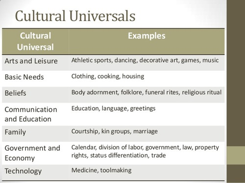

<!--
author:   Dr. Thomas Gamboa Jr.

email:    LiaScript@web.de

version:  0.0.1

language: en

narrator: US English Female

comment:  ...

logo:     ../cover.jpg

tags:      sociology

-->

# EPISD Sociology

> This document was automatically translated to LiaScript from
>
> https://flexbooks.ck12.org/user:8465b489d911/cbook/episd-sociology/section/1.1/primary/lesson/examining-social-life/

## 1.1 EXAMINING SOCIAL LIFE

<article>

**Objectives**

Describe how sociology is and explain what it means to have a sociological imagination

Explain how sociology is similar to and different from other social sciences.

Describe how the field of sociology developed.

Explain how the three main theoretical perspectives in sociology differ in their focus.

**Universal Generalizations**

Sociology is a science because it uses scientific data to make and draw conclusions.

Sociology has its place among other Social Sciences, Anthropology, Psychology, Social Psychology, Economics, Political Science, and History.

**Guiding Questions**

What is sociology and why should it be studied?

What are the main theories and theorists that make up the field of sociology?

What is the sociological perspective?

What does it mean to have a sociological imagination?

### ****Introduction to Sociology****

_Sociologists learn about society as a whole while studying one-to-one and group interactions. (Photo courtesy of Robert S. Donovan/flickr)_

A dictionary defines sociology as the systematic study of society and social interaction. The word “sociology” is derived from the Latin word _socius_ (companion) and the Greek word _logos_ (study of), meaning “the study of companionship.” While this is a starting point for the discipline, sociology is actually much more complex. It uses many different methods to study a wide range of subject matter and to apply these studies to the real world.

Sociologists study all aspects and levels of society. A society is a group of people whose members interact, reside in a definable area, and share a culture. A culture includes the group’s shared practices, values, and beliefs. One sociologist might analyze video of people from different societies as they carry on everyday conversations to study the rules of polite conversation from different world cultures. Another sociologist might interview a representative sample of people to see how texting has changed the way they communicate. Yet another sociologist might study how migration determined the way in which language spread and changed over time. A fourth sociologist might be part of a team developing signs to warn people living thousands of years in the future, and speaking many different languages, to stay away from still-dangerous nuclear waste.

Sociology is a relatively new discipline in comparison to chemistry, math, biology, philosophy and other disciplines that trace back thousands of years. Sociology began as an intellectual/philosophical effort by a French man named Auguste Comte (born 1798 and died 1857). He is considered the founder of sociology and coined "Sociology."

The field of sociology focuses on human social behavior from a group perspective. Students learn about the development of sociology and the three major theoretical perspectives that form the basis of the field today.

Why did thinkers of the day find a need for a new science of sociology? Societies had change in unprecedented ways and had formed a new collection of social complexities that the world had never witnessed before. Western Europe was transformed by the **Industrial Revolution**, a technological development of knowledge and manufacturing that began in the late 1600s and continued until the early 1900s. The Industrial Revolution transformed society at every level. Look at Table 1 below to see pre and post-Industrial Revolution social patterns and how different they were.

###### Table 1. Pre-Industrial and Post-Industrial Revolution Social Patterns

| Pre-Industrial Revolution | Post-Industrial Revolution |
| --- | --- |
| Farm/ Cottage | Factories |
| Family Work | Breadwinners /Homemakers |
| Small Towns | Large Cities |
| Large Families | Small Families |
| Homogamous Towns | Heterogamous Cities |
| Lower Standards of Living | Higher Standards of Living |
| People Died Younger | Peopled died older |

© 2014 Ron J. Hammond, Ph.D.

Prior to the Industrial Revolution, families lived on smaller farms and every able member of the family did work to support and sustain the family economy. Towns were small and very similar (homogamy) and families were large (more children=more workers). There was a lower standard of living and because of poor sanitation people died earlier.

After the Industrial Revolution, farm work was replaced by factory work. Men left their homes and became breadwinners earning money to buy many of the goods that used to be made by hand at home (or bartered for by trading one's own homemade goods with another's). Women became the supervisors of homework. Much was still done by families to develop their own home goods while many women and children also went to the factories to work. Cities became larger and more diverse (heterogamy). Families became smaller (less farm work required fewer children). Eventually, standards of living increased and death rates declined.

These pre and post-industrial changes impacted all of Western civilization because the Industrial Revolution hit all of these countries about the same way: Western Europe, United States, Canada, and later Japan and Australia. The Industrial Revolution brought some rather severe social conditions which included: deplorable city living conditions; crowding; crime; extensive poverty; inadequate water and sewage; early death, frequent accidents, and high illness rates. The new social problems required a new science that was unique from any scientific disciplines of the day. Comte wanted a strong scientific basis for sociology, but because of various distractions he never quite established it. After the Industrial Revolution, farm work was replaced by factory work. Men left their homes and became breadwinners earning money to buy many of the goods that used to be made by hand at home (or bartered for by trading one's own homemade goods with another's). Women became the supervisors of homework. Much was still done by families to develop their own home goods while many women and children also went to the factories to work. Cities became larger and more diverse (heterogamy). Families became smaller (less farm work required fewer children). Eventually, standards of living increased and death rates declined.

http://[freesociologybooks.com/Introduction\_To\_Sociology/01\_History\_and\_Introduction.php](http://freesociologybooks.com/Introduction_To_Sociology/01_History_and_Introduction.php)

### What Are Society and Culture?

Sociologists study all aspects and levels of society. A society is a group of people whose members interact, reside in a definable area, and share a culture. A culture includes the group’s shared practices, values, and beliefs. One sociologist might analyze video of people from different societies as they carry on everyday conversations to study the rules of polite conversation from different world cultures. Another sociologist might interview a representative sample of people to see how texting has changed the way they communicate. Yet another sociologist might study how migration determined the way in which language spread and changed over time. A fourth sociologist might be part of a team developing signs to warn people living thousands of years in the future, and speaking many different languages, to stay away from still-dangerous nuclear waste.

### The Sociological Imagination

Sociology differs from other social sciences in the way it examines all aspects of the social world, from relationships between individuals, to groups, organizations, and large institutions like the family, religion, the economy, nation states, education, science, sports, the arts, and all other aspects of social life. In doing this, it seeks to promote what C. Wright Mills called “the sociological imagination.”http://www.asanet.org/introtosociology/TeacherResources/IMForUnitI.html

Although these studies and the methods of carrying them out are different, the sociologists involved in them all have something in common. Each of them looks at society using what pioneer sociologist C. Wright Mills called the sociological imagination, sometimes also referred to as the sociological lens or sociological perspective. Mills definedsociological imaginationas how individuals understand their own and others’ pasts in relation to history and social structure (1959).

By looking at individuals and societies and how they interact through this lens, sociologists are able to examine what influences behavior, attitudes, and culture. By applying systematic and scientific methods to this process, they try to do so without letting their own biases and pre-conceived ideas influence their conclusions.

http://cnx.org/contents/afe4332a-c97f-4fc4-be27-4e4d384a32d8@7.21:3/What-Is-Sociology

  

Most Americans probably agree that we enjoy a great amount of freedom. And yet perhaps we have less freedom than we think, because many of our choices are influenced by our society in ways we do not even realize. Perhaps we are not as distinctively individualistic as we believe we are.

Yes, Americans have freedom, but our freedom to think and act is constrained at least to some degree by society’s standards and expectations and by the many aspects of our social backgrounds. This is true for the kinds of important beliefs and behaviors just discussed, and it is also true for less important examples. For instance, think back to the last class you attended. How many of the women wore evening gowns? How many of the men wore skirts? Students are “allowed” to dress any way they want in most colleges and universities, but notice how few students, if any, dress in the way just mentioned. They do not dress that way because of the strange looks and even negative reactions they would receive.

Think back to the last time you rode in an elevator. Why did you not face the back? Why did you not sit on the floor? Why did you not start singing? Children can do these things and “get away with it,” because they look cute doing so, but adults risk looking odd. Because of that, even though we are “allowed” to act strangely in an elevator, we do not.

The basic point is that society shapes our attitudes and behavior even if it does not determine them altogether. We still have freedom, but that freedom is limited by society’s expectations. Moreover, our views and behavior depend to some degree on our social location in society—our gender, race, social class, religion, and so forth. Thus society as a whole and our own social backgrounds affect our attitudes and behaviors. Our social backgrounds also affect one other important part of our lives, and that is ourlife chances—our chances (whether we have a good chance or little chance) of being healthy, wealthy, and well educated and, more generally, of living a good, happy life.

The influence of oursocial environmentin all of these respects is the fundamental understanding thatsociology—the scientific study of social behavior and social institutions—aims to present. At the heart of sociology is thesociological perspective, the view that our social backgrounds influence our attitudes, behavior, and life chances. In this regard, we are not just individuals but rather_social beings_deeply enmeshed in society. Although we all differ from one another in many respects, we share with many other people basic aspects of our social backgrounds, perhaps especially gender, race and ethnicity, and social class. These shared qualities make us more similar to each other than we would otherwise be.

Doessocietytotally determine our beliefs, behavior, and life chances? No. Individual differences still matter, and disciplines such as psychology are certainly needed for the most complete understanding of human action and beliefs. But if individual differences matter, so do society and the social backgrounds from which we come. Even the most individual attitudes and behaviors, such as the voting decisions discussed earlier, are influenced to some degree by our social backgrounds and, more generally, by the society to which we belong.

http://2012books.lardbucket.org/books/sociology-comprehensive-edition/s04-01-the-sociological-perspective.html

  

### Studying Patterns: How Sociologists View Society

All sociologists are interested in the experiences of individuals and how those experiences are shaped by interactions with social groups and society as a whole. To a sociologist, the personal decisions an individual makes do not exist in a vacuum. Cultural patterns and social forces put pressure on people to select one choice over another. Sociologists try to identify these general patterns by examining the behavior of large groups of people living in the same society and experiencing the same societal pressures.

The recent turmoil in the U.S. housing market and the high rate of foreclosures offer an example of how a sociologist might explore social patterns. Owning a home has long been considered an essential part of the American Dream. People often work for years to save for a down payment on what will be the largest investment they ever make. The monthly mortgage is often a person’s largest budget item. Missing one or more mortgage payments can result in serious consequences. The lender may foreclose on the mortgage and repossess the property. People may lose their homes and may not be able to borrow money in the future. Walking away from the responsibility to pay debts is not a choice most people make easily.

About three million homes were repossessed in the United States between 2006 and 2011. Experts predict the number could double by 2013 (Levy and Gop 2011). This is a much higher rate than the historical average. What social factors are contributing to this situation, and where might sociologists find patterns? Do Americans view debt, including mortgages, differently than in the past? What role do unemployment rates play? Might a shift in class structure be an influential factor? What about the way major economic players operate?

To answer these questions, sociologists will look beyond individual foreclosures at national trends. They will see that in recent years unemployment has been at record highs. They will observe that many lenders approved subprime mortgages with adjustable rates that started low and ballooned. They may look into whether unemployment and lending practices were different for members of different social classes, races, or genders. By analyzing the impact of these external conditions on individuals’ choices, sociologists can better explain why people make the decisions they do.

Risky bank loans, falling housing prices, and high unemployment can result in higher foreclosure rates. (Photo courtesy of Jeff Turner/flickr)

http://cnx.org/contents/afe4332a-c97f-4fc4-be27-4e4d384a32d8@7.21:3/What-Is-Sociology

**Section summary**

Sociology is a social science that looks at human society. Viewing the world from a sociological perspective enables sociologists to see beyond commonly held beliefs to the hidden meanings behind human actions. Social upheaval in Europe during the late 1700s and 1800s encouraged scholars to closely study society. Their work led to the development of the academic discipline of sociology. Sociology employs three major theoretical perspectives—functionalism, which focuses on order and stability; conflict, which focuses on power relations; and interactionism, which focuses on how individuals interact with one another in everyday life. Sociologists use several approaches to conduct research. Regardless of the approaches they use, all sociologists follow a seven-step process.

[http://study.com/academy/lesson/what-is-sociology-definition-themes-careers-in-sociology.html](http://study.com/academy/lesson/what-is-sociology-definition-themes-careers-in-sociology.html "Sociology what is it?")

!?[0](https://www.youtube.com/watch?v=LK5J0-cM-HE)

&lt;iframe width="420" height="315" src="https://www.youtube.com/embed/LK5J0-cM-HE" frameborder="0" allowfullscreen&gt;&lt;/iframe&gt;

</article>

## 1.2 SOCIOLOGY THEN AND NOW

<article>

**Objectives**

Describe how the field of sociology developed as a distinct area of study.

Explain how the three main theoretical perspectives in sociology differ.

**Universal Generalizations**

The nature of social life and human interaction has been of interest to scholars throughout history.

Rapid growth of urban populations created a great deal of social problems.

Sociology emerged in the 1800’s mainly in France, Germany, and England.

**Guiding Questions**

How does sociology emerge as a field of study?

Describe the major contributions made by the early sociologists.

Explain the three main theoretical perspectives that form the basis of modern sociology.

### Core Founders of Sociology

Emile Durkheim (1858-1917) was the first to take a position in a university and because of the scientific journal he edited, L'Anné Sociologique (the sociological year) and his scientific work, he was able to help sociology to become part of higher education's academic culture. He was also French and took the first position at a university as a sociology professor.

Durkheim discussed **Social Facts**, a phenomena within society that typically exists independent of individual choices and actions. Durkheim approached a subject that most thought of as being exclusively individualistic in nature-suicide. But, he defined suicide from a social fact perspective which helped him to establish the unique wisdom of sociological analysis.

Karl Marx (1818-1883) was an influential person in the development of sociology as a strong academic discipline. He was not a sociologist. He was an economist, philosopher, and revolutionary. Marx was born in Germany and his writings on the class struggles that existed in society wherein the poor masses are exploited by the few wealthy elite still apply today (perhaps even more so than in his day). His philosophy and the timing of his writings helped early sociologists in the development of social theories and scientific approaches.

Another key German founder of sociology was Max Weber (pronounced vey-bur) (1864-1920). He was a very intelligent person who strongly influenced the development of sociology and taught some of the other early sociologists of his day. Weber studied economics and his work gave balance to Karl Marx's extreme ideas. He studied religion and the economy and published a work called, "The Protestant Ethic and the Spirit of Capitalism." He also studied bureaucracies and defined Ideal Type as the abstract description of a social phenomenon by which actual social phenomena may be compared (You'll see an ideal type in Chapter 9 on caste versus class economic systems). Ideal Types are given as hypothetical examples and we can compare current economic systems to them.

Another early sociologist was a British man named Herbert Spencer (1820-1903). Herbert is remembered for his failed ideas about survival of the fittest in society (not the animal kingdom). He is most remembered for the sociology that wasn't. In other words, he believed that survival of the fittest applied to classes within society and that the wealthy aristocrats were the fittest. Whatever the wealthy people did was in effect better for society in the long run. The problem with his philosophy is that it was not supported by scientific inquiry. In fact his complex ideas were interesting, but not a good explanation of social processes and their causes when put to scientific rigors.

Sociology began in France, Germany, the United Kingdom, and then the United States. Sociology waxed and waned in popularity outside of the US over its short history. Today, sociology has become a United States-centered scientific discipline with most sociologists living in the US. There is significant sociological work being done in various countries of the world, but most of the 14,000 members of the American Sociological Association (the world's largest professional sociology organization) live in the US.

**The Three Main Sociological Perspectives**

From Mooney, Knox, and Schacht, 2007. _Understanding Social Problems, 5th edition_

Theories in sociology provide us with different perspectives with which to view our social world. A perspective is simply a way of looking at the world. A theory is a set of interrelated propositions or principles designed to answer a question or explain a particular phenomenon; it provides us with a perspective. Sociological theories help us to explain and predict the social world in which we live. Sociology includes three major theoretical perspectives: the functionalist perspective, the conflict perspective, and the symbolic interactionist perspective (sometimes called the interactionist perspective, or simply the micro view). Each perspective offers a variety of explanations about the social world and human behavior.

**Functionalist Perspective**

The functionalist perspective is based largely on the works of Herbert Spencer, Emile Durkheim, Talcott Parsons, and Robert Merton. According to functionalism, society is a system of interconnected parts that work together in harmony to maintain a state of balance and social equilibrium for the whole. For example, each of the social institutions contributes important functions for society: Family provides a context for reproducing, nurturing, and socializing children; education offers a way to transmit a society’s skills, knowledge, and culture to its youth; politics provides a means of governing members of society; economics provides for the production, distribution, and consumption of goods and services; and religion provides moral guidance and an outlet for worship of a higher power.

The functionalist perspective emphasizes the interconnectedness of society by focusing on how each part influences and is influenced by other parts. For example, the increase in singleparent and dual-earner families has contributed to the number of children who are failing in school because parents have become less available to supervise their children’s homework. As a result of changes in technology, colleges are offering more technical programs, and many adults are returning to school to learn new skills that are required in the workplace. The increasing number of women in the workforce has contributed to the formulation of policies against sexual harassment and job discrimination.

Functionalists use the terms functional and dysfunctional to describe the effects of social elements on society. Elements of society are functional if they contribute to social stability and dysfunctional if they disrupt social stability. Some aspects of society can be both functional and dysfunctional. For example, crime is dysfunctional in that it is associated with physical violence, loss of property, and fear. But according to Durkheim and other functionalists, crime is also functional for society because it leads to heightened awareness of shared moral bonds and increased social cohesion.

Sociologists have identified two types of functions: manifest and latent (Merton 1968). Manifest functions are consequences that are intended and commonly recognized. Latent functions are consequences that are unintended and often hidden. For example, the manifest function of education is to transmit knowledge and skills to society’s youth. But public elementary schools also serve as babysitters for employed parents, and colleges offer a place for young adults to meet potential mates. The baby-sitting and mate-selection functions are not the intended or commonly recognized functions of education; hence they are latent functions.

**Conflict Perspective**

The functionalist perspective views society as composed of different parts working together. In contrast, the conflict perspective views society as composed of different groups and interest competing for power and resources. The conflict perspective explains various aspects of our social world by looking at which groups have power and benefit from a particular social arrangement. For example, feminist theory argues that we live in a patriarchal society—a hierarchical system of organization controlled by men. Although there are many varieties of feminist theory, most would hold that feminism “demands that existing economic, political, and social structures be changed” (Weir and Faulkner 2004, p.xii).

The origins of the conflict perspective can be traced to the classic works of Karl Marx. Marx suggested that all societies go through stages of economic development. As societies evolve from agricultural to industrial, concern over meeting survival needs is replaced by concern over making a profit, the hallmark of a capitalist system. Industrialization leads to the development of two classes of people: the bourgeoisie, or the owners of the means of production (e.g., factories, farms, businesses); and the proletariat, or the workers who earn wages.

The division of society into two broad classes of people—the “haves” and the “havenots”— is beneficial to the owners of the means of production. The workers, who may earn only subsistence wages, are denied access to the many resources available to the wealthy owners. According to Marx, the bourgeoisie use their power to control the institutions of society to their advantage. For example, Marx suggested that religion serves as an “opiate of the masses” in that it soothes the distress and suffering associated with the working-class lifestyle and focuses the workers’ attention on spirituality, God, and the afterlife rather than on such worldly concerns as living conditions. In essence, religion diverts the workers so that they concentrate on being rewarded in heaven for living a moral life rather than on questioning their exploitation.

**Symbolic Interactionist Perspective**

Both the functionalist and the conflict perspectives are concerned with how broad aspects of society, such as institutions and large social groups, influence the social world. This level of sociological analysis is called macro sociology: It looks at the big picture of society and suggests how social problems are affected at the institutional level.

Micro sociology, another level of sociological analysis, is concerned with the social psychological dynamics of individuals interacting in small groups. Symbolic interactionism reflects the micro-sociological perspective, and was largely influenced by the work of early sociologists and philosophers, such as George Simmel, Charles Cooley, George Herbert Mead, and Erving Goffman. Symbolic interactionism emphasizes that human behavior is influenced by definitions and meanings that are created and maintained through symbolic interaction with others.

Sociologist W.I. Thomas (1966) emphasized the importance of definitions and meanings in social behavior and its consequences. He suggested that humans respond to their definition of a situation rather than to the objective situation itself. Hence Thomas noted that situations that we define as real become real in their consequences.

Social Interactionism also suggests that our identity or sense of self is shaped by social interaction. We develop our self-concept by observing how others interact with us a label us. By observing how others view us, we see a reflection ourselves that Cooley calls the “looking glass self.” 

Sociology emerged as a field of study as a result of the effects of the Industrial Revolution. European countries such as France, Germany, and England were greatly affected by this revolution. Leading founders of sociology contributed greatly to study of sociology. Three theoretical perspectives: functionalist perspective, conflict perspective, and interacionists perspective help to create the basis of what would become modern sociology.

Theory Snapshot

| Theoretical perspective | Major assumptions |
| --- | --- |
| Functionalism | Social stability is necessary to have a strong society, and adequate socialization and social integration are necessary to achieve social stability. Society’s social institutions perform important functions to help ensure social stability. Slow social change is desirable, but rapid social change threatens social order. Functionalism is a macro theory. |
| Conflict theory | Society is characterized by pervasive inequality based on social class, gender, and other factors. Far-reaching social change is needed to reduce or eliminate social inequality and to create an egalitarian society. Conflict theory is a macro theory. |
| Symbolic interactionism | People construct their roles as they interact; they do not merely learn the roles that society has set out for them. As this interaction occurs, individuals negotiate their definitions of the situations in which they find themselves and socially construct the reality of these situations. In so doing, they rely heavily on symbols such as words and gestures to reach a shared understanding of their interaction. Symbolic interactionism is a micro theory. |

http://2012books.lardbucket.org/books/sociology-comprehensive-edition/s04-03-theoretical-perspectives-in-so.html

!?[0](https://www.youtube.com/watch?v=XfKQ-ozKktM)

</article>

## 2.1 THE MEANING OF CULTURE

<article>

**Objective**

Define the meaning of the term culture and explain how material culture and nonmaterial culture differ.

Describe the basic components of culture.

**Universal Generalizations**

Culture is the shared products of human groups. Products can be physical objects and also the beliefs, values, and behaviors that are shared by the group. Cultures have specific components such as technology, symbols, values, language, and norms.

**Guiding Questions**

Describe the key components of culture and give an example of each.

What are cultural universals?

How are cultures similar?

How are cultures different?

### The Meaning of Culture

Culture was defined earlier as the symbols, language, beliefs, values, and artifacts that are part of any society. As this definition suggests, there are two basic components of culture: ideas and symbols on the one hand and artifacts (material objects) on the other. The first type, called nonmaterial culture, includes the values, beliefs, symbols, and language that define a society. The second type, called material culture, includes all the society’s physical objects, such as its tools and technology, clothing, eating utensils, and means of transportation.

It is estimated by the Encyclopedia of World Cultures that there are about 500+ unique cultures on the earth in our modern world (Gall, T. L. 1997 Gale Pub). This reference manual addresses the following unique characteristics of these cultures: historical origins; location; language; folklore; religion; major holidays; rites of passage; interpersonal relations; living conditions; family; clothing; food; education; heritage; work; sports; entertainment ; crafts and hobbies; and social problems. It is obvious that cultures are complex and require focused efforts to be properly understood. The US’s Central Intelligence Agency produces a free online book called the World Factbook ([SOURCE](https://www.cia.gov/library/publications/the-world-factbook/)). In 2014 the CIA estimated 267 world entities which make up the mosaic of existing countries worldwide.

Enclosed is a summary from the CIA World Factbook. This shows you a quick snapshot of the social structures that underlie our very populated world and the 500+ cultures in it. In Table 1 you can see that collectively Christians make up about one-third of the world populations. But, for the first time ever, Muslims at 23 percent represent the largest religion having surpassed the Roman Catholic Church. The Muslim faith (Islam) grows rapidly because Muslims often practice polygamy and have a higher birthrate than parents in other religions.

##### Table 1: Religions of the World 2010 (Estimated by CIA)\*

* Christians all combined 33.39%
    * Roman Catholics 16.85%
    * Protestants 6.15%
    * Orthodox 3.96%
    * Anglicans 1.26%
* Muslims 22.74%
* Hindus 13.8%
* Buddhists 6.77%
* Sikhs 0.35%
* Jews 0.22%
* Baha’is 0.11%
* Other 10.95%
* Non-religious 9.66%
* Atheists 2.01%

\*Retrieved 16 June 2014 from World data found in CIA World Factbook https://www.cia.gov/library/publications/the-world-factbook/geos/xx.html In Table 2 you can see the commonality of Chinese, Spanish, and English.

Although the 12.44 percent does not appear to be very high, keep in mind that it’s 12.44 percent of 7+ billion. China has 1.3 billion inhabitants and comprises roughly 1 out of 6 people on the planet (India has about 1.2 billion and almost the same percentage of the world population). Many languages are not listed because there are thousands of dialects and local variations on these major languages. China with 1.3 billion has two forms of Chinese language: Mandarin and Cantonese. Sheer massive numbers in populations speaking Chinese explain part of the data below.

##### Table 2: Languages of the World 2009 (Estimated by CIA)\*

| Language | Percent who Speak it World-wide |
| --- | --- |
| Mandarin Chinese            12.44% |     |
| Spanish    4.85% |     |
| English 4.83% |     |
| Arabic 3.25% |     |
| Hindi 2.68% |     |
| Bengali 2.66% |     |
| Portuguese                2.62% |     |
| Russian 2.12% |     |
| Japanese 1.8% |     |
| Standard German 1.33% |     |
| Japanese 1.25% |     |

\*Retrieved 16 June 2014 from World data found in CIA World Factbook https://www.cia.gov/library/publications/the-world-factbook/geos/xx.html

Table 3 shows that the world’s population has exploded in the last century and continues to grow rapidly. Never in the history of this world have so many numbers of people lived at the same time with so many co-existing and equally valid cultural heritages. World Population Grows 19.97 births per 1,000 - 8.32 deaths per 1,000= 11.65 natural increase (net growth) and you can see simulated real-time population growth chart at http://www.worldometers.info/ . The world’s population is continuing to grow.

There are clear patterns of growth in the world’s largest countries. For example, Figure 1 lists the 10 most populated countries of the world in 2013 with estimates for future population in 2050. The US ranks 3rd in 2013, but Nigeria makes a jump from 7th to 3rd in 2050 moving the US to rank 4th in population. Interestingly, in 2050, India will rank 1st and China 2nd. Also of interest is the fact that in 2050 the US is the only Western country in the list.

### Figure 1. The Ten Most Populated Countries in the World, 2013 and 2050. 

\*Retrieved 21 May, 2014 from Population Reference Bureau Population Data Sheet [SOURCE](http://www.prb.org/pdf13/2013-population-data-sheet_eng.pdf)

Between 2013 and 2050 the top ten largest countries in the world will be non-Western in nature. Table 3 shows that the males and females are not equally distributed throughout the world’s population. In the childhood years there are more males (about 62 million more). In the working years of 15-64 there are 53 million more males. But, in the 65 and older age group, there are far more females with 65 million more. By the time people age into the later years males have died off sooner than females and we find that the worldwide aging experience is dominated more by the female rather than male experience.

### The Components of Culture

There are five major components of culture that all cultures have in common. These include symbols, language, technology, values, and norms.

### Symbols

Every culture is filled with symbols, or things that stand for something else and that often evoke various reactions and emotions. Some symbols are actually types of nonverbal communication, while other symbols are in fact material objects.

Figure 2.3

##### © Thinkstock

##### _The meaning of a gesture may differ from one society to another. This familiar gesture means “OK” in the United States, but in certain parts of Europe it signifies an obscenity. An American using this gesture might very well be greeted with an angry look._

Let’s look at nonverbal symbols first. A common one is shaking hands, which is done in some societies but not in others. It commonly conveys friendship and is used as a sign of both greeting and departure. Probably all societies have nonverbal symbols we call gestures, movements of the hand, arm, or other parts of the body that are meant to convey certain ideas or emotions. However, the same gesture can mean one thing in one society and something quite different in another society (Axtell, 1998).Axtell, R. E. (1998). _Gestures: The do’s and taboos of body language around the world_. New York, NY: Wiley. In the United States, for example, if we nod our head up and down, we mean yes, and if we shake it back and forth, we mean no. In Bulgaria, however, nodding means no, while shaking our head back and forth means yes! In the United States, if we make an “O” by putting our thumb and forefinger together, we mean “OK,” but the same gesture in certain parts of Europe signifies an obscenity. “Thumbs up” in the United States means “great” or “wonderful,” but in Australia it means the same thing as extending the middle finger in the United States. Certain parts of the Middle East and Asia would be offended if they saw you using your left hand to eat, because they use their left hand for bathroom hygiene.

Some of our most important symbols are objects. Here the U.S. flag is a prime example. For most Americans, the flag is not just a piece of cloth with red and white stripes and white stars against a field of blue. Instead, it is a symbol of freedom, democracy, and other American values and, accordingly, inspires pride and patriotism. During the Vietnam War, however, the flag became to many Americans a symbol of war and imperialism. Some burned the flag in protest, prompting angry attacks by bystanders and negative coverage by the news media.

Other objects have symbolic value for religious reasons. Three of the most familiar religious symbols in many nations are the cross, the Star of David, and the crescent moon, which stand for Christianity, Judaism, and Islam, respectively. Whereas many cultures attach no religious significance to these shapes, for many people across the world they evoke very strong feelings of religious faith. Recognizing this, hate groups have often desecrated these symbols.

As these examples indicate, shared symbols, both nonverbal communication and tangible objects, are an important part of any culture but also can lead to misunderstandings and even hostility. These problems underscore the significance of symbols for social interaction and meaning.

### Language

Perhaps our most important set of symbols is language. In English, the word _chair_ means something we sit on. In French, the word _chaise_ means the same thing. As long as we agree how to interpret these words, a shared language and thus society are possible. By the same token, differences in languages can make it quite difficult to communicate. For example, imagine you are in a foreign country where you do not know their language and they do not know yours. Worse yet, you forgot to bring your dictionary that translates their language into yours, and vice versa, and your iPhone battery has died. You become lost. How will you get help? What will you do? Is there any way to communicate your plight?

As this scenario suggests, language is crucial to communication and thus to any society’s culture. Children learn language from their culture just as they learn about shaking hands, about gestures, and about the significance of the flag and other symbols. Humans have a capacity for language that no other animal species possesses. Our capacity for language in turn helps make our complex culture possible.

Figure 2.4

© Thinkstock

##### _Language is a key symbol of any culture. Humans have a capacity for language that no other animal species has, and children learn the language of their society just as they learn other aspects of their culture._

In the United States, some people consider a common language so important that they advocate making English the official language of certain cities or states or even the whole country and banning bilingual education in the public schools (Ray, 2007).Ray, S. (2007). Politics over official language in the United States. _International Studies, 44,_ 235–252. Critics acknowledge the importance of English but allege that this movement smacks of anti-immigrant prejudice and would help destroy ethnic subcultures. In 2009, voters in Nashville, Tennessee, rejected a proposal that would have made English the city’s official language and required all city workers to speak in English rather than their native language (Brown, 2009).Brown, R. (2009, January 24). Nashville voters reject a proposal for English-only. _The New York Times_, p. A12.

Language, of course, can be spoken or written. One of the most important developments in the evolution of society was the creation of written language. Some of the preindustrial societies that anthropologists have studied have written language, while others do not, and in the remaining societies the “written” language consists mainly of pictures, not words.

### **Technology**

**Technology** is the application of scientific knowledge to the making of tools to solve specific problems. Technological advances such as automobiles, airplanes, radio, television, cellular phones, computers, modems, and fax machines have brought major advances and changes to the world. Indeed, 20th century technology has completely—and irreversibly—changed the way people meet, interact, learn, work, play, travel, worship, and do business. Technological information increases exponentially: The entire database of scientific knowledge doubles every several years. This “technological explosion” is due in part to an “Information explosion,” as well as to advances in storage, retrieval, and communication of data. In other words, a cycle occurs: Improvements in technology lead to increases in knowledge and information and, thus, to uncovering the means to create better technology. Consequently, sociologists are concerned with how technological societies will be forced to adapt to the social changes that improvements in technology will continue to bring. (http://www.cliffsnotes.com/sciences/sociology/social-change-and-movements/technology-and-social-change)

### Values

Figure 2.10

© Thinkstock

##### _American culture promotes competition and an emphasis on winning in the sports and business worlds and in other spheres of life. Accordingly, lawsuits over frivolous reasons are common and even expected_.

Values are another important element of culture and involve judgments of what is good or bad and desirable or undesirable. A culture’s values shape its norms. The kinds of values a group holds important will determine the character of its people and the types of material and nonmaterial culture the group will create. In Japan, for example, a central value is group harmony. The Japanese place great emphasis on harmonious social relationships and dislike interpersonal conflict. Individuals are fairly unassertive by American standards, lest they be perceived astrying to force their will upon others (Schneider & Silverman, 2010).Schneider, L., & Silverman, A. (2010).

### Norms

Norms are created by all cultures to enforce their cultural values. Cultures differ widely in their norms, or standards and expectations for behaving in specific situations. We already saw that how people behave when drunk stems from society’s expectations of how they should behave when drunk. Norms of drunken behavior influence how we behave when we drink too much.

Norms are often divided into two types, formal norms and informal norms. Formal norms, also called _mores_ (MOOR-ays) and _laws_, refer to the standards of behavior considered the most important in any society. Examples in the United States include traffic laws, criminal codes, and, in a college context, student behavior codes addressing such things as cheating and hate speech. Informal norms, also called _folkways_ and _customs_, refer to standards of behavior that are considered less important but still influence how we behave. Table manners are a common example of informal norms, as are such everyday behaviors as how we interact with a cashier and how we ride in an elevator.

[http://2012books.lardbucket.org/books/sociology-comprehensive-edition/s06-02-the-elements-of-culture.html](http://2012books.lardbucket.org/books/sociology-comprehensive-edition/s06-02-the-elements-of-culture.html%20%20)

!?[0](https://www.youtube.com/watch?v=tOEz6RC0aVo)

http://study.com/academy/lesson/what-is-culture-material-and-nonmaterial-culture.html

[http://study.com/academy/lesson/material-culture-in-sociology-definition-studies-examples.html](http://study.com/academy/lesson/material-culture-in-sociology-definition-studies-examples.html "Culture")

[http://study.com/academy/lesson/elements-of-culture-definitions-and-ideal-real-culture.html](http://study.com/academy/lesson/elements-of-culture-definitions-and-ideal-real-culture.html "Elements of culture")

</article>

## 2.2 CULTURAL VARIATION

<article>

**Objectives**

Students will be able to describe cultural universals and explain why they exist.

Explain what the terms ethnocentrism and cultural relativism mean.

Identify and explain the factors that account for variations among and within cultures.

**Universal Generalizations**

Cultures have certain characteristics in common because all societies must develop certain features to ensure their accomplishments.

In order to hold an open mind toward cultural variations, cultures must be judged by their own standards and not the standards of another culture.

**Guiding Questions**

What are cultural universals, and what is their significance?

What is ethno-centrism?

What is cultural relativism?

What factors account for variations among and within cultures?

### Understanding the Nature of Culture

Cultures are part of the human social experience. They are comparable to ice-cream flavors, each tends to be sweet and desirable while still having a vast variety of ingredients and textures. Yet, even though cultures tend to be universal and desirable, we often judge cultures as being "good, bad, or evil," with our own culture typically being judged good. We have to consider our perspective when engaging people from different cultures. Are we ethnocentric or culturally relativistic? Also before traveling consider your own values and stereotypes. A **Stereotype** is a broad generalization about groups based solely on the group affiliation. Although it will be discussed more in the Race chapter, stereotypes have to be managed, especially among ethnocentric persons.

**Culture** is the shared values, norms, symbols, language, objects, and way of life that is passed on from one generation to the next. Culture is what we learn from our parents, family, friends, peers, and schools. It is shared, not biologically determined. In other words, you are only born with drives, not culture.

**Values** are defined standards of what is good, bad, desirable, or undesirable for ourselves and others. Typical American values—considered for the entire nation and described by Williams, 1970 were: achievement and success; equality; individualism; racism and group superiority; activity and work ; education; efficiency and practicality; religiosity; progress; romantic love/monogamy; science and technology; equal opportunity; material comfort; nationalism/patriotism; humanitarianism; external conformity; freedom; and democracy and free enterprise (see Williams, R. M. (1970). American Society: A Sociological Interpretation, 3rd Ed. NY; Knopf). Do these collective values apply to your own personal values? It helps to do your homework about your country and your own personal values before you experience another culture.

Regardless of which culture a person grows up in, there are cultural universals which are for the most part common to all cultures. **Cultural Universals** are certain aspects of cultures which are found among peoples of all cultures throughout the world. All societies have universal social tasks which include the meeting of basic human needs such as breathing, eating, sleeping, drinking, having sex, and remaining safe. These universals include: adapting to and coping with physical environment; assigning of roles; controlling reproduction and relations between the sexes; communicating; maintaining some form of authorized government; and socializing children.

**https://www.google.com/search?q=cultural+universals&biw=1366&bih=599&source=lnms&tbm=isch&sa=X&ei=UhpZVcqSL43eoATw\_ILABg&ved=0CAYQ\_AUoAQ#tbm=isch&q=cultural+universals+examples&revid=538179073&imgrc=tPiaQ-uRIDvkEM%253A%3BxEsSuDZYgsdjbM%3Bhttp%253A%252F%252Fimage.slidesharecdn.com%252Fsociologyunit2powerpointfinal-140222063231-phpapp01%252F95%252Fsociology-unit-2-culture-and-society-21-638.jpg%253Fcb%253D1393050912%3Bhttp%253A%252F%252Fwww.slideshare.net%252FMrTimBradley%252Fsociology-unit-2-culture-and-society%3B638%3B479**

**Key Point**: You should never, ever be required to forfeit your own values in the pursuit of teachability, cultural relativism, and skilled cross-cultural relationships. If the typical US culture is more like your world-taken-for-granted and you travel to an equatorial country where they behave in a different manner, then your enthusiastic hand shaking, personal questioning, and space intrusions might land you in hot water (see Table 5 below). It’s best not to assume that a polite American also makes a polite Costa Rican and vice versa.

##### Table 5: Aren’t My Best Cultural Skills (the ones that work so well for me at Home) Good Enough to Interact Successfully in Another Culture? Perhaps not.

| Typical Mainstream US Cultural traits | Typical Equatorial Cultural Traits |
| --- | --- |
| \-Shake hands | \-Bow, Nod, or Gesture |
| \-Ask personal questions about family, friends, and health | \-Ask only general questions about weather and business |
| \-Speak informally by first names | \-Speak formally by titles and last names |
| \-Stand close to the other person | \-Stand at a distance |
| \-Pat other on back, shoulder, or arm | \-No touching at all |
| \-Men and/or women may speak to anyone | \-Men speak to men and women to women |

© 2008 Ron J. Hammond, Ph.D.

**Ethnocentrism** is the tendency to judge others based on our own experiences. In this perspective our culture is right while cultures which differ from our own are wrong.The fact of cultural diversity raises some important but difficult questions of ethnocentrism and cultural relativism.Ethnocentrism, the opposite view, refers to the tendency to judge another culture by the standards of our own and to the belief that our own culture is indeed superior to another culture. When we think of cow worship in India, it is easy to be amused by it and even to make fun of it. That is why anthropologist Marvin Harris’s analysis was so important, because it suggests that cow worship is in fact very important for the Indian way of life. **Culture Shock** is the disoriented feeling which occurs in the context of being in a new culture. It tends to leave over a few days or weeks and the greater the familiarity with the culture the less the shock

Another more valuable and helpful perspective about differing cultures is the perspective called **Cultural Relativism**, or the tendency to look for the cultural context in which differences in cultures occur. Cultural relativism refers to the belief that we should not judge any culture as superior or inferior to another culture. In this view, all cultures have their benefits and disadvantages, and we should not automatically assume that our own culture is better and “their” culture is worse. Cultural relativists like all the ice-cream flavors, if you will. They respect and appreciate cultural differences even if only from the spectators’ point of view. They tend to be teachable, child-like, and open-minded. They tend to enjoy or learn to enjoy the many varieties of the human experience.

An ethnocentric thinks on the level of carrot soup: peel carrots, and water, and boil. The cultural relativist tends to think on the level of a complex stew: peel and prepare carrots, potatoes, onions, mushrooms, broth, tofu, and 10 secret herbs and spices and simmer for 2 hours. The diversity of the human experience is what makes it rich and flavorful.

But, do cultural relativists have to accept all versions of morality, ethics, values, and traditions in order to be teachable? No, of course not. Anyone who is planning a trip to another community, state, or country would be wise to do their cultural homework and prepare in advance how they will immerse themselves into the parts of the culture that fit their value system. Always do your cultural homework before you travel even if you are just spending time across the state for a day. Remember that your best cultural skills may be antagonistic to those from other cultures.

A subculture refers to a group that shares the central values and beliefs of the larger culture but still retains certain values, beliefs, and norms that make it distinct from the larger culture. A good example of a U.S. subculture is the Amish, who live primarily in central Pennsylvania and parts of Ohio and shun electricity and other modern conveniences, including cars, tractors, and telephones. Their way of life is increasingly threatened by the expansion of non-Amish businesses and residences into Amish territory (Rifkin, 2009).Rifkin, G. (2009, January 8). The Amish flock from farms to small businesses. _The New York Times_, p. B3. Since the 1970s, development has cost Lancaster County, Pennsylvania—where many Amish live—thousands of acres of farming land. Some Amish families have moved to other states or left farming to start small businesses, where some do use cell phones and computers. Despite these concessions to modern development, for the most part the Amish live the way they always have. Most still do not drive cars or even ride bikes. The case of the Amish dramatically illustrates the persistence of an old-fashioned subculture and its uneasy fit with the larger, dominant culture.

The Amish in the United States are a subculture that shuns electricity and many other modern conveniences.

© Thinkstock

A counterculture is a group whose values and beliefs directly oppose those of the larger culture and even reject it. Perhaps the most discussed example of a counterculture is the so-called youth counterculture of the 1960s, often referred to as the hippies but also comprising many other young people who did not fit the “tuned-out” image of the hippies and instead were politically engaged against U.S. government policy in Vietnam and elsewhere (Roszak, 1969).Roszak, T. (1969). _The making of a counterculture_. Garden City, NY: Doubleday. A contemporary example of a U.S. counterculture is the survivalists, whose extreme antigovernment views and hoarding of weapons fit them into the counterculture category (Mitchell, 2002).Mitchell, R. G., Jr. (2002). _Dancing at Armageddon: Survivalism and chaos in modern times_. Chicago, IL: University of Chicago Press.

!?[0](https://www.youtube.com/watch?v=HDlnFKywddY)

&lt;iframe width="854" height="510" src="https://www.youtube.com/embed/HDlnFKywddY" frameborder="0" allowfullscreen&gt;&lt;/iframe&gt;

http://study.com/academy/lesson/cultural-variation-universalities-generalities-particularities.html

http://video.nationalgeographic.com/video/movies/cultural-differences-ggtu

!?[0](https://www.youtube.com/watch?v=XUO59Emi3eo)

!?[0](https://www.youtube.com/watch?v=UTE0G9amZNk)

### Key Takeaways

* Subcultures and countercultures are two types of alternative cultures that may exist amid the dominant culture.
* Cultural relativism and ethnocentrism are often in tension, and it is sometimes difficult to determine whether it is appropriate to condemn behaviors that one’s own culture finds repugnant but that another culture considers appropriate.

### For Your Review

1.  This section discussed the eating of dog meat in some other cultures. Many Americans and Europeans condemn this practice. Do you think it is appropriate to condemn eating dog meat, or do you think such criticism violates cultural relativism and is thus inappropriate? Explain your answer.

</article>

## 3.1 THE AMERICAN VALUE SYSTEM

<article>

**Universal Generalizations**

A nation’s history, political and economic systems contribute to the nation’s value system.

A society’s values change over time and new values emerge.

**Objectives**

Analyze the basic values that form the foundation of American culture.

Describe and explain new values that have developed in the United States since the 1970’s.

**Guiding Questions**

What are the basic values that form the foundation of American culture?

What new values have developed in the U.S. since the 1970’s?

How does a country’s history play a role in the values it develops?

Why might a country’s values change over time?

**Core American Values Professor Henry Schissler**

**Core American Values**

The United States, a pluralistic society, is made up of many different groups. They represent different political and social ideologies, religions and racial-ethnic groups, as well as countless thousands of interest groups that center around such divergent activities as collecting Barbie dolls and hunting quail.

But we do share core values (macro-level non-material culture). These values are generally assumed to be “the American way” and are taught to school children as morality and signs of good character. We are all socialized to believe in them through media presentations, political speeches, and in the workplace. Sociologist Robin Williams (no, not him) first identified these values in 1965.

1. Individualism (“Consistent Persistence”) Americans have traditionally prized success that comes from individual effort and initiative. They cherish the ideal that an individual can rise from the bottom of society to its very top. If someone fails to “get ahead,” Americans generally find fault with that individual, rather than with the social system for placing roadblocks in his or her path.

2. Achievement and Success (“Success Emphasis”) Americans place a high value on personal achievement, especially outdoing others. This value includes getting ahead at work and school, and attaining wealth, power, and prestige.

3. Activity and Work (“Work for Work’s Sake”) Americans expect people to work hard and to be busily engaged in some activity even when not at work.

4. Efficiency and Practicality Americans award high marks for getting things done efficiently. Even in everyday life, Americans consider it important to do things fast, and they constantly seek ways to increase efficiency.

5. Science and Technology Americans have a passion for applied science, for using science to control nature – to tame rivers and harness wind – and to develop new technology, from motorized scooters to talking computers.

6. Progress Americans expect rapid technological change. They believe that they should constantly build “more and better” gadgets that will help them move toward that vague goal called “progress.”

7. Material Comfort Americans expect a high level of material comfort. This comfort includes not only good nutrition, medical care, and housing, but also late-model cars and recreational playthings – from boats o computer games.

8. Humanitarianism Americans emphasize helpfulness, personal kindness, aid in mass disasters, and organized philanthropy.

9. Freedom This core value pervades U.S. life. It underscored the American Revolution, and Americans pride themselves on their personal freedom.

10. Democracy By this term, Americans refer to majority rule, to the right of everyone to express an opinion, and to representative government.

11. Equality It is impossible to understand Americans without being aware of the central role that the value of equality plays in their lives. Equality of opportunity has significantly influenced U.S. history and continues to mark relations between groups that make up U.S. society.

12. Racism and Group Superiority Although it contradicts freedom, democracy, and equality, Americans value some groups more than others and have done so throughout their history. The slaughter of Native Americans and the enslaving of Africans are the most notorious examples.

In 1975, Sociologist James Henslin updated Williams’ analysis be adding three values.

1. Education Americans are expected to go as far in school as their abilities and finances allow. Over the years, the definition of an “adequate” education has changed, and today a college education is considered an appropriate goal for most Americans. Those who have an opportunity for higher education and do not take it are sometimes viewed as doing something “wrong” – not merely as making a bad choice, but as somehow being involved in an immoral act.

2. Religiosity There is a feeling that “every true American ought to be religious.” This does not mean that everyone is expected to join a church, synagogue, or mosque, but that everyone ought to acknowledge a belief in a Supreme Being and follow some set of matching precepts. This value is so pervasive that Americans stamp “In God We Trust” on their money and declare in their national pledge of allegiance that they are “one nation under God.”

3. Romantic Love Americans feel that the only proper basis for marriage is romantic love. Songs, literature, mass media, and “folk beliefs” all stress this value. They especially love the theme that “love conquers all.” http://talkingsociology.blogspot.com/2008/05/core-american-values-handout.html

### **13 Commonly Held American Values**

By L. Robert Kohls [www.uku.fi/~paganuzz/xcult/values/Amer\_values.htm](http://www.uku.fi/~paganuzz/xcult/values/Amer_values.htm)

1. Personal control over the environment - Americans do not generally believe in the power of fate; they see this as superstitious and reflective of an unwillingness to take initiative. Life’s problems tend to be viewed as coming from one’s laziness or unwillingness to take responsibility, rather than from bad luck.

2. Change - Americans tend to see change as good, leading to development, improvement, and progress. More traditional cultures see change as destructive; they value stability and tradition.

3. Time - Time is of utmost importance to Americans. Time is something to be on, kept, filled, saved, lost, wasted, and even killed. Americans tend to be more concerned with getting things done on time than they are with interpersonal relationships. Americans stop discussions abruptly in order to make appointments on time and to be productive.

4. Equality and fairness - Equality is so valued in American culture that it is seen as having a religious basis. At least in theory, Americans believe that all people are created equal and that everyone should have equal opportunities.

5. Individualism and interdependence - Americans tend to view themselves as highly individualistic and resist being thought of as part of any homogenous group. Individualism leads to privacy, which most Americans highly value. It is interesting to note that the word for “privacy” does not even exist in many non- Western languages.

6. Self-help and initiative - Americans tend to take credit for accomplishments as individuals, and they tend to value the “self-made” man or woman.

7. Competition - Americans tend to believe that competition brings out the best in people, and “free enterprise” is valued in many areas of life.

8. Future orientation - Americans tend to value the future, devalue the past, and to an extent, are unaware of the present. Many Americans work so hard and think so much about their future that a perfectly happy present often goes unnoticed.

9. Action/work orientation - Americans tend to see any action as superior to inaction. Americans tend to schedule an active life and schedule in time for relaxation. Often the first question people ask each other when meeting is, “What do you do?” meaning what is their profession.

10. Informality - Americans are more informal than many other cultures. For example, many Americans call their bosses by their first names, dress is more casual attire, even at formal events, and even greetings are casual (e.g., “Hi” rather than, “Hello, how are you?”).

11. Directness, openness, and honesty - Americans tend to prefer the direct approach to delivering information, no matter how unpleasant. Americans tend to see honesty as most important, and anyone who uses an intermediary to deliver unpleasant information is seen as manipulative and untrustworthy.

12. Practicality and efficiency - The reputation of Americans is practical and efficient. They tend to value rational and objective decisions over emotional and subjective ones, and the pragmatic approach is the overwhelming philosophy.

13. Materialism and acquisitiveness - Foreigners tend to consider Americans to be very materialistic. Americans tend to give high priority to obtaining, maintaining, and protecting material objects, and they value newness and innovation. http://globalsojourns.com/imagedump/Giving%20Circle/travelarticles/American_Traits.pdf

Cultures have values that are largely shared by their members. The values of a [society](https://www.boundless.com/definition/society/) can often be identified by noting that which people receive, honor or respect.

Values are related to the norms of a culture, but they are more global and abstract than norms. Norms are rules for behavior in specific situations, while values identify what should be judged as either good or evil. Flying the national flag on a holiday is a norm, but it reflects the value of patriotism. Wearing dark clothing and appearing solemn are normative behaviors at a funeral; in certain cultures, they reflect the values of respect and support for friends and family.

Different cultures reflect different values. American culture includes both conservative and liberal elements, such as scientific and religious competitiveness, political structures, risk taking and free expression, materialist and moral elements. Aside from certain consistent ideological principles (e.g. individualism, egalitarianism and faith in freedom and [democracy](https://www.boundless.com/definition/democracy/)), American culture's geographical scale and demographic diversity has spawned a variety of expressions. The flexibility of U.S. culture and its highly [symbolic](https://www.boundless.com/definition/symbolic/) [nature](https://www.boundless.com/definition/nature/) lead some researchers to categorize American culture as a mythic [identity](https://www.boundless.com/definition/identity/), while others recognize it as American exceptionalism.

The Statue of Liberty

The Statue of Liberty symbolizes freedom, a fundamental American value.

Typical American values include achievement, success, equality, individualism, activity, work, education, efficiency, practicality, [religiosity](https://www.boundless.com/definition/religiosity/), progress, romance, monogamy, [science](https://www.boundless.com/definition/science/) and technology, [equal opportunity](https://www.boundless.com/definition/equal-opportunity/), materialism, [nationalism](https://www.boundless.com/definition/nationalism/) and patriotism, humanitarianism, external [conformity](https://www.boundless.com/definition/conformity/), freedom, democracy and free enterprise. These values are embraced by most Americans and enshrined in American [institutions](https://www.boundless.com/definition/institution/).

Declaration of IndependenceMany fundamental American values are derived from the Declaration of IndependenceSince the late 1970's, the terms "traditional values" and"family values" have become synonymous in the U.S., and imply a congruence with mainstream Christianity . However, the term "family values" is arguably a modern politicized subset of traditional values, which is a larger concept, anthropologically speaking. Although It is also not necessarily a political idea, it has become associated with both the [particular](https://www.boundless.com/definition/particular/) [correlation](https://www.boundless.com/definition/correlation/) between [Evangelicalism](https://www.boundless.com/definition/evangelicalism/) and [politics](https://www.boundless.com/definition/politics/) (as embodied by American politicians such as Ronald Reagan, Dan Quayle and George W. Bush), as well as the broader Christianity movement (as exemplified by Pat Robertson).  

  
Traditional values as "family values"?

Source: Boundless. “An Overview of U.S. Values.” _Boundless Sociology_. Boundless, 27 Jun. 2014. Retrieved 21 May. 2015 from https://www.boundless.com/sociology/textbooks/boundless-sociology-textbook/culture-3/culture-and-the-dominant-ideology-in-the-u-s-33/an-overview-of-u-s-values-205-6182/

  

  

!?[0](https://www.youtube.com/watch?v=U32J91NzpSw)

Edward Kain. _Innovative Techniques for Teaching Sociological Concepts._ American Sociological Association, Washington, DC, 1993.

Rushworth Kidder_. Shared Values for a Troubled World._

Benjamin Franklin’s 13 virtues he considered important for America

</article>

## 3.2 SOCIAL CONTROL

<article>

**Universal Generalizations**

Positive and negative sanctions differ in the punishment and rewards issued in each. The level of punishment and rewards systems also varies.

Social control is done by way of morals, ethics, religion, and legal systems.

**Guiding Questions**

How does internalization of norms help to stabilize society?

Explain the role sanctions play in the enforcement of norms?

**Objectives**

Analyze how norms are created and enforced.

Evaluate the need for positive and negative sanctions in society.

Describe the differences between formal and informal sanctions.

**Internalization of Norms**

**Norms** are shared expectations or rules of behavior. Norms are what are normal in a given social circumstance. For example, I lived in France for a year or so as a young man. The beaches were filled with completely naked swimmers (this is common in many places throughout the world).

Norms guide our countless interactions on a day to day basis. When individuals come to believe a certain norm is useful and correct, they generally follow it and expect others to also follow this norm. Internalization of a norm takes place when a norm becomes a natural part of a person's personality. By internalizing norms, people are conditioned to conform to the expectations of society. All the subtleties of everyday life, what we expect for ourselves and others, are found in our commonly shared norms. George Simmel claimed that outsiders (you in another culture or someone else new in our culture) appear "remote" to locals because they respond differently, having different norms (see Simmel, G. (1950). "The Stranger" in The Sociology of Georg Simmel, ed by Wolff, K. H.; NY Free Press).

**Sanctions** are either rewards or punishments used to encourage people to conform to norms. **Positive sanctions** are actions that rewards a certain type of behavior some examples of positive sanctions are praise, high fives, good grades, ribbons, medals and graduations.

Some norms are the basis of a **Folkway**, which is a traditional or customary norm governing everyday social behaviors. Folkways are the simple things in society such as how we eat our soup (with a spoon, chopsticks, or sipped from the edge of the bowl). They also include our greetings, clothing, rules of politeness, and hand gestures. **Norms** are also the basis for Morés, which are deeply held, informal norms that are strictly enforced.

**Morés** are much more important to people than folkways. They might include a strongly held belief against sexual exploitation of women and children; respect for religious edifices; abstaining from using street drugs; and in the cultures of millions of Muslims the clear boundaries between males and females which often prohibits average men from talking to women who are not their wives or in seeing the hands, feet, and face of women who are not their wives. Not following folkways may lead to ridicule while not following morés may lead to harsh punishments.

From our Values, Norms, Folkways, and Morés we derive our laws. **Laws** are codified norms or norms written and recorded from which the behavior of society’s members can be judged. Laws come in two varieties: **Prescriptive Laws** are laws that state what must be done and Proscriptive Laws are laws which state what is forbidden. If you want to drive, set up a small business, or not be in trouble with the IRS for failing to file taxes, then you must follow prescriptive laws. They tell you the rules of how things must be done. Proscriptive laws tell us what we cannot do such as murder, rape, steal, etc. Violating these laws brings negative sanctions. A **Negative Sanction** is a punishment or negative reaction toward breaking codified norms (laws). Jail time, criminal record, fines, and penalties are just of few of the sanctions available to law breakers. Remember that folkways rarely become laws while many morés are codified. http://freesociologybooks.com/Introduction_To_Sociology/05_Culture.php

A Prison Cell BlockIncarceration is a type of formal sanction.Source: Boundless. “Sanctions.” _Boundless Sociology_. Boundless, 27 Jun. 2014.

Every society needs to ensure that its members generally obey social norms in their daily interaction. Social control refers to ways in which a society tries to prevent and sanction behavior that violates norms. Just as a society like the United States has informal and formal norms so does it have informal and formal social control. Generally, informal social control is used to control behavior that violates informal norms, and formal social control is used to control behavior that violates formal norms. We typically decline to violate informal norms, if we even think of violating them in the first place, because we fear risking the negative reactions of other people. These reactions, and thus examples of informal social control, include, but are not limited to, anger, disappointment, ostracism, and ridicule. Formal social control in the United States typically involves the legal system (police, judges and prosecutors, corrections officials) and also, for businesses, the many local, state, and federal regulatory agencies that constitute the regulatory system. (http://2012books.lardbucket.org/books/sociology-brief-edition-v1.1/s08-01-social-control-and-the-relative.html)

The social [values](https://www.boundless.com/definition/values/) present in individuals are products of informal social control. This type of control emerges from [society](https://www.boundless.com/definition/society/), but is rarely stated explicitly to individuals. Instead, it is expressed and transmitted indirectly, through customs, norms and [mores](https://www.boundless.com/definition/more/). Whether consciously or not, individuals are socialized.

Informal sanctions are the reactions of individuals and groups that bring about conformity to norms and laws. These can include peer pressure, bystander intervention in a crime, and collective responses such as citizen patrol groups. With [informal sanctions](https://www.boundless.com/definition/informal-sanctions/), ridicule or ostracism can cause a straying individual to realign behavior toward [group](https://www.boundless.com/definition/group/) norms. Informal sanctions may include shame, ridicule, sarcasm, criticism, and disapproval. In extreme cases, sanctions may include social [discrimination](https://www.boundless.com/definition/discrimination/) and exclusion. If a young boy is caught skipping school, and his peers ostracize him for his [deviant behavior](https://www.boundless.com/definition/deviant-behavior/), they are exercising an informal sanction on him. Informal sanctions can check deviant behavior of individuals or groups through internalization.

As with formal controls, informal controls reward or punish acceptable or unacceptable behavior, otherwise known as deviance. Informal controls are varied and differ from individual to individual, group to group, and society to society. To maintain control and regulate their [subjects](https://www.boundless.com/definition/subject/), groups, [organizations](https://www.boundless.com/definition/organization/), and societies of various kinds can promulgate rules that act as formal sanctions to reward or punish behavior. For example, in order to regulate behavior, government and organizations use [law enforcement](https://www.boundless.com/definition/law-enforcement/) mechanisms and other formal sanctions such as fines and imprisonment . Authoritarian organizations and governments may rely on [more](https://www.boundless.com/definition/mores/) directly aggressive sanctions. These actions might include [censorship](https://www.boundless.com/definition/censorship/), expulsion, restrictions on political freedom, or violence. Typically, these more extreme sanctions emerge in situations where the public disapproves of either the government or organization in question.

Source: Boundless. “Sanctions.” _Boundless Sociology_. Boundless, 27 Jun. 2014. Retrieved 24 May. 2015 from https://www.boundless.com/sociology/textbooks/boundless-sociology-textbook/culture-3/the-symbolic-nature-of-culture-30/sanctions-197-9153/

  

&lt;iframe width="560" height="315" src="https://www.youtube.com/embed/9sPOh\_s9JdM" frameborder="0" allowfullscreen&gt;&lt;/iframe&gt;

!?[0](https://www.youtube.com/watch?v=9sPOh_s9JdM)

!?[0](https://www.youtube.com/watch?v=tr5osiZ6vq0)

</article>

## 3.3 Social Change

<article>

**Universal Generalizations**

All cultures change overtime. The more culture traits a culture has, the faster the change within that culture.

Cultural change most often will face opposition from people who do not want change to occur.

If cultural change is to occur a compromise has to be reached between opposing forces.

**Objectives**

Identify and describe the main sources of social change.

Describe the factors that contribute to resistance to social change.

**Guiding Questions**

Identify ways in which society has changed from one generation to another.

What are the main reasons for social change to occur?

What are some forms of resistance to social change?

Can a society thrive without any social changes?

Has the expansion of the internet benefited or damaged American society?

### Factors of Change

**Physical Environment:** Major changes in the physical environment are very compelling when they happen. The desert wastes of North Africa were once green and well populated. Climates change, soil erodes and lakes gradually turn into swamps and finally plains. A culture is greatly affected by such changes although sometimes they come about so slowly that they are largely unnoticed. Human misuse can bring very rapid changes in physical environment which in turn change the social and cultural life of a people. Deforestation brings land erosion and reduces rainfall. Much of the wasteland and desert land of the world is a testament to human ignorance and misuse. Environmental destruction has been at least a contributing factor in the fall of most great civilization. Many human groups throughout history have changed their physical environment through migration. In the primitive societies whose members are very directly dependent upon their physical environment migration to a different environment brings major changes in the culture. Civilization makes it easy to transport a culture and practice it in a new and different environment.

**Population changes:** A population change is itself a social change but also becomes a casual factor in further social and cultural changes. When a thinly settled frontier fills up with people the hospitality pattern fades away, secondary group relations multiply, institutional structures grow more elaborate and many other changes follow. A stable population may be able to resist change but a rapidly growing population must migrate, improve its productivity or starve. Great historic migrations and conquests of the Huns, Vikings and many others have arisen from the pressure of a growing population upon limited resources. Migration encourages further change for it brings a group into a new environment subjects it to new social contacts and confronts it with new problems. No major population change leaves the culture unchanged.

**Isolation and Contact:** Societies located at world crossroads have always been centers of change. Since most new traits come through diffusion, those societies in closest contact with other societies are likely to change most rapidly. In ancient times of overland transport, the land bridge connecting Asia, Africa and Europe was the centre of civilizing change. Later sailing vessels shifted the centre to the fringes of the Mediterranean Sea and still later to the north- west coast of Europe. Areas of greatest intercultural contact are the centers of change. War and trade have always brought intercultural contact and today tourism is adding to the contacts between cultures says Greenwood. Conversely isolated areas are centers of stability, conservatism and resistance to change. The most primitive tribes have been those who were the most isolated like the polar Eskimos or the Aranda of Central Australia.

**Social Structure**: The structure of a society affects its rate of change in subtle and not immediately apparent ways. A society which vests great authority in the very old people as classical China did for centuries is likely to be conservative and stable. According to Ottenberg a society which stresses conformity and trains the individual to be highly responsive to the group such as the Zunis is less receptive to the change than a society like the Ileo who are highly individualistic and tolerate considerable cultural variability. A highly centralized bureaucracy is very favorable to the promotion and diffusion of change although bureaucracy has sometimes been used in an attempt to suppress change usually with no more than temporary success. When a culture is very highly integrated so that each element is rightly interwoven with all the others in a mutually interdependent system change is difficult and costly. But when the culture is less highly integrated so that work, play, family, religion and other activities are less dependent upon one another change is easier and more frequent. A tightly structured society wherein every person's roles, duties, privileges and obligations are precisely and rigidly defined is less given to changes than a more loosely structured society wherein roles, lines of authority, privileges and obligations are more open to individual rearrangement.

**Attitudes and Values:** To people in developed nations and societies change is normal. Children there are socialized to anticipate and appreciate change. By contrast the Trobriand Islanders off the coast of New Guinea had no concept of change and did not even have any words in their language to express or describe change. Societies differ greatly in their general attitude toward change. People who revere the past and preoccupied with traditions and rituals will change slowly and unwillingly. When a culture has been relatively static for a long time the people are likely to assume that it should remain so indefinitely. They are intensely and unconsciously ethnocentric; they assume that their customs and techniques are correct and everlasting. A possible change is unlikely even to be seriously considered. Any change in such a society is likely to be too gradual to be noticed. A rapidly changing society has a different attitude toward change and this attitude is both cause and effect of the changes already taking place. Rapidly changing societies are aware of the social change. They are somewhat skeptical and critical of some parts of their traditional culture and will consider and experiment with innovations. Such attitudes powerfully stimulate the proposal and acceptance of changes by individuals within the society. Different groups within a locality or a society may show differing receptivity to change. Every changing society has its liberals and its conservatives. Literate and educated people tend to accept changes more readily than the illiterate and uneducated. Attitudes and values affect both the amount and the direction of social change. The ancient Greeks made great contributions to art and learning but contributed little to technology. No society has been equally dynamic in all aspects and its values determine in which area-art, music, warfare, technology, philosophy or religion it will be innovative. Cultural Factor influences the direction and character of technological change Culture not only influences our social relationships, it also influences the direction and character of technological change. It is not only our beliefs and social institutions must correspond to the changes in technology but our beliefs and social institutions determine the use to which the technological inventions will be put. The tools and techniques of technology are indifferent to the use we make of them. For example the atomic energy can be used for the production of deadly war weapons or for the production of economic goods that satisfy the basic needs of man. The factories can produce the armaments or necessaries of life. Steel and iron can be used for building warships or tractors. It is a culture that decides the purpose to which a technical invention must be put. Although technology has advanced geometrically in the recent past, technology alone does not cause social change. It does not by itself even cause further advances in technology. Social values play a dominant role here. It is the complex combination of technology and social values which produces conditions that encourage further technological change. For example the belief or the idea that human life must not be sacrificed for wants of medical treatment, contributed to the advancement in medical technology. Max Weber in his The Protestant Ethic and the spirit of Capitalism has made a classical attempt to establish a correlation between the changes in the religious outlook, beliefs and practices of the people on the one hand and their economic behavior on the other. He has observed capitalism could grow in the western societies to very great extent and not in the eastern countries like India and China. He has concluded that Protestantism with its practical ethics encouraged capitalism to grow in the west and hence industrial and economic advancement took place there. In the East, Hinduism, Buddhism, Judaism and Islam on the other hand did not encourage capitalism. Thus cultural factors play a positive as well as negative role in bringing about technological change. Cultural factors such as habits, customs, traditions, conservatism, traditional values etc may resist the technological inventions. On the other hand factors such as breakdown in the unity of social values, the diversification of social institutions craving for the new thoughts, values etc may contribute to technological inventions. Technological changes do not take place on their own. They are engineered by men only. Technology is the creation of man. Men are always moved by ideas, thoughts, values, beliefs, morals and philosophies etc.These are the elements of culture. These sometimes decide or influence the direction in which technology undergoes change. Men are becoming more and more materialistic in their attitude. This change in the attitude and outlook is reflected in the technological field. Thus in order to lead a comfortable life and to minimize the manual labor man started inventing new techniques, machines, instruments and devices.

**Technological Factors:** The technological factors represent the conditions created by man which have a profound influence on his life. In the attempt to satisfy his wants, fulfill his needs and to make his life more comfortable man creates civilization. Technology is a byproduct of civilization .When the scientific knowledge is applied to the problems in life it becomes technology. Technology is a systematic knowledge which is put into practice that is to use tools and run machines to serve human purpose. Science and technology go together. In utilizing the products of technology man brings social change. The social effects of technology are far-reaching. According to Karl Marx even the formation of social relations and mental conceptions and attitudes are dependent upon technology. He has regarded technology as a sole explanation of social change.W.F Ogburn says technology changes society by changing our environment to which we in turn adapt. These changes are usually in the material environment and the adjustment that we make with these changes often modifies customs and social institutions. A single invention may have innumerable social effects. Radio for example has one of the most extreme expressions of the concern over the independence of technology is found in Jacques Ellul's 'the technological society'. Ellul claims that in modern industrial societies technologism has engulfed every aspect of social existence in much the same way Catholicism did in the middle ages. The loss of human freedom and the large-scale destruction of human beings are due to the increasing use of certain types of technology which has begun to threaten the life support systems of the earth as a whole. http://www.sociologyguide.com/social-change/factors-of-change.php

!?[0](https://www.youtube.com/watch?v=tr5osiZ6vq0)

&lt;iframe width="420" height="315" src="https://www.youtube.com/embed/tr5osiZ6vq0" frameborder="0" allowfullscreen&gt;&lt;/iframe&gt;

!?[0](https://www.youtube.com/watch?v=CNT4aKOUtpg)

&lt;iframe width="420" height="315" src="https://www.youtube.com/embed/CNT4aKOUtpg" frameborder="0" allowfullscreen&gt;&lt;/iframe&gt;

**Cultural Diffusion** is when certain aspects of one culture are spread to another culture. An example in the US is the consumption of salsa. According to Wolfe and Ferland (2000), salsa was rarely consumed in the US, but in the mid 1990’s salsa consumption surpassed ketchup consumption and remains in the lead today with over $1 billion in annual sale.  Interestingly ketchup is still consumed as much as it was in the past. Salsa was added to the American diet, rather than adopted as a replacement to ketchup. Food is only one area where cultural diffusion can be readily observed. Clothing, music, television shows, movies, cars, technologies and many other aspects of cultures spread throughout the world today, diffusing cultures to a great extent.

Once in the US immigrants realize that they have to make some adjustments in order to experience success in their daily interactions with members of the mainstream society. **Assimilation** is the process by which people from different cultures are acculturated and ultimately absorbed into the mainstream culture. In much of the US history of immigration throughout the 18th, 19th, and early 20th Centuries assimilation was more or less forced toward the deeply British-influenced mainstream culture. **Forced Assimilation** is where those in power in the mainstream refuse to allow immigrants to maintain their various cultures. Since the US immigration policy switched in favor of more non-European immigrants being allowed to migrate here, much of the assimilation is voluntary and considered permissible. **Permissible Assimilation** permits newcomers to adapt to the mainstream culture naturally. http://freesociologybooks.com/Introduction_To_Sociology/05_Culture.php

**Resistance to Change**

When cultural change occurs it is often faced with some degree of opposition. **Ethnocentrism** is the tendency to judge others based on our own experiences. In this perspective our culture is right while cultures which differ from our own are wrong. http://freesociologybooks.com/Introduction_To_Sociology/05_Culture.php.

Another form of opposition to cultural change is cultural lag. Some cultural traits change quickly while others do not. **Cultural lag** is when cultural traits take a considerable time to change. Vested interest is another form of cultural resistance to change. **Vested interest** is the resistance to change for fear of the unknown. People resist change that poses a threat to their security or their way of life. If a person is happy with their life, they will most likely resist any type of change.

</article>

## 4.1 Building Blocks of Social Structure

<article>

**Objectives**

Describe the two main factors of social structure.

Analyze how these two factors of social structure affect human interaction?

**Universal Generalizations**

Social structure gives a society its enduring characteristics and makes human interaction predictable.

Each person in society occupies several statuses.

Roles are the components of social structure that allow statuses to exist in society.

Role conflict occurs between statuses because it is difficult to fulfill the role expectations of another status.

**Guiding Questions**

How do statuses and roles define social structure?

How are status and roles related?

Describe the roles and statuses of individuals and groups in as they interact in the community.

Why do role conflict and role strain occur?

What is the difference between ascribed status and achieved status?

What are social institutions?

How do social institutions help to satisfy the basic needs of society?

### Learning Objectives

1.  Describe the difference between a status and a role.
2.  Understand the difference between an ascribed status, an achieved status, and a master status.
3.  List the major social institutions.

Social life is composed of many levels of building blocks, from the very micro to the very macro. These building blocks combine to form the _social structure_.Social structure refers to the social patterns through which a society is organized and can be horizontal or vertical. To recall, _horizontal social structure_ refers to the social relationships and the social and physical characteristics of communities to which individuals belong, while _vertical social structure_, more commonly called social inequality, refers to ways in which a society or group ranks people in a hierarchy.

### Statuses

Status has many meanings in the dictionary and also within sociology, but for now we will define it as the position that someone occupies in society. This position is often a job title, but many other types of positions exist: student, parent, sibling, relative, friend, and so forth. It should be clear that _status_ as used in this way conveys nothing about the prestige of the position, to use a common synonym for status. A physician’s job is a status with much prestige, but a shoeshiner’s job is a status with no prestige.

Any one individual often occupies several different statuses at the same time, and someone can simultaneously be a banker, Girl Scout troop leader, mother, school board member, volunteer at a homeless shelter, and spouse. This someone would be very busy! We call all the positions an individual occupies that person’s status set (see [Figure 4.1 "Example of a Status Set"](http://2012books.lardbucket.org/books/sociology-comprehensive-edition/s08-social-structure-and-social-in.html#barkan-ch05_s01_s01_f01)).

Figure 4.1 Example of a Status Set

Sociologists usually speak of three types of statuses. The first type is **ascribed status, which is the status that someone is born with and has no control over.** There are relatively few ascribed statuses; the most common ones are our biological sex, race, parents’ social class and religious affiliation, and biological relationships (child, grandchild, sibling, and so forth).

Status refers to the position an individual occupies. Used in this way, a person’s status is not related to the prestige of that status. The jobs of physician and shoeshiner are both statuses, even though one of these jobs is much more prestigious than the other job.

© Thinkstock

The second kind of status is called **achieved status**, which, as the name implies, is **a status you achieve,** at some point **after birth**, sometimes **through your own efforts and sometimes because good or bad luck** befalls you. The status of student is an achieved status, as is the status of restaurant server or romantic partner, to cite just two of the many achieved statuses that exist.(college student, movie star, teacher, or athlete).

Two things about achieved statuses should be kept in mind. First, our ascribed statuses, and in particular our sex, race and ethnicity, and social class, often affect our ability to acquire and maintain many achieved statuses (such as college graduate). Second, achieved statuses can be viewed positively or negatively. Our society usually views achieved statuses such as physician, professor, or college student positively, but it certainly views achieved statuses such as burglar, prostitute, and pimp negatively.

  

The third type of status is called a **master status**. This is **a status that is so important that it overrides other statuses you may hold.** In terms of people’s reactions, master statuses can be either positive or negative for an individual depending on the particular master status they hold. Barack Obama now holds the positive master status of president of the United States: his status as president overrides all the other statuses he holds (husband, father, and so forth), and millions of Americans respect him, whether or not they voted for him or now favor his policies, because of this status. Many other positive master statuses exist in the political and entertainment worlds and in other spheres of life.

Some master statuses have negative consequences. To recall the medical student and nursing home news story that began this chapter, a physical disability often becomes such a master status. If you are bound to a wheelchair, for example, this fact becomes more important than the other statuses you have and may prompt people to perceive and interact with you negatively. In particular, they perceive you more in terms of your master status (someone bound to a wheelchair) than as the “person beneath” the master status, to cite Matt’s words. For similar reasons, gender, race, and sexual orientation may also be considered master statuses, as these statuses often subject women, people of color, and gays and lesbians, respectively, to discrimination and other problems, no matter what other statuses they may have.

Whatever status we occupy, certain objects signify any particular status. These objects are called status symbols. In popular terms, _status symbol_ usually means something like a Rolls-Royce or BMW that shows off someone’s wealth or success, and many status symbols of this type exist. But sociologists use the term more generally than that. For example, the wheelchair that Matt the medical student rode for 12 days was a status symbol that signified his master status of someone with a (feigned) disability. If someone is pushing a stroller, the stroller is a status symbol that signifies that the person pushing it is a parent or caretaker of a young child.

### Roles

Whatever its type, every status is accompanied by a role, which is the behavior expected of someone—and in fact _everyone_—with a certain status. You and most other people reading this book are students. Despite all the other differences among you, you have at least this one status in common. As such, there is a role expected of you as a student (at least by your professors); this role includes coming to class regularly, doing all the reading assigned from this textbook, and studying the best you can for exams. Roles for given statuses existed long before we were born, and they will continue long after we are no longer alive. A major dimension of socialization is learning the roles our society has and then behaving in the way a particular role demands.

Because roles are the behavior expected of people in various statuses, they help us interact because we are familiar with the roles in the first place, a point to which the second half of this chapter returns. Suppose you are shopping in a department store. Your status is a shopper, and the role expected of you as a shopper—and of all shoppers—involves looking quietly at various items in the store, taking the ones you want to purchase to a checkout line, and paying for them. The person who takes your money is occupying another status in the store that we often call a cashier. The role expected of that cashier—and of all cashiers not only in that store but in every other store—is to accept your payment in a businesslike way and put your items in a bag. Because shoppers and cashiers all have these mutual expectations, their social interaction is possible.

Roles help us interact because we are familiar with the behavior associated with roles. Because shoppers and cashiers know what to expect of each other, their social interaction is possible.

© Thinkstock

Any individual occupies several statuses and thus has several roles. Many employees are also parents and must often juggle the expectations their employers have of them with the needs of their children.

http://images.flatworldknowledge.com/barkan/barkan-fig05\_x007.jpg

Whatever its type, every status is accompanied by a _role_, which is the behavior expected of someone—and in fact _everyone_—with a certain status. You and most other people reading this book are students. Despite all the other differences among you, you have at least this one status in common. As such, there is a role expected of you as a student (at least by your professors): this role includes coming to class regularly, doing all the reading assigned from this textbook, and studying the best you can for exams.

  

### Role Problems

Roles can help our interactions run smoothly and automatically and, for better or worse, shape our personalities, but they can also cause various kinds of problems. One such problem is role conflict, which occurs when the roles of our many statuses conflict with each other. For example, say you are a student and also a parent. Your 3-year-old child gets sick. You now have a conflict between your role as a parent and your role as a student. To perform your role as a parent, you should stay home with your sick child. To perform your role as a student, you should go to your classes and take the big exam that had been scheduled weeks ago. What do you do?

Obviously, you cannot perform both roles at the same time. To resolve role conflict, we ordinarily have to choose between one role or the other, which is often a difficult choice to make. In this example, if you take care of your child, you miss your classes and exam; if you go to your classes, you have to leave your child at home alone, an unacceptable and illegal option.

Another way to resolve role conflict is to find some alternative that would meet the needs of your conflicting roles. In our sick child example, you might be able to find someone to watch your child until you can get back from classes. It is certainly desirable to find such alternatives, but, unfortunately, they are not always forthcoming. If role conflict becomes too frequent and severe, a final option is to leave one of your statuses altogether. In our example, if you find it too difficult to juggle your roles as parent and student, you could stop being a parent—hardly likely!—or, more likely, take time off from school until your child is older. Most of us in these circumstances would try our best to avoid having to do this.

  

Another role-related problem is called role strain. Here you have one status, and a role associated with it, that is causing problems because of all the demands coming to you from people in other statuses with which your own status is involved. Suppose you were a high school principal. In your one role as a principal, you come into contact with people in several different statuses: teachers, students, custodial and support staff, the superintendent, school board members, the community as a whole, and the news media. These statuses may make competing demands on you in your one role as a principal. If your high school has a dress code, for example, the students may want you to abolish it, the teachers and superintendent may want you to keep it, and maybe the school board would agree with the students. As you try to please all of these competing factions, you certainly might experience some role strain!

A third type of role problem occurs when we occupy a status whose role demands a certain type of personality that differs from the one we actually have. Can you imagine a police officer who was afraid of guns? An athlete who was not competitive? Although most people avoid this type of role problem by not taking on a role to which their personality is ill suited, such problems occur nonetheless. For example, some people who dislike children and do not have the patience to be good parents end up being parents anyway. In another example, your author once knew a new professor who was woefully nervous lecturing in front of students. You might wonder why he became a professor in the first place, but he probably just loved the subject matter so much that he thought he would overcome his nervousness. He did not.

Another consideration about groups and our roles in them is the fact that one single role can place a rather heavy burden on you (IE: student). Role Strain is the burden one feels within any given role. And when one role comes into direct conflict with another or other roles you might experience Role Conflict includes conflict and burdens one feels because the expectations of one role compete with the expectations of another role.

  

_Role strain involves the competing demands placed on someone in a given status from the many people in other statuses. This diagram illustrates the role strain that a high school principal may experience in trying to please teachers, students, and members of other statuses._  

For many of the social issues confronting the United States today—hate crimes, other crimes, violence against women, sexism, racism, and so forth—it might not be an exaggeration to say that new patterns of socialization are ultimately necessary if our society wants to be able to address these issues effectively. Parents of young children and adolescents bear a major responsibility for making sure our children do not learn to hate and commit harm to others, but so do our schools, mass media, and religious bodies. No nation is perfect, but nations like Japan have long been more successful than the United States in raising their children to be generous and cooperative. Their examples hold many good lessons for the United States to follow.

### Key Takeaways

* Roles exist before we are born and will endure after we die and mightily affect individual behavior.
* Various kinds of role strains and problems often occur as individuals try to perform the roles expected of them from the many statuses they occupy.
* New socialization practices might be necessary to address many of the social ills facing the United States and other societies.

http://2012books.lardbucket.org/books/sociology-brief-edition-v1.1/s06-05-social-interaction.html

[http://2012books.lardbucket.org/books/sociology-comprehensive-edition/s08-01-social-structure-the-building-.html](http://2012books.lardbucket.org/books/sociology-comprehensive-edition/s08-01-social-structure-the-building-.html%20)

!?[0](https://www.youtube.com/watch?v=0l9UlnXtEpI)

&lt;iframe width="560" height="315" src="https://www.youtube.com/embed/0l9UlnXtEpI" frameborder="0" allowfullscreen&gt;&lt;/iframe&gt;

</article>

## 4.2 Types of Social Interaction

<article>

**Objectives**

Identify and describe the most common types of social interactions.

Explain the different types of social interactions that help to stabilize

society.

Explain the social interactions that disrupt the stability of a society and

how these interactions disrupt society.

**Universal Generalizations**

Social interactions help to stabilize society or can cause change in society.

Social interactions take place in societies all throughout the world.

The most common forms of social interaction are exchange, competition, conflict, cooperation, and accommodation.

**Guiding Questions**

How do you interact with other people?

Explain the significance of exchange as part of people’s daily interaction?

Identify and explain the types of social interaction that help stabilize

society? Which ones disrupt society?

What are the similarities and differences between competition and conflict?

What is the importance of cooperation for a stable society?

How do people and groups utilize accommodation to settle arguments or

disagreements?

### TYPES OF SOCIAL INTERACTION

Social interaction is the basis of the whole social order. Social group is the product of social interaction. Interaction is the real foundation of all social processes, structure, social groups, and functions. In sociology, interaction is the gate of its knowledge. 

A fundamental feature of social life is social interaction, or the ways in which people act with other people and react to how other people are acting. To recall our earlier paraphrase of John Donne, no one is an island. This means that all individuals, except those who choose to live truly alone, interact with other individuals virtually every day and often many times in any one day. For social order, a prerequisite for any society, to be possible, effective social interaction must be possible. Partly for this reason, sociologists interested in microsociology have long tried to understand social life by analyzing how and why people interact they way they do.

_Social interaction is a fundamental feature of social life. For social order to be possible, effective social interaction must also be possible._

© Thinkstock

### SOCIAL EXCHANGE THEORY

[Social exchange](https://www.boundless.com/sociology/definition/social-exchange-theory) [theory](https://www.boundless.com/sociology/definition/theory) is a sociological perspective that explains [social change](https://www.boundless.com/sociology/definition/social-change) and stability as a process of negotiated exchanges between parties. The theory is fundamentally oriented around rational choice theory, or the idea that all human behavior is guided by an individual's interpretation of what is in his best interest. Social exchange theory advances the idea that [relationships](https://www.boundless.com/sociology/definition/relationship) are essential for life in [society](https://www.boundless.com/sociology/definition/society) and that it is in one's interest to form relationships with others.

Of course, whether or not it is in an individual's interest to form a relationship with a specific person is a calculation that both parties must perform. Nevertheless, social exchange theory argues that forming relationships is advantageous because of exchange. Each party to the relationship exchanges [particular](https://www.boundless.com/sociology/definition/particular) goods and perspectives, creating a richer life for both. Notably, while social exchange theory may reference the literal exchange of goods, it can also mean the exchange of [more](https://www.boundless.com/sociology/definition/mores) intangible elements. For example, it is in the interests of a dairy farmer and a vegetable farmer to form a relationship because they can exchange their material goods. The theory also applies to Jack and Jill who decide to get married for the emotional support they exchange with one another.

Social exchange theory is only comprehensible through the lens of rational choice theory. Rational choice theory supposes that every individual evaluates his/her behavior by that behavior's [worth](https://www.boundless.com/sociology/definition/worth), which is a function of [rewards](https://www.boundless.com/sociology/definition/rewards) minus costs. Rewards are the elements of relational life that have positive [value](https://www.boundless.com/sociology/definition/values) for a person, while costs are the elements of relational life that have negative value for a person. Social exchange theory posits that individuals perform the calculus of worth when decided to form or maintain a relationship with another person. A good example of this would be proverbial "pro/con" list someone might make when deciding to stay or break up with her significant other.

Several assumptions undergird social exchange theory. The first is that humans seek rewards and avoid punishments. Second, humans are rational actors. Finally, social exchange theory acknowledges that the standards by which humans evaluate costs and rewards vary over time and from person to person. This means that what might seem rational to one person would seem completely irrational to another. However, so long as the individual's decision-making regarding the formation of social relationships involves an evaluation of worth, regardless of what that means to the person, the behavior fits the frame established by social exchange theory.    

Source: Boundless. “Cooperation.” _Boundless Sociology_. Boundless, 19 Jun. 2015. Retrieved 20 Jun. 2015 from https://www.boundless.com/sociology/textbooks/boundless-sociology-textbook/social-interaction-5/types-of-social-interaction-51/cooperation-319-8261/<iframe width="560" height="315" src="https://[www.youtube.com/embed/C6RFvROskM8" frameborder="0" allowfullscreen>&lt;/iframe&gt;](https://www.youtube.com/watch?v=C6RFvROskM8)

### COOPERATION

Cooperation is the process of two or [more](https://www.boundless.com/sociology/definition/mores) people working or acting together. Cooperation enables social reality by laying the groundwork for [social](https://www.boundless.com/sociology/definition/social-institutions) [institutions](https://www.boundless.com/sociology/definition/institution), [organizations](https://www.boundless.com/sociology/definition/organization), and the entire social system. Without cooperation, no institution beyond the individual would develop; any [group](https://www.boundless.com/sociology/definition/group) behavior is an example of cooperation. Cooperation derives from an overlap in desires and is more likely if there is a [relationship](https://www.boundless.com/sociology/definition/relationship) between the parties. This means that if two people know that they are going to encounter one another in the future or if they have memories of past cooperation, they are more likely to cooperate in the present.

Cooperation in Politics

_Without cooperation, Congress would be unable to create any laws._

### SOCIAL CONFLICT

  

[Social conflict](https://www.boundless.com/sociology/definition/social-conflict) is the struggle for agency or [power](https://www.boundless.com/sociology/definition/power) within a [society](https://www.boundless.com/sociology/definition/society). It occurs when two or [more](https://www.boundless.com/sociology/definition/mores) people oppose one another in [social interactions](https://www.boundless.com/sociology/definition/social-interactions), reciprocally exerting social power in an effort to attain scarce or incompatible [goals](https://www.boundless.com/sociology/definition/goal), and prevent the opponent from attaining them.

[Conflict](https://www.boundless.com/sociology/definition/conflict-theory) [theory](https://www.boundless.com/sociology/definition/theory) emphasizes interests deployed in conflict, rather than the [norms](https://www.boundless.com/sociology/definition/norm) and [values](https://www.boundless.com/sociology/definition/values). This perspective argues that the pursuit of interests is what motivates conflict. [Resources](https://www.boundless.com/sociology/definition/resource) are scarce and individuals naturally fight to gain [control](https://www.boundless.com/sociology/definition/control) of them. Thus, the theory sees conflict as a normal part of social life, rather than an abnormal occurrence. The three tenets of conflict theory are as follows:

* Society is composed of different [groups](https://www.boundless.com/sociology/definition/group) that compete for resources.
* While societies may portray a sense of cooperation, a continual power struggle exists between [social groups](https://www.boundless.com/sociology/definition/social-group) as they pursue their own interests.
* Social groups will use resources to their own advantage in the pursuit of their goals, frequently leading powerful groups to take advantage of less powerful groups.

According to the principles of conflict theory, all cooperation is only for the purpose of acquiring individual or group resources. This motivation for behavior restructures day-to-day interactions among people in a given society.

#### War

_War is the classic example of conflict: one army is attempting to maintain control of resources (land, weapons, morale) so that the other army cannot have them._

Source: Boundless. “Exchange.” _Boundless Sociology_. Boundless, 19 Jun. 2015. Retrieved 19 Jun. 2015 from https://www.boundless.com/sociology/textbooks/boundless-sociology-textbook/social-interaction-5/types-of-social-interaction-51/exchange-318-3121/

### COMPETITION

Competition is a contest between people or [groups](https://www.boundless.com/sociology/definition/group) of people for [control](https://www.boundless.com/sociology/definition/control) over [resources](https://www.boundless.com/sociology/definition/resource). In this definition, resources can have both literal and [symbolic](https://www.boundless.com/sociology/definition/symbolic-meaning) [meaning](https://www.boundless.com/sociology/definition/symbolic-meaning). People can compete over tangible resources like land, food, and mates, but also over intangible resources, such as [social capital](https://www.boundless.com/sociology/definition/social-capital). Competition is the opposite of cooperation and arises whenever two parties strive for a [goal](https://www.boundless.com/sociology/definition/goal) that cannot be shared.

Competition is a common characteristic of many Western societies; primarily in the United States. Many individuals content competition to be an integral component of the capitalist economic system and the democratic form of government. Achievement in many areas such as academics, work, and athletics is achieved through competition.

Competition can have both beneficial and detrimental effects. Positively, competition if it follows rules of conduct may serve as a form of recreation or it helps to motivate people to perform the the roles society asks of them. On the negative side, competition can cause injury, psychological stress, inequality, lack of cooperation and even conflict.

_All competitive sports are examples of competition for prestige._http://blogs.voanews.com/sonny/files/2013/07/RTX1239J.jpg

</article>

## 4.3 Types of Societies

<article>

**Objectives**

Describe the types of societies that exist in the world today.

Explain the roles people play in these models of group systems.

Analyze the similarities and the differences between the three societies.

**Universal Generalizations**

Societies are the largest and most complex groups of people.

There are different types of societies that exist in the world today.

Several factors influence an increase in the division of labor which leads to the formation of different societies.

**Guiding Questions**

What types of societies exist in the world today?

Describe the types of preindustrial societies?

What is the significance of the production of manufactured goods in

industrial societies?

How do postindustrial societies and industrial societies differ?

What is life like in a preindustrial society today?

How does industrialization lead to urbanization?

What concepts have sociologists used to contrast societies?

### **TYPES OF SOCIETIES**

To help understand how modern society developed, sociologists find it useful to distinguish societies according to their type of economy and technology. One of the most useful schemes distinguishes the following types of societies: _hunting-and-gathering_, _horticultural_, _pastoral_, _agricultural_, and _industrial_ (Nolan & Lenski, 2009).Nolan, P., & Lenski, G. (2009). _Human societies: An introduction to macrosociology_ (11th ed.). Boulder, CO: Paradigm. Some scholars add a final type, _postindustrial_, to the end of this list. We now outline the major features of each type in turn. [Table 4.3 "Summary of Societal Development"](http://2012books.lardbucket.org/books/sociology-comprehensive-edition/s08-social-structure-and-social-in.html#barkan-ch05_s02_t01) summarizes these features.

Summary of Societal Development

| Type of society | Key characteristics |
| --- | --- |
| Hunting-and-gathering | These are small, simple societies in which people hunt and gather food. Because all people in these societies have few possessions, the societies are fairly egalitarian, and the degree of inequality is very low. |
| Horticultural and pastoral | Horticultural and pastoral societies are larger than hunting-and-gathering societies. Horticultural societies grow crops with simple tools, while pastoral societies raise livestock. Both types of societies are wealthier than hunting-and-gathering societies, and they also have more inequality and greater conflict than hunting-and-gathering societies. |
| Agricultural | These societies grow great numbers of crops, thanks to the use of plows, oxen, and other devices. Compared to horticultural and pastoral societies, they are wealthier and have a higher degree of conflict and of inequality. |
| Industrial | Industrial societies feature factories and machines. They are wealthier than agricultural societies and have a greater sense of individualism and a somewhat lower degree of inequality that still remains substantial. |
| Postindustrial | These societies feature information technology and service jobs. Higher education is especially important in these societies for economic success. |

### Hunting-and-Gathering Societies

Beginning about 250,000 years ago, hunting-and-gathering societies are the oldest ones we know of; few of them remain today, partly because modern societies have encroached on their existence. As the name _hunting-and-gathering_ implies, people in these societies both hunt for food and gather plants and other vegetation. They have few possessions other than some simple hunting-and-gathering equipment. To ensure their mutual survival, everyone is expected to help find food and also to share the food they find. To seek their food, hunting-and-gathering peoples often move from place to place. Because they are nomadic, their societies tend to be quite small, often consisting of only a few dozen people.

Beyond this simple summary of the type of life these societies lead, anthropologists have also charted the nature of social relationships in them. One of their most important findings is that hunting-and-gathering societies are fairly egalitarian. Although men do most of the hunting and women most of the gathering, perhaps reflecting the biological differences between the sexes discussed earlier, women and men in these societies are roughly equal. Because hunting-and-gathering societies have few possessions, their members are also fairly equal in terms of wealth and power, as virtually no wealth exists.

### Horticultural and Pastoral Societies

Horticultural and pastoral societies both developed about 10,000–12,000 years ago. In horticultural societies, people use hoes and other simple hand tools to raise crops. In pastoral societies, people raise and herd sheep, goats, camels, and other domesticated animals and use them as their major source of food and also, depending on the animal, as a means of transportation. Some societies are either primarily horticultural or pastoral, while other societies combine both forms. Pastoral societies tend to be at least somewhat nomadic, as they often have to move to find better grazing land for their animals. Horticultural societies, on the other hand, tend to be less nomadic, as they are able to keep growing their crops in the same location for some time. Both types of societies often manage to produce a surplus of food from vegetable or animal sources, respectively, and this surplus allows them to trade their extra food with other societies. It also allows them to have a larger population size than hunting-and-gathering societies that often reaches several hundred members.

Accompanying the greater complexity and wealth of horticultural and pastoral societies is greater inequality in terms of gender and wealth than is found in hunting-and-gathering societies. In pastoral societies, wealth stems from the number of animals a family owns, and families with more animals are wealthier and more powerful than families with fewer animals. In horticultural societies, wealth stems from the amount of land a family owns, and families with more land are wealthier and more powerful.

One other side effect of the greater wealth of horticultural and pastoral societies is greater conflict. As just mentioned, sharing of food is a key norm in hunting-and-gathering societies. In horticultural and pastoral societies, however, wealth (and more specifically, the differences in wealth) leads to disputes and even fighting over land and animals. Whereas hunting-and-gathering peoples tend to be very peaceful, horticultural and pastoral peoples tend to be more aggressive.

_Horticultural societies often produce an excess of food that allows them to trade with other societies and also to have more members than hunting-and-gathering societies._

© Thinkstock

The Bedouin

Throughout Northern Africa and the Arabian Peninsula live the Bedouin, modern-day nomads. While many different tribes of Bedouin exist, they all share similarities. Members migrate from one area to another, usually in conjunction with the seasons, settling near oases in the hot summer months. They tend to herds of goats, camels, and sheep, and they harvest dates in the fall (Kjeilen).

In recent years, there has been increased conflict between the Bedouin society and more modernized societies. National borders are harder to cross now than in the past, making the traditional nomadic lifestyle of the Bedouin difficult. The clash of traditions among Bedouin and other residents has led to discrimination and abuse. Bedouin communities frequently have high poverty and unemployment rates, and their members have little formal education (Immigration and Refugee Board of Canada 2005).

The future of the Bedouin is uncertain. Government restrictions on farming and residence are slowly forcing them to integrate into modern society. Although their ancestors have traversed the deserts for thousands of years, the days of the nomadic Bedouin may be at an end.

This photo shows a Bedouin family from eastern Oman. How will their society respond to the constraints modern society places on a nomadic lifestyle? (Photo courtesy of Tanenhaus/Wikimedia Commons)

### Agricultural Societies

Agricultural societies developed some 5,000 years ago in the Middle East, thanks to the invention of the plow. When pulled by oxen and other large animals, the plow allowed for much more cultivation of crops than the simple tools of horticultural societies permitted. The wheel was also invented about the same time, and written language and numbers began to be used. The development of agricultural societies thus marked a watershed in the development of human society. Ancient Egypt, China, Greece, and Rome were all agricultural societies, and India and many other large nations today remain primarily agricultural.

We have already seen that the greater food production of horticultural and pastoral societies led them to become larger than hunting-and-gathering societies and to have more trade and greater inequality and conflict. Agricultural societies continue all these trends. First, because they produce so much more food than horticultural and pastoral societies, they often become quite large, with their numbers sometimes reaching into the millions. Second, their huge food surpluses lead to extensive trade, both within the society itself and with other societies. Third, the surpluses and trade both lead to degrees of wealth unknown in the earlier types of societies and thus to unprecedented inequality, exemplified in the appearance for the first time of peasants, people who work on the land of rich landowners. Finally, agricultural societies’ greater size and inequality also produce more conflict. Some of this conflict is internal, as rich landowners struggle with each other for even greater wealth and power, and peasants sometimes engage in revolts. Other conflict is external, as the governments of these societies seek other markets for trade and greater wealth.

If gender inequality becomes somewhat greater in horticultural and pastoral societies than in hunting-and-gathering ones, it becomes very pronounced in agricultural societies. An important reason for this is the hard, physically taxing work in the fields, much of it using large plow animals, that characterizes these societies. Then, too, women are often pregnant in these societies, because large families provide more bodies to work in the fields and thus more income. Because men do more of the physical labor in agricultural societies—labor on which these societies depend—they have acquired greater power over women (Brettell & Sargent, 2009).Brettell, C. B., & Sargent, C. F. (Eds.). (2009). _Gender in cross-cultural perspective_ (5th ed.). Upper Saddle River, NJ: Prentice Hall. In the Standard Cross-Cultural Sample, agricultural societies are much more likely than hunting-and-gathering ones to believe men should dominate women (see [Figure 4.3"Type of Society and Presence of Cultural Belief That Men Should Dominate Women"](http://2012books.lardbucket.org/books/sociology-comprehensive-edition/s08-social-structure-and-social-in.html#barkan-ch05_s02_s03_f01)).

Type of Society and Presence of Cultural Belief That Men Should Dominate Women

Source: Data from Standard Cross-Cultural Sample.

### Industrial Societies

Industrial societies emerged in the 1700s as the development of machines and then factories replaced the plow and other agricultural equipment as the primary mode of production. The first machines were steam- and water-powered, but eventually, of course, electricity became the main source of power. The growth of industrial societies marked such a great transformation in many of the world’s societies that we now call the period from about 1750 to the late 1800s the Industrial Revolution. This revolution has had enormous consequences in almost every aspect of society, some for the better and some for the worse.

On the positive side, industrialization brought about technological advances that improved people’s health and expanded their life spans. As noted earlier, there is also a greater emphasis in industrial societies on individualism, and people in these societies typically enjoy greater political freedom than those in older societies. Compared to agricultural societies, industrial societies also have lowered economic and gender inequality. In industrial societies, people do have a greater chance to pull themselves up by their bootstraps than was true in earlier societies, and rags-to-riches stories continue to illustrate the opportunity available under industrialization. That said, we will see in later chapters that economic and gender inequality remains substantial in many industrial societies.

On the negative side, industrialization meant the rise and growth of large cities and concentrated poverty and degrading conditions in these cities, as the novels of Charles Dickens poignantly remind us. This urbanization changed the character of social life by creating a more impersonal and less traditional _Gesellschaft_ society. It also led to riots and other urban violence that, among other things, helped fuel the rise of the modern police force and forced factory owners to improve workplace conditions. Today industrial societies consume most of the world’s resources, pollute its environment to an unprecedented degree, and have compiled nuclear arsenals that could undo thousands of years of human society in an instant.

http://www.americanyawp.com/text/wp-content/uploads/Mulberry-Street-New-York-City1.jpg

### Postindustrial Societies

We are increasingly living in what has been called the _information technology age_ (or just _information age_), as wireless technology vies with machines and factories as the basis for our economy. Compared to industrial economies, we now have many more service jobs, ranging from housecleaning to secretarial work to repairing computers. Societies in which this transition is happening are moving from an industrial to a postindustrial phase of development. In postindustrial societies, then, information technology and service jobs have replaced machines and manufacturing jobs as the primary dimension of the economy (Bell, 1999).Bell, D. (Ed.). (1999). _The coming of post-industrial society: A venture in social forecasting_. New York, NY: Basic Books. If the car was the sign of the economic and social times back in the 1920s, then the smartphone or netbook/laptop is the sign of the economic and social future in the early years of the 21st century. If the factory was the dominant workplace at the beginning of the 20th century, with workers standing at their positions by conveyor belts, then cell phone, computer, and software companies are dominant industries at the beginning of the 21st century, with workers, almost all of them much better educated than their earlier factory counterparts, huddled over their wireless technology at home, at work, or on the road. In short, the Industrial Revolution has been replaced by the Information Revolution, and we now have what has been called an _information society_ (Hassan, 2008).Hassan, R. (2008). _The information society: Cyber dreams and digital nightmares_. Malden, MA: Polity.

https://sticsdotorg.files.wordpress.com/2014/02/post-indus.jpg

  

As part of postindustrialization in the United States, many manufacturing companies have moved their operations from U.S. cities to overseas sites. Since the 1980s, this process has raised unemployment in cities, many of whose residents lack the college education and other training needed in the information sector. Partly for this reason, some scholars fear that the information age will aggravate the disparities we already have between the “haves” and “have-nots” of society, as people lacking a college education will have even more trouble finding gainful employment than they do now (W. J. Wilson, 2009).Wilson, W. J. (2009). The economic plight of inner-city black males. In E. Anderson (Ed.), _Against the wall: Poor, young, black, and male_ (pp. 55–70). Philadelphia: University of Pennsylvania Press. In the international arena, postindustrial societies may also have a leg up over industrial or, especially, agricultural societies as the world moves ever more into the information age.

  

Societies are classified according to their development and use of technology. For most of human history, people lived in preindustrial societies characterized by limited technology and low production of goods. After the Industrial Revolution, many societies based their economies around mechanized labor, leading to greater profits and a trend toward greater social mobility. At the turn of the new millennium, a new type of society emerged. This postindustrial, or information, society is built on digital technology and non-material goods. http://cnx.org/contents/afe4332a-c97f-4fc4-be27-4e4d384a32d8@7.20:17/Introduction\_to\_Sociology

  

### Key Takeaways

* The major types of societies historically have been hunting-and-gathering, horticultural, pastoral, agricultural, industrial, and postindustrial.
* As societies developed and grew larger, they became more unequal in terms of gender and wealth and also more competitive and even warlike with other societies.
* Postindustrial society emphasizes information technology but also increasingly makes it difficult for individuals without college educations to find gainful employment.

### For Your Review

1.  Explain why societies became more unequal in terms of gender and wealth as they developed and became larger.
2.  Explain why societies became more individualistic as they developed and became larger.
3.  Describe the benefits and disadvantages of industrial societies as compared to earlier societies.

http://2012books.lardbucket.org/books/sociology-comprehensive-edition/s08-02-the-development-of-modern-soci.html

</article>

## 4.4 Groups within Society

<article>

**Objectives**

Analyze the major features of primary and secondary groups.

Explain the purpose that groups fulfill.

Distinguish between primary and secondary group relationships.

**Universal Generalizations**

Groups are the foundation of social life.

Every person in society participates in groups.

Groups can be very small or extremely large.

Groups can be very intimate or very formal.

All groups must perform several basic functions in order to exist.

**Guiding Questions**

What types of groups do people belong to?

Why do people choose to belong to groups?

How different would one’s life be if one did not belong to any kind of

group?

How do groups help stabilize society?

### Social Groups

**Learning Objectives**

1.  Describe how a social group differs from a social category or social aggregate.
2.  Distinguish a primary group from a secondary group.
3.  Define a reference group and provide one example of such a group.
4.  Explain the importance of networks in a modern society.

A social group consists of two or more people who regularly interact on the basis of mutual expectations and who share a common identity. It is easy to see from this definition that we all belong to many types of social groups: our families, our different friendship groups, the sociology class and other courses we attend, our workplaces, the clubs and organizations to which we belong, and so forth. Except in rare cases, it is difficult to imagine any of us living totally alone. Even people who live by themselves still interact with family members, coworkers, and friends and to this extent still have several group memberships.

It is important here to distinguish social groups from two related concepts: social categories and social aggregates. A social category is a collection of individuals who have at least one attribute in common but otherwise do not necessarily interact. “Women” is an example of a social category. All women have at least one thing in common, their biological sex, even though they do not interact. “Asian Americans” is another example of a social category, as all Asian Americans have two things in common, their ethnic background and their residence in the United States, even if they do not interact or share any other similarities. As these examples suggest, gender and race and ethnicity are the basis for several social categories. Other common social categories are based on our religious preference, geographical residence, and social class.

Falling between a social category and a social group is the social aggregate, which is a collection of people who are in the same place at the same time but who otherwise do not necessarily interact, except in the most superficial of ways, or have anything else in common. The crowd at a sporting event and the audience at a movie or play are common examples of social aggregates. These collections of people are not a social category, because the people are together physically, and they are also not a group, because they do not really interact and do not have a common identity unrelated to being in the crowd or audience at that moment.

With these distinctions laid out, let’s return to our study of groups by looking at the different types of groups sociologists have delineated.

### Primary and Secondary Groups

A common distinction is made between primary groups and secondary groups. A primary group is usually small, characterized by extensive interaction and strong emotional ties, and endures over time. Members of such groups care a lot about each other and identify strongly with the group. Indeed, their membership in a primary group gives them much of their social identity. Charles Horton Cooley, whose looking-glass-self concept was discussed in the previous chapter, called these groups primary, because they are the first groups we belong to and because they are so important for social life. The family is the primary group that comes most readily to mind, but small peer friendship groups, whether they are your high school friends, an urban street gang, or middle-aged adults who get together regularly, are also primary groups.

Although a primary group is usually small, somewhat larger groups can also act much like primary groups. Here athletic teams, fraternities, and sororities come to mind. Although these groups are larger than the typical family or small circle of friends, the emotional bonds their members form are often quite intense. In some workplaces, coworkers can get to know each other very well and become a friendship group in which the members discuss personal concerns and interact outside the workplace. To the extent this happens, small groups of coworkers can become primary groups (Elsesser & Peplau, 2006; Marks, 1994).Elsesser, K., & Peplau L. A. (2006). The glass partition: Obstacles to cross-sex friendships at work. _Human Relations, 59_, 1077–1100; Marks, S. R. (1994). Intimacy in the public realm: The case of co-workers. _Social Forces, 72,_ 843–858.

Our primary groups play significant roles in so much that we do. Survey evidence bears this out for the family. [Figure 4.2 "Percentage of Americans Who Say Their Family Is Very Important, Quite Important, Not Too Important, or Not at All Important in Their Lives"](http://2012books.lardbucket.org/books/sociology-brief-edition-v1.1/s07-01-social-groups.html#barkbrief-1.1-ch04_s01_s01_f01) shows that an overwhelming majority of Americans say their family is “very important” in their lives. Would you say the same for your family?

Percentage of Americans Who Say Their Family Is Very Important, Quite Important, Not Too Important, or Not at All Important in Their Lives

Source: Data from World Values Survey, 2002.

Ideally, our primary groups give us emotional warmth and comfort in good times and bad and provide us an identity and a strong sense of loyalty and belonging. Our primary group memberships are thus important for such things as our happiness and mental health. Much research, for example, shows rates of suicide and emotional problems are lower among people involved with social support networks such as their families and friends than among people who are pretty much alone (Maimon & Kuhl, 2008).Maimon, D., & Kuhl, D. C. (2008). Social control and youth suicidality: Situating Durkheim’s ideas in a multilevel framework. _American Sociological Review, 73,_ 921–943. However, our primary group relationships may also not be ideal, and, if they are negative ones, they may cause us much mental and emotional distress, as women victimized by domestic violence will attest. In fact, the family as a primary group is the source of much physical and sexual violence committed against women and children (Gosselin, 2010)Gosselin, D. K. (2010).

Although primary groups are the most important ones in our lives, we belong to many more secondary groups, which are groups that are larger and more impersonal and exist, often for a relatively short time, to achieve a specific purpose. Secondary group members feel less emotionally attached to each other than do primary group members and do not identify as much with their group nor feel as loyal to it. This does not mean secondary groups are unimportant, as society could not exist without them, but they still do not provide the potential emotional benefits for their members that primary groups ideally do. The sociology class for which you are reading this book is an example of a secondary group, as are the clubs and organizations on your campus to which you might belong. Other secondary groups include religious, business, governmental, and civic organizations. In some of these groups, members get to know each other better than in other secondary groups, but their emotional ties and intensity of interaction remain much weaker than in primary groups.

A secondary group is larger and more impersonal than a primary group and may exist for a relatively short time to achieve a specific purpose. The students in any one of your college courses constitute a secondary group.

http://www.google.com/imgres?imgurl=http://www.peoi.net/Courses/Coursesen/socfwk/Resources

### Reference Groups

Primary and secondary groups can act both as our reference groups or as groups that set a standard for guiding our own behavior and attitudes. The family we belong to obviously affects our actions and views, as, for example, there were probably times during your adolescence when you decided not to do certain things with your friends to avoid disappointing or upsetting your parents. On the other hand, your friends regularly acted during your adolescence as a reference group, and you probably dressed the way they did or did things with them, even against your parents’ wishes, precisely because they were your reference group. Some of our reference groups are groups to which we do not belong but to which we nonetheless _want_ to belong. A small child, for example, may dream of becoming an astronaut and dress like one and play like one. Some high school students may not belong to the “cool” clique in school but may still dress like the members of this clique, either in hopes of being accepted as a member or simply because they admire the dress and style of its members.

Samuel Stouffer and colleagues (Stouffer et al., 1949)Stouffer, S., et al. (1949). _The American soldier: Adjustment during army life_. Princeton, NJ: Princeton University Press. demonstrated the importance of reference groups in a well-known study of American soldiers during World War II. This study sought to determine why some soldiers were more likely than others to have low morale. Surprisingly, Stouffer found that the actual, “objective” nature of their living conditions affected their morale less than whether they felt other soldiers were better or worse off than they were. Even if their own living conditions were fairly good, they were likely to have low morale if they thought other soldiers were doing better. Another factor affecting their morale was whether they thought they had a good chance of being promoted. Soldiers in units with high promotion rates were, paradoxically, more pessimistic about their own chances of promotion than soldiers in units with low promotion rates. Evidently the former soldiers were dismayed by seeing so many other men in their unit getting promoted and felt worse off as a result. In each case, Stouffer concluded, the soldiers’ views were shaped by their perceptions of what was happening in their reference group of other soldiers. They _felt_ deprived relative to the experiences of the members of their reference group and adjusted their views accordingly. The concept of _relative deprivation_ captures this process.

### In-Groups and Out-Groups

Members of primary and some secondary groups feel loyal to those groups and take pride in belonging to them. We call such groups in-groups. Fraternities, sororities, sports teams, and juvenile gangs are examples of in-groups. Members of an in-group often end up competing with members of another group for various kinds of rewards. This other group is called an out-group. The competition between in-groups and out-groups is often friendly, as among members of intramural teams during the academic year when they vie in athletic events. Sometimes, however, in-group members look down their noses at out-group members and even act very hostilely toward them. Rival fraternity members at several campuses have been known to get into fights and trash each other’s houses. More seriously, street gangs attack each other, and hate groups such as skinheads and the Ku Klux Klan have committed violence against people of color, Jews, and other individuals they consider members of out-groups. As these examples make clear, in-group membership can promote very negative attitudes toward the out-groups with which the in-groups feel they are competing. These attitudes are especially likely to develop in times of rising unemployment and other types of economic distress, as in-group members are apt to blame out-group members for their economic problems (Olzak, 1992).Olzak, S. (1992). _The dynamics of ethnic competition and conflict_. Stanford, CA: Stanford University Press.

### Networks

These days in the job world we often hear of “networking,” or taking advantage of your connections with people who have connections to other people who can help you land a job. You do not necessarily know these “other people” who ultimately can help you, but you _do_ know the people who know them. Your ties to the other people are weak or nonexistent, but your involvement in this network may nonetheless help you find a job.

Modern life is increasingly characterized by such networks, or the totality of relationships that link us to other people and groups and through them to still other people and groups. Some of these relationships involve strong bonds, while other relationships involve weak bonds (Granovetter, 1983).Granovetter, M. (1983). The strength of weak ties: A network theory revisited. _Sociological Theory, 1,_ 201–233. Facebook and other Web sites have made possible networks of a size unimaginable just a decade ago. Networks are important for many things, including getting advice, borrowing small amounts of money, and finding a job. When you need advice or want to borrow $5 or $10, whom do you turn to? The answer is undoubtedly certain members of your networks—your friends, family, and so forth.

The indirect links you have to people through your networks can help you find a job or even receive better medical care. For example, if you come down with a serious condition such as cancer, you would probably first talk with your primary care physician, who would refer you to one or more specialists whom you do not know and who have no connections to you through other people you know. That is, they are not part of your network. Because the specialists do not know you and do not know anyone else who knows you, they are likely to treat you very professionally, which means, for better or worse, impersonally.

Now suppose you have some nearby friends or relatives who are physicians. Because of their connections with other nearby physicians, they can recommend certain specialists to you and perhaps even get you an earlier appointment than your primary physician could. Because these specialists realize you know physicians they know, they may treat you more personally than otherwise. In the long run, you may well get better medical care from your network through the physicians you know. People lucky enough to have such connections may thus be better off medically than people who do not.

But let’s look at this last sentence. What kinds of people have such connections? What kinds of people have friends or relatives who are physicians? All other things being equal, if you had two people standing before you, one employed as a vice president in a large corporation and the other working part-time at a fast-food restaurant, which person do you think would be more likely to know a physician or two personally? Your answer is probably the corporate vice president. The point is that factors such as our social class and occupational status, our race and ethnicity, and our gender affect how likely we are to be involved in networks that can help us get jobs, good medical care, and other advantages. As just one example, a study of three working-class neighborhoods in New York City—one white, one African American, and one Latino—found that white youths were more involved through their parents and peers in job referral networks than youths in the other two neighborhoods and thus were better able to find jobs, even if they had been arrested for delinquency (Sullivan, 1989).Sullivan, M. (1989). _Getting paid: Youth crime and work in the inner city_. Ithaca, NY: Cornell University Press. This study suggests that even if we look at people of different races and ethnicities in roughly the same social class, whites have an advantage over people of color in the employment world.

A network is the totality of relationships that link us to other people and groups and through them to still other people and groups. Our involvement in certain networks can bring certain advantages, including better medical care if one’s network includes a physician or two.

Gender also matters in the employment world. In many businesses, there still exists an “old boys’ network,” in which male executives with job openings hear about male applicants from male colleagues and friends. Male employees already on the job tend to spend more social time with their male bosses than do their female counterparts. These related processes make it more difficult for females than for males to be hired and promoted (Barreto, Ryan, & Schmitt, 2009).Barreto, M., Ryan, M. K., & Schmitt, M. T. (Eds.). (2009). _The glass ceiling in the 21st century: Understanding barriers to gender equality_. Washington, DC: American Psychologial Association. To counter these effects and to help support each other, some women form networks where they meet, talk about mutual problems, and discuss ways of dealing with these problems. An example of such a network is The Links, Inc., a community service group of 12,000 professional African American women whose name underscores the importance of networking (http://www.linksinc.org/index.shtml). Its members participate in 270 chapters in 42 states, Washington, DC, and the Bahamas. Every 2 years, more than 2,000 Links members convene for a national assembly at which they network, discuss the problems they face as professional women of color, and consider fund-raising strategies for the causes they support.

### Key Takeaways

* Groups are a key building block of social life but can also have negative consequences.
* Primary groups are generally small and include intimate relationships, while secondary groups are larger and more impersonal.
* Reference groups provide a standard for guiding and evaluating our attitudes and behaviors.
* Social networks are increasingly important in modern life and involvement in such networks may have favorable consequences for many aspects of one’s life.

### For Your Review

1.  Briefly describe one reference group that has influenced your attitudes or behavior and explain why it had this influence on you.
2.  Briefly describe an example of when one of your social networks proved helpful to you (or describe an example when a social network helped someone you know).
3.  List at least five secondary groups to which you now belong and/or to which you previously belonged.

http://2012books.lardbucket.org/books/sociology-brief-edition-v1.1/s07-01-social-groups.html

</article>

## 4.5 The Structure of Formal Organizations

<article>

**Objectives**

Explain how bureaucracies are structured.

Analyze the effectiveness of bureaucracies.

**Universal Generalization**

Structured bureaucracies are created to achieve certain endeavors.

Bureaucracies have existed in the ancient worlds of Egypt, China, and Rome.

Bureaucracies were created to rationally organize groups to complete a

set of goals.

**Guiding Questions**

How are bureaucracies structured?

How effective are bureaucracies?

What are the advantages and disadvantages of formal organizations?

What are the main characteristics of Max Weber’s model of bureaucracies?

Describe the types of relationships found in formal organizations?

### Learning Objectives

1.  Describe the three types of formal organizations.
2.  List the defining characteristics of bureaucracies.
3.  Discuss any two disadvantages of bureaucracies.
4.  Explain Michels’s iron law of oligarchy.

A complaint of modern life is that society is dominated by large and impersonal secondary organizations. From schools to businesses to healthcare to government, these organizations, referred to as formal organizations, are highly bureaucratized. Indeed, all formal organizations are, or likely will become, bureaucracies. A bureaucracy is an ideal type of formal organization. Ideal doesn’t mean “best” in its sociological usage; it refers to a general model that describes a collection of characteristics, or a type that could describe most examples of the item under discussion. For example, if your professor were to tell the class to picture a car in their minds, most students will picture a car that shares a set of characteristics: four wheels, a windshield, and so on. Everyone’s car will be somewhat different, however. Some might picture a two-door sports car while others picture an SUV. The general idea of the car that everyone shares is the ideal type. We will discuss bureaucracies as an ideal type of organization.

Modern societies are filled with formal organizations, or large secondary groups that follow explicit rules and procedures to achieve specific goals and tasks. Max Weber (1864–1920), one of the founders of sociology, recognized long ago that as societies become more complex, their procedures for accomplishing tasks rely less on traditional customs and beliefs and more on _rational_ (which is to say rule-guided and impersonal) methods of decision making. The development of formal organizations, he emphasized, allowed complex societies to accomplish their tasks in the most efficient way possible (Weber, 1921/1978).Weber, M. (1978). _Economy and society: An outline of interpretive sociology_ (G. Roth and C. Wittich, Eds.). Berkeley, CA: University of California Press. (Original work published 1921) Today we cannot imagine how any modern, complex society could run without formal organizations such as businesses and health-care institutions.

### Types of Formal Organizations

Sociologist Amitai Etzioni (1975)Etzioni, A. (1975). _A comparative analysis of complex organizations_. New York, NY: Free Press. developed a popular typology of organizations based on how they induce people to join them and keep them as members once they do join. His three types are utilitarian, normative, and coercive organizations.

**Utilitarian organizations** (also called _remunerative organizations_) provide an income or some other personal benefit. Business organizations, ranging from large corporations to small Mom-and-Pop grocery stores, are familiar examples of utilitarian organizations. Colleges and universities are utilitarian organizations not only for the people who work at them but also for their students, who certainly see education and a diploma as important tangible benefits they can gain from higher education.

### Sociology Making a Difference

#### **Big-Box Stores and the McDonaldization of Society**

In many towns across the country during the last decade or so, activists have opposed the building of Wal-Mart and other “big-box” stores. They have had many reasons for doing so: the stores hurt local businesses; they do not treat their workers well; they are environmentally unfriendly. No doubt some activists also think the stores are all the same and are a sign of a distressing trend in the retail world.

Sociologist George Ritzer (2008)Ritzer, G. (2008). _The McDonaldization of society_. Thousand Oaks, CA: Pine Forge Press. coined the term _McDonaldization_ to describe this trend involving certain kinds of utilitarian organizations, to use a term from the chapter. His insights help us understand its advantages and disadvantages and thus help us to evaluate the arguments of big-box critics and the counterarguments of their proponents.

You have certainly eaten, probably too many times, at McDonald’s, Burger King, Subway, KFC, and other fast-food restaurants. Ritzer says that these establishments share several characteristics that account for their popularity but that also represent a disturbing trend.

First, the food at all McDonald’s restaurants is the same, as is the food at all Burger King restaurants or at any other fast-food chain. If you go to McDonald’s in Maine, you can be very sure that you will find the same food that you would find at a McDonald’s in San Diego on the other side of the country. You can also be sure that the food will taste the same, even though the two McDonald’s are more than 3,000 miles apart. Ritzer uses the terms _predictability_ and _uniformity_ to refer to this similarity of McDonald’s restaurants across the country.

Second, at any McDonald’s the food is exactly the same size and weight. Before it was cooked, the burger you just bought was the same size and weight as the burger the person in front of you bought. This ensures that all McDonald’s customers receive the identical value for their money. Ritzer calls this identical measurement of food _calculability_.

Third, McDonald’s and other restaurants like it are fast. They are fast because they are efficient. As your order is taken, it is often already waiting for you while keeping warm. Moreover, everyone working at McDonald’s has a specific role to play, and this division of labor contributes to the _efficiency_ of McDonald’s, as Ritzer characterized its operations.

Fourth and last, McDonald’s is _automated_ as much as possible. Machines help McDonald's employees make and serve shakes, fries, and the other food. If McDonald’s could use a robot to cook its burgers and fries, it probably would.

To Ritzer, McDonald’s is a metaphor for the overrationalization of society, and he fears that _the McDonaldization of society_, as he calls it, is occurring. This means that society is becoming increasingly uniform, predictable, calculable, efficient, and automated beyond the fast-food industry. For example, just 50 years ago there were no shopping malls and few national chain stores other than Sears, JCPenney, and a few others. Now we have malls across the country, and many of them have the same stores. We also have national drugstore chains, such as Rite Aid or Walgreens, that look fairly similar across the country.

This uniformity has its advantages. For example, if you are traveling and enter a McDonald’s or Rite Aid, you already know exactly what you will find and probably even where to find it. But uniformity also has its disadvantages. To take just one problem, the national chains have driven out small, locally owned businesses that are apt to offer more personal attention. And if you want to buy a product that a national chain does not carry, it might be difficult to find it.

The McDonaldization of society, then, has come at a cost of originality and creativity. Ritzer says that we have paid a price for our devotion to uniformity, calculability, efficiency, and automation. Like Max Weber before him, he fears that the increasing rationalization of society will deprive us of human individuality and also reduce the diversity of our material culture. What do you think? Does his analysis change what you thought about fast-food restaurants and big-box stores?

In contrast, **normative organizations (also called voluntary organizations or voluntary associations)** allow people to pursue their moral goals and commitments. Their members do not get paid and instead contribute their time or money because they like or admire what the organization does. The many examples of normative organizations include churches and synagogues, Boy and Girl Scouts, the Kiwanis Club and other civic groups, and groups with political objectives, such as the National Council of La Raza, the largest advocacy organization for Latino civil rights. Alexis de Tocqueville (1835/1994)Tocqueville, A. (1994). _Democracy in America_. New York, NY: Knopf. (Original work published 1835) observed some 175 years ago that the United States was a nation of joiners, and contemporary research finds that Americans indeed rank above average among democratic nations in membership in voluntary associations (Curtis, Baer, & Grabb, 2001).Curtis, J. E., Baer, D. E., & Grabb, E. G. (2001). Nations of joiners: Explaining voluntary association membership in democratic societies. _American Sociological Review, 66,_ 783–805.

Some people end up in organizations involuntarily because they have violated the law or been judged to be mentally ill. Prisons and state mental institutions are examples of such **coercive organizations,** which, as total institutions seek to control all phases of their members’ lives. Our chances of ending up in coercive organizations depend on various aspects of our social backgrounds. For prisons one of these aspects is geographical. ["Census Regions and Imprisonment Rates, 2009 (Number of Inmates per 100,000 Residents)"](http://2012books.lardbucket.org/books/sociology-brief-edition-v1.1/s07-03-formal-organizations.html#barkbrief-1.1-ch04_s03_s01_f01) examines the distribution of imprisonment in the United States and shows the imprisonment rate (number of inmates per 100,000 residents) for each of the four major census regions. This rate tends to be highest in the South and in the West. Do you think this pattern exists because crime rates are highest in these regions or instead because these regions are more likely than other parts of the United States to send convicted criminals to prisons?

Census Regions and Imprisonment Rates, 2009 (Number of Inmates per 100,000 Residents)

_Source: Data from West, H. C. (2010). Prison inmates at midyear 2009—statistical tables. Washington, DC: Bureau of Justice Statistics, U.S. Department of Justice_.

### Bureaucracies: The Good, the Bad, and the Ugly

As discussed earlier, Max Weber emphasized that modern societies increasingly depend on formal organizations to accomplish key tasks. He particularly had in mind bureaucracies, or formal organizations with certain organizational features designed to achieve goals in the most efficient way possible. He said that the ideal type of bureaucracy is characterized by several features that together maximize the efficiency and effectiveness of organizational decision making and goal accomplishment:

**1. Specialization**. By specialization Weber meant a division of labor in which specific people have certain tasks—and only those tasks—to do. Presumably they are most skilled at these tasks and less skilled at others. With such specialization, the people who are best suited to do various tasks are the ones who work on them, maximizing the ability of the organization to have these tasks accomplished.

**2. Hierarchy**. Equality does not exist in a bureaucracy. Instead its structure resembles a pyramid, with a few positions at the top and many more lower down. The chain of command runs from the top to the bottom, with the persons occupying the positions at the top supervising those below them. The higher you are in the hierarchy, the fewer people to whom you have to report. Weber thought a hierarchical structure maximizes efficiency because it reduces decision-making time and puts the authority to make the most important decisions in the hands of the people at the top of the pyramid who presumably are the best qualified to make them.

**3. Written rules and regulations**. For an organization to work efficiently, everyone must know what to do and when to do it. This means their actions must be predictable. To ensure predictability, their roles and the organization’s operating procedures must be written in a manual or handbook, with everyone in the organization expected to be familiar with its rules. Much of the communication among members of bureaucracies is written in the form of memos and e-mail rather than being verbal. This written communication leaves a paper trail so that accountability for individual behavior can later be determined.

**4. Impartiality and impersonality**. The head of a small, nonbureaucratic organization might prefer to hire people she or he knows and promote them on the same basis. Weber thought that impartiality in hiring, promotion, and firing would be much better for a large organization, as it guarantees people will advance through a firm based on their skills and knowledge, not on whom they know. Clients should also be treated impersonally, as an organization in the long run would be less effective if it gave favorable treatment to clients based on whom they know or on their nice personalities. As Weber recognized, the danger is that employees and clients alike become treated like numbers or cogs in a machine, with their individual needs and circumstances ignored in the name of organizational efficiency.

**5. Record keeping**. As you probably know from personal experience, bureaucracies keep all kinds of records, especially in today’s computer age. A small enterprise, say a Mom-and-Pop store, might keep track of its merchandise and the bills its customers owe with some notes scribbled here and there, even in the information technology age, but a large organization must have much more extensive record keeping to keep track of everything.

Max Weber emphasized bureaucracies as a feature of modern life. Key aspects of bureaucracies include specialization, hierarchy, written rules and regulations, impartiality and impersonality, and record keeping.

© Thinkstock

### The Disadvantages of Bureaucracy

Taking all of these features into account, Weber (1921/1978)Weber, M. (1978). _Economy and society: An outline of interpretive sociology_ (G. Roth and C. Wittich, Eds.). Berkeley: University of California Press. (Original work published 1921) thought bureaucracies were the most efficient and effective type of organization in a large, complex society. At the same time, he despaired over their impersonality, which he saw reflecting the growing dehumanization that accompanies growing societies. As social scientists have found since his time, bureaucracies have other problems that undermine their efficiency and effectiveness:

1.  **Impersonality and alienation**. The first problem is the one just mentioned: bureaucracies can be very alienating experiences for their employees and clients alike. A worker without any sick leave left who needs to take some time off to care for a sick child might find a supervisor saying no, because the rules prohibit it. A client who stands in a long line might find herself turned away when she gets to the front because she forgot to fill out every single box in a form. We all have stories of impersonal, alienating experiences in today’s large bureaucracies.
2.  **Red tape**. A second disadvantage of bureaucracy is “red tape,” or, as sociologist Robert Merton (1968)Merton, R. K. (1968). _Social theory and social structure_. New York, NY: Free Press. called it, bureaucratic ritualism, a greater devotion to rules and regulations than to organizational goals. Bureaucracies often operate by slavish attention to even the pickiest of rules and regulations. If every “t” isn’t crossed and every “i” isn’t dotted, then someone gets into trouble, and perhaps a client is not served. Such bureaucratic ritualism contributes to the alienation already described.
3.  **Trained incapacity**. If an overabundance of rules and regulations and overattention to them lead to bureaucratic ritualism, they also lead to an inability of people in an organization to think creatively and to act independently. In the late 1800s, Thorstein Veblen (1899/1953)Veblen, T. 1953. _The theory of the leisure class: An economic study of institutions_. New York, NY: New American Library. (Original work published 1899) called this problem _trained incapacity_. When unforeseen problems arise, trained incapacity may prevent organizational members from being able to handle them.
4.  **Bureaucratic incompetence**. Two popular writers have humorously pointed to special problems in bureaucracies that undermine their effectiveness. The first of these, popularly known as Parkinson’s law after its coiner, English historian C. Northcote Parkinson (1957),Parkinson, C. N. (1957). _Parkinson’s law and other studies in administration_. New York, NY: Ballantine Books. says that work expands to fill the time available for it. To put it another way, the more time you have to do something, the longer it takes. The second problem is called the Peter Principle, also named after its founder, Canadian author Laurence J. Peter (1969),Peter, L. J., & Hull R. (1969). _The Peter principle: Why things always go wrong_. New York, NY: William Morrow. and says that people will eventually be promoted to their level of incompetence. In this way of thinking, someone who does a good job will get promoted and then get promoted again if she or he continues doing a good job. Eventually such people will be promoted to a job for which they are not well qualified, impeding organizational efficiency and effectiveness. Have you ever worked for someone who illustrated the Peter Principle?
5.  **Goal displacement and self-perpetuation**. Sometimes bureaucracies become so swollen with rules and personnel that they take on a life of their own and lose sight of the goals they were originally designed to achieve. People in the bureaucracy become more concerned with their job comfort and security than with helping the organization accomplish its objectives. To the extent this happens, the bureaucracy’s efficiency and effectiveness are again weakened.

### Michels’s Iron Law of Oligarchy

Several decades ago Robert Michels (1876–1936), a German activist and scholar, published his famous iron law of oligarchy, by which he meant that large organizations inevitably develop an oligarchy, or the undemocratic rule of many people by just a few people (Michels, 1911/1949).Michels, R. (1949). _Political parties_. Glencoe, IL: Free Press. (Original work published 1911) He said this happens as leaders increasingly monopolize knowledge because they have more access than do other organizational members to information and technology. They begin to think they are better suited than other people to lead their organizations, and they also do their best to stay in their positions of power, which they find very appealing. This latter goal becomes more important than helping the organization achieve its objectives and than serving the interests of the workers further down the organizational pyramid. Drawing on our earlier discussion of group size, it is also true that as an organization becomes larger, it becomes very difficult to continue to involve all group members in decision making, which almost inevitably becomes monopolized by the relatively few people at the top of the organization. Michels thought oligarchization happens not only in bureaucracies but also in a society’s political structures and said that the inevitable tendency to oligarchy threatens democracy by concentrating political decision-making power in the hands of a few. As his use of the term _iron law_ suggests, Michels thought the development of oligarchies was inevitable, and he was very pessimistic about democracy’s future.

Has our society as a whole lost some of its democracy in the ways Michels predicted? Some evidence supports his prediction. For example, many large organizations, including corporations, labor unions, political parties, and colleges and universities, do resemble the types of oligarchies over which Michels despaired. In most of these, decision making is indeed concentrated in the hands of a few, who often do work, at least according to their critics, for their own interests as least as much as they do for the interests of the organization and its members. On the other hand, organizational and political leaders do not work always for themselves and often have the interests of their organizations and the public in mind. Michels’s law might not be so ironclad after all, but it does remind us to be on the alert for the undemocratic processes he predicted.

### Learning From Other Societies

Japan’s Formal Organizations: Benefits and Disadvantages of Traditional Ways

Although Japan possesses one of the world’s most productive industrial economies, its culture remains very traditional in several ways. As we saw in the previous two chapters, for example, the Japanese culture continues to value harmony and cooperation and to frown on public kissing. Interestingly, Japan’s traditional ways are reflected in its formal (utilitarian) organizations even as they produce much of the world’s output of cars, electronics, and other products and provide some lessons for our own society.

One of these lessons concerns the experiences of women in the Japanese workplace, as this experience reflects Japan’s very traditional views on women’s social roles (Schneider & Silverman, 2010).Schneider, L., & Silverman, A. (2010). _Global sociology: Introducing five contemporary societies_. New York, NY: McGraw-Hill. Japan continues to think a woman’s place is first and foremost in the home and with her children. Accordingly, women there have much fewer job opportunities than do men and in fact have few job prospects beyond clerical work and other blue-collar positions. Many young women seek to become “office ladies,” whose main role in a business is to look pretty, do some filing and photocopying, and be friendly to visitors. They are supposed to live at home before marrying and typically must quit their jobs when they do marry. Women occupy only about 10% of managerial positions in Japan’s business and government, compared to 43% of their U.S. counterparts (Fackler, 2007).Fackler, M. (2007, August 6). Career women in Japan find a blocked path. _The New York Times,_ p. A1.

For these reasons, men are the primary subjects of studies on life in Japanese corporations. Here we see some striking differences from how U.S. corporations operate (Jackson & Tomioka, 2004).Jackson, K., & Tomioka, M. (2004). _The changing face of Japanese management_. New York, NY: Routledge. For example, the emphasis on the group in Japanese schools also characterizes corporate life. Individuals hired at roughly the same time by a Japanese corporation are evaluated and promoted collectively, not individually, although some corporations have tried to conduct more individual assessment. Just as Japanese schools have their children engage in certain activities to foster group spirit, so do Japanese corporations have their workers engage in group exercises and other activities to foster a community feeling in the workplace. The companies sponsor many recreational activities outside the workplace for the same reason. In another difference from their American counterparts, Japanese companies have their workers learn several different jobs within the same companies so that they can discover how the various jobs relate to each other. Perhaps most important, leadership in Japanese corporations is more democratic and less authoritarian than in their American counterparts. Japanese workers meet at least weekly in small groups to discuss various aspects of their jobs and of corporate goals and to give their input to corporate managers.

Japan’s traditional organizational culture, then, has certain benefits but also one very important disadvantage, at least from an American perspective (Levin, 2006).Levin, H. M. (2006). Worker democracy and worker productivity. _Social Justice Research, 19,_ 109–121. Its traditional, group-oriented model seems to generate higher productivity and morale than the more individualistic American model. On the other hand, its exclusion of women from positions above the clerical level deprives Japanese corporations of women’s knowledge and talents and would no doubt dismay many Americans. As the United States tries to boost its own economy, it may well make sense to adopt some elements of Japan’s traditional organizational model, as some U.S. information technology companies have done, but it would certainly not make sense to incorporate its views of women and the workplace.

### Key Takeaways

* The major types of formal organizations include those that are utilitarian, normative, and coercive.
* As one type of formal organization, the bureaucracy has several defining characteristics, including specialization, hierarchy, written rules and regulations, impartiality and impersonality, and record keeping.
* Bureaucracies also include some negative characteristics such as alienation and red tape.
* Michels’s iron law of oligarchy assumes that large organizations inevitably develop undemocratic rule.

### For Your Review

1.  Think of any bureaucracy with which you have had some experience. Describe evidence that it was characterized by any three of the defining characteristics of bureaucracies.
2.  Do you share Max Weber’s view that bureaucracies must be impersonal and alienating? Explain your answer.

http://2012books.lardbucket.org/books/sociology-brief-edition-v1.1/s07-03-formal-organizations.html

</article>

## 5.1 Personality Development

<article>

**Objectives**

Analyze the main factors that affect the development of personality.

Explain the effects isolation in childhood affects development.

Discuss the debate over what most determines human behavior:

“nature” or “nurture” and give evidence that best supports each position.

**Universal Generalizations**

A person’s personality is influenced by nature and by nurture.

A person’s personality traits determine how a person adjusts to their environment and how one reacts in specific situations.

People’s personalities continue to develop throughout their lifetime.

Some personality traits remain constant throughout their lifetime, while other traits experience dramatic change.

**Guiding Questions**

What are the main factors that affect the development of personality?

How does isolation in childhood affect childhood?

How does nature influence personality development?

How does nurture influence personality development?

#### Nature versus Nurture

For some social scientists, personality is a patterned body of habits, traits, attitudes and ideas of an individual as these are organized externally into roles and statuses and as they relate internally to motivation, goals and various aspects of selfhood. [www.sociologyguide.com/personality/meaning-of-personality.php](http://www.sociologyguide.com/personality/meaning-of-personality.php) It is our personality that dictates how we alter our surroundings and how we react to certain situations. No two people posses the same personality. A person's personality continues to evolve throughout their life.

**Nature versus Nurture** is the debate over the influence of biological versus social influences in socialization. Social scientists have long debated the question what determines personality: nature or nurture. Some scientists believe that it is heredity- the genetic transmission of genetics from parent to child.Others argue that who we are is based entirely in genetics. According to this belief, our temperaments, interests, and talents are set before birth. From this perspective, then, who we are depends on nature. On the other hand there are others who argue personality is determined by social environment. Some experts assert that who we are is a result of nurture—the relationships and caring that surround us.

Still there are social scientists who believe personality and social behavior is the combination of genetics and the environment. Most assert that it is the environmental factors that have the greatest influence on personality development. The most influential of factors are heredity, birth order, parents and the cultural environment. 

#### Heredity

Heredity refers to the genetic inheritance received by every individual at the time of conception.

These genes are the real determiners of hereditary characteristics—which pass on from one generation to the other. At the time of conception, the genes from chromosomes of both the father and the mother fuse together and determine the traits of the offspring to be born.

The physical characteristics such as height, weight, color of eye and skin, social and intellectual behavior are determined by heredity. Differences in these characteristics are due to the change in the genes transmitted.

http://www.psychologydiscussion.net/essays/effects-of-heredity-and-environment-on-our-personality/546

Heredity also plays an important role in shaping one's personality by placing limits on individuals. Inherited characteristics limit what is possible. They will not determine what a person will do.

Additional information can be found in the following article: MAJOR PERSONALITY STUDY FINDS THAT TRAITS ARE MOSTLY INHERITED

[http://www.nytimes.com/1986/12/02/science/major-personality-study-finds-that-traits-are-mostly-inherited.html](http://www.huffingtonpost.com/dr-gail-gross/how-birth-order-affects-personality_b_4494385.html)

http://study.com/academy/lesson/is-personality-genetic-dnas-influence-on-temperament.html

#### Birth Order

Personality is also influenced by birth order. Whether you’re the first-born or the only child, your birth order may have an influence on why you’re the way you are. Although siblings share the same genes, they have different traits and characteristics that sets them apart. In AsapTHOUGHT’s [video](https://www.youtube.com/watch?v=Zj0DEebVqJA) “Does Birth Order Affect Your Personality?” hosts Mitchell Moffit and Greg Brown delve into the birth order effect and how it may affect your behavior more than you think.

Parents tend to be different with each of their children with no two children taking the same role. First-borns are usually a mix of instinct and trial-and-error for parents. They may have a tendency to become overly neurotic which leads to a first-born’s desire to be a perfectionist. The theory behind this, according to AsapTHOUGHT, is a self-fulfilling prophecy. For example, if higher expectations are placed on you, then you’re more likely to work harder and want to live up to those expectations.

A 2014 [study](http://www.medicaldaily.com/sibling-rivalry-firstborn-girls-more-likely-be-ambitious-successful-life-due-nurturing-279168) from the Institute for Social and Economic Research at the University of Essex found there may be some truth in the birth order effect. Firstborns, especially girls, are more likely to be ambitious and successful in life due to parental investment or nurturing from parents. However, parents who have multiple children four years apart are more likely to have high achievers in the family.

!?[0](https://www.youtube.com/watch?v=Zj0DEebVqJA)

Now, when it comes to the middle child, we often think of them as the proverbial monkey in the middle. Since parental attention is usually devoted to the firstborn or the baby of the family, the middle child is more like to be a people-pleaser and have a large social circle of friends. AsapTHOUGHT says they tend to be less ambitious and competitive than their predecessors and are more relaxed towards life.

Unlike the first-born, the youngest is the one that often gets away with things and tends to be more creative than their older siblings. They have traits such as being charming and likable. Also, unlike the firstborn and middle child, they are generally less responsible.

Lastly, if you’re an only child, you’re more likely to be academically able, creative, and resourceful. They tend to hate disorder and like to be in control. Although being the only child means expectations are always high, you never need to fight for your parents’ attention. The only child will tend to emulate their parents with traits such as responsibility, maturity and having a very structured environment.

While many theories exist on birth order, variables like gender, socioeconomic status, and age gap can affect this.

http://www.medicaldaily.com/pulse/birth-order-effect-how-siblings-may-influence-personality-traits-family-327346  

Additional information can be found in the following article: The Achiever, the Peacemaker and the Life of the Party: How Birth Order Affects Personality [http://www.huffingtonpost.com/dr-gail-gross/how-birth-order-affects-personality\_b\_4494385.html](http://www.huffingtonpost.com/dr-gail-gross/how-birth-order-affects-personality_b_4494385.html)

**Parental Characteristics**

A child's personality is also greatly influenced by parental characteristics. The age of the parents raising their children is significant. If parents are in their early twenties versus those parents in their thirties their parenting will differ greatly and thus influence the personality development of their children. Other significant parental characteristics that influence personality development is the level of education, religion, profession, economic status, and cultural background.

A child's temperament and personality are largely biologically based and inherited. From the moment of birth, personality differences are evident. Some newborns are easygoing and a breeze to care for, while others are fussy and difficult to please. Despite the strong genetic connection to personality characteristics, environmental conditions, such as a mother's parenting style, can lead children with similar temperaments to act quite differently.

Children who grow up in "authoritative" homes -- environments that are loving, supporting, have high standards and expectations, consistently enforce household rules and allow kids to have a say in household decisions -- experience ideal conditions. Children raised in such settings are more likely to be well-adjusted, content, likeable, self-assured and energetic. Additionally, an elementary school student whose parents promoted language development when she was a toddler may have an easier time in school and be viewed as more competent or smarter than her peers, notes the American Academy of Pediatrics. At the same time, a child raised by abusive parents or had a mom or dad who mercilessly meddled in every aspect of his life is more inclined to be hostile toward his peers.

Parents can influence their offspring in several ways, and each interaction influences the child in one way or another. For instance, a mom commends her 4 year old for putting away her toys, a dad warns his son that his video games will be taken away if he continues to leave his bicycle on the sidewalk or a parent names an unfamiliar object such as a stained glass window in a picture book. These day-to-day events represent the rewarding of a sought-after behavior, the punishment of an unwanted act and the passing on of knowledge that has a cumulative effect. Ignoring a child who misbehaves is linked to asocial behavior, while showing a genuine interest in a child's interests and activities is associated with greater responsiveness in a child

Personality characteristics established in childhood tend to linger and may persist with a few modifications that occur during the maturation process. The intricacies of human development are far too complex to flatly state that parental influence is solely responsible for the outcome of a child's personality. Personalty is also shaped by a child's choices and actions and the experiences he encounters as he matures into an adult.

Parental values and the behaviors parents model have a major impact on their children's emotional state, development of self and how they act socially and in significant relationships. Developmental psychologist Erik Erikson, in his psychosocial developmental theory, maintains that it's essential for an adolescent to have the freedom to explore his options and make autonomous commitments to achieve his unique identity. Forcing a child to enter into a relationship or follow a particular career path will prevent a child from obtaining identity achievement, adds Erickson.

_Parents influence the personality development of their child, notes Creighton University._

http://everydaylife.globalpost.com/parental-influence-personality-5605.html

**The Cultural Environment**

It has been established that one's environment can affect personality. One common environmental factor that has been shown to impact personality is culture. Culture can define which traits and behaviors are considered important, desirable, or undesirable. Culture has also been connected to gender roles and how they in turn influence personality and identity. www.boundless.com/psychology/textbooks/boundless-psychology-textbook/personality

A child’s cultural environment also influences personality development more directly by encouraging (i.e., socializing) certain kinds of behaviors (Mendoza-Denton & Mischel, 2007; Mischel & Shoda, 1995). For example, many children in China are raised to be shy, whereas many in Zambia and the United States are raised to smile and be outgoing (X. Chen, Rubin, & Sun, 1992; Hale-Benson, 1986; D. Y. F. Ho, 1986, 1994; Huntsinger & Jose, 2006).http://www.education.com/reference/article/heredity-environment-shape-personality/

Cultural norms can dictate what traits are considered important to personality. The researcher Gordon Allport considered culture to be an important influence on traits. and defined common traits as those recognized within a culture. These may vary from culture to culture based on differing values, needs, and beliefs. Positive and negative traits can be determined by cultural expectations: what is considered a positive trait in one culture may be considered negative in another, thus resulting in different expressions of personality.

One well-documented example of how culture can affect personality is the difference between individualistic societies and collectivist societies. Individualist cultures emphasize personal achievement regardless of the group goals, resulting in a strong sense of competition. Collectivist cultures emphasize family and group goals above individual needs or desires. The stereotypes of a "good person" in a collectivist culture is trustworthy, honest, and generous. This culture emphasizes traits that are helpful to people working in groups. A "good person" in an individualist culture is more  assertive and strong, both of which are characteristics that are helpful for competing.

Source: Boundless. “Influences of Culture and Gender on Personality.” _Boundless Psychology_. Boundless, 10 Jun. 2015. https://www.boundless.com/psychology/textbooks/boundless-psychology-textbook/personality-16/introduction-to-personality-76/influences-of-culture-and-gender-on-personality-320-12855/

  
Nature and nurture interact in numerous ways to shape children’s personalities (Bates & Pettit, 2007; N. A. Fox, Henderson, Rubin, Calkins, & Schmidt, 2001; Keogh, 2003). For instance, children who are temperamentally energetic and adventuresome will seek out a wider variety of experiences than those who are quiet and restrained. Children who are naturally vivacious and outgoing will have more opportunities than shy children to learn social skills and establish rewarding interpersonal relationships. When children have temperaments that clash with cultural norms or parental expectations, they are apt to evoke negative reactions in others and lead parents to use a more controlling, authoritarian parenting style (N. Eisenberg & Fabes, 1994; Maccoby, 2007; Scarr, 1993; Stice & Barrera, 1995). http://www.education.com/reference/article/heredity-environment-shape-personality/  

### The Importance of Socialization

### Learning Objective

1.  Describe why socialization is important for being fully human.

We have just noted that socialization is how culture is learned, but socialization is also important for another important reason. To illustrate this importance, let’s pretend we find a 6-year-old child who has had almost no human contact since birth. After the child was born, her mother changed her diapers and fed her a minimal diet but otherwise did not interact with her. The child was left alone all day and night for years and never went outside. We now find her at age 6. How will her behavior and actions differ from those of the average 6-year-old? Take a moment and write down all the differences you would find.

In no particular order, here is the list you probably wrote. First, the child would not be able to speak; at most, she could utter a few grunts and other sounds. Second, the child would be afraid of us and probably cower in a corner. Third, the child would not know how to play games and interact with us. If we gave her some food and utensils, she would eat with her hands and not know how to use the utensils. Fourth, the child would be unable to express a full range of emotions. For example, she might be able to cry but would not know how to laugh. Fifth, the child would be unfamiliar with, and probably afraid of, our culture’s material objects, including cell phones and televisions. In these and many other respects, this child would differ dramatically from the average 6-year-old youngster in the United States. She would _look_ human, but she would not _act_ human. In fact, in many ways she would act more like a frightened animal than like a young human being, and she would be less able than a typical dog to follow orders and obey commands.

As this example indicates, socialization makes it possible for us to fully function as human beings. Without socialization, we could not have our society and culture. And without social interaction, we could not have socialization. Our example of a socially isolated child was hypothetical, but real-life examples of such children, often called feral children, have unfortunately occurred and provide poignant proof of the importance of social interaction for socialization and of socialization for our ability to function as humans.

One of the most famous feral children was Victor of Aveyron, who was found wandering in the woods in southern France in 1797. He then escaped custody but emerged from the woods in 1800. Victor was thought to be about age 12 and to have been abandoned some years earlier by his parents; he was unable to speak and acted much more like a wild animal than a human child. Victor first lived in an institution and then in a private home. He never learned to speak, and his cognitive and social development eventually was no better than a toddler’s when he finally died at about age 40 (Lane, 1976).Lane, H. L. (1976). _The wild boy of Aveyron_. Cambridge, MA: Harvard University Press.

In rare cases, children have grown up in extreme isolation and end up lacking several qualities that make them fully human. This is a photo of Victor of Aveyron, who emerged from the woods in southern France in 1800 after apparently being abandoned by his parents some years earlier. He could not speak, and his cognitive and social skills never advanced beyond those of a small child before he died at the age of 40.

Source: http://commons.wikimedia.org/wiki/File:Victor_of_Aveyron.jpg.

  

Another such child, found more than about a half-century ago, was called Anna, who “had been deprived of normal contact and had received a minimum of human care for almost the whole of her first six years of life” (Davis, 1940, p. 554).Davis, K. (1940). Extreme social isolation of a child. _American Journal of Sociology, 45,_ 554–565. After being shuttled from one residence to another for her first 5 months, Anna ended up living with her mother in her grandfather’s house and was kept in a small, airless room on the second floor because the grandfather was so dismayed by her birth out of wedlock that he hated seeing her. Because her mother worked all day and would go out at night, Anna was alone almost all the time and lived in filth, often barely alive. Her only food in all those years was milk.

When Anna was found at age 6, she could not talk or walk or “do anything that showed intelligence” (Davis, 1940, p. 554).Davis, K. (1940). Extreme social isolation of a child. _American Journal of Sociology, 45,_ 554–565. She was also extremely undernourished and emaciated. Two years later, she had learned to walk, understand simple commands, feed herself, and remember faces, but she could not talk and in these respects resembled a 1-year-old infant more than the 7-year-old child she really was. By the time she died of jaundice at about age 9, she had acquired the speech of a 2-year-old.  

Shortly after Anna was discovered, another girl, called Isabelle, was found in similar circumstances at age 6. She was also born out of wedlock and lived alone with her mother in a dark room isolated from the rest of the mother’s family. Because her mother was mute, Isabelle did not learn to speak, although she did communicate with her mother via some simple gestures. When she was finally found, she acted like a wild animal around strangers, and in other respects she behaved more like a child of 6 months than one of more than 6 years. When first shown a ball, she stared at it, held it in her hand, and then rubbed an adult’s face with it. Intense training afterward helped Isabelle recover, and 2 years later she had reached a normal speaking level for a child her age (Davis, 1940).Davis, K. (1940). Extreme social isolation of a child. _American Journal of Sociology, 45,_ 554–565.

he cases of Anna and Isabelle show that extreme isolation—or, to put it another way, lack of socialization—deprives children of the obvious and not-so-obvious qualities that make them human and in other respects retards their social, cognitive, and emotional development. A series of famous experiments by psychologists Harry and Margaret Harlow (1962)Harlow, H. F., & Harlow, M. K. (1962). Social deprivation in monkeys. _Scientific American, 207,_ 137–146. reinforced the latter point by showing it to be true of monkeys as well. The Harlows studied rhesus monkeys that had been removed from their mothers at birth; some were raised in complete isolation, while others were given fake mothers made of cloth and wire with which to cuddle. Neither group developed normally, although the monkeys cuddling with the fake mothers fared somewhat better than those who were totally isolated. In general, the monkeys were not able to interact later with other monkeys, and female infants abused their young when they became mothers. The longer their isolation, the more the monkeys’ development suffered. By showing the dire effects of social isolation, the Harlows’ experiment reinforced the significance of social interaction for normal development. Combined with the tragic examples of feral children, their experiments remind us of the critical importance of socialization and social interaction for human society. 

### Key Takeaways

* Socialization is the process through which individuals learn their culture and become fully human.
* Unfortunate examples of extreme human isolation illustrate the importance of socialization for children’s social and cognitive development.

http://2012books.lardbucket.org/books/sociology-brief-edition-v1.1/s06-01-the-importance-of-socializatio.html

</article>

## 5.2 The Social Self

<article>

**Objectives**

Analyze the respective strengths and limitations of the following theorists’ with regards to human development: Charles Horton Cooley, George Herbert Mead, Jean Piaget, and John Locke.

Explain how a person’s sense of self is created.

Analyze the effects socialization has on the individual.

Describe the three sociological theories.

Evaluate how specific theories help an individual develop a sense of self and become socialized.

**Universal Generalizations**

Socialization is critical to the internalization of cultural norms.

The process of socialization is similar in all cultures around the world.

People develop a sense of self at a very young age.

People who are socialized develop a sense of self.

People are not born with an intrinsic knowledge of themselves or others.

**Guiding Questions**

How does a person’s sense of self develop?

What are the theories that help explain the process of socialization?

What roles do significant others play in our socialization process?

### Explaining Socialization

### Learning Objective

1.  Describe the theories of Cooley, Mead, Freud, Piaget, Kohlberg, Gilligan, and Erikson.

Because socialization is so important, scholars in various fields have tried to understand how and why it occurs, with different scholars looking at different aspects of the process. Their efforts mostly focus on infancy, childhood, and adolescence, which are the critical years for socialization, but some have also looked at how socialization continues through the life course. Let’s examine some of the major theories of socialization, which are summarized in [Table 3.1 "Theory Snapshot"](http://2012books.lardbucket.org/books/sociology-brief-edition-v1.1/s06-socialization-and-social-inter.html#barkbrief-1.1-ch03_s02_t01).

| Theory | Major figure(s) | Major assumptions |
| --- | --- | --- |
| Looking-glass self | Charles Horton Cooley | Children gain an impression of how people perceive them as the children interact with them. In effect, children “see” themselves when they interact with other people, as if they are looking in a mirror. Individuals use the perceptions that others have of them to develop judgments and feelings about themselves. |
| Taking the role of the other | George Herbert Mead | Children pretend to be other people in their play and in so doing learn what these other people expect of them. Younger children take the role of significant others, or the people, most typically parents and siblings, who have the most contact with them; older children when they play sports and other games take on the roles of other people and internalize the expectations of the generalized other, or society itself. |
| Psychoanalytic | Sigmund Freud | The personality consists of the id, ego, and superego. If a child does not develop normally and the superego does not become strong enough to overcome the id, antisocial behavior may result. |
| Cognitive development | Jean Piaget | Cognitive development occurs through four stages. The final stage is the formal operational stage, which begins at age 12 as children begin to use general principles to resolve various problems. |
| Moral development | Lawrence Kohlberg, Carol Gilligan | Children develop their ability to think and act morally through several stages. If they fail to reach the conventional stage, in which adolescents realize that their parents and society have rules that should be followed because they are morally right to follow, they might well engage in harmful behavior. Whereas boys tend to use formal rules to decide what is right or wrong, girls tend to take personal relationships into account. |
| Identity development | Erik Erikson | Identity development encompasses eight stages across the life course. The fifth stage occurs in adolescence and is especially critical because teenagers often experience an identity crisis as they move from childhood to adulthood. |

### Sociological Explanations: The Development of the Self

One set of explanations, and the most sociological of those we discuss, looks at how the self, or one’s identity, self-concept, and self-image, develops. These explanations stress that we learn how to interact by first interacting with others and that we do so by using this interaction to gain an idea of who we are and what they expect of us.

### Charles Horton Cooley

Among the first to advance this view was Charles Horton Cooley (1864–1929), who said that by interacting with other people we gain an impression of how they perceive us. In effect, we “see” ourselves when we interact with other people, as if we are looking in a mirror when we are with them. Cooley (1902)Cooley, C. H. (1902). _Social organization_. New York, NY: Scribner’s. developed his famous concept of the looking-glass self to summarize this process. Cooley said we first imagine how we appear to others and then imagine how they think of us and, more specifically, whether they are evaluating us positively or negatively. We then use these perceptions to develop judgments and feelings about ourselves, such as pride or embarrassment.

Sometimes errors occur in this complex process, as we may misperceive how others regard us and develop misguided judgments of our behavior and feelings. For example, you may have been in a situation where someone laughed at what you said, and you thought they were mocking you, when in fact they just thought you were being funny. Although you should have interpreted their laughter positively, you interpreted it negatively and probably felt stupid or embarrassed.

Whether errors occur or not, the process Cooley described is especially critical during childhood and adolescence, when our self is still in a state of flux. Imagine how much better children on a sports team feel after being cheered for making a great play or how children in the school band feel after a standing ovation at the end of the band’s performance. If they feel better about themselves, they may do that much better next time. For better or worse, the reverse is also true. If children do poorly on the sports field or in a school performance and the applause they hoped for does not occur, they may feel dejected and worse about themselves and from frustration or anxiety perform worse the next time around.

Yet it is also true that the looking-glass-self process affects us throughout our lives. By the time we get out of late adolescence and into our early adult years, we have very much developed our conception of our self, yet this development is never complete. As young, middle-aged, or older adults, we continue to react to our perceptions of how others are viewing us, and these perceptions influence our conception of our self, even if this influence is often less than was true in our younger years. Whether our social interaction is with friends, relatives, coworkers, supervisors, or even strangers, our self continues to change.

Charles Horton Cooley wrote that we gain an impression of ourselves by interacting with other people. By doing so, we “see” ourselves as if we are looking in a mirror when we are with them. Cooley developed his famous concept of the looking-glass self to summarize this process.

© Thinkstock

### George Herbert Mead

Another scholar who discussed the development of the self was George Herbert Mead (1863–1931), a founder of the field of symbolic interactionism discussed in [Chapter 1 "Sociology and the Sociological Perspective"](http://2012books.lardbucket.org/books/sociology-brief-edition-v1.1/barkbrief-1.1-ch01#barkbrief-1.1-ch01). Mead’s (1934)Mead, G. H. (1934). _Mind, self, and society_. Chicago, IL: University of Chicago Press. main emphasis was on children’s playing, which he saw as central to their understanding of how people should interact. When they play, Mead said, children take the role of the other. This means they pretend to be other people in their play and in so doing learn what these other people expect of them. For example, when children play house and pretend to be their parents, they treat their dolls the way they think their parents treat them. In so doing, they get a better idea of how they are expected to behave. Another way of saying this is that they internalize the expectations other people have of them.

Younger children, said Mead, take the role of significant others, or the people, most typically parents and siblings, who have the most contact with them. Older children take on the roles of other people and learn society’s expectations as a whole. In so doing they internalize the expectations of what Mead called the generalized other, or society itself.

This whole process, Mead wrote, involves several stages. In the _imitation_ stage, infants can only imitate behavior without really understanding its purposes. If their parents rub their own bellies and laugh, 1-year-olds may do likewise. After they reach the age of 3, they are in the _play_ stage. Here most of their play is by themselves or with only one or two other children, and much of it involves pretending to be other people: their parents, teachers, superheroes, television characters, and so forth. In this stage they begin taking the role of the other. Once they reach age 6 or 7, or roughly the time school begins, the _games_ stage begins, and children start playing in team sports and games. The many players in these games perform many kinds of roles, and they must all learn to anticipate the actions of other members of their team. In so doing, they learn what is expected of the roles all team members are supposed to play and by extension begin to understand the roles society wants us to play, or to use Mead’s term, the expectations of the generalized other.

Mead felt that the self has two parts, the “I” and the “me.” The “_I_” is the creative, spontaneous part of the self, while the “_me_” is the more passive part of the self stemming from the internalized expectations of the larger society. These two parts are not at odds, he thought, but instead complement each other and thus enhance the individual’s contributions to society. Society needs creativity, but it also needs at least some minimum of conformity. The development of both these parts of the self is important not only for the individual but also for the society to which the individual belongs.

### Social-Psychological Explanations: Personality and Cognitive and Moral Development

A second set of explanations is more psychological, as it focuses on the development of personality, cognitive ability, and morality.

### Sigmund Freud and the Unconscious Personality

Whereas Cooley and Mead focused on interaction with others in explaining the development of the self, the great psychoanalyst Sigmund Freud (1856–1939) focused on unconscious, biological forces that he felt shape individual personality. Freud (1933)Freud, S. (1933). _New introductory lectures on psycho-analysis_. New York, NY: Norton. thought that the personality consists of three parts: the id, the ego, and the superego. The id is the selfish part of the personality and consists of biological instincts that all babies have, including the need for food and, more generally, the demand for immediate gratification. As babies get older, they learn that not all their needs can be immediately satisfied and thus develop the ego, or the rational part of the personality. As children get older still, they internalize society’s norms and values and thus begin to develop their superego, which represents society’s conscience. If a child does not develop normally and the superego does not become strong enough, the individual is more at risk for being driven by the id to commit antisocial behavior.

Freud’s basic view that an individual’s personality and behavior develop from within conflicts with sociology’s emphasis on the social environment. That is not to say his view is wrong, but it is to say that it neglects the many very important influences highlighted by sociologists. In another problem, Freud’s views on women reflected the sexism of the Victorian era in which he lived. He thought that having and raising babies was women’s natural, desired role in life and that women who desired careers were mentally ill because they had not adjusted to this role. Freud’s views on women were heavily criticized by the contemporary women’s movement at its outset in the 1960s (Friedan, 1963; Millett, 1970).Friedan, B. (1963). _The feminine mystique_. New York, NY: W. W. Norton; Millett, K. (1970). _Sexual politics_. New York, NY: Doubleday.

  

Sigmund Freud believed that the personality consists of three parts: the id, ego, and superego. The development of these biological forces helps shape an individual’s personality.

Source: Photo courtesy of LIFE Photo Archive, http://images.google.com/hosted/life/l?imgurl=e45a47b1b422cca3.

### Piaget and Cognitive Development

Children acquire a self and personality, but they also learn how to think and reason. The way they acquire such cognitive development was the focus of research by Swiss psychologist Jean Piaget (1896–1980). Piaget (1954)Piaget, J. (1954). _The construction of reality in the child_. New York, NY: Basic Books. thought that cognitive development occurs through four stages and that proper maturation of the brain and socialization were necessary for adequate development.

The first stage is the _sensorimotor_ stage, in which infants cannot really think or reason and instead use their hearing, vision, and other senses to discover the world around them. The second stage is the _preoperational_ stage, lasting from about age 2 to age 7, in which children begin to use symbols, especially words, to understand objects and simple ideas. The third stage is the _concrete operational_ stage, lasting from about age 7 to age 11 or 12, in which children begin to think in terms of cause and effect but still do not understand underlying principles of fairness, justice, and related concepts. The fourth and final stage is the _formal operational_ stage, which begins about the age of 12. Here children begin to think abstractly and use general principles to resolve various problems.

Recent research supports Piaget’s emphasis on the importance of the early years for children’s cognitive development. Scientists have found that brain activity develops rapidly in the earliest years of life, and that stimulation from a child’s social environment enhances this development. Conversely, a lack of stimulation impairs it, and children whose parents or other caregivers routinely play with them and talk, sing, and read to them have much better neurological and cognitive development than other children (Riley, San Juan, Klinkner, & Ramminger, 2009).Riley, D., San Juan, R. R., Klinkner, J., & Ramminger, A. (2009). _Intellectual development: Connecting science and practice in early childhood settings_. St. Paul, MN: Redleaf Press. By providing a biological basis for the importance of human stimulation for children, this research underscores both the significance of interaction and the dangers of social isolation. For both biological and social reasons, socialization is not fully possible without extensive social interaction.

### Kohlberg, Gilligan, and Moral Development

An important part of children’s reasoning is their ability to distinguish right from wrong and to decide on what is morally correct to do. Psychologist Lawrence Kohlberg (1927–1987) said that children develop their ability to think and act morally through several stages. In the _preconventional_ stage, young children equate what is morally right simply to what keeps them from getting punished. In the _conventional_ stage, adolescents realize that their parents and society have rules that should be followed because they are morally right to follow, not just because disobeying them leads to punishment. At the _postconventional_ stage, which occurs in late adolescence and early adulthood, individuals realize that higher moral standards may supersede those of their own society and even decide to disobey the law in the name of these higher standards. If people fail to reach at least the conventional stage, Kohlberg (1969)Kohlberg, L. (1969). _States in the development of moral thought and action_. New York, NY: Holt, Rinehart and Winston. said, they do not develop a conscience and instead might well engage in harmful behavior if they think they will not be punished. Incomplete moral development, Kohlberg concluded, was a prime cause of antisocial behavior.

One problem with Kohlberg’s research was that he studied only boys. That raises the question of whether girls go through similar stages of moral development. Carol Gilligan (1982)Gilligan, C. (1982). _In a different voice: Psychological theory and women’s development_. Cambridge, MA: Harvard University Press. concluded that they do not. Whereas boys tend to use formal rules to decide what is right or wrong, she wrote, girls tend to take personal relationships into account. If people break a rule because of some important personal need or because they are trying to help someone, then their behavior may not be wrong. To use other terminology, males tend to use impersonal, _universalistic_ criteria for moral decision making, whereas females tend to use more individual, _particularistic_ criteria.

An example from children’s play may illustrate the difference between these two forms of moral reasoning. If boys are playing a sport, say basketball, and a player says he was fouled, they may disagree—sometimes heatedly—over how much contact occurred and whether it indeed was enough to be a foul. In contrast, girls in a similar situation may decide in the interest of having everyone get along to call the play a “do-over.”

Carol Gilligan believes that girls take personal relationships into account during their moral development.

© Thinkstock

### Erikson and Identity Development

We noted earlier that the development of the self is not limited to childhood but instead continues throughout the life span. More generally, although socialization is most important during childhood and adolescence, it, too, continues throughout the life span. Psychologist Erik Erikson (1902–1990) explicitly recognized this central fact in his theory of _identity development_ (Erikson, 1980).Erikson, E. H. (1980). _Identity and the life cycle_. New York, NY: Norton. This sort of development, he said, encompasses eight stages of life across the life course. In the first four stages, occurring in succession from birth to age 12, children ideally learn trust, self-control, and independence and also learn how to do tasks whose complexity increases with their age. If all this development goes well, they develop a positive identity, or self-image.

The fifth stage occurs in adolescence and is especially critical, said Erikson, because teenagers often experience an _identity crisis_. This crisis occurs because adolescence is a transition between childhood and adulthood: adolescents are leaving childhood but have not yet achieved adulthood. As they try to work through all the complexities of adolescence, teenagers may become rebellious at times, but most eventually enter young adulthood with their identities mostly settled. Stages 6, 7, and 8 involve young adulthood, middle adulthood, and late adulthood, respectively. In each of these stages, people’s identity development is directly related to their family and work roles. In late adulthood, people reflect on their lives while trying to remain contributing members of society. Stage 8 can be a particularly troubling stage for many people, as they realize their lives are almost over.

### Key Takeaways

* Cooley and Mead explained how one’s self-concept and self-image develop.
* Freud focused on the need to develop a proper balance among the id, ego, and superego.
* Piaget wrote that cognitive development among children and adolescents occurs from four stages of social interaction.
* Kohlberg wrote about stages of moral development and emphasized the importance of formal rules, while Gilligan emphasized that girls’ moral development takes into account personal relationships.
* Erikson’s theory of identity development encompasses eight stages, from infancy through old age.

!?[0](https://www.youtube.com/watch?v=oMNaQjtXSGc)

!?[0](https://www.youtube.com/watch?v=bU0BQUa11ek)

</article>

## 5.3 Agents of Socialization

<article>

**Objective**

Describe the major agents of socialization in American society.

Explain how each of these agents of socialization help to teach and influence people’s attitudes, and behaviors.

Analyze the importance of family and education as social institutions in the United States.

Explain how socialization is a lifelong process and summarize the needs, expectations, and responsibilities that accompany different stages of life.

**Universal Generalizations**

The family is the first and most important agent in the socialization process.

The family provides many of the socialization experiences of early childhood.

Peer groups are particularly influential during the pre-teenage and early teenage years.

A significant amount of unintentional socialization occurs in school environment.

Mass media plays a significant role in the socialization of individuals even though it does not involve face –to- face interaction.

**Guiding Questions**

What are the most important agents of socialization in the United States?

Define the term “resocialization” and provide examples of situations.

What role does the mass media play in the socialization of people?

Does social media help or hinder the socialization process?

### Agents of Socialization

### Learning Objectives

1.  Identify five agents of socialization.
2.  Describe good and bad aspects of the socialization these agents produce.

Several institutional and other sources of socialization exist and are called _agents of socialization_. The first of these, the family, is certainly the most important agent of socialization for infants and young children.

### The Family

Should parents get the credit when their children turn out to be good kids and even go on to accomplish great things in life? Should they get the blame if their children turn out to be bad? No parent deserves all the credit or blame for their children’s successes and failures in life, but the evidence indicates that our parents do affect us profoundly. In many ways, we even end up resembling our parents in more than just appearance.

The reason we turn out much like our parents, for better or worse, is that our families are such an important part of our socialization process. When we are born, our primary caregivers are almost always one or both of our parents. For several years we have more contact with them than with any other adults. Because this contact occurs in our most formative years, our parents’ interaction with us and the messages they teach us can have a profound impact throughout our lives.

_The family is perhaps the most important agent of socialization for children. Parents’ values and behavior patterns profoundly influence those of their daughters and sons._

© Thinkstock

The ways in which our parents socialize us depend on many factors, two of the most important of which are our parents’ social class and our own biological sex. Melvin Kohn (1965; 1977)Kohn, M. (1965). Social class and parent-child relationships: An interpretation. _American Journal of Sociology, 68,_ 471–480; Kohn, M. (1977). _Class and conformity_. Homewood, IL: Dorsey. found that working-class and middle-class parents tend to socialize their children very differently. Kohn reasoned that working-class parents tend to hold factory and other jobs in which they have little autonomy and instead are told what to do and how to do it. In such jobs, obedience is an important value, lest the workers be punished for not doing their jobs correctly. Working-class parents, Kohn thought, should thus emphasize obedience and respect for authority as they raise their children, and they should favor spanking as a primary way of disciplining their kids when they disobey. In contrast, middle-class parents tend to hold white-collar jobs where autonomy and independent judgment are valued and workers get ahead by being creative. These parents should emphasize independence as they raise their children and should be less likely than working-class parents to spank their kids when they disobey.

If parents’ social class influences how they raise their children, it is also true that the sex of their children affects how they are socialized by their parents. Many studies find that parents raise their daughters and sons quite differently as they interact with them from birth. Suffice it to say here that parents help their girls learn how to act and think “like girls,” and they help their boys learn how to act and think “like boys.” That is, they help their daughters and sons learn their gender (Wood, 2009).Wood, J. T. (2009). _Gendered lives: Communication, gender, and culture_. Belmont, CA: Wadsworth. For example, they are gentler with their daughters and rougher with their sons. They give their girls dolls to play with, and their sons guns. Girls may be made of “sugar and spice and everything nice” and boys something quite different, but their parents help them greatly, for better or worse, to turn out that way. To the extent this is true, our gender stems much more from socialization than from biological differences between the sexes, or so most sociologists probably assume. To return to a question posed earlier, if Gilligan is right that boys and girls reach moral judgments differently, socialization matters more than biology for how they reach these judgments.

As the “Learning From Other Societies” box illustrates, various cultures socialize their children differently. We can also examine cross-cultural variation in socialization with data from the World Values Survey, which was administered to almost six dozen nations. [Figure 3.7 "Percentage Believing That Obedience Is Especially Important for a Child to Learn"](http://2012books.lardbucket.org/books/sociology-brief-edition-v1.1/s06-03-agents-of-socialization.html#barkbrief-1.1-ch03_s03_s01_f02) shows the percentage of people in several countries who list obedience as an “especially important” quality for children to learn. Here we see some striking differences in the value placed on obedience, with the United States falling somewhat in between the nations in the figure.

Figure 3.7 Percentage Believing That Obedience Is Especially Important for a Child to Learn

Source: Data from World Values Survey, 2005–2008.

### Learning From Other Societies

Children and Socialization in Japan

This chapter ends with the observation that American children need to be socialized with certain values in order for our society to be able to address many of the social issues, including hate crimes and violence against women, facing it. As we consider the socialization of American children, the experience of Japan offers a valuable lesson.

The Japanese culture emphasizes harmony, cooperation, and respect for authority in Japan’s culture. Socialization in Japan is highly oriented toward the teaching of the values just listed, with much of it stressing the importance of belonging to a group and dependence, instead of individual autonomy and independence. This is especially true in Japanese schools, which, as two sociologists write, “stress the similarity of all children, and the importance of the group” (Schneider & Silverman, 2010, p. 24).Schneider, L., & Silverman, A. (2010). _Global sociology: Introducing five contemporary societies_. New York, NY: McGraw-Hill. Let’s see how this happens (Hendry, 1987; Schwalb & Schwalb, 1996).Hendry, J. (1987). _Understanding Japanese society_. London, England: Croom Helm; Schwalb, D. W., & Schwalb, B. J. (Eds.). (1996). _Japanese childrearing: Two generations of scholarship_. New York, NY: Guilford Press.

From the time they begin school, Japanese children learn to value their membership in their homeroom, or _kumi_, and they spend several years in the same _kumi_. Each _kumi_ treats its classroom as a “home away from home,” as the children arrange the classroom furniture, bring in plants and other things from their own homes, and clean the classroom every day. At recess one _kumi_ will play against another. In an interesting difference from standard practice in the United States, a _kumi_ in junior high school will stay in its classroom while the teachers for, say, math and social science move from one classroom to another. In the United States, of course, the opposite is true: teachers stay in their classrooms, and students move from one room to another.

Other practices in Japanese schools further the learning of Japanese values. Young schoolchildren wear the same uniforms. Japanese teachers use constant drills to teach them how to bow, and they have the children repeatedly stand up and sit down as a group. These practices help students learn respect for authority and help to enhance the sense of group belonging that the _kumi_ represents. Whereas teachers in the United States routinely call on individual students to answer a question, Japanese teachers rarely do this. Rather than competing with each other for a good grade, Japanese schoolchildren are evaluated according to the performance of the _kumi_ as a whole. Because decision making within the _kumi_ is done by consensus, the children learn the need to compromise and to respect each other’s feelings.

Because the members of a _kumi_ spend so much time together for so many years, they develop extremely close friendships and think of themselves more as members of the _kumi_ than as individuals. They become very loyal to the _kumi_ and put its interests above their own individual interests. In these and other ways, socialization in Japanese schools helps the children and adolescents there learn the Japanese values of harmony, group loyalty, and respect for authority. If American children learned these values to a greater degree, it would be easier to address violence and other issues facing the United States.

### Schools

Schools socialize children by teaching them their formal curriculum but also a hidden curriculum. The formal curriculum is the “three Rs”: reading, writing, and arithmetic. But there is also a _hidden curriculum_ that schools impart, and that is the cultural values of the society in which the schools are found.

To help you understand the hidden curriculum, pretend you could wave a magic wand and start your own society. Because you would probably want children to grow up loving their country and respecting your authority, you realize their schooling needs to help them grow up this way. What would you do in the schools to make sure this happens? Write a few ideas down on a separate sheet of paper.

Here is a list you might have written. First, because you want children to grow up respecting your authority, it is important for them to respect authority in general. You would thus have them sit in rows and learn from kindergarten on that they should do whatever their teacher and principal tell them. Second, you would make sure that their history lessons emphasize only positive things about the country’s past. Of course, because you just invented this country with a magic wand, it has no past, so you make it up. Naturally, you want to pretend that the country had a great past—that it was a land that promised freedom and opportunity to people moving to it from poor, oppressed countries overseas, for example, and that many people indeed were able to find this opportunity and become quite successful.

Third, you would probably want schoolchildren to learn songs that extolled your country’s virtues. At a minimum, these songs would talk about the freedom in your country and about its natural beauty. Ideally, children would sing these songs every day, or at least once or twice a week. After several years of coming to school and learning to obey their teachers and principal, of learning about how great their country was in the past, and of singing songs praising their country, you would have gone a long way toward socializing the children in your society to love their country and to respect your authority.

Now this has been magic wand time, but weren’t you raised (assuming you grew up in the United States) in a society that sounds suspiciously like this one? Wasn’t your schooling eerily similar to the type just described? No one deliberately went out to brainwash you once you started kindergarten, of course, but the processes and consequences of your early schooling were still quite similar to the more conspiratorial type just described. There is not necessarily anything wrong with that, but it does illustrate, for better or worse, that schools are an important agent of socialization. As the “Learning From Other Societies” box illustrated, this is especially true in Japan, where schooling helps instill the traditional Japanese values of harmony, group loyalty, and respect for authority.

Besides the values and beliefs just discussed, schools also teach us through their tests and grading to be competitive. Implicitly, they teach us that failure—in this case poor grades—stems from not studying hard enough and, more generally, from not trying hard enough (Booher-Jennings, 2008; Bowles & Gintis, 1976).Booher-Jennings, J. (2008). Learning to label: Socialisation, gender, and the hidden curriculum of high-stakes testing. _British Journal of Sociology of Education, 29,_ 149–160; Bowles, S., & Gintis, H. (1976). _Schooling in capitalist America: Educational reforms and the contradictions of economic life_. New York, NY: Basic Books. This process reinforces the blaming-the-victim ideology discussed in the previous chapters. Again, no one conspires for this to happen, but it happens nonetheless. Schools are also a significant source of gender socialization, as even in this modern day, teachers and curriculum send out various messages that reinforce the qualities traditionally ascribed to females and males, and students engage in recess and other extracurricular activities that do the same thing (Booher-Jennings, 2008; Thorne, 1993).Booher-Jennings, J. (2008). Learning to label: Socialisation, gender, and the hidden curriculum of high-stakes testing. _British Journal of Sociology of Education, 29,_ 149–160; Thorne, B. (1993). _Gender play: Girls and boys in school_. New Brunswick, NJ: Rutgers University Press.

### Peers

When you were a 16-year-old, how many times did you complain to your parent(s), “All of my friends are \[doing so and so\]. Why can’t I? It isn’t fair!” As this all-too-common example indicates, our friends play a very important role in our lives. This is especially true during adolescence, when peers influence our tastes in music, clothes, and so many other aspects of our lives, as the now common image of the teenager always on a cell phone reminds us. But friends are important during other parts of the life course as well. We rely on them for fun, for emotional comfort and support, and for companionship.

That is the upside of friendships. The downside is called _peer pressure_, with which you are undoubtedly familiar. Suppose it is Friday night and you are studying for a big exam on Monday. Your friends come by and ask you to go with them to get a pizza and the beverage of your choice. You would probably agree to go with them, partly because you really dislike studying on a Friday night, but also because there is at least some subtle pressure on you to do so. As this example indicates, our friends can influence us in many ways. During adolescence, their interests can affect our own interests in film, music, and other aspects of popular culture. More ominously, adolescent peer influences have been implicated in underage drinking, drug use, delinquency, and hate crime.

_Our peers also help socialize us and may even induce us to violate social norms._

_© Thinkstock_

After we reach our 20s and 30s, our peers become less important in our lives, especially if we get married. Yet even then our peers do not lose all their importance, as married couples with young children still manage to get out with friends now and then. Scholars have also begun to emphasize the importance of friendships with coworkers for emotional and practical support and for our continuing socialization.

### The Mass Media

The mass media are another agent of socialization. Television shows, movies, popular music, magazines, Web sites, and other aspects of the mass media influence our political views; our tastes in popular culture; our views of women, people of color, and gays; and many other beliefs and practices.

In an ongoing controversy, the mass media are often blamed for youth violence and many other of our society’s ills. The average child sees thousands of acts of violence on television and in the movies before reaching young adulthood. Rap lyrics often seemingly extol very ugly violence, including violence against women. Commercials can greatly influence our choice of soda, shoes, and countless other products. The mass media also reinforce racial and gender stereotypes, including the belief that women are sex objects and suitable targets of male violence. In the General Social Survey (GSS), about 28% of respondents said that they watch four or more hours of television every day, while another 46% watch 2-3 hours daily (see [Figure 3.9 "Average Number of Hours of Television Watched Daily"](http://2012books.lardbucket.org/books/sociology-brief-edition-v1.1/s06-03-agents-of-socialization.html#barkbrief-1.1-ch03_s03_s04_f01)). The mass media certainly are an important source of socialization unimaginable a half-century ago.

Figure 3.9 Average Number of Hours of Television Watched Daily

Source: Data from General Social Survey, 2010.

As the mass media socialize children, adolescents, and even adults, a key question is the extent to which media violence causes violence in our society (Surette, 2011).Surette, R. (2011). _Media, crime, and criminal justice: Images, realities, and policies_ (4th ed.). Belmont, CA: Wadsworth. Studies consistently uncover a strong correlation between watching violent television shows and movies and committing violence. However, this does not necessarily mean that watching the violence actually causes violent behavior: perhaps people watch violence because they are already interested in it and perhaps even committing it. Scholars continue to debate the effect of media violence on youth violence. In a free society, this question is especially important, as the belief in this effect has prompted calls for monitoring the media and the banning of certain acts of violence. Civil libertarians argue that such calls smack of censorship that violates the First Amendment to the Constitution, whole others argue that they fall within the First Amendment and would make for a safer society. Certainly the concern and debate over mass media violence will continue for years to come.

### Religion

One final agent of socialization is religion. Although religion is arguably less important in people’s lives now than it was a few generations ago, it still continues to exert considerable influence on our beliefs, values, and behaviors.

Here we should distinguish between _religious preference_ (e.g., Protestant, Catholic, or Jewish) and _religiosity_ (e.g., how often people pray or attend religious services). Both these aspects of religion can affect your values and beliefs on religious and nonreligious issues alike, but their particular effects vary from issue to issue. To illustrate this, consider the emotionally charged issue of abortion. People hold very strong views on abortion, and many of their views stem from their religious beliefs. Yet which aspect of religion matters the most, religious preference or religiosity? General Social Survey data help us answer this question ([Figure 3.10 "Religious Preference, Religiosity, and Belief That Abortion Should Be Legal for Any Reason"](http://2012books.lardbucket.org/books/sociology-brief-edition-v1.1/s06-03-agents-of-socialization.html#barkbrief-1.1-ch03_s03_s05_f01)). It turns out that religious preference, if we limit it for the sake of this discussion to Catholics versus Protestants, does not matter at all: Catholics and Protestants in the GSS exhibit roughly equal beliefs on the abortion issue, as about one-third of each group thinks abortion should be allowed for any reason. (The slight difference shown in the table is not statistically significant.) However, religiosity matters a lot: GSS respondents who pray daily are only about half as likely as those who never pray to think abortion should be allowed.

Figure 3.10 Religious Preference, Religiosity, and Belief That Abortion Should Be Legal for Any Reason

Source: Data from General Social Survey, 2010.

### Resocialization and Total Institutions

Some people live in settings where their lives are so controlled that their values and beliefs change drastically. This change is so drastic, in fact, that these people are in effect resocialized. Such resocialization occurs in what Erving Goffman (1961)Goffman, E. (1961). _Asylums: Essays on the social situation of mental patients and other inmates_. Garden City, NY: Anchor Books. called total institutions. As their name implies, these institutions have total control over the lives of the people who live in them.

**Resocialization** is the process by which past experiences are broken and the learning of new values and norms are created. There are two kinds of resocilalization: voluntary and involuntary. **Voluntary resocialization** is when people consciously choose to assume a new status and therefore experience voluntary resocialization. **Involuntary resocialization** happens against a person's will. This type of involuntary resocialization of a person often takes place in total institution another agent of socialization.

Several types of total institutions exist: mental asylums, Nazi concentration camps, military boot camps, convents, and monasteries. Some scholars would also say that criminal prisons are total institutions, as they exhibit some of the same processes found in the other types. As this list implies, total institutions can be used for good or bad purposes. Resocialization is not necessarily good or bad in and of itself; what is more important is the ends to which it is put.

A boot camp is an example of a total institution.

Source: Photo courtesy of U.S. Navy, http://www.navy.mil/view_single.asp?id=47674.

Whether we are talking about total institutions that are good or bad, they all share certain processes and procedures that make them total institutions. The most important characteristic is that they have total control over the lives of their inmates, patients, or whatever name is given to the people who live in them. These residents, to use a generic term, have no freedom or autonomy. They are told what to do and when to do it, and punishment for rule infraction can be quite severe. In Nazi concentration camps, punishment was torture or death; in religious cloisters, it may be banishment; in boot camp, it may be a court-martial; in mental asylums, it may be solitary confinement in a straitjacket.

Second, total institutions take away the identity of their residents in an effort to weaken their self-identity and ensure conformity to the institutions’ rules. Their residents typically wear uniforms and often have their heads shaved and, depending on the institution, may be known by a number or a new name. These procedures make everyone look more similar to each other than they otherwise would and help to weaken the residents’ self-identity. Whether these outcomes are good or bad depends again on which total institution we have in mind.

Third, total institutions subject their residents to harsh treatment and, quite often, abuse, although the nature of this abuse, and whether it occurs at all, obviously depends on which total institution we have in mind. Nazis starved concentration camp inmates, tortured them, stripped them naked, conducted hideous experiments on them, and, of course, exterminated millions (Gigliotti & Lang, 2005).Gigliotti, S., & Lang, B. (Eds.). (2005). Drill sergeants have also been known for harshly treating new recruits: some observers defend this practice as necessary for military discipline and readiness, while others consider it to be unjustified abuse.

### **Key Takeaways**

* The ways in which parents socialize children depend in part on the parents’ social class and on their child’s biological sex.
* Schools socialize children by teaching them both the formal curriculum and a hidden curriculum.
* Peers are an important source of emotional support and companionship, but peer pressure can induce individuals to behave in ways they might ordinarily regard as wrong.
* The mass media are another important agent of socialization, and scholars debate the effect the media have on violence in society.
* In considering the effects of religion on socialization, we need to distinguish between religious preference and religiosity.

### For Your Review

1.  Describe one important value or attitude you have that is the result of socialization by your parent(s).
2.  Do you agree that there is a hidden curriculum in secondary schools? Explain your answer.
3.  Briefly describe one example of how peers influenced you or someone you know in a way that you now regard as negative.

http://2012books.lardbucket.org/books/sociology-brief-edition-v1.1/s06-03-agents-of-socialization.html

</article>

## 6.1 Adolescence in Our Society

<article>

**Objectives**

Explain how adolescence developed as a distinct stage of the life cycle in the States United.

Identify and explain the five characteristics of adolescence.

**Universal Generalizations**

Adolescence is not a universal concept.

Most values and norms are learned during childhood.

Peer groups are important influence on adolescence.

Most teenagers often develop their values and personal identity.

**Guiding Questions**

What challenges did teenagers face 20 years ago? 30 years ago?

How would your life be different if all Americans were considered adults at the age of 13?

How does adolescence differ from childhood?

Which of the characteristics of adolescence presents the greatest challenge for teenagers today?

### Adolescence in Society

In many preindustrial societies, young people go directly from childhood to adulthood after taking part in particular rites of passage. Adolescence is not universal. The concept of adolescence is a relatively new concept as a life stage.

The relationships adolescents have with their peers, family, and members of their social sphere play a vital role in their development. [Adolescence](https://www.boundless.com/psychology/definition/adolescence) is a crucial period in social development, as adolescents can be easily swayed by their close relationships. The extreme influence peers can have over an individual makes these relationships particularly important to personal development. Peers begin to help the adolescent understand the existence, formation, and specification of [personalities](https://www.boundless.com/psychology/definition/personality). Research shows there are four main types of relationships that influence an adolescent: parents, peers, community, and society.

### Parents

When children go through [puberty](https://www.boundless.com/psychology/definition/puberty), there is often a significant increase in parent-child conflict and a less cohesive familial bond . Arguments often concern new issues of control, such as curfew, acceptable clothing, and right to privacy. Parent-adolescent disagreement also increases as friends demonstrate a greater impact on the child. This is especially true when new influences on the adolescent are in opposition to parents' values. Social media now plays a role in parent-adolescent disagreement, as the advent of the internet has now become a complex place for children to navigate.

http://www.slideshare.net/shikha9999/growth-and-development-of-adolescence

The parent-child relationship

_When children go through puberty, there is often a significant increase in parent-child conflict, and a less cohesive familial bond._

While adolescents strive for freedoms, the unknowns can be frightening for parents. Although conflicts between children and parents increase during adolescence, they are often related to relatively minor issues. Regarding [more](https://www.boundless.com/psychology/definition/mores) important life issues, many adolescents will still share the same [attitudes](https://www.boundless.com/psychology/definition/attitude) and values as their parents. Adolescents who have a good relationship with their parents are less likely to engage in various risk behaviors, such as smoking, drinking, fighting, and/or unprotected [sex](https://www.boundless.com/psychology/definition/sex).

### Peers

High quality friendships may enhance a child's development regardless of the characteristics of those friends. As children begin to gain bonds with various people, they start to form friendships, which can be beneficial to development. Strong peer groups are especially important during adolescence when parental supervision decreases and interaction with peers increases. Adolescents associate with friends of the opposite sex much more than in childhood, and tend to identify with larger groups of peers based on shared characteristics.

Peer groups offer members the opportunity to develop social skills such as [empathy](https://www.boundless.com/psychology/definition/empathy), sharing, and leadership. Peer groups, or cliques, can have positive influences on an individual, such as academic [motivation](https://www.boundless.com/psychology/definition/motivation) and performance. They can also have negative influences via [peer pressure](https://www.boundless.com/psychology/definition/peer-pressure), such as encouraging drug use, drinking, vandalism, stealing, or other risky behavior. Susceptibility to peer pressure increases during early adolescence.

While peers may facilitate positive social development for one another, they may also hinder it. Emotional reactions to problems and emotional instability have been linked with physical aggression among peers. Both physical and [relational aggression](https://www.boundless.com/psychology/definition/relational-aggression) are linked to a vast number of enduring psychological difficulties, including depression.

On a larger scale, adolescents often associate with crowds, or groups of individuals who share common interests or activities. Often, crowd identities may be the basis for stereotyping young people, such as "jocks" or "nerds. " In large, multi-ethnic high schools, there are often ethnically-determined crowds as well. While crowds are influential during early and middle adolescence, they lose influence during high school as students begin to identify more individually.

Source: Boundless. “Cultural and Societal Influences on Adolescent Development.” _Boundless Psychology_. Boundless, 19 Jun. 2015.

__http://www.slideshare.net/shikha9999/growth-and-development-of-adolescence_  
_

### Community and Society

There are certain characteristics of adolescent development that are more rooted in [culture](https://www.boundless.com/psychology/definition/culture) than in human biology or [cognitive](https://www.boundless.com/psychology/definition/cognitive) [structures](https://www.boundless.com/psychology/definition/structure) . Culture is learned and socially shared, and it affects all aspects of an individual's life. Social responsibilities, sexual expression, and belief system development, for instance, are all likely to vary based on culture. Furthermore, many distinguishing characteristics of an individual (such as dress, employment, recreation, and language) are all products of youth culture. Culture, in this case, is not synonymous with nation or ethnicity.

### Community

Culture is learned and socially shared, and it affects all aspects of an individual's life. Social responsibilities, sexual expression, and belief system development, for instance, are all things that are likely to vary by culture.

Differences between families in the distribution of financial responsibilities or provision of allowance may reflect various social background circumstances and intrafamilial processes. These are further influenced by [cultural](https://www.boundless.com/psychology/definition/cultural-norms) [norms](https://www.boundless.com/psychology/definition/norm) and values. The amount of time adolescents spend on work and leisure activities varies greatly by culture as a result of cultural variations.

Source: Boundless. “Cultural and Societal Influences on Adolescent Development.” _Boundless Psychology_. Boundless, 19 Jun. 2015. 

http://www.slideshare.net/shikha9999/growth-and-development-of-adolescence

  

  

### Anticipatory

[Anticipatory socialization](https://www.boundless.com/sociology/definition/anticipatory-socialization) is the process by which non-[group](https://www.boundless.com/sociology/definition/group)\-members adopt the [values](https://www.boundless.com/sociology/definition/values) and standards of groups that they aspire to join, so as to ease their entry into the group and help them interact appropriately once they have been accepted. It involves changing one's attitudes and behaviors in preparation for a shift in one's role. [Practices](https://www.boundless.com/sociology/definition/practice) commonly associated with anticipatory socialization include [grooming](https://www.boundless.com/sociology/definition/grooming), play-acting, training, and rehearsing. Examples of anticipatory socialization include law school students learning how to behave like lawyers, older people preparing for retirement, and Mormon boys getting ready to become missionaries.

Anticipatory socialization was first defined by [sociologist](https://www.boundless.com/sociology/definition/sociologist) Robert K. Merton. It has its origins in a 1949 study of the United [States](https://www.boundless.com/sociology/definition/state) military which found that privates who modeled their attitudes and behaviors on those of officers were [more](https://www.boundless.com/sociology/definition/mores) likely to be promoted than those who did not.

Source: Boundless. “Anticipatory Socialization and Resocialization.” _Boundless Sociology_. Boundless, 19 Jun. 2015. Retrieved 21 Jun. 2015 from https://www.boundless.com/sociology/textbooks/boundless-sociology-textbook/socialization-4/socialization-throughout-the-life-span-48/anticipatory-socialization-and-resocialization-300-8972/

  

  

  

  

For further information on the characteristics of adolescence read article

5 Characteristics of Adolescence Read more : http://www.ehow.com/info_8154577_5-characteristics-adolescence.html

  

[The Adolescent and Society  https://youtu.be/B4hho6OjUQw](https://youtu.be/B4hho6OjUQw)

  

  

How social media is affecting teens https://youtu.be/7QWoP6jJG3k

</article>

## 6.2 Teenagers and Dating

<article>

**Objective**

Summarize how dating became a form of social interaction.

Describe the functions dating fulfills.

Explain the disadvantages of dating.

**Universal Generalizations**

Dating is not a social function that is practiced by all people.

Dating serves several important functions in adolescence.

Dating patterns can be viewed as a continuum.

People are influenced by the norms and beliefs of society.

**Guiding Questions**

Why do teenagers date?

What is the social purpose for dating?

Should dating among teenagers be prohibited? Why or why not?

Do boys and girls view dating differently? If so how?

How do you think dating has changed from 50 years ago? 25 years ago?

### TEENAGERS AND DATING

Dating isdefined as the meeting of people as a romantic engagement and is a social behavior that allows individuals to choose their own marriage partners. Dating is mostly experienced in societies that allow people to choose their own marriage partners. The majority of Americans especially teenagers are exposed to dating. But like adolescence, dating is not a universal phenomenon. In other societies, dating does not exist and marriages are arranged by parents or other people who negotiates a formal marriage contract between families.

### History of Dating

In the years 1920's to 1945, dating involved a more informal dating than ever before. For the first time there were no chaperones on dates between males and females. The dates required no formal commitment to each other and there was more freedom. Previously the community and church established the dating rules, but now the peers instituted the rules. Instead of the man coming to the women's house, they went "out" where it required money. It is said that there was a control issue surrounding the change in dating. Previously dating was somewhat in the women's control because the man was coming into her house. However, now couples were going out and the man paid for the date. The most popular pastimes on dates were dancing and movies.

Before the 1920's going dancing was a group activity but now it became couple oriented. Cars also had a huge impact on dating practices. Having a car now enabled couples to have more privacy and intimacy. This new kind of dating allowed each person to get to know each other better before they settled in an exclusive relationship. The focus was now on success and popularity with out involving emotions. Before, this type of dating, formal courting was for the purpose of finding the "ideal" mate. During the 1930's, "steady" relationships had developed as a stage between casualness of dating and marriage. When a "steady" stage had formed, they dated only each other, which could last for months or maybe just a week. This bond was marked with meaningful rituals, for instance the sharing class rings or letter sweaters/jackets. Romantic love was the only basis for marriage, and you definitely knew when you found "the right one".

Some of the same practices of the twenties and thirties were carried to the years between 1945 and 1960. However, there was a drop in age of the couples marring and there was an increase of marriage in the 40's and early 60's. In the year 1950, the average age for a male marring was 22 and the female 20. This is because dating activities now began at a much lower age, in junior high dating was common. The youth that didn't go to college married soon after graduation, and after 1-2 years of courtship. If women did go to college, they were seen as having only one goal, to "land" a man or getting their "MRS" degree. Parents didn't agree with this new behavior towards dating evolving in the youth because of the increase in pre-marital sexual behavior. The "good" girl however engaged in all form of petting except intercourse, to keep "pure" for their husbands. If women did engage in pre-marital intercourse, she usually intended to marry. Love still was the basis for marriage, which was the most important source of happiness and fulfillment. The single men and women were pitied, because they were thought of lacking happiness in their life.

From the 1960's to the present there have been some drastic changes in the dating. Feminism had a big impact on dating rituals. Women were now empowered more than ever to think of themselves not as just a wife but also a human being. Between the years 1960-1972 the amount of women in colleges greatly increased. The youth culture also began to develop a more liberal attitude towards pre-marital sex. Birth control was now very common for couples to have. The pill went on the market in 1960, and within three years more than 2 million American women were using it. The average first intercourse was now at age 16 for males and age 17 for females. In the year 1980 it was reported that 80% of males and 65% of females have engaged in pre-martial sex. The year 1988 the age of first marriages was now 25.9% male and 23.6 females, which was a huge decrease. Dating and courting was still central features but in the 1970's there wasn't dating as often and the youth began to date at older ages. The average aged female to date in the year 1958 was 13 and in 1978 was 14. In the 1970's and 1980's dating changed and the following ways: there was a greater opportunity for informal opposite sex interaction, dating became less formal, and there was no longer a set progression of stages from first meeting to marriage. In conclusion, the dating system has become more pluralistic over time.

Sociology is the study of society and dating is an integral activity that happens between people in society. It is important to look at dating from a critical point of view using sociology because it is a discipline that is known for deconstructing every day behavior for its meaning in society. Dating is a practice that is highlighted again and again in the popular media. The ways in which people date is effected by the cultural norms of the time and place.

Sociologists look at a particular time and place to understand the ways in which a society works and therefore how the people in that society go about activities like dating. In modern America, dating has emerged as an activity that is not often regulated by adults as it once had been. There are many explanations for this change including the change in lifestyle that industry and technological advances have brought about. Sociologists point out that the idea of romantic love did not even exist prior to the industrial revolution. Marriage was an institution that allowed a man and woman to enhance their chances of survival and quality of life with one another. Romantic love as we now know it did not exist as a concept. After the industrial revolution when people did not depend on each other as much to survive, the idea of romantic love first appeared.

http://jrscience.wcp.muohio.edu/reflections/FinalArticles/DatingMatingandRelating.D.html

William Willard conducted one of the earliest analyses of American dating patterns. Willard studied Pennsylvania State University students' dating habits and concluded that casual dating was a form of entertainment that had little to do with mate selection. There is a principle that I have found to be the most powerful predictor of how we make our dating and mating selection choices--homogamy. **Homogamy** is the tendency for dates, mates, and spouses to pair off with someone of similar attraction, background, interests, and needs. This is typically true for most couples.

One of the most influential psychologists in the 1950-1960s was Abraham Maslow and his famous Pyramid of the Hierarchy of Needs (Google: "A Theory of Human Motivation", 1943, Psychological Review 50(4) (1943):370-96). Maslow’s pyramid has been taught in high schools and colleges for decades. Maslow sheds light on how and why we pick the person we pick when choosing a date or mate by focusing on how they meet our needs as a date, mate, or spouse. Persons from dysfunctional homes where children were not nurtured nor supported through childhood would likely be attracted to someone who provides that unfulfilled nurturing need they still have. Persons from homes where they were nurtured, supported, and sustained in their individual growth and development would likely be attracted to someone who promises growth and support in intellectual, aesthetic, or self-actualization (becoming fully who our individual potential allows us to become) areas of life.

It may sound selfish at first glance but we really do date and mate on the basis of what we get out of it (or how our needs are met).

http://freesociologybooks.com/Sociology\_Of\_The\_Family/08\_Dating\_and\_Mate\_Selection.php

### FUNCTIONS OF DATING

Dating among teens serves several crucial functions. First it serves as a form of entertainment. Many teens date to simply hang out and have fun. One major purpose of dating during adolescence is to have fun and amusing experiences. Dating is a form of recreation and enjoyment. Wanting the friendship, acceptance, affection and love of the opposite sex is a normal part of growing up. Dating is also a means of social and personal strength.

Second,dating also helps as a mechanism for socialization. According to a survey dating also enhances identity development and development of empathy. Dating teaches teens about the opposite sex and the proper way to behave in certain situations. It also helps teens to learn appropriate role behaviors and gain a sense of self- concepts.

Third, dating helps attain certain basic psychological needs such as companionship, conversation, acceptance and intimacy. Intimacy is the development of affection, respect, loyalty, mutual trust, sharing, openness, love and commitment.

Fourth function dating serves is attainment of status. In a society that allows people to choose their own marriage partners, people are judged on whom they date. In certain situations, one's status can be elevated or not based on whom one dates.

Finally the last function dating serves is spouse selection. This function comes later on during the dating process. All of these functions serve their own purpose on a dating process. Some adolescent relationships with friends may be superficial while the others may be real close ones. Dating can provide the opportunity for intimacy but whether it will develop varies with individuals and with different pairs. As youths get older dating becomes more as a means of mate sorting and selection, whether the motive is conscious or not.

[http://www.yrshr.org/informationbase\_desc.asp?id=28](http://www.yrshr.org/informationbase_desc.asp?id=28) 

  

### Positive Effects of Dating for Teenagers

Dating has many positive benefits for teens, even if they easily get carried away with romantic feelings. Appropriate teen relationships lead to maturity in teenagers and a better understanding of adult relationships. Getting this practice in early allows teens to discover what they want and need out of romantic relationships. Through dating, teens gain essential tools in navigating the world and are better able to develop meaningful intimate relationships as adults. 

_Dating gives teens important practice with intimate relationships._

Photo Credit Creatas Images/Creatas/Getty Images

### CH- CH- CHANGES

One positive aspect of teenage dating is that it facilitates maturity in teens. Because of dating, teens have a better understanding of how affection and intimacy function within a relationship, according to Gateway, a publication from the University of Illinois at Urbana-Champaign that is dedicated to teen issues. In turn, they are better able to interact with others, distinguishing intimate feelings from companionate ones. Thus, teens grasp the power and weight of romantic feelings and gain a sense of control over them. By pursuing dating relationships, teens grow in their ability to discern lust from intimacy.

### Walking the Line

Boundary setting is a potential benefit of teen dating. Boundaries are important because they determine acceptable treatment. Teens must learn how to create and negotiate boundaries so that they do not become enmeshed or abused in relationships. This particular benefit can manifest as a better understanding of what is acceptable within a relationship or by setting of standard of acceptable partners. These boundaries go on to influence adult relationships and serve as a framework for how relationships function.

### Talking the Talk

Communication skills are a necessary component of relationships, which grow in teens when they date. Through communication, teens talk about their needs and demonstrate their feelings, but also listen when their partners do the same. By participating in dating, teens begin to learn how to compromise and cooperate with partners, building on important skills such as active listening and nonverbal messages. They develop the ability to resolve conflict without hostility and negotiate with their partners. By learning communication skills early, teens are better equipped to handle positive dating relationships as adults.

### Drawing a Blueprint

Dating gives teens important practice in managing intimate relationships. This practice is an essential skill, which they will hone throughout their adult lives. Teens begin to develop an understanding of how intimate relationships work. They find what factors contribute to successful relationships, but also discover what they need and desire from intimate others. These early dating relationships often lead to fulfilling and caring adult romantic relationships, adding credence to this positive aspect of teenage dating, according to Education.com.

http://www.livestrong.com/article/154840-positive-effects-of-dating-for-teenagers/

Additional information can be found in the following article Teens and Dating http://www.education.com/reference/article/Ref_Teens_Dating_Tips/ 

  

Additional information on teen dating violence can be found in Break up Violence: Resources for Teens and Parents

http://www.cbsnews.com/news/teen-dating-violence-resources-for-teens-and-parents/

</article>

## 6.3 Challenges of Adolescence

<article>

**Objectives**

Identify and explain some of the social problems facing contemporary teenagers.

Analyze the factors that contribute to social problems of teenagers.

Explain the consequences social problems cause adolescence.

**Universal Generalizations**

Adolescence can be confusing and challenging time of life.

The norms dealing with sexual behavior vary greatly from society to society.

Early sexual activity can have negative health effects.

Adolescents are faced for the first time with important decisions which can have serious consequences on their lives

**Guiding Questions**

Is it more difficult to be a teenager today than 20 years ago? 40 years ago?

What type of social issues do teenagers face today?

What are the causes and consequences of these problems?

What causes and what are the consequences of suicide?

### Challenges of Adolescence

The teen years are a time when adolescents begin developing a separate identity from their parents. It can be an exciting and confusing time for teens as they gain independence and begin preparing for adulthood. Teens in Americans face several common problems that can affect their emotional, social and physical development. America's teens face new problems when it comes to bullying. While past generations might have worried about getting into a fistfight with a bully, many of today's teens face possible violence with weapons. Cyberbullying also is a new problem, and it can lead to rumors and insults being spread in an instant. According to HealthyChildren.org, bullying places teens at risk for many other problems, including low self-esteem, social withdrawal and social anxiety. Truancy and academic problems can also stem from bullying.

http://www.livestrong.com/article/1000831-common-teen-problems-america/

While bullying has been around for ages, the Internet has made bullying easier and more widespread than ever, making it one of the major issues teens face today. It gives people who are normally afraid of confrontation the ability to bully others anonymously and those who would bully anyway a wider selection of “weapons” with which to attack. Facebook, Twitter and other social media networks give bullies the ability to enlist the help of others in their bullying schemes and publicize whatever they want to about their victim. A lot of teens are left stressed out, wondering if something they said or something they did will wind up posted on Facebook for all to see. [http://lifestyle.allwomenstalk.com/issues-teens-face-today](http://lifestyle.allwomenstalk.com/issues-teens-face-today%20%20) 

### **Depression  
**

Another issue concerning teens is depression. According to the American Academy of Adolescent and Child Psychiatry, "About 5 percent of children and adolescents in the general population suffer from depression at any given point in time." While adults with depression often appear sad, teens with depression usually report physical health problems, appear irritable and exhibit behavioral problems. Depression can cause teens to isolate themselves and withdraw from activities. Academic problems often arise as depression can lead to increased absences from school, difficulty concentrating and decreased motivation.

### **Obesity**

Obesity is an issue affecting many American teens. According to the American Academy of Child and Adolescent Psychiatry, "Between 16 and 33 percent of children and adolescents are obese," which means they are more than 10 percent exceed the recommended weight for their height. Obesity can place teenagers at risk of many medical problems such as diabetes, high blood pressure, heart disease and breathing problems. It can also cause social problems for teenagers because they are more likely to suffer from low self-esteem and be less popular with their peers.

http://www.livestrong.com/article/1000831-common-teen-problems-america/

_For many people, adolescence is a time of uncertainty, growth and opportunities._

http://www.stageoflife.com/Teen\_Challenges.aspx

### Substance Abuse

A major concern for many adolescence in the United States is substance abuse. According to the National Center on Addiction and Substance Abuse at Columbia University, adolescent substance use is America's No. 1 public health problem. According to a recent study by the center, "46 percent of all high school students currently use addictive substances; 1 in 3 of them meets the medical criteria for addiction." The use of addictive substances before the age of 18 greatly increases the likelihood of developing an addiction. Many factors contribute to teen substance abuse problems, such as peer pressure and media messages. Alcohol is the substance abused most frequently by adolescents, followed by marijuana and tobacco. In the past month, 39 percent of high school seniors reported drinking some alcohol, almost 23 percent reported using marijuana, and 16 percent reported smoking cigarettes.

More adolescents drink alcohol than smoke cigarettes or use marijuana. Within the past month, almost four out of 10 high school seniors report drinking some alcohol and more than one in five have engaged in “binge drinking” daily in the past two weeks. Drinking endangers adolescents in multiple ways including motor vehicle crashes, the leading cause of death for this age group. Nearly one in four adolescents has ridden in a car with a driver who had been drinking. Genetic factors and life stressors influence adolescents’ alcohol abuse, but parents and guardians can help by monitoring adolescents’ activities and keeping channels of communication open.

Cigarette smoking among adolescents has declined dramatically in the last 15 years. Today, most adolescents do not smoke, but about one in ten has smoked within the past month and the use of smokeless tobacco increased between 2008 and 2010, but has remained fairly steady since 2010. Tobacco use harms nearly every organ in the body, and more than six million children born between 1983 and 2000 will die in adulthood of smoking-related illnesses. Multiple factors influence whether an adolescent becomes a regular smoker, including genetics and having parents or peers who smoke. Many adolescents start trying tobacco products at a young age, so prevention efforts in schools, in communities, and in homes, can help and should begin early.

Illicit drug use—which includes the abuse of illegal drugs and/or the misuse of prescription medications or household substances—is something many adolescents engage in occasionally, and a few do regularly. By the twelfth grade, about half of adolescents have abused an illicit drug at least once. The most commonly used drug is marijuana but adolescents can find many abused substances, such as prescription medications, glues, and aerosols, in the home. Many factors and strategies can help adolescents stay drug free: Strong positive connections with parents, other family members, school, and religion; having parents present in the home at key times of the day; and reduced access in the home to illegal substances.

http://www.hhs.gov/ash/oah/adolescent-health-topics/substance-abuse/home.html

**Adolescence and Sexual Behavior  
**

Many young people engage in sexual risk behaviors that can result in unintended health outcomes. For example, among U.S. high school students surveyed in 2013

* 47% had ever had sexual intercourse.
* 34% had had sexual intercourse during the previous 3 months, and, of these
    * 41% did not use a condom the last time they had sex.
* 15% had had sex with four or more people during their life.
* Only 22% of sexually experienced students have ever been tested for HIV.

Sexual risk behaviors place adolescents at risk for HIV infection, other sexually transmitted diseases (STDs), and unintended pregnancy:

* Nearly 10,000 young people (aged 13-24) were diagnosed with HIV infection in the United States in 2013.
* Young gay and bisexual men (aged 13-24) accounted for an estimated 19% (8,800) of all new HIV infections in the United States, and 72% of new HIV infections among youth in 2010.
* Nearly half of the 20 million new STDs each year were among young people, between the ages of 15 to 24.
* Approximately 273,000 babies were born to teen girls aged 15–19 years in 2013.

Among American teenagers, the birthrate is substancially higher than other industrialized countries. The CDC has established national health objectives to address the issue of sexual behavior. One of its major objectives the CDC encouraged abstinence- not engaging in any type of sexual behavior**.** Surveys have indicated the CDC programs have had some success. Sexual activity among teens has declined and the use of birth control has increased.

To reduce sexual risk behaviors and related health problems among youth, schools and other youth-serving organizations can help young people adopt lifelong attitudes and behaviors that support their health and well-being- including behaviors that reduce their risk for HIV, other STDs and unintended pregnancy.

**http://www.cdc.gov/healthyyouth/sexualbehaviors/  
**

### **Influences on Early Sexual Activity**

Social scientists have theorized a series of explanations for why teens partake in sexual behavior. Many scientists believe social and economic factors contribute to early sexual activity. Some of these factors are family income level, marital status of parents, and religious participation. Typically teens from higher income two parent families have lower rates of sexual activity than those teens who come from a lower social income and one parent families. Sexual activity is also influenced by the norms concerning sexual behavior among teens. Those teens whose friends engage in sexual behavior are more likely to engage in sexual behavior than those whose friends do not engage in sex.

### **Teen Sexual Activity and Outcomes**

Early sexual activity is associated with a host of negative outcomes that can have lasting physical, emotional, social, and economic impacts on the lives of young people, particularly teenage girls and young women.

**Sexually Transmitted Diseases.** The Centers for Disease Control and Prevention estimates that one in four teenage girls has at least one sexually transmitted infection (STI). Teenage girls, especially, are physiologically vulnerable to these infections, and early sexual activity increases the risk of infection. One study found that those who begin sexual activity at age 13 are twice as likely to become infected as peers who remain sexually abstinent throughout their teen years.

**Teen Pregnancy and Unwed Childbearing**. The National Campaign to Prevent Teen and Unplanned Pregnancy estimates that about one in two Hispanic and black teenage girls and one in five Caucasian teenage girls will become pregnant at least once before turning 20. Overall, nearly one in five adolescent girls will give birth in her teens.

Engaging in early sexual activity elevates the risk of teenage girls becoming pregnant and single mothers. Girls who become sexually active during early adolescence are three times as likely to become single mothers as those who remain abstinent throughout their teenage years. Nearly 40 percent of girls who begin sexual activity at ages 13 or 14 will give birth outside marriage, compared to 9 percent of those who remain abstinent until their early twenties.

**Marital Stability and Maternal Poverty.** Sexual activity at an early age may also affect marital and economic stability later in life. Among women in their thirties, those who were sexually active during early adolescence are half as likely to be in stable marriages as those who waited until their early twenties to have sex. Early sexual activity is also linked to maternal poverty. At the time of a large national survey in 1995, nearly 30 percent of mothers who began sexual activity at ages 13 or 14 lived in poverty compared to 12 percent of those who waited until their early twenties.

### **Parental Influence and Teen Sex**

Many policymakers, health professionals, and "safe sex" advocates respond to these troubling statistics by demanding more comprehensive sex education and broader access to contraceptives for minors. They assume that teens are unable to delay their sexual behavior and that a combination of information about and access to contraceptives will effectively lead to protected sex, preventing any form of harm to youngsters. Not only are these assumptions faulty, they tend to disregard important factors that have been linked to reduced teen sexual activity. A particularly noticeable omission is parental influence.

Parents, as teens themselves reveal, are the ones who have the most influence on their children's decisions about sex. Indeed, two-thirds of all teens share their parents' values on this topic.

When it comes to talking about teen sex, both teens and parents report high levels of communication. Parents, however, tend to perceive a greater level of communication than do teens. Nearly all parents (90 percent) report having had a helpful conversation about delaying sex and avoiding pregnancy with their teenage children, compared to 71 percent of teens who report having had such a conversation with their parents. Many parents are also unaware of their teens' actual behavior. In a study of 700 teens in Philadelphia, 58 percent of the teens reported being sexually active, while only one-third of their mothers believed they were.

The empirical evidence on the association between parental influences and adolescents' sexual behavior is strong. Parental factors that appear to offer strong protection against the onset of early sexual activity include an intact family structure; parents' disapproval of adolescent sex; teens' sense of belonging to and satisfaction with their families; parental monitoring; and, to a lesser extent, parent-child communication about teen sex and its consequences.

That parents play a role in teen sex points to at least two significant policy implications. First, programs and policies that seek to delay sexual activity or to prevent teen pregnancy or STDs should encourage and strengthen family structure and parental involvement. Doing so may increase these efforts' overall effectiveness. Conversely, programs and policies that implicitly or explicitly discourage parental involvement, such as dispensing contraceptives to adolescents without parental consent or notice, contradict the weight of social science evidence and may prove to be counterproductive and potentially harmful to teens.

http://www.heritage.org/research/reports/2008/10/teen-sex-the-parent-factor 

http://www.heritage.org/~/media/images/reports/2008/bg2194/b2194_chart2.ashx

### Youth Suicide

Suicide (i.e., taking one's own life) is a serious public health problem that affects even young people. For youth between the ages of 10 and 24, suicide is the third leading cause of death. It results in approximately 4600 lives lost each year. The top three methods used in suicides of young people include firearm (45%), suffocation (40%), and poisoning (8%).

Deaths from youth suicide are only part of the problem. More young people survive suicide attempts than actually die. A nationwide survey of youth in grades 9–12 in public and private schools in the United States (U.S.) found that 16% of students reported seriously considering suicide, 13% reported creating a plan, and 8% reporting trying to take their own life in the 12 months preceding the survey. Each year, approximately 157,000 youth between the ages of 10 and 24 receive medical care for self-inflicted injuries at Emergency Departments across the U.S.

Suicide affects all youth, but some groups are at higher risk than others. Boys are more likely than girls to die from suicide. Of the reported suicides in the 10 to 24 age group, 81% of the deaths were males and 19% were females. Girls, however, are more likely to report attempting suicide than boys. Cultural variations in suicide rates also exist, with Native American/Alaskan Native youth having the highest rates of suicide-related fatalities. A nationwide survey of youth in grades 9–12 in public and private schools in the U.S. found Hispanic youth were more likely to report attempting suicide than their black and white, non-Hispanic peers.

Several factors can put a young person at risk for suicide. However, having these risk factors does not always mean that suicide will occur.

**Sidebar Notes:**

If you or someone you know is having thoughts of suicide, contact the National Suicide Prevention Lifeline at 1-800-273-TALK (1-800-273-8255), or [visit the Web](http://www.suicidepreventionlifeline.org "Link to External Web Site").

Suicide has many warning signs. For more information, visit the [American Association of Suicidology's Web site](http://www.suicidology.org/web/guest/stats-and-tools/warning-signs "Link to External Web Site").

**Risk factors**:

* History of previous suicide attempts
* Family history of suicide
* History of depression or other mental illness
* Alcohol or drug abuse
* Stressful life event or loss
* Easy access to lethal methods
* Exposure to the suicidal behavior of others
* Incarceration

Most people are uncomfortable with the topic of suicide. Too often, victims are blamed, and their families and friends are left stigmatized. As a result, people do not communicate openly about suicide. Thus an important public health problem is left shrouded in secrecy, which limits the amount of information available to those working to prevent suicide.

The good news is that research over the last several decades has uncovered a wealth of information on the causes of suicide and on prevention strategies. Additionally, CDC is working to monitor the problem and develop programs to prevent youth suicide. 

http://www.cdc.gov/violenceprevention/pub/youth_suicide.html

### **The Sociological view of Suicide**

Suicide is a major challenge facing American adolescence. Suicide among teens now exceeds the suicide rates of the general population. In order to gain a better understanding of suicide, a sociological view must be taken into account. **Social Integration** is the degree to which people are connected to their social groups. Let's check your own personal degree of social integration. On a piece of paper right down how many close family members you have. Then add in how many close friends and coworkers you have. Finally add in all others whose name you know and they know yours. This number is one measure of your social integration. But, to really get an idea you might evaluate these relationships. In other words list your top 6 closest relationships in order. Make a short list of the 6 closest relationships you have. Now, rank 1 for the closest, 2 for next closest and so on up to 6th. Durkheim realized from his suicide studies that the closer we are to others, the more socially integrated we are and the less likely we are to commit suicide. The second concept to understand is called anomie.

As a larger social fact, anomie is a byproduct of large complex societies, especially around large cities. It's easier to get lost in the crowd, not be noticed, and to rarely receive praise or criticism for personal actions. Durkheim and others were aware that society impacted the life of the individual even if the individual had very little impact on society. By the way, Durkheim measured suicide rates and so do we in our day. **Suicide** is the purposeful ending of one's own life for any reason. **Suicide Rate** is the numbers of suicides per 100,000 people in a population.

Interestingly, the Suicide Prevention Resource Center gives a few suicide prevention strategies that relate to social integration: "Strong connections to family and community support, cultural and religious beliefs that discourage suicide and support self-preservation and various other types of social support are recommended" (retrieved 13 January, 2009 from www.sprc.org the "Risk and Protective Factors for Suicide," National Strategy for Suicide Prevention: Goals and Objectives for Action, 2001).

##### Figure 2. Suicide Rates per 100,000 United States, Age Categories 1990 to 2010. 

\* National Center for Health Statistics. Health, United States, 2013: With Special Feature on Prescription Drugs. Hyattsville, MD. 2014.

http://freesociologybooks.com/Introduction_To_Sociology/01_History_and_Introduction.php

</article>

## 7.1 Early and Middle Adulthood

<article>

**Objectives**

Describe the main life stages of Daniel Levinson’s theory of adult male development.

Describe the stages of adult female development.

**Universal Generalizations**

Every adult has a life structure which is defined by a combination of factors.

In American society, life patterns of adult males and females are somewhat different.

Men in American society, remain continuously in the work force for most of their adult lives.

There are three eras of adulthood.

Men and women deal differently with the statuses and roles that are attached to each era of adulthood.

**Guiding Questions**

What is life structure?

What are the main eras of adult male development according to Daniel Levinson’s theory?

What role does a mentor play?

What similarities exist in all eras of adulthood?

How does adult female development differ from the male adult development?

What factors are significant in determining whether a woman stays home after giving birth or enters the workforce again?

****http://adultdevelopment.weebly.com/levinson.html****

### **Adult Male Development**

In American society, males and females life courses differ. For many women in the United States, they enter the labor force, take time to start a family, and then return to work after some time of absence. While males, remain for the most part of their adult lives in the labor force. Since traditional family patterns are still prevalent, male and female adult development stages differ significantly.

Daniel Levinson a psychologist at Yale Univeristy began an extensive study to determine the adult male development stages. Levinson and his associates proposed four sequential eras of male development linked to chronological age. Levinson (1978) suggests that within these eras are periods of development that are characterized by a unique set of tasks that cause a person to attempt to build or modify life structures. Eras last for approximately twenty-five years and transitions between eras take three to six years to complete (Levinson, 1978). Transitions are periods of upheaval because, to continue to develop, one must change the character of one’s life (Levinson, 1978).

Levinson based his model on biographical interviews of 40 American men. These 40 men were between 35 to 45 years in age and they worked as biology professors, novelists, business executives or industrial laborers. The biographical interviews lasted one or two hours and ranged from six to ten interviews for each subject. The questions asked focused on the subject’s life accounts in their post adolescent years. The interviews focused on topics such as the men’s background (education, religion, political beliefs) and major events or turning points in their lives. http://schoolworkhelper.net/daniel-levinson%E2%80%99s-seasons-of-man-summary-analysis/

Levinson's eras and developmental periods (Dean, 2007) are:

1. Childhood and adolescence: birth to 20

2. Early adulthood: 17-45 

 Early adult transition: 17-22  

 Entering the adult world: 22-28 

 Age thirty transition: 28 - 33 

 Settling down: 33 - 40

3. Middle adulthood: 40-65 

 Midlife transition: 40-45 

 Entering middle adulthood: 45-50  

 Age fifty transition: 50-55 

 Culmination of middle adulthood: 55-60

4. Late adulthood: 60+ 

 Late adult transition: 60-65

  

Levinson’s concept of life structure (the men’s socio-cultural world, their participation in their world and various aspects of themselves) was the major component in Levinson’s theory. The life structure for each person evolves through the developmental stages as people’s age. Life structures are the patterns of a person’s life. These structures are embraced during stable periods and questioned during transitions as new patterns are adopted (Dean, 2007). One of the principal tasks of this stage is to modify or terminate relationships with family and significant others (mentors, social groups, childhood friends). In light of these changing relationships, young adults in Early Adult Transition face reassessment and modification of their sense of self (Smith, 1999).

http://adultdevelopment.weebly.com/levinson.html 

Two key concepts in Levinson’s model are the stable period and the transitional period in a person’s development. The stable period is the time when a person makes crucial choices in life, builds a life structure around the choices and seeks goals within the structure. The transitional period is the end of a person’s stage and the beginning of a new stage.

Levinson’s model contains five main stages. They are the pre-adulthood stage (age 0 – 22), the early adulthood stage (age 17 – 45), the middle adult stage (age 40 – 65), the late adulthood stage (age 60 – 85) and the late late adult stage (age 80 plus). Levinson states “the shift from one era to the next is a massive development step and require transitional period of several years.”(Levinson, 1977) This would explain why there is an overlap in each of these stages.

Levinson’s first adult stage in his model is called the Early Adult Transition Period. This phase is similar to Erikson’s psychological theory in that both concerns the young adult’s identity crisis or role confusion. It is during this phase that the young adult first gains independence (financial or otherwise) and leaves the home. This is a transitional stage because it marks the end of adolescence and the beginning of adulthood. 

http://www.esu10.org/image\_uploads/Secondary\_Transition.jpg

The second stage would be a stable period because it marks the time where the adult must pick a role, establish goals and build a life structure. This stage provides the young adult with any roles and choices for their future. Levinson believes that it is during this time that the young person dreams of his future success in a career, family life and status. Levinson also believes that the presence of a mentor or older teacher is a great influence in guiding the person through the obstacles in their career paths.

The third stage, which can be divided into two parts, is called the Age 30 transition. The first part of this phase deals with when the young adult reflects on their career and past successes and also plans for future success and status in their career as well as making plans in starting a family and settling down. In Levinson’s own words, the Age 30 transition “provides an opportunity to work on the flaws and limitations of the first adult life structure and to create the basis for a new and more satisfactory structure with which to complete the era of early adulthood.” (Levinson, 1977) This Age 30 transition parallels Erikson’s autonomy versus shame and doubt stage which Erikson applies to toddlers. The second part of the Age 30 transition period is the settling down stage. It is in this stage that the person feels a need to establish a role in society, whether in their career or their family life, whichever is the most central part of their life structure.

http://therapywithjamie.com/wp-content/uploads/2013/06/obligations\_or\_dreams.jpg

The fourth phase of Levinson’s model is called Becoming One’s Own Man or BOOM phase. In this stage, the man feels constrained by the authority figures in their world. The individual wants more independence, authority and to be true to their own voice. With this larger amount of authority, there comes a greater amount of responsibility and burden. This is also a time of conflict as the person struggles with the notion of becoming an established adult and leaving behind the flaws of the early adult they once were. Levinson uses the phrase “breaking out” to describe the adult’s radical change in life structure. The conflict in this stage is the beginning of the major transitional period in life called the mid-life transition.

In the Mid-life transition, which Levinson believes to last from age 40 to 45, the adult faces a crucial point in their development. Much soul searching and reflecting is done during this phase. The adults question their past life structures and accomplishments and reevaluate their goals. There are very few adults, according to Levinson, that find this mid-life stage difficult. The painful process of the mid-life transition stage results in a drastically different life structure with new goals within it. Even if an adult chooses not to change their life structure, they must still reappraise their life and recommit themselves on different terms to their old choices. This troubling transitional phase does, according to Levinson, have beneficial results. Levinson believes that “the life structure that emerges in the middle 40s varies greatly in its satisfactoriness…”(Levinson, 1977). Levinson also states that for some, the outcome of this transition provides the person with fulfillment and a better direction.

http://www.midlifedesign.com.au/wp-content/themes/midlife/images/test-banner.jpg

Levinson’s model emphasizes that development of life structures is a continuous life process. In the stages which follow the mid-life transition are not focused on, but Levinson does state that the mid-life transition is not the last opportunity for growth and change. He believes there are later transitional periods in late adulthood as well. He states that “as long as life continues, no period marks the end of the opportunities, and the burdens of further development.” (McAdams and Levinson, 1977)

[http://schoolworkhelper.net/daniel-levinson%E2%80%99s-seasons-of-man-summary-analysis/](http://schoolworkhelper.net/daniel-levinson%E2%80%99s-seasons-of-man-summary-analysis/%20)

**http://image.slidesharecdn.com/boydpptch14f-140811135429**

http://www.directionsmag.com/images/newsletter/2006/03_08/age_lg.jpg

**ADULT FEMALE DEVELOPMENT**

Levinson repeated life-structure study with women and drew on the conclusions that men and women go through same stages of adult development. Also men and women deal with developmental tasks in each stage differently.However, not everyone agrees with Levinson findings on the similarities of male and female adult development. Irene Frieze and Esther Sales argue there are significant differences in the developmental processes of men and women. Research conducted by Frieze and Sales indicate there are three phases in female adult development.PHASE I "leaving the family"-Women entering the adult world is much like that of men. Women breaking from parents and family and begin to develop a life plan. For some women their is a greater emphasis on marriage and less on their careers. This greater emphasis on marriage than on their own careers, is a factor that distinguishes the female adult development from the male adult development.PHASE II " entering the adult world" Though they say they would like to wed, most Americans are not in a hurry to do so. In 2011, the median age at first marriage was at a record high—about 29 for men and about 27 for women, according to census data. The [median age at first marriage, which declined for the first half of the 20_th_ century, has been rising since then.](http://www.google.com/url?sa=t&rct=j&q=site%3Acensus.gov%20median%20age%20at%20first%20marriage&source=web&cd=3&cad=rja&ved=0CD0QFjAC&url=http%3A%2F%2Fwww.census.gov%2Fhhes%2Fsocdemo%2Fmarriage%2Fdata%2Facs%2FElliottetalPAA2012presentation.pdf&ei=wPMbUalTjrjQAYz9gKAD&usg=AFQjCNH8MQ7i3ce-njRy1zVxT_LFlBA61g&bvm=bv.42261806,d.dmQ) As recently as the early 1980s, the median age for men was 25 and for women 22. http://www.pewsocialtrends.org/2013/02/13/love-and-marriage/Many women tend to combine motherhood and a career. For many, playing these different roles simultaneously has created stress. As a result of this, a high percentage of new mothers return to the labor force before their baby reaches one year. According to Esther Sales, the break in employment in another factor that sets adult female development apart from adult male development.

_By 2004, the rate for these mothers had receded to 71 percent, where it remained through 2007._

In general, mothers with older children (6 to 17 years of age, none younger) are more likely to participate in the labor force than mothers with younger children (under 6 years of age). 

http://www.bls.gov/opub/ted/2009/jan/wk1/art04.htm

  

  

Phase III " re-entering the world of work" Many mothers return to the world of work when their children reach school

age. During this stage women have more opportunity to pursue their career choices. This coincides with the time that males are having doubts about own careers. During this stage there is also a prevalence of women in career positions increasing.

The attitudes on marriage and gender roles in America have been changing in recent years. Americans are waiting longer and longer to get married. Last year, according to [Census data](http://www.census.gov/hhes/families/data/marital.html), the median age at first marriage was 29.0 for men and 26.6 for women, both the highest since at least 1890. The low for both sexes since then came in 1956, when the median age at first marriage was 22.5 for men and 20.1 for women. It rose slowly through the next two decades, then more sharply starting in the late 1970s. http://www.pewresearch.org/fact-tank/2014/02/14/5-facts-about-love-and-marriage/

  

Changes such as delaying marriage and having children and women achieving high working positions, and in some

cases women earning more money may be the beginning of developmental patterns of males and females are

blending.  

  

http://www.pewresearch.org/fact-tank/2014/02/14/5-facts-about-love-and-marriage/Though they say they would like to wed, most Americans are not in a hurry to do so. In 2011, the median age at first marriage was at a record high—about 29 for men and about 27 for women, according to census data. The [median age at first marriage, which declined for the first half of the 20_th_ century, has been rising since then.](http://www.google.com/url?sa=t&rct=j&q=site%3Acensus.gov%20median%20age%20at%20first%20marriage&source=web&cd=3&cad=rja&ved=0CD0QFjAC&url=http%3A%2F%2Fwww.census.gov%2Fhhes%2Fsocdemo%2Fmarriage%2Fdata%2Facs%2FElliottetalPAA2012presentation.pdf&ei=wPMbUalTjrjQAYz9gKAD&usg=AFQjCNH8MQ7i3ce-njRy1zVxT_LFlBA61g&bvm=bv.42261806,d.dmQ) As recently as the early 1980s, the median age for men was 25 and for women 22.

</article>

## 7.2 The World of Work

<article>

**Objectives**

Describe how the nature of work in the United States has changed over time.

Explain how the composition of the labor force has changed in the United States.

Describe the factors that contribute to job satisfaction.

Analyze the ways in which technology has changed the nature of work.

**Universal Generalization**

Work is an important aspect of adult life.

In American society, many see work as a way to achieve one’s passions, a source of accomplishment and self- esteem.

It is almost impossible to employ every adult member of society.

In the United States, there have been significant changes to the nature of work.

**Guiding Questions**

What types of jobs do Americans workers hold?

How has the labor force in the U.S. changed?

What significance does education play for those entering the job market?

What is outsourcing? How does it affect the labor force?

What are the factors that contribute to job satisfaction?

How has technology change the nature of work?

Do you think it is right for workers to surf the web on company time?

### Work and Labor in the United States

### Learning Objectives

1.  Discuss the changes industrialization brought in the relationship between workers and management.
2.  Outline recent trends in jobs and wages.
3.  Assess Marx’s prediction regarding the alienation of work in a capitalist society like the United States.

The history of work and labor in the United States reflects the change, discussed earlier, in economies from agricultural to industrial to postindustrial. From the time the colonies began in the 1600s until well into the 19th century, the United States was primarily an agricultural society, as people worked on their own farms, and the family was the major unit of economic production. With the advent of industrialization came machines and factories, and the secondary, manufacturing sector became dominant. In the decades after the Civil War, the Industrial Revolution transformed the nation.

http://2012books.lardbucket.org/books/sociology-comprehensive-edition/s16-04-work-and-labor-in-the-united-s.html

The American Dream has always been based on opportunity. There is a great deal of mythologizing about the energetic upstart who can climb to success based on hard work alone. Common wisdom states that if you study hard, develop good work habits, and graduate high school or, even better, college, then you'll have the opportunity to land a good job. That has long been seen as the key to a successful life. And although the reality has always been more complex than suggested by the myth, the worldwide recession that began in 2008 has made it harder than ever to play by the rules and win the game. The data are grim: From December 2007 through March 2010, 8.2 million workers in the United States lost their jobs, and the unemployment rate grew to almost 10 percent nationally, with some states showing much higher rates (Autor 2010). Times are very challenging for those in the workforce. For those looking to finish their schooling, often with enormous student-debt burdens, it is not just challenging—it is terrifying.

So where did all the jobs go? Will any of them be coming back, and if not, what new ones will there be? How do you find and keep a good job now? These are the kinds of questions people are currently asking about the job market in the United States.http://cnx.org/contents/afe4332a-c97f-4fc4-be27-4e4d384a32d8@7.20:82/Introduction-to-Sociology

  

Notably, jobs in farming are in decline. This is an area where those with less education traditionally could be assured of finding steady, if low-wage, work. With these jobs disappearing, more and more workers will find themselves untrained for the types of employment that are available.

Another projected trend in employment relates to the level of education and training required to gain and keep a job. As the chart below shows us, growth rates are higher for those with more education. Those with a professional degree or a master’s degree may expect job growth of 20 and 22 percent respectively, and jobs that require a bachelor’s degree are projected to grow 17 percent. At the other end of the spectrum, jobs that require a high school diploma or equivalent are projected to grow at only 12 percent, while jobs that require less than a high school diploma will grow 14 percent. Quite simply, without a degree, it will be more difficult to find a job. It is worth noting that these projections are based on overall growth across all occupation categories, so obviously there will be variations within different occupational areas. However, once again, those who are the least educated will be the ones least able to fulfill the American Dream.

More education means more jobs (generally). (Graph courtesy of the Bureau of Labor Statistics Occupational Outlook Handbook)

In the past, rising education levels in the United States had been able to keep pace with the rise in the number of education-dependent jobs. However, since the late 1970s, men have been enrolling in college at a lower rate than women, and graduating at a rate of almost 10 percent less. The lack of male candidates reaching the education levels needed for skilled positions has opened opportunities for women, minorities, and immigrants (Wang 2011).

http://cnx.org/contents/afe4332a-c97f-4fc4-be27-4e4d384a32d8@7.20:82/Introduction-to-Sociology

### Recent Trends in Jobs and Wages

Recall that the United States has joined other industrial nations in moving into postindustrial economies. If physical prowess and skill with one’s hands were prerequisites for many industrial jobs, mental prowess and communication skills are prerequisites for postindustrial jobs.

This move to a postindustrial economy has been a mixed blessing for many Americans. The information age has obvious benefits too numerous to mention, but there has also been a cost to the many workers whom postindustrialization and the globalization of the economy have left behind. Since the 1980s many manufacturing companies moved their plants from U.S. cities to sites in the developing world in Asia and elsewhere, a problem called capital flight. This shift has helped fuel a loss of more than 1.5 million manufacturing jobs in the United States (Mishel, Bernstein, & Shierholz, 2009).Mishel, L., Bernstein, J., & Shierholz, H. (2009). _The state of working America 2008/2009_. Ithaca, NY: ILR Press \[An imprint of Cornell University Press\].

A related problem is outsourcing, in which U.S. companies hire workers overseas for customer care, billing services, and other jobs that Americans used to do. China, India, and the Philippines, which have skilled workforces relatively fluent in English, are the primary nations to which U.S. companies outsource their work. At least 4 million jobs are estimated to have been transferred to these nations from the United States and other Western countries (Thomas, 2009).Thomas, M. (2009, July 16). Outsourcing statistics: What figures will tell you. _EzineArticles_. Retrieved from http://ezinearticles.com/?Outsourcing-Statistics---What-Figures-Will-Tell-You&id=2621948 Many call centers employ workers in India, and when you call up a computer company or some other business for technical help, you might very well talk with an Indian. Because these call centers have cost Americans jobs and also because Americans and Indians often have trouble understanding each other’s accents, outsourcing has been very controversial in the decade since it became popular.

All these problems reflect a more general shift in the United States from goods-producing jobs to service jobs. Although some of these service jobs, such as many in the financial and computer industries, are high paying, many are in low-wage occupations, such as restaurant and clerical work, that pay less than the goods-producing jobs they replaced. Partly as a result, the average hourly wage (in 2007 dollars) in the United States for workers (excluding managers and supervisors) rose only from $16.88 in 1979 to $17.42 in 2007. This change represented an increase of just 0.1% per year during that three-decade span (Mishel, Bernstein, & Shierholz, 2009).Mishel, L., Bernstein, J., & Shierholz, H. (2009). _The state of working America 2008/2009_. Ithaca, NY: ILR Press \[An imprint of Cornell University Press\].

These wage figures mask an important gender difference. Men’s median hourly wages dropped (in 2007 dollars) by 4.4% from 1979 to 2007, while women’s wages rose by 24.4% (while still remaining $3.11 less per hour than men’s wages in 2007) (Mishel, Bernstein, & Shierholz, 2009).Mishel, L., Bernstein, J., & Shierholz, H. (2009). _The state of working America 2008/2009_. Ithaca, NY: ILR Press \[An imprint of Cornell University Press\]. Although, women have been catching up to men in wages, some of this catching up is due to the decline in male wages.

Wage changes in recent years also depend on what social class someone is in. While the average compensation of chief executive officers (CEOs) of large corporations grew by 167% from 1989 to 2007, the average compensation of the typical worker grew by only 10%. Another way of understanding this disparity is perhaps more striking. In 1965, CEOs earned 24 times more than the typical worker; in 2007 they earned 275 times more than the typical worker (Mishel, Bernstein, & Shierholz, 2009).Mishel, L., Bernstein, J., & Shierholz, H. (2009). _The state of working America 2008/2009_. Ithaca, NY: ILR Press \[An imprint of Cornell University Press\].

  

When people lose their jobs during a recession or in a changing job market, it takes longer to find a new one, if they can find one at all. If they do, it is often at a much lower wage or not full time. This can force people into poverty. In the United States, we tend to have what is called relative poverty, defined as being unable to live the lifestyle of the average person in your country. This must be contrasted with the absolute poverty that can be found in underdeveloped countries, defined as being barely able, or unable, to afford basic necessities such as food (Byrns 2011).

We cannot even rely on unemployment statistics to provide a clear picture of total unemployment in the United States. First, unemployment statistics do not take into account underemployment, a state in which a person accepts a lower paying, lower status job than their education and experience qualifies them to perform. Second, unemployment statistics only count those:

1.  who are actively looking for work
2.  who have not earned income from a job in the past four weeks
3.  who are ready, willing, and able to work

The unemployment statistics provided by the U.S. government are rarely accurate, because many of the unemployed become discouraged and stop looking for work. Not only that, but these statistics undercount the youngest and oldest workers, the chronically unemployed (e.g., homeless), and seasonal and migrant workers.

A certain amount of unemployment is a direct result of the relative inflexibility of the labor market, considered structural unemployment, which describes when there is a societal level of disjuncture between people seeking jobs and the available jobs. This mismatch can be geographic (they are hiring in California, but most unemployed live in Alabama), technological (skilled workers are replaced by machines, as in the auto industry), or can result from any sudden change in the types of jobs people are seeking versus the types of companies that are hiring.

Because of the high standard of living in the United States, many people are working at full-time jobs but are still poor by the standards of relative poverty. They are the working poor. The United States has a higher percentage of working poor than many other developed countries (Brady, Fullerton and Cross 2010). In terms of employment, the Bureau of Labor Statistics defines the working poor as those who have spent at least 27 weeks working or looking for work, and yet remain below the poverty line. Many of the facts about the working poor are as expected: Those who work only part time are more likely to be classified as working poor than those with full-time employment; higher levels of education lead to less likelihood of being among the working poor; and those with children under 18 are four times more likely than those without children to fall into this category. In 2009, the working poor included 10.4 million Americans, up almost 17 percent from 2008 (U.S. Bureau of Labor Statistics 2011).

_A higher percentage of the people living in poverty in the United States have jobs compared to other developed nations._

http://cnx.org/contents/afe4332a-c97f-4fc4-be27-4e4d384a32d8@7.20:82/Introduction-to-Sociology

  

  

### The U.S. Labor Force

The civilian labor force consists of all noninstitutionalized civilians 16 years of age or older who work for pay or are looking for work. The civilian labor force (hereafter _labor force_) consists of about 154 million people, or almost two-thirds of the population, including about 72% of men and 59% of women (Bureau of Labor Statistics, 2009).Bureau of Labor Statistics. (2009). _Employment and earnings online_. Washington, DC: Bureau of Labor Statistics, U.S. Department of Labor. Retrieved from http://www.bls.gov/opub/ee/home.htm [Chapter 11 "Gender and Gender Inequality"](http://2012books.lardbucket.org/books/sociology-comprehensive-edition/s14-gender-and-gender-inequality.html#barkan-ch11) noted that women’s labor force participation soared during the last few decades. This general increase is even steeper for married women with children under 6 years of age: in 2007 almost 62% of such women were in the labor force, compared to less than 19% in 1960 (U.S. Census Bureau, 2010),U.S. Census Bureau. (2009). _Statistical abstract of the United States: 2009_. Washington, DC: U.S. Government Printing Office. Retrieved from http://www.census.gov/compendia/statab a threefold difference (see [Figure 13.2 "Labor Force Participation Rate, Percentage of Married Women with Children Younger Than 6 Years of Age, 1960–2007"](http://2012books.lardbucket.org/books/sociology-comprehensive-edition/s16-work-and-the-economy.html#barkan-ch13_s04_s03_f01)).

Labor Force Participation Rate, Percentage of Married Women with Children Younger Than 6 Years of Age, 1960–2007

Source: Data from U.S. Census Bureau. (2010). _Statistical abstract of the United States: 2010_. Washington, DC: U.S. Government Printing Office. Retrieved from http://www.census.gov/compendia/statab.

### Occupations

http://www.dol.gov/wb/images/chart_17mv.png

http://www.dol.gov/wb/stats/idoccupations.htm

http://www.dol.gov/wb/stats/idoccupations.htm

http://www.dol.gov/wb/images/25_highestpay_occ_median_earnings_14.png

### Unemployment

Unemployment is a fact of life. There will always be people laid off or fired, who voluntarily quit their jobs, or who just graduated school and are still looking for work. But most unemployed people are involuntarily unemployed, and for them the financial and psychological consequences can be devastating.

Unemployment rates rise and fall with the economy, and the national unemployment rate was as high as 10.2% in October 2009 amid the Great Recession that began almost two years earlier; it was still 9.8% in November 2010, amounting to some 15.1 million people. But whether unemployment is high or low, it always varies by race and ethnicity, with African American and Latino unemployment rates higher than the white rate (see [Figure 13.3 "Race, Ethnicity, and Unemployment Rate, June 2010"](http://2012books.lardbucket.org/books/sociology-comprehensive-edition/s16-work-and-the-economy.html#barkan-ch13_s04_s03_s01_f01)). Unemployment is also higher for younger people than for older people. In June 2010, 25.7% of all teenagers in the labor force (aged 16–19) were unemployed, a figure almost three times higher than that for adults. The unemployment rate for African Americans in this age group was a very high 39.9%, considerably greater than the 23.2% figure for whites in this age group (Bureau of Labor Statistics, 2010).Bureau of Labor Statistics. (2010). _Employment and earnings online_. Washington, DC: Bureau of Labor Statistics, U.S. Department of Labor. Retrieved from http://www.bls.gov/opub/ee/home.htm

  

 Race, Ethnicity, and Unemployment Rate, June 2010

Source: Bureau of Labor Statistics (2010). Employment & earnings online. Retrieved from http://www.bls.gov/opub/ee/home.htm. 

Unemployment figures are misleading in an important respect, as they do not include people who are _underemployed_. Underemployment includes unemployed and also two other types of people: (a) those who are working part time but who want to work full time and (b) those who have stopped looking for work because they have not been able to find a job. Many economists think that underemployment provides a more accurate measure than unemployment of the number of people with employment problems. For example, in June 2010, when the unemployment rate was 9.5% and 14.6 million people were officially unemployed, the underemployment rate was 16.5%, equal to more than 25 million people. Reflecting the racial/ethnic disparity in unemployment, 23.2% of Latino workers and 23.5% of African American workers were underemployed, compared to only 13.8% of white workers (Economic Policy Institute, 2010).Economic Policy Institute. (2010). Economy track. Retrieved from http://www.economytrack.org/underemployment.php Reflecting on the great amount of underemployment during the Great Recession, one economist commented, “When you combine the long-term unemployed with those who are dropping out and those who are working part time because they can’t find anything else, it is just far beyond anything we’ve seen in the job market since the 1930s” (Herbert 2010, p. A25).Herbert, B. (2010, August 10). The horror show. _The New York Times_, p. A25.

Unemployment rises when the economy falters and that race and ethnicity affect the probability of being unemployed. These two facts provide evidence supporting the _sociological imagination_. As C. Wright Mills (1959)Mills, C. W. (1959). _The sociological imagination_. London, England: Oxford University Press. emphasized in his original discussion of this concept, unemployment is best viewed more as a public issue than as a personal trouble. When so many people are unemployed during an economic recession and when there is such striking evidence of higher unemployment rates among the persons of color who have the least opportunity for the education and training needed to obtain and keep a job, it is evident that high unemployment rates reflect a public issue rather than just a collection of public troubles.

  

### The Impact of Unemployment

_Long-term unemployment often causes various social and psychological difficulties._

Source: Photo courtesy of Michael Raphael at the Federal Emergency Management Agency, http://www.photolibrary.fema.gov/photolibrary/photo_details.do?id=29783.

Although the news article that began this chapter gave us a heartrending account of a woman experiencing long-term unemployment, survey data also provide harsh evidence of the social and psychological effects of being unemployed. In July 2010, the Pew Research Center issued a report based on a survey of 810 adults who were currently unemployed or had been unemployed since the Great Recession began in December 2007 and 1,093 people who had never been unemployed during the recession (Morin & Kochhar, 2010).Morin, R. and Kochhar, R. (2010). _Lost income, lost friends—and loss of self-respect: The impact of long-term unemployment_. Washington, DC: Pew Research Center. The report’s title, _Lost Income, Lost Friends—and Loss of Self-Respect_, summarized its major findings. Of those who had been unemployed for at least 6 months (_long-term unemployment_), 44% said that the recession had caused “major changes” in their lives, versus only 20% of those who had never been unemployed. More than half of the long-term unemployed said their family income had declined, and more than 40% said that their family relations had been strained and that they had lost contact with close friends. In another finding, 38% said they had “lost some self-respect” from being unemployed. One-third said they were finding it difficult to pay their rent or mortage, compared to only 16% of those who had never been unemployed during the recession. Half had borrowed money from family or friends to pay bills, versus only 18% of the never unemployed. Of all the people who had been unemployed, almost half had experienced sleep difficulties, and 5% had experienced drug or alcohol problems. All these numbers paint a distressing picture of the social and psychological impact of unemployment during the Great Recession that began in late 2007.

### Job Satisfaction

 http://c.asstatic.com/images/2050404\_635254230460095000-1.jpg

Recall that Karl Marx thought that job alienation was a major problem in industrial societies. Following up on his concern, social scientists have tried to determine the extent of worker alienation and job satisfaction, as well as the correlates of these two attitudes (Bockerman & Ilmakunnas, 2009).Bockerman, P., & Ilmakunnas, P. (2009). Job disamenities, job satisfaction, quit intentions, and actual separations: Putting the pieces together. _Industrial Relations, 48_(1), 73–96. They generally find that American workers like their jobs much more than Marx anticipated, but also that the extent to which they like their jobs depends on the income their jobs bring, the degree of autonomy they enjoy in their jobs, and other factors.

One way of measuring job satisfaction is simply to ask people, “On the whole, how satisfied are you with the work you do?” The General Social Survey uses precisely this question, and 85.8% of respondents (2008 data) say they are satisfied with their jobs, with only 14.1% saying they are dissatisfied. This latter figure is probably lower than Marx would have predicted for a capitalist society like the United States.

http://m.c.lnkd.licdn.com/mpr/mpr/p/5/005/062/1b9/31e0d8b.jpg

One possible reason for the low amount of job dissatisfaction, and one that Marx did not foresee, is that workers develop friendships in their workplace (McGuire, 2007).McGuire, G. M. (2007). Intimate work: A typology of the social support that workers provide to their network members. _Work and Occupations, 34_, 125–147. Coworkers discuss all kinds of topics with each other, including personal matters, sports, and political affairs, and they often will invite other coworkers over to their homes or go out with them to a movie or a restaurant. Such friendships can lead workers to like their jobs more than they otherwise would and help overcome the alienation they would feel without the friendships. Such coworker friendships are quite common, as research finds that about half of all workers have at least one close friend who is a coworker (Marks, 1994).Marks, S. R. (1994). Intimacy in the public realm: The case of co-workers. _Social Forces, 72_, 843–858.

_Friendships among employees are very common and may contribute to high levels of satisfaction with one’s job in the United States._

© Thinkstock

http://2012books.[lardbucket.org/books/sociology-comprehensive-edition/s16-04-work-and-labor-in-the-united-s.html](http://lardbucket.org/books/sociology-comprehensive-edition/s16-04-work-and-labor-in-the-united-s.html)

  

### Key Takeaways

* Conflict between labor and management was intense in the United States after the advent of industrialization. Strikes and labor-related violence were common after the Civil War.
* The move to a postindustrial economy has resulted in a loss of jobs in the United States, thanks in part to capital flight and outsourcing.
* Job satisfaction is higher and worker alienation lower than what Karl Marx would have predicted for the United States, thanks in part to workplace friendships.
* Unemployment has soared because of the Great Recession that began in late 2007. Joblessness has significant consequences for the financial and psychological well-being of the millions of people who are unemployed.
* Two significant problems in the workplace are employee theft and workplace violence. Both problems are common and together have serious repercussions for the financial health of businesses and the physical health of employees, respectively.

http://2012books.[lardbucket.org/books/sociology-comprehensive-edition/s16-04-work-and-labor-in-the-united-s.html](http://lardbucket.org/books/sociology-comprehensive-edition/s16-04-work-and-labor-in-the-united-s.html)

  

!?[0](https://www.youtube.com/watch?v=oL6GTqvtYHM)

https://www.youtube.com/watch?v=oL6GTqvtYHM

  

!?[0](https://www.youtube.com/watch?v=dV5c5s3bwio)

  

https://www.youtube.com/watch?v=dV5c5s3bwio

</article>

## 7.3 The Later Years

<article>

**Objectives**

Describe the characteristics of the life during late adulthood.

Explain the new challenges that older Americans face.

Analyze the physical and mental functioning levels of people in late adulthood.

**Universal Generalizations**

Due to medical advances, more people around the world are living longer.

People in late adulthood face a different set of challenges and problems.

In American society, we identify a person by their job or profession.

People age 65 years and older are the fastest- growing segment of the world’s population.

Failure to adapt to retirement can have adverse effects on an individual.

Suicide rates are higher among people over the age of 65.

**Guiding Questions**

What type of changes characterize late adulthood?

How does late adulthood differ from early adulthood?

What are the effects of Alzheimer’s disease?

What new opportunities are offered to older Americans?

What is America’s perception of the elderly?

### The U.S. Elderly

### Learning Objectives

1.  Present a brief sociodemographic profile of the U.S. elderly.
2.  Discuss the several problems experienced by the U.S. elderly.
3.  Describe how the social attitudes of older Americans generally differ from those of younger Americans.

### Who Are the Elderly?

[Table 12.2 "Demographic Composition of the Elderly, 2008"](http://2012books.lardbucket.org/books/sociology-comprehensive-edition/s15-aging-and-the-elderly.html#barkan-ch12_s06_s01_t01) presents the demographic composition of Americans aged 65 or older. Slightly more than half the elderly are 65–74 years of age, and about 57% are female, reflecting males’ shorter life spans as discussed earlier. About 76% of the elderly are non-Latino whites, compared to about 66% in the population as a whole; 8.5% are African American, compared to about 13% of the population; and 6.6% are Latino, compared to 15% of the population. The greater proportion of whites among the elderly and lower proportions of African Americans and Latinos reflects these groups’ life expectancy differences discussed earlier and also their differences in birth rates.

**Demographic Composition of the Elderly, 2008**

|     |     |     |     |
| --- | --- | --- | --- |
| **Age** | **Marital status** |
| 65–74 years | 51.8% | Married | 57.0% |
| 75–84 years | 33.5% | Widowed | 29.8% |
| 85 years and over | 14.7% | Divorced | 9.1% |
| **Gender** | Never married | 4.1% |
| Female | 57.1% | **Years of school completed** |
| Male | 42.9% | 0–8 years | 11.2% |
| **Labor force participation** | 1–3 years of high school | 11.4% |
| Employed | 16.1% | High school graduate | 36.9% |
| Unemployed | 0.7% | 1–3 years of college | 20.1% |
| Not in labor force | 83.2% | College graduate | 20.5% |
| **Race and/or ethnicity** | **Household income**_a_ |
| White, non-Latino | 75.5% | Under $15,000 | 23.4% |
| African American | 8.5% | $15,000–$24,999 | 20.6% |
| Latino | 6.8% | $25,000–$34,999 | 15.0% |
| Asian/Pacific Islander | 3.4% | $35,000–49,999 | 13.7% |
| Amer. Ind., Esk., Aleut. | 0.6% | $50,000–$74,999 | 11.9% |
| Two or more races | 0.7% | $75,000–$99,999 | 6.0% |
| Living in poverty | 9.7% | $100,000 and over | 9.3% |
| _a_2007 data |     |     |

Source: Data from U.S. Census Bureau. (2010). _Statistical abstract of the United States: 2010_. Washington, DC: U.S. Government Printing Office. Retrieved from http://www.census.gov/compendia/statab.

The percentage of elders living in poverty is 9.7, compared to 13.2% of the entire population. Although most elders have fixed incomes, the fact that their family size is usually one or two means that they are less likely than younger people to live in poverty. In fact, today’s elderly are financially much better off than their grandparents were, thanks to Social Security; Medicare, the federal health insurance program for older Americans; pensions; and their own assets. We will revisit the health and financial security of elders a little later.

_The lower proportions of African Americans and Latinos among the elderly partly reflect these groups’ lower life expectancies._

© Thinkstock

Turning to education, about 21% of the elderly are college graduates, compared to about 29% of the population as a whole. This difference reflects the fact that few people went to college when today’s elderly were in their late teens and early 20s. However, it is still true that today’s elders are better educated than any previous generation of elders. Future generations of the elderly will be even better educated than those now.

While most elders are retired and no longer in the labor force, about 16% do continue to work (see [Table 12.2 "Demographic Composition of the Elderly, 2008"](http://2012books.lardbucket.org/books/sociology-comprehensive-edition/s15-aging-and-the-elderly.html#barkan-ch12_s06_s01_t01)). These seniors tend to be in good health and to find their jobs psychologically satisfying. Compared to younger workers, they miss fewer days of work for health or other reasons and are less likely to quit their jobs for other opportunities (Sears, 2009).Sears, D. (2009, September 6). Myths busted on older workers’ job performance. Retrieved from http://www.career-line.com/job-search-news/myths-busted-on-older-workers-job-performance

### Problems Facing the Elderly

Although we emphasized earlier that many older Americans do not fit the negative image with which they are portrayed, it is still true that they face special problems because of their age and life circumstances. We discuss some of these here.

### Physical and Mental Health

Perhaps the problem that comes most readily to mind is health, or, to be more precise, poor health. The biological and psychological effects of aging lead to greater physical and mental health problems among the elderly than in younger age groups. These problems are reflected in responses to the General Social Survey question, “Would you say your own health, in general, is excellent, good, fair, or poor?” [Figure 12.6 "Age and Self-Reported Health"](http://2012books.lardbucket.org/books/sociology-comprehensive-edition/s15-aging-and-the-elderly.html#barkan-ch12_s06_s02_s01_f01) shows that the elderly are more likely than the nonelderly to report that their health is only fair or poor.

**Age and Self-Reported Health**

Source: Data from General Social Survey, 2008.

The elderly’s perception of their own health is supported by government estimates of chronic health conditions for older Americans. For every 1,000 people aged 65 or older not living in a nursing home or other institution, 495 have arthritis, 533 have high blood pressure, 309 have heart disease, 405 have hearing loss, 174 have vision problems, and 180 have diabetes (these numbers add up to more than 1,000 as people may have several health conditions) (Federal Interagency Forum on Aging-Related Statistics, 2008). Federal Interagency Forum on Aging-Related Statistics. (2008). _Older Americans 2008: Key indicators of well-being_. Washington, DC: U.S. Government Printing Office. These rates are much higher than those for younger age groups.

The elderly also suffer from dementia, including Alzheimer’s disease, which affects about 1 of every 8 people 65 or older (Alzheimer’s Association, 2009).Alzheimer’s Association. (2009). _2009 Alzheimer’s disease facts and figures_. Chicago, IL: Author. Another mental health problem is depression, which affects about 14% of people 65 or older. Because of mental or physical disability, 42% of all people 65 or older, or more than 16 million elders, need help with at least one “daily living” activity, such as preparing a meal (Federal Interagency Forum on Aging-Related Statistics, 2008).Federal Interagency Forum on Aging-Related Statistics. (2008). _Older Americans 2008: Key indicators of well-being_. Washington, DC: U.S. Government Printing Office.

If the elderly have more health problems, then adequate care for them is of major importance. They visit the doctor and hospital more often than their middle-aged counterparts. Medicare covers about one-half of their health-care costs; this is a substantial amount of coverage but still forces many seniors to pay thousands of dollars annually themselves. Some physicians and other health-care providers do not accept Medicare “assignment,” meaning that the patient must pay an even higher amount. Moreover, Medicare pays little or nothing for long-term care in nursing homes and other institutions and for mental health services. All of these factors mean that older Americans can still face high medical expenses or at least pay high premiums for private health insurance.

_Older people visit the doctor and hospital more often than younger people. Partly for this reason, adequate health care for the elderly is of major importance._

© Thinkstock

In addition, Medicare costs have risen rapidly along with other health-care costs. Medicare expenditures soared from about $37 billion in 1980 to more than $450 billion today (see [Figure 12.7 "Medicare Expenditures, 1980–2007"](http://2012books.lardbucket.org/books/sociology-comprehensive-edition/s15-aging-and-the-elderly.html#barkan-ch12_s06_s02_s01_f02)). As the population continues to age and as health-care costs continue to rise, Medicare expenses will continue to rise as well, making it increasingly difficult to find the money to finance Medicare.

 **Medical Expenditures 1980-2007**

Source: Data from Centers for Medicare and Medicaid Services. (n.d.). National health expenditure data. Retrieved from http://www.cms.hhs.gov/NationalHealthExpendData/downloads/tables.pdf.

### Nursing Home Care

_Nursing homes are often understaffed to save costs and are also generally not subject to outside inspection. These conditions help contribute to the neglect of nursing home residents._

http://www.facethefactsusa.org/sites/facethefactsusa.org/files/632home.jpg

While most older Americans live by themselves or with their families, a small minority live in group settings. A growing type of group setting is the _continuous care retirement community_, a setting of private rooms, apartments, and/or condominiums that offers medical and practical care to those who need it. In some such communities, residents eat their meals together, while in others they cook for themselves. Usually these communities offer above-average recreational facilities and can be very expensive, as some require a lifetime contract or at least monthly fees that can run into the thousands of dollars.

For elders who need high-level medical care or practical support, nursing homes are the primary option. About 16,100 nursing homes exist, and 3.5% of Americans 65 or older (or about 1.3 million individuals) live in them; this figure rises to 14% of people 85 or older (Federal Interagency Forum on Aging-Related Statistics, 2008).Federal Interagency Forum on Aging-Related Statistics. (2008). _Older Americans 2008: Key indicators of well-being_. Washington, DC: U.S. Government Printing Office. About three-fourths of all nursing home residents are women. Almost all residents (94%) receive assistance in bathing and showering, 80% receive help in using the bathroom, and one-third receive help in eating.

As noted earlier, Medicare does not pay for long-term institutional care for most older Americans. Because nursing home care costs at least $70,000 yearly, residents can quickly use up all their assets and then, ironically, become eligible for payments from _Medicaid_, the federal insurance program for people with low incomes.

If one problem of nursing homes is their expense, another problem is the quality of care they provide. Because their residents are typically in poor physical and/or mental health, their care must be the best possible, as they can do little to help themselves if their care is substandard. As more people enter nursing homes in the years ahead, the quality of nursing home care will become even more important. Yet there is much evidence that nursing home care is often substandard and is replete with neglect and abuse (DeHart, Webb, & Cornman, 2009).DeHart, D., Webb, J., & Cornman, C. (2009). Prevention of elder mistreatment in nursing homes: Competencies for direct-care staff. _Journal of Elder Abuse & Neglect, 21_(4), 360–378. doi:10.1080/08946560903005174

  

http://www.maximhomecare.com/uploadedImages/Resources/Checklist_content/long-term-care.JPG

  

### **Financial Security and Employment**

**http://www.nwlc.org/sites/default/files/extremepovertyinfographic500.jpg  
**

Earlier we noted that the elderly are less likely than younger age groups to live in poverty and that their financial status is much better than that of previous generations of older people. However, this brief summary of their economic well-being obscures several underlying problems (Crawthorne, 2008; Treas, 1995).Crawthorne, A. (2008, July 30). Elderly poverty: The challenge before us. Retrieved from http://www.americanprogress.org/issues/2008/07/elderly_poverty.html; Treas, J. (1995). Older Americans in the 1990s and beyond. _Population Bulletin, 50_(2), 1–46.

First, _episodic poverty_, refers to the drifting of many people into and out of poverty as their jobs and other circumstances change. Once they become poor, older people are more likely than younger ones to _stay_ poor, as younger people have more job and other opportunities to move out of poverty. Recall also that the official poverty rate obscures the fact that many people live just above it and are “near poor.” This is especially true of the elderly, who, if hit by large medical bills or other expenses, can hardly afford to pay them. In another problem, older women are more likely than older men to live in poverty for at least two reasons: women earn less than men and thus have lower monthly benefits under Social Security than men, and women outlive men and thus use up their savings. Racial and ethnic disparities also exist among the elderly, reflecting poverty disparities in the entire population, as older people of color are much more likely than older whites to live in poverty (U.S. Census Bureau, 2010).U.S. Census Bureau. (2010). _Statistical abstract of the United States: 2010_. Washington, DC: U.S. Government Printing Office. Retrieved from http://www.census.gov/compendia/statab

Two final problems relate to Social Security, which is the largest income source for most elders. If Social Security did not exist, the poverty rate of the elderly would be 44%, or about five times higher than the actual rate (Crawthorne, 2008).Crawthorne, A. (2008, July 30). Elderly poverty: The challenge before us. Retrieved from http://www.americanprogress.org/issues/2008/07/elderly_poverty.html

Without Social Security, then, nearly half of all people 65 or older would be living in official poverty, and this rate would be even much higher for older women and older persons of color. Unfortunately, many observers think the Social Security system is facing a crisis as the large number of baby boomers now reaches retirement age (Sloan, 2009).Sloan, A. (2009, August 2). A flimsy trust: Why Social Security needs some major repairs. _The Washington Post_, p. G01. Another problem is that, as noted earlier regarding women, monthly benefits are tied to people’s earnings before retirement: the higher the earnings, the higher the monthly benefit. Thus a paradox occurs: people who earn low wages will get lower Social Security benefits after they retire, even though they need _higher_ benefits to make up for their lower earnings. In this manner, the income inequality that exists before retirement continues to exist after it.

  

Older women are more likely than older men to live in poverty.

http://i.huffpost.com/gen/1372587/images/o-WOMEN-POVERTY-facebook.jpg

  

This paradox reflects a wider problem involving Social Security. However helpful it might be in aiding older Americans, the aid it provides lags far behind comparable programs in other wealthy Western nations (see the “Learning From Other Societies” box). Social Security payments are low enough that almost one-third of the elderly who receive no other income assistance live in official poverty. For all of these reasons, Social Security is certainly beneficial for many older Americans, but it remains inadequate compared to what other nations provide.

  

### Learning From Other Societies

Elderly Policy and Programs in the Netherlands and Sweden

A few years ago, AARP assessed quality-of-life issues for older people and the larger society in 16 wealthy democracies (the nations of North America and Western Europe, along with Australia and Japan). Each nation was rated (on a scale of 1–5, with 5 being the highest score) on 17 criteria, including life expectancy, health care for the elderly, pension coverage, and age-discrimination laws. Of the 16 nations, the Netherlands ranked first, with a total score of 64, while Italy ranked last, with a score of 48; the United States was 13th, with a score of 50 (Edwards, 2004).Edwards, M. (2004, November/December). As good as it gets: What country takes the best care of its older citizens? _AARP The Magazine_. Retrieved from http://www.aarpmagazine.org/lifestyle/Articles/a2004-2009-2022-mag-global.html Despite its immense wealth, then, the United States lagged behind most other democracies. Because a “perfect” score would have been 85 (17 × 5), even the Netherlands fell short of an ideal quality of life as measured by the AARP indicators.

Why did the United States not rank higher? The experience of the Netherlands and Sweden, both of which have longer life expectancies than the United States, points to some possible answers. In the Netherlands, everyone at age 65 receives a full pension that does not depend on how much money they earned while they were working. Everyone thus gets the same amount, and this amount is larger than the average American gets, since Social Security does depend on earnings and many people earned fairly low amounts during their working years. As a result Dutch elderly are much less likely than their American counterparts to be poor. The Dutch elderly (and also the nonelderly) have generous governed insurance for medical problems and for nursing home care; this financial help is much higher than older Americans obtain through Medicare.

As one example, the AARP article mentioned an elderly Dutch woman who had cancer surgery and 32 chemotherapy treatments, for which she paid nothing. In the United States, the chemotherapy treatments would have cost at least $30,000. Medicare would have covered only 80% of this amount, leaving a patient to pay $6,000.

The Netherlands also helps its elderly in other ways. One example is that about one-fourth of that nation’s elderly receive regular government-subsidized home visits by health-care professionals and/or housekeepers; this practice enables the elderly to remain independent and avoid having to enter a nursing home. In another example, the elderly also receive 7 days of free riding on the nation’s rail system.

Sweden has a home-care visitation program that is similar to the Netherlands’ program. Many elderly are visited twice a day by a care assistant who helps them bathe and dress in the morning and go to bed at night. The care assistant also regularly cleans their residence and takes them out for exercise. The Swedish government pays about 80% of the costs of this assistance and subsidizes the remaining cost for elderly who cannot afford it. Like the Netherlands’ program, Sweden’s program helps the elderly to remain independent and live at home rather than enter a nursing institution.

Compared to the United States, then, other democracies generally provide their elderly less expensive or free health care, greater financial support during their retirement, and home visits by health-care professionals and other assistants. In these and other ways, these other governments encourage “active aging” (Hartlapp & Schmid, 2008; Ney, 2005).Hartlapp, M., & Schmid, G. (2008). Labour market policy for “active ageing” in Europe: Expanding the options for retirement transitions. _Journal of Social Policy, 37_(3), 409–431; Ney, S. (2005). Active aging policy in Europe: Between path dependency and path departure. _Ageing International, 30_, 325–342. Adoption of similar policies in the United States would improve the lives of older Americans and perhaps prolong their life spans.

### **EMPLOYMENT AMONG THE ELDERLY**

Older Americans also face problems in employment. Recall that about 16% of seniors remain employed. Other elders are retired or unemployed because several obstacles make it difficult for them to find jobs. First, many workplaces do not permit part-time working arrangements that many seniors favor. Second, the rise in high-tech jobs means that older workers would need to be retrained for many of today’s jobs, and few retraining programs exist. Third, although federal law prohibits age discrimination in employment, it exists anyway, as employers do not think older people are “up to” the job, even though the evidence indicates they are good, productive workers (E. D. Berger, 2009).Berger, E. D. (2009). Managing age discrimination: An examination of the techniques used when seeking employment. _The Gerontologist, 49_(3), 317–332. Finally, earnings above a certain level reduce Social Security benefits before full retirement age (66), leading some older people to avoid working at all or to at least limit their hours. All of these obstacles lead seniors to drop out of the labor force or to remain unemployed (Gallo, Brand, Teng, Leo-Summers, & Byers, 2009).Gallo, W. T., Brand, J. E., Teng, H.-M., Leo-Summers, L., & Byers, A. L. (2009). Differential impact of involuntary job loss on physical disability among older workers: Does predisposition matter? _Research on Aging, 31_(3), 345–360.

  

 http://www.sptimes.com/2002/12/16/photos/flo-WALMART1.jpg

_Older people who want to work may have trouble finding employment because of age discrimination and other factors._

### Social Isolation

“We all need someone we can lean on,” as a famous Rolling Stones song goes, and most older Americans do have adequate social support networks, which, as we saw earlier, are important for their well-being. However, a significant minority of elders live alone and do not see friends and relatives as often as they wish. Bereavement takes a toll, as elders who might have been married for many years suddenly find themselves living alone. Here a gender difference again exists. Because women outlive men and are generally younger than their husbands, they are three times more likely than men (42% compared to 13%) to be widowed and thus much more likely to live alone (see [Table 12.3 "Living Arrangements of Noninstitutionalized Older Americans, 2008"](http://2012books.lardbucket.org/books/sociology-comprehensive-edition/s15-aging-and-the-elderly.html#barkan-ch12_s06_s02_s04_t01)).

Living Arrangements of Noninstitutionalized Older Americans, 2008

|     | Men | Women |
| --- | --- | --- |
| Living alone | 19% | 42% |
| Living with spouse | 72% | 39% |
| Other arrangement | 10% | 19% |

Source: Data from Administration on Aging. (2009). A profile of older Americans: 2009. Retrieved from http://www.aoa.gov/AoARoot/Aging_Statistics/Profile/2009/6.aspx

Many elders have at least one adult child living within driving distance, and such children are an invaluable resource. At the same time, however, some elders have no children, because either they have outlived their children or they never had any. As baby boomers begin reaching their older years, more of them will have no children because they were more likely than previous generations to not marry and/or to not have children if they did marry. Thus baby boomers face not only the prospect of scarcer Social Security funds when they reach retirement age but also a relative lack of children to help them when they enter their “old-old” years (Leland, 2010).Leland, J. (2010, April 25). A graying population, a graying work force. _The New York Times_, p. A14.

Bereavement is always a difficult experience, but because so many elders lose a spouse, it is a particular problem in their lives (Hansson & Stroebe, 2007).Hansson, R. O., & Stroebe, M. S. (2007). Coping with bereavement. _Generations, 31_(3), 63–65. Usually grief follows bereavement. It can last several years and, if it becomes extreme, can involve anxiety, depression, guilt, loneliness, and other problems. Of all of these problems, loneliness is perhaps the most common and the most difficult to overcome.

### Elder Abuse

Some seniors fall prey to their own relatives who commit elder abuse against them. Such abuse involves one or more of the following: physical or sexual violence, psychological or emotional abuse, neglect of care, or financial exploitation (Killick & Taylor, 2009).Killick, C., & Taylor, B. J. (2009). Professional decision making on elder abuse: Systematic narrative review. _Journal of Elder Abuse and Neglect, 21_(3), 211–238. Accurate data are hard to come by since few elders report their abuse, but estimates say that between 2% and 10% of older Americans have suffered at least one form of abuse, amounting to hundreds of thousands of cases annually. Fewer than 10% of these cases come to the attention of the police or other authorities (National Center on Elder Abuse, 2005).National Center on Elder Abuse. (2005). _Elder abuse prevalence and incidence_. Washington, DC: National Center on Elder Abuse.

Although we may never know the actual extent of elder abuse, it poses a serious health problem for the elders who are physically, sexually, and/or psychologically abused or neglected, and it may even raise their chances of dying. One study of more than 2,800 elders found that those who were abused or neglected were 3 times more likely than those who were not mistreated to die during the next 13 years. This difference was found even after injury and chronic illness were taken into account (Horn, 1998).Horn, D. (1998, August 17). Bad news on elder abuse. _Time_ 82.

A major reason for elder abuse seems to be stress. The adult children and other relatives who care for elders often find it an exhausting, emotionally trying experience, especially if the person they are helping needs extensive help with daily activities. Faced with this stress, elders’ caregivers can easily snap and take out their frustrations with physical violence, emotional abuse, or neglect of care.

### Senior Power: Older Americans as a Political Force

Older Americans also hold strong views on issues that affect them directly, such as Medicare and Social Security. Although scholars continue to debate whether the many other differences (e.g., gender, race, social class) among the elderly prevent them from acting in their own interests as a unified political force (Walker, 2006),Walker, A. (2006). Aging and politics: An international perspective. In R. H. Binstock & L. K. George (Eds.), _Handbook of aging and the social sciences_ (6th ed., pp. 338–358). New York, NY: Academic Press. it is clear that politicians work to win the elderly vote and shape their political stances accordingly.

_During the past few decades, older people have become more active politically on their own behalf._

© Thinkstock

Since the 1980s, organizations of older Americans have been established to act as interest groups in the political arena on the many issues affecting the elderly more than other age groups (Walker, 2006).Walker, A. (2006). Aging and politics: An international perspective. In R. H. Binstock & L. K. George (Eds.), _Handbook of aging and the social sciences_ (6th ed., pp. 338–358). New York, NY: Academic Press. One of the most influential such groups is AARP, which is open to people 50 or older. AARP provides travel and other discounts to its members and lobbies Congress and other groups extensively on elderly issues. Its membership numbers about 40 million, or 40% of the over-50 population. Some critics say AARP focuses too much on its largely middle-class membership’s self-interests instead of working for more far-reaching economic changes that might benefit the elderly poor; others say its efforts on Medicare, Social Security, and other issues do benefit the elderly from all walks of life. This controversy aside, AARP is an influential force in the political arena because of its numbers and resources.

A very different type of political organization of the elderly was the Gray Panthers, founded by the late Maggie Kuhn in 1970 (Kuhn, Long, & Quinn, 1991).Kuhn, M., Long, C., & Quinn, L. (1991). _No stone unturned: The life and times of Maggie Kuhn_. New York, NY: Ballantine Books. Although this group has been less newsworthy since Kuhn’s death in 1995, at its height it had some 85 local chapters across the nation and 70,000 members and supporters. A more activist organization than AARP and other lobbying groups for the elderly, the Gray Panthers took more liberal stances. For example, it urged the establishment of a national health-care service and programs to increase affordable housing for the elderly.

As older Americans have engaged the political process on their own behalf, critics have charged that programs for the elderly are too costly to the nation, that the elderly are better off than groups like AARP claim, and that new programs for the elderly will take even more money from younger generations and leave them insufficient funds for their own retirement many years from now. Their criticism, which began during the 1980s, is termed the generational equity argument (Williamson, McNamara, & Howling, 2003).Williamson, J. B., McNamara, T. K., & Howling, S. A. (2003). Generational equity, generational interdependence, and the framing of the debate over Social Security reform. _Journal of Sociology and Social Welfare, 30_(3), 3–14.

Advocates for the elderly say that the generational equity critics exaggerate the financial well-being of older Americans and especially neglect the fact that many older Americans, especially women and those of color, are poor or near poor and thus need additional government aid. Anything we can do now to help the aged, they continue, will also help future generations of the elderly. As Lenard W. Kaye (1994, p. 346)Kaye, L. W. (1994). Generational equity: Pitting young against old. In J. Robert B. Enright (Ed.), _Perspectives in social gerontology_ (pp. 343–347). Boston, MA: Allyn & Bacon. observed in an early critique of the generational equity movement,

In the long run, all of us can expect to live into extended old age, barring an unexpected fatal illness or accident. To do injustice to our current generation of elders, by means of policy change, can only come back to haunt us as each and every one of us—children, young families, and working people—move toward the latter stages of the life course.

### Key Takeaways

* The U.S. elderly experience several health problems, including arthritis, high blood pressure, heart disease, hearing loss, vision problems, diabetes, and dementia.
* Nursing home care in the United States is very expensive and often substandard; neglect and abuse of nursing home residents is fairly common.
* Despite help from Social Security, many older Americans face problems of financial security.
* It is difficult to determine the actual extent of elder abuse, but elder abuse often has serious consequences for the health and lives of older Americans.
* During the last few decades, older Americans have been active in the political process on their own behalf and today are an important political force in the United States.

### For Your Review

1.  What do you think is the worst or most serious problem facing the U.S. elderly? Explain your answer.
2.  The text suggests that the lives of the U.S. elderly would be improved if the United States were to adopt some of the policies and practices that other nations have for their elderly. Explain why you agree or disagree with this suggestion.

### Aging and Ageism in the United States: What Sociology Suggests

We have seen some contradictory impulses that make it difficult to predict the status of older Americans in the decades ahead. On the one hand, the large number of baby boomers will combine with increasing longevity to swell the ranks of the elderly; this process has already begun and will accelerate during the coming years. The inevitable jump in the size of the aged population may well put unimaginable stress on Social Security, Medicare, and other programs for the aged, if the worst fears of some analysts come to pass. Even if these fears are exaggerated, the boost in the number of seniors will almost certainly strain elder programs. On the other hand, the baby boomer generation will reach its old age as a much better educated and more healthy and wealthy group than any previous generation. It will likely participate in the labor force, politics, and other arenas more than previous generations of elders and, as has been true for some time, exert a good deal of influence on national political and cultural affairs.

Although this sounds like a rosier picture, several concerns remain. Despite the relative affluence of the baby boomers, segments of the group, especially among women and people of color, remain mired in poverty, and these segments will continue to be once they reach their older years. Moreover, the relative health of the baby boomers means that they will outlive previous generations of the aged. Yet as more of them reach the ranks of the “old-old,” they will become frailer and require care from health-care professionals and organizations and from social support networks. As noted earlier, some may not have children and will be in even more need of help.

Although older Americans fare much better than their counterparts in poor nations, they fare not nearly as well as their counterparts in other wealthy democracies, which generally provide many more extensive and better funded programs and services for their elderly. Older Americans also continue to confront stereotypes and prejudicial attitudes that add to the burden many of them already face from the biological process of aging.

A sociological understanding of aging and ageism reminds us that the problems that older Americans face are ultimately rooted not in their own failings but rather in the stereotypes about them and in the lack of adequate social programs like those found throughout other Western nations. A sociological understanding also reminds us that the older Americans who face the most severe problems of health, health care, and financial security are women and people of color and that their more severe problems reflect the many inequalities they have experienced throughout the life course, long before they reached their older years. These inequalities accumulate over the years to leave them especially vulnerable when they finally arrive into their 60s.

With this understanding, it becomes clear that efforts to improve the lives of older Americans must focus on providing them with more numerous and more extensive social services and programming of many kinds and on reducing the stereotypes and prejudicial attitudes that many Americans hold of older people. Possibilities involving improved social services and programming might be drawn from the example provided by other Western nations and include the following:

1.  An expansion of Social Security to provide a much more comfortable life for all older Americans, regardless of their earnings history, and thus regardless of their gender and race/ethnicity
2.  As with stereotypical and prejudicial views based on gender and on race/ethnicity, greater educational efforts should be launched to reduce stereotyping and prejudicial attitudes based on aging. Like sexism and racism, ageism has no place in a nation like the United States, which has historically promised equality and equal opportunity for all.

[http://2012books.lardbucket.org/books/sociology-comprehensive-edition/s15-06-the-u-s-elderly.html](http://2012books.lardbucket.org/books/sociology-comprehensive-edition/s15-06-the-u-s-elderly.html%20)

</article>

## 8.1 Deviance

<article>

**Objectives**

Explain the nature and social functions of deviance.

Compare the proposed theories to explain the nature of deviance.

Analyze the role sanctions play in maintaining social stability.

**Universal Generalizations**

A society without deviance is an impossibility.

Social control cannot be achieved all the time.

Every society has numerous norms that govern behavior.

Not all norms violations are considered deviant in behavior.

What is considered deviant in one society may not be considered deviant in another society.

Deviance helps to define the limits of appropriate behavior.

Deviance provides respected jobs for wide range of people.

**Guiding Questions**

What are the social functions of deviance?

How do sociologists and criminologist identify the nature of deviance?

How do the proposed theories of deviance help to explain deviant behavior?

#### Social Control and the Relativity of Deviance

##### Learning Objectives

1.  Define deviance, crime, and social control.
2.  Understand why Émile Durkheim said deviance is normal.
3.  Understand what is meant by the relativity of deviance.

**Deviance** is behavior that violates social norms and arouses negative social reactions. Some behavior is considered so harmful that governments enact written laws that ban the behavior. **Crime** is behavior that violates these laws and is certainly an important type of deviance that concerns many Americans.

The fact that both deviance and crime arouse negative social reactions reminds us that every society needs to ensure that its members generally obey social norms in their daily interaction. Social control refers to ways in which a society tries to prevent and sanction behavior that violates norms. Just as a society like the United States has informal and formal norms, so does it have informal and formal social control. Generally, **_informal social control_ is used to control behavior that violates informal norms, and _formal social control_ is used to control behavior that violates formal norms**. We typically decline to violate informal norms, if we even think of violating them in the first place, because we fear risking the negative reactions of other people. These reactions, and thus examples of informal social control, include anger, disappointment, ostracism, and ridicule. Formal social control in the United States typically involves the legal system (police, judges and prosecutors, corrections officials) and also, for businesses, the many local, state, and federal regulatory agencies that constitute the regulatory system.

http://study.com/cimages/videopreview/screen_shot_2015-01-24_at_5.05.27_pm_114157.jpg

Social control is never perfect, and so many norms and people exist that there are always some people who violate some norms. In fact, Émile Durkheim (1895/1962),Durkheim, É. (1962). _The rules of sociological method_ (Ed. S. Lukes). New York, NY: Free Press. (Original work published 1895) a founder of sociology, stressed that a society _without_ deviance is impossible for at least two reasons. First, the collective conscience is never strong enough to prevent _all_ rule breaking. Even in a “society of saints,” such as a monastery, he said, rules will be broken and negative social reactions aroused. Second, because deviance serves several important functions for society, any given society “invents” deviance by defining certain behaviors as deviant and the people who commit them as deviants. Because Durkheim thought deviance was inevitable for these reasons, he considered it a _normal_ part of every healthy society.

Although deviance is normal in this regard, it remains true that some people are more likely than others to commit it. It is also true that some locations within a given society have higher rates of deviance than other locations; for example, U.S. cities have higher rates of violent crime than do rural areas. Still, Durkheim’s monastery example raises an important point about the **relativity** of deviance: whether a behavior is considered deviant depends on the circumstances in which the behavior occurs and not on the behavior itself. Although talking might be considered deviant in a monastery, it would certainly be considered very normal elsewhere. If an assailant, say a young male, murders someone, he faces arrest, prosecution, and, in many states, possible execution. Yet if a soldier kills someone in wartime, he may be considered a hero. Killing occurs in either situation, but the context and reasons for the killing determine whether the killer is punished or given a medal.

https://encrypted-tbn0.gstatic.com/images?q=tbn:ANd9GcRfg5OEAXfrFQ1ZpgKDnid4QAwFqxGee1HxWJkxIIQ3vxt0rbcK

Deviance is also relative in two other ways. First, it is _relative in space_: a given behavior may be considered deviant in one society but acceptable in another society. Sexual acts condemned in some societies are often practiced in others. Second, deviance is _relative in time_: a behavior in a given society may be considered deviant in one time period but acceptable many years later; conversely, a behavior may be considered acceptable in one time period but deviant many years later. In the late 1800s, many Americans used cocaine, marijuana, and opium, because they were common components of over-the-counter products for symptoms like depression, insomnia, menstrual cramps, migraines, and toothaches. Coca-Cola originally contained cocaine and, perhaps not surprisingly, became an instant hit when it went on sale in 1894 (Goode, 2008).Goode, E. (2008). _Drugs in American society_. New York, NY: McGraw-Hill. Today, of course, all three drugs are illegal.

The relativity of deviance in all these ways is captured in a famous statement by sociologist Howard S. Becker (1963, p. 9),Becker, H. S. (1963). _Outsiders: Studies in the sociology of deviance_. New York, NY: Free Press. who wrote several decades ago that deviance is not a quality of the act the person commits, but rather a consequence of the application by others of rules or sanctions to an “offender.” The deviant is one to whom that label has been successfully applied; deviant behavior is behavior that people so label.

This insight raises some provocative possibilities for society’s response to deviance and crime. First, harmful behavior committed by corporations and wealthy individuals may not be considered deviant, perhaps because “respectable” people engage in them. Second, prostitution and other arguably less harmful behaviors may be considered very deviant because they are deemed immoral or because of bias against the kinds of people (poor and nonwhite) thought to be engaging in them. These considerations yield several questions that need to be answered in the study of deviance. First, why are some individuals more likely than others to commit deviance? Second, why do rates of deviance differ within social categories such as gender, race, social class, and age? Third, why are some locations more likely than other locations to have higher rates of deviance? Fourth, why are some behaviors more likely than others to be considered deviant? Fifth, why are some individuals and those from certain social backgrounds more likely than other individuals to be considered deviant and punished for deviant behavior? Sixth and last but certainly not least, what can be done to reduce rates of violent crime and other serious forms of deviance? The sociological study of deviance and crime aims to answer all of these questions.

[http://2012books.lardbucket.org/books/sociology-comprehensive-edition/s10-01-social-control-and-the-relativ.html](http://2012books.lardbucket.org/books/sociology-comprehensive-edition/s10-01-social-control-and-the-relativ.html%20%20)

### Explaining Deviance

Why does deviance occur? How does it affect a society? Since the early days of sociology, scholars have developed theories attempting to explain what deviance and crime mean to society. These theories can be grouped according to the three major sociological paradigms: functionalism, symbolic interactionism, and conflict theory.

### Functionalist Perpective

Sociologists who follow the functionalist approach are concerned with how the different elements of a society contribute to the whole. They view deviance as a key component of a functioning society. Strain theory, social disorganization theory, and cultural deviance theory represent three functionalist perspectives on deviance in society.

#### Émile Durkheim: The Essential Nature of Deviance

Émile Durkheim believed that deviance is a necessary part of a successful society. One way deviance is functional, he argued, is that it challenges people’s present views (1893). For instance, when black students across the United States participated in “sit-ins” during the civil rights movement, they challenged society’s notions of segregation. Moreover, Durkheim noted, when deviance is punished, it reaffirms currently held social norms, which also contributes to society (1893). Seeing a student given detention for skipping class reminds other high schoolers that playing hooky isn’t allowed and that they, too, could get detention.

#### Robert Merton: Strain Theory

Sociologist Robert Merton agreed that deviance is an inherent part of a functioning society, but he expanded on Durkheim’s ideas by developing strain theory, which notes that access to socially acceptable goals plays a part in determining whether a person conforms or deviates. Strain theory notes deviance as the natural outgrowth of the values, norms, and structure of society. From birth, we’re encouraged to achieve the “American Dream” of financial success. A woman who attends business school, receives her MBA, and goes on to make a million-dollar income as CEO of a company is said to be a success. However, not everyone in our society stands on equal footing. A person may have the socially acceptable goal of financial success but lack a socially acceptable way to reach that goal. According to Merton’s theory, an entrepreneur who can’t afford to launch his own company may be tempted to embezzle from his employer for start-up funds. Another example is the high value education has in American society. According to Merton's theory, a person may not be able to find a job because of social conditions or because they lack a higher education. Still despite these issues, an individual is expected to find a job and society judges them based on how well they do.

When individuals are strain due to incompatible goals and purpose, they fall victim to anomie. Anomie is the situation that emerges when the norms of society are unclear and no longer applies to a given situation.

Merton defined five ways that people respond to this gap between having a socially accepted goal but no socially accepted way to pursue it.

1.  Conformity: Those who conform choose not to deviate. They pursue their goals to the extent that they can through socially accepted mean
2.  Innovation: Those who innovate pursue goals they cannot reach through legitimate means by instead using criminal or deviant means.
3.  Ritualism: People who ritualize lower their goals until they can reach them through socially acceptable ways. These members of society focus on conformity rather than attaining a distant dream.
4.  _Retreatism_: Others retreat and reject society’s goals and means. Some beggars and street people have withdrawn from society’s goal of financial success.
5.  _Rebellion_: A handful of people rebel, replacing a society’s goals and means with their own. Terrorists or freedom fighters look to overthrow a society’s goals through socially unacceptable means.

#### Social Disorganization Theory

Developed by researchers at the University of Chicago in the 1920s and 1930s, social disorganization theory asserts that crime is most likely to occur in communities with weak social ties and the absence of social control. An individual who grows up in a poor neighborhood with high rates of drug use, violence, teenage delinquency, and deprived parenting is more likely to become a criminal than an individual from a wealthy neighborhood with a good school system and families who are involved positively in the community.

_Proponents of social disorganization theory believe that individuals who grow up in impoverished areas are more likely to participate in deviant or criminal behaviors._ (Photo courtesy of Apollo 1758/Wikimedia Commons)

Social disorganization theory points to broad social factors as the cause of deviance. A person isn’t born a criminal, but becomes one over time, often based on factors in his or her social environment. Research into social disorganization theory can greatly influence public policy. For instance, studies have found that children from disadvantaged communities who attend preschool programs that teach basic social skills are significantly less likely to engage in criminal activity.

#### Cultural Deviance Theory

Cultural deviance theory suggests that conformity to the prevailing cultural norms of lower-class society causes crime. Researchers Clifford Shaw and Henry McKay (1942) studied crime patterns in Chicago in the early 1900s. They found that violence and crime were at their worst in the middle of the city and gradually decreased the farther one traveled from the urban center toward the suburbs. Shaw and McKay noticed that this pattern matched the migration patterns of Chicago citizens. New immigrants, many of them poor and lacking knowledge of English, lived in neighborhoods inside the city. As the urban population expanded, wealthier people moved to the suburbs, leaving behind the less privileged.

Shaw and McKay concluded that socioeconomic status correlated to race and ethnicity resulted in a higher crime rate. The mix of cultures and values created a smaller society with different ideas of deviance, and those values and ideas were transferred from generation to generation.

The theory of Shaw and McKay has been further tested and expounded upon by Robert Sampson and Byron Groves (1989). They found that poverty, ethnic diversity, and family disruption in given localities had a strong positive correlation with social disorganization. They also determined that social disorganization was, in turn, associated with high rates of crime and delinquency—or deviance. Recent studies Sampson conducted with Lydia Bean (2006) revealed similar findings. High rates of poverty and single-parent homes correlated with high rates of juvenile violence.

#### Conflict Perspective

Conflict theory looks to social and economic factors as the causes of crime and deviance. Unlike functionalists, conflict theorists don’t see these factors as positive functions of society, but as evidence of inequality in the system. They also challenge social disorganization theory and control theory, arguing that both ignore racial and socioeconomic issues and oversimplify social trends (Akers 1991). Conflict theorists also look for answers to the correlation of gender and race with wealth and crime.

Conflict theory is derived greatly from the work of sociologist, philosopher, and revolutionary Karl Marx. Marx divided the general population into two rigid social groups: the proletariat and the bourgeois. The bourgeois are a small and wealthy segment of society who controls the means of production, while the proletariat is composed of the workers who rely on those means of production for employment and survival. By centralizing these vital resources into few hands, the bourgeois also has the means to control the way society is regulated—from laws, to government, to other authority agencies—which gives the bourgeois the opportunity to maintain and expand their power in society. Though Marx spoke little of deviance, his ideas created the foundation for conflict theorists who study the intersection of deviance and crime with wealth and power.

In his book _The Power Elite_ (1956), sociologist C. Wright Mills described the existence of what he dubbed the power elite, a small group of wealthy and influential people at the top of society who hold the power and resources. Wealthy executives, politicians, celebrities, and military leaders often have access to national and international power, and in some cases, their decisions affect everyone in society. Because of this, the rules of society are stacked in favor of a privileged few who manipulate them to stay on top. It is these people who decide what is criminal and what is not, and the effects are often felt most by those who have little power. Mills’ theories explain why celebrities such as Chris Brown and Paris Hilton, or once-powerful politicians such as Eliot Spitzer and Tom DeLay, can commit crimes with little or no legal retribution.

_Conflict theorists argue individuals commit deviant acts such as begging for money to challenge those people who have power or to gain economic rewards._

http://www.gailperry.com/wp-content/uploads/2014/06/begging.png

### Crime and Social Class

While crime is often associated with the underprivileged, crimes committed by the wealthy and powerful remain an under-punished and costly problem within society. The FBI reported that victims of burglary, larceny, and motor vehicle theft lost a total of $15.3 billion dollars in 2009 (FB1 2010). In comparison, when Bernie Madoff was arrested in 2008, the US Securities and Exchange Commission reported that the estimated losses of his financial Ponzi scheme fraud were close to $50 billion (SEC 2009).

This imbalance based on class power is also found within US criminal law. In the 1980s, the use of crack cocaine (cocaine in its purest form) quickly became an epidemic sweeping the country’s poorest urban communities. Its pricier counterpart, cocaine, was associated with upscale users and was a drug of choice for the wealthy. The legal implications of being caught by authorities with crack versus cocaine were starkly different. In 1986, federal law mandated that being caught in possession of 50 grams of crack was punishable by a 10-year prison sentence. An equivalent prison sentence for cocaine possession, however, required possession of 5,000 grams. In other words, the sentencing disparity was 1 to 100 (New York Times Editorial Staff 2011). This inequality in the severity of punishment for crack versus cocaine paralleled the unequal social class of respective users. A conflict theorist would note that those in society who hold the power are also the ones who make the laws concerning crime. In doing so, they make laws that will benefit them, while the powerless classes who lack the resources to make such decisions suffer the consequences. The crack-cocaine punishment disparity remained until 2010, when President Obama signed the Fair Sentencing Act, which decreased the disparity to 1 to 18 (The Sentencing Project 2010).

http://cnx.org/contents/afe4332a-c97f-4fc4-be27-4e4d384a32d8@7.20:31/Introduction-to-Sociology

_From 1986 until 2010, the punishment for possessing crack, a “poor person’s drug,” was 100 times stricter than the punishment for cocaine use, a drug favored by the wealthy._ (Photo courtesy of Wikimedia Commons)

### Interactionist Perspective

Interactionist have proposed three explanations of deviance- control theory, cultural transmission theory, and labeling theory. Control theory explains deviance as a natural occurrence. 

Continuing with an examination of large social factors, **control theory** states that social control is directly affected by the strength of social bonds and that deviance results from a feeling of disconnection from society. Individuals who believe they are a part of society are less likely to commit crimes against it.

Travis Hirschi (1969) identified four types of social bonds that connect people to society:

1.  _Attachment_ measures our connections to others. When we are closely attached to people, we worry about their opinions of us. People conform to society’s norms in order to gain approval (and prevent disapproval) from family, friends, and romantic partners.
2.  _Commitment_ refers to the investments we make in the community. A well-respected local businesswoman who volunteers at her synagogue and is a member of the neighborhood block organization has more to lose from committing a crime than a woman who doesn’t have a career or ties to the community.
3.  Similarly, levels of _involvement_, or participation in socially legitimate activities, lessen a person’s likelihood of deviance. Children who are members of little league baseball teams have fewer family crises.
4.  The final bond, _belief_, is an agreement on common values in society. If a person views social values as beliefs, he or she will conform to them. An environmentalist is more likely to pick up trash in a park because a clean environment is a social value to him (Hirschi 1969).

Hirschi’s theory has been very popular. Many studies find that youths with weaker bonds to their parents and schools are more likely to be deviant. But the theory has its critics (Akers & Sellers, 2008).Akers, R. L., & Sellers, C. S. (2008). _Criminological theories: Introduction, evaluation, and application_. New York, NY: Oxford University Press. One problem centers on the chicken-and-egg question of causal order. For example, many studies support social control theory by finding that delinquent youths often have worse relationships with their parents than do nondelinquent youths. Is that because the bad relationships prompt the youths to be delinquent, as Hirschi thought? Or is it because the youths’ delinquency worsens their relationship with their parents? Despite these questions, Hirschi’s social control theory continues to influence our understanding of deviance. To the extent it is correct, it suggests several strategies for preventing crime, including programs designed to improve parenting and relations between parents and children (Welsh & Farrington, 2007).Welsh, B. C., & Farrington, D. P. (Eds.). (2007). _Preventing crime: What works for children, offenders, victims and places_. New York, NY: Springer.

http://2012books.lardbucket.org/books/sociology-comprehensive-edition/s10-02-explaining-deviance.html

_Travis Hirschi’s social control theory stresses the importance of bonds to social institutions for preventing deviance. His theory emphasized the importance of attachment to one’s family in this regard._

© Thinkstock

#### Differential Association Theory

One popular set of explanations, often called _learning theories_, emphasizes that deviance is learned from interacting with other people who believe it is OK to commit deviance and who often commit deviance themselves. Deviance, then, arises from normal socialization processes. The most influential such explanation is Edwin H. Sutherland’s (1947)Sutherland, E. H. (1947). _Principles of criminology_. Philadelphia, PA: J. P. Lippincott. differential association theory, which says that criminal behavior is learned by interacting with close friends and family members. These individuals teach us not only how to commit various crimes but also the values, motives, and rationalizations that we need to adopt in order to justify breaking the law. The earlier in our life that we associate with deviant individuals and the more often we do so, the more likely we become deviant ourselves. In this way, a normal social process, socialization, can lead normal people to commit deviance. According to cultural transmission theory, deviance is explained as a learned behavior. 

Sutherland’s theory of differential association was one of the most influential sociological theories ever. Over the years much research has documented the importance of adolescents’ peer relationships for their entrance into the world of drugs and delinquency (Akers & Sellers, 2008).Akers, R. L., & Sellers, C. S. (2008). _Criminological theories: Introduction, evaluation, and application_. New York, NY: Oxford University Press. However, some critics say that not all deviance results from the influences of deviant peers. Still, differential association theory and the larger category of learning theories it represents remain a valuable approach to understanding deviance and crime.

### Labeling Theory

If we arrest and imprison someone, we hope they will be “scared straight,” or deterred from committing a crime again. Labeling theory assumes precisely the opposite: it says that labeling someone deviant increases the chances that the labeled person will continue to commit deviance. According to labeling theory, this happens because the labeled person ends up with a deviant self-image that leads to even more deviance. Deviance is the result of being labeled (Bohm & Vogel, 2011).Bohm, R. M., & Vogel, B. (2011). _A primer on crime and delinquency theory_ (3rd ed.). Belmont, CA: Wadsworth.

This effect is reinforced by how society treats someone who has been labeled. Research shows that job applicants with a criminal record are much less likely than those without a record to be hired (Pager, 2009).Pager, D. (2009). _Marked: Race, crime, and finding work in an era of mass incarceration_. Chicago, IL: University of Chicago Press. Suppose you had a criminal record and had seen the error of your ways but were rejected by several potential employers. Do you think you might be just a little frustrated? If your unemployment continues, might you think about committing a crime again? Meanwhile, you want to meet some law-abiding friends, so you go to a singles bar. You start talking with someone who interests you, and in response to this person’s question, you say you are between jobs. When your companion asks about your last job, you reply that you were in prison for armed robbery. How do you think your companion will react after hearing this? As this scenario suggests, being labeled deviant can make it difficult to avoid a continued life of deviance.

Labeling theory also asks whether some people and behaviors are indeed more likely than others to acquire a deviant label. In particular, it asserts that nonlegal factors such as appearance, race, and social class affect how often official labeling occurs.

_Labeling theory assumes that someone who is labeled deviant will be more likely to commit deviance as a result. One problem that ex-prisoners face after being released back into society is that potential employers do not want to hire them. This fact makes it more likely that they will commit new offenses._

© Thinkstock

William Chambliss’s (1973)Chambliss, W. J. (1973). The saints and the roughnecks. _Society, 11,_ 24–31. classic analysis of the “Saints” and the “Roughnecks” is an excellent example of this argument. The Saints were eight male high-school students from middle-class backgrounds who were very delinquent, while the Roughnecks were six male students in the same high school who were also very delinquent but who came from poor, working-class families. Although the Saints’ behavior was arguably more harmful than the Roughnecks’, their actions were considered harmless pranks, and they were never arrested. After graduating from high school, they went on to college and graduate and professional school and ended up in respectable careers. In contrast, the Roughnecks were widely viewed as troublemakers and often got into trouble for their behavior. As adults they either ended up in low-paying jobs or went to prison.

Labeling theory’s views on the effects of being labeled and on the importance of nonlegal factors for official labeling remain controversial. Nonetheless, the theory has greatly influenced the study of deviance and crime in the last few decades and promises to do so for many years to come.

[http://2012books.lardbucket.org/books/sociology-comprehensive-edition/s10-02-explaining-deviance.html](http://2012books.lardbucket.org/books/sociology-comprehensive-edition/s10-02-explaining-deviance.html%20%20)

Sociologist Edwin Lemert expanded on the concepts of labeling theory, identifying two types of deviance that affect identity formation. Primary deviance is a violation of norms that does not result in any long-term effects on the individual’s self-image or interactions with others. Speeding is a deviant act, but receiving a speeding ticket generally does not make others view you as a bad person, nor does it alter your own self-concept. Individuals who engage in primary deviance still maintain a feeling of belonging in society and are likely to continue to conform to norms in the future.

Sometimes, in more extreme cases, primary deviance can morph into secondary deviance. Secondary deviance occurs when a person’s self-concept and behavior begin to change after his or her actions are labeled as deviant by members of society. The person may begin to take on and fulfill the role of a “deviant” as an act of rebellion against the society that has labeled that individual as such. For example, consider a high school student who often cuts class and gets into fights. The student is reprimanded frequently by teachers and school staff, and soon enough, he develops a reputation as a “troublemaker.” As a result, the student starts acting out even more and breaking more rules; he has adopted the “troublemaker” label and embraced this deviant identity. Secondary deviance can be so strong that it bestows a master status on an individual. A master status is a label that describes the chief characteristic of an individual. Some people see themselves primarily as doctors, artists, or grandfathers. Others see themselves as beggars, convicts, or addicts.

[http://cnx.org/contents/afe4332a-c97f-4fc4-be27-4e4d384a32d8@7.20:31/Introduction-to-Sociology](http://cnx.org/contents/afe4332a-c97f-4fc4-be27-4e4d384a32d8@7.20:31/Introduction-to-Sociology%20)

### Key Takeaways

* Deviance is behavior that violates social norms and arouses negative social reactions.
* Crime is behavior that is considered so serious that it violates formal laws prohibiting such behavior.
* Social control refers to ways in which a society tries to prevent and sanction behavior that violates norms.
* Émile Durkheim believed that deviance is a normal part of every society.
* Whether a behavior is considered deviant depends on the circumstances under which it occurs. Considerations of certain behaviors as deviant also vary from one society to another and from one era to another within a given society.
* Both biological and psychological explanations assume that deviance stems from problems arising inside the individual.
* Sociological explanations attribute deviance to various aspects of the social environment.
* Several functionalist explanations exist. Durkheim highlighted the functions that deviance serves for society. Merton’s strain theory assumed that deviance among the poor results from their inability to achieve the economic success so valued in American society. Other explanations highlight the role played by the social and physical characteristics of urban neighborhoods, of deviant subcultures, and of weak bonds to social institutions.
* Conflict explanations assume that the wealthy and powerful use the legal system to protect their own interests and to keep the poor and racial minorities subservient. Feminist perspectives highlight the importance of gender inequality for crimes against women and of male socialization for the gender difference in criminality.
* Interactionist explanations highlight the importance of social interaction in the commitment of deviance and in reactions to deviance. Labeling theory assumes that the labeling process helps ensure that someone will continue to commit deviance, and it also assumes that some people are more likely than others to be labeled deviant because of their appearance, race, social class, and other characteristics.

### For Your Review

1.  In what ways is deviance considered relative?
2.  Why did Durkheim consider deviance a normal part of society?
3.  In what important way do biological and psychological explanations differ from sociological explanations?
4.  What are any two functions of deviance according to Durkheim?
5.  What are any two criminogenic social or physical characteristics of urban neighborhoods?
6.  What are any two assumptions of feminist perspectives on deviance and crime?
7.  According to labeling theory, what happens when someone is labeled as a deviant?

http://2012books.lardbucket.org/books/sociology-comprehensive-edition/s10-02-explaining-deviance.html

!?[0](https://www.youtube.com/watch?v=MSucylf4KhY)

&lt;iframe width="560" height="315" src="https://www.youtube.com/embed/MSucylf4KhY" frameborder="0" allowfullscreen&gt;&lt;/iframe&gt;

!?[0](https://www.youtube.com/watch?v=mmvo68wAkqc)

&lt;iframe width="560" height="315" src="https://www.youtube.com/embed/mmvo68wAkqc" frameborder="0" allowfullscreen&gt;&lt;/iframe&gt;

!?[0](https://www.youtube.com/watch?v=1fsTFx6xZ2M)

&lt;iframe width="560" height="315" src="https://www.youtube.com/embed/1fsTFx6xZ2M" frameborder="0" allowfullscreen&gt;&lt;/iframe&gt;

!?[0](https://www.youtube.com/watch?v=l_olQ1lQoBE)

&lt;iframe width="560" height="315" src="https://www.youtube.com/embed/l\_olQ1lQoBE" frameborder="0" allowfullscreen&gt;&lt;/iframe&gt;

</article>

## 8.2 Crime

<article>

**Objectives**

Explain the major types of crimes that are committed in the United States.

Analyze the effects of crime on a society.

Explain the characteristics of the American criminal- justice system.

**Universal Generalizations**

Crime is committed in every society.

In the United States, crime affects everyone some as victims and some as criminals.

The majority of Americans are affected by crime as bystanders.

Many consider crime to be a significant social problem.

Most victims of violence are African Americans.

Property crimes are much more common than violent crimes.

**Guiding Questions**

Why do some people commit acts of crime?

How does society look upon people who commit crime?

What are the main types of crime committed in the U.S.?

What is the purpose of crime statistics?

How does organized crime affect the stability of a society?

What role does the American criminal- justice system play in stabilizing society?

#### Crime and Criminals

#### Learning Objectives

1.  Describe how gender and race affect public opinion about crime.
2.  Explain problems in the accurate measurement of crime.
3.  Describe the demographic backgrounds (race, gender, age, location) of conventional criminals.
4.  Be familiar with examples of white-collar crime and with the various harms of such crime.
5.  Explain the arguments over laws prohibiting victimless crime.

In the United States, one way or another people are affected by crime. Some people are victims others are criminals and some are both. Still the majority of Americans are affected by crime as bystanders. Many people consider crime to play a significant role in societal problems.

Although deviance is a violation of social norms, it’s not always punishable, and it’s not necessarily bad. Crime, on the other hand, is a behavior that violates official law and is punishable through formal sanctions. Walking to class backwards is a deviant behavior. Driving with a blood alcohol percentage over the state’s limit is a crime. Like other forms of deviance, however, ambiguity exists concerning what constitutes a crime and whether all crimes are, in fact, “bad” and deserve punishment. For example, during the 1960s, civil rights activists often violated laws intentionally as part of their effort to bring about racial equality. In hindsight, we recognize that the laws that deemed many of their actions crimes—for instance, Rosa Parks taking a seat in the “whites only” section of the bus—were inconsistent with social equality.

All societies have informal and formal ways of maintaining social control. Within these systems of norms, societies have legal codes that maintain formal social control through laws, which are rules adopted and enforced by a political authority. Those who violate these rules incur negative formal sanctions. Normally, punishments are relative to the degree of the crime and the importance to society of the value underlying the law. As we will see, however, there are other factors that influence criminal sentencing.

#### Types of Crimes Overview

Not all crimes are given equal weight. Society generally socializes its members to view certain crimes as more severe than others. For example, most people would consider murdering someone to be far worse than stealing a wallet and would expect a murderer to be punished more severely than a thief. In modern American society, crimes are classified as one of two types based on their severity. **Violent crimes** (also known as “crimes against a person”) are based on the use of force or the threat of force. Rape, murder, and armed robbery fall under this category. **Nonviolent crimes** involve the destruction or theft of property, but do not use force or the threat of force. Because of this, they are also sometimes called “property crimes.” Larceny, car theft, and vandalism are all types of nonviolent crimes. If you use a crowbar to break into a car, you are committing a nonviolent crime; if you mug someone with the crowbar, you are committing a violent crime**.**

When we think of crime, we often picture street crime, or offenses committed by ordinary people against other people or organizations, usually in public spaces. An often overlooked category is **corporate crime-white collar crime**, crime committed by white-collar workers in a business environment. Embezzlement, insider trading, and identity theft are all types of corporate crime. Although these types of offenses rarely receive the same amount of media coverage as street crimes, they can be far more damaging. The current economic recession in the United States is the ultimate result of a financial collapse triggered by corporate crime.

An often-debated third type of crime is **victimless crime.** These are called victimless because the perpetrator is not explicitly harming another person. As opposed to battery or theft, which clearly have a victim, a crime like drinking a beer at age 20 or selling a sexual act do not result in injury to anyone other than the individual who engages in them, although they are illegal. While some claim acts like these are victimless, others argue that they actually do harm society. Prostitution may foster abuse toward women by clients or pimps. Drug use may increase the likelihood of employee absences. Such debates highlight how the deviant and criminal nature of actions develops through ongoing public discussion.

#### Hate Crimes

Attacks based on a person’s race, religion, or other characteristics are known as hate crimes. Hate crimes in the United States evolved from the time of early European settlers and their violence toward Native Americans. Such crimes weren’t investigated until the early 1900s, when the Ku Klux Klan began to draw national attention for its activities against blacks and other groups. The term “hate crime,” however, didn’t become official until the1980s (Federal Bureau of Investigations 2011).

An average of 195,000 Americans fall victim to hate crimes each year, but fewer than five percent ever report the crime (FBI 2010). The majority of hate crimes are racially motivated, but many are based on religious (especially anti-Semitic) prejudice (FBI 2010). After incidents like the murder of Matthew Shepard in Wyoming in 1998 and the tragic suicide of Rutgers University student Tyler Clementi in 2010, there has been a growing awareness of hate crimes based on sexual orientation.

_In the United States, there were 8,336 reported victims of hate crimes in 2009. This represents less than five percent of the number of people who claimed to be victims of hate crimes when surveyed. (Graph courtesy of FBI 2010)_

http://cnx.org/contents/afe4332a-c97f-4fc4-be27-4e4d384a32d8@7.20:32/Introduction-to-Sociology

### **Crime and Public Opinion  
**

One thing we know is that the American public is very concerned about crime. In a 2009 Gallup Poll, about 55% said crime is an “extremely” or “very” serious problem in the United States, and in other national surveys, about one-third of Americans said they would be afraid to walk alone in their neighborhoods at night (Maguire & Pastore, 2009; Saad, 2008).Maguire, K., & Pastore, A. L. (2009). _Sourcebook of criminal justice statistics_. Retrieved from http://www.albany.edu/sourcebook; Saad, L. (2008). Perceptions of crime problem remain curiously negative. Retrieved from http://www.gallup.com/poll/102262/Perceptions-Crime-Problem-Remain-Curiously-Negative.aspx 

### Crime Statistics

What crimes are people in the United States most likely to commit, and who is most likely to commit them? To understand criminal statistics, you must first understand how these statistics are collected.

Since 1930, the Federal Bureau of Investigation has been collecting and publishing an archive of crime statistics. Known as _Uniform Crime Reports_ (UCR), these annual publications contain data from approximately 17,000 law enforcement agencies (FBI 2011). Although the UCR contains comprehensive data on police reports, it fails to take into account the fact that many crimes go unreported due to the victim’s unwillingness to report them, largely based on fear, shame, or distrust of the police. The quality of the data collected by the UCR also varies greatly. Because officers’ approaches to gathering victims’ accounts frequently differed, important details were not always asked for or reported (Cantor and Lynch 2000).

To offset this publication, in 1973 the U.S. Bureau of Justice Statistics began to publish a separate report known as the _National Crime Victimization Survey_ (NCVS). The NCVS is a self-report study. A self-report study is a collection of data acquired using voluntary response methods, such as questionnaires or telephone interviews. Each year, survey data are gathered from approximately 135,000 people in the United States on the frequency and type of crime they experience in their daily lives (BJS 2011). The surveys are thorough, providing a wider scope of information than was previously available. This allows researchers to examine crime from more detailed perspectives and to analyze the data based on factors such as the relationship between victims and offenders, the consequences of the crimes, and substance abuse involved in the crimes. Demographics are also analyzed, such as age, race, gender, location, and income level (National Archive of Criminal Justice Data 2010). The NCVS reports a higher rate of crime than the UCR.

Though the NCVS is a critical source of statistical information, disadvantages exist. “Non-response,” or a victim’s failure to participate in the survey or a particular question, is among them. Inability to contact important demographics, such as those who don’t have access to phones or frequently relocate, also skews the data. For those who participate, memory issues can be problematic for the data sets. Some victims’ recollection of the crimes can be inaccurate or simply forgotten over time (Cantor and Lynch 2000).

While neither of these publications can take into account all of the crimes committed in the country, some general trends may be noted. Crime rates were on the rise after 1960, but following an all-time high in the 1980s and 1990s, rates of violent and non-violent crimes once again started to decline.

In 2009, approximately 4.3 million violent crimes occurred in the United States, the majority being assault and robbery. An estimated 15.6 million nonviolent crimes took place, the most common being larceny. Less than half of all violent and nonviolent crimes were reported to the police (BJS 2010).

In general, demographic patterns tend to correlate with crime: factors such as sex and socioeconomic status may relate to a person’s chances of being a crime victim or a perpetrator. Women are much more likely than men to be victimized by someone they know, such as a family member or friend, and one-fourth of all nonfatal attacks on women are carried out by a romantic partner (BJS 2011b).

http://www.fbi.gov/news/stories/2013/september/latest-crime-stats-released/image/graphic-snapshot-of-property-crimes-in-u.s

http://www.fbi.gov/news/stories/2013/september/latest-crime-stats-released/image/graphic-snapshot-of-violent-crimes-in-u.s

https://www.fbi.gov/news/stories/2008/january/image/uscrimestatistics010708.jpg

http://extras.mnginteractive.com/live/media/site525/2010/0803/20100803_083447_crimestats_200.jpg

### Conventional Crime

_Rates of violent crime victimization are higher in urban areas than in rural areas._

© Thinkstock

Conventional crime encompasses the violent and property offenses listed previously that worry average citizens more than any other type of crime. As [Table 7.1 "Number of Crimes: Uniform Crime Reports and National Crime Victimization Survey, 2009"](http://2012books.lardbucket.org/books/sociology-comprehensive-edition/s10-deviance-crime-and-social-cont.html#barkan-ch07_s03_s02_t01) indicated, more than 20 million violent and property victimizations occurred in the United States in 2009. These offenses included some 15,240 murders; 126,000 rapes and sexual assaults; 534,000 robberies; and 823,000 aggravated assaults. Even more property crime occurs: 3.1 million burglaries, 11.8 million larcenies, and 736,000 motor vehicle thefts (Pastore & Maguire, 2010).Pastore, A. L., & Maguire, K. (2010). _Sourcebook of criminal justice statistics_. Retrieved from http://www.albany.edu/sourcebook The NCVS estimates that the crimes it measures cost their victims almost $20 billion each year in property losses, medical expenses, and time lost from work.

[Table 7.1 "Number of Crimes: Uniform Crime Reports and National Crime Victimization Survey, 2009"](http://2012books.lardbucket.org/books/sociology-comprehensive-edition/s10-deviance-crime-and-social-cont.html#barkan-ch07_s03_s02_t01) lists the number of violent and property crimes as reported by the UCR (see earlier) and estimated by the NCVS. Note that these two crime sources do not measure exactly the same crimes. For example, the NCVS excludes commercial crimes such as shoplifting, while the UCR includes them. The NCVS includes simple assaults (where someone receives only a minor injury), while the UCR excludes them. These differences notwithstanding, we can still see that the NCVS estimates about twice as many crimes as the UCR reports to us.

  

Table 7.1 Number of Crimes: Uniform Crime Reports and National Crime Victimization Survey, 2009

| Type of crime | UCR | NCVS |
| --- | --- | --- |
| Violent crime | 1,318,398 | 4,343,450 |
| Property crime | 9,320,971 | 15,713,720 |
| Total | 10,639,369 | 20,057,170 |

###### _Source: Data from Pastore, A. L., & Maguire, K. (2010). Sourcebook of criminal justice statistics. Retrieved from http://www.albany.edu/sourcebook._

Generally, African Americans and other people of color are more likely than whites to be victims of conventional crime, poor people more likely than wealthy people, men more likely than women (excluding rape and sexual assault), and urban residents more likely than rural residents. To illustrate these differences, [Figure 7.2 "Correlates of Violent Crime Victimization, 2008"](http://2012books.lardbucket.org/books/sociology-comprehensive-edition/s10-deviance-crime-and-social-cont.html#barkan-ch07_s03_s03_s01_f01) presents some relevant comparisons for violent crime victimization.

Figure 7.2 Correlates of Violent Crime Victimization, 2008

_Note: Income data are for 2007; rural and urban data are for 2005._

_Source: Data from Maston, C. T., & Klaus, P. (2010). _Criminal victimization in the United States, 2007—Statistical tables_. Washington, DC: Bureau of Justice Statistics, U.S. Department of Justice; Rand, M. R. (2009). _Criminal victimization, 2008_. Washington, DC: Bureau of Justice Statistics, U.S. Department of Justice_

As this figure illustrates, violent crime is more common in urban areas than in rural areas. It varies geographically in at least one other respect, and that is among the regions of the United States. In general, violent crime is more common in the South and West than in the Midwest or Northeast. [Figure 7.3 "U.S. Homicide Rates, 2008"](http://2012books.lardbucket.org/books/sociology-comprehensive-edition/s10-deviance-crime-and-social-cont.html#barkan-ch07_s03_s03_s01_f02) depicts this variation for homicide rates. Louisiana has the highest homicide rate, 14.24 homicides per 100,000 residents, and New Hampshire has the lowest rate, 1.1 per 100,000 residents. Although homicide is thankfully a rare occurrence, it is much more common in Louisiana than in New Hampshire, and it is generally more common in the South and West than in other regions. Scholars attribute the South’s high rate of homicide and other violent crime to several factors, among them a subculture of violence, its history of slavery and racial violence, and its high levels of poverty (Lee, Bankston, Hayes, & Thomas, 2007).Lee, M. R., Bankston, W. B., Hayes, T. C., & Thomas, S. A. (2007). Revisiting the Southern subculture of violence. The Sociological Quarterly, 48, 253–275.

  

Figure 7.3 U.S. Homicide Rates, 2008

_Source: Data from U.S. Census Bureau. (2010). Statistical abstract of the United States: 2010. Washington, DC: U.S. Government Printing Office. Retrieved from http://www.census.gov/compendia/statab._

When it comes to crime, we fear strangers much more than people we know, but NCVS data suggest our fear is somewhat misplaced (Truman & Rand, 2010).Truman, J. L., & Rand, M. R. (2010). _Criminal victimization, 2009_. Washington, DC: Bureau of Justice Statistics, U.S. Department of Justice. In cases of assault, rape, or robbery, the NCVS asks respondents whether they knew the offender. Strangers commit only about 42% of these offenses, meaning that 58% of the offenses, or well over half, are committed by someone the victim knows. There is also a gender difference in this area: 68% of women victims are attacked by someone they know (usually a man), compared to only 45% of male victims. Women have more to fear from men they know than from men they do not know.

Another important fact about conventional crime is that most of it is intraracial, meaning that the offender and victim are usually of the same race. For example, 84% of all single offender–single victim homicides in 2009 involved persons who were either both white or both African American (Federal Bureau of Investigation, 2010).Federal Bureau of Investigation. (2010). Crime in the United States, 2009. Washington, DC: Author.

Who is most likely to commit conventional crime? As noted earlier, males are more likely than females to commit it (see [Figure 7.4 "Gender and Arrest, 2008"](http://2012books.lardbucket.org/books/sociology-comprehensive-edition/s10-deviance-crime-and-social-cont.html#barkan-ch07_s03_s03_s01_f03)) because of gender differences in socialization. Opportunity may also matter, as during adolescence boys have more freedom than girls to be outside the home and to get into trouble.

  

Figure 7.4 Gender and Arrest, 2008

_Source: Data from Federal Bureau of Investigation. (2010). Crime in the United States, 2009. Washington, DC: Author._

Despite much controversy over what racial differences in arrest mean, African Americans have higher rates of arrest than whites for conventional crime. Criminologists generally agree that these rates indicate higher rates of offending (Walker, Spohn, & DeLone, 2007).Walker, S., Spohn, C., & DeLone, M. (2007). The color of justice: Race, ethnicity, and crime in America. Belmont, CA: Wadsworth. Although African Americans are about 13% of the U.S. population, they accounted for about 39% of all arrests for violent crime in 2009 and 30% of all arrests for property crime (Federal Bureau of Investigation, 2010).Federal Bureau of Investigation. (2010). Crime in the United States, 2009. Washington, DC: Author. Much of these higher crime rates stem from the fact that African Americans are much poorer than whites on average and much more likely to live in the large cities with high crime rates and in the neighborhoods in these cities with the highest crime rates (McNulty & Bellair, 2003).McNulty, T. L., & Bellair, P. E. (2003). Explaining racial and ethnic differences in serious adolescent violent behavior. Criminology, 41, 709–748. If whites lived under the same conditions, their crime rates would be much higher as well.

https://encrypted-tbn0.gstatic.com/images?q=tbn:ANd9GcSM4fO4PnvT2ftzc0m0MH6g7HCzT6mtlky0nxiHzuFvY4rMU6lS

Social class also makes a difference in conventional crime rates. Most people arrested for conventional crime have low education and low incomes. Such class differences in arrest can be explained by several of the explanations of deviance already discussed, including strain theory. Note, however, that wealthier people commit most white-collar crimes. If the question is whether social class affects crime rates, the answer depends on what kind of crime we have in mind.

One final factor affecting conventional crime rates is age. The evidence is very clear that conventional crime is disproportionately committed by people 30 and under. For example, people in the 10–24 age group are about 22% of the U.S. population but account for about 45% of all arrests (Federal Bureau of Investigation, 2010).Federal Bureau of Investigation. (2010). _Crime in the United States, 2009_. Washington, DC: Author. During adolescence and young adulthood, peer influences are especially strong and “stakes in conventional activities,” to use some sociological jargon, are weak. Once we start working full time and get married, our stakes in society become stronger and our sense of responsibility grows. We soon realize that breaking the law might prove more costly than when we were 15.

### White-Collar Crime

White-collar crime is crime committed as part of one’s occupation. It ranges from fraudulent repairs by auto repair shops to corruption in the high-finance industry to unsafe products and workplaces in some of our largest corporations. It also includes employee theft of objects and cash. Have you ever taken something without permission from a place where you worked? Whether or not you have, many people steal from their employees, and the National Retail Federation estimates that employee theft involves some $20 billion annually (National Retail Federation, 2007).National Retail Federation. (2007, June 11). Retail losses hit $41.6 billion last year, according to National Retail Security Survey \[Press release\]. Retrieved from http://www.nrf.com/modules.php?name=News&op=viewlive&sp_id=318

http://www.project.org/images/graphs/White-Collar-Crime.jpg 

  

  

White-collar crime also includes health-care fraud, which is estimated to cost some $100 billion a year as, for example, physicians and other health-care providers bill Medicaid for exams and tests that were never done or were unnecessary (Rosoff, Pontell, & Tillman, 2010).Rosoff, S. M., Pontell, H. N., & Tillman, R. (2010). _Profit without honor: White collar crime and the looting of America_ (5th ed.). Upper Saddle River, NJ: Prentice Hall. And it also involves tax evasion: the IRS estimates that tax evasion costs the government some $300 billion annually, a figure many times greater than the cost of all robberies and burglaries (Montgomery, 2007).Montgomery, L. (2007, April 16). Unpaid taxes tough to recover. _The Washington Post_, p. A1.

Some of the worst crime is committed by our major corporations (_corporate crime_). As just one example, price fixing in the corporate world costs the U.S. public about $60 billion a year (Simon, 2006).Simon, D. R. (2006). _Elite deviance_. Boston, MA: Allyn & Bacon. Even worse, an estimated 50,000 workers die each year from workplace-related illnesses and injuries that could have been prevented if companies had obeyed regulatory laws and followed known practices for safe workplaces (AFL-CIO, 2007).AFL-CIO. (2007). _Death on the job: The toll of neglect_. Washington, DC: AFL-CIO. A tragic example of this problem occurred in April 2010, when an explosion in a mining cave in West Virginia killed 29 miners. It was widely thought that a buildup of deadly gases had caused the explosion, and the company that owned the mine had been cited many times during the prior year for safety violations related to proper gas ventilation (Urbina, 2010).Urbina, I. (2010, April 10). No survivors found after West Virginia mine disaster. _The New York Times,_ p. A1.

Corporations also make deadly products. In the 1930s the asbestos industry first realized their product was dangerous but hid the evidence of its danger, which was not discovered until 40 years later. In the meantime thousands of asbestos workers came down with deadly asbestos-related disease, and the public was exposed to asbestos that was routinely put into buildings until its danger came to light. It is estimated that more than 200,000 people will eventually die from asbestos (Lilienfeld, 1991).Lilienfeld, D. E. (1991). The silence: The asbestos industry and early occupational cancer research—a case study. _American Journal of Public Health, 81,_ 791–800.

Is white-collar crime worse than conventional crime? The evidence seems to say yes. A recent estimate put the number of deaths from white-collar crime annually at about 110,000, compared to “only” 16,000 to 17,000 from homicide. The financial cost of white-collar crime to the public was also estimated at about $565 billion annually, compared to about $18 billion from conventional crime (Barkan, 2012).Barkan, S. E. (2012). _Criminology: A sociological understanding_ (5th ed.). Upper Saddle River, NJ: Prentice Hall. Although we worry about conventional crime much more than white-collar crime, the latter harms the public more in terms of death and financial costs.

  

### Victimless Crime

Victimless crime is illegal behavior in which people willingly engage and in which there are no unwilling victims. The most common examples are drug use, prostitution, pornography, and gambling. Many observers say these crimes are not really victimless, even if people do engage in them voluntarily. For example, many drug users hurt themselves and members of their family from their addiction and the physical effects of taking drugs. Prostitutes put themselves at risk for sexually transmitted disease and abuse by pimps and customers. Illegal gamblers can lose huge sums of money. Although none of these crimes is truly victimless, the fact that the people involved in them are not _unwilling_ victims makes victimless crime different from conventional crime.

Victimless crime raises controversial philosophical and sociological questions. The philosophical question is this: should people be allowed to engage in behavior that hurts themselves (Meier & Geis, 2007)?Meier, R. F., & Geis, G. (2007). _Criminal justice and moral issues_. New York, NY: Oxford University Press. For example, our society lets adults smoke cigarettes, even though tobacco use kills several hundred thousand people every year. We also let adults gamble legally in state lotteries, at casinos and racetracks, and in other ways. We obviously let people of all ages eat “fat food” such as hamburgers, candy bars, and ice cream. Few people would say we should prohibit these potentially harmful behaviors. Why, then, prohibit the behaviors we call victimless crime? Some scholars say that any attempt to decide which behaviors are so unsafe or immoral that they should be banned is bound to be arbitrary, and they call for these bans to be lifted. Others say that the state does indeed have a legitimate duty to ban behavior the public considers unsafe or immoral and that the present laws reflect public opinion on which behaviors should be banned.

The sociological question is just as difficult to resolve: do laws against victimless crimes do more harm than good (Meier & Geis, 2007)?Meier, R. F., & Geis, G. (2007). _Criminal justice and moral issues_. New York, NY: Oxford University Press. Some scholars say these laws in fact do much more harm than good, and they call for the laws to be abolished or at least reconsidered for several reasons: the laws are ineffective even though they cost billions of dollars to enforce, and they lead to police and political corruption and greater profits for organized crime. Laws against drugs further lead to extra violence, as youth gangs and other groups fight each other to corner the market for the distribution of drugs in various neighborhoods. The opponents of victimless crime laws commonly cite the example of Prohibition during the 1920s, where the banning of alcohol led to all of these problems, which in turn forced an end to Prohibition by the early 1930s. If victimless crimes were made legal, opponents add, the government could tax the behaviors now banned and collect billions of additional tax dollars.

_Laws against illegal drug use and other victimless crimes raise several philosophical and sociological questions, including whether the laws do more harm than good._

© Thinkstock

  

Those in favor of laws against victimless crimes cite the danger these behaviors pose for the people engaging in them and for the larger society. If we made drugs legal, they say, even more people would use them, and even more death and illness would occur. Removing the bans against behaviors such as drug use and prostitution, these proponents add, would imply that these behaviors are acceptable in a civil society.

The debate over victimless crimes and victimless crime laws will not end soon, as both sides have several good points to make. One thing that is clear is that our current law enforcement approach is not working. More than 1 million people are arrested annually for drug use and trafficking and other victimless crimes, but there is little evidence that using the law in this manner has lowered people’s willingness to take part in victimless crime behavior (Meier & Geis, 2007).Meier, R. F., & Geis, G. (2007). _Criminal justice and moral issues_. New York, NY: Oxford University Press. Perhaps it is not too rash to say that a serious national debate needs to begin on the propriety of the laws against victimless crimes to determine what course of action makes the most sense for American society.

### Learning From Other Societies

Crime and Punishment in Denmark and the Netherlands

As the text notes, since the 1970s the United States has used a get-tough approach to fight crime; a key dimension of this approach is mandatory sentencing and long prison terms and, as a result, a huge increase in the number of people in prison and jail. Many scholars say this approach has not reduced crime to a great degree and has cost hundreds of billions of dollars.

The experience of Denmark and the Netherlands suggests a different way of treating criminals and dealing with crime. Those nations, like most others in Western Europe, think prison makes most offenders worse and should be used only as a last resort for the most violent and most incorrigible offenders. They also recognize that incarceration is very expensive and much more costly than other ways of dealing with offenders. These concerns have led Denmark, the Netherlands, and other Western European nations to favor alternatives to imprisonment for the bulk of their offenders. These alternatives include the widespread use of probation, community service, and other kinds of community-based corrections. Studies indicate that these alternatives may be as effective as incarceration in reducing recidivism (repeat offending) and cost much less than incarceration. If so, an important lesson from Denmark, the Netherlands, and other nations in Western Europe is that it is possible to keep society safe from crime without using the costly get-tough approach that has been the hallmark of the U.S. criminal justice system since the 1970s. (Bijleveld & Smit, 2005; Dammer & Fairchild, 2006)Bijleveld, C. C. J. H., & Smit, P. R. (2005). Crime and punishment in the Netherlands, 1980–1999. _Crime and Justice: A Review of Research, 33,_ 161–211; Dammer, H. R., & Fairchild, E. (2006). _Comparative criminal justice systems._ Belmont, CA: Wadsworth.

  

### The United States Criminal Justice System

Once a crime has been committed, and filed it falls into the jurisdiction of the criminal justice system. A criminal justice system is an organization that exists to enforce a legal code. There are three important branches of the United States criminal justice system: the police, the courts, and the corrections system.

### Police

Police are a civil force in charge of enforcing laws and public order at a federal, state, or community level. No unified national police force exists in the United States, although there are federal law enforcement officers. Federal officers operate under specific government agencies such as the Federal Bureau of Investigations (FBI); the Bureau of Alcohol, Tobacco, Firearms, and Explosives (ATF); and the Department of Homeland Security (DHS). Federal officers can only deal with matters that are explicitly within the power of the federal government, and their field of expertise is usually narrow. A county police officer may spend time responding to emergency calls, working at the local jail, or patrolling areas as needed, whereas a federal officer would be more likely to investigate suspects in firearms trafficking or provide security for government officials.

http://www.elpasotexas.gov/~/media/images/coep/police%20department/pd-slideshow.ashx

State police have the authority to enforce statewide laws, including regulating traffic on highways. Local or county police, on the other hand, have a limited jurisdiction with authority only in the town or county in which they serve.

http://tsp.aceplace.net/img/slider/sites/7/images/gallery/d96409bf894217686ba124d7356686c9.jpg

### Courts

Once a crime has been committed and a violator is identified by the police, the case goes to the court. A court is a system that has the authority to make decisions based on law. Similar to the police, the U.S. judicial system is divided into federal courts and state courts. As the name implies, federal courts (including the U.S. Supreme Court) deal with federal matters, including trade disputes, military justice, and government lawsuits. Judges who preside over federal courts are selected by the president with the consent of Congress.

State courts vary in their structure, but generally include three levels: trial courts, appellate courts, and state supreme courts. Unlike the large courtroom trials in TV shows, most noncriminal cases are decided by a judge without a jury present. Traffic court and small claims court are both types of trial courts that handle specific civil matters.

Criminal cases are heard by trial courts that handle general jurisdictions. Usually, a judge and jury are both present. It is the jury’s responsibility to determine guilt, and the judge’s responsibility to determine the penalty, though in some states, the jury may also decide the penalty. Unless a defendant is found “not guilty,” any member of the prosecution or defense can appeal the case to a higher court. In some states, the case then goes to a special appellate court; in others, it goes to the highest state court, often known as the state supreme court.

Inside Courtroom at EOIR Immigration Court El Paso, Texas IMG\_3104 | by Professor Kit Johnson

https://c4.staticflickr.com/4/3671/9351732981_3daf40685a_b.jpg 

  

### Corrections

When people are found guilty of commiting a crime, they are punished. Sanctions used to punish criminals are called corrections. The corrections system, more commonly known as the prison system, is tasked with supervising individuals who have been arrested, convicted, and sentenced for a criminal offense. At the end of 2010, approximately seven million Americans were behind bars (BJS 2011d). There are four major components to these sanctions. Imprisonment, parole, probation, and community service. These sanctions serve four functions:

1. retribution

2. deterrence

3. rehabilitation

4. social protection

### The American Prison System

The United States incarceration rate has grown considerably in the last hundred years. In 2008, more than 1 in 100 U.S. adults were in jail or prison, the highest benchmark in our nation’s history. And while Americans account for 5 percent of the global population, we have 25 percent of the world’s inmates, the largest number of prisoners in the world (Liptak 2008b). When compared to other industrialized countries, the U,S. has a significant high rate of violent crime. In the United States if a person is convicted of nonviolent crime, they are most likely to be sentenced to prison than those convicted in other nations. 

Parole refers to a temporary release from prison or jail that requires supervision and the consent of officials. Parole is different from probation, which is supervised time used as an alternative to prison. Probation and parole can both follow a period of incarceration in prison, especially if the prison sentence is shortened.

http://cnx.org/contents/afe4332a-c97f-4fc4-be27-4e4d384a32d8@7.20:32/Introduction-to-Sociology

http://www.laprogressive.com/wp-content/uploads/2013/10/World-Prison-Population-400px.jpg

http://cloudfront.mediamatters.org/static/uploader/image/2013/07/09/aclu-imprisonment.jpg

  

Prison is different from jail. A jail provides temporary confinement, usually while an individual awaits trial or parole. Prisons are facilities built for individuals serving sentences of more than a year. Whereas jails are small and local, prisons are large and run by either the state or the federal government.

  

http://www.juancole.com/images/2015/03/US_incarceration_timeline-clean.svg_.png

  

  

  

http://cdn3.vox-cdn.com/assets/4333593/Screen_Shot_2014-04-21_at_10.16.49_AM.png

  

  

  

For information on identity theft, please refer to the following article http://www.idtheftcenter.org/Financial/3-free-ways-to-protect-your-identity.html  

  

  

  

  

  

  

  

</article>

## 9.1 Systems of Stratification

<article>

**Objectives**

Describe the characteristics of caste system and class systems.

Explain the differences between the major theories of social stratification.

**Universal Generalizations**

Most societies separate its members on certain characteristics.

In today’s societies, sociologist have recognized two specific types of social stratification.

A person’s wealth is comprised of his or her assets and income.

Some sociologists see stratification as a necessary characteristic of the social structure.

**Guiding Questions**

What are the characteristics of the stratification systems?

Describe what determines the level of social inequality in a society?

What factors contribute to the growing income gap in the United States?

Explain the major theories of social stratification?

Contrast the functionalist and conflict theories of stratification.

### **Systems of Statification What is it?  
**

Sociologists use the term social stratification to describe the system of social standing. Social stratification refers to a society’s categorization of its people into rankings of socioeconomic tiers based on factors like wealth, income, race, education, and power.

Except for the simplest preindustrial societies, every society is stratified to some extent, and some societies are more stratified than others. Another way of saying this is that some societies have more _economic inequality_, or a greater difference between the best-off and the worst-off, than others. In modern society, stratification is usually determined by income and other forms of wealth, such as stocks and bonds, but resources such as power and prestige matter, too. No matter what determines it, a society’s stratification has significant consequences for its members’ attitudes, behavior, and, perhaps most important of all, life chances—how well people do in such areas as education, income, and health. We will see examples of these consequences in the pages ahead and end with a discussion of some promising policies and programs for reducing inequality and poverty.

http://2012books.lardbucket.org/books/sociology-comprehensive-edition/s11-social-stratification.html

The distinct vertical layers found in rock, called stratification, are a good way to visualize social structure. Society’s layers are made of people, and society’s resources are distributed unevenly throughout the layers. The people who have more resources represent the top layer of the social structure of stratification. Other groups of people, with progressively fewer and fewer resources, represent the lower layers of our society.

_Strata in rock illustrate social stratification. People are sorted, or layered, into social categories. Many factors determine a person’s social standing, such as income, education, occupation, as well as age, race, gender, and even physical abilities. (Photo courtesy of Just a Prairie Boy/flickr)_

In the United States, people like to believe everyone has an equal chance at success. However, sociologists recognize that social stratification is a society-wide system that makes inequalities apparent. While there are always inequalities between individuals, sociologists are interested in larger social patterns. Stratification is not about individual inequalities, but about systematic inequalities based on group membership, classes, and the like. No individual, rich or poor, can be blamed for social inequalities. A person’s social standing is affected by the structure of society. Although individuals may support or fight inequalities, social stratification is created and supported by society as a whole.

The people who live in these houses most likely share similar levels of income and education. Neighborhoods often house people of the same social standing. Wealthy families do not typically live next door to poorer families, though this varies depending on the particular city and country. (Photo courtesy of Orin Zebest/flickr)

Factors that define stratification vary in different societies. In most societies, stratification is an economic system, based on wealth, the net value of money and assets a person has, and income, a person’s wages or investment dividends. While people are regularly categorized based on how rich or poor they are, other important factors influence social standing. For example, in some cultures, wisdom and charisma are valued, and people who have them are revered more than those who don’t. In some cultures, the elderly are esteemed; in others, the elderly are disparaged or overlooked. Societies’ cultural beliefs often reinforce the inequalities of stratification.

One key determinant of social standing is the social standing of one’s parents. Parents tend to pass their social position on to their children. People inherit not only social standing but also the cultural norms that accompany a certain lifestyle. They share these with a network of friends and family members. Social standing becomes a comfort zone, a familiar lifestyle, and an identity.

Other determinants are found in a society’s occupational structure. Teachers, for example, often have high levels of education but receive relatively low pay. Many believe that teaching is a noble profession, so teachers should do their jobs for love of their profession and the good of their students, not for money. Yet no successful executive or entrepreneur would embrace that attitude in the business world, where profits are valued as a driving force. Cultural attitudes and beliefs like these support and perpetuate social inequalities.

### Systems of Stratification

Sociologists distinguish between two types of systems of stratification. Closed systems accommodate little change in social position. They do not allow people to shift levels and do not permit social relations between levels. Open systems, which are based on achievement, allow movement and interaction between layers and classes. Different systems reflect, emphasize, and foster certain cultural values, and shape individual beliefs. Stratification systems include class systems and caste systems, as well as meritocracy.

### The Caste System

_India used to have a rigid caste system. The people in the lowest caste suffered from extreme poverty and were shunned by society. Some aspects of India’s defunct caste system remain socially relevant. In this photo, an Indian woman of a specific Hindu caste works in construction, demolishing and building houses. (Photo courtesy of Elessar/flickr)_

Caste systems are closed stratification systems in which people can do little or nothing to change their social standing. A caste system is one in which people are born into their social standing and will remain in it their whole lives. People are assigned occupations regardless of their talents, interests, or potential. There are virtually no opportunities to improve one’s social position.

In the Hindu caste tradition, people were expected to work in the occupation of their caste and to enter into marriage according to their caste. Accepting this social standing was considered a moral duty. Cultural values reinforced the system. Caste systems promote beliefs in fate, destiny, and the will of a higher power, rather than promoting individual freedom as a value. A person who lived in a caste society was socialized to accept his or her social standing.

http://cnx.org/contents/afe4332a-c97f-4fc4-be27-4e4d384a32d8@7.20:39/Introduction-to-Sociology

For many years, the best-known caste system was in India, where, supported by Hindu beliefs emphasizing the acceptance of one’s fate in life, several major castes dictated one’s life chances from the moment of birth, especially in rural areas (Kerbo, 2009).Kerbo, H. R. (2009). _Social stratification and inequality_. New York, NY: McGraw-Hill. People born in the lower castes lived in abject poverty throughout their lives. Another caste, the _harijan_, or _untouchables_, was considered so low that technically it was not thought to be a caste at all. People in this caste were called the untouchables because they were considered unclean and were prohibited from coming near to people in the higher castes. Traditionally, caste membership in India almost totally determined an individual’s life, including what job you had and whom you married; for example, it was almost impossible to marry someone in another caste. After India won its independence from Britain in 1949, its new constitution granted equal rights to the untouchables. Modern communication and migration into cities further weakened the caste system, as members of different castes now had more contact with each other. Still, caste prejudice remains a problem in India and illustrates the continuing influence of its traditional system of social stratification.

[http://2012books.lardbucket.org/books/sociology-comprehensive-edition/s11-social-stratification.html](http://2012books.lardbucket.org/books/sociology-comprehensive-edition/s11-social-stratification.html%C3%82)

Although the caste system in India has been officially dismantled, its residual presence in Indian society is deeply embedded. In rural areas, aspects of the tradition are more likely to remain, while urban centers show less evidence of this past. In India’s larger cities, people now have more opportunities to choose their own career paths and marriage partners. As a global center of employment, corporations have introduced merit-based hiring and employment to the nation.

http://cnx.org/contents/afe4332a-c97f-4fc4-be27-4e4d384a32d8@7.20:39/Introduction-to-Sociology

### Class Systems

Many societies, including all industrial ones, have class systems. In this system of stratification, a person is born into a social ranking but can move up or down from it much more easily than in caste systems or slave societies. This movement in either direction is primarily the result of a person’s own effort, knowledge, and skills or lack of them. Although these qualities do not aid upward movement in caste or slave societies, they often do enable upward movement in class societies. Of the three systems of stratification discussed so far, class systems are by far the most open, meaning they have the most vertical mobility. We will look later at social class in the United States and discuss the extent of vertical mobility in American society.

Sociologist Max Weber, had much to say about class systems of stratification. Such systems, he wrote, are based on three dimensions of stratification: class (which we will call _wealth_), power, and prestige. Wealth is the total value of an individual or family, including income, stocks, bonds, real estate, and other assets; power is the ability to influence others to do your bidding, even if they do not want to; and prestige refers to the status and esteem people hold in the eyes of others.

http://image.slidesharecdn.com/socialstratification-131008103337-phpapp01/95/social-stratification-4-638.jpg?cb=1381246473

In discussing these three dimensions, Weber disagreed somewhat with Karl Marx, who said our ranking in society depends on whether we own the means of production. Marx thus felt that the primary dimension of stratification in class systems was economic. Weber readily acknowledged the importance of this economic dimension but thought power and prestige also matter. He further said that although wealth, power, and prestige usually go hand-in-hand, they do not always overlap. For example, although the head of a major corporation has a good deal of wealth, power, and prestige, we can think of many other people who are high on one dimension but not on the other two. A professional athlete who makes millions of dollars a year has little power in the political sense that Weber meant it. An organized crime leader might also be very wealthy but have little prestige outside the criminal underworld. Conversely, a scientist or professor may enjoy much prestige but not be very wealthy.

http://2012books.lardbucket.org/books/sociology-comprehensive-edition/s11-social-stratification.html

In class systems, people have the option to form exogamous marriages, unions of spouses from different social categories. Marriage in these circumstances is based on values such as love and compatibility rather than on social standing or economics. Though social conformities still exist that encourage people to choose partners within their own class, people are not as pressured to choose marriage partners based solely on those elements. For example, although Michael formed an endogamous union, marrying a partner from his same social background, Lisa formed an exogamous union, marrying someone outside her social categories.

_http://cnx.org/contents/afe4332a-c97f-4fc4-be27-4e4d384a32d8@7.20:39/Introduction-to-Sociology_

**GRAPH DISTRIBUTION OF WEALTH AND INCOME IN THE U.S. BY RACE**

http://www2.ucsc.edu/whorulesamerica/power/wealth.html

### The Dimensions of Social Stratification

Max Weber formed a three-component theory of stratification in which social difference is determined by class, status, and power. Weber derived many of his key concepts on social stratification by examining the social structure of Germany. Weber analyzed  how many members of the aristocracy lacked economic wealth, yet had strong political power. He noted that, contrary to Marx's theories, stratification was based on more than ownership of capital. Many wealthy families lacked prestige and power, for example, because they were Jewish. Weber introduced three independent factors that form his theory of stratification hierarchy: class, status, and power. He treated these as separate but related sources of power, each with different effects on social action.

Class is a person's economic position in a society, based on birth and individual achievement. Weber differs from Marx in that he did not see this as the supreme factor in stratification. Weber noted that managers of corporations or industries control firms they do not own; Marx would have placed such a person in the proletariat.

Status refers to a person's prestige, social honor, or popularity in a society. Weber noted that political power was not rooted solely in capital value, but also in one's individual status. Poets or saints, for example, can possess immense influence on society, often with little economic worth.

Power refers to a person's ability to get their way despite the resistance of others. For example, individuals in state jobs, such as an employee of the Federal Bureau of Investigation, or a member of the United States Congress, may hold little property or status, but they still hold immense power.

**U.S. Congress in Present Times**

Using Weber's theory of stratification, members of the U.S. Congress are at the top of the social hierarchy because they have high power and status, despite having relatively little wealth on average.

https://www.boundless.com/sociology/textbooks/412/global-stratification-and-inequality-8/sociological-theories-and-global-inequality-72/weber-s-view-of-stratification-426-8944/                                  

When ranking people, sociologists use an individual's wealth, power, and prestige to calculate a person's socioeconomic status (SES). Socioeconomic status combines social factors such as income, educational attainment, occupational prestige, and wealth. The SES is utilized to categorize a person's position in the stratification system. 

### **RATING PRESTIGE**

These occupational prestige ratings were gathered from the General Social Survey(GSS) and are based on a scale ranging from a low of 1 to a high of 100.

|     |     |     |     |
| --- | --- | --- | --- |PRESTIGE RATING FOR SELECTED OCCUPATIONS
| OCCUPATION | RATING | OCCUPATION | RATING |
| Physicians | 86  | Firefighter | 53  |
| Lawyers | 75  | Electrician | 51  |
| Registered Nurse | 66  | Mail Carrier | 47  |
| High School Teacher | 66  | Musician/Composer | 47  |
| Accountant | 65  | Farmer | 40  |
| Airline Pilot | 61  | Child- Care Provider | 36  |
| Computer Programmer | 61  | Retail Apparel Salesperson | 30  |
| Sociologist | 61  | Garbage Collector | 28  |
| Police Officer | 60  | Waiter/Waitress | 28  |
| Actor | 60  | Janitor | 22  |

### **EXPLAINING STRATIFICATION**

Sociologists want to determine not only what social stratificatiion is but are also interested in its causes and effects. Functionalists and conflict theorists have emerged with their own findings. Other sociologist have become aware of the functionalists and conflict theorists weaknesses and have attempted to combined elements of both theories.

Theory Snapshot

| Theoretical perspective | Major assumptions |
| --- | --- |
| Functionalism | Stratification is necessary to induce people with special intelligence, knowledge, and skills to enter the most important occupations. For this reason, stratification is necessary and inevitable. |
| Conflict | Stratification results from lack of opportunity and from discrimination and prejudice against the poor, women, and people of color. It is neither necessary nor inevitable. |
| Symbolic interactionism | Stratification affects people’s beliefs, lifestyles, daily interaction, and conceptions of themselves. |

### The Functionalist View

Functionalist theory assumes that the various structures and processes in society exist because they serve important functions for society’s stability and continuity. In line with this view, functionalist theorists in sociology assume that stratification exists because it also serves important functions for society. This explanation was developed more than 60 years ago by Kingsley Davis and Wilbert Moore (Davis & Moore, 1945)Davis, K., & Moore, W. (1945). Some principles of stratification. _American Sociological Review, 10_, 242–249. in the form of several logical assumptions that imply stratification is both necessary and inevitable. When applied to American society, their assumptions would be as follows:

1.  **Some jobs are more important than other jobs.** For example, the job of a brain surgeon is more important than the job of shoe-shining.
2.  **Some jobs require more skills and knowledge than other jobs.** To stay with our example, it takes more skills and knowledge to do brain surgery than to shine shoes.
3.  **Relatively few people have the ability to acquire the skills and knowledge that are needed to do these important, highly skilled jobs.** Most of us would be able to do a decent job of shining shoes, but very few of us would be able to become brain surgeons.
4.  **To induce the people with the skills and knowledge to do the important, highly skilled jobs, society must promise them higher incomes or other rewards.** If this is true, some people automatically end up higher in society’s ranking system than others, and stratification is thus necessary and inevitable. To illustrate this, say we have a society where shining shoes and doing brain surgery both give us incomes of $150,000 per year. (This example is _very_ hypothetical, but please keep reading.) If you decide to shine shoes, you can begin making this money at age 16, but if you decide to become a brain surgeon, you will not start making this same amount until about age 35, as you first must go to college and medical school and then acquire several more years of medical training. While you have spent 19 additional years beyond age 16 getting this education and training and taking out tens of thousands of dollars in student loans, you could have spent these 19 years shining shoes and making $150,000 a year, or $2.85 million overall. Which job would you choose?

As this example suggests, many people might not choose to become brain surgeons unless considerable financial and other rewards awaited them. By extension, we might not have enough people filling society’s important jobs unless they know they will be similarly rewarded. If this is true, we must have stratification. This all sounds very logical, but a few years after Davis and Moore published their functionalist theory of stratification, other sociologists pointed out some serious problems in their argument (Tumin, 1953; Wrong, 1959).Tumin, M. M. (1953). Some principles of stratification: A critical analysis. _American Sociological Review, 18_, 387–393; Wrong, D. H. (1959). The functional theory of stratification: Some neglected considerations. _American Sociological Review, 24_, 772–782.

  

_Functional theory argues that the promise of very high incomes is necessary to induce talented people to pursue important careers such as surgery. If physicians and shoe shiners made the same high income, would enough people decide to become physicians?_

© Thinkstock

  

First, it is difficult to compare the importance of many types of jobs. For example, which is more important, doing brain surgery or mining coal? Although you might be tempted to answer “brain surgery,” if no coal were mined, much of our society could not function. In another example, which job is more important, attorney or professor? (Be careful how you answer this one!)

Second, the functionalist explanation implies that the most important jobs have the highest incomes and the least important jobs the lowest incomes, but many examples, including the ones just mentioned, counter this view. Coal miners make much less money than physicians, and professors, for better or worse, earn much less on the average than lawyers. A professional athlete making millions of dollars a year earns many times the income of the president of the United States, but who is more important to the nation? Elementary school teachers do a very important job in our society, but their salaries are much lower than those of sports agents, advertising executives, and many other people whose jobs are far less essential.

Third, the functionalist view also implies that people move up the economic ladder based on their abilities, skills, knowledge, and, more generally, their merit. If this is true, another implication is that if they do not move up the ladder, they lack the necessary merit. This view ignores the fact that much of our stratification stems from lack of equal opportunity, as our Monopoly example at the beginning of the chapter made clear. Because of their race, ethnicity, gender, and class standing at birth, some people have less opportunity than others to acquire the skills and training they need to fill the types of jobs addressed by the functionalist approach.

Finally, the functionalist explanation might make sense up to a point, but it does not justify the extremes of wealth and poverty found in the United States and other nations. Even if we do have to promise higher incomes to get enough people to become physicians, does that mean we also need the amount of poverty we have? Do CEOs of corporations really need to make millions of dollars per year to get enough qualified people to become CEOs? Don’t people take on a CEO job or other high-paying job at least partly because of the challenge, working conditions, and other positive aspects they offer? The functionalist view does not answer these questions adequately.

  

### The Conflict View

Conflict theory’s explanation of stratification draws on Karl Marx’s view of class societies and incorporates the critique of the functionalist view just discussed. Many different explanations grounded in conflict theory exist, but they all assume that stratification stems from a fundamental conflict between the needs and interests of the powerful, or “haves,” in society and those of the weak, or “have-nots” (Kerbo, 2009).Kerbo, H. R. (2009). _Social stratification and inequality_. New York, NY: McGraw-Hill. The former take advantage of their position at the top of society to stay at the top, even if it means oppressing those at the bottom. At a minimum, they can heavily influence the law, the media, and other institutions in a way that maintains society’s class structure.

**Ideology and Stratification**

In explaining stratification, conflict theory emphasizes ideology, or a set of ideas that justifies the status quo. This emphasis goes back to the work of Marx, who said the ruling class shapes and even controls the ruling ideas of a society. It tries to shape these ideas so that they justify the existing order and decrease the chances that the poor will challenge it. The key goal of the ruling class here is to prevent the poor from achieving class consciousness, or an awareness of their oppression and the true reasons for it (Marx & Engels, 1947).Marx, K., & Engels, F. (1947). _The German ideology_. New York, NY: International Publishers. If the poor instead do not recognize their interests as a class that does not control the means of production, they suffer from false consciousness.

As an example, Marx called religion the “opiate of the masses.” By this he meant that religious beliefs influence the poor to feel that their fate in life is God’s will or a test of their belief in God. If they hold such beliefs, they will neither blame their poverty on the rich nor rebel against them. Religious beliefs help create false consciousness.

Ideological beliefs bolster every system of stratification and domination. In slave societies, the dominant ideology, and one that at least some slaves accepted, was that slaves are inferior to their masters and deserve no better fate in life. When U.S. slavery existed in the South, it was commonly thought that blacks were biologically inferior and suited only to be slaves. Caste societies, as we noted earlier, have similar beliefs that justify the existence and impact of the caste system. Hitler’s “final solution” likewise rested on the belief that Jews and other groups he targeted were biologically inferior and deserving of extermination.

Conflict theory assumes that class position influences our perceptions of social and political life, even if not to the degree envisioned by Marx. Some national survey data support this assumption. A General Social Survey question asks whether it is the government’s responsibility to “reduce income differences between the rich and poor.” As [Figure . "Annual Family Income and Belief That Government “Should Reduce Income Differences Between the Rich and Poor”"](http://2012books.lardbucket.org/books/sociology-comprehensive-edition/s11-social-stratification.html#barkan-ch08_s02_s02_s01_f01) shows, low-income people are much more likely than high-income people to think the government has this responsibility.

Figure 8.2 Annual Family Income and Belief That Government “Should Reduce Income Differences Between the Rich and Poor”

Source: Data from General Social Survey, 2006.

  

### Symbolic Interactionism

Symbolic interactionism tries to understand stratification by looking at people’s interaction and understandings in their daily lives. Unlike the functionalist and conflict views, it does not try to explain why we have stratification in the first place. Rather, it examines the differences that stratification makes for people’s lifestyles and their interaction with other people.

One of the most insightful analyses of stratification that fits into a symbolic interactionist framework was Thorstein Veblin’s (1899/1953)Veblen, T. (1953). _The theory of the leisure class: An economic study of institutions_. New York, NY: New American Library. (Original work published 1899) famous discussion of _conspicuous consumption_, or the acquisition and display by the wealthy of lavish products that show off their wealth. The very rich do not need mansions or other very opulent homes, and neither do they need a motor vehicle costing upward of $100,000 or more or jewelry costing thousands and thousands of dollars. Yet they purchase these products to show off their wealth and to feel better about themselves. Examples of the symbolic interactionist framework are also seen in the many literary works and films that portray the difficulties that the rich and poor have in interacting on the relatively few occasions when they do interact. 

### Key Takeaways

* According to the functionalist view, stratification is a necessary and inevitable consequence of the need to use the promise of financial reward to induce talented people to pursue important jobs and careers.
* According to conflict theory, stratification results from lack of opportunity and discrimination against the poor and people of color.
* According to symbolic interactionism, social class affects how people interact in everyday life and how they view certain aspects of the social world.

### For Your Review

1.  In explaining stratification in the United States, which view, functionalist or conflict, makes more sense to you? Why?
2.  Suppose you could wave a magic wand and invent a society where everyone had about the same income no matter which job he or she performed. Do you think it would be difficult to persuade enough people to become physicians or to pursue other important careers? Explain your answer.

http://2012books.lardbucket.org/books/sociology-comprehensive-edition/s11-social-stratification.html

  

!?[0](https://www.youtube.com/watch?v=FP4yD_oroXg)

&lt;iframe width="640" height="390" src="https://www.youtube.com/embed/FP4yD\_oroXg" frameborder="0" allowfullscreen&gt;&lt;/iframe&gt;

</article>

## 9.2 The American Class System

<article>

**Objectives**

Analyze the different characteristics of the American social classes.

Evaluate the different methods sociologists use to determine social class.

Describe the types of social mobility in the United States.

**Universal Generalizations**

Social inequality exists in all societies.

In the United States there are different social classes.

One significant difference between social classes is income.

In an open class system, such as the United States social mobility is possible.

**Guided Questions**

How are social classes determined?

Distinguish the major characteristics of the six social classes in America.

How are the “old money” and “new money” different?

Why are working poor so limited in their opportunities?

Explain vertical mobility.

Explain horizontal mobility.

### The American Class System

### Learning Objectives

1.  Distinguish objective and subjective measures of social class.
2.  Outline the functionalist view of the American class structure.
3.  Outline the conflict view of the American class structure.
4.  Discuss whether the United States has much vertical social mobility.

Social inequality exists in all class systems and societies. The degree of inequality varies from one society to another. The United States has a relatively open system. Americans have in theory opportunities to access the resources needed to attain social mobility or advancements. Still, in the U.S. there exists a number of different social classes, and the rate of social mobility is not the same for all Americans.  

### Measuring Social Class

We can measure social class either _objectively_ or _subjectively_. If we choose the objective method, we classify people according to one or more criteria, such as their occupation, education, and/or income. The researcher is the one who decides which social class people are in based on where they stand in regard to these variables. If we choose the subjective method, we ask people what class _they think_ they are in. For example, the General Social Survey asks, “If you were asked to use one of four names for your social class, which would you say you belong in: the lower class, the working class, the middle class, or the upper class?” [Figure 9.2 "Subjective Social Class Membership"](http://2012books.lardbucket.org/books/sociology-comprehensive-edition/s11-social-stratification.html#barkan-ch08_s03_s01_f01) depicts responses to this question. The trouble with such a subjective measure is that some people say they are in a social class that differs from what objective criteria might indicate they are in. This problem leads most sociologists to favor objective measures of social class when they study stratification in American society.

_Figure 9.2 Subjective Social Class Membership_

Source: Data from General Social Survey, 2008.

Yet even here there is disagreement between functionalist theorists and conflict theorists on which objective measures to use. Functionalist sociologists rely on measures of socioeconomic status (SES), such as education, income, and occupation, to determine someone’s social class. Sometimes one of these three variables is used by itself to measure social class, and sometimes two or all three of the variables are combined (in ways that need not concern us) to measure social class. When occupation is used, sociologists often rely on standard measures of occupational prestige. Since the late 1940s, national surveys have asked Americans to rate the prestige of dozens of occupations, and their ratings are averaged together to yield prestige scores for the occupations (Hodge, Siegel, & Rossi, 1964).Hodge, R. W., Siegel, P., & Rossi, P. (1964). Occupational prestige in the United States, 1925–63. _American Journal of Sociology, 70_, 286–302. Over the years these scores have been relatively stable. Here are some average prestige scores for various occupations: physician, 86; college professor, 74; elementary school teacher, 64; letter carrier, 47; garbage collector, 28; and janitor, 22.

Despite SES’s usefulness, conflict sociologists prefer different, though still objective, measures of social class that take into account ownership of the means of production and other dynamics of the workplace. These measures are closer to what Marx meant by the concept of class throughout his work, and they take into account the many types of occupations and workplace structures that he could not have envisioned when he was writing during the 19th century.

For example, corporations have many upper-level managers who do not own the means of production but still determine the activities of workers under them. They thus do not fit neatly into either of Marx’s two major classes, the bourgeoisie or the proletariat. Recognizing these problems, conflict sociologists delineate social class on the basis of several factors, including the ownership of the means of production, the degree of autonomy workers enjoy in their jobs, and whether they supervise other workers or are supervised themselves (Wright, 2000).Wright, E. O. (2000). _Class counts: Comparative studies in class analysis_. New York, NY: Cambridge University Press.

### The American Class Structure

As should be evident, it is not easy to determine how many social classes exist in the United States. Over the decades, sociologists have outlined as many as six or seven social classes based on such things as, once again, education, occupation, and income, but also on lifestyle, the schools people’s children attend, a family’s reputation in the community, how “old” or “new” people’s wealth is, and so forth (Coleman & Rainwater, 1978; Warner & Lunt, 1941).Coleman, R. P., & Rainwater, L. (1978). _Social standing in America_. New York, NY: Basic Books; Warner, W. L., & Lunt, P. S. (1941). _The social life of a modern community_. New Haven, CT: Yale University Press.

The four social classes included in [Figure 9.2 "Subjective Social Class Membership"](http://2012books.lardbucket.org/books/sociology-comprehensive-edition/s11-social-stratification.html#barkan-ch08_s03_s01_f01): the upper class, the middle class, the working class, and the lower class will be examined. Subcategories exist within some of these broad categories: **upper class, upper middle class, lower middle class, working class, working poor and lower class** they still capture the most important differences in the American class structure (Gilbert, 2011).Gilbert, D. (2011). _The American class structure in an age of growing inequality_ (8th ed.). Thousand Oaks, CA: Pine Forge Press. The annual income categories listed for each class are admittedly somewhat arbitrary but are based on the percentage of households above or below a specific income level.

http://figures.boundless.com/30995/raw/class-us.svg

### The Upper Class

Depending on how it is defined, the upper class consists of about 4% of the U.S. population and includes households with annual incomes (2009 data) of more than $200,000 (DeNavas-Walt, Proctor, & Smith, 2010).DeNavas-Walt, C., Proctor, B. D., & Smith, J. C. (2010). _Income, poverty, and health insurance coverage in the United States: 2009_ (Current Population Report P60-238). Washington, DC: U.S. Census Bureau.

Some scholars would raise the ante further by limiting the upper class to households with incomes of at least $500,000 or so, which in turn reduces this class to about 1% of the population, with an average wealth (income, stocks and bonds, and real estate) of several million dollars. However it is defined, the upper class has much wealth, power, and influence (Kerbo, 2009).Kerbo, H. R. (2009). _Social stratification and inequality_. New York, NY: McGraw-Hill. 

Members of the _upper-upper_ class have “old” money that has been in their families for generations; some boast of their ancestors coming over on the _Mayflower_. They belong to exclusive clubs and live in exclusive neighborhoods; have their names in the _Social Register_; send their children to expensive private schools; serve on the boards of museums, corporations, and major charities; and exert much influence on the political process and other areas of life from behind the scenes. Members of the _lower-upper_ class have “new” money acquired through hard work, lucky investments, and/or athletic prowess. In many ways their lives are similar to those of their old-money counterparts, but they do not enjoy the prestige that old money brings. Bill Gates, the founder of Microsoft and the richest person in the United States in 2009, would be considered a member of the lower-upper class because his money is too “new.” Because he does not have a long-standing pedigree, upper-upper class members might even be tempted to disparage his immense wealth, at least in private.

http://2012books.lardbucket.org/books/sociology-comprehensive-edition/s11-social-stratification.html  

  

The upper class is considered America’s top, and only the powerful elite get to see the view from there. In the United States, people with extreme wealth make up one percent of the population, and they own one-third of the country’s wealth (Beeghley 2008).

Money provides not just access to material goods, but also access to power. America’s upper class wields a lot of power. As corporate leaders, their decisions affect the job status of millions of people. As media owners, they shape the collective identity of the nation. They run the major network television stations, radio broadcasts, newspapers, magazines, publishing houses, and sports franchises. As board members of the most influential colleges and universities, they shape cultural attitudes and values. As philanthropists, they establish foundations to support social causes they believe in. As campaign contributors, they influence politicians and fund campaigns, sometimes to protect their own economic interests.

American society has historically distinguished between “old money” (inherited wealth passed from one generation to the next) and “new money” (wealth you have earned and built yourself). While both types may have equal net worth, they have traditionally held different social standing. People of old money, firmly situated in the upper class for generations, have held high prestige. Their families have socialized them to know the customs, norms, and expectations that come with wealth. Often, the very wealthy don’t work for wages. Some study business or become lawyers in order to manage the family fortune. Others, such as Paris Hilton, capitalize on being a rich socialite and transform that into celebrity status, flaunting a wealthy lifestyle.

Members of the upper class can afford to live, work, and play in exclusive places designed for luxury and comfort. (Photo courtesy of PrimeImageMedia.com/flickr)

http://cnx.org/contents/afe4332a-c97f-4fc4-be27-4e4d384a32d8@7.20:40/Introduction-to-Sociology 

  

### The Middle Class

Many of us like to think of ourselves in the middle class, as [Figure 9.2 "Subjective Social Class Membership"](http://2012books.lardbucket.org/books/sociology-comprehensive-edition/s11-social-stratification.html#barkan-ch08_s03_s01_f01) showed, and many of us are. The middle class includes the 46% of all households whose annual incomes range from $50,000 to $199,999. As this very broad range suggests, the middle class includes people with many different levels of education and income and many different types of jobs. It is thus helpful to distinguish the _upper-middle_ class from the _lower-middle_ class on the upper and lower ends of this income bracket, respectively. The upper-middle class has household incomes from about $150,000 to $199,000, amounting to about 4.4% of all households. People in the upper-middle class typically have college and, very often, graduate or professional degrees; live in the suburbs or in fairly expensive urban areas; and are bankers, lawyers, engineers, corporate managers, and financial advisers, among other occupations.

_The upper-middle class in the United States consists of about 4.4% of all households, with incomes ranging from $150,000 to $199,000._

© Thinkstock

http://2012books.lardbucket.org/books/sociology-comprehensive-edition/s11-social-stratification.html

Comfort is a key concept to the middle class. Middle-class people work hard and live fairly comfortable lives. Upper-middle-class people tend to pursue careers that earn comfortable incomes. They provide their families with large homes and nice cars. They may go skiing or boating on vacation. Their children receive quality education and health care (Gilbert 2010).

http://cnx.org/contents/afe4332a-c97f-4fc4-be27-4e4d384a32d8@7.20:40/Introduction-to-Sociology

The lower-middle class has household incomes from about $50,000 to $74,999, amounting to about 18% of all families. People in this income bracket typically work in white-collar jobs as nurses, teachers, and the like. Many have college degrees, usually from the less prestigious colleges, but many also have 2-year degrees or only a high school degree. They live somewhat comfortable lives but can hardly afford to go on expensive vacations or buy expensive cars and can send their children to expensive colleges only if they receive significant financial aid.

http://2012books.lardbucket.org/books/sociology-comprehensive-edition/s11-social-stratification.html

In the lower middle class, people hold jobs supervised by members of the upper middle class. They fill technical, lower-level management, or administrative support positions. Compared to lower-class work, lower-middle-class jobs carry more prestige and come with slightly higher paychecks. With these incomes, people can afford a decent, mainstream lifestyle, but they struggle to maintain it. They generally don’t have enough income to build significant savings. In addition, their grip on class status is more precarious than in the upper tiers of the class system. When budgets are tight, lower-middle-class people are often the ones to lose their jobs.

http://cnx.org/contents/afe4332a-c97f-4fc4-be27-4e4d384a32d8@7.20:40/Introduction-to-Sociology

  

### The Working Class

Working-class households have annual incomes between about $25,000 and $49,999 and constitute about 25% of all U.S. households. They generally work in blue-collar jobs such as factory work, construction, restaurant serving, and less skilled clerical positions. People in the working class typically do not have 4-year college degrees, and some do not have high school degrees. Although most are not living in official poverty, their financial situation is very uncomfortable. A single large medical bill or expensive car repair would be almost impossible to pay without going into considerable debt. Working-class families are far less likely than their wealthier counterparts to own their own homes or to send their children to college. Many of them live at risk for unemployment as their companies downsize by laying off workers even in good times, and hundreds of thousands began to be laid off when the U.S. recession began in 2008.

_The working class in the United States consists of about 25% of all households, whose members work in blue-collar jobs and less skilled clerical positions._

© Thinkstock

http://2012books.lardbucket.org/books/sociology-comprehensive-edition/s11-social-stratification.html

The lower class is also referred to as the working class. Just like the middle and upper classes, the lower class can be divided into subsets: the working class, the working poor, and the underclass. Compared to the lower middle class, lower-class people have less of an educational background and earn smaller incomes. They work jobs that require little prior skill or experience, often doing routine tasks under close supervision.

Working-class people, the highest subcategory of the lower class, often land decent jobs in fields like custodial or food service. The work is hands-on and often physically demanding, such as landscaping, cooking, cleaning, or building.

The poor have household incomes under $25,000 and constitute about 25% of all U.S. households. Many of the poor lack high school degrees, and many are unemployed or employed only part time in semiskilled or unskilled jobs. When they do work, they work as janitors, house cleaners, migrant laborers, and shoe shiners. They tend to rent apartments rather than own their own homes, lack medical insurance, and have inadequate diets. We will discuss the poor further when we focus later in this chapter on inequality and poverty in the United States.

Beneath the working class is the working poor. Like the working class, they have unskilled, low-paying employment. However, their jobs rarely offer benefits such as healthcare or retirement planning, and their positions are often seasonal or temporary. They work as sharecroppers, migrant farm workers, housecleaners, and day laborers. Some are high school dropouts. Some are illiterate, unable to read job ads. Many do not vote because they do not believe that any politician will help change their situation (Beeghley 2008).

How can people work full time and still be poor? Even working full time, millions of the working poor earn incomes too meager to support a family. Minimum wage varies from state to state, but in many states it is $7.25 (Department of Labor 2011). At that rate, working 40 hours a week earns $290. That comes to $15,080 a year, before tax and deductions. Even for a single person, the pay is low. A married couple with children will have a hard time covering expenses.

The underclass is America’s lowest tier. Members of the underclass live mainly in inner cities. Many are unemployed or underemployed. Those who do hold jobs typically perform menial tasks for little pay. Some of the underclass are homeless. For many, welfare systems provide a much-needed support through food assistance, medical care, housing, and the like.

http://cnx.org/contents/afe4332a-c97f-4fc4-be27-4e4d384a32d8@7.20:40/Introduction-to-Sociology

  

_The lower class or poor in the United States constitute about 25% of all households. Many poor individuals lack high school degrees and are unemployed or employed only part time._

© Thinkstock

  

  

### Social Mobility

Regardless of how we measure and define social class, what are our chances of moving up or down within the American class structure? The degree of vertical social mobility is a key distinguishing feature of systems of stratification. Class systems such as in the United States are thought to be open, meaning that social mobility is relatively high. It is important, then, to determine how much social mobility exists in the United States.

Here we need to distinguish between two types of vertical social mobility. Intergenerational mobility refers to mobility from one generation to the next within the same family. If children from poor parents end up in high-paying jobs, the children have experienced upward intergenerational mobility. Conversely, if children of college professors end up hauling trash for a living, these children have experienced downward intergenerational mobility. Intragenerational mobility refers to mobility within a person’s own lifetime. If you start out as an administrative assistant in a large corporation and end up as an upper-level manager, you have experienced upward intragenerational mobility. But if you start out from business school as an upper-level manager and get laid off 10 years later because of corporate downsizing, you have experienced downward intragenerational mobility.

A key vehicle for upward mobility is formal education. Regardless of the socioeconomic status of our parents, we are much more likely to end up in a high-paying job if we attain a college degree or, increasingly, a graduate or professional degree. [Figure 9.3 "Education and Median Earnings of Year-Round, Full-Time Workers, 2007"](http://2012books.lardbucket.org/books/sociology-comprehensive-edition/s11-social-stratification.html#barkan-ch08_s03_s03_f01) vividly shows the difference that education makes for Americans’ median annual incomes. Notice, however, that for a given level of education, men’s incomes are greater than women’s. [Figure 9.3 "Education and Median Earnings of Year-Round, Full-Time Workers, 2007"](http://2012books.lardbucket.org/books/sociology-comprehensive-edition/s11-social-stratification.html#barkan-ch08_s03_s03_f01) thus suggests that the payoff of education is higher for men than for women, and many studies support this conclusion (Green & Ferber, 2008).Green, C. A., & Ferber, M. A. (2008). To the extent vertical social mobility exists in the United States, then, it is higher for men than for women and higher for whites than for people of color.

  

Figure 9.3 Education and Median Earnings of Year-Round, Full-Time Workers, 2007

_Source: Data from U.S. Census Bureau. (2010). Statistical abstract of the United States: 2010. Washington, DC: U.S. Government Printing Office_. Retrieved from http://www.census.gov/compendia/statab.

  

  

_A college education is a key step toward achieving upward social mobility. However, the payoff of education is often higher for men than for women and for whites than for people of color._

© Thinkstock

  

One way of understanding the issue of U.S. mobility is to see how much parents’ education affects the education their children attain. [Figure 9.4 "Parents’ Education and Percentage of Respondents Who Have a College Degree"](http://2012books.lardbucket.org/books/sociology-comprehensive-edition/s11-social-stratification.html#barkan-ch08_s03_s03_f02) compares how General Social Survey respondents with parents of different educational backgrounds fare in attaining a college (bachelor’s) degree. For the sake of clarity, the figure includes only those respondents whose parents had the same level of education as each other: they either both dropped out of high school, both were high school graduates, or both were college graduates.

  

Figure 9.4 Parents’ Education and Percentage of Respondents Who Have a College Degree

Source: Data from General Social Survey, 2008.

  

As [Figure 9.4 "Parents’ Education and Percentage of Respondents Who Have a College Degree"](http://2012books.lardbucket.org/books/sociology-comprehensive-edition/s11-social-stratification.html#barkan-ch08_s03_s03_f02) indicates, we are much more likely to get a college degree if our parents had college degrees themselves. The two bars for respondents whose parents were high school graduates or dropouts, respectively, do represent upward mobility, because the respondents are graduating from college even though their parents did not. But the three bars taken together also show that our chances of going to college depend heavily on our parents’ education (and presumably their income and other aspects of our family backgrounds). The American Dream does exist, but it is much more likely to remain _only_ a dream unless we come from advantaged backgrounds.

In fact, there is less vertical mobility in the United States than in other Western democracies. As a recent analysis summarized the evidence, “There is considerably more mobility in most of the other developed economies of Europe and Scandinavia than in the United States” (Mishel, Bernstein, & Shierholz, 2009, p. 108).Mishel, L., Bernstein, J., & Shierholz, H. (2009). _The state of working America 2008/2009_. Ithaca, NY: ILR Press \[An imprint of Cornell University Press\].  

  

### Key Takeaways

* Several ways of measuring social class exist. Functionalist and conflict sociologists disagree on which objective criteria to use in measuring social class. Subjective measures of social class, which rely on people rating their own social class, may lack some validity.
* Sociologists disagree on the number of social classes in the United States, but a common view is that the United States has four classes: upper, middle, working, and lower. Further variations exist within the upper and middle classes
* The United States has some vertical social mobility, but not as much as several nations in Western Europe.

  

http://2012books.lardbucket.org/books/sociology-comprehensive-edition/s11-social-stratification.html 

  

  

!?[0](https://www.youtube.com/watch?v=0l9UlnXtEpI)

&lt;iframe width="560" height="315" src="https://www.youtube.com/embed/0l9UlnXtEpI" frameborder="0" allowfullscreen&gt;&lt;/iframe&gt;

</article>

## 9.3 Poverty

<article>

**Objectives**

Analyze the factors that contribute to poverty.

Describe the groups that are affected by poverty.

Describe the role government has taken to alleviate the effects of poverty in America.

Analyze the effects of poverty on a society?

**Universal Generalizations**

America is one of the richest countries in the world.

Characteristics like age, sex, race and ethnicity affect poverty.

The lives of wealthy Americans greatly differ from poor Americans.

Poor people in America have two great disadvantages health and length of life.

**Guiding Questions**

What factors are used to determine poverty in the United States?

What will most likely determine if someone will live in poverty?

How does the government try to reduce inequality in America?

How effective is government intervention in dealing with poverty?

### Economic Inequality

Economic inequality refers to the extent of the economic difference between the rich and the poor. Because most societies are stratified, there will always be some people who are richer or poorer than others, but the key question is _how much_ richer or poorer they are. When the gap between them is large, we say that much economic inequality exists; when the gap between them is small, we say that relatively little economic inequality exists.

The United States is one of the richest countries in the world. Still it has a very large degree of economic inequality. A common way to examine inequality is to rank the nation’s families by income from lowest to highest and then to divide this distribution into _fifths_. Thus, we have the poorest fifth of the nation’s families (or the 20% of families with the lowest family incomes), a second fifth with somewhat higher incomes, and so on until we reach the richest fifth of families, or the 20% with the highest incomes. We then can see what percentage each fifth has of the nation’s _entire_ income. ["Share of National Income Going to Income Fifths, 2009"](http://2012books.lardbucket.org/books/sociology-comprehensive-edition/s11-social-stratification.html#barkan-ch08_s04_s01_f01) shows such a calculation for the United States. The poorest fifth enjoys only 3.4% of the nation’s income, while the richest fifth enjoys 50.3%. Another way of saying this is that the richest 20% of the population have as much income as the remaining 80% of the population.

**Share of National Income Going to Income Fifths, 2009**

Source: Data from DeNavas-Walt, C., Proctor, B. D., & Smith, J. C. (2010). _Income, poverty, and health insurance coverage in the United States: 2009_ (Current Population Report P60-238). Washington, DC: U.S. Census Bureau.

This degree of inequality is the largest in the industrialized world. ["Income Inequality Around the World"](http://2012books.lardbucket.org/books/sociology-comprehensive-edition/s11-social-stratification.html#barkan-ch08_s04_s01_f02) compares the inequality among several industrialized nations by dividing the median income of households in the 90th percentile (meaning they have more income than 90% of all households) by the median income of households in the 10th percentile (meaning they have more income than only 10% of all households); the higher the resulting ratio, the greater a nation’s inequality. The ratio for the United States, 4.86, far exceeds that for any other nation.

**Income Inequality Around the World**

_Ratio of median income of richest 10% in each nation to that of poorest 10%._

_Source: Data from Mishel, L., Bernstein, J., & Shierholz, H. (2009). The state of working America 2008/2009. Ithaca, NY: ILR Press \[An imprint of Cornell University Press\]._

### Poverty

### Measuring Poverty

When U.S. officials became concerned about poverty during the 1960s, they quickly realized they needed to find out how much poverty we had. To do so, a measure of official poverty, or a poverty line, was needed. This line was first calculated in 1963 by multiplying the cost of a very minimal diet by three, as a 1955 government study had determined that the typical American family spent one-third of its income on food. Thus a family whose income is lower than three times the cost of a very minimal diet is considered officially poor.

This way of calculating the poverty line has not changed since 1963, even though many other things, such as energy, child care, and health care, now occupy a greater percentage of the typical family’s budget than was true in 1963. As a national measure, the poverty line also fails to take into account regional differences in the cost of living. For all of these reasons, many experts think the official measurement of poverty is highly suspect. As a recent report observed, “Most poverty analysts strongly believe that the official poverty statistics are inadequate to the task of determining who is poor in America” (Mishel, Bernstein, & Shierholz, 2009, p. 298).Mishel, L., Bernstein, J., & Shierholz, H. (2009). _The state of working America 2008/2009_. Ithaca, NY: ILR Press \[An imprint of Cornell University Press\].

The U.S. Census Bureau defines poverty in terms of the minimum annual income to by a family to survive. The minimum income is called poverty level. The poverty level is adjusted annually for inflation and takes into account the number of people in a family: the larger the family size, the higher the poverty line. In 2009, the poverty line for a nonfarming family of four (two adults, two children) was $21,756. A four-person family earning even one more dollar than $21,756 in 2009 was not officially poor, even though its “extra” income hardly lifted it out of dire economic straits. Policy experts have calculated a no-frills budget that enables a family to meet its basic needs in food, clothing, shelter, and so forth; this budget is about twice the poverty line.

Families with incomes between the poverty line and twice the poverty line are barely making ends meet, but they are not considered officially poor. When we talk here about the poverty level, keep in mind that we are talking only about _official_ poverty and that there are many families and individuals living in near-poverty who have trouble meeting their basic needs, especially when they face unusually high medical or motor vehicle expenses or the like. For this reason, some analyses use “twice-poverty” data (i.e., family incomes below twice the poverty line) to provide a more accurate understanding of how many Americans face serious financial difficulties.

  

  

|     |     |
| --- | --- |POVERTY LEVEL BY FAMILY SIZE, 2007
| Family Size | Poverty Level |
| 1 Person |     |
| Under 65 years | $10,787 |
| 65 years and over | $9,944 |
| 2 Persons |     |
| Households under 65 years | $13,884 |
| Households 65 years and older | $12,533 |
| 3 Persons | $16,218 |
| 4 Persons | $21,386 |
| 5 Persons | $25,791 |
| 6 Persons | $29,664 |
| 7 Persons | $34,132 |
| 8 Persons | $38,174 |

9 Persons $45,921

_Source U.S. Census Bureau_  

  

### The Extent and Social Distribution of Poverty

How many Americans are poor, and who are they? The U.S. Census Bureau gives us some answers. In 2009, 14.3% of the U.S. population, or almost 44 million Americans, lived in (official) poverty (DeNavas-Walt, Proctor, & Smith, 2010).DeNavas-Walt, C., Proctor, B. D., & Smith, J. C. (2010). _Income, poverty, and health insurance coverage in the United States: 2009_ (Current Population Report P60-238). Washington, DC: U.S. Census Bureau. This percentage represented a decline from the early 1990s but was higher than the rate in the late 1960s. If we were winning the war on poverty in the 1960s, since then poverty has fought us to a standstill.

  

**U.S. Poverty, 1959–2009**

Source: Data from U.S. Census Bureau. (2010). Historical poverty tables: People. Retrieved from http://www.census.gov/hhes/www/poverty/data/historical/people.html.

  

Another way of understanding the extent of poverty is to consider episodic poverty, defined by the Census Bureau as being poor for at least 2 consecutive months in some time period. From 2004 to 2007, the last years for which data are available, almost one-third of the U.S. public, equal to about 95 million people, were poor for at least 2 consecutive months, although only 2.2% were poor for all 3 years (DeNavas-Walt, Proctor, & Smith, 2010).DeNavas-Walt, C., Proctor, B. D., & Smith, J. C. (2010). _Income, poverty, and health insurance coverage in the United States: 2009_ (Current Population Report P60-238). Washington, DC: U.S. Census Bureau. As these figures indicate, people go into and out of poverty, but even those who go out of it do not usually move very far from it.

  

**Poverty Rates by Age: 1959 to 2010**

_While poverty rates among the elderly have fallen, an increasing number of children are living in poverty. (Graph courtesy of the U.S. Census Bureau,Current Population Survey, 1960 to 2011, Annual Social and Economic Supplements)_  

http://cnx.org/contents/afe4332a-c97f-4fc4-be27-4e4d384a32d8@7.20:82/Introduction-to-Sociology  

  

Who are the poor? Contrary to popular images, the most typical poor person in the United States is _white_: approximately 44% of poor people are white (non-Latino), 29% are Latino, 23% are black, and 4% are Asian (see [Figure "Racial and Ethnic Composition of the Poor, 2009 (Percentage of Poor Persons in Each Group)"](http://2012books.lardbucket.org/books/sociology-comprehensive-edition/s11-social-stratification.html#barkan-ch08_s04_s02_s02_f02)). At the same time, race and ethnicity affect the chances of being poor: while only 9.4% of non-Latino whites are poor, 25.8% of African Americans, 12.5% of Asians, and 25.3% of Latinos (who may be of any race) are poor (see [Figure "Race, Ethnicity, and Poverty, 2009 (Percentage of Each Group That Is Poor)"](http://2012books.lardbucket.org/books/sociology-comprehensive-edition/s11-social-stratification.html#barkan-ch08_s04_s02_s02_f03)). Thus African Americans and Latinos are almost three times as likely as non-Latino whites to be poor.  

  

**Racial and Ethnic Composition of the Poor, 2009 (Percentage of Poor Persons in Each Group)**

Source: Data from DeNavas-Walt, C., Proctor, B. D., & Smith, J. C. (2010). _Income, poverty, and health insurance coverage in the United States: 2009_ (Current Population Report P60-238). Washington, DC: U.S. Census Bureau.

  

  

**Race, Ethnicity, and Poverty, 2009 (Percentage of Each Group That Is Poor)**

Source: Data from U.S Census Bureau Current Population Survey. (2008). POV01: Age and sex of all people, family members and unrelated individuals iterated by income-to-poverty ratio and race. Retrieved from http://www.census.gov/hhes/www/macro/032008/pov/new01_100.htm.

  

https://prospect.org/sites/default/files/styles/large/public/graph_9.jpg?itok=gYp9Kgbc  

  

Turning to age, almost 21% of children under age 18 are poor (amounting to more than 15 million children), including 35.7% of African American children and 33.1% of Latino children (DeNavas-Walt, Proctor, & Smith, 2010).DeNavas-Walt, C., Proctor, B. D., & Smith, J. C. (2010). _Income, poverty, and health insurance coverage in the United States: 2009_ (Current Population Report P60-238). Washington, DC: U.S. Census Bureau.

The poverty rate for U.S. children is the highest in the Western world and 1.5 to 9 times greater than the corresponding rates in Canada and Western Europe (Mishel, Bernstein, & Shierholz, 2009).Mishel, L., Bernstein, J., & Shierholz, H. (2009). At the other end of the age distribution, 8.9% of people aged 65 or older are poor (amounting to about 3.4 million seniors). Turning around these U.S. figures, about 36% of all poor people in the United States are children, and about 8% of the poor are 65 or older. Thus some 44% of Americans living in poverty are children or the elderly.

  

[https://encrypted-tbn2.gstatic.com/images?q=tbn:ANd9GcQgP2NICNczH9phLK5vT\_dDC-z8eN6mMPZOGOQEGVVSHQgccMbY](https://encrypted-tbn2.gstatic.com/images?q=tbn:ANd9GcQgP2NICNczH9phLK5vT_dDC-z8eN6mMPZOGOQEGVVSHQgccMbY)

  

  

http://www.irp.wisc.edu/faqs/faq2/Figure1-2012.png

  

The type of family structure also makes a difference: whereas only 8.5% of children living with married parents live in poverty, 43% of those living with only their mother live in poverty (2007 data). This latter figure is about 32% for Asian children and for non-Latino white children and rises to slightly more than 50% for African American children and Latino children (Moore, Redd, Burkhauser, Mbawa, & Collins, 2009).Moore, K. A., Redd, Z., Burkhauser, M., Mbawa, K., & Collins, A. (2009). As these latter numbers indicate, families headed by a single woman are much more likely to be poor. Poverty thus has a female face.

_The poverty rate for U.S. children is the highest in the Western world._

© Thinkstock

  

  

http://www.nccp.org/publications/images/wpc10-fig3.jpg  

  

### Explaining Poverty

Explanations of poverty focus on problems either within the poor themselves or in the society in which they live (Iceland, 2006).Iceland, J. (2006). _Poverty in America: A handbook_. Berkeley: University of California Press. The first type of explanation follows logically from the functional theory of stratification and may be considered an “individual” explanation. The second type of explanation follows from conflict theory and is a structural explanation that focuses on problems in American society that produce poverty.

According to the individual explanation, the poor have personal problems and deficiencies that are responsible for their poverty. In the past, the poor were thought to be biologically inferior, a view that has not entirely faded, but today the much more common belief is that they lack the ambition and motivation to work hard and to achieve. According to the World Values Survey, 60% of Americans believe that people are poor “because they are lazy and lack will power.” This percentage reflects the tendency of Americans to favor individual explanations of poverty (Davidson, 2009).Davidson, T. C. (2009). Attributions for poverty among college students: The impact of service-learning and religiosity. _College Student Journal, 43_, 136–144.

A more sophisticated version of this type of explanation is called the _culture of poverty_ theory (Banfield, 1974; O. Lewis, 1966).Banfield, E. C. (1974). _The unheavenly city revisited_. Boston, MA: Little, Brown; Lewis, O. (1966). The culture of poverty. _Scientific American, 113_, 19–25. According to this theory, the poor generally have beliefs and values that differ from those of the nonpoor and that doom them to continued poverty. For example, they are said to be impulsive and to live for the present rather than the future. Critics say this view exaggerates the degree to which the poor and nonpoor do in fact hold different values and ignores discrimination and other problems in American society (Iceland, 2006).Iceland, J. (2006). _Poverty in America: A handbook_. Berkeley: University of California Press.

According to the second, structural explanation, U.S. poverty stems from problems in American society that lead to lack of equal opportunity. These problems include (a) racial, ethnic, gender, and age discrimination; (b) lack of good schooling and adequate health care; and (c) structural changes in the American economic system, such as the departure of manufacturing companies from American cities in the 1980s and 1990s (Iceland, 2003).Iceland, J. (2003). _Dynamics of economic well-being, 1996–1999_ (Current Population Report P70–91). Washington, DC: U.S. Census Bureau. These problems help create a vicious cycle of poverty in which children of the poor are often fated to end up in poverty or near-poverty themselves as adults.  

### The Effects of Poverty

However poverty is explained, it has important and enduring effects. For now, we can list some of the major consequences of poverty (and near-poverty) in the United States. As we do so, recall the sociological perspective’s emphasis on how our social backgrounds influence our attitudes, behaviors, and life chances. This influence on life chances is quite evident when we look at some of the effects of poverty (Moore, Redd, Burkhauser, Mbawa, & Collins, 2009; Iceland, 2006; D. Lindsey, 2009):Moore, K. A., Redd, Z., Burkhauser, M., Mbawa, K., & Collins, A. (2009). _Children in poverty: Trends, consequences, and policy options_. Washington, DC: Child Trends. Retrieved from http://www.childtrends.org/Files//Child_Trends-2009_04_07_RB_ChildreninPoverty.pdf; Iceland, J. (2006). _Poverty in America: A handbook_. Berkeley: University of California Press; Lindsey, D. (2009). _Child poverty and inequality: Securing a better future for America’s children_. New York, NY: Oxford University Press.

  

* The poor are at greater risk for family problems, including divorce and domestic violence. The stress of being poor is thought to be a major reason for these problems.
* The poor are also at greater risk for health problems, including infant mortality, earlier mortality during adulthood, mental illness, and inadequate medical care. Many poor people lack health insurance. Poor children are more likely to have inadequate nutrition and to suffer health, behavioral, and cognitive problems. These problems in turn impair their ability to do well in school and land stable employment as adults, helping to ensure that poverty will persist across generations.
* Poor children typically go to rundown schools with inadequate facilities where they receive inadequate schooling. They are much less likely than nonpoor children to graduate from high school or to go to college. Their lack of education in turn restricts them and their own children to poverty, once again helping to ensure a vicious cycle of continuing poverty across generations.
* The poor are, not surprisingly, more likely to be homeless than the nonpoor but also more likely to live in dilapidated housing and unable to buy their own homes. Many poor families spend more than half their income on rent. The lack of adequate housing for the poor remains a major national problem.

  

http://www.childrensdefense.org/library/PovertyReport/assets/images/poverty-hurts.png  

  

  

!?[0](https://www.youtube.com/watch?v=oFFE6qlRhjI)

[www.youtube.com/embed/oFFE6qlRhjI" frameborder="0" allowfullscreen>&lt;/iframe&gt;](http://www.youtube.com/embed/oFFE6qlRhjI"%20frameborder="0"%20allowfullscreen%3E%3C/iframe%3E)

</article>

## 10.1 Race, Ethnicity, and the Social Structure

<article>

**Objectives**

Analyze the nature by which sociologist define the race, ethnicity, and minority group.

Describe the characteristics that distinguish one minority group from another.

Explain how race and ethnicity play a role in the American society.

**Universal Generalizations**

American society consists of people of different cultural backgrounds.

Resources and rewards found in society are limited.

Socioeconomic class affects every aspect of a person’s life in the United States.

**Guiding Questions**

In what ways does socioeconomic status affect your life?

What is the difference between race and ethnicity?

What role does race and ethnicity play in our society?

Explain the characteristics that distinguish minority groups from other groups in society.

### **RACE, ETHNICITY, AND THE SOCIAL STRUCTURE**

While many students first entering a sociology classroom are accustomed to conflating the terms “race,” “ethnicity,” and “minority group,” these three terms have distinct meanings for sociologists. The idea of race refers to superficial physical differences that a particular society considers significant, while ethnicity is a term that describes shared culture. And minority groups describe groups that are subordinate, or lacking power in society regardless of skin color or country of origin. For example, in modern U.S. history, the elderly might be considered a minority group due to a diminished status resulting from popular prejudice and discrimination against them. The World Health Organization’s research on elderly maltreatment shows that 10 percent of nursing home staff admit to physically abusing an elderly person in the past year, and 40 percent admit to psychological abuse (2011). As a minority group, the elderly are also subject to economic, social, and workplace discrimination.

### WHAT IS RACE?

Race refers to a category of people who share certain inherited physical characteristics, such as skin color, facial features, and stature. A key question about race is whether it is more of a biological category or a social category. Most people think of race in biological terms, and for more than 300 years, or ever since white Europeans began colonizing populations of color elsewhere in the world, race has indeed served as the “premier source of human identity” (Smedley, 1998, p. 690).Smedley, A. (1998). “Race” and the construction of human identity. _American Anthropologist, 100_, 690–702.

http://2012books.lardbucket.org/books/sociology-comprehensive-edition/s13-02-the-meaning-of-race-and-ethnic.html

Historically, the concept of race has changed across cultures and eras, eventually becoming less connected with ancestral and familial ties, and more concerned with superficial physical characteristics. In the past, theorists have posited categories of race based on various geographic regions, ethnicities, skin colors, and more. Their labels for racial groups have connoted regions (Mongolia and the Caucus Mountains, for instance) or denoted skin tones (black, white, yellow, and red, for example).

However, this typology of race developed during early racial science has fallen into disuse, and the social construction of race is a far more common way of understanding racial categories. According to this school of thought, race is not biologically identifiable. When considering skin color, for example, the social construction of race perspective recognizes that the relative darkness or fairness of skin is an evolutionary adaptation to the available sunlight in different regions of the world. Contemporary conceptions of race, therefore, which tend to be based on socioeconomic assumptions, illuminate how far removed modern race understanding is from biological qualities. In modern society, some people who consider themselves “white” actually have more melanin (a pigment that determines skin color) in their skin than other people who identify as ”black.” Consider the case of the actress Rashida Jones. She is the daughter of a black man (Quincy Jones) but she does not play a black woman in her television or film roles. In some countries, such as Brazil, class is more important than skin color in determining racial categorization. People with high levels of melanin in their skin may consider themselves "white" if they enjoy a middle-class lifestyle. On the other hand, someone with low levels of melanin in their skin might be assigned the identity of "black" if they have little education or money.

http://cnx.org/contents/afe4332a-c97f-4fc4-be27-4e4d384a32d8@7.20:48/Introduction-to-Sociology

Even if we acknowledge that people differ in the physical characteristics we associate with race, modern evolutionary evidence reminds us that we are all, really, of one human race. According to evolutionary theory, the human race began thousands and thousands of years ago in sub-Saharan Africa. As people migrated around the world over the millennia, natural selection took over. It favored dark skin for people living in hot, sunny climates (i.e., near the equator), because the heavy amounts of melanin that produce dark skin protect against severe sunburn, cancer, and other problems. By the same token, natural selection favored light skin for people who migrated farther from the equator to cooler, less sunny climates, because dark skins there would have interfered with the production of vitamin D (Stone & Lurquin, 2007).Stone, L., & Lurquin, P. F. (2007). _Genes, culture, and human evolution: A synthesis_. Malden, MA: Blackwell. Evolutionary evidence thus reinforces the common humanity of people who differ in the rather superficial ways associated with their appearances: we are one human species composed of people who happen to look different.

http://2012books.lardbucket.org/books/sociology-comprehensive-edition/s13-02-the-meaning-of-race-and-ethnic.html

http://socy.umd.edu/sites/socy.umd.edu/files/styles/width320/public/Race.Ethnicityv2.jpg?itok=oe3n_0Vw

The social construction of race is also reflected in the way that names for racial categories change with changing times. It’s worth noting that race, in this sense, is also a system of labeling that provides a source of identity; specific labels fall in and out of favor during different social eras. For example, the category ”negroid,” popular in the 19th century, evolved into the term “negro” by the 1960s, and then this term fell from use and was replaced with “African American.” This latter term was intended to celebrate the multiple identities that a black person might hold, but the word choice is a poor one: it lumps together a large variety of ethnic groups under an umbrella term while excluding others who could accurately be described by the label but who do not meet the spirit of the term. For example, actress Charlize Theron is a blonde-haired, blue-eyed “African American.” She was born in South Africa and later became a U.S. citizen. Is her identity that of an “African American” as most of us understand the term?

http://cnx.org/contents/afe4332a-c97f-4fc4-be27-4e4d384a32d8@7.20:48/Introduction-to-Sociology

https://encrypted-tbn1.gstatic.com/images?q=tbn:ANd9GcQ6FM3Zn2usKWpyhoGt-CsjYtIGRvJWzGIjX9UxSoRt3O4g-KVa

### WHAT IS ETHNICITY?

Ethnicity is a term that describes shared culture—the practices, values, and beliefs of a group. This might include shared language, religion, and traditions, among other commonalities. Like race, the term ethnicity is difficult to describe and its meaning has changed over time. And like race, individuals may be identified or self-identify to ethnicities in complex, even contradictory, ways. For example, ethnic groups such as Irish, Italian American, Russian, Jewish, and Serbian might all be groups whose members are predominantly included in the racial category “white.” Conversely, the ethnic group British includes citizens from a multiplicity of racial backgrounds: black, white, Asian, and more, plus a variety of race combinations. These examples illustrate the complexity and overlap of these identifying terms. Ethnicity, like race, continues to be an identification method that individuals and institutions use today—whether through the census, affirmative action initiatives, non-discrimination laws, or simply in personal day-to-day relations.

http://cnx.org/contents/afe4332a-c97f-4fc4-be27-4e4d384a32d8@7.20:48/Introduction-to-Sociology

Because of the problems in the meaning of _race_, many social scientists prefer the term _ethnicity_ in speaking of people of color and others with distinctive cultural heritages. In this context, ethnicity refers to the shared social, cultural, and historical experiences, stemming from common national or regional backgrounds, that make subgroups of a population different from one another. Similarly, an ethnic group is a subgroup of a population with a set of shared social, cultural, and historical experiences; with relatively distinctive beliefs, values, and behaviors; and with some sense of identity of belonging to the subgroup. So conceived, the terms _ethnicity_ and _ethnic group_ avoid the biological connotations of the terms _race_ and _racial group_ and the biological differences these terms imply. At the same time, the importance we attach to ethnicity illustrates that it, too, is in many ways a social construction, and our ethnic membership thus has important consequences for how we are treated.

The sense of identity many people gain from belonging to an ethnic group is important for reasons both good and bad. Because, one of the most important functions of groups is the identity they give us, ethnic identities can give individuals a sense of belonging and a recognition of the importance of their cultural backgrounds. This sense of belonging is illustrated in [Figure "Responses to “How Close Do You Feel to Your Ethnic or Racial Group?”"](http://2012books.lardbucket.org/books/sociology-comprehensive-edition/s13-race-and-ethnicity.html#barkan-ch10_s02_s02_f01), which depicts the answers of General Social Survey respondents to the question, “How close do you feel to your ethnic or racial group?” More than three-fourths said they feel close or very close. The term ethnic pride captures the sense of self-worth that many people derive from their ethnic backgrounds. More generally, if group membership is important for many ways in which members of the group are socialized, ethnicity certainly plays an important role in the socialization of millions of people in the United States and elsewhere in the world today.

_Figure Responses to “How Close Do You Feel to Your Ethnic or Racial Group?”_

Source: Data from General Social Survey, 2004. 

A downside of ethnicity and ethnic group membership is the conflict they create among people of different ethnic groups. History and current practice indicate that it is easy to become prejudiced against people with different ethnicities from our own. Much of the rest of this chapter looks at the prejudice and discrimination operating today in the United States against people whose ethnicity is not white and European. Around the world today, ethnic conflict continues to rear its ugly head. The 1990s and 2000s were filled with “ethnic cleansing” and pitched battles among ethnic groups in Eastern Europe, Africa, and elsewhere. Our ethnic heritages shape us in many ways and fill many of us with pride, but they also are the source of much conflict, prejudice, and even hatred, as the hate crime story that began this chapter so sadly reminds us.

http://f.tqn.com/y/sociology/1/S/P/-/-/-/Ethnicity-Thomas-Northcut-Getty-Images.jpg

### WHAT ARE ETHNIC GROUPS?

Sociologist Louis Wirth (1945) defined a minority group as “any group of people who, because of their physical or cultural characteristics, are singled out from the others in the society in which they live for differential and unequal treatment, and who therefore regard themselves as objects of collective discrimination.” The term minority connotes discrimination, and in its sociological use, the term subordinate can be used interchangeably with the term minority, while the term dominant is often substituted for the group that’s in the majority. These definitions correlate to the concept that the dominant group is that which holds the most power in a given society, while subordinate groups are those who lack power compared to the dominant group.

Note that being a numerical minority is not a characteristic of being a minority group; sometimes larger groups can be considered minority groups due to their lack of power. It is the lack of power that is the predominant characteristic of a minority, or subordinate group. For example, consider Apartheid in South Africa, in which a numerical majority (the black inhabitants of the country) were exploited and oppressed by the white minority.

According to Charles Wagley and Marvin Harris (1958), a minority group is distinguished by five characteristics: (1) unequal treatment and less power over their lives, (2) distinguishing physical or cultural traits like skin color or language, (3) involuntary membership in the group, (4) awareness of subordination, and (5) high rate of in-group marriage. Additional examples of minority groups might include the LBGT community, religious practitioners whose faith is not widely practiced where they live, and people with disabilities.

Scapegoat theory, developed initially from Dollard’s (1939) Frustration-Aggression theory, suggests that the dominant group will displace their unfocused aggression onto a subordinate group. History has shown us many examples of the scapegoating of a subordinate group. An example from the last century is the way that Adolf Hitler was able to use the Jewish people as scapegoats for Germany’s social and economic problems. In the United States, recent immigrants have frequently been the scapegoat for the nation’s—or an individual’s—woes. Many states have enacted laws to disenfranchise immigrants; these laws are popular because they let the dominant group scapegoat a subordinate group.

The six basic characteristics of minority groups are as follows:

1. Physical and cultural traits-- Members of a minority group share some physical and cultural characteristics that distinguish them from the dominant (majority) group. Each society has its arbitrary standards for determining which characteristics are most important in defining dominant and minority group. Physical characteristics such as skin color are commonly called racial. Cultural (ethnic) distinctions are rarely neutral and commonly associated with antagonism between groups.

2. Unequal treatment Members of a minority group experience unequal treatment. They are usually physically and socially isolated from the dominant (majority) community. For example, the management of a community hostel or an apartment complex (or building) may refuse to rent members of a minority community. For example, in India, it is often accused that the members of minority groups (Muslims or Christians) are refused accommodation—renting or selling flats in the buildings managed or owned by the members of dominant group. Not only this, in villages and small towns, it is seen that the members of minority groups are forced to live in separate geographical localities. Physical segregation ultimately leads to social segregation.

3. Ascribed status Membership in a dominant (or minority) group is not voluntary. People are born into the group. Thus, race, gender, ethnicity and religion are considered ascribed statuses.

4. Solidarity Membership in a dominant (or minority) group is not voluntary. People are born into the group. Thus, race, gender, ethnicity and religion are considered ascribed statuses.

5. In-group marriage Members of a minority group generally marry within their own group in order to keep alive their cultural distinctiveness and to maintain group solidarity. Parsis, in India, and members of other minority groups (Muslims or Christians) seldom marry in other groups.

6. Subordination The minority is subordinate to the dominant (majority) in the distribution of power and privileges in a society. This is the key characteristic of a minority group. The members of minority groups have relatively low power, prestige and economic position in a society’s system of social stratification. Not only this, they have to observe the norms, values, cultural patterns and laws of the majority (dominant) group.

http://www.yourarticlelibrary.com/sociology/6-basic-characteristics-of-minority-groups/31419/

!?[0](https://www.youtube.com/watch?v=o_8e3Nx8yhU)

&lt;iframe width="420" height="315" src="https://www.youtube.com/embed/o\_8e3Nx8yhU" frameborder="0" allowfullscreen&gt;&lt;/iframe&gt;

</article>

## 10.2 Patterns of Intergroup Relations

<article>

**Objectives**

Analyze the difference between prejudice and discrimination.

Describe the sources of discrimination and prejudice.

Explain the patterns of minority group treatment.

**Universal Generalizations**

Discrimination and prejudice are common features of the minority- group experience.

Discrimination can be either on an individual level or on a societal level.

Many countries have had systems of legal discrimination.

Institutionalized discrimination is more resistant to change.

Stereotyping can have profound effects for society.

Racism has been used throughout history to justify many atrocities such as slavery and genocide.

In some countries control over groups is maintained through force.

In most societies, assimilation occurs voluntary.

History provides many examples of segregation.

**Guiding Questions**

What do you think inequality feels like?

How do discrimination and prejudice differ?

What is stereotyping?

Explain the self-fulfilling prophecy.

Why is it beneficial for countries to ensure protection of its minorities?

### Prejudice and Racism

Prejudice refers to beliefs, thoughts, feelings, and attitudes that someone holds about a group. A prejudice is not based on experience; instead, it is a prejudgment, originating outside of actual experience. Racism is a type of prejudice that is used to justify the belief that one racial category is somehow superior or inferior to others. The Ku Klux Klan is an example of a racist organization; its members’ belief in white supremacy has encouraged over a century of hate crime and hate speech.

Prejudice and discrimination are often confused, but the basic difference between them is this: prejudice is the attitude, while discrimination is the behavior. More specifically, racial and ethnicprejudicerefers to a set of negative attitudes, beliefs, and judgments about whole categories of people, and about individual members of those categories, because of their perceived race and/or ethnicity. A closely related concept isracism, or the belief that certain racial or ethnic groups are inferior to one’s own. Prejudice and racism are often based on racial and ethnicstereotypes, or simplified, mistaken generalizations about people because of their race and/or ethnicity. While cultural and other differences do exist among the various American racial and ethnic groups, many of the views we have of such groups are unfounded and hence are stereotypes. An example of the stereotypes that white people have of other groups appears in[Figure 10.2 "Perceptions by Non-Latino White Respondents of the Intelligence of White and Black Americans"](http://2012books.lardbucket.org/books/sociology-comprehensive-edition/s13-race-and-ethnicity.html#barkan-ch10_s03_f01), in which white respondents in the General Social Survey (GSS) are less likely to think blacks are intelligent than they are to think whites are intelligent.

Figure 10.2Perceptions by Non-Latino White Respondents of the Intelligence of White and Black Americans

Source: Data from General Social Survey, 2008. 

#### STEREOTYPES

The terms stereotype, prejudice, discrimination, and racism are often used interchangeably in everyday conversation. But when discussing these terms from a sociological perspective, it is important to define them:stereotypesare oversimplified ideas about groups of people,prejudicerefers to thoughts and feelings about those groups, whilediscriminationrefers to actions toward them.Racismis a type of prejudice that involves set beliefs about a specific racial group.

As stated above, stereotypes are oversimplified ideas about groups of people. Stereotypes can be based on race, ethnicity, age, gender, sexual orientation—almost any characteristic. They may be positive (usually about one’s own group, such as when women suggest they are less likely to complain about physical pain) but are often negative (usually toward other groups, such as when members of a dominant racial group suggest that a subordinate racial group is stupid or lazy). In either case, the stereotype is a generalization that doesn’t take individual differences into account.

Where do stereotypes come from? In fact new stereotypes are rarely created; rather, they are recycled from subordinate groups that have assimilated into society and are reused to describe newly subordinate groups. For example, many stereotypes that are currently used to characterize black people were used earlier in American history to characterize Irish and Eastern European immigrants.

Sociologist Robert K. Merton, proposed that a stereotype could become self fulfilling prophecy. A self fulfilling prophecy describes how a statement may alter actions and therefore become true. A self-fulfilling prophecy is a cultural belief that becomes true because people act as though it is true.In situations where many individuals act on the basis of an expectation, they may actually influence whether an incident will take place or not.The self-fulfilling prophecy has also been demonstrated in experiments where people justify their prejudices toward members of other ethnic groups. Once people come to believe the stereotypes of a minority group and self fulfilling prophecy come "true", people may find it more accepting to discriminate. As a result of discrimination, racism can take place. Racism is the belief that one's race or ethnic group is far superior to another race or ethnic group. It is racism which throughout history has given way to acts of atrocity. 

### DISCRIMINATION

Often racial and ethnic prejudice lead to discrimination against the subordinate racial and ethnic groups in a given society.Discriminationin this context refers to the arbitrary denial of rights, privileges, and opportunities to members of these groups. The use of the word_arbitrary_emphasizes that these groups are being treated unequally not because of their lack of merit but because of their race and ethnicity.

Usually prejudice and discrimination go hand-in-hand, but Robert Merton (1949)Merton, R. K. (1949). Discrimination and the American creed. In R. M. MacIver (Ed.),_Discrimination and national welfare_(pp. 99–126). New York, NY: Institute for Religious Studies.stressed that this is not always the case. Sometimes we can be prejudiced and not discriminate, and sometimes we might not be prejudiced and still discriminate.[Table 10.1 "The Relationship Between Prejudice and Discrimination"](http://2012books.lardbucket.org/books/sociology-comprehensive-edition/s13-race-and-ethnicity.html#barkan-ch10_s04_t01)illustrates his perspective. The top-left cell and bottom-right cells consist of people who behave in ways we would normally expect. The top-left one consists of “active bigots,” in Merton’s terminology, people who are both prejudiced and discriminatory. An example of such a person is the white owner of an apartment building who dislikes people of color and refuses to rent to them. The bottom-right cell consists of “all-weather liberals,” as Merton called them, people who are neither prejudiced nor discriminatory. An example would be someone who holds no stereotypes about the various racial and ethnic groups and treats everyone the same regardless of her/his background.

Table 10.1The Relationship Between Prejudice and Discrimination

|     |     |     |
| --- | --- | --- |
|     | **Prejudiced?** |
| **Discriminates?** | _Yes_ | _No_ |
| _Yes_ | Active bigots | Fair-weather liberals |
| _No_ | Timid bigots | All-weather liberals |

_Source: Adapted from Merton, R. K. (1949). Discrimination and the American creed. In R. M. MacIver (Ed.),Discrimination and national welfare(pp. 99–126). New York, NY: Institute for Religious Studies._

  

The remaining two cells of the table in[Table 10.1 "The Relationship Between Prejudice and Discrimination"](http://2012books.lardbucket.org/books/sociology-comprehensive-edition/s13-race-and-ethnicity.html#barkan-ch10_s04_t01)are the more unexpected ones. On the bottom left, we see people who are prejudiced but who nonetheless do not discriminate; Merton called them “timid bigots.” An example would be white restaurant owners who do not like people of color but still serve them anyway because they want their business or are afraid of being sued if they do not serve them. At the top right, we see “fair-weather liberals”: people who are not prejudiced but who still discriminate. An example would be white store owners in the South during the segregation era who thought it was wrong to treat blacks worse than whites but who still refused to sell to them because they were afraid of losing white customers.

### Legal Discrimination

Segregationrefers to the physical separation of two groups, particularly in residence, but also in workplace and social functions. It is important to distinguish between_de jure_segregation (segregation that is enforced by law) and_de facto_segregation (segregation that occurs without laws but because of other factors). A stark example of_de jure_segregation is the apartheid movement of South Africa, which existed from 1948 to 1994. Under apartheid, black South Africans were stripped of their civil rights and forcibly relocated to areas that segregated them physically from their white compatriots. Only after decades of degradation, violent uprisings, and international advocacy was apartheid finally abolished.

_De jure_segregation occurred in the United States for many years after the Civil War. During this time, many former Confederate states passed “Jim Crow” laws that required segregated facilities for blacks and whites. These laws were codified in 1896’s landmark Supreme Court case_Plessey v. Ferguson_, which stated that “separate but equal” facilities were constitutional. For the next five decades, blacks were subjected to legalized discrimination, forced to live, work, and go to school in separate—but_unequal_—facilities. It wasn’t until 1954 and the_Brown v. Board of Education_case that the Supreme Court declared that “separate educational facilities are inherently unequal,” thus ending_de jure_segregation in the United States.

In the “Jim Crow” South, it was legal to have “separate but equal” facilities for blacks and whites. (Photo courtesy of Library of Congress/Wikimedia Commons)

_De facto_segregation, however, cannot be abolished by any court mandate. Segregation is still alive and well in the United States, with different racial or ethnic groups often segregated by neighborhood, borough, or parish. Sociologists use segregation indices to measure racial segregation of different races in different areas. The indices employ a scale from zero to 100, where zero is the most integrated and 100 is the least. In the New York metropolitan area, for instance, the black-white segregation index was 79 for the years 2005–2009. This means that 79 percent of either blacks or whites would have to move in order for each neighborhood to have the same racial balance as the whole metro region (Population Studies Center 2010).

http://cnx.org/contents/afe4332a-c97f-4fc4-be27-4e4d384a32d8@7.21:51/Introduction-to-Sociology

### Institutional Discrimination

Individual discrimination is important to address, but at least as consequential in today’s world isinstitutional discrimination, or discrimination that pervades the practices of whole institutions, such as housing, medical care, law enforcement, employment, and education. This type of discrimination does not just affect a few isolated people of color. Instead, it affects large numbers of individuals simply because of their race or ethnicity. Sometimes institutional discrimination is also based on gender, disability, and other characteristics.

In the area of race and ethnicity, institutional discrimination often stems from prejudice, as was certainly true in the South during segregation. However, just as individuals can discriminate without being prejudiced, so can institutions when they engage in practices that seem to be racially neutral but in fact have a discriminatory effect. Individuals in institutions can also discriminate without realizing it. They make decisions that turn out upon close inspection to discriminate against people of color even if they did not mean to do so.

### SOURCES OF DISCRIMINATION AND PREJUDICE

Several theories and explanations have been brought forth to explain the development of discrimination and prejudice. Sociologists often offer three categories: sociological, psychological and economic.

### Sociological Explanations

One popular explanation emphasizes_conformity and socialization_(also called_social learning theory_). In this view, people who are prejudiced are merely conforming to the culture in which they grow up, and prejudice is the result of socialization from parents, peers, the news media, and other various aspects of their culture. Supporting this view, studies have found that people tend to become more prejudiced when they move to areas where people are very prejudiced and less prejudiced when they move to locations where people are less prejudiced (Aronson, 2008).Aronson, E. (2008)._The social animal_(10th ed.). New York, NY: Worth.If people in the South today continue to be more prejudiced than those outside the South, even though legal segregation ended more than four decades ago, the influence of their culture on their socialization may help explain these beliefs.

Although prejudice may not be part of the culture by enlarge, it may however be be a norm of the groups within the society. Therefore, people may become prejudiced to maintain certain privileges. If a person becomes part of a reference group and that group displays prejudice, then that person may also behave in the same manner of the group by supporting and encouraging such prejudice ideologies.

### Psychological Explanations

One of the first social-psychological explanations of prejudice centered on theauthoritarian personality(Adorno, Frenkel-Brunswick, Levinson, & Sanford, 1950).Adorno, T. W., Frenkel-Brunswick, E., Levinson, D. J., & Sanford, R. N. (1950)._The authoritarian personality_. New York, NY: Harper. According to this view, authoritarian personalities develop in childhood in response to parents who practice harsh discipline. Individuals with authoritarian personalities emphasize such things as obedience to authority, a rigid adherence to rules, and low acceptance of people (out-groups) not like oneself. Many studies find strong racial and ethnic prejudice among such individuals (Sibley & Duckitt, 2008).Sibley, C. G., & Duckitt, J. (2008). Personality and prejudice: A meta-analysis and theoretical review._Personality and Social Psychology Review, 12_, 248–279.But whether their prejudice stems from their authoritarian personalities or instead from the fact that their parents were probably prejudiced themselves remains an important question.

  
Another early and still popular psychological explanation is calledfrustration or scapegoat theory(_Dollard, Doob, Miller, Mowrer, & Sears, 1939).__Dollard, J., Doob, L. W., Miller, N. E., Mowrer, O. H., & Sears, R. R. (1939).Frustration and aggression. New Haven, CT: Yale University Press._In this view individuals who experience various kinds of problems become frustrated and tend to blame their troubles on groups that are often disliked in the real world (e.g., racial, ethnic, and religious minorities). These minorities are thus scapegoats for the real sources of people’s misfortunes.  
Scapegoat theory, developed initially from Dollard’s (1939) Frustration-Aggression theory, suggests that the dominant group will displace their unfocused aggression onto a subordinate group. History has shown us many examples of the scapegoating of a subordinate group. An example from the last century is the way that Adolf Hitler was able to use the Jewish people as scapegoats for Germany’s social and economic problems. In the United States, recent immigrants have frequently been the scapegoat for the nation’s—or an individual’s—woes. Many states have enacted laws to disenfranchise immigrants; these laws are popular because they let the dominant group scapegoat a subordinate group.http://cnx.org/contents/afe4332a-c97f-4fc4-be27-4e4d384a32d8@7.21:48/Introduction-to-Sociology  
  
In the real world, scapegoating at a mass level has been quite common. In medieval Europe, Jews were commonly blamed and persecuted when economic conditions were bad or when war efforts were failing. After the bubonic plague broke out in 1348 and eventually killed more than one-third of all Europeans, Jews were blamed either for deliberately spreading the plague or for angering God because they were not Christian. When Germany suffered economic hardship after World War I, Jews again proved a convenient scapegoat, and anti-Semitism helped fuel the rise of Hitler and Nazism.  

_Authoritarian personalities are said to develop in childhood from harsh parental discipline and to be linked to racial and ethnic prejudice. Although many people with authoritarian personalities are prejudiced, it remains unclear whether their prejudice stems from their personalities or from their parents’ own prejudice._

© Thinkstock 

### Economic Explanations

The economic explanation of prejudice and discrimination emerge out of the competition of scarce resources. Much of the white mob violence stemmed from whites’ concern that the groups they attacked threatened their jobs and other aspects of their lives. Thus lynchings of African Americans in the South increased when the Southern economy worsened and decreased when the economy improved (Tolnay & Beck, 1995).Tolnay, S. E., & Beck, E. M. (1995)._A festival of violence: An analysis of Southern lynchings, 1882–1930_. Urbana, IL: University of Illinois Press.Similarly, white mob violence against Chinese immigrants in the 1870s began after the railroad construction that employed so many Chinese immigrants slowed and the Chinese began looking for work in other industries. Whites feared that the Chinese would take jobs away from white workers and that their large supply of labor would drive down wages. Their assaults on the Chinese killed several people and prompted the passage by Congress of the Chinese Exclusion Act in 1882 that prohibited Chinese immigration.

http://2012books.lardbucket.org/books/sociology-comprehensive-edition/s13-03-prejudice.html

_During the 1870s, whites feared that Chinese immigrants would take away their jobs. This fear led to white mob violence against the Chinese and to an act of Congress that prohibited Chinese immigration._

Source:http://commons.wikimedia.org/wiki/File:Chinese_Emigration_to_America.jpg.

### **Patterns of Minority Group Treatment**

  
Cultural PluralismCultural Pluralism is represented by the ideal of the United States as a “salad bowl”: a great mixture of different cultures where each culture retains its own identity and yet adds to the flavor of the whole. True cultural pluralism is characterized by mutual respect on the part of all cultures, both dominant and subordinate, creating a multicultural environment of acceptance. An example of cultural pluralism is Switzerland. Switzerland has three official languages and one language for each of its three ethnic groups. These ethnic groups live and work together peacefully and are loyal to Switzerland.  Some sociologists believe true cultural pluralismis a difficult goal to reach.

  

### Assimilation

Assimilation describes the process by which a minority individual or group gives up its own identity by taking on the characteristics of the dominant culture. In the United States, which has a history of welcoming and absorbing immigrants from different lands, assimilation has been a function of immigration.

_For many immigrants to the United States, the Statue of Liberty is a symbol of freedom and a new life. Unfortunately, many immigrants have encountered prejudice and discrimination. (Photo courtesy of Mark Heard/flickr_)

Most Americans have immigrant ancestors. In relatively recent history, between 1890 and 1920, the United States became home to around 24 million immigrants. In the decades since then, further waves of immigrants have come to these shores and have eventually been absorbed into American culture, sometimes after facing extended periods of prejudice and discrimination. Assimilation may lead to the loss of the minority group’s cultural identity as they become absorbed into the dominant culture, but assimilation has minimal to no impact on the majority group’s cultural identity.Some groups may keep only symbolic gestures of their original ethnicity. For instance, many Irish Americans may celebrate Saint Patrick’s Day, many Hindu Americans enjoy a Diwali festival, and many Mexican Americans may celebrateCinco de Mayo. However, for the rest of the year, other aspects of their originating culture may be forgotten.Assimilation is antithetical to the “salad bowl” created by pluralism; rather than maintaining their own cultural flavor, subordinate cultures give up their own traditions in order to conform to their new environment. Sociologists measure the degree to which immigrants have assimilated to a new culture with four benchmarks: socioeconomic status, spatial concentration, language assimilation, and intermarriage. When faced with racial and ethnic discrimination, it can be difficult for new immigrants to fully assimilate. Language assimilation, in particular, can be a formidable barrier, limiting employment and educational options and therefore constraining growth in socioeconomic status.**Segregation**Segregation refers to the physical separation of two groups, particularly in residence, but also in workplace and social functions. It is important to distinguish betweende juresegregation (segregation that is enforced by law) andde factosegregation (segregation that occurs without laws but because of other factors).De juresegregation occurred in the United States for many years after the Civil War. During this time, many former Confederate states passed “Jim Crow” laws that required segregated facilities for blacks and whites.De factosegregation, however, cannot be abolished by any court mandate. Segregation is still alive and well in the United States, with different racial or ethnic groups often segregated by neighborhood, borough, or parish.**Subjugation**Subjugation is the practice of gaining control over groups through the use of force. Slavery the owning of one person by another person is the worst example of subjugation. There have been many examples of slavery throughout history. A more recent example of subjugation is South Africa's system of apartheid. By the mid 1990's, through international opposition the system of apartheid began to be dissolved.**Expulsion**Expulsionrefers to a subordinate group being forced, by a dominant group, to leave a certain area or country. As seen in the examples of the Trail of Tears and the Holocaust, expulsion can be a factor in genocide. However, it can also stand on its own as a destructive group interaction. Expulsion has often occurred historically with an ethnic or racial basis. In the United States, President Franklin D. Roosevelt issued Executive Order 9066 in 1942, after the Japanese government’s attack on Pearl Harbor. The Order authorized the establishment of internment camps for anyone with as little as one-eighth Japanese ancestry (i.e., one great-grandparent who was Japanese). Over 120,000 legal Japanese residents and Japanese American citizens, many of them children, were held in these camps for up to four years, despite the fact that there was never any evidence of collusion or espionage. (In fact, many Japanese Americans continued to demonstrate their loyalty to the United States by serving in the American military during the War.) In the 1990's, the U.S. executive branch issued a formal apology for this expulsion; reparation efforts continue today.**Population Transfer**Population transfer occurs when a dominant group in society separates itself from a minority group by moving the minority group to another territory through either direct or indirect means. Direct transfer involves the forceful removal of people. Indirect transfer occurs when the dominant group makes the minority group's existence so unbearable to the point of them leaving. Most of the time the forced transfer of people is based on ethnicity or religion.**Genocide**

Genocide, the deliberate annihilation of a targeted (usually subordinate) group, is the most toxic intergroup relationship. Historically, we can see that genocide has included both the intent to exterminate a group and the function of exterminating of a group, intentional or not.

Possibly the most well-known case of genocide is Hitler’s attempt to exterminate the Jewish people in the first part of the 20th century. Also known as the Holocaust, the explicit goal of Hitler’s “Final Solution” was the eradication of European Jewry, as well as the decimation of other minority groups such as Catholics, people with disabilities, and homosexuals. With forced emigration, concentration camps, and mass executions in gas chambers, Hitler’s Nazi regime was responsible for the deaths of 12 million people, six million of whom were Jewish. Hitler’s intent was clear, and the high Jewish death toll certainly indicates that Hitler and his regime committed genocide. But how do we understand genocide that is not so overt and deliberate?

During the European colonization of the United States, some historians estimate that Native American populations dwindled from approximately 12 million people in the year 1500 to barely 237,000 Native Americans by the year 1900 (Lewy 2004). European settlers coerced American Indians off their own lands, often causing thousands of deaths in forced removals, such as occurred in the Cherokee or Potawatomi Trail of Tears. Settlers also enslaved Native Americans and forced them to give up their religious and cultural practices. But the major cause of Native American death was neither slavery nor war nor forced removal: it was the introduction of European diseases and Indians’ lack of immunity to them. Smallpox, diphtheria, and measles flourished among indigenous American tribes who had no exposure to the diseases and no ability to fight them. Quite simply, these diseases decimated the tribes. How planned this genocide was remains a topic of contention. Some argue that the spread of disease was an unintended effect of conquest, while others believe it was intentional with rumors of smallpox-infected blankets being distributed as “gifts” to tribes.

Importantly, genocide is not a just a historical concept, but one practiced today. Recently, ethnic and geographic conflicts in the Darfur region of Sudan have led to hundreds of thousands of deaths. As part of an ongoing land conflict, the Sudanese government and their state-sponsored Janjaweed militia have led a campaign of killing, forced displacement, and systematic rape of Darfuri people. Although a treaty was signed in 2011, the peace is fragile and may break under pressure.

http://cnx.org/contents/afe4332a-c97f-4fc4-be27-4e4d384a32d8@7.21:51/Introduction-to-Sociology

</article>

## 10.3 Minority Groups in the United States

<article>

**Objectives**

Describe the conditions which minority groups face and live in the United States.

Explain how government policies have affected the lives of minority groups in the United States.

**Universal Generalizations**

Minority groups have prospered in relation to how closely adapt to the mainstream dominant group.

The civil rights movement of the 1950’s and 1960’s allowed significant changes for African Americans and other minorities.

Certain minority groups have more difficulty gaining acceptance in American society.

Hispanics in the United States still are far behind non Hispanics in areas such as education and employment.

Not all Asian Americans groups are equally successful.

Native American problems stem for the most part from the result of a history of changing governmental policies.

**Guiding Questions**

How long does it take to reach the “American Dream”?

What kinds of conditions do minority groups in the United States experience?

How have governmental policies affected the lives of minority groups?

Describe the major challenges faced by Hispanics?

What lasting consequences did the civil rights movement bring to the United States?

Why have Asian Americans been referred to as a “model minority”?

What kinds of problems do other minority groups face?

### THE AMERICAN DILEMMA

In 1944, Swedish sociologist and economist Gunnar Mysdal examined race relations within the United States. Gunnar Myrdal’s _An American Dilemma: The Negro Problem and Modern Democracy,_served to crystallize the emerging awareness that racial discrimination and legal segregation could not endure in the U.S. Its moral wake-up call for Americans to live up to the democratic ideals of the “American Creed” became a powerful justification that united the major groups responsible for the civil rights movement.

Myrdal argued that there was a fundamental dilemma within individual Americans, who were torn between the ideals of what he called the American Creed—values of democracy and equal opportunity—and the realities of discrimination and segregation. “The American Negro problem is a problem in the heart of the American. It is there that the interracial tension has its focus. It is there that the decisive struggle goes on…” (An American Dilemma, Introduction). In Myrdal’s view, it was due to this struggle that change would inevitably take place.

The study was also a clarion call for Americans to live up to the ideals of the American Creed or face a deterioration of the values and vision that unites the country and makes it great. “The Negro problem is an integral part of, or a special phase of, the whole complex of problems in the larger American civilization” (An American Dilemma, Introduction). Framing it this way dovetailed well with the ideas later expressed by Martin Luther King, Jr.; it helped black Americans and the white liberals who would join together in the civil rights movement articulate the urgency of addressing what Myrdal called “a century-long lag of public morals” (Southern, Gunnar Myrdal and Black-White Relations, p. 58).

Another key facet of Myrdal’s argument was to set the study in an international context, predicting that, for Americans, having defined World War II as a struggle for liberty and equality and against Nazi racism would force a redefinition and reexamination of race in the United States. Myrdal also thought that the treatment of blacks in the U.S. would affect its international prestige and power.

The book’s argument was supported by extensive sociological research and data that demonstrated the dire state of blacks and the depth of discrimination. This gave the framing, which resonated on a moral level, a heft and persuasiveness that increased its impact. An American Dilemma drew upon thirty-one commissioned research memoranda on every aspect of black life and interracial relations. And Myrdal carried out extensive field research, touring the country and talking with black and white leaders, journalists, schoolteachers, clergy, academics, labor union members, businessmen, farmers, law enforcement officers and many more. 

Gunnar Myrdal's _An American Dillemma: The Negro Problem and Modern Democracy_, has been called one of the most influential works of social science of the twentieth century. Never before had so comprehensive and wide-ranging a study of the state of black Americans and interracial relations been carried out.

http://carnegie.org/fileadmin/Media/Publications/fall_04americandilemma.pdf 

Throughout America's history, a struggle has existed between the ideals that America holds and actions that it performs. The early settlers created an image of the dominant group in American society- White Anglo- Saxon and Protestant (WASP). This image of what an American should be is a sharp contrast of the nation's multicultural reality. It has been this WASP image which all others groups have been measured against in the United States.

For those minority groups who have adapted the WASP image, they have been more easily accepted into mainstream America. However, for other groups such as African Americans, Hispanic Americans, Asian Americans, Native Americans have found it more difficult to gain acceptance in American society.

According to the 2010 U.S. Census, approximately 36.3 percent of the population currently belongs to a racial or ethnic minority group: American Indian or Alaska Native, Asian American, Black or African American, Hispanic or Latino, and Native Hawaiian or Other Pacific Islander.

### Black or African American

Estimated population in 2005: 34.9 million

First language/s: English

Religion/s: Christianity, Islam

African Americans make up 12.9 per cent of the US population, the second largest minority group (after Latinos), numbering approximately 38.8 million. Once called Negroes and now called ‘black' Americans or (evoking solidarity with other non-white minorities around the world) ‘people of colour', they are mainly descendants of slaves brought from Africa between the seventeenth and nineteenth centuries.

Their history of forced immigration to the United States is unique among US minorities and, compared to slaves elsewhere, African Americans were uniquely de-cultured and dehumanized, their misery treated as ‘natural' and benign. Today, they are an important minority in a nation with a singular degree of world influence. Much of the USA's vitality can be credited to African Americans, but white-black conflict remains a definitive, often_sotto voce_reality.

Much of the African American population is urban. According to the US Census of 2000 they make up 81.6 per cent of the Detroit population, 67.3 per cent of the population in New Orleans, 64.3 per cent of the population in Baltimore and 60 per cent of the population in Washington DC. Other cities with large African American populations are Atlanta, St Louis, Newark, Philadelphia and Cincinnati.

The 2000 US Census found that African American men and women aged 16 and older had similar labour force participation rates (61 and 60%, respectively), and a higher proportion of African American women (30%) than African American men (20%) were in management, professional and related occupations. A higher proportion of African American men (28%) than African American women (10%) were in production, transportation and material-moving jobs. The highest concentrations of employed African American men were in these occupation groups.

### Historical Context

Although slavery was instituted mostly for economic reasons, racist beliefs became entrenched as slavery and African Americans became linked in the white colonial mind. During the Revolutionary War, both slaves and free blacks fought for the Colonies, but the subsequent 1787 Constitution included three clauses reinforcing slavery. Blacks were designated as property and counted as ‘three-fifths of a person'. All told, slavery was an important part of the US economy for more than two centuries, despite slave revolts, an elaborate ‘underground railroad' network for escaped slaves, and consistent protest from white and black abolitionists.

**Abolition of slavery** 

Between 1777 and 1804, each of the northern states responded to changing moralities and urban labour shortages by abolishing slavery. But in the south, slaves were key to the enormous plantation system. The issue became part of the growing North-South antipathy that culminated in the mid-nineteenth-century civil war. Towards the end of the war, in 1863, President Abraham Lincoln signed the Emancipation Proclamation, ending slavery in most states.

During the ‘Reconstruction' period after the civil war, the thirteenth, fourteenth and fifteenth amendments to the US Constitution finally guaranteed African Americans the rights of freedom and full citizenship, including the vote. Soon, African Americans were elected to Congress, were admitted to schools and began to integrate and even intermarry with whites. The first Civil Rights Act passed in 1875, guaranteed access to public facilities and accommodation without regard to race, colour or previous servitude.

**Segregation**

The optimism of the time did not last long. White bigots in many states bent the rules to restrict voting rights, and enforced segregation through fear and intimidation. From 1883 to 1952, ‘lynchings' (mob executions) of African Americans were reported every year, often with tacit official approval. This period also saw the advent of white supremacist groups like the Ku Klux Klan, many of which persist to this day. At the same time, state and federal courts were forging the ‘Jim Crow' system (named after an archetypal figure in the African American minstrel tradition), an apartheid doctrine in which blacks and whites were described as ‘separate-but-equal'. In 1883, the Civil Rights Act was deemed unconstitutional, and in 1896 the Supreme Court upheld the separate-but-equal rule in_Plessey v. Ferguson_.

Riots and protest did little to stem the tide, and the African American condition did not improve visibly in the first half of the twentieth century. However, many African American musicians, artists and poets came to prominence in the ‘Harlem Renaissance' of the 1930s, and black athletes began to break colour bars in the Olympics and professional team sports. The African American community was developing autonomous institutions like the National Association for the Advancement of Colored People (NAACP, in 1901), the National Urban League (1911) and Caribbean-born Marcus Garvey's United Negro Improvement Association, which promoted black self-determination and the idea that blacks should go ‘back to Africa', culturally or even physically (1920s). African American colleges and universities became popular. The Supreme Court slowly eroded the bases of Jim Crow, deciding one by one against state laws that segregated interstate bus travel, housing and neighbourhoods, or withheld voting rights.

**Civil rights**

The watershed Supreme Court ruling for African American civil rights came in 1954._Brown v. Topeka Board of Education_held that racial segregation in public schools was unconstitutional, and that ‘separate' was inherently unequal. The main legal plank of Jim Crow was demolished.

Energized by_Brown_and led by coalitions of black organizations with the inspiration of Dr Martin Luther King Jr, the Civil Rights Movement used non-violent resistance to shatter segregation in the early 1960s. Civil rights activists held sit-ins in segregated establishments, boycotted segregated buses and held ‘Freedom Rides' into segregated areas. Voter registration drives all over the South helped ensure that black voters would be represented. In 1963, 250,000 Americans - blacks, whites and others, including major religious leaders - participated in the March on Washington for civil rights. Dr King, awarded the Nobel Peace Prize, was assassinated by a white man in 1968. In 1986 a public holiday was instituted to commemorate his life, the first time a black American has been thus honoured. Support from Jewish organizations, church and labour groups, students and others gave the civil rights movement an inter-racial character, which made it much more effective. Still, some whites fought back. Lynchings were the most dramatic form of retaliation. Riots broke out in many urban centres, and police brutality against protestors was widespread. Many African Americans, especially youth, thought the non-violent style championed by King an inadequate response.

However, in the early 1960s the shift towards equal rights gained support in the upper levels of government. The Voting Rights Act broke down entrenched and Byzantine regulations that prevented blacks from exercising their franchise. Blacks began to make gains in Congress and the Senate, and even bigger gains in regional and municipal politics. Affirmative-action measures helped establish a sizeable African American middle class for the first time.

In the late 1960's and early 1970's, white and black children were ‘bussed' to schools outside their immediate neighbourhoods to promote school desegregation. Resentment and resistance to change came to focus on this issue. There were heated protests, and many white children were removed from the public system. During the 1970s and 1980s, ‘white flight' from many more-integrated cities to all-white suburbs left blacks and other minorities isolated in inner-city ghettos, whose tax bases and government infrastructure funding gradually declined. This was just one of the factors that the Civil Rights Movement could not anticipate, which would set back many of the victories of the 1960's.

**Education and progress**

In higher education, the 1960s saw African Americans gain greater access to colleges and universities, and to courses and programmes on black American and African cultures. The ‘Afrocentric' history and cultural movement of the 1980s promoted new enthusiasm for scholarship within the black community, focusing on black people's contributions to US and world history and civilization. A group of ‘new black intellectuals' also emerged in publishing and the media as spokespeople for African American thought and scholarship.

The three decades after the advent of the Civil Rights Movement saw more progress by African Americans than the whole of the previous century. However, the living conditions of poorer African Americans - more than 40 per cent of the black population - declined further. The writer Andrew Hacker described the situation as tantamount to once again having two nations in the United States, ‘black and white, separate, hostile, unequal' (a reference to Gunnar Myrdal's watershed 1940s race study).

**Current Issues**

Despite the surge in voter registration brought about by the 1993 National Voter Registration Act, black participation is still low. African Americans remain massively under-represented in office and in 2007 held only one seat in the US Senate and 42 in the House of Representatives (of which all are Democrats). Some critics say blacks are now effectively unrepresented, because Democrats know they can count on black votes whether or not they advocate African American interests. However, individual African Americans have made gains on the national scene. In 1991, Republican President George Bush appointed the neo-conservative African American Justice Clarence Thomas to the Supreme Court. Colin Powell and Condoleezza Rice were close allies in his 2001 and 2004 cabinets with Rice eventually replacing Powell as Secretary of State.

On November 5 2008, Barack Hussein Obama (47) a first generation African American (partly of Kenyan heritage) who was virtually an unknown first term Democratic senator in 2004, defeated his Republican Party rival John Mc Cain to be elected the first black president in the history of the United States.

  
The victory which came after an arduous round of 56 primaries and caucuses and relentless coast to coast campaigning was a test of political skill as well as endurance and exposed the deep racial and gender divisions that continue to exist within the party as well as the country.

Given the racial history of the United States a significant number of African American voters were sceptical of his chances initially, and did not immediately embrace the Obama candidacy, However after a string of victories during the run-up primary elections in states with substantial majority white voters, there was a reassessment of opinion. This eventually led to 96 percent of African American voters casting their ballot for Obama versus three percent for McCain. Moreover the nationwide black vote rose by 2.88 million, to 16.3 million ( 13 per cent) with many African Americans becoming interested enough to register and vote for the first time in the November 2008 presidential election.

Turning to socio-economic indicators and issues, the statistics on black education are not promising. The 2000 US Census found that 27.7 per cent of African Americans had less than high school education, and only 14 per cent had an undergraduate or higher degree, compared with 19.6 and 24 per cent, respectively, of the total US population. One out of every three black children entering high school drops out, a rate twice as high as for white children. Although illiteracy among African Americans has consistently declined, at 1.6 per cent it is still four times higher than the white rate.

Economically, there is still a large gap between African Americans and whites. In 1999, the median earnings for both African American men and women were lower than those of the total US population, and much lower than those of their white counterparts, though the gender gap in earnings was smaller between African Americans than between men and women of the general US population. The median earnings of African American men were $30,886, compared with $39,020 for all men and $42,224 for white men. African American women's median earnings were $25,736, compared with $28,820 for all women and $30,777 for white women. African American Oprah Winfrey bucks this trend, however; in 2007 she was declared the world's richest female entertainer and is the world's first black billionaire.

Approximately one-quarter (24.7 per cent) of the black American population live below the poverty level, compared to less than a tenth (8.6 per cent) of whites. The number of African American females in poverty in 1999 was almost twice that of the total female population: 27 per cent compared with 14 per cent. The teenage motherhood rate among young African American women is extremely high, with up to 64 per cent of black children being born to single mothers. The black poverty rate is highest among single women with children. In 2003, there were an estimated 3.1 million black single mothers, 38 per cent of whom raised families below the poverty line.

The unemployment rate for African Americans has consistently been at least twice that of whites since the Second World War. In 1999, 39.8 per cent of blacks were unemployed. Young black men, especially teenagers, encounter an even worse situation: in 2003, only one in five (20 per cent) of young black men aged 16-19 worked, compared to 40 per cent of their white counterparts.

The median income of black households in 2004 was $30,134 and the per capita income as low as $16,035, compared to a median income of $48,977 in white households and a per capita income of $27,414.

African Americans have higher rates of drug abuse than the general population, although as individuals they are more likely to abstain altogether than whites. They are also at high risk for mental illness, heart disease, cancer, AIDS and other major diseases, due to a cluster of factors, including level of education, poverty, stress, poor health care, pollution and family instability.

In 2000, African Americans made up 12.3 per cent of the total US population, and 43.7 per cent of its prison population. Newborn black males have a 1 in 4 chance of being incarcerated in their lifetime. Newborn white males, in contrast, have a lifetime chance of 1 in 23 of being incarcerated. Twelve per cent of African American males aged 20 to 29 years old, compared to 1.7 per cent of their white counterparts, were in prison or jail in 2005.In the most serious crime, homicide, 52.1 per cent of the perpetrators identified in 2004 were black, and ‘black-on-black’ violence is a serious concern, with 94 per cent of black homicide victims having been killed by blacks. Black crime rates, higher still than the already unusually high crime rate in the United States, have been exacerbated by teenage gang activity and drug-dealing in inner cities.

The practice of racial profiling by the police is widespread. There is ample evidence that black motorists are disproportionately stopped by the police for minor motoring offences because they are assumed to be engaging in more serious criminal activity. This practice, dubbed ‘Driving While Black’, is widespread.

In 2001, the life expectancy for African American males was 68.6 years and for females 75.5 years, compared to 75 and 80.2, respectively, for their white counterparts. Infant mortality is more than twice as high for African American infants than it is for white, 13.9 and 5.8 deaths, respectively, per 1,000 live-births. The general health care for African Americans is disproportionately poor, a fact recognized in the Disadvantaged Minority Health Improvement Act of 1990.

http://www.minorityrights.org/2607/united-states-of-america/african-americans.html  

  

  

### Hispanic American or Latino

Estimated population in 2005: 41.9 million

First language/s: Spanish

Religion/s: Christianity

Latinos are the fastest-growing minority group in the USA, having increased more than 60 per cent since 1990. Between 2004 and 2005 alone, the Latino population increased by 3.3 per cent, making 14.5 per cent of the total US population. These figures exclude people in institutions, including prisons and jails, and probably under-count undocumented immigrants. The Census Bureau projects that, by 2050, almost one out of every four Americans (24 per cent) will be Latino.

In 2000, about 59.3 per cent of Latinos were Mexican Americans, 9.7 per cent were Puerto-Ricans, 3.5 per cent were Cubans, 5.1 per cent were from Central America (mainly El Salvador, Guatemala and Honduras), 4 per cent from South America (mainly Colombia, Ecuador and Peru), and 18.3 per cent from other places. Each of these groups favours nationally specific names over any general term, but ‘Latino' has emerged as the most popular alternative to ‘Hispanics', which is still favoured by government agencies and is used interchangeably with ‘Latinos'. The Latino groups that have grown most since 2000 were Salvadorans (increased by 39%), followed by Guatemalans (22%) and Hondurans (13%).

Latinos have lived in what is now the south-western USA for centuries but there are now large groups in every urban centre. Since the 1990s, growing numbers of Latinos have also settled in south and south-east USA. Between 1990 and 2000, North Carolina, Georgia and Alabama and Mississippi, have experienced the biggest increase in Latino population, estimated at 393.9 per cent, 299.6 per cent, 207.9 per cent and 148.4 per cent, respectively.

In 2000, 69 per cent of Latino men worked, mainly in production and transportation (26%), construction and maintenance (22%) and services (19%). Fifty-three per cent of Latinas (Latino women) were also in the work force, mainly in sales and office occupations (34.8%) and services (25.6%).

A majority of Latinos are bilingual Spanish-speakers, and 75 per cent mostly speak Spanish at home. Two thirds are Roman Catholic by upbringing, though a growing number (around 29 per cent) are Protestants.

**Political and socio-economic indicators and issues**

Numbers, visibility and Chicano consciousness brought Latinos into the spotlight in the late 1970s. Yet during the 1980s many prominent Latinos (including city mayors and two state governors) slipped from prominence due to scandal and opposition. Latino electoral participation has remained low and Latino interests have been represented by a select few political figures nationally, but there is some indication that campaigns to increase Latino political participation have had some success. The National Association of Latino Elected Officials (NALEO) estimates that in the 2004 elections, over 7.5 million Latinos voted. This number represents a substantial increase of 27 per cent from the 2000 elections (5.9 million) but is still low relative to their number. Similarly, although the number of Latino appointed and elected officials has also increased to include, in 2005, 25 members of Congress, 232 state legislators and eight state officials, overall the number of Latino officials remains very low.

The Latino population is on average 9 years younger than the general US population, and the average household is larger. Latinos have very low rates of education (only 52.4% graduate from high school, and as few as 10.4 per cent have an undergraduate degree, according to 2000 figures). Health services to Latino communities are ranked the poorest in the USA. Workplaces and communities of low-waged Latinos tend to have more hazardous environmental and safety conditions than the average. Latinos are now 90 per cent urban (compared with 75% of all Americans) and are often lumped in with African Americans as part of the urban ‘underclass'; on most measures they register somewhere between whites and blacks in socio-economic status. However, the extended family and social networks of the barrios, while they may hinder social mobility, have kept Latino neighbourhoods from eroding to the same level of anomie and illegality found in African American ghettos.

In 2000, the median earnings of Latino men ($25,400) and women ($21,634) were substantially lower than those of men and women in the general US population ($37,057 and $27,194, respectively). Although there was a smaller gender gap in earnings in the Latino community than in the workforce overall, there were wide gaps in earnings within it, with Cuban American men ($31,527) and women ($26,254) being the highest earners, and Central American men and women earning as little as $22,423 and $18,588, respectively. In contrast, the average family earnings of Central Americans were the highest among the different Latino groupings ($42,824) and substantially higher than the average earnings of Latino families as a whole ($34,397).

Anti-immigrant sentiments, the shift from manufacturing to service jobs and urban decay have undermined Latino economic and social stability. In 2004, 21.9 per cent of American Latinos lived below the poverty line, compared to 8.6 per cent of whites. Within the various Latino groups, Dominicans were the poorest, with 27.5 per cent of the community living below the poverty line, compared to 14.6 per cent of Cubans and 15 per cent of South Americans (1999 figures).

### Current issues

Latinos continue to suffer high levels of poverty, ill-health, discrimination, arrest and incarceration. Furthermore, Latinos have the highest high school drop out rate of any minority group in the United States. One in five Latinos lives below the poverty line, and one in three has no health insurance coverage. More than twice as many young Latino men are in prison or jail compared to young white men. The Immigration Reform and Control Act and other immigration policies and laws continue to marginalize and criminalize immigrants, and produce hiring discrimination against all Latinos by employers who fear immigration service raids. Arizona, for example, has passed Proposition 200, a ballot initiative denying basic public services to undocumented immigrants. The USA-Mexico border continues to claim lives, with an estimated 124 deaths occurring along the Arizona border in 2005 alone.

A study released in May 2008 by the USA Center for disease control revealed that Hispanics (Latinos) who make up about 14 percent of the US working age population die at higher rates than other laborers, with 1 in 3 of the deaths occurring in the construction industry.

In 2006 the annual death for Hispanic workers was 5 per 100,000 compared to 4 for for non-Hispanic white workers and 3.7 for African Americans.

This is partly because Hispanics tend to hold more high-risk jobs than those in other ethnic groups. Additionally many who work in the construction industry are recently arrived undocumented immigrants who besides facing language and literacy barriers also have poor job training, all of which hinder the understanding of safety precautions and the risks associated with certain tasks.

The most recent analysis (2003-06) found that 2 of every 3 Hispanic workers who died on the job were foreign-born and about 70 percent of the foreign-born fatalities were migrants from Mexico.

The highest number of Hispanic deaths were in the states that tend towards high concentrations of undocumented migrant workers, such as California, Texas and Florida.

For Latinos, addressing and dealing with educational,language and occupational needs is crucial to them achieving the American dream. http://www.minorityrights.org/2612/united-states-of-america/latinos.html

### Immigration issues

Mexican Americans, especially those who are here illegally, are at the center of a national debate about immigration. Myers (2007) observes that no other minority group (except the Chinese) has immigrated to the United States in such an environment of illegality. He notes that in some years, three times as many Mexican immigrants may have entered the United States illegally as those who arrived legally. It should be noted that this is due to enormous disparity of economic opportunity on two sides of an open border, not because of any inherent inclination to break laws. In his report, “Measuring Immigrant Assimilation in the United States,” Jacob Vigdor (2008) states that Mexican immigrants experience relatively low rates of economic and civil assimilation. He further suggests that “the slow rates of economic and civic assimilation set Mexicans apart from other immigrants, and may reflect the fact that the large numbers of Mexican immigrants residing in the United States illegally have few opportunities to advance themselves along these dimensions.”

By contrast, Cuban Americans are often seen as a model minority group within the larger Hispanic group. Many Cubans had higher socioeconomic status when they arrived in this country, and their anti-Communist agenda has made them welcome refugees to this country. In south Florida, especially, Cuban Americans are active in local politics and professional life. As with Asian Americans, however, being a model minority can mask the issue of powerlessness that these minority groups face in U.S. society.

  

ARIZONA’S SENATE BILL 1070

Protesters in Arizona dispute the harsh new anti-immigration law. (Photo courtesy of rprathap/flickr)

As both legal and illegal immigrants, and with high population numbers, Mexican Americans are often the target of stereotyping, racism, and discrimination. A harsh example of this is in Arizona, where a new stringent immigration law—known as SB 1070 (for Senate Bill 1070)—has caused a nationwide controversy. The law requires that during a lawful stop, detention, or arrest, Arizona police officers must establish the immigration status of anyone they suspect may be here illegally. The law makes it a crime for individuals to fail to have documents confirming their legal status, and it gives police officers the right to detain people they suspect may be in the country illegally.

To many, the most troublesome aspect of this law is the latitude it affords police officers in terms of whose citizenship they may question. Having “reasonable suspicion that the person is an alien who is unlawfully present in the United States” is reason enough to demand immigration papers (Senate Bill 1070 2010). Critics say this law will encourage racial profiling (the illegal practice of law enforcement using race as a basis for suspecting someone of a crime), making it hazardous to be caught “Driving While Brown,” a takeoff on the legal term Driving While Intoxicated (DWI) or the slang reference of “Driving While Black.” Driving While Brown refers to the likelihood of getting pulled over just for being nonwhite.

SB 1070 has been the subject of many lawsuits, from parties as diverse as Arizona police officers, the American Civil Liberties Union, and even the federal government, which is suing on the basis of Arizona contradicting federal immigration laws (ACLU 2011). The future of SB 1070 is uncertain, but many other states have tried or are trying to pass similar measures. Do you think such measures are appropriate?

http://cnx.org/contents/afe4332a-c97f-4fc4-be27-4e4d384a32d8@7.21:52/Introduction-to-Sociology

### Asian American

Estimated population in 2005: 14.37 million

Ethnicity: Chinese, Filipino, Asian Indian, Korean, Vietnamese, Japanese, Cambodian, Bangladeshi, Thai, Pakistani, Hmong.

First language/s: Chinese, Korean, Filipino, Vietnamese, Japanese, other Asian languages, English

Religion/s: Christianity, Buddhism, Islam, Hinduism

Asian Americans represent a great diversity of cultures and backgrounds. The experience of a Japanese American whose family has been in the United States for three generations will be drastically different from a Laotian American who has only been in the U.S. for a few years. Chinese, Japanese, and Vietnamese immigrants have differences between their experiences in America.

‘Asian Pacific American' or ‘Asian American' are pan-ethnic terms designating the many communities of Asian immigrants and their descendants in the USA. These terms have arisen in response to the common discrimination and immigrant experiences the different communities share, although specific group designations, such as ‘Korean American', are also used. Asian Pacific Americans are the second fastest growing group in the USA, having increased in number from 877,934 in 1960 to 7 million in 1990 and over 12 million in the 2000 Census count.

Between 2004 and 2005 alone, the estimated number of Asian Americans has increased by 3 per cent, up from 13,956,004 to 14,376,658. This increase was due to immigration (182,126 people) and natural increase (226,286 people). Of the Asian American population in 2004, the largest ethnic group was the Chinese, numbering 2.8 million (23.4%), followed by Asian Indians, numbering 2.2 million (18.6%), 2.1 million Filipinos (17.8%), 1.3 million Vietnamese (10.5%), 1.2 million Koreans (10.3%) and 832,039 (6.9%) Japanese.  

http://www.minorityrights.org/2613/united-states-of-america/asianpacific-americans.html

  

**Factors for Immigration**

The national and ethnic diversity of Asian American immigration history is reflected in the variety of their experiences in joining American society. Asian immigrants have come to the United States in waves, at different times, and for different reasons.

The first Asian immigrants to come to the United States in the mid-19th century were Chinese. These immigrants were primarily men whose intention was to work for several years in order to earn incomes to support their families in China. Their main destination was the American West, where the Gold Rush was drawing people with its lure of abundant money. The construction of the Transcontinental Railroad was underway at this time, and the Central Pacific section hired thousands of migrant Chinese men to complete the laying of rails across the rugged Sierra Nevada mountain range. Chinese men also engaged in other manual labor like mining and agricultural work. The work was grueling and underpaid, but like many immigrants, they persevered.

Japanese immigration began in the 1880s, on the heels of the Chinese Exclusion Act of 1882. Many Japanese immigrants came to Hawaii to participate in the sugar industry; others came to the mainland, especially to California. Unlike the Chinese, however, the Japanese had a strong government that negotiated with the United States government to ensure the well-being of their immigrants. Japanese men were able to bring their wives and families to the United States, and were thus able to produce second- and third-generation Japanese Americans more quickly than their Chinese counterparts.

The most recent large-scale Asian immigration came from Korea and Vietnam and largely took place during the second half of the 20th century. While Korean immigration has been fairly gradual, Vietnamese immigration occurred primarily post-1975, after the fall of Saigon and the establishment of restrictive communist policies in Vietnam. Whereas many Asian immigrants came to the United States to seek better economic opportunities, Vietnamese immigrants came as political refugees, seeking asylum from harsh conditions in their homeland. The Refugee Act of 1980 helped them to find a place to settle in the United States.

_Thirty-five Vietnamese refugees wait to be taken aboard the amphibious USSBlue Ridge (LCC-19). They are being rescued from a 35-foot fishing boat 350 miles northeast of Cam Ranh Bay, Vietnam, after spending eight days at sea. (Photo courtesy of U.S. Navy/Wikimedia Commons)_

**History of Intergroup Relations**

Chinese immigration came to an abrupt end with the Chinese Exclusion Act of 1882. This act was a result of anti-Chinese sentiment burgeoned by a depressed economy and loss of jobs. White workers blamed Chinese migrants for taking jobs, and the passage of the Act meant the number of Chinese workers decreased. Chinese men did not have the funds to return to China or to bring their families to America, so they remained physically and culturally segregated in the Chinatowns of large cities. Later legislation, the Immigration Act of 1924, further curtailed Chinese immigration. The Act included the race-based National Origins Act, which was aimed at keeping American ethnic stock as undiluted as possible by reducing “undesirable” immigrants. It was not until after the Immigration and Nationality Act of 1965 that Chinese immigration again increased and many Chinese families were reunited.

Although Japanese Americans have deep, long-reaching roots in the U.S., their history here has not always been smooth. The California Alien Land Law of 1913 was aimed at them and other Asian immigrants, and it prohibited aliens from owning land. An even uglier action was the Japanese internment camps of World War II, discussed earlier as an illustration of expulsion.

**Current Issues**

Asian Americans certainly have been subject to their share of racial prejudice, despite the seemingly positive stereotype as the model minority. Themodel minoritystereotype is applied to a minority group that is seen as reaching significant educational, professional, and socioeconomic levels without challenging the existing establishment.

This stereotype is typically applied to Asian groups in the United States, and it can result in unrealistic expectations, putting a stigma on members of this group that do not meet the expectations. Stereotyping all Asians as smart and capable can also lead to a lack of much-needed government assistance and to educational and professional discrimination.

http://cnx.org/contents/afe4332a-c97f-4fc4-be27-4e4d384a32d8@7.21:52/Introduction-to-Sociology

### American Indians

Estimated population in 2000: 1.77 million

Ethnicity: Indigenous

First language/s: English, Navajo, Pueblo, Apache, other native languages

Religion/s: Christianity, native religions

Native Americans, the indigenous people of what is now the mainland USA, are not a homogeneous group but members of hundreds of nations with different linguistic, social, cultural and economic traits.

In the 2000 US Census 1.77 million people reported being of Native American origin. An additional 1.1 million people reported Native American origin together with another race. Native Americans live throughout the USA, especially in the rural west, and most often speak English or their own traditional language. The majority were converted to Christianity in early colonial times, but some have always maintained traditional religious practices and traditional spirituality has experienced a revival in recent decades.

Native Americans are also commonly called American Indians (a misnomer of historic proportions but a prevalent one), or by specific national designations such as Mohawk, Creek, Chippewa and Hopi. Recognized nations (‘tribes' in official parlance) live on reserved lands of varying sizes and populations. In 2000, the largest tribes were Cherokee (729,533), Navajo (298,197), Choctaw (158,774), Sioux (153,360), Chippewa (149,669), Apache (96,833), Blackfeet (85,750), Iroquois (80,822) and Pueblo (74,085). Around 33.5 per cent of Native Americans live in reservations and trust lands. They are represented in all sectors, but around a quarter work in sales and office occupations, and over a fifth are service providers. http://www.minorityrights.org/2615/united-states-of-america/native-americans.html

**How and Why They Came**

The earliest immigrants to America arrived millennia before European immigrants. Dates of the migration are debated with estimates ranging from between 45,000 and 12,000 BCE. It is thought that early Indians migrated to this new land in search of big game to hunt, which they found in huge herds of grazing herbivores in the Americas. Over the centuries and then the millennia, Native American culture blossomed into an intricate web of hundreds of interconnected tribes, each with its own customs, traditions, languages, and religions.

**History of Intergroup Relations**

Native American culture prior to European settlement is referred to as Pre-Columbian: that is, prior to the coming of Christopher Columbus in 1492. Mistakenly believing that he had landed in the East Indies, Columbus named the indigenous people “Indians:” a name that has persisted for centuries despite it being a geographical misnomer used to homogenously label over 500 distinct people groups who have their own languages and traditions.

The history of intergroup relations between European colonists and Native Americans is a brutal one that most Americans are familiar with. As discussed in the section on genocide, the effect of European settlement of the Americans was to nearly destroy the indigenous population. And although Native Americans’ lack of immunity to European diseases caused the most deaths, overt mistreatment of Native Americans by Europeans was equally devastating.

From the first Spanish colonists to the French, English, and Dutch who followed, European settlers took what land they wanted, expanding across the continent at will. If indigenous people tried to retain their stewardship of the land, Europeans fought them off with superior weapons. A key element of this issue is the indigenous view of land and land ownership. Most tribes considered the earth a living entity whose resources they were stewards of, the concepts of land ownership and conquest didn’t exist in Native American society. Europeans’ domination of the Americas was indeed a conquest; one scholar points out that Native Americans are the only minority group in the United States whose subordination occurred purely through conquest by the dominant group (Marger 1993).

After the establishment of the United States government, discrimination against Native Americans was codified and formalized in a series of laws intended to subjugate them and keep them from gaining any power. Some of the most impactful laws are as follows:

* The Indian Removal Act of 1830 forced the relocation of any native tribes east of the Mississippi River to lands west of the river.
* The Indian Appropriation Acts funded further removals and declared that no Indian tribe could be recognized as an independent nation, tribe, or power with which the American government would have to make treaties. This made it even easier for the U.S. government to take land it wanted.
* The Dawes Act of 1887 reversed the policy of isolating Native Americans on reservations, instead forcing them onto individual properties that were intermingled with white settlers, thereby reducing their capacity for power as a group.

Native American culture was further eroded by the establishment of Indian boarding schools in the late 19th century. These schools, run by both Christian missionaries and the United States government, had the express purpose of “civilizing” Native American children and assimilating them into white society. The boarding schools were located off-reservation to ensure that children were separated from their families and culture. Schools forced children to cut their hair, speak English, and practice Christianity. Physical and sexual abuses were rampant for decades; only in 1987 did the Bureau of Indian Affairs issue a policy on sexual abuse in boarding schools. Some scholars argue that many of the problems that Native Americans face today result from almost a century of mistreatment at these boarding schools.

**Current Issues**

The eradication of Native American culture continued until the 1960s, when Native Americans were able to participate in and benefit from the civil rights movement. The Indian Civil Rights Act of 1968 guaranteed Indian tribes most of the rights of the United States Bill of Rights. New laws like the Indian Self-Determination Act of 1975 and the Education Assistance Act of the same year recognized tribal governments and gave them more power. Indian boarding schools have dwindled to only a few, and Native American cultural groups are striving to preserve and maintain old traditions to keep them from being lost forever.

However, Native Americans (some of whom now wished to be called American Indians so as to avoid the “savage” connotations of the term “native”) still suffer the effects of centuries of degradation. Long-term poverty, inadequate education, cultural dislocation, and high rates of unemployment contribute to Native American populations falling to the bottom of the economic spectrum. Native Americans also suffer disproportionately with lower life expectancies than most groups in the United States.

**SPORTS TEAMS WITH NATIVE AMERICAN NAMES**

Many Native Americans (and others) believe sports teams with names like the Indians, Braves, and Warriors perpetuate unwelcome stereotypes. (Photo (a) courtesy of public domain/Wikimedia Commons; Photo (b) courtesy of Chris Brown/flickr)

The sports world abounds with team names like the Indians, the Warriors, the Braves, and even the Savages and Redskins. These names arise from historically prejudiced views of Native Americans as fierce, brave, and strong savages: attributes that would be beneficial to a sports team, but are not necessarily beneficial to Americans who should be seen as more than just fierce savages.

Since the civil rights movement of the 1960s, the National Congress of American Indians (NCAI) has been campaigning against the use of such mascots, asserting that the “warrior savage myth . . . reinforces the racist view that Indians are uncivilized and uneducated and it has been used to justify policies of forced assimilation and destruction of Indian culture” (NCAI Resolution #TUL-05-087 2005). The campaign has met with only limited success. While some teams have changed their names, hundreds of professional, college, and K–12 school teams still have names derived from this stereotype. Another group, American Indian Cultural Support (AICS), is especially concerned with such names at K-12 schools, grades where children should be gaining a fuller and more realistic understanding of Native Americans than such stereotypes supply.

What do you think about such names? Should they be allowed or banned? What argument would a symbolic interactionist make on this topic?

http://cnx.org/contents/afe4332a-c97f-4fc4-be27-4e4d384a32d8@7.21:52/Introduction-to-Sociology

### White Ethnic Americans

As we have seen, there is no minority group that fits easily in a category or that can be described simply. While sociologists believe that individual experiences can often be understood in light of their social characteristics (such as race, class, or gender), we must balance this perspective with awareness that no two individuals’ experiences are alike. Making generalizations can lead to stereotypes and prejudice. The same is true for white ethnic Americans, who come from diverse backgrounds and have had a great variety of experiences. In this section, we will focus on German, Irish, Italian, and Eastern European immigrants.

### Reasons for Immigration

White ethnic Europeans formed the second and third great waves of immigration, from the early 19th century to the mid-20th century. They joined a newly minted United States that was primarily made up of white Protestants from England. While most immigrants came searching for a better life, their experiences were not all the same.

The first major influx of European immigrants came from Germany and Ireland, starting in the 1820s. Germans came both for economic opportunity and to escape political unrest and military conscription, especially after the Revolutions of 1848. Many German immigrants of this period were political refugees: liberals who wanted to escape from an oppressive government. They were well-off enough to make their way inland, and they formed heavily German enclaves in the Midwest that exist to this day.

The Irish immigrants of the same time period were not always as well off financially, especially after the Irish Potato Famine of 1845. Irish immigrants settled mainly in the cities of the East Coast, where they were employed as laborers and where they faced significant discrimination.

German and Irish immigration continued into the late 19th century and earlier 20th century, at which point the numbers for Southern and Eastern European immigrants started growing as well. Italians, mainly from the Southern part of the country, began arriving in large numbers in the 1890s. Eastern European immigrants—people from Russia, Poland, Bulgaria, and Austria-Hungary—started arriving around the same time. Many of these Eastern Europeans were peasants forced into a hardscrabble existence in their native lands; political unrest, land shortages, and crop failures drove them to seek better opportunities in the United States. The Eastern European immigration wave also included Jewish people escaping pogroms (anti-Jewish uprisings) of Eastern Europe and the Pale of Settlement in what was then Poland and Russia.

### History of Intergroup Relations

In a broad sense, German immigrants were not victimized to the same degree as many of the other subordinate groups this section discusses. While they may not have been welcomed with open arms, they were able to settle in enclaves and establish roots. A notable exception to this was during the lead up to World War I and through World War II, when anti-German sentiment was virulent.

Irish immigrants, many of whom were very poor, were more of an underclass than the Germans. In Ireland, the English had oppressed the Irish for centuries, eradicating their language and culture and discriminating against their religion (Catholicism). Although the Irish had a larger population than the English, they were a subordinate group. This dynamic reached into the new world, where Anglo Americans saw Irish immigrants as a race apart: dirty, lacking ambition, and suitable for only the most menial jobs. In fact, Irish immigrants were subject to criticism identical to that with which the dominant group characterized African Americans. By necessity, Irish immigrants formed tight communities segregated from their Anglo neighbors.

The later wave of immigrants from Southern and Eastern Europe was also subject to intense discrimination and prejudice. In particular, the dominant group—which now included second- and third-generation Germans and Irish—saw Italian immigrants as the dregs of Europe and worried about the purity of the American race (Myers 2007). Italian immigrants lived in segregated slums in Northeastern cities, and in some cases were even victims of violence and lynchings similar to what African Americans endured. They worked harder and were paid less than other workers, often doing the dangerous work that other laborers were reluctant to take on.

**Current Status**

The U.S. Census from 2008 shows that 16.5 percent of respondents reported being of German descent: the largest group in the country. For many years, German Americans endeavored to maintain a strong cultural identity, but they are now culturally assimilated into the dominant culture.

There are now more Irish Americans in the United States than there are Irish in Ireland. One of the country’s largest cultural groups, Irish Americans have slowly achieved acceptance and assimilation into the dominant group.

Myers (2007) states that Italian Americans’ cultural assimilation is “almost complete, but with remnants of ethnicity.” The presence of “Little Italy” neighborhoods—originally segregated slums where Italians congregated in the 19th century—exist today. While tourists flock to the saints’ festivals in Little Italies, most Italian Americans have moved to the suburbs at the same rate as other white groups.

### ARAB AMERICANS

If ever a category was hard to define, the various groups lumped under the name “Arab American” is it. After all, Hispanic Americans or Asian Americans are so designated because of their counties of origin. But for Arab Americans, their country of origin—Arabia—has not existed for centuries. In addition, Arab Americans represent all religious practices, despite there being a stereotype of them as Islamic. As Myers (2007) asserts, not all Arabs are Muslim, and not all Muslims are Arab, complicating the stereotype of what it means to be an Arab American. Geographically, the Arab region comprises the Middle East and parts of northern Africa. People whose ancestry lies in that area or who speak primarily Arabic may consider themselves Arabs.

The U.S. Census has struggled with the issue of Arab identity. The 2010 Census, as in previous years, did not offer an “Arab” box to check under the question of race. Individuals who want to be counted as Arabs had to check the box for “Some other race” and then write in their race. However, when the Census data is tallied, they will be marked as white. This is problematic, however, denying Arab Americans opportunities for federal assistance.

**Reasons for Immigration**  
The first Arab immigrants came to this country in the late 19th and early 20th century. They were predominantly Syrian, Lebanese, and Jordanian Christians, and they came to escape persecution and to make a better life. These early immigrants and their descendants, who were more likely to think of themselves as Syrian or Lebanese than Arab, represent almost half of the Arab American population today (Myers 2007). Restrictive immigration policies from the 1920s until 1965 curtailed all immigration, but Arab immigration since 1965 has been steady. Immigrants from this time period have been more likely to be Muslim and more highly educated, escaping political unrest and looking for better opportunities.**History of Intergroup Relations**

Relations between Arab Americans and the dominant majority have been marked by mistrust, misinformation, and deeply entrenched beliefs. Helen Samhan of the Arab American Institute suggests that Arab-Israeli conflicts in the 1970s contributed significantly to cultural and political anti-Arab sentiment in the United States (2001). The United States has historically supported the State of Israel, while some Middle Eastern countries deny the existence of the Israeli state. Disputes over these issues have involved Egypt, Syria, Iraq, Jordan, Lebanon, and Palestine.

As is often the case with stereotyping and prejudice, the actions of extremists come to define the entire group, regardless of the fact that most U.S. citizens with ties to the Middle Eastern community condemn terrorist actions, as do most inhabitants of the Middle East. Would it be fair to judge all Catholics by the events of the Inquisition? Of course, the United States was deeply affected by the events of September 11, 2001. This event has left a deep scar on the American psyche, and it has fortified anti-Arab sentiment for a large percentage of Americans. In the first month after 9/11, hundreds of hate crimes were perpetrated against people who looked like they might be of Arab descent.

_The proposed Park51 Muslim Community Center generated heated controversy due to its close proximity to Ground Zero. In these photos, people march in protest against the center, while counter-protesters demonstrate their support. (Photos (a) and (b) courtesy of David Shankbone/Wikimedia Commons)_ 

**Current Status**

Although the rate of hate crimes against Arab Americans has slowed, Arab Americans are still victims of racism and prejudice. Racial profiling has proceeded against Arab Americans as a matter of course since 9/11. Particularly when engaged in air travel, being young and Arab-looking is enough to warrant a special search or detainment. This Islamophobia (irrational fear of or hatred against Muslims) does not show signs of abating. Scholars noted that white domestic terrorists like Timothy McVeigh, who detonated a bomb at an Oklahoma courthouse in 1995, have not inspired similar racial profiling or hate crimes against whites.

http://cnx.org/contents/afe4332a-c97f-4fc4-be27-4e4d384a32d8@7.21:52/Introduction-to-Sociology

</article>

## 11.1 Gender

<article>

**Objectives**

Analyze how gender roles affect the opportunities accessible to men and women in society.

Explain how gender roles are affected by socialization.

**Universal Generalizations**

All societies have norms governing how men and women should act.

Gender roles are specific behaviors and attitudes that are established by all societies.

Gender has a significant effect on the roles that men and women play.

Social status influences a person’s health and health care he or she receives.

Gender and not biology determines the majority of the roles men and women play in society.

Individuals learn appropriate gender-role behavior through socialization.

In the United States, a person’s gender role is often reinforced at birth.

Gender roles are both different and unequal.

**Guiding Questions**

How have traditional roles for women and men changed in the past several decades.

How have expectations of women in the workplace changed over time?

How are boys and girls socialized to accept certain gender roles?

Does gender influence social inequality in the United States?

Why is there still a wage gap between men and women in the workplace?

Should women be viewed any different than men in their abilities to achieve a goal?

### **Gender Roles and Identity**

When filling out a document such as a job application or school registration form you are often asked to provide your name, address, phone number, birth date, and sex or gender. But have you ever been asked to provide your sex_and_your gender? As with most people, it may not have occurred to you that sex and gender are not the same. However, sociologists and most other social scientists view sex and gender as conceptually distinct.Sexrefers to physical or physiological differences between males and females, including both primary sex characteristics (the reproductive system) and secondary characteristics such as height and muscularity.Genderis a term that refers to social or cultural distinctions associated with being male or female.Gender identityis the extent to which one identifies as being either masculine or feminine (Diamond 2002).

_While the biological differences between males and females are fairly straightforward, the social and cultural aspects of being a man or woman can be complicated. (Photo courtesy of FaceMePLS/flickr)_

A person’s sex, as determined by his or her biology, does not always correspond with his or her gender. Therefore, the terms_sex_and_gender_are not interchangeable. A baby boy who is born with male genitalia will be identified as male. As he grows, however, he may identify with the feminine aspects of his culture. Since the term_sex_refers to biological or physical distinctions, characteristics of sex will not vary significantly between different human societies. For example, all persons of the female sex, in general, regardless of culture, will eventually menstruate and develop breasts that can lactate. Characteristics of gender, on the other hand, may vary greatly between different societies. For example, in American culture, it is considered feminine (or a trait of the female gender) to wear a dress or skirt. However, in many Middle Eastern, Asian, and African cultures, dresses or skirts (often referred to as sarongs, robes, or gowns) can be considered masculine. The kilt worn by a Scottish male does not make him appear feminine in his culture.

The dichotomous view of gender (the notion that one is either male or female) is specific to certain cultures and is not universal. In some cultures gender is viewed as fluid. In the past, some anthropologists used the term_berdache_to refer to individuals who occasionally or permanently dressed and lived as the opposite gender. The practice has been noted among certain Native American tribes (Jacobs, Thomas, and Lang 1997). Samoan culture accepts what they refer to as a “third gender.”_Fa’afafine_, which translates as “the way of the woman,” is a term used to describe individuals who are born biologically male but embody both masculine and feminine traits. Fa’afafines are considered an important part of Samoan culture. Individuals from other cultures may mislabel them as homosexuals because fa’afafines have a varied sexual life that may include men or women (Poasa 1992). 

**THE LEGALESE OF SEX AND GENDER**

The terms_sex_and_gender_have not always been differentiated in the English language. It was not until the 1950s that American and British psychologists and other professionals working with intersex and transsexual patients formally began distinguishing between sex and gender. Since then, psychological and physiological professionals have increasingly used the term gender (Moi 2005). By the end of the 21st century, expanding the proper usage of the term_gender_to everyday language became more challenging—particularly where legal language is concerned. In an effort to clarify usage of the terms_sex_and_gender_, U.S. Supreme Court Justice Antonin Scalia wrote in a 1994 briefing, “The word gender has acquired the new and useful connotation of cultural or attitudinal characteristics (as opposed to physical characteristics) distinctive to the sexes. That is to say, gender is to sex as feminine is to female and masculine is to male” (_J.E.B. v. Alabama_, 144 S. Ct. 1436 \[1994\]). Supreme Court Justice Ruth Bader Ginsburg had a different take, however. Viewing the words as synonymous, she freely swapped them in her briefings so as to avoid having the word “sex” pop up too often. It is thought that her secretary supported this practice by suggestions to Ginsberg that “those nine men” (the other Supreme Court justices), “hear that word and their first association is not the way you want them to be thinking” (Case 1995). This anecdote reveals that even human experience that is assumed to be biological and personal (such as our self-perception and behavior) is actually a socially defined variable by culture.

http://cnx.org/contents/afe4332a-c97f-4fc4-be27-4e4d384a32d8@7.21:54/Introduction-to-Sociology

### Gender Roles

As we grow, we learn how to behave from those around us. In this socialization process, children are introduced to certain roles that are typically linked to their biological sex. The termgender rolerefers to society’s concept of how men and women are expected to act and how they should behave. These roles are based on norms, or standards, created by society. In American culture, masculine roles are usually associated with strength, aggression, and dominance, while feminine roles are usually associated with passivity, nurturing, and subordination. Role learning starts with socialization at birth. Even today, our society is quick to outfit male infants in blue and girls in pink, even applying these color-coded gender labels while a baby is in the womb.

One way children learn gender roles is through play. Parents typically supply boys with trucks, toy guns, and superhero paraphernalia, which are active toys that promote motor skills, aggression, and solitary play. Daughters are often given dolls and dress-up apparel that foster nurturing, social proximity, and role play. Studies have shown that children will most likely choose to play with “gender appropriate” toys (or same-gender toys) even when cross-gender toys are available because parents give children positive feedback (in the form of praise, involvement, and physical closeness) for gender normative behavior (Caldera, Huston, and O’Brien 1998).

http://i.dailymail.co.uk/i/pix/2015/05/04/20/0A0ADF0A000005DC-3067743-image-a-39_1430767457883.jpg

_Fathers tend to be more involved when their sons engage in gender appropriate activities such as sports._

The drive to adhere to masculine and feminine gender roles continues later in life. Men tend to outnumber women in professions such as law enforcement, the military, and politics. Women tend to outnumber men in care-related occupations such as childcare, healthcare, and social work. These occupational roles are examples of typical American male and female behavior, derived from our culture’s traditions. Adherence to them demonstrates fulfillment of social expectations but not necessarily personal preference (Diamond 2002).

### **Gender Identity**

American society allows for some level of flexibility when it comes to acting out gender roles. To a certain extent, men can assume some feminine roles and women can assume some masculine roles without interfering with their gender identity.Gender identityis an individual’s self-conception of being male or female based on his or her association with masculine or feminine gender roles. 

http://cnx.org/contents/afe4332a-c97f-4fc4-be27-4e4d384a32d8@7.21:54/Introduction-to-Sociology

### Gender as a Social Construction

If sex is a biological concept, thengenderis a social concept. It refers to the social and cultural differences a society assigns to people based on their (biological) sex. A related concept,gender roles, refers to a society’s expectations of people’s behavior and attitudes based on whether they are females or males. Understood in this way, gender, like raceis a_social construction_. How we think and behave as females and males is not etched in stone by our biology but rather is a result of how society expects us to think and behave based on what sex we are. As we grow up, we learn these expectations as we develop ourgender identity, or our beliefs about ourselves as females or males.

These expectations are called_femininity_and_masculinity_.Femininityrefers to the cultural expectations we have of girls and women, whilemasculinityrefers to the expectations we have of boys and men.

A familiar nursery rhyme nicely summarizes these two sets of traits:

_What are little boys made of?_

_Snips and snails,_

_And puppy dog tails,_

_That’s what little boys are made of._

_What are little girls made of?_

_Sugar and spice,_

_And everything nice,_

_That’s what little girls are made of._

As this nursery rhyme suggests, our traditional notions of femininity and masculinity indicate that we think females and males are fundamentally different from each other. In effect, we think of them as two sides of the same coin of being human. What we traditionally mean by femininity is captured in the adjectives, both positive and negative, we traditionally ascribe to women: gentle, sensitive, nurturing, delicate, graceful, cooperative, decorative, dependent, emotional, passive, and weak. Thus when we say that a girl or woman is very feminine, we have some combination of these traits, usually the positive ones, in mind: she is soft, dainty, pretty, even a bit flighty. What we traditionally mean by masculinity is captured in the adjectives, again both positive and negative, our society traditionally ascribes to men: strong, assertive, brave, active, independent, intelligent, competitive, insensitive, unemotional, and aggressive. When we say that a boy or man is very masculine, we have some combination of these traits in mind: he is tough, strong, and assertive.

These traits might sound like stereotypes of females and males in today’s society, and to some extent they are, but differences between men and women in attitudes and behavior do in fact exist (Aulette, Wittner, & Blakeley, 2009).Aulette, J. R., Wittner, J., & Blakeley, K. (2009)._Gendered worlds_. New York, NY: Oxford University Press.For example, women cry more often than men do. Men are more physically violent than women. Women take care of children more than men do. Women smile more often than men. Men curse more often than women. When women talk with each other, they are more likely to talk about their personal lives than men are when they talk with each other (Tannen, 2001).Tannen, D. (2001)._You just don’t understand: Women and men in conversation_. New York, NY: Quill.The two sexes even differ when they hold a cigarette (not that anyone should smoke). When a woman holds a cigarette, she usually has the palm of her cigarette-holding hand facing upward. When a man holds a cigarette, he usually has his palm facing downward.

_Infant girls traditionally wear pink, while infant boys wear blue. This color difference reflects the different cultural expectations we have for babies based on their (biological) sex._

© Thinkstock

### The Development of Gender Differences

What accounts for differences in female and male behavior and attitudes? Do the biological differences between the sexes account for other differences? Or do these latter differences stem, as most sociologists think, from cultural expectations and from differences in the ways in which the sexes are socialized? These are critical questions, for they ask whether the differences between boys and girls and women and men stem more from biology or from society. As[Chapter 2 "Eye on Society: Doing Sociological Research"](http://2012books.lardbucket.org/books/sociology-comprehensive-edition/s05-eye-on-society-doing-sociologi.html#barkan-ch02)pointed out, biological explanations for human behavior implicitly support the status quo. If we think behavioral and other differences between the sexes are due primarily to their respective biological makeups, we are saying that these differences are inevitable or nearly so and that any attempt to change them goes against biology and will likely fail.

As an example, consider the obvious biological fact that women bear and nurse children and men do not. Couple this with the common view that women are also more gentle and nurturing than men, and we end up with a “biological recipe” for women to be the primary caretakers of children. Many people think this means women are therefore much better suited than men to take care of children once they are born, and that the family might be harmed if mothers work outside the home or if fathers are the primary caretakers.[Figure 11.1 "Belief That Women Should Stay at Home"](http://2012books.lardbucket.org/books/sociology-comprehensive-edition/s14-gender-and-gender-inequality.html#barkan-ch11_s01_s03_f01)shows that more than one-third of the public agrees that “it is much better for everyone involved if the man is the achiever outside the home and the woman takes care of the home and family.” To the extent this belief exists, women may not want to work outside the home or, if they choose to do so, they face difficulties from employers, family, and friends. Conversely, men may not even think about wanting to stay at home and may themselves face difficulties from employees, family, and friends if they want to do so. A belief in a strong biological basis for differences between women and men implies, then, that there is little we can or should do to change these differences. It implies that “anatomy is destiny,” and destiny is, of course, by definition inevitable.

Figure 11.1Belief That Women Should Stay at Home

_Agreement or disagreement with statement that “it is much better for everyone involved if the man is the achiever outside the home and the woman takes care of the home and family.”_

Source: Data from General Social Survey, 2008. 

http://2012books.lardbucket.org/books/sociology-comprehensive-edition/s14-01-understanding-sex-and-gender.html

### Gender and Socialization

The phrase “boys will be boys” is often used to justify behavior such as pushing, shoving, or other forms of aggression from young boys. The phrase implies that such behavior is unchangeable and something that is part of a boy’s nature. Aggressive behavior, when it does not inflict significant harm, is often accepted from boys and men because it is congruent with the cultural script for masculinity. The “script” written by society is in some ways similar to a script written by a playwright. Just as a playwright expects actors to adhere to a prescribed script, society expects women and men to behave according to the expectations of their respective gender role. Scripts are generally learned through a process known as socialization, which teaches people to behave according to social norms.

_Traditional images of American gender roles reinforce the idea that women should be subordinate to men. (Photo courtesy of Sport Suburban/flickr)_

### **Socialization**

Children learn at a young age that there are distinct expectations for boys and girls. Cross-cultural studies reveal that children are aware of gender roles by age two or three. At four or five, most children are firmly entrenched in culturally appropriate gender roles (Kane 1996). Children acquire these roles through socialization, a process in which people learn to behave in a particular way as dictated by societal values, beliefs, and attitudes. For example, society often views riding a motorcycle as a masculine activity and, therefore, considers it to be part of the male gender role. Attitudes such as this are typically based on stereotypes, oversimplified notions about members of a group. Gender stereotyping involves overgeneralizing about the attitudes, traits, or behavior patterns of women or men. For example, women may be thought of as too timid or weak to ride a motorcycle.

_Although our society may have a stereotype that associates motorcycles with men, female bikers demonstrate that a woman’s place extends far beyond the kitchen in modern America. (Photo courtesy of Robert Couse-Baker/flickr)_

Gender stereotypes form the basis of sexism.Sexismrefers to prejudiced beliefs that value one sex over another. Sexism varies in its level of severity. In parts of the world where women are strongly undervalued, young girls may not be given the same access to nutrition, healthcare, and education as boys. Further, they will grow up believing that they deserve to be treated differently from boys (UNICEF 2011; Thorne 1993). While illegal in the United States when practiced as discrimination, unequal treatment of women continues to pervade social life. It should be noted that discrimination based on sex occurs at both the micro- and macro-levels. Many sociologists focus on discrimination that is built into the social structure; this type of discrimination is known as institutional discrimination (Pincus 2008).

Gender socialization occurs through four major agents of socialization: family, education, peer groups, and mass media. Each agent reinforces gender roles by creating and maintaining normative expectations for gender-specific behavior. Exposure also occurs through secondary agents such as religion and the workplace. Repeated exposure to these agents over time leads men and women into a false sense that they are acting naturally rather than following a socially constructed role.  

Family is the first agent of socialization. There is considerable evidence that parents socialize sons and daughters differently. Generally speaking, girls are given more latitude to step outside of their prescribed gender role (Coltrane and Adams 2004; Kimmel 2000; Raffaelli and Ontai 2004). However, differential socialization typically results in greater privileges afforded to sons. For instance, boys are allowed more autonomy and independence at an earlier age than daughters. They may be given fewer restrictions on appropriate clothing, dating habits, or curfew. Sons are also often free from performing domestic duties such as cleaning or cooking and other household tasks that are considered feminine. Daughters are limited by their expectation to be passive and nurturing, generally obedient, and to assume many of the domestic responsibilities.

Even when parents set gender equality as a goal, there may be underlying indications of inequality. For example, when dividing up household chores, boys may be asked to take out the garbage or perform other tasks that require strength or toughness, while girls may be asked to fold laundry or perform duties that require neatness and care. It has been found that fathers are firmer in their expectations for gender conformity than are mothers, and their expectations are stronger for sons than they are for daughters (Kimmel 2000). This is true in many types of activities, including preference of toys, play styles, discipline, chores, and personal achievements. As a result, boys tend to be particularly attuned to their father’s disapproval when engaging in an activity that might be considered feminine, like dancing or singing (Coltraine and Adams 2008). It should be noted that parental socialization and normative expectations vary along lines of social class, race, and ethnicity. African-American families, for instance, are more likely than Caucasians to model an egalitarian role structure for their children (Staples and Boulin Johnson 2004).

The reinforcement of gender roles and stereotypes continues once a child reaches school age. Until very recently, schools were rather explicit in their efforts to stratify boys and girls. The first step toward stratification was segregation. Girls were encouraged to take home economics or humanities courses and boys to take math and science courses.

Studies suggest that gender socialization still occurs in schools today, perhaps in less obvious forms (Lips 2004). Teachers may not even realize that they are acting in ways that reproduce gender differentiated behavior patterns. Yet, any time they ask students to arrange their seats or line up according to gender, teachers are asserting that boys and girls should be treated differently (Thorne 1993).

Even in levels as low as kindergarten, schools subtly convey messages to girls indicating that they are less intelligent or less important than boys. For example, in a study involving teacher responses to male and female students, data indicated that teachers praised male students far more than their female counterparts. Additionally, teachers interrupted girls more and gave boys more opportunities to expand on their ideas (Sadker and Sadker 1994). Further, in social as well as academic situations, teachers have traditionally positioned boys and girls oppositionally—reinforcing a sense of competition rather than collaboration (Thorne 1993). Boys are also permitted a greater degree of freedom regarding rule-breaking or minor acts of deviance, whereas girls are expected to follow rules carefully and to adopt an obedient posture (Ready 2001). Schools reinforce the polarization of gender roles and the age-old “battle of the sexes” by positioning girls and boys in competitive arrangements.

Mimicking the actions of significant others is the first step in the development of a separate sense of self (Mead 1934). Like adults, children become agents who actively facilitate and apply normative gender expectations to those around them. When children do not conform to the appropriate gender role, they may face negative sanctions such as being criticized or marginalized by their peers. Though many of these sanctions are informal, they can be quite severe. For example, a girl who wishes to take karate class instead of dance lessons may be called a “tomboy” and face difficulty gaining acceptance from both male and female peer groups (Ready 2001). Boys, especially, are subject to intense ridicule for gender nonconformity (Coltrane and Adams 2004; Kimmel 2000).

Mass media serves as another significant agent of gender socialization. In television and movies, women tend to have less significant roles and are often portrayed as wives or mothers. When women are given a lead role, they are often one of two extremes: a wholesome, saint-like figure or a malevolent, hypersexual figure (Etaugh and Bridges 2003). This same inequality is pervasive in children’s movies (Smith 2008). Research indicates that of the 101 top-grossing G-rated movies released between 1990 and 2005, three out of four characters were male. Out of those 101 movies, only seven were near being gender balanced, with a character ratio of less than 1.5 males per 1 female (Smith 2008).

http://ecomind.wdfiles.com/local--files/actions:kitz-media/MollyKitz-Relationships-Barbie.jpg  

Television commercials and other forms of advertising also reinforce inequality and gender-based stereotypes. Women are almost exclusively present in ads promoting cooking, cleaning, or childcare-related products (Davis 1993). Think about the last time you saw a man star in a dishwasher or laundry detergent commercial. In general, women are underrepresented in roles that involve leadership, intelligence, or a balanced psyche. Of particular concern is the depiction of women in ways that are dehumanizing, especially in music videos. Even in mainstream advertising, however, themes intermingling violence and sexuality are quite common (Kilbourne 2000).

https://socl120.files.wordpress.com/2013/03/branded_baby_thumb_481.jpg?w=385&h=270  

### Social Stratification and Inequality

Stratification refers to a system in which groups of people experience unequal access to basic, yet highly valuable, social resources. The United States is characterized by gender stratification (as well as stratification of race, income, occupation, and the like). Evidence of gender stratification is especially keen within the economic realm. Despite making up nearly half (49.8 percent) of payroll employment, men vastly outnumber women in authoritative, powerful, and, therefore, high-earning jobs (U.S. Census Bureau 2010). Even when a woman’s employment status is equal to a man’s, she will generally only make 77 cents for every dollar made by her male counterpart (U.S. Census Bureau 2010). Additionally, women who are in the paid labor force still do the majority of the unpaid work at home. On an average day, 84 percent of women (compared to 67 percent of men) spend time doing household management activities (U.S. Census Bureau 2011). This double duty keeps working women in a subordinate role in the family structure (Hochschild and Machung 1989).

http://cnx.org/contents/afe4332a-c97f-4fc4-be27-4e4d384a32d8@7.21:55/Introduction-to-Sociology

http://www.bls.gov/opub/ted/images/2010/ted_20100629.png  

http://www.bls.gov/tus/charts/chart23.jpg

Gender stratification through the division of labor is not exclusively American. According to George Murdock’s classic work,_Outline of World Cultures_(1954), all societies classify work by gender. When a pattern appears in all societies, it is called a cultural universal. While the phenomenon of assigning work by gender is universal, its specifics are not. The same task is not assigned to either men or women worldwide. But the way each task’s associated gender is valued is notable. In Murdock’s examination of the division of labor among 324 societies around the world, he found that in nearly all cases the jobs assigned to men were given greater prestige (Murdock and White 1968). Even if the job types were very similar and the differences slight, men’s work was still considered more vital.

There is a long history of gender stratification in the United States. When looking to the past, it would appear that society has made great strides in terms of abolishing some of the most blatant forms of gender inequality (see timeline below) but underlying effects of male dominance still permeate many aspects of society.

* Before 1809—Women could not execute a will
* Before 1840—Women were not allowed to own or control property
* Before 1920—Women were not permitted to vote
* Before 1963—Employers could legally pay a woman less than a man for the same work
* Before 1973—Women did not have the right to a safe and legal abortion (Imbornoni 2009)

http://cnx.org/contents/afe4332a-c97f-4fc4-be27-4e4d384a32d8@7.21:55/Introduction-to-Sociology

###### http://i.dailymail.co.uk/i/pix/2011/11/27/article-2066979-081D9B4B000005DC-787_468x347.jpg

In some cultures, women do all of the household chores with no help from men, as doing housework is a sign of weakness, considered by society as a feminine trait.

### **Gender Inequality in the United States**

The women’s movement changed American life in many ways but gender inequality still persists. Let’s look at examples of such inequality, much of it taking the form of institutional discrimination,can occur even if it is not intended to happen. We start with gender inequality in income and the workplace and then move on to a few other spheres of life.

https://www.humanrights.gov.au/sites/default/files/FTFGender-large.jpg

### Income and Workplace Inequality

In the last few decades, women have entered the workplace in increasing numbers, partly, and for many women mostly, out of economic necessity and partly out of desire for the sense of self-worth and other fulfillment that comes with work. This is true not only in the United States but also in other nations, including Japan, where views of women are more traditional than those in the United States (see the “Learning From Other Societies” box). In February 2010, 58.9% of U.S. women aged 16 or older were in the labor force, compared to only 43.3% in 1970; comparable figures for men were 71.0% in 2010 and 79.7% in 1970 (Bureau of Labor Statistics, 2010).Bureau of Labor Statistics. (2010). Employment & earnings online. Retrieved fromhttp://www.bls.gov/opub/ee/home.htmThus while women’s labor force participation continues to lag behind men’s, they have narrowed the gap. The figures just cited include women of retirement age. When we just look at younger women, labor force participation is even higher. For example, 76.1% of women aged 35–44 were in the labor force in 2008, compared to only 46.8% in 1970.

The United Nations Development Programme ranks nations on a “gender empowerment measure” of women’s involvement in their nation’s economy and political life. Of the 93 nations included in the measure, Norway ranks 1st, while Japan ranks 54th, the lowest among the world’s industrial nations (Watkins, 2007).Watkins, K. (2007)._Human development report 2007/2008_. New York, NY: United Nations Development Programme.This contrast provides some lessons for the status of women in the United States, which ranked only 15th.

Japan has historically been a nation with very traditional gender expectations. As the image of the woman’s_geisha_role in Japan illustrates, Japanese women have long been thought to be men’s helpmates and subordinates. As Linda Schneider and Arnold Silverman (2010, p. 39)Schneider, L., & Silverman, A. (2010)._Global sociology: Introducing five contemporary societies_(5th ed.). New York, NY: McGraw-Hill.put it,

The subordination of women is built into Japanese institutions, shaping family life, education, and the economy. Women are seen as fundamentally different from men and inferior to men. Almost everyone assumes that the purpose of a woman’s life is to serve others: her children, her husband, perhaps her in-laws, the men at work.

Many more Japanese women work outside the home now than just a few decades ago and now make up almost half the labor force. However, the percentage of all management jobs held by women was just 10.1% in 2005, up only slightly from its 6.6% level in 1985. Japan’s work culture that demands 15-hour days is partly responsible for this low percentage, as it is difficult for women to meet this expectation and still bear and raise children. Another reason is outright employment discrimination. Although Japan enacted an equal opportunity law for women’s employment in 1985, the law is more symbolic than real because the only penalty it provides for violations is the publication of the names of the violators (Fackler, 2007).Fackler, M. (2007, August 6). Career women in Japan find a blocked path._The New York Times_, p. A1.

In sharp contrast, Norway has made a concerted effort to boost women’s involvement in the business and political worlds (Sumer, Smithson, Guerreiro, & Granlund, 2008).Sumer, S., Smithson, J., Guerreiro, M. d. D., & Granlund, L. (2008). Becoming working mothers: Reconciling work and family at three particular workplaces in Norway, the UK, and Portugal._Community, Work & Family, 11_(4), 365–384.Like other Nordic countries (Denmark, Finland, Sweden) that also rank at the top of the UN’s gender empowerment measure, Norway is a social democratic welfare state characterized by extensive government programs and other efforts to promote full economic and gender equality. Its government provides day care for children and adult care for older or disabled individuals, and it also provides 44 weeks of paid parental leave after the birth of a child. Parents can also work fewer hours without losing income until their child is 2 years of age. All of these provisions mean that women are much more likely than their American counterparts to have the freedom and economic means to work outside the home, and they have taken advantage of this opportunity. As a recent analysis concluded,

It has been extremely important for women that social rights have been extended to cover such things as the caring of young children and elderly, sick and disabled members of society. In the Nordic countries, women have been more successful than elsewhere in combining their dual role as mothers and workers, and social policy arrangements are an integral part of the gender equality policy. (Kangas & Palme, 2009, p. S65)Kangas, O., & Palme, J. (2009). Making social policy work for economic development: The Nordic experience \[Supplement\]._International Journal of Social Welfare, 18_(s1), S62–S72.

While the United States ranks much higher than Japan on the UN’s gender empowerment measure, it ranks substantially lower than Norway and the other Nordic nations. An important reason for these nations’ higher ranking is government policy that enables women to work outside the home if they want to do so. The experience of these nations indicates that greater gender equality might be achieved in the United States if it adopted policies similar to those found in these nations that make it easier for women to join and stay in the labor force.

### The Gender Gap in Income

Despite the gains women have made, problems persist. Perhaps the major problem is a gender gap in income. Women have earned less money than men ever since records started being kept (Reskin & Padavic, 2002).Reskin, B., & Padavic, I. (2002)._Women and men at work_(2nd ed.). Thousand Oaks, CA: Pine Forge Press.In the United States in the early 1800s, full-time women workers in agriculture and manufacturing earned less than 38% of what men earned. By 1885, they were earning about 50% of what men earned in manufacturing jobs. As the 1980s began, full-time women workers’ median weekly earnings were about 65% of men’s. Women have narrowed the gender gap in earnings since then: their weekly earnings now (2009) are 80.2% of men’s among full-time workers (U.S. Census Bureau, 2010).U.S. Census Bureau. (2010)._Statistical abstract of the United States: 2010_. Washington, DC: U.S. Government Printing Office. Retrieved fromhttp://www.census.gov/compendia/statabStill, this means that for every $10,000 men earn, women earn only about $8,002. To turn that around, for every $10,000 women earn, men earn $12,469. This gap amounts to hundreds of thousands of dollars over a lifetime of working.

https://inequalityprojects.wikispaces.com/file/view/paygap.jpg/273736384/paygap.jpg  

Women have earned less money than men ever since records started being kept. Women now earn about 80% of what men earn.

As[Table 11.2 "Median Annual Earnings of Full-Time, Year-Round Workers Aged 25–64 by Educational Attainment, 2009"](http://2012books.lardbucket.org/books/sociology-comprehensive-edition/s14-gender-and-gender-inequality.html#barkan-ch11_s03_s01_s01_t01)shows, this gender gap exists for all levels of education and even increases with higher levels of education. On the average, women with a bachelor’s degree or higher and working full time earn almost $20,000 less per year than their male counterparts.

Table 11.2Median Annual Earnings of Full-Time, Year-Round Workers Aged 25–64 by Educational Attainment, 2009

|     | Less than ninth grade | High school dropout | High school degree | Some college but no degree | Associate’s degree | Bachelor’s degree or higher |
| --- | --- | --- | --- | --- | --- | --- |
| Men | 24,133 | 27,958 | 39,516 | 47,238 | 50,313 | 71,471 |
| Women | 18,322 | 21,132 | 29,002 | 34,097 | 37,240 | 51,834 |
| Difference | 5,811 | 6,826 | 10,514 | 13,141 | 13,073 | 19,637 |
| Gender gap (%; women ÷ men) | 75.9 | 75.6 | 73.4 | 72.2 | 74.0 | 72.5 |

Source: Data from U.S. Census Bureau. (2010). Current population survey: Annual social and economic supplement. Retrieved fromhttp://www.census.gov/hhes/www/cpstables/032010/perinc/new03_127.htm.

What accounts for the gender gap in earnings? A major reason issex segregationin the workplace, which accounts for up to 45% of the gender gap (Reskin & Padavic 2002). Although women have increased their labor force participation, the workplace remains segregated by gender. Almost half of all women work in a few low-paying clerical and service (e.g., waitressing) jobs, while men work in a much greater variety of jobs, including high-paying ones.[Table 11.3 "Gender Segregation in the Workplace for Selected Occupations, 2007"](http://2012books.lardbucket.org/books/sociology-comprehensive-edition/s14-gender-and-gender-inequality.html#barkan-ch11_s03_s01_s01_t02)shows that many jobs are composed primarily of women or of men. Part of the reason for this segregation is that socialization affects what jobs young men and women choose to pursue, and part of the reason is that women and men do not want to encounter difficulties they may experience if they took a job traditionally assigned to the other sex. A third reason is that sex-segregated jobs discriminate against applicants who are not the “right” sex for that job. Employers may either consciously refuse to hire someone who is the “wrong” sex for the job or have job requirements (e.g., height requirements) and workplace rules (e.g., working at night) that unintentionally make it more difficult for women to qualify for certain jobs. Although such practices and requirements are now illegal, they still continue. The sex segregation they help create contributes to the continuing gender gap between female and male workers. Occupations dominated by women tend to have lower wages and salaries. Because women are concentrated in low-paying jobs, their earnings are much lower than men’s (Reskin & Padavic, 2002).Reskin, B., & Padavic, I. (2002).Women and men at work(2nd ed.). Thousand Oaks, CA: Pine Forge Press.  

Table 11.3Gender Segregation in the Workplace for Selected Occupations, 2007

| Occupation | Female workers (%) | Male workers (%) |
| --- | --- | --- |
| Dental hygienists | 99.2 | 0.8 |
| Speech-language pathologists | 98.0 | 2.0 |
| Preschool and kindergarten teachers | 97.3 | 2.7 |
| Secretaries and administrative assistants | 96.7 | 3.3 |
| Registered nurses | 91.7 | 9.3 |
| Food servers (waiters/waitresses) | 74.0 | 26.0 |
| Lawyers | 32.6 | 67.4 |
| Physicians | 30.0 | 70.0 |
| Dentists | 28.2 | 71.8 |
| Computer software engineers | 20.8 | 79.2 |
| Carpenters | 1.9 | 98.1 |
| Electricians | 1.7 | 98.3 |

Source: Data from U.S. Census Bureau. (2010)._Statistical abstract of the United States: 2010_. Washington, DC: U.S. Government Printing Office. Retrieved fromhttp://www.census.gov/compendia/statab.

This fact raises an important question: why do women’s jobs pay less than men’s jobs? Is it because their jobs are not important and require few skills? The evidence indicates otherwise: women’s work is devalued precisely because it is women’s work, and women’s jobs thus pay less than men’s jobs because they are women’s jobs (Magnusson, 2009).Magnusson, C. (2009). Gender, occupational prestige, and wages: A test of devaluation theory._European Sociological Review, 25_(1), 87–101.

When researchers make their calculations, they find that certain women’s jobs pay less than men’s even though their comparable worth is equal to or even higher than the men’s jobs. For example, a social worker may earn less money than a probation officer, even though calculations based on comparable worth would predict that a social worker should earn at least as much. The comparable worth research demonstrates that women’s jobs pay less than men’s jobs of comparable worth and that the average working family would earn several thousand dollars more annually if pay scales were reevaluated based on comparable worth and women were paid more for their work.

Even when women and men work in the same jobs, women often earn less than men (Sherrill, 2009),Sherrill, A. (2009)._Women’s pay: Converging characteristics of men and women in the federal workforce help explain the narrowing pay gap_. Washington, DC: United States Government Accountability Office.and men are more likely than women to hold leadership positions in these occupations. Census data provide ready evidence of the lower incomes women receive even in the same occupations. For example, female marketing and sales managers earn only 68% of what their male counterparts earn; female human resource managers earn only 68% of what their male counterparts earn; female claims adjusters earn only 83%; female accountants earn only 72%; female elementary and middle school teachers earn only 90%; and even female secretaries and clerical workers earn only 86% (U.S. Department of Labor, 2008).U.S. Department of Labor. (2008)._Highlights of women’s earnings in 2007_. Washington, DC: U.S. Department of Labor.When variables like number of years on the job, number of hours worked per week, and size of firm are taken into account, these disparities diminish but do not disappear altogether, and it is very likely that sex discrimination (conscious or unconscious) by employers accounts for much of the remaining disparity.

Litigation has suggested or revealed specific instances of sex discrimination in earnings and employment. In July 2009, the Dell computer company, without admitting any wrongdoing, agreed to pay $9.1 million to settle a class action lawsuit, brought by former executives, that alleged sex discrimination in salaries and promotions (Walsh, 2009).Walsh, S. (2009). Dell settles sex discrimination suit for $9 million. Retrieved fromhttp://www.gadgetell.com/tech/comment/dell-settles-sex-discrimination-suit-for-9-millionEarlier in the decade, a Florida jury found Outback Steakhouse liable for paying a woman site development assistant only half what it paid a man with the same title. After she trained him, Outback assigned him most of her duties, and when she complained, Outback transferred her to a clerical position. The jury awarded her $2.2 million in compensatory and punitive damages (U.S. Equal Employment Opportunity Commission, 2001).U.S. Equal Employment Opportunity Commission. (2001). Jury finds Outback Steakhouse guilty of sex discrimination and illegal retaliation. Retrieved fromhttp://www.eeoc.gov/press/9-19-01.html

Some of the sex discrimination in employment reflects the existence of two related phenomena, theglass ceilingand theglass escalator. Women may be promoted in a job only to find they reach an invisible “glass ceiling” beyond which they cannot get promoted, or they may not get promoted in the first place. In the largest U.S. corporations, women constitute only about 16% of the top executives, and women executives are paid much less than their male counterparts (Jenner & Ferguson, 2009).Jenner, L., & Ferguson, R. (2009)._2008 catalyst census of women corporate officers and top earners of the FP500_. New York, NY: Catalyst.Although these disparities stem partly from the fact that women joined the corporate ranks much more recently than men, they also reflect a glass ceiling in the corporate world that prevents qualified women from rising up above a certain level (Hymowitz, 2009).Hymowitz, C. (2009, May 1). For executive women, it can be lonely at the top. 

Forbes. Retrieved fromhttp://www.forbes.com/2009/05/01/executives-c-suite-leadership-forbes-woman-power-careers.html

Men, on the other hand, can often ride a “glass escalator” to the top, even in female occupations. An example is seen in elementary school teaching, where principals typically rise from the ranks of teachers. Although men constitute only about 20% of all public elementary school teachers, they account for about 44% of all elementary school principals (National Center for Education Statistics, 2009).National Center for Education Statistics. (2009)._The condition of education_.

Retrieved fromhttp://nces.ed.gov/programs/coe/2007/section4/indicator34.asp

Whatever the reasons for the gender gap in income, the fact that women make so much less than men means that female-headed families are especially likely to be poor. In 2009, about 30% of these families lived in poverty, compared to only 6% of married-couple families (DeNavas-Walt, Proctor, & Smith, 2010). DeNavas-Walt, C., Proctor, B. D., & Smith, J. C. (2010)._Income, poverty, and health insurance coverage in the United States: 2009_(Current Population Report P60-238). Washington, DC: U.S. Census Bureau.The term_feminization of poverty_refers to the fact that female-headed households are especially likely to be poor. The gendering of poverty in this manner is one of the most significant manifestations of gender inequality in the United States.

Women constitute only about 16% of the top executives in the largest U.S. corporations, and women executives are paid much less than their male counterparts. These disparities reflect a “glass ceiling” that limits women’s opportunities for promotion.

© Thinkstock

Another type of gender inequality many married women who work face is what sociologist Arlie Hochschildtermed second shift. For many working wives, after their duties are completed at work their second shiftat home begins. Their work may include household chores such as cooking, cleaning, and child care. Evenwhen husbands help out, women still end up doing most of the work. In the United States women on average havesix less hours of leisure than men. It has been noted wives not only experience a wage gap at work but also aleisure gap at home.

 Here is how leisure time is allocated:

You can see below how parents compare.

From: Pew Research

http://www.econlife.com/the-leisure-time-gender-gap/

For additional information on this topic the following article will provide further information: 

_She Minds the Child, He Minds the Dog_ by Robert Kuttner

http://www.nytimes.com/1989/06/25/books/she-minds-the-child-he-minds-the-dog.html

  

</article>

## 11.2 Age and Disability

<article>

**Objectives**

Analyze the effects the aging of the population is having on the American society?

Explain how the aging of the population is affecting the life opportunities of older people in the United States.

**Universal Generalizations**

Different societies place different values on age.

In preindustrial societies, age has a significant role in the social standing of an individual.

The world’s population is aging.

In American society, the media reinforces ageism.

**Guiding Questions**

How does ageism influence attitudes in American society?

How do stereotypes about older Americans contribute to ageism?

How do governmental policies towards the aging affect the elderly in the United States?

How is the “graying of America” affecting our society?

What issues do Americans with disabilities face?

Have laws eliminated discrimination against people with disabilities?

#### AGE AND AGEISM

_Are these street signs humorous or offensive? What shared assumptions make them humorous? Or is memory loss too serious to be made fun of? (Photo courtesy of Tumbleweed/flickr)_

  

Changes that have been occurring in this nation are also affecting its older citizens. For example, the numbers of older Americans are growing rapidly, with important repercussions for economic and social life. Somewhat like the San, we appreciate our elderly but also consider them something of a burden. We also hold some unfortunate stereotypes of them and seemingly view old age as something to be shunned. Television commercials and other advertisements extol the virtues of staying young by “washing away the gray” and by removing all facial wrinkles. In our youth-obsessed culture, older people seem to be second-class citizens.

Why study the elderly and the process of growing old? As just noted, understanding the elderly and the experience of aging will help us understand a society. An additional reason might be even more convincing:_you will be old someday_. At least you will be old if you do not die prematurely from an accident, cancer, a heart attack, some other medical problem, murder, or suicide. Although we do not often think about aging when we are in our late teens and early 20s, one of our major goals in life is to become old. That is partly why many people wear seat belts, watch their diets, and exercise. By studying age and aging and becoming familiar with some of the problems facing the elderly now and in the future, we are really studying something about ourselves and a stage in the life course we all hope to reach.

_Because we all want to live into old age, the study of age and aging helps us understand something about ourselves and a stage in the life course we all hope to reach._

© Thinkstock

  

The study of aging is so important and popular that it has its own name,gerontology._Social gerontology_is the study of the social aspects of aging (Hooyman & Kiyak, 2011).Hooyman, N. R., & Kiyak, H. A. (2011)._Social gerontology: A multidisciplinary perspective_(9th ed.). Upper Saddle River, NJ: Pearson.The scholars who study aging are called_gerontologists_. The people they study go by several names, most commonly “older people,” “elders,” and “the elderly.” The latter term is usually reserved for those 65 or older, while “older people” and “elders” (as the headline of the opening news story illustrates) often include people in their 50s as well as those 60 or older.

Gerontologists say that age and aging have at least four dimensions. The dimension most of us think of ischronological age, defined as the number of years since someone was born. A second dimension isbiological aging, which refers to the physical changes that “slow us down” as we get into our middle and older years. For example, our arteries might clog up, or problems with our lungs might make it more difficult for us to breathe. A third dimension,psychological aging, refers to the psychological changes, including those involving mental functioning and personality, that occur as we age. Gerontologists emphasize that chronological age is not always the same thing as biological or psychological age. Some people who are 65, for example, can look and act much younger than some who are 50.

The fourth dimension of aging is social.Social agingrefers to changes in a person’s roles and relationships, both within their networks of relatives and friends and in formal organizations such as the workplace and houses of worship. Although social aging can differ from one individual to another, it is also profoundly influenced by the_perception_of aging that is part of a society’s culture. If a society views aging positively, the social aging experienced by individuals in that society will be more positive and enjoyable than in a society that views aging negatively. Let’s look at the perception of aging in more detail.

http://2012books.lardbucket.org/books/sociology-comprehensive-edition/s15-01-gerontology-and-the-concept-of.html

#### Aging in Society

Think of American movies and television shows you have watched recently. Did any of them feature older actors and actresses? What roles did they play? How were these older actors portrayed? Were they cast as main characters in a love story? Grouchy old people?

Many media portrayals of the elderly reflect negative cultural attitudes toward aging. In the United States, society tends to glorify youth, associating it with beauty and sexuality. In comedies, the elderly are often associated with grumpiness or hostility. Rarely do the roles of older people convey the fullness of life experienced by seniors—as employees, lovers, or the myriad roles they have in real life. What values does this reflect?

One hindrance to society’s fuller understanding of aging is that people rarely understand the process of aging until they reach old age themselves. (As opposed to childhood, for instance, which we can all look back on.) Therefore, myths and assumptions about the elderly and aging are common. Many stereotypes exist surrounding the realities of being an older adult. While individuals often encounter stereotypes associated with race and gender and are thus more likely to think critically about them, many people accept age stereotypes without question (Levy 2002). Each culture has a certain set of expectations and assumptions about aging, all of which are part of our socialization.

While the landmarks of maturing into adulthood are a source of pride, signs of natural aging can be cause for shame or embarrassment. Some people try to fight off the appearance of aging with cosmetic surgery. Although many seniors report that their lives are more satisfying than ever, and their self-esteem is stronger than when they were young, they are still subject to cultural attitudes that make them feel invisible and devalued.

Gerontologyis a field of science that seeks to understand the process of aging and the challenges encountered as seniors grow older. Gerontologists investigate age, aging, and the aged. Gerontologists study what it is like to be an older adult in a society and the ways that aging affects members of a society. As a multidisciplinary field, gerontology includes the work of medical and biological scientists, social scientists, and even financial and economic scholars.

Social gerontologyrefers to a specialized field of gerontology that examines the social (and sociological) aspects of aging. Researchers focus on developing a broad understanding of the experiences of people at specific ages, such as mental and physical wellbeing, plus age-specific concerns such as the process of dying. Social gerontologists work as social researchers, counselors, community organizers, and service providers for older adults. Because of their specialization, social gerontologists are in a strong position to advocate for older adults.

Scholars in these disciplines have learned that “aging” reflects not just the physiological process of growing older, but also our attitudes and beliefs about the aging process. You’ve likely seen online calculators that promise to determine your “real age” as opposed to your chronological age. These ads target the notion that people may “feel” a different age than their actual years. Some 60-year-olds feel frail and elderly, while some 80-year-olds feel sprightly.

Equally revealing is that as people grow older they define “old age” in terms of greater years than their current age (Logan 1992). Many people want to postpone old age, regarding it as a phase that will never arrive. Some older adults even succumb to stereotyping their own age group (Rothbaum 1983).

In the United States, the experience of being elderly has changed greatly over the past century. In the late 1800s and early 1900s, many U.S. households were home to multigenerational families, and the experiences and wisdom of elders was respected. They offered wisdom and support to their children and often helped raise their grandchildren (Sweetser 1984).

But in today’s society, with most households confined to the nuclear family, attitudes toward the elderly have changed. In 2000, the U.S. Census Bureau reported that, of the 105.5 million households in the country, only about 4 million of them (3.7 percent) were multigenerational (U.S. Census Bureau 2001). It is no longer typical for older relatives to live with their children and grandchildren.

Attitudes toward the elderly have also been affected by large societal changes that have happened over the past 100 years. Researchers believe industrialization and modernization have contributed greatly to lowering the power, influence, and prestige the elderly once held.

The elderly have both benefitted and suffered from these rapid social changes. In modern societies, a strong economy created new levels of prosperity for many people. Health care has become more widely accessible and medicine has advanced, allowing the elderly to live longer. However, older people are not as essential to the economic survival of their families and communities as they were in the past.

  

#### Studying Aging Populations

  

_How old is this woman? In modern American society, appearance is not a reliable indicator of age. In addition to genetic differences, health habits, hair dyes, Botox, and the like make traditional signs of aging increasingly unreliable. (Photo courtesy of the Sean and Lauren Spectacular/flickr)_

  

Since its creation in 1790, the U.S. Census Bureau has been tracking age in the population. Age is an important factor to analyze with accompanying demographic figures, such as income and health. The population pyramid below shows projected age distribution patterns for the next several decades.

  

This population pyramid shows the age distribution pattern for 2010 and projected patterns for 2030 and 2050 (Graph courtesy of the U.S. Census Bureau)

  

Statisticians use data to calculate the median age of a population, that is, the number that marks the halfway point in a group’s age range. In the United States, the median age is about 40 (U.S. Census Bureau 2010). That means that about half of Americans are under 40 and about half are over 40. This median age has been increasing, indicating the population as a whole is growing older.

Acohortis a group of people who share a statistical or demographic trait. People belonging to the same age cohort were born in the same time frame. Understanding a population’s age composition can point to certain social and cultural factors and help governments and societies plan for future social and economic challenges. The cohort below compares the age distribution of the United States as a whole to the indigenous population.

Sociological studies on aging might help explain the difference between Native American age cohorts and the general population. While Native American societies have a strong tradition of revering their elders, they also have a lower life expectancy because of lack of access to health care and high levels of mercury in fish, a traditional part of their diet.

#### Phases of Aging: The Young-Old, Middle-Old, and Old-Old

In the United States, all people over age 18 are considered adults, but there is a large difference between a person aged 21 and a person who is 45. More specific breakdowns, such as “young adult” and “middle-aged adult,” are helpful. In the same way, groupings are helpful in understanding the elderly. The elderly are often lumped together, grouping everyone over the age of 65. But a 65-year-old’s experience of life is much different than a 90-year-old’s.

The United States’ older adult population can be divided into three life-stage subgroups: the young-old (approximately 65–74), the middle-old (ages 75–84), and the old-old (over age 85). Today’s young-old age group is generally happier, healthier, and financially better off than the young-old of previous generations. In the United States, people are better able to prepare for aging because resources are more widely available.

Also, many people are making proactive quality-of-life decisions about their old age while they are still young. In the past, family members made care decisions when an elderly person reached a health crisis, often leaving the elderly person with little choice about what would happen. The elderly are now able to choose housing, for example, that allows them some independence while still providing care when it is needed. Living wills, retirement planning, and medical power of attorney are other concerns that are increasingly handled in advance.

  

#### The Graying of the United States

As senior citizens make up a larger percentage of the United States, the organizations supporting them grow stronger. (Photo courtesy of Congressman George Miller/flickr)

  

What does it mean to be elderly? Some define it as an issue of physical health, while others simply define it by chronological age. The U.S. government, for example, typically classifies people aged 65 years old as elderly, at which point citizens are eligible for federal benefits such as Social Security and Medicare. The World Health Organization has no standard, other than noting that 65 years old is the commonly accepted definition in most core nations, but it suggests a cut-off somewhere between 50 and 55 years old for semi-peripheral nations, such as those in Africa (World Health Organization 2012). AARP (formerly the American Association of Retired Persons) cites 50 as the eligible age of membership. It is interesting to note AARP’s name change; by taking the word “retired” out of its name, the organization can broaden its base to any older Americans, not just retirees. This is especially important now that many people are working to age 70 and beyond.

There is an element of social construction, both local and global, in the way individuals and nations define who is elderly; that is, the shared meaning of the concept of elderly is created through interactions among people in society. This is exemplified by the truism that you are only as old as you feel.

Demographically, the U.S. population over age 65 increased from 3 million in 1900 to 33 million in 1994 (Hobbs 1994) and to 36.8 million in 2010 (U.S. Census Bureau 2011c). This is a greater than tenfold increase in the elderly population, compared to a mere tripling of both the total population and of the population under 65 (Hobbs 1994). This increase has been called “the graying of America,” a term that describes the phenomenon of a larger and larger percentage of the population getting older and older. There are several reasons why America is graying so rapidly. One of these islife expectancy: the average number of years a person born today may expect to live. When reviewing Census Bureau statistics grouping the elderly by age, it is clear that in the United States, at least, we are living longer. Between 2000 and 2012, the number of elderly citizens between 90 and 94 increased by more than 30 percent, and the number of elderly citizens 95 to 99 increased by almost 30 percent. Finally, the number ofcentenarians(those 100 years or older) increased by 2,910: a mere 5.8 percent, but impressive nonetheless (Werner 2011).

It is interesting to note that not all Americans age equally. Most glaring is the difference between men and women; as the graph below shows, women have longer life expectancies than men. In 2010, there were ninety 65-year-old men per one hundred 65-year-old women. However, there were only eighty 75-year-old men per one hundred 75-year-old women, and only sixty 85-year-old men per one hundred 85-year-old women. Nevertheless, as the graph shows, the sex ratio actually increased over time, indicating that men are closing the gap between their life spans and those of women (U.S. Census Bureau 2010).

This U.S. Census graph shows that women live significantly longer than men. However, over the past two decades, men have narrowed the percentage by which women outlive them. (Graph courtesy of the U.S. Census Bureau)

#### Baby Boomers

Of particular interest to gerontologists right now is the population ofbaby boomers, the cohort born between 1946 and 1964 and just now reaching age 65. Coming of age in the 1960s and early 1970s, the baby boom generation was the first group of children and teenagers with their own spending power and therefore their own marketing power (Macunovich 2000). As this group has aged, it has redefined what it means to be young, middle aged, and, now, old. People in the boomer generation do not want to grow old the way their grandparents did; the result is a wide range of products designed to ward off the effects—or the signs—of aging. Previous generations of people over 65 were “old.” Baby boomers are in “later life” or “the third age” (Gilleard and Higgs 2007).

The baby boom generation is the cohort driving much of the dramatic increase in the over-65 population. The figure below shows a comparison of the U.S. population by age and gender between 2000 and 2010. The biggest bulge in the pyramid (representing the largest population group) moves up the pyramid over the course of the decade; in 2000, the largest population group was age 35 to 55. In 2010, that group was age 45 to 65, meaning the oldest baby boomers are just reaching the age at which the U.S. Census considers them elderly. In 2020, we can predict, the baby boom bulge will continue to rise up the pyramid, making the largest U.S. population group between 65 and 85 years old.

In this U.S. Census pyramid chart, the baby boom bulge was aged 35 to 55 in 2000. In 2010, they were aged 45 to 65. (Graph courtesy of the U.S. Census Bureau)

  

This aging of the baby boom cohort has serious implications for our society. Health care is one of the areas most impacted by this trend. For years, hand-wringing has abounded about the additional burden the boomer cohort will place on Medicare, a government-funded program that provides health care services to people over 65. And indeed, the Congressional Budget Office’s 2008 long-term outlook report shows that Medicare spending is expected to increase from 3 percent of gross domestic product (GDP) in 2009 to 8 percent of GDP in 2030, and to 15 percent in 2080 (Congressional Budget Office 2008).

Certainly, as boomers age, they will put increasing burdens on the entire U.S. health care system. A study from 2008 indicates that medical schools are not producing enough medical professionals who specialize in treating geriatric patients (Gerontological Society of America 2008). However, other studies indicate that aging boomers will bring economic growth to the health care industries, particularly in areas like pharmaceutical manufacturing and home health care services (Bierman 2011). Further, some argue that many of our medical advances of the past few decades are a result of boomers’ health requirements. Unlike the elderly of previous generations, boomers do not expect that turning 65 means their active lives are over. They are not willing to abandon work or leisure activities, but they may need more medical support to keep living vigorous lives. This desire of a large group of over-65-year-olds wanting to continue with a high activity level is driving innovation in the medical industry (Shaw).

The economic impact of aging boomers is also an area of concern for many observers. Although the baby boom generation earned more than previous generations and enjoyed a higher standard of living, they also spent their money lavishly and did not adequately prepare for retirement. According to a 2008 report from the McKinsey Global Institute, approximately two-thirds of early boomer households have not accumulated enough savings to maintain their lifestyles. This will have a ripple effect on the economy as boomers work and spend less (Farrel et al. 2008).

Just as some observers are concerned about the possibility of Medicare being overburdened, Social Security is considered to be at risk. Social Security is a government-run retirement program funded primarily through payroll taxes. With enough people paying into the program, there should be enough money for retirees to take out. But with the aging boomer cohort starting to receive Social Security benefits, and with fewer workers paying into the Social Security trust fund, economists warn that the system will collapse by the year 2037. A similar warning came in the 1980s; in response to recommendations from the Greenspan Commission, the retirement age (the age at which people could start receiving Social Security benefits) was raised from 62 to 67 and the payroll tax was increased. A similar hike in retirement age, perhaps to 70, is a possible solution to the current threat to Social Security (Reuteman 2010).

http://cnx.org/contents/afe4332a-c97f-4fc4-be27-4e4d384a32d8@7.21:58/Introduction-to-Sociology

  

#### Mistreatment and Abuse

Mistreatment and abuse of the elderly is a major social problem. As expected, with the biology of aging, the elderly sometimes become physically frail. This frailty renders them dependent on others for care—sometimes for small needs like household tasks, and sometimes for assistance with basic functions like eating and toileting. Unlike a child, who also is dependent on another for care, an elder is an adult with a lifetime of experience, knowledge, and opinions—a more fully developed person. This makes the care providing situation more complex.

Elder abusedescribes when a caretaker intentionally deprives an older person of care or harms the person in their charge. Caregivers may be family members, relatives, friends, health professionals, or employees of senior housing or nursing care. The elderly may be subject to many different types of abuse.

In a 2009 study on the topic led by Dr. Ron Acierno, the team of researchers identified five major categories of elder abuse: 1) physical abuse, such as hitting or shaking, 2) sexual abuse including rape and coerced nudity, 3) psychological or emotional abuse, such as verbal harassment or humiliation, 4) neglect or failure to provide adequate care, and 5) financial abuse or exploitation (Acierno 2010).

The National Center on Elder Abuse (NCEA), a division of the U.S. Administration on Aging, also identifies abandonment and self-neglect as types of abuse.

#### What is elder abuse?

Elder abuse includes physical abuse, emotional abuse, sexual abuse, exploitation, neglect, and abandonment. Perpetrators include children, other family members, and spouses—as well as staff at nursing homes, assisted living, and other facilities.

* Physical abusemeans inflicting physical pain or injury upon an older adult.
* Sexual abusemeans touching, fondling, intercourse, or any other sexual activity with an older adult, when the older adult is unable to understand, unwilling to consent, threatened, or physically forced.
* Emotional abusemeans verbal assaults, threats of abuse, harassment, or intimidation.
* Confinementmeans restraining or isolating an older adult, other than for medical reasons.
* Passive neglectis a caregiver’s failure to provide an older adult with life’s necessities, including, but not limited to, food, clothing, shelter, or medical care.
* Willful deprivationmeans denying an older adult medication, medical care, shelter, food, a therapeutic device, or other physical assistance, and exposing that person to the risk of physical, mental, or emotional harm—except when the older, competent adult has expressed a desire to go without such care.
* Financial exploitationmeans the misuse or withholding of an older adult’s resources by another. https://www.ncoa.org/public-policy-action/elder-justice/elder-abuse-facts/
* How prevalent is elder abuse? Two recent U.S. studies found that roughly 1 in 10 elderly people surveyed had suffered at least one form of elder abuse. Some social researchers believe elder abuse is underreported and that the number may be higher. The risk of abuse also increases in people with health issues such as dementia (Kohn and Verhoek-Oftedahl 2011). Older women were found to be victims of verbal abuse more often than their male counterparts.  
    
* In Acierno’s study, which included a sample of 5,777 respondents age 60 and older, 5.2 percent of respondents reported financial abuse, 5.1 percent said they’d been neglected, and 4.6 endured emotional abuse (Acierno 2010). The prevalence of physical and sexual abuse was lower at 1.6 and 0.6 percent, respectively (Acierno 2010).  
    
* Other studies have focused on the caregivers to the elderly in an attempt to discover the causes of elder abuse. Researchers identified factors that increased the likelihood of caregivers perpetrating abuse against those in their care. Those factors include inexperience, having other demands such as jobs (for those who weren’t professionally employed as caregivers), caring for children, living full time with the dependent elder, and experiencing high stress, isolation, and lack of support (Kohn and Verhoek-Oftedahl 2011).  
    
* A history of depression in the caregiver was also found to increase the likelihood of elder abuse. Neglect was more likely when care was provided by paid caregivers. Many of the caregivers who physically abused elders were themselves abused—in many cases, when they were children. Family members with some sort of dependency on the elder in their care were more likely to physically abuse that elder. For example, an adult child caring for an elderly parent while, at the same time, depending on some form of income from that parent, would be considered more likely to perpetrate physical abuse (Kohn and Verhoek-Oftedahl 2011).  
    

##### WORLD WAR II VETERANS

World War II (1941–1945) veterans and members of an Honor Flight from Milwaukee, Wisconsin, visit the National World War II Memorial in Washington, D.C. Most of these men and women were in their late teens or 20s when they served. (Photo courtesy of Sean Hackbarth/flickr)

World War II veterans are aging. Many are in their 80s and 90s. They are dying at an estimated rate of about 740 per day, according to the U.S. Veterans Administration (National Center for Veterans Analysis and Statistics 2011). Data suggest that by 2036, there will be no living veterans of WWII (U.S. Department of Veteran Affairs).

When these veterans came home from the war and ended their service, little was known about posttraumatic stress disorder (PTSD). These heroes did not receive the mental and physical health care that could have helped them. As a result, many of them, now in old age, are dealing with the effects of PTSD. Research suggests a high percentage of World War II veterans are plagued by flashback memories and isolation, and that many “self-medicate” with alcohol.

Research has found that veterans of any conflict are more than twice as likely as non-veterans to commit suicide, with rates highest among the oldest veterans. Reports show that WWII-era veterans are four times as likely to take their own lives as people of the same age with no military service (Glantz 2010).

In May 2004, the National World War II Memorial in Washington, D.C., was completed and dedicated to honor those who served during the conflict. Dr. Earl Morse, a physician and retired Air Force captain, treated many WWII veterans. He encouraged them to visit the memorial, knowing it could help them heal. Many WWII veterans expressed interest in seeing the memorial. Unfortunately, many were in their 80s and were neither physically nor financially able to travel on their own. Dr. Morse arranged to personally escort some of the veterans and enlisted volunteer pilots who would pay for the flights themselves. He also raised money, insisting the veterans pay nothing. By the end of 2005, 137 veterans, many in wheelchairs, had made the trip. The Honor Flight Network was up and running.

As of 2010, the Honor Flight Network had flown more than 120,000 U.S. veterans of World War II, and some veterans of the Korean War, to Washington. The round-trip flights leave for day-long trips from airports in 30 states, staffed by volunteers who care for the needs of the elderly travelers (Honor Flight Network 2011).

[http://cnx.org/contents/afe4332a-c97f-4fc4-be27-4e4d384a32d8@7.21:60/Introduction-to-Sociolog](http://cnx.org/contents/afe4332a-c97f-4fc4-be27-4e4d384a32d8@7.21:60/Introduction-to-Sociology)y

  

#### Aging around the World

Cultural values and attitudes can shape people’s experience of aging. (Photo courtesy of Tom Coppen/flickr)

  

From 1950 to approximately 2010, the global population of individuals age 65 and older increased by a range of 5–7 percent (Lee 2009). This percentage is expected to increase and will have a huge impact on thedependency ratio: the number of non-productive citizens (young, disabled, elderly) to productive working citizens (Bartram and Roe 2005). One country that will soon face a serious aging crisis is China, which is on the cusp of an “aging boom”: a period when its elderly population will dramatically increase. The number of people above age 60 in China today is about 178 million, which amounts to 13.3 percent of its total population (Xuequan 2011). By 2050, nearly a third of the Chinese population will be age 60 or older, putting a significant burden on the labor force and impacting China’s economic growth (Bannister, Bloom, and Rosenberg 2010).

As health care improves and life expectancy increases across the world, elder care will be an emerging issue. Wienclaw (2009) suggests that with fewer working-age citizens available to provide home care and long-term assisted care to the elderly, the costs of elder care will increase.

Worldwide, the expectation governing the amount and type of elder care varies from culture to culture. For example, in Asia the responsibility for elder care lies firmly on the family (Yap, Thang, and Traphagan 2005). This is different from the approach in most Western countries, where the elderly are considered independent and are expected to tend to their own care. It is not uncommon for family members to intervene only if the elderly relative requires assistance, often due to poor health. Even then, caring for the elderly is considered voluntary. In the United States, decisions to care for an elderly relative are often conditionally based on the promise of future returns, such as inheritance or, in some cases, the amount of support the elderly provided to the caregiver in the past (Hashimoto 1996).

These differences are based on cultural attitudes toward aging. In China, several studies have noted the attitude offilial piety(deference and respect to one’s parents and ancestors in all things)as defining all other virtues (Hsu 1971; Hamilton 1990). Cultural attitudes in Japan prior to approximately 1986 supported the idea that the elderly deserve assistance (Ogawa and Retherford 1993). However, seismic shifts in major social institutions (like family and economy) have created an increased demand for community and government care. For example, the increase in women working outside the home has made it more difficult to provide in-home care to aging parents, leading to an increase in the need for government-supported institutions (Raikhola and Kuroki 2009).

In the United States, by contrast, many people view caring for the elderly as a burden. Even when there is a family member able and willing to provide for an elderly family member, 60 percent of family caregivers are employed outside the home and are unable to provide the needed support. At the same time, however, many middle-class families are unable to bear the financial burden of “outsourcing” professional health care, resulting in gaps in care (Bookman and Kimbrel 2011). It is important to note that even within the United States not all demographic groups treat aging the same way. While most Americans are reluctant to place their elderly members into out-of-home assisted care, demographically speaking, the groups least likely to do so are Latinos, African Americans, and Asians (Bookman and Kimbrel 2011).

Globally, the United States and other core nations are fairly well equipped to handle the demands of an exponentially increasing elderly population. However, peripheral and semi-peripheral nations face similar increases without comparable resources. Poverty among elders is a concern, especially among elderly women. The feminization of the aging poor, evident in peripheral nations, is directly due to the number of elderly women in those countries who are single, illiterate, and not a part of the labor force (Mujahid 2006).  

In 2002, the Second World Assembly on Aging was held in Madrid, Spain, resulting in the Madrid Plan, an internationally coordinated effort to create comprehensive social policies to address the needs of the worldwide aging population. The plan identifies three themes to guide international policy on aging: 1) publically acknowledging the global challenges caused by, and the global opportunities created by, a rising global population; 2) empowering the elderly; and 3) linking international policies on aging to international policies on development (Zelenev 2008).

The Madrid Plan has not yet been successful in achieving all its aims. However, it has increased awareness of the various issues associated with a global aging population, as well as raising the international consciousness to the way that the factors influencing the vulnerability of the elderly (social exclusion, prejudice and discrimination, and a lack of socio-legal protection) overlap with other developmental issues (basic human rights, empowerment, and participation), leading to an increase in legal protections (Zelenev 2008).  

http://cnx.org/contents/afe4332a-c97f-4fc4-be27-4e4d384a32d8@7.21:58/Introduction-to-Sociology

### Disability

The handicapped accessible sign indicates that people with disabilities can access the facility. The Americans with Disabilities Act requires that access be provided to everyone. (Photo courtesy of Ltljltlj/Wikimedia Commons)

  

Disabilityrefers to a reduction in one’s ability to perform everyday tasks. The World Health Organization makes a distinction between the various terms used to describe handicaps that’s important to the sociological perspective. They use the termimpairmentto describe the physical limitations, while reserving the term disability to refer to the social limitation.

Before the passage of the Americans with Disabilities Act (ADA) in 1990, Americans with disabilities were often excluded from opportunities and social institutions many of us take for granted. This occurred not only through employment and other kinds of discrimination, but through casual acceptance by most Americans of a world designed for the convenience of the able-bodied. Imagine being in a wheelchair and trying to use a sidewalk without the benefit of wheelchair accessible curbs. Imagine as a blind person trying to access information without the widespread availability of Braille. Imagine having limited motor control and being faced with a difficult-to-grasp round door handle. Issues like these are what the ADA tries to address. Ramps on sidewalks, Braille instructions, and more accessible door levers are all accommodations to help people with disabilities.

People with disabilities can be stigmatized by their illness.Stigmatizationmeans that their identity is spoiled; they are labeled as different, discriminated against, and sometimes even shunned. They are labeled (as an interactionist might point out) and ascribed a master status (as a functionalist might note), becoming “the blind girl” or “the boy in the wheelchair” instead of someone afforded a full identity by society. This can be especially true for people who are disabled due to mental illness or disorders.  

Many mental health disorders can be debilitating, affecting a person’s ability to cope with everyday life. This can affect social status, housing, and especially employment. According to the Bureau of Labor Statistics (2011), people with a disability had a higher rate of unemployment thaN people without a disability in 2010: 14.8 percent to 9.4 percent. This unemployment rate refers only to people actively looking for a job. In fact, eight out of 10 people with a disability are considered “out of the labor force;” that is, they do not have jobs and are not looking for them. The combination of this population and the high unemployment rate leads to an employment-population ratio of 18.6 percent among those with disabilities. The employment-population ratio for people without disabilities was much higher, at 63.5 percent (U.S. Bureau of Labor Statistics 2011).  

### Summary

Despite generally good health in the U.S. compared with less-developed countries, America is still facing challenging issues such as a prevalence of obesity and diabetes. Moreover, Americans of historically disadvantaged racial groups, ethnicities, socioeconomic status, and gender experience lower levels of health care. Mental health and disability are health issues that are significantly impacted by social norms.

http://cnx.org/contents/afe4332a-c97f-4fc4-be27-4e4d384a32d8@7.21:86/Introduction-to-Sociology

</article>

## 11.3 Health

<article>

**Objectives**

Describe the nature of health care in the United States.

Describe and explain some of the special health-care concerns of various segments of American society.

**Universal Generalizations**

For Americans the top ten priorities are health care concerns.

In the United States, Americans spend a higher percentage of its gross domestic product (GDP) on health care than any other nation in the world.

Managed care has brought down medical costs.

The inability to get insurance contributes to more serious medical problems among the poor.

The inability to get insurance contributes to more serious medical problems among the poor.

**Guiding Questions**

What are the main issues about health care in the United States?

What has caused the rapid rise in health care costs in the United States?

Why are the costs of prescription drugs rising so rapidly?

What effects has Medicare and Medicaid had on the U.S. society and economy?

Explain the ways in which poor people suffer disproportionately from healthcare problems.

  

###### HEALTH AND THEORETICAL PERSPECTIVES

Healthrefers to the extent of a person’s physical, mental, and social well-being. This definition, taken from the World Health Organization’s treatment of health, emphasizes that health is a complex concept that involves not just the soundness of a person’s body but also the state of a person’s mind and the quality of the social environment in which she or he lives. The quality of the social environment in turn can affect a person’s physical and mental health, underscoring the importance of social factors for these twin aspects of our overall well-being.

Medicineis the social institution that seeks both to prevent, diagnose, and treat illness and to promote health as just defined. Dissatisfaction with the medical establishment has been growing. Part of this dissatisfaction stems from soaring health-care costs and what many perceive as insensitive stinginess by the health insurance industry, as the 2009 battle over health-care reform illustrated. Some of the dissatisfaction also reflects a growing view that the social and even spiritual realms of human existence play a key role in health and illness. This view has fueled renewed interest in alternative medicine. We return later to these many issues for the social institution of medicine.

  

### The Sociological Approach to Health and Medicine

The fact that our social backgrounds affect our health may be difficult for many of us to accept. We all know someone, and often someone we love, who has died from a serious illness or currently suffers from one. There is always a “medical” cause of this person’s illness, and physicians do their best to try to cure it and prevent it from recurring. Sometimes they succeed; sometimes they fail. Whether someone suffers a serious illness is often simply a matter of bad luck or bad genes: we can do everything right and still become ill. In saying that our social backgrounds affect our health, sociologists do not deny any of these possibilities. They simply remind us that our social backgrounds also play an important role (Cockerham, 2009).Cockerham, W. C. (2009)._Medical sociology_(11th ed.). Upper Saddle River, NJ: Prentice Hall.

A sociological approach also emphasizes that a society’s culture shapes its understanding of health and illness and practice of medicine. In particular, culture shapes a society’s perceptions of what it means to be healthy or ill, the reasons to which it attributes illness, and the ways in which it tries to keep its members healthy and to cure those who are sick (Hahn & Inborn, 2009).Hahn, R. A., & Inborn, M. (Eds.). (2009)._Anthropology and public health: Bridging differences in culture and society_(2nd ed.). New York, NY: Oxford University Press.Knowing about a society’s culture, then, helps us to understand how it perceives health and healing. By the same token, knowing about a society’s health and medicine helps us to understand important aspects of its culture.

A sociological approach emphasizes that our social class, race and ethnicity, and gender, among other aspects of our social backgrounds, influence our levels of health and illness.

© Thinkstock

  

An interesting example of culture in this regard is seen in Japan’s aversion to organ transplants, which are much less common in that nation than in other wealthy nations. Japanese families dislike disfiguring the bodies of the dead, even for autopsies, which are also much less common in Japan than other nations. This cultural view often prompts them to refuse permission for organ transplants when a family member dies, and it leads many Japanese to refuse to designate themselves as potential organ donors (Sehata & Kimura, 2009; Shinzo, 2004).Sehata, G., & Kimura, T. (2009, February 28). A decade on, organ transplant law falls short._The Daily Yomiuri_\[Tokyo\], p. 3; Shinzo, K. (2004). Organ transplants and brain-dead donors: A Japanese doctor’s perspective._Mortality, 9_(1), 13–26.

A society’s culture matters in these various ways, but so does its social structure, in particular its level of economic development and extent of government involvement in health-care delivery. Poor societies have much worse health than richer societies. At the same time, richer societies have certain health risks and health problems, such as pollution and liver disease (brought on by high alcohol use), that poor societies avoid. The degree of government involvement in health-care delivery also matters: the United States lags behind many Western European nations in several health indicators, in part because the latter nations provide much more national health care than does the United States. Although illness is often a matter of bad luck or bad genes, the society we live in can nonetheless affect our chances of becoming and staying ill.

  

### Sociological Perspectives on Health and Medicine

The major sociological perspectives on health and medicine all recognize these points but offer different ways of understanding health and medicine that fall into the functional, conflict, and symbolic interactionist approaches. Together they provide us with a more comprehensive understanding of health, medicine, and society than any one approach can do by itself (Cockerham, 2009).Cockerham, W. C. (2009)._Medical sociology_(11th ed.). Upper Saddle River, NJ: Prentice Hall.["Theory Snapshot"](http://2012books.lardbucket.org/books/sociology-comprehensive-edition/s21-health-and-medicine.html#barkan-ch18_s01_s02_t01)summarizes what they say.

###### Theory Snapshot

| Theoretical perspective | Major assumptions |
| --- | --- |
| Functionalism | Good health and effective medical care are essential for the smooth functioning of society. Patients must perform the “sick role” in order to be perceived as legitimately ill and to be exempt from their normal obligations. The physician-patient relationship is hierarchical: the physician provides instructions, and the patient needs to follow them. |
| Conflict theory | Social inequality characterizes the quality of health and the quality of health care. People from disadvantaged social backgrounds are more likely to become ill and to receive inadequate health care. Partly to increase their incomes, physicians have tried to control the practice of medicine and to define social problems as medical problems. |
| Symbolic interactionism | Health and illness are_social constructions_: Physical and mental conditions have little or no objective reality but instead are considered healthy or ill conditions only if they are defined as such by a society. Physicians “manage the situation” to display their authority and medical knowledge. |

http://2012books.lardbucket.org/books/sociology-comprehensive-edition/s21-01-understanding-health-medicine-.html

  

### U.S. Health Care and the Industrial World

Medicine in the United States is big business. Expenditures for health care, health research, and other health items and services have risen sharply in recent years, having increased tenfold since 1980, and now costs the nation more than $2.6 trillion annually (see["U.S. Health-Care Expenditure, 1980–2010 (in Billions of Dollars)"](http://2012books.lardbucket.org/books/sociology-comprehensive-edition/s21-health-and-medicine.html#barkan-ch18_s04_s02_f01)). This translates to the largest figure per capita in the industrial world. Despite this expenditure, the United States lags behind many other industrial nations in several important health indicators, as we have already seen. Why is this so?

**U.S. Health-Care Expenditure, 1980–2010 (in Billions of Dollars)**

Source: Data from U.S. Census Bureau. (2010)._Statistical abstract of the United States: 2010_. Washington, DC: U.S. Government Printing Office. Retrieved fromhttp://www.census.gov/compendia/statab. 

### The U.S. Health-Care Model

Other Western nations have national systems of health care and health insurance. In stark contrast to these nations, the United States relies on adirect-fee system, in which patients are expected to pay for medical costs themselves, aided by_private health insurance_, usually through one’s employer. Table["Health Insurance Coverage in the United States, 2008"](http://2012books.lardbucket.org/books/sociology-comprehensive-edition/s21-health-and-medicine.html#barkan-ch18_s04_s02_s01_t01)shows the percentages of Americans who have health insurance from different sources or who are not insured at all. (All figures are from the period before the major health-care reform package was passed by the federal government in early 2010.) Adding together the top two figures in the table, 57% of Americans have private insurance, either through their employers or from their own resources. Almost 28% have some form of public insurance (Medicaid, Medicare, other public), and 15.4% are uninsured. This final percentage amounts to about 46 million Americans, including 8 million children, who lack health insurance. Their lack of health insurance has deadly consequences because they are less likely to receive preventive health care and care for various conditions and illnesses. It is estimated that 45,000 people die each year because they do not have health insurance (Wilper et al., 2009).Wilper, A. P., Woolhandler, S., Lasser, K. E., McCormick, D., Bor, D. H., & Himmelstein, D. U. (2009). Health insurance and mortality in US adults._American Journal of Public Health, 99_(12), 1–7.

  

**Health Insurance Coverage in the United States, 2008**

|     |     |
| --- | --- |
| Employer | 52.3% |
| Individual | 4.7% |
| Medicaid | 14.1% |
| Medicare | 12.4% |
| Other public | 1.2% |
| Uninsured | 15.4% |

Source: Data from Kaiser Family Foundation. (2010). Kaiser state health facts. Retrieved from[http://www.statehealthfacts.org](http://www.statehealthfacts.org/). 

  

Although almost 28% of Americans do have public insurance, this percentage and the coverage provided by this insurance do not begin to match the coverage enjoyed by the rest of the industrial world. Although Medicare pays some medical costs for the elderly, we saw inthat its coverage is hardly adequate, as many people must pay hundreds or even thousands of dollars in premiums, deductibles, coinsurance, and copayments. The other government program, Medicaid, pays some health-care costs for the poor, but many low-income families are not poor enough to receive Medicaid. Eligibility standards for Medicaid vary from one state to another, and a family poor enough in one state to receive Medicaid might not be considered poor enough in another state. The State Children’s Health Insurance Program (SCHIP), begun in 1997 for children from low-income families, has helped somewhat, but it, too, fails to cover many low-income children. Largely for these reasons, about two-thirds of uninsured Americans come from low-income families.

Not surprisingly, the 15.4% uninsured rate varies by race and ethnicity (see[Figure "Race, Ethnicity, and Lack of Health Insurance, 2008 (Percentage With No Insurance)"](http://2012books.lardbucket.org/books/sociology-comprehensive-edition/s21-health-and-medicine.html#barkan-ch18_s04_s02_s01_f01)). Among people under 65 and thus not eligible for Medicare, the uninsured rate rises to almost 21% of the African American population and 32% of the Latino population. Moreover, 45.3% of adults under 65 who live in official poverty lack health insurance, compared to only about 6% of high-income adults (those with incomes higher than 4 times the poverty level). Almost one-fifth of poor children have no health insurance, compared to only 3.5% of children in higher-income families (Kaiser Family Foundation, 2010).Kaiser Family Foundation. (2010). Kaiser state health facts. Retrieved from[http://www.statehealthfacts.org](http://www.statehealthfacts.org/)As discussed earlier, the lack of health insurance among the poor and people of color is a significant reason for their poorer health.

  

**Race, Ethnicity, and Lack of Health Insurance, 2008 (Percentage With No Insurance)**

Source: Data from Statehealthfacts.org. (2010). Uninsured rates for the nonelderly by race/ethnicity, states (2007–2008), U.S. (2008). Retrieved fromhttp://www.statehealthfacts.org/comparetable.jsp?ind=143&cat=3.

### Issues in U.S. Health Care

The lack of insurance of so many Americans is an important health-care issue, but other issues about health care also seem to make the news almost every day. We examine a few of these here.

  

**Managed Care and HMOs**

To many critics, a disturbing development in the U.S. health-care system has been the establishment ofhealth maintenance organizations, or HMOs, which typically enroll their subscribers through their workplaces. HMOs are prepaid health plans with designated providers, meaning that patients must visit a physician employed by the HMO or included on the HMO’s approved list of physicians. If their physician is not approved by the HMO, they either have to see an approved physician or see their own without insurance coverage. Popular with employers because they are less expensive than traditional private insurance, HMOs have grown rapidly in the last three decades and now enroll more than 70 million Americans (see[Figure "Growth of Health Maintenance Organizations (HMOs), 1980–2007 (Millions of Enrollees)"](http://2012books.lardbucket.org/books/sociology-comprehensive-edition/s21-health-and-medicine.html#barkan-ch18_s04_s03_s01_f01)).

  

**Growth of Health Maintenance Organizations (HMOs), 1980–2007 (Millions of Enrollees)**

Source: Data from U.S. Census Bureau. (2010)._Statistical abstract of the United States: 2010_. Washington, DC: U.S. Government Printing Office. Retrieved fromhttp://www.census.gov/compendia/statab.

Although HMOs have become popular, their_managed care_is also very controversial for at least two reasons (Kronick, 2009).Kronick, R. (2009). Medicare and HMOs—the search for accountability_. New England Journal of Medicine_, pp. 2048–2050.

Retrieved fromhttp://www.library.umaine.edu/auth/EZProxy/test/authej.asp?url=http://search.ebscohost.com/login.aspx?direct=true&db=aph&AN=39651608&site=ehost-liveThe first is the HMOs’ restrictions just noted on the choice of physicians and other health-care providers. Families who have long seen a family physician but whose employer now enrolls them in an HMO sometimes find they have to see another physician or risk going without coverage. In some HMOs, patients have no guarantee that they can see the same physician at every visit. Instead, they see whichever physician is assigned to them at each visit. Critics of HMOs argue that this practice prevents physicians and patients from getting to know each other, reduces patients’ trust in their physician, and may for these reasons impair patient health.

The second reason for the managed-care controversy is perhaps more important. HMOs often restrict the types of medical exams and procedures patients may undergo, a problem called_denial of care_, and limit their choice of prescription drugs to those approved by the HMO, even if their physicians think that another, typically more expensive drug would be more effective. HMOs claim that these restrictions are necessary to keep medical costs down and do not harm patients.

Several examples of the impact of managed care’s denials of coverage and/or care exist. In one case, a woman with a bone spur on her hip had successful arthroscopic surgery instead of open hip surgery, the more common and far more expensive procedure for this condition. When her insurance company denied coverage for her arthroscopic surgery, the patient had to pay doctor and hospital fees of more than $21,000. After a lengthy appeal process, the insurance company finally agreed to pay for her procedure (Konrad, 2010).Konrad, W. (2010, February 5). Fighting denied claims requires perseverance._The New York Times_, p. B6.In a more serious case a decade ago, a 22-year-old woman died after going to a physician several times in the preceding week with chest pain and shortness of breath. She was diagnosed with a respiratory infection and “panic attacks” but in fact had pneumonia and a blood clot in her left lung. Her physician wanted her to have lab tests that would have diagnosed these problems, but her HMO’s restrictions prevented her from getting the tests. A columnist who wrote about this case said that “an unconscionable obsession with the bottom line has resulted in widespread abuses in the managed-care industry. Simply stated, there is big money to be made by denying care” (Herbert, 1999, p. A25).Herbert, B. (1999, July 15). Money vs. reform._The New York Times_, p. A25.

http://2012books.lardbucket.org/books/sociology-comprehensive-edition/s21-04-medicine-and-health-care-in-th.html

### Inequality and Health

**Health by Race and Ethnicity**

When looking at the social epidemiology of the United States, it is hard to miss the disparities among races. The discrepancy between black and white Americans shows the gap clearly; IN 2008, the average life expectancy for white males was approximately five years longer than for black males: 75.9 compared to 70.9. An even stronger disparity was found in 2007: the infant mortality rate for blacks was nearly twice that of whites at 13.2 compared to 5.6 per 1,000 live births (U.S. Census Bureau 2011). According to a report from the Henry J. Kaiser Foundation (2007), African Americans also have higher incidence of several other diseases and causes of mortality, from cancer to heart disease to diabetes. In a similar vein, it is important to note that ethnic minorities, including Mexican Americans and Native Americans, also have higher rates of these diseases and causes of mortality than whites.

Lisa Berkman (2009) notes that this gap started to narrow during the Civil Rights movement in the 1960s, but it began widening again in the early 1980s. What accounts for these perpetual disparities in health among different ethnic groups? Much of the answer lies in the level of health care that these groups receive. The National Healthcare Disparities Report (2010) shows that even after adjusting for insurance differences, racial and ethnic minority groups receive poorer quality of care and less access to care than dominant groups. The Report identified these racial inequalities in care:

1.  Black Americans, American Indians, and Alaskan Natives received inferior care than Caucasian Americans for about 40 percent of measures
2.  Asian ethnicities received inferior care for about 20 percent of measures
3.  Among whites, Hispanic whites received 60 percent inferior care of measures compared to non-Hispanic whites (Agency for Health Research and Quality 2010). When considering access to care, the figures were comparable.

### **Health by Socio-Economic Status (SES)**

Discussions of health by race and ethnicity often overlap with discussions of health by socioeconomic status, since the two concepts are intertwined in the United States. As the Agency for Health Research and Quality (2010) notes, “racial and ethnic minorities are more likely than non-Hispanic whites to be poor or near poor,” so many of the data pertaining to subordinate groups is also likely to be pertinent to low socioeconomic groups. Marilyn Winkleby and her research associates (1992) state that “one of the strongest and most consistent predictors of a person's morbidity and mortality experience is that person's socioeconomic status (SES). This finding persists across all diseases with few exceptions, continues throughout the entire lifespan, and extends across numerous risk factors for disease.”  
  

Many people who are poor or near-poor lack medical insurance and in other ways have inadequate health care. These problems make it more likely they will become ill and, once ill, less likely they will become well.

© Thinkstock

  
A related reason for the poor health of poor people is unhealthy lifestyles, as just implied. Although it might sound like a stereotype, poor people are more likely to smoke, to eat high-fat food, to avoid exercise, to be overweight, and, more generally, not to do what they need to do (or to do what they should not be doing) to be healthy (Pampel, Krueger, & Denney, 2010; Cubbins & Buchanan, 2009).Pampel, F. C., Krueger, P. M., & Denney, J. T. (2010, June). Socioeconomic disparities in health behaviors._Annual Review of Sociology, 36_, 349–370. doi:10.1146/annurev.soc.012809.102529; Cubbins, L. A., & Buchanan, T. (2009). Racial/ethnic disparities in health: The role of lifestyle, education, income, and wealth._Sociological Focus, 42_(2), 172–191.Scholars continue to debate whether unhealthy lifestyles are more important in explaining poor people’s poor health than factors such as lack of access to health care, stress, and other negative aspects of the social and physical environments in which poor people live. Regardless of the proper mix of reasons, the fact remains that the poor have worse health.  
  
It is important to remember that economics are only part of the SES picture; research suggests that education also plays an important role. Phelan and Link (2003) note that many behavior-influenced diseases like lung cancer (from smoking), coronary artery disease (from poor eating and exercise habits), and AIDS initially were widespread across SES groups. However, once information linking habits to disease was disseminated, these diseases decreased in high SES groups and increased in low SES groups. This illustrates the important role of education initiatives regarding a given disease, as well as possible inequalities in how those initiatives effectively reach different SES groups.  
  

**Health by Gender**

Women are affected adversely both by unequal access to and institutionalized sexism in the health care industry. According a recent report from the Kaiser Family Foundation, women experienced a decline in their ability to see needed specialists between 2001 and 2008. In 2008, one quarter of females questioned the quality of her health care (Ranji and Salganico 2011). In this report, we also see the explanatory value of intersection theory. Feminist sociologist Patricia Hill Collins developed this theory, which suggests we cannot separate the effects of race, class, gender, sexual orientation, and other attributes. Further examination of the lack of confidence in the health care system by women, as identified in the Kaiser study, found, for example, women categorized as low income were more likely (32 percent compared to 23 percent) to express concerns about health care quality, illustrating the multiple layers of disadvantage caused by race and sex.  
  

Women more than men tend to have more health problems that are not life threatening. Two reasons for this gender difference are gender inequality in the larger society and the stress accompanying women’s traditional caregiving role in the family.

© Thinkstock

We can see an example of institutionalized sexism in the way that women are more likely than men to be diagnosed with certain kinds of mental disorders. Psychologist Dana Becker notes that 75 percent of all diagnoses of Borderline Personality Disorder (BPD) are for women according to the_Diagnostic Statistical Manual of Mental Disorders_. This diagnosis is characterized by instability of identity, of mood, and of behavior, and Becker argues that it has been used as a catch-all diagnosis for too many women. She further decries the pejorative connotation of the diagnosis, saying that it predisposes many people, both within and outside of the profession of psychotherapy, against women who have been so diagnosed (Becker).  
Many critics also point to the medicalization of women’s issues as an example of institutionalized sexism.Medicalizationrefers to the process by which previously normal aspects of life are redefined as deviant and needing medical attention to remedy. Historically and contemporaneously, many aspects of women’s lives have been medicalized, including menstruation, pre-menstrual syndrome, pregnancy, childbirth, and menopause. The medicalization of pregnancy and childbirth has been particularly contentious in recent decades, with many women opting against the medical process and choosing a more natural childbirth. Fox and Worts (1999) find that all women experience pain and anxiety during the birth process, but that social support relieves both as effectively as medical support. In other words, medical interventions are no more effective than social ones at helping with the difficulties of pain and childbirth. Fox and Worts further found that women with supportive partners ended up with less medical intervention and fewer cases of postpartum depression. Of course, access to quality birth care outside of the standard medical models may not be readily available to women of all social classes.  
http://cnx.org/contents/afe4332a-c97f-4fc4-be27-4e4d384a32d8@7.21:86/Introduction-to-Sociology  
  

### Other Problems in the Quality of Care

Other problems in the quality of medical care also put patients unnecessarily at risk. These include:

**Sleep deprivation among health-care professionals.** 

As you might know, many physicians get very little sleep. Studies have found that the performance of surgeons and medical residents who go without sleep is seriously impaired (Institute of Medicine, 2008).Institute of Medicine. (2008)._Resident duty hours: Enhancing sleep, supervision, and safety_. Washington, DC: National Academies Press.One study found that surgeons who go without sleep for 24 hours have their performance impaired as much as a drunk driver. Surgeons who stayed awake all night made 20% more errors in simulated surgery than those who slept normally and took 14% longer to complete the surgery (Wen, 1998).Wen, P. (1998, February 9). Tired surgeons perform as if drunk, study says._The Boston Globe_, p. A9

**Shortage of physicians and nurses.**

Another problem is a shortage of physicians and nurses (Shirey, McDaniel, Ebright, Fisher, & Doebbeling, 2010; Fuhrmans, 2009).Shirey, M. R., McDaniel, A. M., Ebright, P. R., Fisher, M. L., & Doebbeling, B. N. (2010). Understanding nurse manager stress and work complexity: Factors that make a difference._The Journal of Nursing Administration, 40_(2), 82–91; Fuhrmans, V. (2009, January 13). Surgeon shortage pushes hospitals to hire temps._The Wall Street Journal_, p. A1.This is a general problem around the country, but even more of a problem for two different settings. The first such setting is hospital emergency rooms, Because emergency room work is difficult and relatively low-paying, many specialist physicians do not volunteer for it. Many emergency rooms thus lack an adequate number of specialists, resulting in potentially inadequate emergency care for many patients.

Rural areas are the second setting in which a shortage of physicians and nurses is a severe problem. The National Rural Health Association (2010)National Rural Health Association. (2010). What’s different about rural health care? Retrieved fromhttp://www.ruralhealthweb.org/go/left/about-rural-healthpoints out that although one-fourth of the U.S. population is rural, only one-tenth of physicians practice in rural areas. Compounding this shortage is the long distances that patients and emergency medical vehicles must travel and the general lack of high-quality care and equipment at small rural hospitals. Partly for these reasons, rural residents are more at risk than urban residents for health problems, including mortality. For example, only one-third of all motor vehicle accidents happen in rural areas, but two-thirds of all deaths from such accidents occur in rural areas. Rural areas are also much more likely than urban areas to lack mental health services.

**Mistakes by hospitals**

Partly because of sleep deprivation and the shortage of health-care professionals, hundreds of thousands of hospital patients each year suffer from mistakes made by hospital personnel. They receive the wrong diagnosis, are given the wrong drug, have a procedure done on them that was really intended for someone else, or incur a bacterial infection. These and other mistakes are thought to kill almost 200,000 patients per year, or almost 2 million every decade (Crowley & Nalder, 2009).Crowley, C. F., & Nalder, E. (2009, August 9). Secrecy shields medical mishaps from public view._San Francisco Chronicle_, p. A1.

### **Complementary and Alternative Medicine (CAM)**

As the medical establishment grew in the 19th and 20th centuries, it helped formulate many standards for medical care and training, including licensing restrictions that prevent anyone without a degree from a recognized medical school from practicing medicine. As noted earlier, some of its effort stemmed from well-intentioned beliefs in the soundness of a scientific approach to medical care, but some of it also stemmed from physicians’ desire to “corner the market” on health care, and thus raise their profits, by keeping other health practitioners such as midwives out of the market**.**

There is increased recognition today that physical health depends at least partly on psychological well-being. As the old saying goes, your mind can play tricks on you, and a growing amount of evidence suggests the importance of a sound mind for a sound body. Many studies have found that stress reduction can improve many kinds of physical conditions and that high levels of stress can contribute to health problems (B. W. Smith et al., 2010).Smith, B. W., Papp, Z. Z., Tooley, E. M., Montague, E. Q., Robinson, A. E., & Cosper, C. J. (2010). Traumatic events, perceived stress and health in women with fibromyalgia and healthy controls._Stress & Health: Journal of the International Society for the Investigation of Stress, 26_(1), 83–93.  

Acupuncture is one of the many forms of alternative medicine. It is used by about 40% of Americans annually.

© Thinkstock

  

Evidence of a mind-body connection has fueled the growing interest in complementary and alternative medicine (CAM) that takes into account a person’s emotional health and can often involve alternative treatments such as acupuncture and hypnosis. In the last two decades, several major medical centers at the nation’s top universities established alternative medicine clinics. Despite the growing popularity of alternative medicine, much of the medical establishment remains skeptical of its effectiveness. Even so, about 40% of Americans use an alternative medicine product or service each year, and they spend about $34 billion per year on the various kinds of products and services that constitute alternative medicine (Wilson, 2009)Wilson, P. (2009). Americans spend $33.9 billion a year on alternative medicine._Consumer Reports Health Blog_.

Retrieved from[http://blogs.consumerreports.org/health/2009/08/information-on-natural-medicine-money-spent-on-alternative- medicine-alternative-treatments-vitamins.html](http://blogs.consumerreports.org/health/2009/08/information-on-natural-medicine-money-spent-on-alternative-medicine-alternative-treatments-vitamins.html)(see[Figure "Use of Selected Forms of Complementary and Alternative Medicine (CAM), 2007 (Percentage of U.S. Adults Using Each Form During Past Year)"](http://2012books.lardbucket.org/books/sociology-comprehensive-edition/s21-health-and-medicine.html#barkan-ch18_s04_s03_s04_f01)).

**Use of Selected Forms of Complementary and Alternative Medicine (CAM), 2007 (Percentage of U.S. Adults Using Each Form During Past Year)**

Source: Data from U.S. Census Bureau. (2010)._Statistical abstract of the United States: 2010_. Washington, DC: U.S. Government Printing Office. Retrieved fromhttp://www.census.gov/compendia/statab.

http://2012books.lardbucket.org/books/sociology-comprehensive-edition/s21-03-health-and-illness-in-the-unit.html  

  

  

  

  

  

</article>

## 12.1 The Family in Cross-Cultural Perspective

<article>

**Objectives**

Describe the norms that influence the ways in which marriage patterns are organized around the world.

Describe the societal needs that the institution of the family satisfies.

**Universal Generalizations**

The most universal institution is the family.

In the U.S., the nuclear family is the family form most recognizable to people in the United States.

In many societies, the nuclear family is embedded in a larger society.

Some form of family organization exists in all societies.

No universal norm limits the number of marriage partners an individual may have.

All families perform similar functions may differ from culture to culture.

The family acts as the basic economic unit in society.

The family also provides emotional support for its members.

In industrialized societies, many of the traditional functions of the family have been taken over by other social institutions.

**Guiding Questions**

Should love come before or after two people marry?

What is a family?

What functions does the family serve?

Why don’t all societies use the same marriage and kinship patterns?

How do industrial and preindustrial societies differ with regards to marriage patterns?

### Family Systems and the Functions of the Family

Marriage and family are key structures in most societies. While the two institutions have historically been closely linked in American culture, their connection is becoming more complex. The relationship between marriage and family is an interesting topic of study to sociologists.

Sociologists are interested in the relationship between the institution of marriage and the institution of family because, historically, marriages are what create a family, and families are the most basic social unit upon which society is built. Both marriage and family create status roles that are sanctioned by society.

What is a family? A husband, a wife, and two children—maybe even a pet—has served as the model for the traditional American family for most of the 20th century. But what about families that deviate from this model, such as a single-parent household or a homosexual couple without children? Should they be considered families as well?

The question of what constitutes a family is a prime area of debate in family sociology, as well as in politics and religion. Social conservatives tend to define the family in terms of structure with each family member filling a certain role (like father, mother, or child). Sociologists, on the other hand, tend to define family more in terms of the manner in which members relate to one another than on a strict configuration of status roles. Here, we’ll definefamilyas a socially recognized group (usually joined by blood, marriage, or adoption) that forms an emotional connection and serves as an economic unit of society. Sociologists identify different types of families based on how one enters into them. Afamily of orientationrefers to the family into which a person is born. Afamily of procreationdescribes one that is formed through marriage. These distinctions have cultural significance related to issues of lineage.

  

The modern concept of family is far more encompassing than in past decades. What do you think constitutes a family? (Photo (a) courtesy Gareth Williams/flickr; photo (b) courtesy Guillaume Paumier/ Wikimedia Commons)  
  
Drawing on two sociological paradigms, the sociological understanding of what constitutes a family can be explained by symbolic interactionism as well as functionalism. These two theories indicate that families are groups in which participants view themselves as family members and act accordingly. In other words, families are groups in which people come together to form a strong primary group connection, maintaining emotional ties to one another over a long period of time. Such families may include groups of close friends or teammates. In addition, the functionalist perspective views families as groups that perform vital roles for society—both internally (for the family itself) and externally (for society as a whole). Families provide for one another’s physical, emotional, and social well-being. Parents care for and socialize children. Later in life, adult children often care for elderly parents. While interactionism helps us to understand the subjective experience of belonging to a “family,” functionalism illuminates the many purposes of families and their role in the maintenance of a balanced society (Parsons and Bales 1956). We will go into more detail about how these theories apply to family in.http://cnx.org/contents/afe4332a-c97f-4fc4-be27-4e4d384a32d8@7.21:63/Introduction-to-Sociology

### Types of Families and Family Arrangements

It is important to keep this last statement in mind, because Americans until recently thought of only one type of family when they thought of the family at all, and that is thenuclear family: a married heterosexual couple and their young children living by themselves under one roof. The nuclear family has existed in most societies with which scholars are familiar, and several of the other family types we will discuss stem from a nuclear family.Extended families, for example, which consist of parents, their children, and other relatives, have a nuclear family at their core and were quite common in the preindustrial societies studied by George Murdock (Murdock & White, 1969)Murdock, G. P., & White, D. R. (1969). Standard cross-cultural sample._Ethnology, 8_, 329–369.that make up the Standard Cross-Cultural Sample (see[Figure 15.1 "Types of Families in Preindustrial Societies"](http://2012books.lardbucket.org/books/sociology-comprehensive-edition/s18-the-family.html#barkan-ch15_s01_s01_f01)).  

**Figure 15.1Types of Families in Preindustrial Societies**

The nuclear family that was so popular on television shows during the 1950s remains common today but is certainly less common than during that decade.

Source: Data from Standard Cross-Cultural Sample.

  
  
Similarly, many_one-parent_families begin as (two-parent) nuclear families that dissolve upon divorce/separation or, more rarely, the death of one of the parents. In recent decades, one-parent families have become more common in the United States because of divorce and births out of wedlock, but they were actually very common throughout most of human history because many spouses died early in life and because many babies were born out of wedlock.  
When Americans think of the family, they also think of a_monogamous_family._Monogamy_refers to a marriage in which one man and one woman are married only to each other. That is certainly the most common type of marriage in the United States and other Western societies, but in some societies_polygamy_—the marriage of one person to two or more people at a time—is more common. In the societies where polygamy has prevailed, it has been much more common for one man to have many wives (_polygyny_) than for one woman to have many husbands (_polyandry_).  
The selection of spouses also differs across societies but also to some degree within societies. The United States and many other societies primarily practiceendogamy, in which marriage occurs within one’s own social category or social group: people marry others of the same race, same religion, same social class, and so forth. Endogamy helps reinforce the social status of the two people marrying and to pass it on to any children they may have. Consciously or not, people tend to select spouses and mates (boyfriends or girlfriends) who resemble them not only in race, social class, and other aspects of their social backgrounds but also in appearance. Attractive people marry attractive people, ordinary-looking people marry ordinary-looking people, and those of us in between marry other in-betweeners. This tendency to choose and marry mates who resemble us in all of these ways is called_homogamy_.  
Some societies and individuals within societies practiceexogamy, in which marriage occurs across social categories or social groups. Historically exogamy has helped strengthen alliances among villages or even whole nations, when we think of the royalty of Europe, but it can also lead to difficulties. Sometimes these difficulties are humorous, and some of filmdom’s best romantic comedies involve romances between people of very different backgrounds. As Shakespeare’s great tragedy_Romeo and Juliet_reminds us, however, sometimes exogamous romances and marriages can provoke hostility among friends and relatives of the couple and even among complete strangers. Racial intermarriages, for example, are exogamous marriages, and in the United States they often continue to evoke strong feelings and were even illegal in some states until a 1967 Supreme Court decision (_Loving v. Virginia_, 388 U.S. 1) overturned laws prohibiting them.  
Families also differ in how they trace their descent and in how children inherit wealth from their parents._Bilateral descent_prevails in the United States and many other Western societies: we consider ourselves related to people on both parents’ sides of the family, and our parents pass along their wealth, meager or ample, to their children. In some societies, though, descent and inheritance arepatrilineal(children are thought to be related only to their father’s relatives, and wealth is passed down only to sons), while in others they arematrilineal(children are thought to be related only to their mother’s relatives, and wealth is passed down only to daughters).  
Another way in which families differ is in their patterns of authority. Inpatriarchal families, fathers are the major authority figure in the family (just as in patriarchal societies men have power over women. Patriarchal families and societies have been very common. Inmatriarchal families, mothers are the family’s major authority figure. Although this type of family exists on an individual basis, no known society has had matriarchal families as its primary family type. Inegalitarian families, fathers and mothers share authority equally. Although this type of family has become more common in the United States and other Western societies, patriarchal families are still more common. http://2012books.lardbucket.org/books/sociology-comprehensive-edition/s18-01-the-family-in-cross-cultural-a.html  
  

### Theoretical Perspectives

Sociological views on today’s families generally fall into the functional, conflict, and social interactionist approaches introduced earlier in this book. Let’s review these views, which are summarized in[Table "Theory Snapshot"](http://2012books.lardbucket.org/books/sociology-comprehensive-edition/s18-the-family.html#barkan-ch15_s02_t01).  

Theory Snapshot

| Theoretical perspective | Major assumptions |
| --- | --- |
| Functionalism | The family performs several essential functions for society. It socializes children, it provides emotional and practical support for its members, it helps regulate sexual activity and sexual reproduction, and it provides its members with a social identity. In addition, sudden or far-reaching changes in the family’s structure or processes threaten its stability and weaken society. |
| Conflict | The family contributes to social inequality by reinforcing economic inequality and by reinforcing patriarchy. The family can also be a source of conflict, including physical violence and emotional cruelty, for its own members. |
| Symbolic interactionism | The interaction of family members and intimate couples involves shared understandings of their situations. Wives and husbands have different styles of communication, and social class affects the expectations that spouses have of their marriages and of each other. Romantic love is the common basis for American marriages and dating relationships, but it is much less common in several other contemporary nations. |

### Social Functions of the Family

The functional perspective emphasizes that social institutions perform several important functions to help preserve social stability and otherwise keep a society working. A functional understanding of the family thus stresses the ways in which the family as a social institution helps make society possible. As such, the family performs several important functions.  
First, the family is the primary unit for_socializing children_. As previous chapters indicated, no society is possible without adequate socialization of its young. In most societies, the family is the major unit in which socialization happens. Parents, siblings, and, if the family is extended rather than nuclear, other relatives all help socialize children from the time they are born.  
Second, the family is ideally a major source of_practical and emotional support_for its members. It provides them food, clothing, shelter, and other essentials, and it also provides them love, comfort, help in times of emotional distress, and other types of intangible support that we all need.  

One of the most important functions of the family is the socialization of children. In most societies the family is the major unit through which socialization occurs.

© Thinkstock

  
Third, the family helps_regulate sexual activity and sexual reproduction_. All societies have norms governing with whom and how often a person should have sex. The family is the major unit for teaching these norms and the major unit through which sexual reproduction occurs. One reason for this is to ensure that infants have adequate emotional and practical care when they are born. The_incest taboo_that most societies have, which prohibits sex between certain relatives, helps minimize conflict within the family if sex occurred among its members and to establish social ties among different families and thus among society as a whole.  
Fourth, the family provides its members with a_social identity_. Children are born into their parents’ social class, race and ethnicity, religion, and so forth. As we have seen in earlier chapters, social identity is important for our life chances. Some children have advantages throughout life because of the social identity they acquire from their parents, while others face many obstacles because the social class or race/ethnicity into which they are born is at the bottom of the social hierarchy.  
Beyond discussing the family’s functions, the functional perspective on the family maintains that sudden or far-reaching changes in conventional family structure and processes threaten the family’s stability and thus that of society. For example, most sociology and marriage-and-family textbooks during the 1950's maintained that the male breadwinner–female homemaker nuclear family was the best arrangement for children, as it provided for a family’s economic and child-rearing needs. Any shift in this arrangement, they warned, would harm children and by extension the family as a social institution and even society itself. Textbooks no longer contain this warning, but many conservative observers continue to worry about the impact on children of working mothers and one-parent families. We return to their concerns shortly.

### The Family and Conflict

Conflict theorists agree that the family serves the important functions just listed, but they also point to problems within the family that the functional perspective minimizes or overlooks altogether.  
First, the family as a social institution contributes to social inequality in several ways. The social identity it gives to its children does affect their life chances, but it also reinforces a society’s system of stratification. Because families pass along their wealth to their children, and because families differ greatly in the amount of wealth they have, the family helps reinforce existing inequality. As it developed through the centuries, and especially during industrialization, the family also became more and more of a patriarchal unit, helping to ensure men’s status at the top of the social hierarchy.  
Second, the family can also be a source of conflict for its own members. Although the functional perspective assumes the family provides its members emotional comfort and support, many families do just the opposite and are far from the harmonious, happy groups depicted in the 1950's television shows. Instead, shout, and use emotional cruelty and physical violence.  

### Families and Social Interaction

Social interactionist perspectives on the family examine how family members and intimate couples interact on a daily basis and arrive at shared understandings of their situations. Studies grounded in social interactionism give us a keen understanding of how and why families operate the way they do.  
Some studies, for example, focus on how husbands and wives communicate and the degree to which they communicate successfully (Tannen, 2001).Tannen, D. (2001)._You just don’t understand: Women and men in conversation_. New York, NY: Quill.A classic study by Mirra Komarovsky (1964)Komarovsky, M. (1964)._Blue-collar marriage_. New York, NY: Random House.found that wives in blue-collar marriages liked to talk with their husbands about problems they were having, while husbands tended to be quiet when problems occurred. Such gender differences seem less common in middle-class families, where men are better educated and more emotionally expressive than their working-class counterparts. Another classic study by Lillian Rubin (1976)Rubin, L. B. (1976)._Worlds of pain: Life in the working-class family_. New York, NY: Basic Books.found that wives in middle-class families say that ideal husbands are ones who communicate well and share their feelings, while wives in working-class families are more apt to say that ideal husbands are ones who do not drink too much and who go to work every day.  
Other studies explore the role played by romantic love in courtship and marriage._Romantic love_, the feeling of deep emotional and sexual passion for someone, is the basis for many American marriages and dating relationships, but it is actually uncommon in many parts of the contemporary world today and in many of the societies anthropologists and historians have studied. In these societies, marriages are arranged by parents and other kin for economic reasons or to build alliances, and young people are simply expected to marry whoever is chosen for them. This is the situation today in parts of India, Pakistan, and other developing nations and was the norm for much of the Western world until the late 18th and early 19th centuries (Lystra, 1989).Lystra, K. (1989)._Searching the heart: Women, men, and romantic love in nineteenth-century America_. New York, NY: Oxford University Press.http://2012books.lardbucket.org/books/sociology-comprehensive-edition/s18-02-sociological-perspectives-on-t.html

### Stages of Family Life

The concept of family has changed greatly in recent decades. Historically, it was often thought that most (certainly many) families evolved through a series of predictable stages. Developmental or “stage” theories used to play a prominent role in family sociology (Strong and DeVault 1992). Today, however, these models have been criticized for their linear and conventional assumptions as well as for their failure to capture the diversity of family forms. While reviewing some of these once-popular theories, it is important to identify their strengths and weaknesses.  
The set of predictable steps and patterns families experience over time is referred to as thefamily life cycle. One of the first designs of the family life cycle was developed by Paul Glick in 1955. In Glick’s original design, he asserted that most people will grow up, establish families, rear and launch their children, experience an “empty nest” period, and come to the end of their lives. This cycle will then continue with each subsequent generation (Glick 1989). Glick’s colleague, Evelyn Duvall, elaborated on the family life cycle by developing these classic stages of family (Strong and DeVault 1992):  
  

| Stage | Family Type | Children |
| --- | --- | --- |
| 1   | Marriage Family | Childless |
| 2   | Procreation Family | Children ages 0 to 2.5 |
| 3   | Preschooler Family | Children ages 2.5 to 6 |
| 4   | School-age Family | Children ages 6–13 |
| 5   | Teenage Family | Children ages 13–20 |
| 6   | Launching Family | Children begin to leave home |
| 7   | Empty Nest Family | “Empty nest”; adult children have left home |

Stage TheoryThis table shows one example of how a “stage” theory might categorize the phases a family goes through.  
The family life cycle was used to explain the different processes that occur in families over time. Sociologists view each stage as having its own structure with different challenges, achievements, and accomplishments that transition the family from one stage to the next. For example, the problems and challenges that a family experiences in Stage 1 as a married couple with no children are likely much different than those experienced in Stage 5 as a married couple with teenagers. The success of a family can be measured by how well they adapt to these challenges and transition into each stage. While sociologists use the family life cycle to study the dynamics of family overtime, consumer and marketing researchers have used it to determine what goods and services families need as they progress through each stage (Murphy and Staples 1979).  
As early “stage” theories have been criticized for generalizing family life and not accounting for differences in gender, ethnicity, culture, and lifestyle, less rigid models of the family life cycle have been developed. One example is thefamily life course, which recognizes the events that occur in the lives of families but views them as parting terms of a fluid course rather than in consecutive stages (Strong and DeVault 1992). This type of model accounts for changes in family development, such as the fact that in today’s society, childbearing does not always occur with marriage. It also sheds light on other shifts in the way family life is practiced. Society’s modern understanding of family rejects rigid “stage” theories and is more accepting of new, fluid models.  
  

### THE EVOLUTION OF TELEVISION FAMILIES

Whether you grew up watching the Cleavers, the Waltons, the Huxtables, or the Simpsons, most of the iconic families you saw in television sitcoms included a father, a mother, and children cavorting under the same roof while comedy ensued. The 1960s was the height of the suburban American nuclear family on television with shows such as_The Donna Reed Show_and_Father Knows Best_. While some shows of this era portrayed single parents (_My Three Sons_and_Bonanza_, for instance), the single status almost always resulted from being widowed, not divorced or unwed.

Although family dynamics in real American homes were changing, the expectations for families portrayed on television were not. America’s first reality show,_An American Family_(which aired on PBS in 1973) chronicled Bill and Pat Loud and their children as a “typical” American family. During the series, the oldest son, Lance, announced to the family that he was gay, and at the series’ conclusion, Bill and Pat decided to divorce. Although the Loud’s union was among the 30 percent of marriages that ended in divorce in 1973, the family was featured on the cover of the March 12 issue of_Newsweek_with the title “The Broken Family” (Ruoff 2002).

Less traditional family structures in sitcoms gained popularity in the 1980s with shows such as_Diff’rent Strokes_(a widowed man with two adopted African-American sons) and_One Day at a Time_(a divorced woman with two teenage daughters). Still, traditional families such as those in_Family Ties_and_The Cosby Show_dominated the ratings. The late 1980s and the 1990s saw the introduction of the dysfunctional family. Shows such as_Roseanne_,_Married with Children_, and_The Simpsons_portrayed traditional nuclear families, but in a much less flattering light than those from the 1960s did (Museum of Broadcast Communications 2011).

Over the past 10 years, the nontraditional family has become somewhat of a tradition in television. While most situation comedies focus on single men and women without children, those that do portray families often stray from the classic structure: they include unmarried and divorced parents, adopted children, gay couples, and multigenerational households. Even those that do feature traditional family structures may show less-traditional characters in supporting roles, such as the brothers in the highly rated shows_Everybody Loves Raymond_and_Two and Half Men_. Even wildly popular children’s programs as Disney’s_Hannah Montana_and_The Suite Life of Zack & Cody_feature single parents.

In 2009, ABC premiered an intensely nontraditional family with the broadcast of_Modern Family_. The show follows an extended family that includes a divorced and remarried father with one stepchild, and his biological adult children—one of who is in a traditional two-parent household, and the other who is a gay man in a committed relationship raising an adopted daughter. While this dynamic may be more complicated than the typical “modern” family, its elements may resonate with many of today’s viewers. “The families on the shows aren't as idealistic, but they remain relatable,” states television critic Maureen Ryan. “The most successful shows, comedies especially, have families that you can look at and see parts of your family in them” (Respers France 2010).

http://cnx.org/contents/afe4332a-c97f-4fc4-be27-4e4d384a32d8@7.21:63/Introduction-to-Sociology

### Challenges Families Face

Americans, as a nation, are somewhat divided when it comes to determining what does and what does not constitute a family. In a 2010 survey conducted by professors at the University of Indiana, nearly all participants (99.8 percent) agreed that a husband, wife, and children constitute a family. Ninety-two percent stated that a husband and a wife without children still constitute a family. The numbers drop for less traditional structures: unmarried couples with children (83 percent), unmarried couples without children (39.6 percent), gay male couples with children (64 percent), and gay male couples without children (33 percent) (Powell et al. 2010). This survey revealed that children tend to be the key indicator in establishing “family” status: the percentage of individuals who agreed that unmarried couples and gay couples constitute a family nearly doubled when children were added.  
The study also revealed that 60 percent of Americans agreed that if you consider yourself a family, you are a family (a concept that reinforces an interactionist perspective) (Powell 2010). The government, however, is not so flexible in its definition of “family.” The U.S. Census Bureau defines a family as “a group of two people or more (one of whom is the householder) related by birth, marriage, or adoption and residing together” (U.S. Census Bureau 2010). While this structured definition can be used as a means to consistently track family-related patterns over several years, it excludes individuals such as cohabitating unmarried heterosexual and homosexual couples. Legality aside, sociologists would argue that the general concept of family is more diverse and less structured than in years past. Society has given more leeway to the design of a family making room for what works for its members (Jayson 2010).  
Family is, indeed, a subjective concept, but it is a fairly objective fact that family (whatever one’s concept of it may be) is very important to Americans. In a 2010 survey by Pew Research Center in Washington, D.C., 76 percent of adults surveyed stated that family is “the most important” element of their life—just one percent said it was “not important” (Pew Research Center 2010). It is also very important to society. President Ronald Regan notably stated, “The family has always been the cornerstone of American society. Our families nurture, preserve, and pass on to each succeeding generation the values we share and cherish, values that are the foundation of our freedoms” (Lee 2009). While the design of the family may have changed in recent years, the fundamentals of emotional closeness and support are still present. Most responders to the Pew survey stated that their family today is at least as close (45 percent) or closer (40 percent) than the family with which they grew up (Pew Research Center 2010).Alongside the debate surrounding what constitutes a family is the question of what Americans believe constitutes a marriage. Many religious and social conservatives believe that marriage can only exist between man and a woman, citing religious scripture and the basics of human reproduction as support. Social liberals and progressives, on the other hand, believe that marriage can exist between two consenting adults—be they a man and a woman, or a woman and a woman—and that it would be discriminatory to deny such a couple the civil, social, and economic benefits of marriage.  
For further information discuss the following article _5 Facts about the American Family http://www.pewresearch.org/fact-tank/2014/04/30/5-facts-about-the-modern-american-family/_

[http://pewrsr.ch/1kuhoXy](http://pewrsr.ch/1kuhoXy%20)**_video_**

KEY TAKEAWAYS

* The family ideally serves several functions for society. It socializes children, provides practical and emotional support for its members, regulates sexual reproduction, and provides its members with a social identity.
    
* Reflecting conflict theory’s emphases, the family may also produce several problems. In particular, it may contribute for several reasons to social inequality, and it may subject its members to violence, arguments, and other forms of conflict.
    
* Social interactionist understandings of the family emphasize how family members interact on a daily basis. In this regard, several studies find that husbands and wives communicate differently in certain ways that sometimes impede effective communication. 
    

http://2012books.lardbucket.org/books/sociology-comprehensive-edition/s18-02-sociological-perspectives-on-t.html

</article>

## 12.2 The American Family

<article>

**Objectives**

Explain how American families begin and describe some of the disruptions they might encounter.

Analyze some of the trends in American family life currently being examined by sociologists.

Analyze how courtship and marriage have changed.

Explain some of the trends in American family life.

**Universal Generalizations**

Most families in America begin with marriage.

In the U.S., the basis for most marriages is romantic love.

Most Americans marry people with similar characteristics: people who are close to them in age and within their own socioeconomic class.

Family violence is the most devastating of family disruptions.

In America, one of the most common of family disruptions is divorce.

Empty nests and family dissolution are other disruptions to the American family structure.

How have trends in family life such as delayed marriage or remarriage changed the United States?

**Guiding Questions**

Why do people marry?

How do families help each other survive?

How have courtship and marriage changed?

Why do some people marry someone with similar characteristics?

What role does family violence play in the disruption of the family?

What economic effects does divorce have on former partners?

##### Family Patterns in the United States

Using U.S. census data (U.S. Census Bureau, 2010),U.S. Census Bureau. (2010)._Statistical abstract of the United States: 2010_. Washington, DC: U.S. Government Printing Office. Retrieved fromhttp://www.census.gov/compendia/statabwe first sketch the major types of family arrangements that now exist.

http://www.catholic.org/files/images/ins_news/2015013941love_and_marriage-p.jpg

##### Marriage

The census defines a household as being all the people who live together in a dwelling unit, whether or not they are related by blood, marriage, or adoption. About 117 million households exist in the United States. Of this number, about 67% are family households and 33% are nonfamily households. Most of the non-family households consist of only one person.  About half of all households involve a married couple, and half do not involve a married couple. 

Americans believe that love is the main foundation of marriage. Most who never have been married say they would like to be at some point in their lives. However, statistics show Americans aren’t rushing to the altar, and the U.S. marriage rate is at an all-time low—only 51% of adults were married in 2011, according to U.S. Census Bureau statistics.

The romantic ideal of marriage plays out in survey data that show whether they are married or not, Americans are more inclined to choose “love” as a reason for marriage than any other factor. In a[2010 Pew Research Center survey, love wins out](http://www.pewsocialtrends.org/2010/11/18/the-decline-of-marriage-and-rise-of-new-families/)over “making a lifelong commitment,” as well as “companionship,” “having children,” and “financial stability” as a very important reason to wed.

Among married people, 93% say love is a very important reason to get married; 84% of unmarried people say so. Men and women are equally likely to say love is a very important reason to get married.

  

http://www.pewsocialtrends.org/2013/02/13/love-and-marriage/  

  

http://insureyes.com/wp-content/uploads/2013/04/marriage2.jpg  

  

This last figure should not suggest that marriage is unimportant. Only 26% of all adults (18 or older) have never been married, about 57% are currently married, 10% are divorced, and 6% are widowed (see[Figure "Marital Status of the U.S. Population, 2008, Persons 18 Years of Age or Older"](http://2012books.lardbucket.org/books/sociology-comprehensive-edition/s18-the-family.html#barkan-ch15_s03_s01_f01)). Because more than half of the never-married people are under 30, it is fair to say that many of them will be getting married sometime in the future. When we look just at people aged 45–54, about 88% are currently married or had been married at some point in their lives. These figures all indicate that marriage remains an important ideal in American life, even if not all marriages succeed.

**Marital Status of the U.S. Population, 2008, Persons 18 Years of Age or Older**

Source: Data from U.S. Census Bureau. (2010)._Statistical abstract of the United States: 2010_. Washington, DC: U.S. Government Printing Office. Retrieved fromhttp://www.census.gov/compendia/statab.

  

It is interesting to see how the age at which people first get married has changed.[Figure "Median Age at First Marriage for Men and Women, 1890–2009"](http://2012books.lardbucket.org/books/sociology-comprehensive-edition/s18-the-family.html#barkan-ch15_s03_s01_f02)shows that age at first marriage declined gradually during the first half of the 20th century, before dropping more sharply between 1940 and 1950 because of World War II. It then rose after 1970 and today stands at almost 28 years for men and 26 years for women.

  

**Median Age at First Marriage for Men and Women, 1890–2009**

Source: Data from U.S. Census Bureau. (2010). Estimated median age at first marriage, by sex: 1890 to the present. Retrieved fromhttp://www.census.gov/population/socdemo/hh-fam/ms2.xls.

  

**Median Age at First Marriage, 1890–2010**

The following table shows the median age of men and women when they were first married in the United States from 1890 to 2010. The median age for a man's first marriage was 28.2 years in 2010, up from 26.1 in 1990. The median age for a woman's first marriage was 26.1 years in 2010, up from 23.9 in 1990.

| Year | Males | Females |
| --- | --- | --- |
| 1890 | 26.1 | 22.0 |
| 1900 | 25.9 | 21.9 |
| 1910 | 25.1 | 21.6 |
| 1920 | 24.6 | 21.2 |
| 1930 | 24.3 | 21.3 |
| 1940 | 24.3 | 21.5 |
| 1950 | 22.8 | 20.3 |
| 1960 | 22.8 | 20.3 |
| 1970 | 23.2 | 20.8 |
| 1980 | 24.7 | 22.0 |
| 1990 | 26.1 | 23.9 |
| 1993 | 26.5 | 24.5 |
| 1994 | 26.7 | 24.5 |
| 1995 | 26.9 | 24.5 |
| 1996 | 27.1 | 24.8 |
| 1997 | 26.8 | 25.0 |
| 1998 | 26.7 | 25.0 |
| 1999 | 26.9 | 25.1 |
| 2000 | 26.8 | 25.1 |
| 2001 | 26.9 | 25.1 |
| 2002 | 26.9 | 25.3 |
| 2003 | 27.1 | 25.3 |
| 2005 | 27.0 | 25.5 |
| 2006 | 27.5 | 25.9 |
| 2007 | 27.7_1_ | 26.0 |
| 2008 | 27.6 | 25.9 |
| 2009 | 28.1 | 25.9 |
| 2010 | 28.2 | 26.1 |

1. The margin of error for 2007 is +/- 0.2 years._Source:_U.S. Bureau of the Census; Web:[www.census.gov.](http://www.census.gov/)  
In many ways, the United States differs from other Western democracies in its view of marriage and in its behavior involving marriage and other intimate relationships (Cherlin, 2010; Hull, Meier, & Ortyl, 2010).Cherlin, A. J. (2010)._The marriage-go-round: The state of marriage and the family in America today_. New York, NY: Vintage; Hull, K. E., Meier, A., & Ortyl, T. (2010). The changing landscape of love and marriage._Contexts, 9_(2), 32–37.First, Americans place more emphasis than their Western counterparts on the ideal of romantic love as a basis for marriage and other intimate relationships and on the cultural importance of marriage. Second, the United States has higher rates of marriage than other Western nations. Third, the United States also has higher rates of divorce than other Western nations; for example, 42% of American marriages end in divorce after 15 years, compared to only 8% in Italy and Spain. Fourth, Americans are much more likely than other Western citizens to remarry once they are divorced, to cohabit in short-term relationships, and, in general, to move from one intimate relationship to another, a practice called_serial monogamy_. This practice leads to instability that can have negative impacts on any children that may be involved and also on the adults involved.  
The U.S. emphasis on romantic love helps account for its high rates of marriage, divorce, and serial monogamy. It leads people to want to be in an intimate relationship, marital or cohabiting. Then, when couples get married because they are in love, many quickly find that passionate romantic love can quickly fade; because their expectations of romantic love were so high, they become more disenchanted once this happens and unhappy in their marriage. The American emphasis on independence and individualism also makes divorce more likely than in other nations; if a marriage is not good for us, we do what is best for us as individuals and end the marriage. As Andrew J. Cherlin (2010, p. 4)Cherlin, A. J. (2010)._The marriage-go-round: The state of marriage and the family in America today_. New York, NY: Vintage.observes, “Americans are conflicted about lifelong marriage: they value the stability and security of marriage, but they tend to believe that individuals who are unhappy with their marriages should be allowed to end them.” Still, the ideal of romantic love persists even after divorce, leading to remarriage and/or other intimate relationships.For further information http://pewrsr.ch/1hjisPB Article _5 Facts About Love and Marriage_  

###### Families and Children in the United States

The United States has about 36 million families with children under 18. About 70% of these are married-couple families, while 30% (up from about 14% in the 1950s) are one-parent families. Most of these latter families are headed by the mother (see[Figure "Family Households With Children Under 18 Years of Age, 2008"](http://2012books.lardbucket.org/books/sociology-comprehensive-edition/s18-the-family.html#barkan-ch15_s03_s03_f01)).

**Family Households With Children Under 18 Years of Age, 2008**

Source: Data from U.S. Census Bureau. (2010)._Statistical abstract of the United States: 2010_. Washington, DC: U.S. Government Printing Office. Retrieved fromhttp://www.census.gov/compendia/statab.

  

The proportion of families with children under 18 that have only one parent varies significantly by race and ethnicity: Latino and African American families are more likely than white and Asian American households to have only one parent (see[Figure "Race, Ethnicity, and Percentage of Family Groups With Only One Parent, 2008"](http://2012books.lardbucket.org/books/sociology-comprehensive-edition/s18-the-family.html#barkan-ch15_s03_s03_f02)). Similarly, whereas 30% of all children do not live with both their biological parents, this figure, too, varies by race and ethnicity: 22% for non-Latino white children, compared to 15% of Asian children, 30% of Latino children, and 62.5% of African American children.

**Race, Ethnicity, and Percentage of Family Groups With Only One Parent, 2008**

Source: Data from U.S. Census Bureau. (2010)._Statistical abstract of the United States: 2010_. Washington, DC: U.S. Government Printing Office. Retrieved fromhttp://www.census.gov/compendia/statab.

  

It is worth noting that children, despite all the joy and fulfillment they so often bring to parents, also tend to reduce parents’ emotional well-being. As a recent review summarized the evidence, “Parents in the United States experience depression and emotional distress more often than their childless adult counterparts. Parents of young children report far more depression, emotional distress and other negative emotions than non-parents, and parents of grown children have no better well-being than adults who never had children” (Simon, 2008, p. 41).Simon, R. W. (2008). The joys of parenthood, reconsidered._Contexts, 7_(2), 40–45.

Children have these effects because raising them can be both stressful and expensive. Depending on household income, the average child costs parents between $134,000 and $270,000 from birth until age 18. College education obviously can cost tens of thousands of dollars beyond that. Robin W. Simon (2008)Simon, R. W. (2008). The joys of parenthood, reconsidered._Contexts, 7_(2), 40–45.argues that American parents’ stress would be reduced if the government provided better and more affordable day care and after-school options, flexible work schedules, and tax credits for various parenting costs. She also thinks that the expectations Americans have of the joy of parenthood are unrealistically positive and that parental stress would be reduced if expectations became more realistic.

http://2012books.lardbucket.org/books/sociology-comprehensive-edition/s18-03-family-patterns-in-the-united-.html

  

##### Changes and Issues Affecting American Families

###### Cohabitation

Some people who are not currently married nonetheless_cohabit_, or live together with someone of the opposite sex in a romantic relationship. The census reports that almost 7 million opposite-sex couples are currently cohabiting; these couples constitute about 10% of all opposite-sex couples (married plus unmarried). The average cohabitation lasts less than 2 years and ends when the couple either splits up or gets married; about half of cohabiting couples do marry, and half split up. More than half of people in their 20s and 30s have cohabited, and roughly one-fourth of this age group is currently cohabiting (Brown, 2005).Brown, S. I. (2005). How cohabitation is reshaping American families._Contexts, 4_(3), 33–37.Roughly 55% of cohabiting couples have no biological children, about 45% live with a biological child of one of the partners, and 21% live with their own biological child. (These figures add to more than 100% because many couples live with their own child and a child of just one of the partners.) About 5% of children live with biological parents who are cohabiting.

Interestingly, married couples who have cohabited with each other before getting married are_more_likely to divorce than married couples who did not cohabit. As Susan I. Brown (2005, p. 34)Brown, S. I. (2005). How cohabitation is reshaping American families._Contexts, 4_(3), 33–37.notes, this apparent consequence is ironic: “The primary reason people cohabit is to test their relationship’s viability for marriage. Sorting out bad relationships through cohabitation is how many people think they can avoid divorce. Yet living together before marriage actually increases a couple’s risk of divorce.” Two possible reasons may account for this result. First, cohabitation may change the relationship between a couple and increase the chance they will divorce if they get married anyway. Second, individuals who are willing to live together without being married may not be very committed to the idea of marriage and thus may be more willing to divorce if they are unhappy in their eventual marriage.

The children of cohabiting parents tend to exhibit lower well-being of various types than those of married parents: they are more likely to engage in delinquency and other antisocial behavior, and they have lower academic performance and worse emotional adjustment. The reasons for these differences remain to be clarified but may again stem from the types of people who choose to cohabit rather than marry.

##### Divorce and Single-Parent Households

Divorce, while fairly common and accepted in modern American society, was once a word that would only be whispered and was accompanied by gestures of disapproval. In 1960, divorce was generally uncommon, affecting only 9.1 out of every 1,000 married persons. That number more than doubled (to 20.3) by 1975 and peaked in 1980 at 22.6 (Popenoe 2007). Over the last quarter century, divorce rates have dropped steadily and are now similar to those in 1970. The dramatic increase in divorce rates after the 1960s has been associated with the liberalization of divorce laws and the shift in societal make up due to women increasingly entering the workforce (Michael 1978). The decrease in divorce rates can be attributed to two probable factors: an increase in the age at which people get married, and an increased level of education among those who marry—both of which have been found to promote greater marital stability.

Divorce does not occur equally among all Americans; some segments of the American population are more likely to divorce than others. According the American Community Survey (ACS), men and women in the Northeast have the lowest rates of divorce at 7.2 and 7.5 per 1,000 people. The South has the highest rate of divorce at 10.2 for men and 11.1 for women. Divorce rates are likely higher in the South because marriage rates are higher and marriage occurs at younger-than-average ages in this region. In the Northeast, the marriage rate is lower and first marriages tend to be delayed; therefore, the divorce rate is lower (U.S. Census Bureau 2011).

The rate of divorce also varies by race. In a 2009 ACS study, American Indian and Alaskan Natives reported the highest percentages of currently divorced individuals (12.6 percent) followed by blacks (11.5 percent), whites (10.8 percent), Pacific Islanders (8 percent), Latinos (7.8 percent) and Asians (4.9 percent) (ACS 2011). In general those who marry at a later age, have a college education have lower rates of divorce.

  

| Year | Divorces and annulments | Population | Rate per 1,000 total population |
| --- | --- | --- | --- |
| 2009 | 840,000 | 242,497,000 | 3.5 |
| 2008 | 844,000 | 240,663,000 | 3.5 |
| 2007 | 856,000 | 238,759,000 | 3.6 |
| 2006 | 872,000 | 236,172,000 | 3.7 |
| 2005 | 847,000 | 234,114,000 | 3.6 |
| 2004 | 879,000 | 237,042,000 | 3.7 |
| 2003 | 927,000 | 245,200,000 | 3.8 |
| 2002 | 955,000 | 243,600,000 | 3.9 |
| 2001 | 940,000 | 236,650,000 | 4.0 |
| 2000 | 944,000 | 233,550,000 | 4.0 |

http://cnx.org/contents/afe4332a-c97f-4fc4-be27-4e4d384a32d8@7.21:65/Introduction-to-Sociology

The U.S. divorce rate has risen since the early 1900's, with several peaks and valleys, and is now the highest in the industrial world. It rose sharply during the Great Depression and World War II, probably because of the economic distress of the former and the family disruption caused by the latter, and fell sharply after the war as the economy thrived and as marriage and family were proclaimed as patriotic ideals. It dropped a bit more during the 1950s before rising sharply through the 1960's and 1970's (Cherlin, 2009).Cherlin, A. J. (2009)._The marriage-go-round: The state of marriage and the family in America today_. New York, NY: Knopf.The divorce rate has since declined somewhat (see[Figure "Number of Divorces per 1,000 Married Women Aged 15 or Older, 1960–2008"](http://2012books.lardbucket.org/books/sociology-comprehensive-edition/s18-the-family.html#barkan-ch15_s04_s02_f01)) and today is only slightly higher than its peak at the end of World War II. Still, the best estimates say that 40%–50% of all new marriages will one day end in divorce (Teachman, 2008).Teachman, J. (2008). Complex life course patterns and the risk of divorce in second marriages._Journal of Marriage & Family, 70_(2), 294–305.The surprising announcement in June 2010 of the separation of former vice president Al Gore and his wife, Tipper, was a poignant reminder that divorce is a common outcome of many marriages.

**Number of Divorces per 1,000 Married Women Aged 15 or Older, 1960–2008**

Source: Data from Wilcox, W. B. (Ed.). (2009)._The state of our unions, 2009: Marriage in America_. Charlottesville: The National Marriage Project, University of Virginia.

###### Reasons for Divorce

We cannot be certain about why the divorce rate rose so much during the 1960's and 1970's, but we can rule out two oft-cited causes. First, there is little reason to believe that marriages became any less happy during this period. We do not have good data to compare marriages then and now, but the best guess is that marital satisfaction did not decline after the 1950's ended. What did change was that people after the 1950's became more willing to seek divorces in marriages that were already unhappy.

Second, although the contemporary women’s movement is sometimes blamed for the divorce rate by making women think marriage is an oppressive institution, the trends in[Figure "Number of Divorces per 1,000 Married Women Aged 15 or Older, 1960–2008"](http://2012books.lardbucket.org/books/sociology-comprehensive-edition/s18-the-family.html#barkan-ch15_s04_s02_f01)suggest this blame is misplaced. The women’s movement emerged in the late 1960's and was capturing headlines by the early 1970s. Although the divorce rate obviously rose after that time, it also started rising several years_before_the women’s movement emerged and capturing headlines. If the divorce rate began rising before the women’s movement started, it is illogical to blame the women’s movement. Instead, other structural and cultural forces must have been at work, just as they were at other times in the last century, as just noted, when the divorce rate rose and fell.

Why, then, did divorce increase during the 1960's and 1970's? One reason is the increasing economic independence of women. As women entered the labor force in the 1960s and 1970s, they became more economically independent of their husbands, even if their jobs typically paid less than their husbands’ jobs. When women in unhappy marriages do become more economically independent, they are more able to afford to get divorced than when they have to rely entirely on their husbands’ earnings (Hiedemann, Suhomlinova, & O’Rand, 1998).Hiedemann, B., Suhomlinova, O., & O’Rand, A. M. (1998). Economic independence, economic status, and empty nest in midlife marital disruption._Journal of Marriage and the Family, 60_, 219–231.When both spouses work outside the home, moreover, it is more difficult to juggle the many demands of family life, especially child care, and family life can be more stressful. Such stress can reduce marital happiness and make divorce more likely. Spouses may also have less time for each other when both are working outside the home, making it more difficult to deal with problems they may be having.

It is also true that disapproval of divorce has declined since the 1950s, even if negative views of it still remain (Cherlin, 2009).Cherlin, A. J. (2009). The origins of the ambivalent acceptance of divorce._Journal of Marriage & Family, 71_(2), 226–229.Not too long ago, divorce was considered a terrible thing; now it is considered a normal if unfortunate part of life. We no longer say a bad marriage should continue for the sake of the children. When New York Governor Nelson Rockefeller ran for president in the early 1960s, the fact that he had been divorced hurt his popularity, but when California Governor Ronald Reagan ran for president less than two decades later, the fact that he had been divorced was hardly noted. But is the growing acceptability of divorce a cause of the rising divorce rate, or is it the result of the rising divorce rate? Or is it both a cause and result? This important causal order question is difficult to resolve.

Disapproval of divorce has declined since the 1950s, and divorce is now considered a normal if unfortunate part of life.

© Thinkstock

  

Another reason divorce rose during the 1960s and 1970s may be that divorces became easier to obtain legally. In the past, most states required couples to prove that one or both had committed actions such as mental cruelty, adultery, or other such behaviors in order to get divorced. Today almost all states have no-fault divorce laws that allow a couple to divorce if they say their marriage has failed from irreconcilable differences. Because divorce has become easier and less expensive to obtain, more divorces occur. But are no-fault divorce laws a cause or result of the post-1950s rise in the divorce rate? The divorce rate increase preceded the establishment of most states’ no-fault laws, but it is probably also true that the laws helped make additional divorces more possible. Thus no-fault divorce laws are probably one reason for the rising divorce rate after the 1950s, but only one reason (Kneip & Bauer, 2009).Kneip, T., & Bauer, G. (2009). Did unilateral divorce laws raise divorce rates in Western Europe?_Journal of Marriage & Family, 71_(3), 592–607.

We have just looked at possible reasons for divorce rate trends, but we can also examine the reasons why certain marriages are more or less likely to end in divorce within a given time period. Although, as noted earlier, 40%–50% of all new marriages will probably end in divorce, it is also true that some marriages are more likely to end than others. Family scholars identify several correlates of divorce (Clarke-Stewart & Brentano, 2006; Wilcox, 2009).Clarke-Stewart, A., & Brentano, C. (2006)._Divorce: Causes and consequences_. New Haven, CT: Yale University Press; Wilcox, W. B. (Ed.). (2009)._The state of our unions, 2009: Marriage in America_. Charlottesville: The National Marriage Project, University of Virginia.An important one is age at marriage: teenagers who get married are much more likely to get divorced than people who marry well into their 20s or beyond, partly because they have financial difficulties and are not yet emotionally mature. A second correlate of divorce is social class: people who are poor at the time of their marriage are more likely to get divorced than people who begin their marriages in economic comfort, as the stress of poverty causes stress in marriage. Divorce is thus another negative life chance of people at the bottom of the socioeconomic ladder.

  

##### Effects of Divorce and Single-Parent Households

Much research exists on the effects of divorce on spouses and their children, and scholars do not always agree on what these effects are. One thing is clear: divorce plunges many women into poverty or near-poverty (Gadalla, 2008).Gadalla, T. M. (2008). Gender differences in poverty rates after marital dissolution: A longitudinal study._Journal of Divorce & Remarriage, 49_(3/4), 225–238.Many have been working only part time or not at all outside the home, and divorce takes away their husband’s economic support. Even women working full time often have trouble making ends meet, because, as we saw in earlier chapters, so many are in low-paying jobs. One-parent families headed by a woman for any reason are much poorer ($30,296 in 2008 median annual income) than those headed by a man ($44,358). Meanwhile, the median income of married-couple families is much higher ($72,589). Almost 30% of all single-parent families headed by women are officially poor.

Although the economic consequences of divorce seem clear, what are the psychological consequences for husbands, wives, and their children? Are they better off if a divorce occurs, worse off, or about the same? The research evidence is very conflicting. Many studies find that divorced spouses are, on average, less happy and have poorer mental health after their divorce, but some studies find that happiness and mental health often improve after divorce (Williams, 2003; Waite, Luo, & Lewin, 2009).Williams, K. (2003). Has the future of marriage arrived? A contemporary examination of gender, marriage, and psychological well-being._Journal of Health & Social Behavior, 44_, 470–487; Waite, L. J., Luo, Y., & Lewin, A. C. (2009). Marital happiness and marital stability: Consequences for psychological well-being._Social Science Research, 38_(1), 201–212.The post-divorce time period that is studied may affect what results are found: for some people psychological well-being may decline in the immediate aftermath of a divorce, given how difficult the divorce process often is, but rise over the next few years. The contentiousness of the marriage may also matter. Some marriages ending in divorce have been filled with hostility, conflict, and sometimes violence, while other marriages ending in divorce have not been very contentious at all, even if they have failed. Individuals seem to fare better psychologically after ending a very contentious marriage but fare worse after ending a less contentious marriage (Amato & Hohmann-Marriott, 2007).Amato, P. R., & Hohmann-Marriott, B. (2007). A comparison of high- and low-distress marriages that end in divorce._Journal of Marriage & Family, 69_(3), 621–638.

What about the children? Parents used to stay together “for the sake of the children,” thinking that divorce would cause their children more harm than good. Studies of this issue generally find that children in divorced families are indeed more likely, on average, to do worse in school, to use drugs and alcohol and suffer other behavioral problems, and to experience emotional distress and other psychological problems (Sun & Li, 2009; Amato & Cheadle, 2008).Sun, Y., & Li, Y. (2009). Parental divorce, sibship size, family resources, and children’s academic performance._Social Science Research, 38_(3), 622–634; Amato, P. R., & Cheadle, J. E. (2008). Parental divorce, marital conflict and children’s behavior problems: A comparison of adopted and biological children._Social Forces, 86_(3), 1139–1161.

However, it is sometimes difficult in these studies to determine whether the effects on children stem from the divorce itself or, instead, from the parental conflict that led to the divorce. This problem raises the possibility that children may fare better if their parents end a troubled marriage than if their parents stay married. The evidence on this issue generally mirrors the evidence for spouses just cited: children generally fare better if their parents end a highly contentious marriage, but they fare worse if their parents end a marriage that has not been highly contentious (Booth & Amato, 2001; Hull, Meier, & Ortyl, 2010).Booth, A., & Amato, P. R. (2001). Parental predivorce relations and offspring postdivorce well-being._Journal of Marriage & Family, 63_(1), 197; Hull, K. E., Meier, A., & Ortyl, T. (2010). The changing landscape of love and marriage._Contexts, 9_(2), 32–37.

http://2012books.lardbucket.org/books/sociology-comprehensive-edition/s18-04-changes-and-issues-affecting-a.html

### Remarriage

People in a second marriage account for approximately 19.3 percent of all married persons, and those who have been married three or more times account for 5.2 percent (U.S. Census Bureau 2011). The vast majority (91 percent) of remarriages occur after divorce; only 9 percent occur after death of a spouse (Kreider 2006). Most men and women remarry within five years of a divorce, with the median length for men (three years) being lower than for women (4.4 years). This length of time has been fairly consistent since the 1950s. The majority of those who remarry are between the ages of 25 and 44 (Kreider 2006). The general pattern of remarriage also shows that whites are more likely to remarry than black Americans.

Marriage the second time around (or third or fourth) can be a very different process than the first. Remarriage lacks many of the classic courtship rituals of a first marriage. In a second marriage, individuals are less likely to deal with issues like parental approval, premarital sex, or desired family size (Elliot 2010). In a survey of households formed by remarriage, a mere 8 percent included only biological children of the remarried couple. Of the 49 percent of homes that include children, 24 percent included only the woman’s biological children, 3 percent included only the man’s biological children, and 9 percent included a combination of both spouse’s children (U.S. Census Bureau 2006).

http://cnx.org/contents/afe4332a-c97f-4fc4-be27-4e4d384a32d8@7.21:65/Introduction-to-Sociology

##### Marriage and Well-Being

Is marriage good for people? This is the flip side of the question addressed earlier on whether divorce is bad for people. Are people better off if they get married in the first place? Or are they better off if they stay single?

In 1972, sociologist Jessie Bernard (1972)Bernard, J. (1972)._The future of marriage_. New York, NY: Bantam.famously said that every marriage includes a “her marriage” and a “his marriage.” By this she meant that husbands and wives view and define their marriages differently. When spouses from the same marriage are interviewed, they disagree on such things as how often they should have sex, how often they actually do have sex, and who does various household tasks. Women do most of the housework and child care, while men are freer to work and do other things outside the home. Citing various studies, she said that marriage is better for men than for women. Married women, she said, have poorer mental health and other aspects of psychological well-being than unmarried women, while married men have better psychological well-being than unmarried men. In short, marriage was good for men but bad for women.

Critics later said that Bernard misinterpreted her data on women and that married women are also better off than unmarried women (Glenn, 1997).Glenn, N. D. (1997). A critique of twenty family and marriage and the family textbooks._Family Relations, 46_, 197–208.Contemporary research generally finds that marriage does benefit both sexes: married people, women and men alike, are generally happier than unmarried people (whether never married, divorced, or widowed), score better on other measures of psychological well-being, are physically healthier, have better sex lives, and have lower death rates (Williams, 2003; Waite, Luo, & Lewin, 2009).Williams, K. (2003). Has the future of marriage arrived? A contemporary examination of gender, marriage, and psychological well-being._Journal of Health & Social Behavior, 44_, 470–487; Waite, L. J., Luo, Y., & Lewin, A. C. (2009). Marital happiness and marital stability: Consequences for psychological well-being._Social Science Research, 38_(1), 201–212.There is even evidence that marriage helps keep men from committing crime (Laub, 2004).Laub, J. H. (2004). The life course of criminology in the United States: The American Society of Criminology 2003 presidential address._Criminology, 42_, 1–26.Marriage has these benefits for several reasons, including the emotional and practical support spouses give each other, their greater financial resources compared to those of unmarried people, and the sense of obligation that spouses have toward each other.

  

Married people are generally happier than unmarried people and score higher on other measures of psychological well-being.

© Thinkstock

  

Three issues qualify the general conclusion that marriage is beneficial. First, it would be more accurate to say that good marriages are beneficial, because bad marriages certainly are not (Frech & Williams, 2007).Frech, A., & Williams, K. (2007). Depression and the psychological benefits of entering marriage._Journal of Health and Social Behavior, 48_, 149–163.Second, although marriage is generally beneficial, its benefits seem greater for older adults than for younger adults, for whites than for African Americans, and for individuals who were psychologically depressed before marriage than for those who were not depressed (Frech & Williams, 2007).Frech, A., & Williams, K. (2007). Depression and the psychological benefits of entering marriage._Journal of Health and Social Behavior, 48_, 149–163.Third, psychologically happy and healthy people may be the ones who get married in the first place and are less apt to get divorced once they do marry. If so, then marriage does not promote psychological well-being; rather, psychological well-being promotes marriage. Research testing this_selectivity hypothesis_finds that both processes occur: psychologically healthy people are more apt to get and stay married, but marriage also promotes psychological well-being.

http://2012books.lardbucket.org/books/sociology-comprehensive-edition/s18-04-changes-and-issues-affecting-a.html

  

https://youtu.be/WHx5NFTubiI VIDEO Marriage Improves Heart Health

https://youtu.be/A2jptMO68Aw VIDEO Health Benefits of Marriage  

For further information on the benefits of marriage, the following article _Married vs Single: What Science Says is Better For Your Health_can be readhttp://www.medicaldaily.com/married-vs-single-what-science-says-better-your-health-327878

</article>

## 13.1 The Economic Institution

<article>

**Objectives**

Analyze the difference between the capitalist and the socialist economic systems.

Explain the developments that have changed the American economic system.

Describe industrial economic systems and postindustrial societies.

**Universal Generalizations**

Every society has certain needs and wants that must be met in order for health and happiness to be achieved.

The need for economic institutions is primarily in the problem of scarcity.

All economics systems comprise three sectors.

In preindustrial societies, there is little technological development.

Technological advances changes the nature of work.

In a capitalist system, the economy is regulated by self-interest and market competition.

In a socialist system, economic activity is controlled by social need and by the government.

The United States is one of the most powerful economies in the world.

The greatest change in American economy is e-commerce.

**Guiding Questions**

Do you think you could survive without money?

Which economic system would you prefer to live under capitalist or socialist?

How do economic basics affect society?

What three questions must every society answer?

How did the American economy change during the 1900’s?

How has the rise of corporate capitalism changed the relationship between business ownership and control?

What qualities must a successful entrepreneur possess?

How does entrepreneurship affect the economy?

#### Economic Development

When we hear the term_economy_, it is usually in the context of how the economy “is doing”: Is inflation soaring or under control? Is the economy growing or shrinking? Is unemployment rising, declining, or remaining stable? Are new college graduates finding jobs easily or not? All these questions concern the economy, but sociologists defineeconomymore broadly as the social institution that organizes the production, distribution, and consumption of a society’s goods and services. Defined in this way, the economy touches us all.

http://2012books.lardbucket.org/books/sociology-comprehensive-edition/s16-01-economic-development-in-histor.html

Economy is one of human society’s earliest social structures. Our earliest forms of writing (such as Sumerian clay tablets) were developed to record transactions, payments, and debts between merchants. As societies grow and change, so do their economies. The economy of a small farming community is very different from the economy of a large nation with advanced technology. In this chapter, we will examine different types of economic systems and how they have functioned in various societies.

http://cnx.org/contents/afe4332a-c97f-4fc4-be27-4e4d384a32d8@7.21:80/Introduction-to-Sociology  

The economy is composed of three sectors. Theprimary sectoris the part of the economy that takes anduses raw materials directly from the natural environment. Its activities include agriculture, fishing, forestry, and mining. Thesecondary sectorof the economy transforms raw materials into finished products and is essentially the manufacturing industry. Finally, thetertiary sectoris the part of the economy that provides services rather than products; its activities include clerical work, health care, teaching, and information technology services.

Societies differ in many ways, but they all have to produce, distribute, and consume goods and services. How this happens depends on which sectors of the economy are most important. This latter variable in turn depends heavily on the level of a society’s development. Generally speaking, the less developed a society’s economy, the more important its primary sector; the more developed a society’s economy, the more important its tertiary sector. As societies developed economically over the centuries, the primary sector became less important and the tertiary sector became more important. Let’s see how this happened.

http://2012books.lardbucket.org/books/sociology-comprehensive-edition/s16-01-economic-development-in-histor.html

  

Vladimir Ilyich Lenin was one of the founders of Russian communism. J.P. Morgan was one of the most influential capitalists in history. They have very different views on how economies should be run. (Photos (a) and (b) courtesy of Wikimedia Commons)

  

The dominant economic systems of the modern era have been capitalism and socialism, and there have been many variations of each system across the globe. Countries have switched systems as their rulers and economic fortunes have changed. For example, Russia has been transitioning to a market-based economy since the fall of communism in that region of the world. Vietnam, where the economy was devastated by the Vietnam War, restructured to a state-run economy in response, and more recently has been moving toward a socialist-style market economy. In the past, other economic systems reflected the societies that formed them. Many of these earlier systems lasted centuries. These changes in economies raise many questions for sociologists. What are these older economic systems? How did they develop? Why did they fade away? What are the similarities and differences between older economic systems and modern ones?

  

##### Preindustrial Societies

The earliest societies were_hunting-and-gathering_societies in which people eked out a meager existence by hunting animals and gathering plants to feed themselves. Most of their waking hours were devoted to these two tasks, and no separate economic institution for the production and distribution of goods and services existed. The_horticultural and pastoral_societies that next developed also lacked a separate economy. Although people in these societies raised animals and/or grew crops and were better off than their hunting-and-gathering counterparts, these tasks, too, were done within the family unit and monopolized most of their time. No separate institution for the production and distribution of these sources of food was involved.

This separate institution—the economy—finally did appear with the advent of_agricultural_societies about 5,000 years ago. These societies were able to produce food surpluses thanks to the invention of the plow and the wheel and other technological advances. These surpluses led to extensive trade within the societies themselves and also with other societies. The rise of trade was the first appearance of a separate economy. People also had to make the plows and wheels and repair them when they broke, and new_crafts_jobs arose to perform these functions. These jobs, too, marked the development of a separate economy. Despite this development, most people’s work still took place in or very near their homes. Craftspeople and merchants may have been part of the new economy, but most still worked out of their homes or very near them.

  

##### Industrialization and the Division of Labor

Work and home finally began to separate in the 1700s and 1800s as machines and factories became the primary means of production with the emergence of industrial societies. For the first time, massive numbers of people worked in locations separate from their families, and they worked not for themselves and their families but for an employer. Whole industries developed to make the machines and build the factories and to use the machines and factories to manufacture household goods, clothing, and many other products. As should be clear, the secondary sector of the economy quickly became dominant. Perhaps inevitably it led to a growth in the tertiary (service) sector to respond to the demands of an industrial economy. For example, enterprises such as banks emerged to handle the money that industrialization brought not only to people with names like Carnegie and Rockefeller but also to a growing middle class of factory managers and the businesspeople that bought and sold the products that factories were producing.

One important consequence of industrialization was the_specialization_of work, more commonly called thedivision of labor. In agricultural societies, the craftspeople who made plows, wheels, and other objects would make the whole object, not just a part of it, and then sell it themselves to a buyer. With the advent of the division of labor under industrialization, this process became more specialized: some factory workers would make only one part of an object, other factory workers would make a second part, and so on; other workers would package and ship the item; and still other workers would sell it. This division of labor meant that workers became separated from the fruits of their labor, to paraphrase Karl Marx, who also worried that the type of work just described was much more repetitive and boring for workers than the craft work that characterized earlier societies. Because of these problems, Marx said, workers in industrial societies were alienated both from their work and by their work.

##### Postindustrial Societies

Today much of the world has moved from an industrial economy to a postindustrial economy. This is the_information age_, in which smartphones, netbooks, tablets, and other high-tech equipment have begun to replace machines and factories as the major means of production and in which the tertiary sector has supplanted the secondary sector. Although the information age has brought with it jobs and careers unimaginable a generation ago, it has also meant that a college education has become increasingly important for stable and well-paid employment. Postindustrial economies, then, are leaving behind workers without college degrees, who used to fare well in the manufacturing industries.

One way scholars understand the development of different types of societies (like agricultural, industrial, and postindustrial) is by examining their economies in terms of four sectors: primary, secondary, tertiary, and quaternary. Each has a different focus. The primary sector extracts and produces raw materials (like metals and crops). The secondary sector turns those raw materials into finished goods. The tertiary sector provides services: child care, health care, and money management. Finally, the quaternary sector produces ideas; these include the research that leads to new technologies, the management of information, and a society’s highest levels of education and the arts (Kenessey 1987).

In underdeveloped countries, the majority of the people work in the primary sector. As economies develop, more and more people are employed in the secondary sector. In well-developed economies, such as those in the United States, Japan, and Western Europe, the majority of the workforce is employed in service industries. In the United States, for example, almost 80 percent of the workforce is employed in the tertiary sector (U.S. Bureau of Labor Statistics 2011).  

The rapid increase in computer use in all aspects of daily life is a main reason for the transition to an information economy. Fewer people are needed to work in factories because computerized robots now handle many of the tasks. Other manufacturing jobs have been outsourced to less-developed countries as a result of the developing global economy. The growth of the internet has created industries that exist almost entirely online. Within industries, technology continues to change how goods are produced. For instance, the music and film industries used to produce physical products like CDs and DVDs for distribution. Now those goods are increasingly produced digitally and streamed or downloaded at a much lower physical manufacturing cost. Information and the wherewithal to use it creatively become commodities in a postindustrial economy.http://cnx.org/contents/afe4332a-c97f-4fc4-be27-4e4d384a32d8@7.21:80/Introduction-to-Sociology

  

With the information age has also come an increasing globalization of the economy. The Internet connects workers and industries across the world, and multinational corporations have plants in many countries that make products for consumers in other countries. What happens economically in one part of the world can greatly affect what happens economically in other parts of the world. If the economies of Asia sour, their demand for U.S. products may decline, forcing a souring of the U.S. economy. A financial crisis in Greece and other parts of Europe during the spring of 2010 caused the stock markets in the United States to plunge. The world is indeed getting smaller all the time. We will return later to the implications of the postindustrial economy for U.S. workers.

Information technology, such as the smartphones depicted here, are a hallmark of the postindustrial economy. This economy is leaving behind workers without college degrees.

© Thinkstock

http://2012books.lardbucket.org/books/sociology-comprehensive-edition/s16-01-economic-development-in-histor.html

  

###### Economic Models

The two major economic systems in modern societies are capitalism and socialism. In practice, no one society is purely capitalist or socialist, so it is helpful to think of capitalism and socialism as lying on opposite ends of a continuum. Societies’ economies mix elements of both capitalism and socialism but do so in varying degrees, so that some societies lean toward the capitalist end of the continuum, while other societies lean toward the socialist end. For example, the United States is a capitalist nation, but the government still regulates many industries to varying degrees. The industries usually would prefer less regulation, while their critics usually prefer more regulation. The degree of such regulation was the point of controversy after the failure of banks and other financial institutions in 2008 and 2009 and after the BP oil spill in 2010. Let’s see how capitalism and socialism differ.

  

#### Capitalism

Capitalismis an economic system in which the means of production are privately owned. By_means of production_, we mean everything—land, tools, technology, and so forth—that is needed to produce goods and services. As outlined by famed Scottish philosopher Adam Smith (1723–1790), widely considered the founder of modern economics, the most important goal of capitalism is the pursuit of personal profit (Smith, 1776/1910).Smith, A. (1910)._The wealth of nations_. London, England: J. M. Dent & Sons; New York, NY: E. P. Dutton. (Original work published 1776)As individuals seek to maximize their own wealth, society as a whole is said to benefit. Goods get produced, services are rendered, people pay for the goods and services they need and desire, and the economy and society as a whole prosper.

As people pursue personal profit under capitalism, they compete with each other for the greatest profits. Businesses try to attract more demand for their products in many ways, including lowering prices, creating better products, and advertising how wonderful their products are. In capitalist theory, such competition helps ensure the best products at the lowest prices, again benefiting society as a whole. Such competition also helps ensure that no single party controls an entire market. According to Smith, the competition that characterizes capitalism should be left to operate on its own, free of government intervention or control. For this reason, capitalism is often referred to as_laissez-faire_(French for “leave alone”) capitalism, and terms to describe capitalism include the_free-enterprise system_and the_free market_.

The hallmarks of capitalism, then, are private ownership of the means of production, the pursuit of profit, competition for profit, and the lack of government intervention in this competition.

One important hallmark of capitalism is competition for profit. This competition is thought to help ensure the best products at the lowest prices, as companies will ordinarily try to keep their prices as low as possible to attract buyers and maximize their sales.

© Thinkstock

#### Capitalism in Practice

As capitalists began to dominate the economies of many countries during the Industrial Revolution, the rapid growth of businesses and their tremendous profitability gave some owners the capital they needed to create enormous corporations that could monopolize an entire industry. Many companies controlled all aspects of the production cycle for their industry, from the raw materials to the production to the stores in which they were sold. These companies were able to use their wealth to buy out or stifle any competition.

In the United States, the predatory tactics used by these large monopolies caused the government to take action. Starting in the late 1800s, the government passed a series of laws that broke up monopolies and regulated how key industries—such as transportation, steel production, and oil and gas exploration and refining—could conduct business.

The United States is considered a capitalist country. However, the U.S. government has a great deal of influence on private companies through the laws it passes and the regulations enforced by government agencies. Through taxes, regulations on wages, guidelines to protect worker safety and the environment, plus financial rules for banks and investment firms, the government exerts a certain amount of control over how all companies do business. State and federal governments also own, operate, or control large parts of certain industries, such as the post office, schools, hospitals, highways and railroads, and many water, sewer, and power utilities. Debate over the extent to which the government should be involved in the economy remains an issue of contention today. Some criticize such involvements as socialism (a type of state-run economy), while others believe intervention is necessary to protect the rights of workers and the well-being of the general population.

http://cnx.org/contents/afe4332a-c97f-4fc4-be27-4e4d384a32d8@7.21:80/Introduction-to-Sociology

#### Socialism

The economies of China and Russia after World War II are examples of one form of socialism. (Photo courtesy of Wikimedia Commons)

  

The features of socialism are the opposite of those just listed for capitalism and were spelled out most famously by Karl Marx.Socialismis an economic system in which the means of production are collectively owned, usually by the government. Whereas the United States has several airlines that are owned by airline corporations, a socialist society might have one government-owned airline.

The most important goal of socialism is not the pursuit of personal profit but rather work for the collective good: the needs of society are considered more important than the needs of the individual. Because of this view, individuals do not compete with each other for profit; instead they work together for the good of everyone. If under capitalism the government is supposed to let the economy alone, under socialism the government controls the economy.

The ideal outcome of socialism, said Marx, would be a truly classless or_communist_society. In such a society all members are equal, and stratification does not exist. Obviously Marx’s vision of a communist society was never fulfilled, and nations that called themselves communist departed drastically from his vision of communism.

The focus in socialism is on benefitting society, whereas capitalism seeks to benefit the individual. Socialists claim that a capitalistic economy leads to inequality, with unfair distribution of wealth and individuals who use their power at the expense of society. Socialism strives, ideally, to control the economy to avoid the problems inherent in capitalism.

Societies can be ranked on a continuum ranging from mostly capitalist to mostly socialist. At one end of the continuum, we have societies characterized by a relatively free market, and at the other end we have those characterized by strict government regulation of the economy.[Figure "Capitalism and Socialism Across the Globe"](http://2012books.lardbucket.org/books/sociology-comprehensive-edition/s16-work-and-the-economy.html#barkan-ch13_s02_s02_f01)depicts the nations of the world along this continuum. Capitalist nations are found primarily in North America and Western Europe but also exist in other parts of the world.

Figure 13.1Capitalism and Socialism Across the Globe

Source: Adapted from The Heritage Foundation. (2010). Distribution of economic freedom. Retrieved fromhttp://www.heritage.org/index/pdf/2010/Index2010_map.pdf.

#### Socialism in Practice

As with capitalism, the basic ideas behind socialism go far back in history. Plato, in ancient Greece, suggested a republic in which people shared their material goods. Early Christian communities believed in common ownership, as did the systems of monasteries set up by various religious orders. Many of the leaders of the French Revolution called for the abolition of all private property, not just the estates of the aristocracy they had overthrown. Thomas More's_Utopia_, published in 1516, imagined a society with little private property and mandatory labor on a communal farm. Most experimental utopian communities had the abolition of private property as a founding principle.

Modern socialism really began as a reaction to the excesses of uncontrolled industrial capitalism in the 1800s and 1900s. The enormous wealth and lavish lifestyles enjoyed by owners contrasted sharply with the miserable conditions of the workers.

Some of the first great sociological thinkers studied the rise of socialism. Max Weber admired some aspects of socialism, especially its rationalism and how it could help social reform, but he worried that letting the government have complete control could result in an "iron cage of future bondage" (Greisman and Ritzer 1981).

Pierre-Joseph Proudon (1809−1865) was another early socialist who thought socialism could be used to create utopian communities. In his 1840 book,_What Is Property?_, he famously stated that “property is theft” (Proudon 1840). By this he meant that if an owner did not work to produce or earn the property, then the owner was stealing it from those who did. Proudon believed economies could work using a principle calledmutualism, under which individuals and cooperative groups would exchange products with one another on the basis of mutually satisfactory contracts (Proudon 1840).

By far the most important influential thinker on socialism was Karl Marx. Through his own writings and those with his collaborator, industrialist Friedrich Engels, Marx used a scientific analytical process to show that throughout history the resolution of class struggles caused changes in economies. He saw the relationships evolving from slave and owner, to serf and lord, to journeyman and master, to worker and owner. Neither Marx nor Engels thought socialism could be used to set up small utopian communities. Rather, they believed a socialist society would be created after workers rebelled against capitalistic owners and seized the means of production. They felt industrial capitalism was a necessary step that raised the level of production in society to a point it could progress to a socialist state (Marx and Engels 1848). These ideas formed the basis of the sociological perspective of social conflict theory.

http://cnx.org/contents/afe4332a-c97f-4fc4-be27-4e4d384a32d8@7.21:80/Introduction-to-Sociology

#### Comparing Capitalism and Socialism

People have debated the relative merits of capitalism and socialism at least since the time of Marx (Bowles, 2007; Cohen, 2009).Bowles, P. (2007)._Capitalism_. New York, NY: Pearson/Longman; Cohen, G. A. (2009)._Why not socialism?_Princeton, NJ: Princeton University Press.Compared to socialism, capitalism seems to have several advantages. It produces greater economic growth and productivity, at least in part because it provides more incentives (i.e., profit) for economic innovation. It also is often characterized by greater political freedom in the form of civil rights and liberties. As an economic system, capitalism seems to lend itself to personal freedom: because its hallmarks include the private ownership of the means of production and the individual pursuit of profit, there is much more emphasis in capitalist societies on the needs and desires of the individual and less emphasis on the need for government intervention in economic and social affairs.

Yet capitalism also has its drawbacks. There is much more economic inequality in capitalism than in socialism. Although capitalism produces economic growth, not all segments of capitalism share this growth equally, and there is a much greater difference between the rich and poor than under socialism. People can become very rich in capitalist nations, but they can also remain quite poor. Several Western European nations that are more socialist than the United States have fewer extremes of wealth and poverty and take better care of their poor.

Another possible drawback depends on whether you prefer competition or cooperation. Important values in the United States include competition and individualism, both of which arguably reflect this nation’s capitalist system. Children in the United States are raised with more of an individual orientation than children in socialist societies, who learn that the needs of their society are more important than the needs of the individual. Whereas U.S. children learn to compete with each other for good grades, success in sports, and other goals, children in socialist societies learn to cooperate to achieve tasks.

More generally, capitalism is said by its critics to encourage selfish and even greedy behavior: if individuals try to maximize their profit, they do so at the expense of others. In competition, someone has to lose. A company’s ultimate aim, and one that is generally lauded, is to maximize its profits by driving another company out of the market altogether. If so, that company succeeds even if some other party is hurting. The small Mom-and-Pop grocery stores, drugstores, and hardware stores are almost a thing of the past, as big-box stores open their doors and drive their competition out of business. To its critics, then, capitalism encourages harmful behavior. Yet it is precisely this type of behavior that is taught in business schools.

#### Democratic Socialism

Some nations combine elements of both capitalism and socialism and are called_social democracies_, while their combination of capitalism and socialism is calleddemocratic socialism. In these nations, which include Denmark, Sweden, and several other Western European nations, the government owns several important industries, but much property remains in private hands, and political freedom is widespread. The government in these nations has extensive programs to help the poor and other people in need. Although these nations have high tax rates to help finance their social programs, their experience indicates it is very possible to combine the best features of capitalism and socialism while avoiding their faults.

The economies of Denmark, pictured here, and several other Western European nations feature a combination of capitalism and socialism that is called democratic socialism. In these economies, the government owns important industries, but private property and political freedom remain widespread.

© Thinkstock

  

##### Learning From Other Societies

Social Democracy in Scandinavia

The five Scandinavian nations, also called the Nordic nations, are Denmark, Finland, Iceland, Norway, and Sweden. These nations differ in many ways, but they also share many similarities. In particular, they are all social democracies, as their governments own important industries while their citizens enjoy much political freedom. Each nation has the three branches of government with which most people are familiar—executive, judicial, and legislative—and each nation has a national parliament to which people are elected by proportional representation.

Social democracies like the Scandinavian nations are often called controlled capitalist market economies. The word_controlled_here conveys the idea that their governments either own industries or heavily regulate industries they do not own. According to social scientist Tapio Lappi-Seppälä of Finland, a key feature of these social democracies’ economies is that inequality in wealth and income is not generally tolerated. Employers, employees, and political officials are accustomed to working closely to ensure that poverty and its related problems are addressed as much as possible and in as cooperative a manner as possible.

Underlying this so-called_social welfare model_is a commitment to_universalism_. All citizens, regardless of their socioeconomic status or family situation, receive various services, such as child care and universal health care, that are free or heavily subsidized. To support this massive provision of benefits, the Scandinavian nations have very high taxes that their citizens generally accept as normal and necessary.

This model has been praised by political scientist Torben Iversen, who lauds its goal of achieving full employment and equality. This attempt has not been entirely free of difficulties but overall has been very successful, as the Scandinavian nations rank at or near the top in international comparisons of health, education, economic well-being, and other measures of quality of life. The Scandinavian experience of social democracy teaches us that it is very possible to have a political and economic model that combines the best features of capitalism and socialism while retaining the political freedom that citizens expect in a democracy. (Berman, 2006; Iversen, 1998; Lappi-Seppälä, 2007)Berman, S. (2006)._The primacy of politics: Social democracy and the making of Europe’s twentieth century_. New York, NY: Cambridge University Press; Iversen, T. (1998). The choices for Scandinavian social democracy in comparative perspective._Oxford Review of Economic Policy, 14_, 59–75; Lappi-Seppälä, T. (2007). Penal policy in Scandinavia._Crime and Justice, 36_, 217–296.

http://2012books.lardbucket.org/books/sociology-comprehensive-edition/s16-02-types-of-economic-systems.html

  

Capitalism vs Socialism Video

!?[0](https://www.youtube.com/watch?v=YEa8DpheXkM)

#### The United States Economy

#### **Rise of Corporate Capitalism**

One of the most important but controversial features of modern capitalism is thecorporation, a formal organization that has a legal existence, including the right to sign contracts, that is separate from that of its members.

Adam Smith, the founder of capitalism, envisioned that individuals would own the means of production and compete for profit, and this is the model the United States followed in its early stage of industrialization. After the Civil War, however, corporations quickly replaced individuals and their families as the owners of the means of production and as the competitors for profit. As corporations grew following the Civil War, they quickly tried to control their markets by, for example, buying up competitors and driving others out of business. To do so, they engaged in bribery, kickbacks, and complex financial schemes of dubious ethics. They also established factories and other workplaces with squalid conditions. Their shady financial practices won their chief executives the name “robber barons” and led the federal government to pass the Sherman Antitrust Act of 1890 designed to prohibit restraint of trade that raised prices (Hillstrom & Hillstrom, 2005).Hillstrom, K., & Hillstrom, L. C. (Eds.). (2005)._The Industrial Revolution in America_. Santa Barbara, CA: ABC-CLIO.

Corporations such as Exxon dominate the U.S. economy. They employ thousands of workers, and their assets total many trillions of dollars.

Source: Photo courtesy of David Shankbone http://commons.wikimedia.org/wiki/File:1251_Avenue_of_the_Americas.JPG.

  

More than a century later, corporations have increased in both number and size. Although several million U.S. corporations exist, most are fairly small. Each of the largest 500, however, has an annual revenue exceeding $4.6 billion (2008 data) and employs thousands of workers. Their total assets run into the trillions of dollars (Wiley, 2009).Wiley, H. (2009). Welcome to the 2009_Fortune_500._Fortune, 159_(9), 14.It is no exaggeration to say they control the nation’s economy, as together they produce most of the U.S. private sector output, employ millions of people, and have revenues equal to most of the U.S. gross domestic product. In many ways, the size and influence of corporations stifle the competition that is one of the hallmarks of capitalism. A consequence of corporate capitalism is the emergence of oligarchies. An oligarchy is when in a market situation a few large companies control an industry. For example, several markets, including that for breakfast cereals, auto makers, and oil are controlled by four or fewer corporations. This control reduces competition because it reduces the number of products and competitors, and it thus raises prices to the public (Parenti, 2007).Parenti, M. (2007)._Democracy for the few_(6th ed.). Belmont, CA: Wadsworth.

The last few decades have seen the proliferation and rise of themultinational corporation, a corporation with headquarters in one nation but with factories and other operations in many other nations (Wettstein, 2009).Wettstein, F. (2009)._Multinational corporations and global justice: Human rights obligations of a quasi-governmental institution_. Stanford, CA: Stanford Business Books.Multinational corporations centered in the United States and their foreign affiliates have more than $18 trillion in assets and employ more than 32 million people (U.S. Census Bureau, 2010).U.S. Census Bureau. (2010)._Statistical abstract of the United States: 2010_. Washington, DC: U.S. Government Printing Office. Retrieved fromhttp://www.census.gov/compendia/statabThe assets of the largest multinational corporations exceed those of many of the world’s nations. Often their foreign operations are in poor nations, whose low wages make them attractive sites for multinational corporation expansion. Many multinational employees in these nations work in sweatshops at very low pay and amid substandard living conditions. Dependency theorists, say that multinationals not only mistreat workers in poor nations but also exploit these nations’ natural resources. In contrast, modernization theorists, say that multinationals are bringing jobs to developing nations and helping them achieve economic growth. As this debate illustrates, the dominance of multinational corporations will certainly continue to spark controversy.

Another controversial aspect of corporations is the white-collar crime in which they engage (Rosoff, Pontell, & Tillman, 2010).Rosoff, S. M., Pontell, H. N., & Tillman, R. (2010)._Profit without honor: White collar crime and the looting of America_(5th ed.). Upper Saddle River, NJ: Prentice Hall.Price fixing by corporations costs the U.S. public some $60 billion annually (Simon, 2008).Simon, D. R. (2008)._Elite deviance_(9th ed.). Boston, MA: Allyn & Bacon.Workplace-related illnesses and injuries that could have been prevented if companies obeyed federal regulations kill about 50,000 workers each year (AFL-CIO, 2007).AFL-CIO. (2007)._Death on the job: The toll of neglect_. Washington, DC: Author.An estimated 10,000 U.S. residents die annually from dangerous products. All in all, corporate lawbreaking and neglect probably result in more than 100,000 deaths annually and cost the public more than $400 billion (Barkan, 2012).Barkan, S. E. (2012)._Criminology: A sociological understanding_(5th ed.). Upper Saddle River, NJ: Prentice Hall.

In sum, corporations are the dominant actors in today’s economy. They provide most of our products and many of our services and employ millions of people. It is impossible to imagine a modern industrial system without corporations. Yet they often stifle competition, break the law, and, according to their critics, exploit people and natural resources in developing nations. The BP oil spill in 2010 reminds us of the damage corporations can cause. BP’s disaster was the possible result, according to news reports, of many violations of federal safety standards for oil drilling (Uhlmann, 2010).Uhlmann, D. M. (2010, June 4). Prosecuting crimes against the earth._The New York Times_, p. A27.

  

### Recent Trends in Jobs and Wages

The United States has joined other industrial nations in moving into postindustrial economies. If physical prowess and skill with one’s hands were prerequisites for many industrial jobs, mental prowess and communication skills are prerequisites for postindustrial jobs.

This move to a postindustrial economy has been a mixed blessing for many Americans. The information age has obvious benefits too numerous to mention, but there has also been a cost to the many workers whom postindustrialization and the globalization of the economy have left behind. Since the 1980s many manufacturing companies moved their plants from U.S. cities to sites in the developing world in Asia and elsewhere, a problem calledcapital flight. This shift has helped fuel a loss of more than 1.5 million manufacturing jobs in the United States (Mishel, Bernstein, & Shierholz, 2009).Mishel, L., Bernstein, J., & Shierholz, H. (2009)._The state of working America 2008/2009_. Ithaca, NY: ILR Press \[An imprint of Cornell University Press\].

Wage changes in recent years also depend on what social class someone is in. While the average compensation of chief executive officers (CEOs) of large corporations grew by 167% from 1989 to 2007, the average compensation of the typical worker grew by only 10%. Another way of understanding this disparity is perhaps more striking. In 1965, CEOs earned 24 times more than the typical worker; in 2007 they earned 275 times more than the typical worker (Mishel, Bernstein, & Shierholz, 2009).Mishel, L., Bernstein, J., & Shierholz, H. (2009)._The state of working America 2008/2009_. Ithaca, NY: ILR Press \[An imprint of Cornell University Press\].

  

### The U.S. Labor Force

Thecivilian labor forceconsists of all noninstitutionalized civilians 16 years of age or older who work for pay or are looking for work. The civilian labor force (hereafter_labor force_) consists of about 154 million people, or almost two-thirds of the population, including about 72% of men and 59% of women (Bureau of Labor Statistics, 2009).Bureau of Labor Statistics. (2009)._Employment and earnings online_. Washington, DC: Bureau of Labor Statistics, U.S. Department of Labor. Retrieved fromhttp://www.bls.gov/opub/ee/home.htm[Chapter 11 "Gender and Gender Inequality"](http://2012books.lardbucket.org/books/sociology-comprehensive-edition/s14-gender-and-gender-inequality.html#barkan-ch11)noted that women’s labor force participation soared during the last few decades. This general increase is even steeper for married women with children under 6 years of age: in 2007 almost 62% of such women were in the labor force, compared to less than 19% in 1960 (U.S. Census Bureau, 2010),U.S. Census Bureau. (2009)._Statistical abstract of the United States: 2009_. Washington, DC: U.S. Government Printing Office. Retrieved fromhttp://www.census.gov/compendia/stataba threefold difference (see[Figure 13.2 "Labor Force Participation Rate, Percentage of Married Women with Children Younger Than 6 Years of Age, 1960–2007"](http://2012books.lardbucket.org/books/sociology-comprehensive-edition/s16-work-and-the-economy.html#barkan-ch13_s04_s03_f01)).

**Figure 13.2Labor Force Participation Rate, Percentage of Married Women with Children Younger Than 6 Years of Age, 1960–2007**

Source: Data from U.S. Census Bureau. (2010)._Statistical abstract of the United States: 2010_. Washington, DC: U.S. Government Printing Office. Retrieved fromhttp://www.census.gov/compendia/statab.

  

### Unemployment

Unemployment is a fact of life. There will always be people laid off or fired, who voluntarily quit their jobs, or who just graduated school and are still looking for work. But most unemployed people are involuntarily unemployed, and for them the financial and psychological consequences can be devastating.

Unemployment rates rise and fall with the economy, and the national unemployment rate was as high as 10.2% in October 2009 amid the Great Recession that began almost two years earlier; it was still 9.8% in November 2010, amounting to some 15.1 million people. But whether unemployment is high or low, it always varies by race and ethnicity, with African American and Latino unemployment rates higher than the white rate (see[Figure "Race, Ethnicity, and Unemployment Rate, June 2010"](http://2012books.lardbucket.org/books/sociology-comprehensive-edition/s16-work-and-the-economy.html#barkan-ch13_s04_s03_s01_f01)). Unemployment is also higher for younger people than for older people. In June 2010, 25.7% of all teenagers in the labor force (aged 16–19) were unemployed, a figure almost three times higher than that for adults. The unemployment rate for African Americans in this age group was a very high 39.9%, considerably greater than the 23.2% figure for whites in this age group (Bureau of Labor Statistics, 2010).Bureau of Labor Statistics. (2010)._Employment and earnings online_. Washington, DC: Bureau of Labor Statistics, U.S. Department of Labor. Retrieved fromhttp://www.bls.gov/opub/ee/home.htm

Race, Ethnicity, and Unemployment Rate, June 2010

Source: Bureau of Labor Statistics (2010). Employment & earnings online. Retrieved fromhttp://www.bls.gov/opub/ee/home.htm.

  

Unemployment figures are misleading in an important respect, as they do not include people who are_underemployed_. Underemployment includes unemployed and also two other types of people: (a) those who are working part time but who want to work full time and (b) those who have stopped looking for work because they have not been able to find a job. Many economists think that underemployment provides a more accurate measure than unemployment of the number of people with employment problems. For example, in June 2010, when the unemployment rate was 9.5% and 14.6 million people were officially unemployed, the underemployment rate was 16.5%, equal to more than 25 million people. Reflecting the racial/ethnic disparity in unemployment, 23.2% of Latino workers and 23.5% of African American workers were underemployed, compared to only 13.8% of white workers (Economic Policy Institute, 2010).Economic Policy Institute. (2010). Economy track. Retrieved fromhttp://www.economytrack.org/underemployment.phpReflecting on the great amount of underemployment during the Great Recession, one economist commented, “When you combine the long-term unemployed with those who are dropping out and those who are working part time because they can’t find anything else, it is just far beyond anything we’ve seen in the job market since the 1930s” (Herbert 2010, p. A25).Herbert, B. (2010, August 10). The horror show._The New York Times_, p. A25.

Unemployment rises when the economy falters and that race and ethnicity affect the probability of being unemployed. These two facts provide evidence supporting the_sociological imagination_. As C. Wright Mills (1959)Mills, C. W. (1959)._The sociological imagination_. London, England: Oxford University Press.emphasized in his original discussion of this concept, unemployment is best viewed more as a public issue than as a personal trouble. When so many people are unemployed during an economic recession and when there is such striking evidence of higher unemployment rates among the persons of color who have the least opportunity for the education and training needed to obtain and keep a job, it is evident that high unemployment rates reflect a public issue rather than just a collection of public troubles.

http://2012books.lardbucket.org/books/sociology-comprehensive-edition/s16-04-work-and-labor-in-the-united-s.html

</article>

## 13.2 The Political Institution

<article>

**Objectives**

Explain how power varies by the type of government that is in place.

Describe the major characteristics of the U.S. political system.

**Universal Generalizations**

All societies exercise some a certain amount of power over its members.

Power that is from the consent of the governed is a legitimate government.

Traditional authority is based on longstanding custom.

How power is exercised by a state varies by its type of government.

**Guiding Questions**

Can a society function without a form of government?

What is the purpose of government?

Describe the different types of authority.

How does the state differ from the government?

Describe the major characteristics of the U.S. political systems?

What is the purpose of a political party?

What role do interest groups play in the American political process?

#### **The Sociological View of Politics**

The White House, one of the world’s most widely recognized state buildings, symbolizes the authority of the U.S. presidency. (Courtesy U.S. National Archives/Wikimedia Commons)

  

Sociologists have a distinctive approach to studying governmental power and authority that differs from the perspective of political scientists. For the most part, political scientists focus on studying how power is distributed in different types of political systems. They would observe, for example, that the United States’ political system is divided into three distinct branches (legislative, executive, and judicial), and they would explore how public opinion affects political parties, elections, and the political process in general. Sociologists, however, tend to be more interested in the influences of governmental power on society and in how social conflicts arise from the distribution of power. Sociologists also examine how the use of power affects local, state, national, and global agendas, which in turn affect people differently based on status, class, and socioeconomic standing.

Politicsrefers to the distribution and exercise of power within a society, andpolityrefers to the political institution through which power is distributed and exercised. In any society, decisions must be made regarding the allocation of resources and other matters. Except perhaps in the simplest societies, specific people and often specific organizations make these decisions. Depending on the society, they sometimes make these decisions solely to benefit themselves and other times make these decisions to benefit the society as a whole. Regardless of who benefits, a central point is this: some individuals and groups have more power than others. Because power is so essential to an understanding of politics, we begin our discussion of politics with a discussion of power.

Nazi leader Adolf Hitler was one of the most powerful and destructive dictators in modern history, pictured here with fascist Benito Mussolini of Italy. (Photo courtesy of U.S. National Archives and Records Administration)  

Powerrefers to the ability to have one’s will carried out despite the resistance of others. Most of us have seen a striking example of raw power when we are driving a car and see a police car in our rearview mirror. At that particular moment, the driver of that car has enormous power over us. We make sure we strictly obey the speed limit and all other driving rules. If, alas, the police car’s lights are flashing, we stop the car, as otherwise we may be in for even bigger trouble. When the officer approaches our car, we ordinarily try to be as polite as possible and pray we do not get a ticket. When you were 16 and your parents told you to be home by midnight or else, your arrival home by this curfew again illustrated the use of power, in this case parental power. If a child in middle school gives her lunch to a bully who threatens her, that again is an example of the use of power, or, in this case, the misuse of power.

One of the founders of sociology, distinguished legitimate authority as a special type of power.Legitimate authority(sometimes just called_authority_), Weber said, is power whose use is considered just and appropriate by those over whom the power is exercised. In short, if a society approves of the exercise of power in a particular way, then that power is also legitimate authority. The example of the police car in our rearview mirrors is an example of legitimate authority.

http://2012books.lardbucket.org/books/sociology-comprehensive-edition/s17-02-types-of-political-systems.htm

Not all authority figures are police officers or elected officials or government authorities. Besides formal offices, authority can arise from tradition and personal qualities. Economist and sociologist Max Weber realized this when he examined individual action as it relates to authority, as well as large-scale structures of authority and how they relate to a society’s economy. Based on this work, Weber developed a classification system for authority. His three types of authority are traditional authority, charismatic authority and legal-rational authority (Weber 1922).

Weber’s keen insight lay in distinguishing different types of legitimate authority that characterize different types of societies, especially as they evolve from simple to more complex societies. He called these three types traditional authority, rational-legal authority, and charismatic authority.

| Traditional | Charismatic | Legal-Rational |
| --- | --- | --- |
| Legitimized by long-standing custom | Based on a leader’s personal qualities | Authority resides in the office, not the person |
| Historic personality | Dynamic personality | Bureaucratic officials |
| Patriarchy (traditional positions of authority) | Napoleon, Jesus Christ, Mother Teresa, Martin Luther King, Jr. | U.S. presidency and CongressModern British Parliament |

**Weber’s Three Types of AuthorityMax Weber identified and explained three distinct types of authority**

http://cnx.org/contents/afe4332a-c97f-4fc4-be27-4e4d384a32d8@7.21:75/Introduction-to-Sociology

#### Traditional Authority

As the name implies,traditional authorityis power that is rooted in traditional, or long-standing, beliefs and practices of a society. It exists and is assigned to particular individuals because of that society’s customs and traditions. Individuals enjoy traditional authority for at least one of two reasons. The first is inheritance, as certain individuals are granted traditional authority because they are the children or other relatives of people who already exercise traditional authority. The second reason individuals enjoy traditional authority is more religious: their societies believe they are anointed by God or the gods, depending on the society’s religious beliefs, to lead their society. Traditional authority is common in many preindustrial societies, where tradition and custom are so important, but also in more modern monarchies (discussed shortly), where a king, queen, or prince enjoys power because she or he comes from a royal family.

Traditional authority is granted to individuals regardless of their qualifications. They do not have to possess any special skills to receive and wield their authority, as their claim to it is based solely on their bloodline or supposed divine designation. An individual granted traditional authority can be intelligent or stupid, fair or arbitrary, and exciting or boring but receives the authority just the same because of custom and tradition. As not all individuals granted traditional authority are particularly well qualified to use it, societies governed by traditional authority sometimes find that individuals bestowed it are not always up to the job.

  

#### Rational-Legal Authority

If traditional authority derives from custom and tradition,rational-legal authorityderives from law and is based on a belief in the legitimacy of a society’s laws and rules and in the right of leaders to act under these rules to make decisions and set policy. This form of authority is a hallmark of modern democracies, where power is given to people elected by voters, and the rules for wielding that power are usually set forth in a constitution, a charter, or another written document. Whereas traditional authority resides in an individual because of inheritance or divine designation, rational-legal authority resides in the office that an individual fills, not in the individual per se. The authority of the president of the United States thus resides in the office of the presidency, not in the individual who happens to be president. When that individual leaves office, authority transfers to the next president. This transfer is usually smooth and stable, and one of the marvels of democracy is that officeholders are replaced in elections without revolutions having to be necessary. We might not have voted for the person who wins the presidency, but we accept that person’s authority as our president when he (so far it has always been a “he”) assumes office.

Rational-legal authority helps ensure an orderly transfer of power in a time of crisis. When John F. Kennedy was assassinated in 1963, Vice President Lyndon Johnson was immediately sworn in as the next president. When Richard Nixon resigned his office in disgrace in 1974 because of his involvement in the Watergate scandal, Vice President Gerald Ford (who himself had become vice president after Spiro Agnew resigned because of financial corruption) became president. Because the U.S. Constitution provided for the transfer of power when the presidency was vacant, and because U.S. leaders and members of the public accept the authority of the Constitution on these and so many other matters, the transfer of power in 1963 and 1974 was smooth and orderly.

  

#### Charismatic Authority

Charismatic authoritystems from an individual’s extraordinary personal qualities and from that individual’s hold over followers because of these qualities. Charismatic leaders will often hold power for short period of time. According to Weber, they are just as likely to be tyrannical as they are heroic. Such charismatic individuals may exercise authority over a whole society or only a specific group within a larger society. They can exercise authority for good and for bad, as this brief list of charismatic leaders indicates: Napoleon, Adolf Hitler, Mahatma Gandhi, Martin Luther King Jr., Malcolm X, Cesar Chavez, Jesus Christ, Muhammad, and Buddha.  Each of these individuals had extraordinary personal qualities that led their followers to admire them and to follow their orders or requests for action.  Since so few women have held positions of leadership throughout history, the number of charismatic female women is small.  Many historians would consider Joan of Arc, Jane Addams, Susan B. Anthony, Margret Thatcher, and Mother Teresa to be charismatic leaders.

Charismatic authority can reside in a person who came to a position of leadership because of traditional or rational-legal authority. Over the centuries, several kings and queens of England and other European nations were charismatic individuals as well (while some were far from charismatic). A few U.S. presidents—Washington, Lincoln, both Roosevelts, Kennedy, Reagan, and, for all his faults, even Clinton—also were charismatic, and much of their popularity stemmed from various personal qualities that attracted the public and sometimes even the press. Ronald Reagan, for example, was often called “the Teflon president,” because he was so loved by much of the public that accusations of ineptitude or malfeasance did not stick to him (Lanoue, 1988).Lanoue, D. J. (1988). From Camelot to the teflon president: Economics and presidential popularaity since 1960. New York, NY: Greenwood Press.

  

Much of Dr. Martin Luther King Jr.’s appeal as a civil rights leader stemmed from his extraordinary speaking skills and other personal qualities that accounted for his charismatic authority.

Source: Photo courtesy of U.S. Library of Congress,http://loc.gov/pictures/resource/cph.3c22996.

  

Weber emphasized that charismatic authority in its pure form (i.e., when authority resides in someone solely because of the person’s charisma and not because the person also has traditional or rational-legal authority) is less stable than traditional authority or rational-legal authority. The reason for this is simple: once charismatic leaders die, their authority dies as well. Although a charismatic leader’s example may continue to inspire people long after the leader dies, it is difficult for another leader to come along and command people’s devotion as intensely. After the deaths of all the charismatic leaders named in the preceding paragraph, no one came close to replacing them in the hearts and minds of their followers.

Because charismatic leaders recognize that their eventual death may well undermine the nation or cause they represent, they often designate a replacement leader, who they hope will also have charismatic qualities. This new leader may be a grown child of the charismatic leader or someone else the leader knows and trusts. The danger, of course, is that any new leaders will lack sufficient charisma to have their authority accepted by the followers of the original charismatic leader. For this reason, Weber recognized that charismatic authority ultimately becomes more stable when it is evolves into traditional or rational-legal authority. Transformation into traditional authority can happen when charismatic leaders’ authority becomes accepted as residing in their bloodlines, so that their authority passes to their children and then to their grandchildren. Transformation into rational-legal authority occurs when a society ruled by a charismatic leader develops the rules and bureaucratic structures that we associate with a government. Weber used the termroutinization of charismato refer to the transformation of charismatic authority in either of these ways.

http://2012books.lardbucket.org/books/sociology-comprehensive-edition/s17-01-power-and-authority.html

#### TYPES OF GOVERNMENT

Various states and governments obviously exist around the world. In this context,statemeans the political unit within which power and authority reside. This unit can be a whole nation or a subdivision within a nation. Thus the nations of the world are sometimes referred to as states (or nation-states), as are subdivisions within a nation, such as California, New York, and Texas in the United States.Governmentmeans the group of persons who direct the political affairs of a state, but it can also mean the type of rule by which a state is run. Another term for this second meaning of government ispolitical system, which we will use here along with_government_. The type of government under which people live has fundamental implications for their freedom, their welfare, and even their lives. Accordingly we briefly review the major political systems in the world today.

http://2012books.lardbucket.org/books/sociology-comprehensive-edition/s17-02-types-of-political-systems.html  

Former Iraqi dictator Saddam Hussein used fear and intimidation to keep citizens in check. (Photo courtesy of Brian Hillegas/flickr)

Most people generally agree thatanarchy, or the absence of organized government, does not facilitate a desirable living environment for society, but it is much harder for individuals to agree upon the particulars of how a population should be governed. Throughout history, various forms of government have evolved to suit the needs of changing populations and mindsets, each with pros and cons. Today, members of Western society hold that democracy is the most just and stable form of government, although former British Prime Minister Winston Churchill once declared to the House of Commons, “Indeed it has been said that democracy is the worst form of government except for all those other forms that have been tried from time to time” (Shapiro 2006)

http://cnx.org/contents/afe4332a-c97f-4fc4-be27-4e4d384a32d8@7.21:76/Introduction-to-Sociology

  

#### Democracy

The type of government with which we are most familiar isdemocracy, or a political system in which citizens govern themselves either directly or indirectly. The term_democracy_comes from Greek and means “rule of the people.” In Lincoln’s stirring words from the Gettysburg Address, democracy is “government of the people, by the people, for the people.” In_direct_(or_pure_)_democracies_, people make their own decisions about the policies and distribution of resources that affect them directly. An example of such a democracy in action is the New England town meeting, where the residents of a town meet once a year and vote on budgetary and other matters. However, such direct democracies are impractical when the number of people gets beyond a few hundred._Representative democracies_are thus much more common. In these types of democracies, people elect officials to represent them in legislative votes on matters affecting the population.

Representative democracy is more practical than direct democracy in a society of any significant size, but political scientists cite another advantage of representative democracy. At least in theory, it ensures that the individuals who govern a society and in other ways help a society function are the individuals who have the appropriate talents, skills, and knowledge to do so. In this way of thinking, the masses of people are, overall, too uninformed, too uneducated, and too uninterested to run a society themselves. Representative democracy thus allows for “the cream to rise to the top” so that the people who actually govern a society are the most qualified to perform this essential task (Seward, 2010).Seward, M. (2010)._The representative claim_. New York, NY: Oxford University Press.Although this argument has much merit, it is also true that many of the individuals who do get elected to office turn out to be ineffective and/or corrupt. Regardless of our political orientations, Americans can think of many politicians to whom these labels apply, from presidents down to local officials. In relation to political lobbying, elected officials may also be unduly influenced by campaign contributions from corporations and other special-interest groups. To the extent this influence occurs, representative democracy falls short of the ideals proclaimed by political theorists.

The defining feature of representative democracy is voting in elections. When the United States was established more than 230 years ago, most of the world’s governments were monarchies or other authoritarian regimes. Like the colonists, people in these nations chafed under arbitrary power. The example of the American Revolution and the stirring words of its Declaration of Independence helped inspire the French Revolution of 1789 and other revolutions since, as people around the world have died in order to win the right to vote and to have political freedom.

Democracies are certainly not perfect. Their decision-making process can be quite slow and inefficient; as just mentioned, decisions may be made for special interests and not “for the people”; and, as we have seen in earlier chapters, pervasive inequalities of social class, race and ethnicity, gender, and age can exist. Moreover, in not all democracies have all people enjoyed the right to vote. In the United States, for example, African Americans could not vote until after the Civil War, with the passage of the 15th Amendment in 1870, and women did not win the right to vote until 1920, with the passage of the 19th Amendment.

http://2012books.lardbucket.org/books/sociology-comprehensive-edition/s17-02-types-of-political-systems.html 

  

Although the United States champions the democratic ideology, it is not a “pure” democracy. In a purely democratic society, all citizens would vote on all proposed legislation, and this is not how laws are passed in the United States. There is a practical reason for this: a pure democracy would be hard to implement. Thus, the United States is a constitution-based federal republic in which citizens elect representatives to make policy decisions on their behalf. The termrepresentative democracy, which is virtually synonymous with_republic_, can also be used to describe a government in which citizens elect representatives to promote policies that favor their interests. In the United States, representatives are elected at local and state levels, and the votes of the Electoral College determine who will hold the office of president. Each of the three branches of the United States government—the executive, judicial, and legislative—is held in check by the other branches.http://cnx.org/contents/afe4332a-c97f-4fc4-be27-4e4d384a32d8@7.21:76/Introduction-to-Sociology

In addition to generally enjoying the right to vote, people in democracies also have more freedom than those in other types of governments.[Figure "Freedom Around the World (Based on Extent of Political Rights and Civil Liberties)"](http://2012books.lardbucket.org/books/sociology-comprehensive-edition/s17-politics-and-government.html#barkan-ch14_s02_s01_f01)depicts the nations of the world according to the extent of their political rights and civil liberties. The freest nations are found in North America, Western Europe, and certain other parts of the world, while the least free lie in Asia, the Middle East, and Africa.

  

**Figure Freedom Around the World (Based on Extent of Political Rights and Civil Liberties)**

Source: Adapted from Freedom House. (2010). Map of freedom in the world. Retrieved fromhttp://www.freedomhouse.org/template.cfm?page=363&year=2010.

http://2012books.lardbucket.org/books/sociology-comprehensive-edition/s17-02-types-of-political-systems.htm

  

#### Monarchy

Monarchyis a political system in which power resides in a single family that rules from one generation to the next generation. The power the family enjoys is_traditional authority_, and many monarchs command respect because their subjects bestow this type of authority on them. Other monarchs, however, have ensured respect through arbitrary power and even terror. Royal families still rule today, but their power has declined from centuries ago. Today the Queen of England holds a largely ceremonial position, but her predecessors on the throne wielded much more power.  
Even though people in the United States tend to be most aware of Great Britain’s royals, many other nations also recognize kings, queens, princes, princesses, and other figures with official royal titles. From one country to another, the power held by these positions varies. Strictly speaking, amonarchyis a government in which a single person (a monarch) rules until that individual dies or abdicates the throne. Usually, a monarch claims the rights to title by way of hereditary succession or as a result of some sort of divine appointment or calling. As mentioned previously, the monarchies of most modern nations are ceremonial remnants of tradition, and individuals who hold titles in such sovereignties are often aristocratic figureheads.  

http://listverse.wpengine.netdna-cdn.com/wp-content/uploads/2012/08/queen-elizabeth-ii.jpg  
This example reflects a historical change in types of monarchies from absolute monarchies to constitutional monarchies (Finer, 1997).Finer, S. E. (1997)._The history of government from the earliest times_. New York, NY: Oxford University Press.In_absolute monarchies_, the royal family claims a divine right to rule and exercises considerable power over their kingdom. Absolute monarchies were common in both ancient (e.g., Egypt) and medieval (e.g., England and China) times. In reality, the power of many absolute monarchs was not totally absolute, as kings and queens had to keep in mind the needs and desires of other powerful parties, including the clergy and nobility. Over time, absolute monarchies gave way to_constitutional monarchies_. In these monarchies, the royal family serves a symbolic and ceremonial role and enjoys little, if any, real power. Instead the executive and legislative branches of government—the prime minister and parliament in several nations—run the government, even if the royal family continues to command admiration and respect. Constitutional monarchies exist today in several nations, including Denmark, Great Britain, Norway, Spain, and Sweden.http://cnx.org/contents/afe4332a-c97f-4fc4-be27-4e4d384a32d8@7.21:76/Introduction-to-Sociology  

http://www.nobility-royalty.com/403ca2e20.jpg  
In today’s global political climate, monarchies far more often take the form ofconstitutional monarchies, governments of nations that recognize monarchs but require these figures to abide by the laws of a greater constitution. Many countries that are now constitutional monarchies evolved from governments that were once considered absolute monarchies. In most cases, constitutional monarchies, such as Great Britain and Canada, feature elected prime ministers whose leadership role is far more involved and significant than that of its titled monarchs. In spite of their limited authority, monarchs endure in such governments because people enjoy their ceremonial significance and the pageantry of their rites. http://cnx.org/contents/afe4332a-c97f-4fc4-be27-4e4d384a32d8@7.21:76/Introduction-to-Sociology  

http://image.slidesharecdn.com/typesofgovernment-110401182148-phpapp01/95/ways-of-governing-10-728.jpg?cb=1302780863 

#### Oligarchy

The power in anoligarchyis held by a small, elite group. Unlike in a monarchy, members of an oligarchy do not necessarily achieve their status based on ties to noble ancestry. Rather, they may ascend to positions of power because of military might, economic power, or similar circumstances.

The concept of oligarchy is somewhat elusive; rarely does a society openly define itself as an oligarchy. Generally, the word carries negative connotations and conjures notions of a corrupt group whose members make unfair policy decisions in order to maintain their privileged positions. Many modern nations that claim to be democracies are really oligarchies. In fact, some prominent journalists have labeled the United States an oligarchy, pointing to the influence of large corporations and Wall Street executives on American policy (Krugman 2011). Other political analysts assert that all democracies are really just “elected oligarchies,” or systems in which citizens must vote for an individual who is part of a pool of candidates who come from the society’s elite ruling class (Winters 2011).

Oligarchies have existed throughout history, and today many consider Russia an example of oligarchic political structure. After the fall of communism, groups of business owners captured control of this nation’s natural resources and have used the opportunity to expand their wealth and political influence. Once an oligarchic power structure is established, it can be very difficult for middle- and lower-class citizens to advance their socioeconomic status.

  

#### Authoritarianism Systems of Government

Authoritarianism and totalitarianism are general terms for nondemocratic political systems ruled by an individual or a group of individuals who are not freely elected by their populations and who often exercise arbitrary power. To be more specific,authoritarianismrefers to political systems in which an individual or a group of individuals holds power, restricts or prohibits popular participation in governance, and represses dissent.Totalitarianismrefers to political systems that include all the features of authoritarianism but are even more repressive as they try to regulate and control all aspects of citizens’ lives and fortunes. People can be imprisoned for deviating from acceptable practices or may even be killed if they dissent in the mildest of ways. The purple nations in[Figure "Freedom Around the World (Based on Extent of Political Rights and Civil Liberties)"](http://2012books.lardbucket.org/books/sociology-comprehensive-edition/s17-politics-and-government.html#barkan-ch14_s02_s01_f01)are mostly totalitarian regimes, and the orange ones are authoritarian regimes.

http://2012books.lardbucket.org/books/sociology-comprehensive-edition/s17-02-types-of-political-systems.html

  

#### **Dictatorship**

Power in adictatorshipis held by a single person (or a very small group) that wields complete and absolute authority over a government or populace after the dictator rises to power, usually through economic or military might. Similar to many absolute monarchies, dictatorships may often be corrupt and seek to limit and even eradicate the liberties of the general population. Many dictators start out as military leaders and are more conditioned to violence if they face opposition than non-military figureheads.

Dictators use a variety of means to perpetuate their authority. Intimidation and brutality are often foremost among their tactics; individuals are not likely to rebel against a regime if they know they will be hurt. Some dictators also possess the personal appeal that Max Weber identified with a charismatic leader. Subjects of such a dictator may believe that the leader has special ability or authority and may be willing to submit to his or her authority. Popular images of the late Kim Jong-Il, as well as his successor, Kim Jong-Un, exemplify this type of charismatic dictatorship.

Many dictatorships do not align themselves strictly with any particular belief system or ideology; the goal of this type of regime is usually limited to preserving the authority of the dictator at its helm. Thetotalitarian dictatorshipdescribes a more ambitious and oppressive style of dictatorship that attempts to control all aspects of its subjects’ lives. Communist regimes, for instance, are often totalitarian in nature. They may attempt to regulate how many children citizens bear, what religious beliefs they hold, and so forth. They may also demand that citizens publicly demonstrate their faith in the regime by participating in public marches and demonstrations.

Some “benevolent” dictators, such as Napoleon and Anwar Sadat, are credited with advancing their people or exercising a modest level of evenhandedness, but many end up grossly abusing their power. Joseph Stalin, Adolf Hitler, Kim Jong-Il, Saddam Hussein, and Zimbabwe’s Robert Mugabe, for instance, are heads of state who earned a reputation for leading through fear and intimidation. Hitler, for example, is responsible for the genocide of millions of Jews and other groups, while Mugabe has been accused of ruthless land acquisition.

  

Dictator Kim Jong-Il of North Korea was a charismatic leader of an absolute dictatorship. His followers responded emotionally to the death of their leader in 2011. (Photo courtesy of babeltrave/flickr)  

http://cnx.org/contents/afe4332a-c97f-4fc4-be27-4e4d384a32d8@7.21:76/Introduction-to-Sociology

#### **Absolute Monarchy**

A few nations today, however, are run by governments wherein a monarch has absolute or unmitigated power. Such nations are calledabsolute monarchies. Although governments and regimes are constantly changing across the global landscape, it is generally safe to say that most modern absolute monarchies are concentrated in the Middle East and Africa. The small, oil-rich nation of Oman, for instance, is an example of an absolute monarchy. In this nation, Sultan Qaboos bin Said Al Said has ruled since the 1970's. Recently, living conditions and opportunities for Oman’s citizens have improved, but many citizens who live under the reign of an absolute ruler must contend with oppressive or unfair policies that are installed based on the unchecked whims or political agendas of that leader.http://cnx.org/contents/afe4332a-c97f-4fc4-be27-4e4d384a32d8@7.21:76/Introduction-to-Sociology  
  

https://krsparks.files.wordpress.com/2010/11/copy-of-40th-national-day-oman-2010.jpg

http://www.english.globalarabnetwork.com/images/stories/2010/Nov/Sultan_Qaboos_presides_over_the_40th_National_Day_Oman.jpg   
  
Compared to democracies and monarchies, authoritarian and totalitarian governments are more unstable politically. The major reason for this is that these governments enjoy no legitimate authority. Instead their power rests on fear and repression. The populations of these governments do not willingly lend their obedience to their leaders and realize that their leaders are treating them very poorly; for both these reasons, they are more likely than populations in democratic states to want to rebel. Sometimes they do rebel, and if the rebellion becomes sufficiently massive and widespread, a revolution occurs. In contrast, populations in democratic states usually perceive that they are treated more or less fairly and, further, that they can change things they do not like through the electoral process. Seeing no need for revolution, they do not revolt.  
Since World War II, which helped make the United States an international power, the United States has opposed some authoritarian and totalitarian regimes while supporting others. The Cold War pitted the United States and its allies against Communist nations, primarily the Soviet Union, China, Cuba, and North Korea. But at the same time the United States opposed these authoritarian governments, it supported many others, including those in Chile, Guatemala, and South Vietnam, that repressed and even murdered their own citizens who dared to engage in the kind of dissent constitutionally protected in the United States (Sullivan, 2008).Sullivan, M. (2008)._American adventurism abroad: Invasions, interventions, and regime changes since World War II_(Rev. and expanded ed.). Malden, MA: Blackwell.  
Earlier in U.S. history, the federal and state governments repressed dissent by passing legislation that prohibited criticism of World War I and then by imprisoning citizens who criticized that war (Goldstein, 2001).Goldstein, R. J. (2001)._Political repression in modern America from 1870 to 1976_(Rev. ed.). Urbana: University of Illinois Press.During the 1960s and 1970s, the FBI, the CIA, and other federal agencies spied on tens of thousands of citizens who engaged in dissent protected by the First Amendment (Cunningham, 2004).Cunningham, D. (2004)._There’s something happening here: The new left, the Klan, and FBI counterintelligence_. Berkeley: University of California Press.While the United States remains a beacon of freedom and hope to much of the world’s peoples, its own support for repression in the recent and more distant past suggests that eternal vigilance is needed to ensure that “liberty and justice for all” is not just an empty slogan.http://2012books.lardbucket.org/books/sociology-comprehensive-edition/s17-02-types-of-political-systems.htm  
  
  
  

#### The Political System in the United States

In describing a nation’s politics, it’s important to define the term. Some associate “politics” with power, others with freedom. Some with corruption, others with rhetoric. How do sociologists understand politics? To sociologists,politicsis a means of studying a nation or group’s underlying social norms and values. A group’s political structure and practices provide insight into its distribution of power and wealth, as well as its larger philosophical and cultural beliefs. A cursory sociological analysis of U.S. politics might, for instance, suggest that Americans’ desire to promote equality and democracy on a theoretical level is at odds with the nation’s real-life capitalist orientation.

The famous phrase “by the people, for the people” is at the heart of American politics and sums up the most essential part of this nation’s political system: the notion that citizens willingly and freely elect representatives they believe will look out for their interests. Although many Americans take for granted the right of citizens to hold free elections, it is a vital foundation of any democracy. However, at the time the U.S. government was formed, African Americans and women were denied voting privileges. History details the struggles that each of these minority groups undertook to secure rights that had been granted to their white male counterparts. Nevertheless, their history (and the earlier history of the struggle for American independence from British rule) has failed to inspire some Americans to show up at the polls or even to register to vote.

Naturally, citizens must participate in the democratic process in order for their voices to be heard. Sociologists understand voting to be at the heart of the U.S. political process because it is a fundamental political behavior in a democracy. Problems with the democratic process, which include more than limited voter turnout, require us to more closely examine complex social issues.  

http://cnx.org/contents/afe4332a-c97f-4fc4-be27-4e4d384a32d8@7.21:77/Introduction-to-Sociology

  

#### Political Ideology and Political Parties

Two central components of modern political systems are(a) the views that people hold of social, economic, and political issues and (b) the political organizations that try to elect candidates to represent those views. We call these components_political ideology_and_political parties_, respectively.

  

#### Political Ideology

Political ideologyis a complex concept that is often summarized by asking people whether they are liberal or conservative. For example, the GSS asks, “I’m going to show you a seven-point scale on which the political views that people might hold are arranged from extremely liberal to extremely conservative. Where would you place yourself on this scale?” For convenience’s sake, responses to this question in the 2008 GSS are grouped into three categories—liberal, moderate, and conservative—and displayed in[Figure "Political Ideology"](http://2012books.lardbucket.org/books/sociology-comprehensive-edition/s17-politics-and-government.html#barkan-ch14_s04_s01_s01_f01). We see that moderates slightly outnumber conservatives, who in turn outnumber liberals.

**Political Ideology**

Source: Data from General Social Survey, 2008.

  

This is a common measure of political ideology, but social scientists often advise using a series of questions to measure political ideology, which consists of views on at least two sorts of issues, social and economic._Social issues_concern attitudes on such things as abortion and other controversial behaviors and government spending on various social problems._Economic issues_, on the other hand, concern such things as taxes and the distribution of income and wealth. People can hold either liberal or conservative attitudes on both types of issues, but they can also hold mixed attitudes: liberal on social issues and conservative on economic ones, or conservative on social issues and liberal on economic ones. Educated, wealthy people, for example, may want lower taxes (generally considered a conservative view) but also may favor abortion rights and oppose the death penalty (both considered liberal positions). In contrast, less educated, working-class people may favor higher taxes for the rich (a liberal view, perhaps) but oppose abortion rights and favor the death penalty.

We also see mixed political ideologies when we look at African Americans’ and whites’ views on social and economic issues. African Americans tend to be more conservative than whites on social issues but more liberal on economic concerns. This tendency is depicted in[Figure "Race and Attitudes on Social and Economic Issues"](http://2012books.lardbucket.org/books/sociology-comprehensive-edition/s17-politics-and-government.html#barkan-ch14_s04_s01_s01_f02), which shows responses to GSS questions on whether homosexual sex is wrong, a social issue, and on whether the government should reduce income differences between the rich and poor, an economic issue. African Americans are more likely than whites to take a conservative view on the social issue by thinking that homosexual sex is wrong but are more likely to take a liberal view on the economic issue by thinking that the government should reduce income inequality.

  

#### Political Parties

People’s political ideologies often lead them to align with apolitical party, or an organization that supports particular political positions and tries to elect candidates to office to represent those positions. The two major political parties in the United States are, of course, the Democratic and Republican parties. However, in a national poll in October 2009, 44% of Americans called themselves Independents, compared to 30% who called themselves Democrats and only 17% who called themselves Republicans. The number of Americans who consider themselves Independents, then, almost equals the number who consider themselves either Democrats or Republicans (Rich, 2009).Rich, F. (2009, November 1). The G.O.P. Stalinists invade upstate New York._The New York Times_, p. WK8.

An important question for U.S. democracy is how much the Democratic and Republican parties differ on the major issues of the day. The Democratic Party is generally regarded as more liberal, while the Republican Party is regarded as more conservative, and voting records of their members in Congress generally reflect this difference. However, some critics of the U.S. political system think that in the long run there is not a “dime’s worth of difference,” to quote an old saying, between the two parties, as they both ultimately work to preserve corporate interests and capitalism itself (Alexander, 2008).Alexander, S. A. (2008, January 10). Socialists emerging as Democrats, Republicans lose voter confidence._American Chronicle_. Retrieved fromhttp://www.americanchronicle.com/articles/view/48507

In their view, the Democratic Party is part of the problem, as it tries only to reform the system instead of bringing about the far-reaching changes said to be needed to achieve true equality for all. These criticisms notwithstanding, it is true that neither of the major U.S. parties is as left-leaning as some of the major ones in Western Europe. The two-party system in the United States may encourage middle-of-the road positions, as each party is afraid that straying too far from the middle will cost it votes. In contrast, because several Western European nations have a greater number of political parties, a party may feel freer to advocate more polarized political views (Muddle, 2007).Muddle, C. (2007)._Populist radical right parties in Europe_. New York, NY: Cambridge University Press.

The number of Americans who call themselves political Independents almost equals the number who consider themselves either a Democrat or a Republican.

© Thinkstock

  

Some scholars see this encouragement of middle-of-the-road positions (and thus political stability) as a benefit of the U.S. two-party system, while other scholars view it as a disadvantage because it limits the airing of views that might help a nation by challenging the status quo (Richard, 2010).Richard, J. (2010, May 29). One cheer for the two-party system._OpEdNews_.

Retrieved fromhttp://www.opednews.com/articles/One-Cheer-for-the-Two-Part-by-Jerome-Richard-100527-100148.html

One thing is clear: in the U.S. two-party model, it is very difficult for a third party to make significant inroads, because the United States lacks a_proportional representation system_, found in many other democracies, in which parties win seats proportional to their share of the vote (Disch, 2002).Disch, L. J. (2002)._The tyranny of the two-party system_. New York, NY: Columbia University Press.Instead, the United States has a winner-takes-all system in which seats go to the candidates with the most votes. Even though the Green Party has several million supporters across the country, for example, its influence on national policy has been minimal, although it has had more influence in a few local elections.

Whether or not the Democratic and Republican parties are that different, U.S. citizens certainly base their party preference in part on their own political ideology. Evidence of this is seen in[Figure "Political Ideology and Political Party Preference"](http://2012books.lardbucket.org/books/sociology-comprehensive-edition/s17-politics-and-government.html#barkan-ch14_s04_s01_s02_f01), which shows the political ideology of GSS respondents who call themselves Democrats or Republicans. People’s political ideology is clearly linked to their party preference.

**Political Ideology and Political Party Preference**

Source: Data from General Social Survey, 2008.

  

#### Political Participation

Perhaps the most important feature of representative democracies is that people vote for officials to represent their views, interests, and needs. For a democracy to flourish, political theorists say, it is essential that “regular” people participate in the political process. The most common type of political participation, of course, is voting; other political activities include campaigning for a candidate, giving money to a candidate or political party, and writing letters to political officials. Despite the importance of these activities in a democratic society, not very many people take part in them. Voting is also relatively uncommon among Americans, as the United States ranks lower than most of the world’s democracies in voter turnout (International Institute for Democracy and Electoral Assistance, 2009).International Institute for Democracy and Electoral Assistance. (2009). Voter turnout.

Retrieved fromhttp://www.idea.int/vt/index.cfm

  

[Not only is U.S. voter turnout relatively low in the international sphere, but it has also declined since the 1960s (see](http://www.idea.int/vt/index.cfm)[Figure "Trends in Voter Turnout in Non-presidential Election Years"](http://2012books.lardbucket.org/books/sociology-comprehensive-edition/s17-politics-and-government.html#barkan-ch14_s04_s02_f01)). One factor that explains these related trends is_voter apathy_, prompted by a lack of faith that voting makes any difference and that government can be helpful. This lack of faith is often calledpolitical alienation. As[Figure "Trust in U.S. Government"](http://2012books.lardbucket.org/books/sociology-comprehensive-edition/s17-politics-and-government.html#barkan-ch14_s04_s02_f02)dramatically shows, lack of faith in the government has dropped drastically since the 1960's, thanks in part, no doubt, to the Vietnam War during the 1960's and 1970's and the Watergate scandal of 1970's.

**Trends in Voter Turnout in Non-presidential Election Years**

Source: Data from U.S. Census Bureau. (2009)._Statistical abstract of the United States: 2009_. Washington, DC: U.S. Government Printing Office. Retrieved fromhttp://www.census.gov/compendia/statab.

**Trust in U.S. Government**

Source: Data from American National Election Study

http://2012books.lardbucket.org/books/sociology-comprehensive-edition/s17-04-politics-in-the-united-states.html

Yet it is also true that voter turnout varies greatly among Americans. In general, several sets of factors make citizens more likely to vote and otherwise participate in the political process (Burns, Schlozman, & Verba, 2001).Burns, N., Schlozman, K. L., & Verba, S. (2001)._The private roots of public action: Gender, equality, and political participation_. Cambridge, MA: Harvard University Press.These factors, or correlates of political participation, include (a) high levels of_resources_, including time, money, and communication skills; (b)_psychological engagement_in politics, including a strong interest in politics and a sense of trust in the political process; and (c) involvement in_interpersonal networks_of voluntary and other organizations that recruit individuals into political activity. Thus people who are, for example, wealthier, more interested in politics, and more involved in interpersonal networks are more likely to vote and take part in other political activities than those who are poorer, less interested in politics, and less involved in interpersonal networks. Reflecting these factors, age and high socioeconomic status are especially important predictors of voting and other forms of political participation, as citizens who are older, wealthier, and more educated tend to have more resources, to be more interested in politics and more trustful of the political process, and to be more involved in interpersonal networks. As a result, they are much more likely to vote than people who are younger and less educated (see[Figure "Age, Education, and Percentage Voting, 2008"](http://2012books.lardbucket.org/books/sociology-comprehensive-edition/s17-politics-and-government.html#barkan-ch14_s04_s02_f03)).

  

**Age, Education, and Percentage Voting, 2008**

Source: Data from U.S. Census Bureau. (2009)._Statistical abstract of the United States: 2009_. Washington, DC: U.S. Government Printing Office. Retrieved fromhttp://www.census.gov/compendia/statab.

The lower voting rates for young people might surprise many readers: because many college students are politically active, it seems obvious that they should vote at high levels. That might be true for some college students, but the bulk of college students are normally not politically active, because they are too busy with their studies, extracurricular activities, and/or work, and because they lack sufficient interest in politics to be active. It is also true that there are many more people aged 18 to 24 (about 30 million), the traditional ages for college attendance, than there are actual college students (11 million). In view of these facts, the lower voting rates for young people are not that surprising after all.

Race and ethnicity also influence voting. In particular, Asians and Latinos vote less often than African Americans and whites among the citizen population. In 2008, roughly 65% of African Americans and 66% of non-Latino whites voted, compared to only 48% of Asians and 50% of Latinos (File & Cressey, 2010).File, T., & Cressey, S. (2010)._Voting and registration in the election of 2008_(Current Population Report P20-562). Washington, DC: U.S. Census Bureau.The voting percentage for African Americans and Latinos was the highest for these groups since the Census Bureau began measuring citizens’ voting in 1996, possibly because of the presence of Barack Obama, who considers himself an African American, on the Democratic ticket.

The impact of age, race/ethnicity, education, and other variables on voting rates provides yet another example of the sociological perspective. As should be evident, they show that these aspects of our social backgrounds affect a very important political behavior, voting, even if we are not conscious of this effect.

Voting rates differ by race and ethnicity. In particular, Asians and Latinos are less likely than African Americans and non-Latino whites to vote.

© Thinkstock

### Special-Interest Groups and Lobbying: The Influence Industry

From 2003 through 2008,political action committees (PACs), organizations formed by special-interest groups to raise and spend money on behalf of political campaigns and various political issues, contributed more than $1 billion to the election campaigns of candidates for Congress (U.S. Census Bureau, 2010).U.S. Census Bureau. (2010)._Statistical abstract of the United States: 2010_. Washington, DC: U.S. Government Printing Office. Retrieved fromhttp://www.census.gov/compendia/statabIn 2008 and 2009, special-interest groups spent more than $6.3 billion to lobby Congress, the White House, and various federal agencies. They employed some 14,000 lobbyists, who outnumbered members of Congress 27 to 1, on such issues as health care, military spending, and transportation (Center for Responsive Politics, 2009).Center for Responsive Politics. (2009). Lobbying database.

Retrieved fromhttp://www.opensecrets.org/lobbyists

The top lobbying group in 2009 was the U.S. Chamber of Commerce, which spent more than $65 million to lobby Congress, federal agencies, and other parties; in second place was Exxon Mobil, which spent more than $21 million. The pharmaceutical and health products industry as a whole spent more than $200 million in 2009, while the insurance industry spent $122 million, oil and gas companies $121 million, electric and gas utilities $108 million, and business associations $93 million.

Dubbed the “influence industry,” these lobbying efforts have long been criticized as having too much impact on federal policy and spending priorities. It is logical to think that the influence industry spends these large sums of money because it hopes to affect key legislation and other policies. This expenditure raises an important question: are PACs, special-interest groups, and lobbying good or bad for democracy? This question goes to the heart of the debate between pluralist and elite theories, discussed earlier.

Representatives of PACs and lobbying groups say it is important that elected officials hear all possible views on complex issues and that these organizations merely give money to help candidates who already think a certain way. Supporting this notion, public officials say they listen to all sides before making up their minds and are not unduly influenced by the money they receive and by the lobbying they encounter. For their part, pluralist theorists say PACs and lobbying groups are examples of the competing veto groups favored by the pluralist model and that no one special-interest group wins out in the long run (James, 2004).James, M. R. (2004)._Deliberative democracy and the plural polity_. Lawrence: University Press of Kansas.

  

The U.S. Chamber of Commerce and other lobbying groups spent more than $6.3 billion in 2008 and 2009 on their efforts to influence federal legislation and regulations.

© Thinkstock

  

Critics of the influence industry say that its impact is both large and unwarranted and charge that PACs, lobbyists, and the special-interest groups that fund them are buying influence and subverting democracy. Ample evidence exists, they say, of the impact of the influence industry on which candidates get elected and on which legislation gets passed or not passed. While special-interest groups for various sides of an issue do compete with each other, they continue, corporations and their PACs are much better funded and much more influential than the groups that oppose them (Clawson, Neustadtl, & Weller, 1998; Cook & Chaddock, 2009).Clawson, D., Neustadtl, A., & Weller, M. (1998)._Dollars and votes: How business campaign contributions subvert democracy_. Philadelphia, PA: Temple University Press; Cook, D. T., & Chaddock, G. R. (2009, September 28). How Washington lobbyists peddle power._The Christian Science Monitor_. Retrieved fromhttp://www.csmonitor.com/USA/Politics/2009/0928/how-washington-lobbyists-peddle-power

These concerns motivated sharp criticism of a U.S. Supreme Court decision in January 2010 regarding election advertisements by corporations and unions. The decision permitted corporations and unions to use money from their general funds to pay for ads urging the public to vote for or against a particular candidate. Because corporations have much more money than unions, the ruling was widely seen as being a procorporation one. The majority decision said that prohibitions of such advertising violated freedom of political speech by corporations and unions, while the minority decision said the ruling “threatens to undermine the integrity of elected institutions across the nation” (Vogel, 2010).Vogel, K. P. (2010, January 21). Court decision opens floodgates for corporate cash._Politico_.

Retrieved fromhttp://www.politico.com/news/stories/0110/31786.html

#### KEY TAKEAWAYS

* Political ideology consists of views on social issues and on economic issues. An individual might be liberal or conservative on both kinds of issues, or liberal on one kind of issue and conservative on the other kind.
* Almost as many Americans consider themselves Independents as consider themselves either Democrats or Republicans. Although some scholars say that there is not very much difference between the Democratic and Republican parties, liberals are more likely to consider themselves Democrats, and conservatives are more likely to consider themselves Republicans.
* Voting is the most common form of political participation. Several factors influence the likelihood of voting, and socioeconomic status (education and income) is a very important factor in this regard.
* Political lobbying remains a very controversial issue, and critics continue to charge that the “influence industry” has too much sway over American social and economic policy.

http://2012books.lardbucket.org/books/sociology-comprehensive-edition/s17-04-politics-in-the-united-states.html

</article>

## 14.1 The Sociology of Education

<article>

**Objectives**

Explain the different views held by functionalist, conflict, and interactionist sociologist with regards to education.

Describe some of the issues affecting American education system.

**Universal Generalizations**

Every society has developed a system education to ensure its new members become functioning members of society.

The basic function of education is to teach children the knowledge and skills they will need in the world.

For societies to survive, they must transmit the core values of their culture to the following generations.

Education is used throughout societies to socialize their young to support their communities’ own social and political systems.

Schools help to teach socially acceptable forms of behavior.

All societies must have some system for identifying and training he young people who will do the important work of society in the future.

Most Americans believe education is the key to social mobility and possible economic success.

Since the foundation of the United States, education has been highly valued.

**Guiding Questions**

How do we learn what it means to be an American?

What is the purpose of education?

How does education influence society?

What is the difference between formal and informal education?

What is the functionalist view on education?

What is the conflict perspective on education?

How do sociologists view education using the interactionist view?

### THE SOCIOLOGY OF EDUCATION

Schools teach us far more than reading, writing, and arithmetic. They also socialize us to cultural norms and expectations. (Photo courtesy of Editor B/flickr)

  

From the moment a child is born, his or her education begins. At first, education is an informal process in which an infant watches others and imitates them. As the infant grows into a young child, the process of education becomes more formal through play dates and preschool. Once in grade school, academic lessons become the focus of education as a child moves through the school system. But even then, education is about much more than the simple learning of facts.

Our education system also socializes us to our society. We learn cultural expectations and norms, which are reinforced by our teachers, our textbooks, and our classmates. (For students outside the dominant culture, this aspect of the education system can pose significant challenges.) You might remember learning your multiplication tables in second grade and also learning the social rules of taking turns on the swings at recess. You might recall learning about the U.S. Constitution in an American Government course as well as learning when and how to speak up in class.

Schools also can be agents of change, teaching individuals to think outside of the family norms into which they were born. Educational environments can broaden horizons and even help to break cycles of poverty and racism.

Of course, America’s schools are often criticized—for not producing desired test results, or for letting certain kids slip through the cracks. In all, sociologists understand education to be both a social problem and a social solution.

http://cnx.org/contents/afe4332a-c97f-4fc4-be27-4e4d384a32d8@7.21:70/Introduction-to-Sociology

  

### Education in the United States

Educationis the social institution through which a society teaches its members the skills, knowledge, norms, and values they need to learn to become good, productive members of their society. As this definition makes clear, education is an important part of socialization. Education is both_formal_and_informal_.Formal educationis often referred to as_schooling_, and as this term implies, it occurs in schools under teachers, principals, and other specially trained professionals.Informal educationmay occur almost anywhere, but for young children it has traditionally occurred primarily in the home, with their parents as their instructors. Day care has become an increasingly popular venue in industrial societies for young children’s instruction, and education from the early years of life is thus more formal than it used to be.

The major sociological perspectives on education fall nicely into the functional, conflict, and symbolic interactionist approaches (Ballantine & Hammack, 2009).Ballantine, J. H., & Hammack, F. M. (2009)._The sociology of education: A systematic analysis_(6th ed.). Upper Saddle River, NJ: Prentice Hall.[Table 14.1 "Theory Snapshot"](http://2012books.lardbucket.org/books/sociology-comprehensive-edition/s19-education.html#barkan-ch16_s02_t01)summarizes what these approaches say.

  

Table 14.1Theory Snapshot

| Theoretical perspective | Major assumptions |
| --- | --- |
| Functionalism | Education serves several functions for society. These include (a) socialization, (b) social integration, (c) social placement, and (d) social and cultural innovation. Latent functions include child care, the establishment of peer relationships, and lowering unemployment by keeping high school students out of the full-time labor force. |
| Conflict theory | Education promotes social inequality through the use of tracking and standardized testing and the impact of its “hidden curriculum.” Schools differ widely in their funding and learning conditions, and this type of inequality leads to learning disparities that reinforce social inequality. |
| Symbolic interactionism | This perspective focuses on social interaction in the classroom, on the playground, and in other school venues. Specific research finds that social interaction in schools affects the development of gender roles and that teachers’ expectations of pupils’ intellectual abilities affect how much pupils learn. |

### The Functions of Education

Functional theory stresses the functions that education serves in fulfilling a society’s various needs. Perhaps the most important function of education is_socialization_. If children need to learn the norms, values, and skills they need to function in society, then education is a primary vehicle for such learning. Schools teach the three Rs, as we all know, but they also teach many of the society’s norms and values. In the United States, these norms and values include respect for authority, patriotism (remember the Pledge of Allegiance?), punctuality, individualism, and competition. Regarding these last two values, American students from an early age compete as individuals over grades and other rewards.

A second function of education is_social integration_. For a society to work, functionalists say, people must subscribe to a common set of beliefs and values. As we saw, the development of such common views was a goal of the system of free, compulsory education that developed in the 19th century. Thousands of immigrant children in the United States today are learning English, U.S. history, and other subjects that help prepare them for the workforce and integrate them into American life. Such integration is a major goal of the English-only movement, whose advocates say that only English should be used to teach children whose native tongue is Spanish, Vietnamese, or whatever other language their parents speak at home. Critics of this movement say it slows down these children’s education and weakens their ethnic identity (Schildkraut, 2005).Schildkraut, D. J. (2005)._Press “one” for English: Language policy, public opinion, and American identity_. Princeton, NJ: Princeton University Press.

A third function of education is_social placement_. Beginning in grade school, students are identified by teachers and other school officials either as bright and motivated or as less bright and even educationally challenged. Depending on how they are identified, children are taught at the level that is thought to suit them best. In this way they are prepared in the most appropriate way possible for their later station in life. Whether this process works as well as it should is an important issue, and we explore it further when we discuss school tracking shortly.

_Social and cultural innovation_is a fourth function of education. Our scientists cannot make important scientific discoveries and our artists and thinkers cannot come up with great works of art, poetry, and prose unless they have first been educated in the many subjects they need to know for their chosen path.

  

Figure 14.1The Functions of Education

Schools ideally perform many important functions in modern society. These include socialization, social integration, social placement, and social and cultural innovation

http://2012books.lardbucket.org/books/sociology-comprehensive-edition/s19-02-sociological-perspectives-on-e.html

  

###### The Functionalist Perspective on Education

Functionalists view education as one of the more important social institutions in a society. They contend that education contributes two kinds of functions: manifest (or primary) functions, which are the intended and visible functions of education; and latent (or secondary) functions, which are the hidden and unintended functions.

**Manifest Functions**

There are several major manifest functions associated with education. The first is socialization. Beginning in preschool and kindergarten, students are taught to practice various societal roles. The French sociologist Émile Durkheim (1858–1917), who established the academic discipline of sociology, characterized schools as “socialization agencies that teach children how to get along with others and prepare them for adult economic roles” (Durkheim 1898). Indeed, it seems that schools have taken on this responsibility in full.

This socialization also involves learning the rules and norms of the society as a whole. In the early days of compulsory education, students learned the dominant culture. Today, since the culture of the United States is increasingly diverse, students may learn a variety of cultural norms, not only that of the dominant culture.  

School systems in the United States also transmit the core values of the nation through manifest functions like social control. One of the roles of schools is to teach students conformity to law and respect for authority. Obviously, such respect, given to teachers and administrators, will help a student navigate the school environment. This function also prepares students to enter the workplace and the world at large, where they will continue to be subject to people who have authority over them. Fulfillment of this function rests primarily with classroom teachers and instructors who are with students all day.

  

The teacher’s authority in the classroom is a way in which education fulfills the manifest functions of social control. (Photo courtesy of Tulane Public Relations/flickr)

  

Education also provides one of the major methods used by people for upward social mobility. This function is referred to associal placement. College and graduate schools are viewed as vehicles for moving students closer to the careers that will give them the financial freedom and security they seek. As a result, college students are often more motivated to study areas that they believe will be advantageous on the social ladder. A student might value business courses over a class in Victorian poetry because she sees business class as a stronger vehicle for financial success.

**Latent Functions**

Education also fulfills latent functions. As you well know, much goes on in a school that has little to do with formal education. For example, you might notice an attractive fellow student when he gives a particularly interesting answer in class—catching up with him and making a date speaks to the latent function of courtship fulfilled by exposure to a peer group in the educational setting.

The educational setting introduces students to social networks that might last for years and can help people find jobs after their schooling is complete. Of course, with social media such as Facebook and LinkedIn, these networks are easier than ever to maintain. Another latent function is the ability to work with others in small groups, a skill that is transferable to a workplace and that might not be learned in a homeschool setting.  
The educational system, especially as experienced on university campuses, has traditionally provided a place for students to learn about various social issues. There is ample opportunity for social and political advocacy, as well as the ability to develop tolerance to the many views represented on campus. In 2011, the Occupy Wall Street movement swept across college campuses all over the United States, leading to demonstrations in which diverse groups of students were unified with the purpose of changing the political climate of the country.  
  

| Manifest Functions: Openly stated functions with intended goals | Latent Functions: Hidden, unstated functions with sometimes unintended consequences |
| --- | --- |
| Socialization | Courtship |
| Transmission of culture | Social networks |
| Social control | Working in groups |
| Social placement | Creation of generation gap |
| Cultural innovation | Political and social integration |

Manifest and Latent Functions of Education.  According to Functionist theory, educations contributes to both manifest and latent functions.

  

Functionalists recognize other ways that schools educate and enculturate students. One of the most important American values students in the United States learn is that of individualism—the valuing of the individual over the value of groups or society as a whole. In countries such as Japan and China, where the good of the group is valued over the rights of the individual, students do not learn as they do in the United States that the highest rewards go to the “best” individual in academics as well as athletics. One of the roles of schools in the United States is fostering self-esteem; conversely, schools in Japan focus on fostering social esteem—the honoring of the group over the individual.

In the United States, schools also fill the role of preparing students for competition in life. Obviously, athletics foster a competitive nature, but even in the classroom students compete against one another academically. Schools also fill the role of teaching patriotism. Students recite the Pledge of Allegiance each morning and take history classes where they learn about national heroes and the nation’s past.

Starting each day with the Pledge of Allegiance is one way in which students are taught patriotism. (Photo courtesy of Jeff Turner/flickr)

  

Another role of schools, according to functionalist theory, is that ofsorting, or classifying students based on academic merit or potential. The most capable students are identified early in schools through testing and classroom achievements. Such students are placed in accelerated programs in anticipation of successful college attendance.

Functionalists also contend that school, particularly in recent years, is taking over some of the functions that were traditionally undertaken by family. Society relies on schools to teach about human sexuality as well as basic skills such as budgeting and job applications—topics that at one time were addressed by the family.

http://cnx.org/contents/afe4332a-c97f-4fc4-be27-4e4d384a32d8@7.21:72/Introduction-to-Sociology

##### Conflict Theory on Education

Conflict theorists do not believe that public schools reduce social inequality. Rather, they believe that the educational system reinforces and perpetuates social inequalities arising from differences in class, gender, race, and ethnicity. Where functionalists see education as serving a beneficial role, conflict theorists view it more negatively. To them, educational systems preserve the status quo and push people of lower status into obedience.

Conflict theorists see the education system as a means by which those in power stay in power. (Photo courtesy Thomas Ricker/flickr)

  

The fulfillment of one’s education is closely linked to social class. Students of low socioeconomic status are generally not afforded the same opportunities as students of higher status, no matter how great their academic ability or desire to learn. Picture a student from a working-class home who wants to do well in school. On a Monday, he’s assigned a paper that’s due Friday. Monday evening, he has to babysit his younger sister while his divorced mother works. Tuesday and Wednesday, he works stocking shelves after school until 10:00 p.m. By Thursday, the only day he might have available to work on that assignment, he’s so exhausted he can’t bring himself to start the paper. His mother, though she’d like to help him, is so tired herself that she isn’t able to give him the encouragement or support he needs. And since English is her second language, she has difficulty with some of his educational materials. They also lack a computer and printer at home, which most of his classmates have, so they have to rely on the public library or school system for access to technology. As this story shows, many students from working class families have to contend with helping out at home, contributing financially to the family, poor study environments and a lack of support from their families. This is a difficult match with education systems that adhere to a traditional curriculum that is more easily understood and completed by students of higher social classes. http://cnx.org/contents/afe4332a-c97f-4fc4-be27-4e4d384a32d8@7.21:72/Introduction-to-Sociology 

  

### **Education and Inequality**

Conflict theory does not dispute most of the functions just described. However, it does give some of them a different slant and talks about various ways in which education perpetuates social inequality (Hill, Macrine, & Gabbard, 2010; Liston, 1990).Hill, D., Macrine, S., & Gabbard, D. (Eds.). (2010)._Capitalist education: Globalisation and the politics of inequality_. New York, NY: Routledge; Liston, D. P. (1990)._Capitalist schools: Explanation and ethics in radical studies of schooling_. New York, NY: Routledge.One example involves the function of social placement. As most schools track their students starting in grade school, the students thought by their teachers to be bright are placed in the faster tracks (especially in reading and arithmetic), while the slower students are placed in the slower tracks; in high school, three common tracks are the college track, vocational track, and general track. http://2012books.lardbucket.org/books/sociology-comprehensive-edition/s19-02-sociological-perspectives-on-e.html

  

http://dolblog.sites.usa.gov/files/2014/05/Educational-Attainment-and-Unemployment-Graphic.png

  

Conflict theorists point totracking, a formalized sorting system that places students on “tracks” (advanced versus low achievers) that perpetuate inequalities. While educators may believe that students do better in tracked classes because they are with students of similar ability and may have access to more individual attention from teachers, conflict theorists feel that tracking leads to self-fulfilling prophecies in which students live up (or down) to teacher and societal expectations (Education Week 2004).http://cnx.org/contents/afe4332a-c97f-4fc4-be27-4e4d384a32d8@7.21:72/Introduction-to-Sociology

  

Such_tracking_does have its advantages; it helps ensure that bright students learn as much as their abilities allow them, and it helps ensure that slower students are not taught over their heads. But, conflict theorists say, tracking also helps perpetuate social inequality by_locking_students into faster and lower tracks. Worse yet, several studies show that students’ social class and race and ethnicity affect the track into which they are placed, even though their intellectual abilities and potential should be the only things that matter: white, middle-class students are more likely to be tracked “up,” while poorer students and students of color are more likely to be tracked “down.” Once they are tracked, students learn more if they are tracked up and less if they are tracked down. The latter tend to lose self-esteem and begin to think they have little academic ability and thus do worse in school because they were tracked down. In this way, tracking is thought to be good for those tracked up and bad for those tracked down. Conflict theorists thus say that tracking perpetuates social inequality based on social class and race and ethnicity(Ansalone, 2006; Oakes, 2005).Ansalone, G. (2006). Tracking: A return to Jim Crow._Race, Gender & Class, 13_, 1–2; Oakes, J. (2005)._Keeping track: How schools structure inequality_(2nd ed.). New Haven, CT: Yale University Press.

  

Social inequality is also perpetuated through the widespread use of standardized tests. Critics say these tests continue to be culturally biased, as they include questions whose answers are most likely to be known by white, middle-class students, whose backgrounds have afforded them various experiences that help them answer the questions. They also say that scores on standardized tests reflect students’ socioeconomic status and experiences in addition to their academic abilities. To the extent this critique is true, standardized tests perpetuate social inequality (Grodsky, Warren, & Felts, 2008).Grodsky, E., Warren, J. R., & Felts, E. (2008). Testing and social stratification in American education._Annual Review of Sociology, 34_(1), 385–404. http://2012books.lardbucket.org/books/sociology-comprehensive-edition/s19-02-sociological-perspectives-on-e.html

  

To conflict theorists, schools play the role of training working class students to accept and retain their position as lower members of society. They argue that this role is fulfilled through the disparity of resources available to students in richer and poorer neighborhoods as well as through testing (Lauen and Tyson 2008).

IQ tests have been attacked for being biased—for testing cultural knowledge rather than actual intelligence. For example, a test item may ask students what instruments belong in an orchestra. To correctly answer this question requires certain cultural knowledge—knowledge most often held by more affluent people who typically have more exposure to orchestral music. Though experts in testing claim that bias has been eliminated from tests, conflict theorists maintain that this is impossible. These tests, to conflict theorists, are another way in which education does not provide opportunities, but instead maintains an established configuration of power. http://cnx.org/contents/afe4332a-c97f-4fc4-be27-4e4d384a32d8@7.21:72/Introduction-to-Sociology 

  

Conflict theorists also say that schooling teaches ahidden curriculum, by which they mean a set of values and beliefs that support the status quo, including the existing social hierarchy (Booher-Jennings, 2008)Booher-Jennings, J. (2008). Learning to label: Socialisation, gender, and the hidden curriculum of high-stakes testing._British Journal of Sociology of Education, 29_, 149–160.  Although no one plots this behind closed doors, our schoolchildren learn patriotic values and respect for authority from the books they read and from various classroom activities. http://2012books.lardbucket.org/books/sociology-comprehensive-edition/s19-02-sociological-perspectives-on-e.html 

  

### Interactionist Perspective on Education

Symbolic interactionist studies of education examine social interaction in the classroom, on the playground, and in other school venues. These studies help us understand what happens in the schools themselves, but they also help us understand how what occurs in school is relevant for the larger society. Some studies, for example, show how children’s playground activities reinforce gender-role socialization. Girls tend to play more cooperative games, while boys play more competitive sports (Thorne, 1993)Thorne, B. (1993)._Gender play: Girls and boys in school_. New Brunswick, NJ: Rutgers University Press.

Research also shows that teachers’ views about students can affect how much the students learn. When teachers think students are smart, they tend to spend more time with them, to call on them, and to praise them when they give the right answer. Not surprisingly these students learn more because of their teachers’ behavior. But when teachers think students are less bright, they tend to spend less time with them and act in a way that leads the students to learn less. One of the first studies to find this example of a self-fulfilling prophecy was conducted by Robert Rosenthal and Lenore Jacobson (1968).Rosenthal, R., & Jacobson, L. (1968)._Pygmalion in the classroom_. New York, NY: Holt.They tested a group of students at the beginning of the school year and told their teachers which students were bright and which were not. They tested the students again at the end of the school year; not surprisingly the bright students had learned more during the year than the less bright ones. But it turned out that the researchers had randomly decided which students would be designated bright and less bright. Because the “bright” students learned more during the school year without actually being brighter at the beginning, their teachers’ behavior must have been the reason. In fact, their teachers did spend more time with them and praised them more often than was true for the “less bright” students. To the extent this type of self-fulfilling prophecy occurs, it helps us understand why tracking is bad for the students tracked down.

  

http://youthvoices.net/sites/default/files/image/22743/oct/fulfilling.jpg 

  

Other research focuses on how teachers treat girls and boys. Several studies from the 1970s through the 1990s found that teachers call on boys more often and praise them more often (American Association of University Women Educational Foundation, 1998; Jones & Dindia, 2004).American Association of University Women Educational Foundation. (1998)._Gender gaps: Where schools still fail our children_. Washington, DC: American Association of University Women Educational Foundation; Jones, S. M., & Dindia, K. (2004). A meta-analystic perspective on sex equity in the classroom._Review of Educational Research, 74_, 443–471.Teachers did not do this consciously, but their behavior nonetheless sent an implicit message to girls that math and science are not for girls and that they are not suited to do well in these subjects. This body of research stimulated efforts to educate teachers about the ways in which they may unwittingly send these messages and about strategies they could use to promote greater interest and achievement by girls in math and science (Battey, Kafai, Nixon, & Kao, 2007).Battey, D., Kafai, Y., Nixon, A. S., & Kao, L. L. (2007). Professional development for teachers on gender equity in the sciences: Initiating the conversation._Teachers College Record, 109_(1), 221–243.

  

Research guided by the symbolic interactionist perspective suggests that teachers’ expectations may influence how much their students learn. When teachers expect little of their students, their students tend to learn less.

© Thinkstock

### KEY TAKEAWAYS

* According to the functional perspective, education helps socialize children and prepare them for their eventual entrance into the larger society as adults.
* The conflict perspective emphasizes that education reinforces inequality in the larger society.
* The symbolic interactionist perspective focuses on social interaction in the classroom, on school playgrounds, and at other school-related venues. Social interaction contributes to gender-role socialization, and teachers’ expectations may affect their students’ performance.

http://2012books.lardbucket.org/books/sociology-comprehensive-edition/s19-02-sociological-perspectives-on-e.html

### Education in the United States

Education in the United States is a massive social institution involving millions of people and billions of dollars. About 75 million people, almost one-fourth of the U.S. population, attend school at all levels. This number includes 40 million in grades pre-K through 8, 16 million in high school, and 19 million in college (including graduate and professional school). They attend some 132,000 elementary and secondary schools and about 4,200 2-year and 4-year colleges and universities and are taught by about 4.8 million teachers and professors (U.S. Census Bureau, 2010).U.S. Census Bureau. (2010)._Statistical abstract of the United States: 2010_. Washington, DC: U.S. Government Printing Office.

Retrieved fromhttp://www.census.gov/compendia/statabEducation is a huge social institution.

#### Correlates of Educational Attainment

About 65% of U.S. high school graduates enroll in college the following fall. This is a very high figure by international standards, as college in many other industrial nations is reserved for the very small percentage of the population who pass rigorous entrance exams. They are the best of the brightest in their nations, whereas higher education in the United States is open to all who graduate high school. Even though that is true, our chances of achieving a college degree are greatly determined at birth, as social class and race/ethnicity have a significant effect on access to college. They affect whether students drop out of high school, in which case they do not go on to college; they affect the chances of getting good grades in school and good scores on college entrance exams; they affect whether a family can afford to send its children to college; and they affect the chances of staying in college and obtaining a degree versus dropping out. For these reasons, educational attainment depends heavily on family income and race and ethnicity.

[Figure "Race, Ethnicity, and High School Dropout Rate, 16–24-Year-Olds, 2007"](http://2012books.lardbucket.org/books/sociology-comprehensive-edition/s19-education.html#barkan-ch16_s03_s01_f01)shows how race and ethnicity affect dropping out of high school. The dropout rate is highest for Latinos and Native Americans and lowest for Asians and whites. One way of illustrating how income and race/ethnicity affect the chances of achieving a college degree is to examine the percentage of high school graduates who enroll in college immediately following graduation. As[Figure "Family Income and Percentage of High School Graduates Who Attend College Immediately After Graduation, 2007"](http://2012books.lardbucket.org/books/sociology-comprehensive-edition/s19-education.html#barkan-ch16_s03_s01_f02)shows, students from families in the highest income bracket are more likely than those in the lowest bracket to attend college. For race/ethnicity, it is useful to see the percentage of persons 25 or older who have at least a 4-year college degree. As[Figure "Race, Ethnicity, and Percentage of Persons 25 or Older With a 4-Year College Degree, 2008"](http://2012books.lardbucket.org/books/sociology-comprehensive-edition/s19-education.html#barkan-ch16_s03_s01_f03)shows, this percentage varies significantly, with African Americans and Latinos least likely to have a degree.

  

Race, Ethnicity, and High School Dropout Rate, 16–24-Year-Olds, 2007

Source: Data from Planty, M., Hussar, W., Snyder, T., Kena, G., KewalRamani, A., Kemp, J.,…Nachazel, T. (2009)._The condition of education 2009_(NCES 2009-081). Washington, DC: National Center for Education Statistics, U.S. Department of Education.

https://www.census.gov/newsroom/img/cb11-72_chart.jpg 

Family Income and Percentage of High School Graduates Who Attend College Immediately After Graduation, 2007

Source: Data from Planty, M., Hussar, W., Snyder, T., Kena, G., KewalRamani, A., Kemp, J.,…Nachazel, T. (2009)._The condition of education 2009_(NCES 2009-081). Washington, DC: National Center for Education Statistics, U.S. Department of Education.

Race, Ethnicity, and Percentage of Persons 25 or Older With a 4-Year College Degree, 2008

Source: Data from U.S. Census Bureau. (2010)._Statistical abstract of the United States: 2010_. Washington, DC: U.S. Government Printing Office. Retrieved fromhttp://www.census.gov/compendia/statab.

  

Why do African Americans and Latinos have lower educational attainment? Two factors are commonly cited: (a) the underfunded and otherwise inadequate schools that children in both groups often attend and (b) the higher poverty of their families and lower education of their parents that often leave them ill-prepared for school even before they enter kindergarten (Ballantine & Hammack, 2009; Yeung & Pfeiffer, 2009).Ballantine, J. H., & Hammack, F. M. (2009)._The sociology of education: A systematic analysis_(6th ed.). Upper Saddle River, NJ: Prentice Hall; Yeung, W.-J. J., & Pfeiffer, K. M. (2009). The black-white test score gap and early home environment._Social Science Research, 38_(2), 412–437.

http://2012books.lardbucket.org/books/sociology-comprehensive-edition/s19-03-education-in-the-united-states.html

### Issues in Education

As schools strive to fill a variety of roles in their students’ lives, many issues and challenges arise. Students walk a minefield of bullying, violence in schools, the results of declining funding, plus other problems that affect their education. When Americans are asked about their opinion of public education on the Gallup poll each year, reviews are mixed at best (Saad 2008). Schools are no longer merely a place for learning and socializing. With the landmark_Brown v. Board of Education of Topeka_ruling in 1954, schools became a repository of much political and legal action that is at the heart of several issues in education.

  

**Equal Education**

Until the 1954_Brown v. Board of Education_ruling, schools had operated under the precedent set by_Plessy v. Ferguson_in 1896, which allowed racial segregation in schools and private businesses (the case dealt specifically with railroads) and introduced the much maligned phrase “separate but equal” into the United States lexicon. The 1954_Brown v. Board_decision overruled this, declaring that state laws that had established separate schools for black and white students were, in fact, unequal and unconstitutional.

While the ruling paved the way toward civil rights, it was also met with contention in many communities. In Arkansas in 1957, the governor mobilized the state National Guard to prevent black students from entering Little Rock Central High School. President Eisenhower, in response, sent members of the 101st Airborne Division from Kentucky to uphold the students’ right to enter the school. In 1963, almost ten years after the ruling, Governor George Wallace of Alabama used his own body to block two black students from entering the auditorium at the University of Alabama to enroll in the school. Wallace’s desperate attempt to uphold his policy of “segregation now, segregation tomorrow, segregation forever,” stated during his 1963 inauguration (PBS 2000) became known as the “Stand in the Schoolhouse Door.” He refused to grant entry to the students until a general from the Alabama National Guard arrived on President Kennedy’s order.

President Eisenhower sent members of the 101st Airborne Division from Kentucky to escort black students into Little Rock Central High School after the governor of Arkansas tried to deny them entry. (Photo courtesy of the U.S. Army)

  

Presently, students of all races and ethnicities are permitted into schools, but there remains a troubling gap in the equality of education they receive. The long-term socially embedded effects of racism—and other discrimination and disadvantage—have left a residual mark of inequality in the nation’s education system. Students from wealthy families and those of lower socioeconomic status do not receive the same opportunities.

Today’s public schools, at least in theory, are positioned to help remedy those gaps. Predicated on the notion of universal access, this system is mandated to accept and retain all students regardless of race, religion, social class, and the like. Moreover, public schools are held accountable to equitable per-student spending (Resnick 2004). Private schools, usually only accessible to students from high-income families, and schools in more affluent areas generally enjoy access to greater resources and better opportunities. In fact, some of the key predictors for student performance include socioeconomic status and family background. Children from families of lower socioeconomic status often enter school with learning deficits they struggle to overcome throughout their educational tenure. These patterns, uncovered in the landmark Coleman Report of 1966, are still highly relevant today, as sociologists still generally agree that there is a great divide in the performance of white students from affluent backgrounds and their non-white, less affluent, counterparts (Coleman 1966).

  

**No Child Left Behind**

In 2001, the Bush administration passed theNo Child Left Behind Act, which requires states to test students in designated grades. The results of those tests determine eligibility to receive federal funding. Schools that do not meet the standards set by the Act run the risk of having their funding cut. Sociologists and teachers alike have contended that the impact of the No Child Left Behind Act is far more negative than positive, arguing that a “one size fits all” concept cannot apply to education.

  

**Bilingual Education**

New issues of inequality have entered the national conversation in recent years with the issue of bilingual education, which attempts to give equal opportunity to minority students through offering instruction in languages other than English. Though it is actually an old issue (bilingual education was federally mandated in 1968), it remains one of hot debate. Supporters of bilingual education argue that all students deserve equal opportunities in education—opportunities some students cannot access without instruction in their first language. On the other side, those who oppose bilingual education often point to the need for English fluency in everyday life and in the professional world.  

  

**Charter Schools**

Charter schools are self-governing public schools that have signed agreements with state governments to improve students when poor performance is revealed on tests required by the No Child Left Behind Act. While such schools receive public money, they are not subject to the same rules that apply to regular public schools. In return, they make agreements to achieve specific results. Charter schools, as part of the public education system, are free to attend, and are accessible via lottery when there are more students seeking enrollment than there are spots available at the school. Some charter schools specialize in certain fields, such as the arts or science, while others are more generalized.  

  

**Home Schooling**

Homeschooling refers to children being educated in their own homes, typically by a parent, instead of in a traditional public or private school system. Proponents of this type of education argue that it provides an outstanding opportunity for student-centered learning while circumventing problems that plague today’s education system. Opponents counter that home-schooled children miss out on the opportunity for social development that occurs in standard classroom environments and school settings.

Proponents say that parents know their own children better than anyone else and are thus best equipped to teach them. Those on the other side of the debate assert that childhood education is a complex task and requires the degree teachers spend four years earning. After all, they argue, a parent may know her child’s body better than anyone, yet she seeks out a doctor for her child’s medical treatment. Just as a doctor is a trained medical expert, teachers are trained education experts.

The National Center for Education Statistics shows that the quality of the national education system isn’t the only major concern of homeschoolers. While nearly half cite their reason for homeschooling as the belief that they can give their child a better education than the school system can, just under 40 percent choose homeschooling for “religious reasons” (NCES 2008). To date, researchers have not found consensus in studies evaluating the success, or lack thereof, of homeschooling.

### **Teaching to the Test**

The funding tie-in of the No Child Left Behind Act has led to the social phenomenon commonly called “teaching to the test,” which describes when a curriculum focuses on equipping students to succeed on standardized tests, to the detriment of broader educational goals and concepts of learning. At issue are two approaches to classroom education: the notion that teachers impart knowledge that students are obligated to absorb, versus the concept of student-centered learning that seeks to teach children not facts, but problem solving abilities and learning skills. Both types of learning have been valued in the American school system. The former, to critics of “teaching to the test,” only equips students to regurgitate facts, while the latter, to proponents of the other camp, fosters lifelong learning and transferable work skills.

http://cnx.org/contents/afe4332a-c97f-4fc4-be27-4e4d384a32d8@7.21:73/Introduction-to-Sociology 

  

### School Vouchers and School Choice

Another issue involving schools today is_school choice_. In a school choice program, the government gives parents certificates, or vouchers, that they can use as tuition at private or parochial (religious) schools.

Advocates of school choice programs say they give poor parents an option for high-quality education they otherwise would not be able to afford. These programs, the advocates add, also help improve the public schools by forcing them to compete for students with their private and parochial counterparts. In order to keep a large number of parents from using vouchers to send their children to the latter schools, public schools have to upgrade their facilities, improve their instruction, and undertake other steps to make their brand of education an attractive alternative. In this way, school choice advocates argue, vouchers have a “competitive impact” that forces public schools to make themselves more attractive to prospective students (Walberg, 2007).Walberg, H. J. (2007)._School choice: The findings_. Washington, DC: Cato Institute.

Critics of school choice programs say they hurt the public schools by decreasing their enrollments and therefore their funding. Public schools do not have the money now to compete with private and parochial ones, and neither will they have the money to compete with them if vouchers become more widespread. Critics also worry that voucher programs will lead to a “brain drain” of the most academically motivated children and families from low-income schools (Caldas & Bankston, 2005).Caldas, S. J., & Bankston, C. L., III. (2005)._Forced to fail: The paradox of school desegregation_. Westport, CT: Praeger.

  

### School Violence

The issue of school violence won major headlines during the 1990s, when many children, teachers, and other individuals died in the nation’s schools. From 1992 until 1999, 248 students, teachers, and other people died from violent acts (including suicide) on school property, during travel to and from school, or at a school-related event, for an average of about 35 violent deaths per year (Zuckoff, 1999).Zuckoff, M. (1999, May 21). Fear is spread around nation._The Boston Globe_, p. A1.Against this backdrop, the infamous April 1999 school shootings at Columbine High School in Littleton, Colorado, where two students murdered 12 other students and one teacher before killing themselves, led to national soul-searching over the causes of teen and school violence and on possible ways to reduce it.

The murders in Littleton were so numerous and cold-blooded that they would have aroused national concern under any circumstances, but they also followed a string of other mass shootings at schools. In just a few examples, in December 1997 a student in a Kentucky high school shot and killed three students in a before-school prayer group. In March 1998 two middle school students in Arkansas pulled a fire alarm to evacuate their school and then shot and killed four students and one teacher as they emerged. Two months later an Oregon high school student killed his parents and then went to his school cafeteria, where he killed two students and wounded 22 others. Against this backdrop, Littleton seemed like the last straw. Within days, school after school across the nation installed metal detectors, located police at building entrances and in hallways, and began questioning or suspending students joking about committing violence. People everywhere wondered why the schools were becoming so violent and what could be done about it (Zuckoff, 1999).Zuckoff, M. (1999, May 21). Fear is spread around nation._The Boston Globe_, p. A1.

Violence can also happen on college and university campuses, although shootings are very rare. However, two recent examples illustrate that students and faculty are not immune from gun violence. In February 2010, Amy Bishop, a biology professor at the University of Alabama in Huntsville who had recently been denied tenure, allegedly shot and killed three faculty at a department meeting and wounded three others. Almost 3 years earlier, a student at Virginia Tech went on a shooting rampage and killed 32 students and faculty before killing himself.

http://2012books.lardbucket.org/books/sociology-comprehensive-edition/s19-04-issues-and-problems-in-educati.html

  

http://www.wesco.com/government/landingpages/SchoolSafetyMeasures_NECS_Chart_2014.jpg

2 Million Minutes A Global Examination

!?[0](https://www.youtube.com/watch?v=9bFmWlyBcrs)

<iframe width="854" height="510" src="https://[www.youtube.com/embed/9bFmWlyBcrs](http://www.youtube.com/embed/9bFmWlyBcrs)" frameborder="0" allowfullscreen>&lt;/iframe&gt;

!?[0](https://www.youtube.com/watch?v=t5KqaJawJIk)

&lt;iframe width="560" height="315" src="https://www.youtube.com/embed/t5KqaJawJIk" frameborder="0" allowfullscreen&gt;&lt;/iframe&gt;

  

  

For additional information video 20/20 Stupid in America (approximately 40 minutes)

!?[0](https://www.youtube.com/watch?v=Bx4pN-aiofw)

&lt;iframe width="420" height="315" src="https://www.youtube.com/embed/Bx4pN-aiofw" frameborder="0" allowfullscreen&gt;&lt;/iframe&gt;

</article>

## 14.2 The Sociology of Religion

<article>

**Objectives**

Describe the basic societal needs religion fulfills.

Describe the distinctive features of religion in American society.

**Universal Generalizations**

Religion is a societal creation and a universal phenomenon.

At the center of all religions is the distinction between the sacred and the profane.

Many believe religion serves certain essential functions in all societies.

Religion exists in various forms around the world.

All religions contain certain basic characteristics.

**Guiding Questions**

How important is religion in your life?

What is religion from a sociological perspective?

What is the meaning of sacred?

How can religion provide social control?

What roles do rituals and symbols play in the nature of religion?

What are the main differences and similarities between monotheism and polytheism?

### The Sociology of Religion

These sacred items inside a Hindu temple include a dancing Shiva; his consort, Pavarti; and, in front, elephant-headed Ganesh. (Photo courtesy of McKay Savage/flickr)

  

Why do sociologists study religion? For centuries, humankind has sought to understand and explain the “meaning of life.” Many philosophers believe this contemplation and the desire to understand our place in the universe are what differentiate humankind from other species. Religion, in one form or another, has been found in all human societies since human societies first appeared. Archaeological digs have revealed ritual objects, ceremonial burial sites, and other religious artifacts. Social conflict and even wars often result from religious disputes. To understand a culture, sociologists must study its religion.

From the Latin_religio_(respect for what is sacred) and_religare_(to bind, in the sense of an obligation), the term religion describes various systems of belief and practice concerning what people determine to be sacred or spiritual (Fasching and deChant 2001; Durkheim 1915). Throughout history, and in societies across the world, leaders have used religious narratives, symbols, and traditions in an attempt to give more meaning to life and understand the universe. Some form of religion is found in every known culture, and it is usually practiced in a public way by a group. The practice of religion can include feasts and festivals, God or gods, marriage and funeral services, music and art, meditation or initiation, sacrifice or service, and other aspects of culture.

What is religion? Pioneer sociologist Emile Durkheim described it with the ethereal statement that it consists of “things that surpass the limits of our knowledge” (1915). He went on to elaborate: Religion is “a unified system of beliefs and practices relative to sacred things, that is to say set apart and forbidden, beliefs and practices which unite into one single moral community, called a church, all those who adhere to them” (1915). Some people associate religion with places of worship (a synagogue or church), others with a practice (confession or meditation), and still others with a concept that guides their daily lives (like dharma or sin). All of these people can agree thatreligionis a system of beliefs, values, and practices concerning what a person holds sacred or considers to be spiritually significant.

Religion can also serve as a filter for examining other issues in society and other components of a culture. For example, after the terrorist attacks of September 11, 2001, it became important for teachers, church leaders, and the media to educate Americans about Islam to prevent stereotyping and to promote religious tolerance. Sociological tools and methods, such as surveys, polls, interviews, and analysis of historical data, can be applied to the study of religion in a culture to help us better understand the role religion plays in people’s lives and the way it influences society.

http://cnx.org/contents/afe4332a-c97f-4fc4-be27-4e4d384a32d8@7.21:66/Introduction-to-Sociology

**Religion- A Sociological Definition**

Religion clearly plays an important role in American life. Most Americans believe in a deity, three-fourths pray at least weekly, and more than half attend religious services at least monthly. We tend to think of religion in individual terms because religious beliefs and values are highly personal for many people. However, religion is also a social institution, as it involves patterns of beliefs and behavior that help a society meet its basic needs. Because it is such an important social institution, religion has long been a key sociological topic. Émile Durkheim (1915/1947)Durkheim, É. (1947)._The elementary forms of religious life_(J. Swain, Trans.). Glencoe, IL: Free Press. (Original work published 1915)observed long ago that every society has beliefs about things that are supernatural and awe-inspiring and beliefs about things that are more practical and down-to-earth. He called the former beliefssacredbeliefs and the latter beliefsprofanebeliefs. Religious beliefs and practices involve the sacred: they involve things our senses cannot readily observe, and they involve things that inspire in us awe, reverence, and even fear.

More than half of all Americans attend religious services at least once per week. This illustrates the important role that religion plays in American life.

© Thinkstock

  

Durkheim did not try to prove or disprove religious beliefs. Religion, he acknowledged, is a matter of faith, and faith is not provable or disprovable through scientific inquiry. Rather, Durkheim tried to understand the role played by religion in social life and the impact on religion of social structure and social change. In short, he treated religion as a social institution. 

Sociologists since his time have treated religion in the same way. Anthropologists, historians, and other scholars have also studied religion. Historical work on religion reminds us of the importance of religion since the earliest societies, while comparative work on contemporary religion reminds us of its importance throughout the world today.

  

### The Functions of Religion

Sociological perspectives on religion aim to understand the functions religion serves, the inequality and other problems it can reinforce and perpetuate, and the role it plays in our daily lives (Emerson, Monahan, & Mirola, 2011).Emerson, M. O., Monahan, S. C., & Mirola, W. A. (2011)._Religion matters: What sociology teaches us about religion in our world_. Upper Saddle River, NJ: Prentice Hall.[Table "Theory Snapshot"](http://2012books.lardbucket.org/books/sociology-comprehensive-edition/s20-religion.html#barkan-ch17_s03_t01)summarizes what these perspectives say.

  

Theory Snapshot

| Theoretical perspective | Major assumptions |
| --- | --- |
| Functionalism | Religion serves several functions for society. These include (a) giving meaning and purpose to life, (b) reinforcing social unity and stability, (c) serving as an agent of social control of behavior, (d) promoting physical and psychological well-being, and (e) motivating people to work for positive social change. |
| Conflict theory | Religion reinforces and promotes social inequality and social conflict. It helps convince the poor to accept their lot in life, and it leads to hostility and violence motivated by religious differences. |
| Symbolic interactionism | This perspective focuses on the ways in which individuals interpret their religious experiences. It emphasizes that beliefs and practices are not sacred unless people regard them as such. Once they are regarded as sacred, they take on special significance and give meaning to people’s lives. |

#### The Functions of Religion

Much of the work of Émile Durkheim stressed the functions that religion serves for society regardless of how it is practiced or of what specific religious beliefs a society favors. Durkheim’s insights continue to influence sociological thinking today on the functions of religion.

First, religion_gives meaning and purpose to life_. Many things in life are difficult to understand. That was certainly true, as we have seen, in prehistoric times, but even in today’s highly scientific age, much of life and death remains a mystery, and religious faith and belief help many people make sense of the things science cannot tell us.

Second, religion_reinforces social unity and stability_. This was one of Durkheim’s most important insights. Religion strengthens social stability in at least two ways. First, it gives people a common set of beliefs and thus is an important agent of socialization. Second, the communal practice of religion, as in houses of worship, brings people together physically, facilitates their communication and other social interaction, and thus strengthens their social bonds.

A third function of religion is related to the one just discussed. Religion_is an agent of social control and thus strengthens social order_. Religion teaches people moral behavior and thus helps them learn how to be good members of society. In the Judeo-Christian tradition, the Ten Commandments are perhaps the most famous set of rules for moral behavior.

  

The communal practice of religion in a house of worship brings people together and allows them to interact and communicate. In this way religion helps reinforce social unity and stability. This function of religion was one of Émile Durkheim’s most important insights.

http://images.christianpost.com/blog/full/26751/worship.jpg?w=540&h=359 

  

A fourth function of religion is_greater psychological and physical well-being_. Religious faith and practice can enhance psychological well-being by being a source of comfort to people in times of distress and by enhancing their social interaction with others in places of worship. Many studies find that people of all ages, not just the elderly, are happier and more satisfied with their lives if they are religious. Religiosity also apparently promotes better physical health, and some studies even find that religious people tend to live longer than those who are not religious (Moberg, 2008).Moberg, D. O. (2008). Spirituality and aging: Research and implications._Journal of Religion, Spirituality & Aging, 20_, 95–134.We return to this function later.

A final function of religion is that it may_motivate people to work for positive social change_. Religion played a central role in the development of the Southern civil rights movement a few decades ago. Religious beliefs motivated Martin Luther King Jr. and other civil rights activists to risk their lives to desegregate the South. Black churches in the South also served as settings in which the civil rights movement held meetings, recruited new members, and raised money (Morris, 1984).Morris, A. (1984)._The origins of the civil rights movement: Black communities organizing for change_. New York, NY: Free Press.

  

### The Nature of Religion

Symbolic interactionism examines the role that religion plays in our daily lives and the ways in which we interpret religious experiences. For example, it emphasizes that beliefs and practices are not sacred unless people regard them as such. Once we regard them as sacred, they take on special significance and give meaning to our lives. Symbolic interactionists study the ways in which people practice their faith and interact in houses of worship and other religious settings, and they study how and why religious faith and practice have positive consequences for individual psychological and physical well-being.

Religious symbols indicate the value of the symbolic interactionist approach. A crescent moon and a star are just two shapes in the sky, but together they constitute the international symbol of Islam. A cross is merely two lines or bars in the shape of a “t,” but to tens of millions of Christians it is a symbol with deeply religious significance. A Star of David consists of two superimposed triangles in the shape of a six-pointed star, but to Jews around the world it is a sign of their religious faith and a reminder of their history of persecution.

Religious rituals and ceremonies also illustrate the symbolic interactionist approach. They can be deeply intense and can involve crying, laughing, screaming, trancelike conditions, a feeling of oneness with those around you, and other emotional and psychological states. For many people they can be transformative experiences, while for others they are not transformative but are deeply moving nonetheless.

The crescent and star, cross, and Star of David are symbols of Islam, Christianity, and Judaism, respectively. The symbolic interactionist perspective emphasizes the ways in which individuals interpret their religious experiences and religious symbols.

© Thinkstock

http://2012books.lardbucket.org/books/sociology-comprehensive-edition/s20-03-sociological-perspectives-on-r.html

  

#### **Belief Systems**

Scholars from a variety of disciplines have strived to classify religions. One widely accepted categorization that helps people understand different belief systems considers what or who people worship (if anything). Using this method of classification, religions might fall into one of these basic categories, as shown in[Table](http://cnx.org/contents/afe4332a-c97f-4fc4-be27-4e4d384a32d8@7.21:68/Introduction-to-Sociology#import-auto-id2870462).

| Religious Classification | What/Who Is Divine | Example |
| --- | --- | --- |
| Polytheism | Multiple gods | Ancient Greeks and Romans |
| Monotheism | Single god | Judaism, Islam |
| Atheism | No deities | Atheism |
| Animism | Nonhuman beings (animals, plants, natural world) | Indigenous nature worship (Shinto) |
| Totemism | Human-natural being connection | Ojibwa (Native American) |

One way scholars have categorized religions is by classifying what or who they hold to be divine.

  

Note that some religions may be practiced—or understood—in various categories. For instance, the Christian notion of the Holy Trinity (God, Jesus, Holy Spirit) defies the definition of monotheism to some scholars. Similarly, many Westerners view the multiple manifestations of Hinduism’s godhead as polytheistic, while Hindus might describe those manifestations are a monotheistic parallel to the Christian Trinity.

It is also important to note that every society also has nonbelievers, such as atheists, who do not believe in a divine being or entity, and agnostics, who hold that ultimate reality (such as God) is unknowable. While typically not an organized group, atheists and agnostics represent a significant portion of the population. It is important to recognize that being a nonbeliever in a divine entity does not mean the individual subscribes to no morality. Indeed, many Nobel Peace Prize winners and other great humanitarians over the centuries would have classified themselves as atheists or agnostics.

http://cnx.org/contents/afe4332a-c97f-4fc4-be27-4e4d384a32d8@7.21:68/Introduction-to-Sociology

### Organizational Structure of Religion

Many types of religious organizations exist in modern societies. Sociologists usually group them according to their size and influence. Categorized this way, three types of religious organizations exist: church, sect, and cult (Emerson, Monahan, & Mirola, 2011).Emerson, M. O., Monahan, S. C., & Mirola, W. A. (2011)._Religion matters: What sociology teaches us about religion in our world_. Upper Saddle River, NJ: Prentice Hall.A church further has two subtypes: the ecclesia and denomination. We first discuss the largest and most influential of the types of religious organization, the ecclesia, and work our way down to the smallest and least influential, the cult.

  

### Church: The Ecclesia and Denomination

Achurchis a large, bureaucratically organized religious organization that is closely integrated into the larger society. Two types of church organizations exist. The first is the**ecclesia**, a large, bureaucratic religious organization that is a formal part of the state and has most or all of a state’s citizens as its members. As such, the ecclesia is the national or state religion. People ordinarily do not join an ecclesia; instead they automatically become members when they are born. A few ecclesiae exist in the world today, including Islam in Saudi Arabia and some other Middle Eastern nations, the Catholic Church in Spain, the Lutheran Church in Sweden, and the Anglican Church in England.

https://i1.wp.com/vaticaninsider.lastampa.it/fileadmin/user_upload/lefebvriani.png

http://static01.nyt.com/images/2008/12/03/timestopics/anglican_395.jpg

  

As should be clear, in an ecclesiastic society there may be little separation of church and state, because the ecclesia and the state are so intertwined. In some ecclesiastic societies, such as those in the Middle East, religious leaders rule the state or have much influence over it, while in others, such as Sweden and England, they have little or no influence. In general the close ties that ecclesiae have to the state help ensure they will support state policies and practices. For this reason, ecclesiae often help the state solidify its control over the populace.

The second type of church organization is the**denomination**, a large, bureaucratic religious organization that is closely integrated into the larger society but is not a formal part of the state. In modern pluralistic nations, several denominations coexist. Most people are members of a specific denomination because their parents were members. They are born into a denomination and generally consider themselves members of it the rest of their lives, whether or not they actively practice their faith, unless they convert to another denomination or abandon religion altogether.

  

### The Megachurch

A relatively recent development in religious organizations is the rise of the so-called_megachurch_, a church at which more than 2,000 people worship every weekend on the average. Several dozen have at least 10,000 worshippers (Priest, Wilson, & Johnson, 2010; Warf & Winsberg, 2010);Priest, R. J., Wilson, D., & Johnson, A. (2010). U.S. megachurches and new patterns of global mission._International Bulletin of Missionary Research, 34_(2), 97–104; Warf, B., & Winsberg, M. (2010). Geographies of megachurches in the United States._Journal of Cultural Geography, 27_(1), 33–51.the largest U.S. megachurch, in Houston, has more than 35,000 worshippers and is nicknamed a “gigachurch.” 

There are more than 1,300 megachurches in the United States, a steep increase from the 50 that existed in 1970, and their total membership exceeds 4 million. About half of today’s megachurches are in the South, and only 5% are in the Northeast. About one-third are nondenominational, and one-fifth are Southern Baptist, with the remainder primarily of other Protestant denominations. A third spend more than 10% of their budget on ministry in other nations. Some have a strong television presence, with Americans in the local area or sometimes around the country watching services and/or preaching by televangelists and providing financial contributions in response to information presented on the television screen.

http://media.graytvinc.com/images/Joel+Osteen+Church+700.jpg

  

Compared to traditional, smaller churches, megachurches are more concerned with meeting their members’ practical needs in addition to helping them achieve religious fulfillment. Some even conduct market surveys to determine these needs and how best to address them. As might be expected, their buildings are huge by any standard, and they often feature bookstores, food courts, and sports and recreation facilities. They also provide day care, psychological counseling, and youth outreach programs. Their services often feature electronic music and light shows.

Although megachurches are popular, they have been criticized for being so big that members are unable to develop the close bonds with each other and with members of the clergy characteristic of smaller houses of worship. Their supporters say that megachurches involve many people in religion who would otherwise not be involved.

#### Sect

Asectis a relatively small religious organization that is not closely integrated into the larger society and that often conflicts with at least some of its norms and values. Typically a sect has broken away from a larger denomination in an effort to restore what members of the sect regard as the original views of the denomination. Because sects are relatively small, they usually lack the bureaucracy of denominations and ecclesiae and often also lack clergy who have received official training. Their worship services can be intensely emotional experiences, often more so than those typical of many denominations, where worship tends to be more formal and restrained. Members of many sects typically proselytize and try to recruit new members into the sect. If a sect succeeds in attracting many new members, it gradually grows, becomes more bureaucratic, and, ironically, eventually evolves into a denomination. Many of today’s Protestant denominations began as sects, as did the Mennonites, Quakers, and other groups. The Amish in the United States are perhaps the most well-known example of a current sect.

A sect is a relatively small religious organization that is not closely integrated into the larger society and that often conflicts with at least some of its norms and values. The Amish, who live in Pennsylvania, Ohio, and many other states, are perhaps the most well-known example of a sect in the United States today.

http://amishamerica.com/wp-content/uploads/2010/08/old-order-mennonites.jpg

  

#### Cult

Acultis a small religious organization that is at great odds with the norms and values of the larger society. Cults are similar to sects but differ in at least three respects. First, they generally have not broken away from a larger denomination and instead originate outside the mainstream religious tradition. Second, they are often secretive and do not proselytize as much. Third, they are at least somewhat more likely than sects to rely on_charismatic leadership_based on the extraordinary personal qualities of the cult’s leader.

Although the term_cult_today raises negative images of crazy, violent, small groups of people, it is important to keep in mind that major world religions, including Christianity, Islam, and Judaism, and denominations such as the Mormons all began as cults. Research challenges several popular beliefs about cults, including the ideas that they brainwash people into joining them and that their members are mentally ill. In a study of the Unification Church (Moonies), Eileen Barker (1984)Barker, E. (1984)._The making of a Moonie: Choice or brainwashing_. New York, NY: Oxford University Press.found no more signs of mental illness among people who joined the Moonies than in those who did not. She also found no evidence that people who joined the Moonies had been brainwashed into doing so.

Another image of cults is that they are violent. In fact, most are not violent. However, some cults have committed violence in the recent past. In 1995 the_Aum Shinrikyo_(Supreme Truth) cult in Japan killed 10 people and injured thousands more when it released bombs of deadly nerve gas in several Tokyo subway lines (Strasser & Post, 1995).Strasser, S., & Post, T. (1995, April 3). A cloud of terror—and suspicion._Newsweek_36–41.Two years earlier, the Branch Davidian cult engaged in an armed standoff with federal agents in Waco, Texas. When the agents attacked its compound, a fire broke out and killed 80 members of the cult, including 19 children; the origin of the fire remains unknown (Tabor & Gallagher, 1995).Tabor, J. D., & Gallagher, E. V. (1995)._Why Waco? Cults and the battle for religious freedom in America_. Berkeley: University of California Press.A few cults have also committed mass suicide.

In another example from the 1990's, more than three dozen members of the Heaven’s Gate cult killed themselves in California in March 1997 in an effort to communicate with aliens from outer space (Hoffman & Burke, 1997).Hoffman, B., & Burke, K. (1997)._Heaven’s Gate: Cult suicide in San Diego_. New York, NY: Harper Paperbacks.Some two decades earlier, more than 900 members of the People’s Temple cult killed themselves in Guyana under orders from the cult’s leader, Jim Jones (Stoen, 1997).Stoen, T. (1997, April 7). The most horrible night of my life._Newsweek_44–45.

http://2012books.lardbucket.org/books/sociology-comprehensive-edition/s20-04-types-of-religious-organizatio.html

  

### Religion in the United States

The United States is generally regarded as a fairly religious nation. In a 2009 survey administered by the Gallup Organization to 114 nations, 65% of Americans answered yes when asked, “Is religion an important part of your daily life?” (Crabtree, 2010).Crabtree, S. (2010). Religiosity highest in world’s poorest nations. Retrieved fromhttp://www.gallup.com/poll/142727/religiosity-highest-world-poorest-nations.aspxIn a 2007 Pew Forum on Religion & Public Life survey, about 83% of Americans expressed a religious preference, 61% were official members of a local house of worship, and 39% attended religious services at least weekly (Pew Forum on Religion & Public Life, 2008).Pew Forum on Religion & Public Life. (2008)._U.S. religious landscape survey_. Washington, DC: Pew Research Center.These figures show that religion plays a significant role in the lives of many Americans.

Moreover, Americans seem more religious than the citizens of almost all the other democratic, industrialized nations with which the United States is commonly compared. Evidence for this conclusion comes from the 2009 Gallup survey mentioned in the preceding paragraph. Whereas 65% of Americans said religion was an important part of their daily lives, comparable percentages from other democratic, industrialized nations included the following: Spain, 49%; Canada, 42%; France, 30%; United Kingdom, 27%; and Sweden, 17% (Crabtree, 2010).Crabtree, S. (2010). Religiosity highest in world’s poorest nations. Retrieved fromhttp://www.gallup.com/poll/142727/religiosity-highest-world-poorest-nations.aspx Among its peer nations, then, the United States stands out for being religious.

When we consider all the nations of the world, however, the U.S. ranking is much lower. In more than half the nations surveyed by Gallup in 2009, at least 84% of respondents said religion was an important part of their daily lives. The U.S. rate of 65% ranked 85th out of the 114 nations in this survey (Crabtree, 2010).Crabtree, S. (2010). Religiosity highest in world’s poorest nations.

Retrieved fromhttp://www.gallup.com/poll/142727/religiosity-highest-world-poorest-nations.aspxHowever, because the United States ranks higher than most of the democratic, industrialized nations with which it is most aptly compared, it makes sense to regard the United States as fairly religious.

  

### Religious Affiliation and Religious Identification

Religious affiliationis a term that can mean actual membership in a church or synagogue, or just a stated_identification_with a particular religion whether or not someone actually belongs to a local house of worship. Another term for religious affiliation isreligious preference. Recall from the Pew survey cited earlier that 83% of Americans express a religious preference, while 61% are official members of a local house of worship. As these figures indicate, more people identify with a religion than actually belong to it.

The Pew survey also included some excellent data on religious identification (see[Figure "Religious Preference in the United States"](http://2012books.lardbucket.org/books/sociology-comprehensive-edition/s20-religion.html#barkan-ch17_s05_s01_f01)). Slightly more than half of Americans say their religious preference is Protestant, while about 24% call themselves Catholic. Almost 2% say they are Jewish, while 6% state another religious preference and 16% say they have no religious preference. Although Protestants are thus a majority of the country, the Protestant religion includes several denominations. About 34% of Protestants are Baptists; 12% are Methodists; 9% are Lutherans; 9% are Pentecostals; 5% are Presbyterians; and 3% are Episcopalians. The remainder identify with other Protestant denominations or say their faith is nondenominational. Based on their religious beliefs, Episcopalians, Presbyterians, and Congregationalists are typically grouped together as Liberal Protestants; Methodists, Lutherans, and a few other denominations as Moderate Protestants; and Baptists, Seventh-Day Adventists, and many other denominations as Conservative Protestants.

  

Source: Data from Pew Forum on Religion & Public Life. (2008)._U.S. religious landscape survey_. Washington, DC: Pew Research Center.

### Correlates of Religious Affiliation

The religious affiliations just listed differ widely in the nature of their religious belief and practice, but they also differ in demographic variables of interest to sociologists (Finke & Stark, 2005).Finke, R., & Stark, R. (2005)._The churching of America: Winners and losers in our religious economy_(2nd ed.). New Brunswick, NJ: Rutgers University Press.For example, Liberal Protestants tend to live in the Northeast and to be well educated and relatively wealthy, while Conservative Protestants tend to live in the South and to be less educated and working-class. In their education and incomes, Catholics and Moderate Protestants fall in between these two groups. Like Liberal Protestants, Jews also tend to be well educated and relatively wealthy.

Race and ethnicity are also related to religious affiliation. African Americans are overwhelmingly Protestant, usually Conservative Protestants (Baptists), while Latinos are primarily Catholic. Asian Americans and Native Americans tend to hold religious preferences other than Protestant, Catholic, or Jewish.

Age is yet another factor related to religious affiliation, as older people are more likely than younger people to belong to a church or synagogue. As young people marry and “put roots down,” their religious affiliation increases, partly because many wish to expose their children to a religious education. In the Pew survey, 25% of people aged 18–29 expressed no religious preference, compared to only 8% of those 70 or older.

Race and ethnicity are related to religious affiliation. African Americans are overwhelmingly Protestant, for example, while Latinos are primarily Catholic.

© Thinkstock

### Religiosity

People can belong to a church, synagogue, or mosque or claim a religious preference, but that does not necessarily mean they are very religious. For this reason, sociologists considerreligiosity, or the significance of religion in a person’s life, an important topic of investigation.

Religiosity has a simple definition but actually is a very complex topic. What if someone prays every day but does not attend religious services? What if someone attends religious services but never prays at home and does not claim to be very religious? Someone can pray and read a book of scriptures daily, while someone else can read a book of scriptures daily but pray only sometimes. As these possibilities indicate, a person can be religious in some ways but not in other ways.

For this reason, religiosity is best conceived of as a concept involving several dimensions: experiential, ritualistic, ideological, intellectual, and consequential (Stark & Glock, 1968).Stark, R., & Glock, C. Y. (1968). _Patterns of religious commitment_. Berkeley: University of California Press._Experiential_religiosity refers to how important people consider religion to be in their lives and is the dimension used by the international Gallup Poll discussed earlier._Ritualistic_religiosity refers to the extent of their involvement in prayer, reading a book of scriptures, and attendance at a house of worship._Ideological_religiosity involves the degree to which people accept religious doctrine and includes the nature of their belief in a deity, while_intellectual_religiosity concerns the extent of their knowledge of their religion’s history and teachings. Finally,_consequential_religiosity refers to the extent to which religion affects their daily behavior.

Older people are more likely than younger people to belong to a church or synagogue.

© Thinkstock

  

National data on prayer are perhaps especially interesting (see[Figure "Frequency of Prayer"](http://2012books.lardbucket.org/books/sociology-comprehensive-edition/s20-religion.html#barkan-ch17_s05_s03_f01)), as prayer occurs both with others and by oneself. Almost 60% of Americans say they pray at least once daily outside religious services, and only 7% say they never pray (Pew Forum on Religion & Public Life, 2008).Pew Forum on Religion & Public Life. (2008)._U.S. religious landscape survey_. Washington, DC: Pew Research Center.Women are more likely than men to pray daily: 66% of women say they pray daily, versus only 49% of men. Daily praying is also more common among older people than younger people, among African Americans than whites, and among people without a college degree than those with a college degree. As these demographic differences indicate, the social backgrounds of Americans affect this important dimension of their religiosity.

  

Frequency of Prayer

Source: Data from Pew Forum on Religion & Public Life. (2008)._U.S. religious landscape survey_. Washington, DC: Pew Research Center.

### KEY TAKEAWAYS

* The United States is a fairly religious nation, with most people expressing a religious preference. About half of Americans are Protestants, and one-fourth are Catholics.
* Religiosity is composed of several dimensions. Almost 60% of Americans say they pray at least once daily outside religious services.
* Generally speaking, higher levels of religiosity are associated with more conservative views on social, moral, and political issues; with lower rates of deviant behavior; and with greater psychological and physical well-being.

http://2012books.lardbucket.org/books/sociology-comprehensive-edition/s20-05-religion-in-the-united-states.html

</article>

## 15.1 Sport as a Social Institution

<article>

**Objectives**

Explain the factors that have contributed to sport being a social institution.

Describe the norms and the realities of sport emerging as a social institution.

**Universal Generalizations**

Sports can be found in almost all societies..

Sports involve games where there is always a winner and a loser.

Competition is at the core of most sports.

Physical games have been part of cultures for thousands of years.

Not all games that involve competition are considered sport.

**Guiding Questions**

What constitutes a sport?

What characteristics do human culture and sport have in common?

What characteristics define sport as a social institution?

Should children's games be considered a sport?

### **Sport as a Social Institution**

Sociology - the scientific study of human interaction (i.e., human organization and function.) Human interaction can be divided into work, family and leisure interactions. Sport activity is a subset of leisure activity. All though a small portion of the population directly participate in sport in highly industrialize societies many people are interested in the activities related to sport.

According to sociologist Allen Guttmann, sport as a social institution is characterized by the same characteristics that distinguish modern industrial society.  These characteristics include secularization, equality, specialization, rationalization, bureaucratization, and quantification.

**What is Sport?**

A formal sociological definition of sport is a physical activity which is fair (fair meaning honest in that the contest is structured for all contestants to have a reasonable chance to win), competitive, non-deviant, and is guided by rules, organization and/or tradition.

Based on the sociological definition of sport:

* Is fishing a sport?
* Is bull fighting a sport?
* Is college football a sport?

**Why is sport important to society?**

Sports are deeply embedded in the American culture and institutions._Superstar, home run_and_slam dunk_are phrases with generally understood meanings both in sport and in general conversation. These non-material elements of culture are examples of the influence of sport on the culture. Halls of fames exists in all major sports at the professional, college and high school levels which exist as monuments to the worship of sport by society and to chronicle the deeds of sports heroes for the youth of society. Sports stars are perceived as role models for young people in the society. Sport at the professional and college levels are major economic vehicles for cities.  For about one hundred educational institutions sport is a multi million dollar a year enterprise. For example each school which makes it to the NCAA Basketball Tournament receives a half million dollars per game.

Educational institutions and sport are unrelentingly intertwined. Sports teams can gain national recognition for an institution like no other aspect of education. Effective presidents and principles maintain close supervision over the major sports programs. Most institutions CEOs are closely involved in the hiring of coaches. Many principles learned their administrative skills as coaches. The significance of school and sport is demonstrated at the main entrance of most high schools built in the first half of this century contain a trophy case with sports recognition.

Sports has an intense relationship to significant sociological elements including education, leisure, social stratification, social mobility, race, and gender issues.

  

**Examples of the Significance of Sports in Society**

Media spends a great deal of it's resources on sports. Major news papers dedicate at least a quarter of it's pages to sport. The sports columnist and reporter staffs are as large as the news staffs of many major newspapers. Television and radio sports commentators achieve a high level of notoriety beyond the sports world such as Howard Cosell, John Madden and Frank Gifford. ESPN, ESPN2 the Golf Channel and Sports Channel are cable television networks dedicated to sports programming.

Business spends a great deal of money on sports. Including financial contributions, advertising associations as well as ownership of some professional teams. Many companies sponsor local professional and college sports teams. All of the major college bowl football games except the Rose Bowl trade the corporate sponsorship for the naming the bowl for the company.

Cities spend millions of dollars on sport stadiums for the exclusive use of major and minor league professional teams. The city government and corporate leaders claim that such arrangements are beneficial to the local economy by adding jobs and bringing tourist dollars. However, the jobs created and supported by a new professional sports arena are low paying seasonal service sector jobs. Additionally, the local and national governments develop exclusive laws to protect the interests of sports teams. These special laws include anti-trust protection, tax exceptions and low interest loans.

Public schools use sports to socialize students and demonstrate the significance of the schools to the community. With a winning team the students have an issue around which they can find a common bond. School focus on the differences among students in most of it's activities but all students are expected to be "true to their school."

### **Sport and Sociological Paradigms**

**Structural Functional Approach**

The culture is created and reinforced through the participation in sport in the following ways;

The manifest functions of sport in a society are represented by physical fitness and the socialization of individuals to the value of hard work, team work (cooperation ) and competition. Latent functions include character development from participation in sport and an emotional release from the physical activity. Sport provides the motivation to be physically fit. To play the game well one needs to be in shape. The desire to play well is a product of the social belief in winning or being first in a valued activity. Further sport provides members of a society with a controlled method of emotional release of aggression. In modern life humans have few acceptable ways to release feelings of aggression generated by the frustrations of modern life, sport is believed to be a harmless way to "let off steam." The value of hard work leading to a win (the belief in a meritocracy) is a cornerstone of participation in sport. The individuals and teams which credit their work ethic for wins are greatly admired.

Sport is valued in as a method of building character, developing strong minds and bodies, teaching team work and self discipline which are all highly valued in American society.

Functional theorists also recognize dysfunctional consequences as well. The "win at all cost" strategies which some teams use has been generally condemned by the general public. The recruitment of athletes based on athletic ability rather than academic ability, falsify grades, majoring in eligibility, demanding athletes participate in unauthorized practices leaving them little time for their studies and under the table payments are all examples of dysfunctional consequences of sport.

Representative concerns in study which structional functional theorist study and analysis of sport include a) How does sport contribute to the integration of schools, communities, and society? b) How does sport serve individuals positively (work habits, upward mobility) ?c) How does sport inspire?

### **Social Conflict Analysis**

The social conflict view sees sport as a reflection of the inequalities in society and that it masks the true nature of the human condition. Sport serves as the "opium of the masses." Sport is seen as a social institution which the more powerful oppress, manipulate, coerce and exploit the less powerful.

For the worker a capitalist economy means laboring at unexciting unsatisfying jobs. Sport provides an exciting diversion from thinking about their own condition. People discuss the team for which they follow in first person terms as if they are members of the team. Such as, "for us to win.." or "we need a point guard..."

Each sport team works to maintain or achieve an advantage over other teams. Major league baseball does not share the profits of league pay. Teams in larger markets do not share the television revenues or stadium deals. At the professional, college, and high school levels the signing, releasing, cutting or trading of a player is influenced by impact such a transaction will have on other teams in the league.

Sport exploits the poor athlete in many ways. College grant in aids for poor athletes are not charitable gifts to people who would have no opportunity for higher education. The poor student can receive financial aid and not have to work 40 hours or more each week for a multi-million dollar agency in return. The cost of an athletic grant in aid is a small price for a full time worker.

Conflict theorists see the racial integration of sport as the exploitation of minorities. The inclusion of Jackie Robinson and Larry Doby in to modern baseball fifty years ago was financially motivated. The inclusion of minorities would increase the fan base as well as expand the talent pool for the progressive teams which helped them have an advantage over their opponents. Currently, minorities dominate the playing positions which have the least interaction, prestige and rewards. In college minority athletes are recruited from communities and schools in which non athlete students would not be considered. The minority athlete brings a talent on which the school can achieve wealth, power and prestige, the non athlete student is not likely to provide such rewards to the institution.

Sports are racially segregated based on their appeal to the public. Mass appeal sports such as football, baseball, track, boxing and basketball are favored by the working middle class. The appeal of these sports can be capitalized on financially. Sports such as tennis, golf and polo have few minorities participants. These sports appeal to the wealthy upper class. There is little to gain by including the less wealthy minorities.

Representative concerns in study which social conflict theorist study and analysis of sport include: a) How does sport maintain the interests of the power elite? b) How does sport contribute to alienation manipulation of the masses, violence, racism, sexism and unethical behavior? How are the goals of sport distorted by commercialism, nationalism, and bureaucracies?

  

**Symbolic Interaction Paradigm**

The motivation to play a sport varies for each individual. Persons are socialized to play particular sports which they believe reflect their status. Women do not play "rough" sports such as football and boxing. Bowling, billiards and softball are expressive outlets for the lower class while polo, cricket and snow skiing are upper class sport activities.

The symbolic nature of sport is evident through out society. Terms with sport origins such as Super Bowl, Superstar, blitz, sack, slam dunk and home run are integrated into most other institutions jargon. Further, run like a girl, throw like a girl or swing like a girl serve as social controls for male behavior in sport. Wearing the team colors is a significant symbolic material sport culture.

Wearing a special t-shirt, sweat shirt, hat and jacket in the exact team colors, logo and name are significant when attending a sports contest. A person can vicariously feel as if they are a part of the team while wearing their symbolic uniform. This behavior shows a persons support for their team. Sport has also been symbolic of war between communities which brings group cohesion. Being a fan of the team representing the community reflects public support for the community as a whole. Non supporters are shunned and ridiculed.

Representative concerns in study which symbolic interaction theorist study and analysis of sport include: a) How is sport experienced by the participant and observer? b) how is society created through sport? c) How social reality is created through sport (team chemistry, crowd behavior)?

**The Value of Multiple Paradigms**

Each paradigm provides an understanding and has short comings in the sociological analysis of sport. The functional approach focuses on the positive elements of sport in relation to the society as a whole but fails to acknowledge the conflict of interests among different segments. The conflict approach is helpful determining the appropriate place for sport in society but ignores the personal satisfaction people gain from their participation in sport. Finally, the symbolic interactionalist approach demonstrates how sport is experienced but lacks an explanation of how and why sport functions for society as a whole.

**http://www.uni.edu/greenr/soc/sportsoc.htm**

### Women in Sport

http://a1.fssta.com/content/dam/fsdigital/fscom/Soccer/images/2015/07/03/070315-soccer-world-cup-final-pi-mp.vadapt.620.high.0.jpg

  

Title IX of the Education Amendments Act of 1972 is a short and simple federal law: 

"No person in the United States shall, on the basis of sex, be excluded from participation      in, be denied the benefits of, or be subjected to discrimination under any educational         program or activity receiving Federal financial assistance."

  

**The Impact of Title IX**

One of the great achievements of the women’s movement was the enactment of Title IX of the Education Amendments of 1972. The law states: “No person in the United States shall, on the basis of sex, be excluded from participation in, be denied the benefits of, or be subjected to discrimination under any education program or activity receiving Federal financial assistance.” Most people think Title IX only applies to sports, but athletics is only one of ten key areas addressed by the law. These areas include: access to higher education, career education, education for pregnant and parenting students, employment, learning environment, math and science, sexual harassment, standardized testing, and technology.

Western High School Girls’ Basketball, Washington, DC, 1899. (Courtesy Library of Congress Prints and Photographs Division

  

It’s hard to imagine that just forty years ago, young women were not admitted into many colleges and universities, athletic scholarships were rare, and math and science was a realm reserved for boys. Girls square danced instead of playing sports, studied home economics instead of training for “male-oriented” (read: higher-paying) trades. Girls could become teachers and nurses, but not doctors or principals; women rarely were awarded tenure and even more rarely appointed college presidents. There was no such thing as sexual harassment because “boys will be boys,” after all, and if a student got pregnant, her formal education ended. Graduate professional schools openly discriminated against women.

In every area of athletics, girls and women faced discrimination, racism, homophobia, prejudice, and ridicule. Women were warned that physical activity was not only unfeminine but proof of lesbianism. Female athletes were depicted as physically unattractive and women were told that competitive sports would hurt reproductive organs as well as a woman’s chances of marriage. Women were seen as more “selfish” and not as team-oriented as men. Marginalized and trivialized, girls’ teams had to raise their own money through bake sales or carwashes, wear their school gym suit or make their own uniforms. School cheerleaders received more attention than female athletes. Girls played in empty gymnasiums. Parents who would come to see their sons wouldn’t watch their athlete daughters.

However, as part of the backlash against the women’s movement, opposition quickly organized against Title IX. Worried about how it would affect men’s athletics, legislators and collegiate sports officials became concerned and looked for ways to limit its influence. One argument was that revenue-producing sports such as college football should be exempted from Title IX compliance. Another was that in order for schools and colleges to comply, they would have to cut men’s sports such as wrestling. Others argued that federal legislation was not the way to achieve equality or even parity. Finally, conservative opponents of women’s rights believed that feminists used Title IX as an all-purpose vehicle to advance their agenda in the schools. Since 1975, there have been twenty court challenges to Title IX in an attempt to whittle down greater gender equity in all fields of education—mirroring the ups and downs of the women’s movement at large. According to the National Federation of State High School Associations, female students received 1.3 million fewer opportunities to participate in high school athletics than their male peers in the 2006–2007 school years. Yet as a result of Title IX, women have benefited from involvement in amateur and professional sports and, in turn, sports are more exciting with their participation.

http://www.gilderlehrman.org/history-by-era/seventies/essays/impact-title-ix

!?[0](https://www.youtube.com/watch?v=GTzCjaNaB-Y)

https://youtu.be/GTzCjaNaB-Y

  

Published on May 12, 2012

An award-winning, student-created documentary about the historic 1966 NCAA Championship game between Kentucky and Texas Western. This is the game that Pat Riley has called "the Emancipation Proclamation of 1966" because of it's social impact on the desegregation of college basketball.

</article>

## 15.2 Mass Media as a Social Institution

<article>

**Objectives**

Describe the types of mass media in the United States.

Explain the different sociological perspectives of mass media.

Describe some issues affecting mass media today.

**Universal Generalizations**

Mass media influences socialization.

To be productive members of society, people need to know what is going on around them.

People are bombarded by advertisements regardless of the media.

Americans have become more and more disconnected from civic and social life.

Life without mass media is inconceivable.

**Guiding Questions**

Does media play an important role in your life?

Do video games contribute to violence?

How does the mass media influence socialization?

What are some advantages of mass media?

What are some negative effects of mass media on society?

What are some issues that mass media is facing today?

How much power does the news media have?

What role does television play in the socialization of children?

Does the Internet encourage disengagement from civic and social life?

###  Mass Media as a Social Institution

Facebook does more than expand one’s circle of friends from a few dozen to a few hundred. It changes the way we interact with our world. (Photo courtesy of Frederick M. Drocks/flickr

“A social institution is an organization that is critical to the socialization process; it provides a support system for individuals as they struggle to become members of a larger social network”

(Art Silverblatt,_American Behavioral Scientist, 2004)_

How many good friends do you have? How many people do you meet up with for coffee or a movie? How many would you call with news about an illness or invite to your wedding? Now, how many “friends” do you have on Facebook? Technology has changed how we interact with each other. It has turned “friend” into a verb and has made it possible to share mundane news (“My dog just threw up under the bed! Ugh!”) with hundreds or even thousands of people who might know you only slightly, if at all. Through the magic of Facebook, you might know about an old elementary school friend’s new job before her mother does.

At the same time that technology is expanding the boundaries of our social circles, various media are also changing how we perceive and interact with each other. We don’t only use Facebook to keep in touch with friends; we also use it to “like” certain TV shows, products, or celebrities. Even television is no longer a one-way medium but an interactive one. We are encouraged to tweet, text, or call in to vote for contestants in everything from singing competitions to matchmaking endeavors—bridging the gap between our entertainment and our own lives.

How does technology change our lives for the better? Or does it? When you tweet a social cause or cut and paste a status update about cancer awareness on Facebook, are you promoting social change? Does the immediate and constant flow of information mean we are more aware and engaged than any society before us?

These are some of the questions that interest sociologists. How might we examine these issues from a sociological perspective? A functionalist would probably focus on what social purposes technology and media serve. For example, the web is both a form of technology and of media, and it links individuals and nations in a communication network that facilitates both small family discussions and global trade networks. A functionalist would also be interested in the manifest functions of media and technology, as well as their role in social dysfunction. Someone applying the conflict perspective would probably focus on the systematic inequality created by differential access to media and technology.

  

Traditional social institutions such as church, government, school and family once served the role of providing individuals with the knowledge and communicative tools needed to successfully integrate into society. It was here we learned what was right or wrong in the world, and how to communicate to others through language, appearance or actions, if we were to become upstanding members of society in church we learned through religious doctrine and beliefs. In school, we were educated in the ways of the professional world, and how to be part of a collective of academics. Through government we learn of law and order, justice, and criminality, the repercussions of violating societies written rules. As a member of a family we learn of love and care for others, close knit bonds, and the vital knowledge and ways of the world, passed down from a father or mother to a son or daughter during childhood and adolescence, becoming the scriptures guiding you for the rest of your life, and passed on again to your own sons and daughters. For most of modern history, these institutions have played these roles and educated us as a society, of how thing should be and the reasons behind them, guiding our morality and sense of justice, This is no longer the case.

With the emergence of mass media towards the end of the 20th century through televised programming, movies and radio, and accelerated further with the booming growth of the Internet in recent decades; mass media is now becoming the dominant social institution, catering for the needs of society and educating its citizens. In a fast-moving and mobile modern society, mass media provides a medium easily accessed through technology, making the traditional social institutions of family, church, government of school redundant in their former roles. Individuals are increasingly looking to the media for direction in rules of behavior and societal values, while being provided with a sense of membership through the programs we watch or media trends we follow. Order and stability is provided by the media through scheduled programming affecting how people arrange their daily routines and ultimately affecting cultural lifestyle through what we wear, listen to, say and do day to day. The Internet, a vast source of instantaneous information, now fulfills an educational role in society, catering an individuals personal preferences and ideals.

[http://eamonncahill.com/2012/02/13/media-as-a-social-institution/](http://eamonncahill.com/2012/02/13/media-as-a-social-institution)

  

### Mass Media and Technology as a Social Institution

The modern printing press (as well as its dated counterparts) embodies the intertwined nature of technology and media. (Photo courtesy of Anuj Biyani/flickr)

  

From the time the printing press was created (and even before), technology has influenced how and where information is shared. Today, it is impossible to discuss media and the ways that societies communicate without addressing the fast-moving pace of technology. Twenty years ago, if you wanted to share news of your baby’s birth or a job promotion, you phoned or wrote letters. You might tell a handful of people, but probably you wouldn’t call up several hundred, including your old high school chemistry teacher, to let them know. Now, by tweeting or posting your big news, the circle of communication is wider than ever. Therefore, when we talk about how societies engage with technology we must take media into account, and vice versa.

Technology creates media. The comic book you bought at the drugstore is a form of media, as is the movie you rented for family night, the internet site you used to order dinner online, the billboard you passed on the way to get that dinner, and the newspaper you read while you were waiting to pick up your order. Without technology, media would not exist; but remember, technology is more than just the media we are exposed to.

http://cnx.org/contents/afe4332a-c97f-4fc4-be27-4e4d384a32d8@7.21:35/Introduction-to-Sociology

  

Never in the world's entire history has there been such a vast availability of media than in this current day and age. Books; newspapers (although these may completely disappear in their paper format); TV channels; cell phone texts, Internet-capable phones, video, photos, and Internet connections; e-books; radio and satellite radio; movies and DVDs/Blue Rays; magazines and e-zines; billboards; and who knows whatever technology might come out by breakfast time tomorrow. We are surrounded by and figuratively swim in mass media every day of our lives. A recent US Census Bureau report highlighted the availability of technology to US Families between 1984 and 2011 and there is a great deal of access to it for many. About 67.2 percent had access to the Internet via a Smartphone while over 7 out of 10 homes had a computer and Internet access in 2011, up from about 50 percent back in 2001 (retrieved 10 June 2014 from P20-569 May 2013 Computer and Internet Use in the US; Figure 1 Household Computer and Internet Use: 1984-2011.

http://www.census.gov/prod/2013pubs/p20-569.pdf

**Mass Media**are channels of communication in a mass society, especially electronic and print media. Mass media are not verbal and represent the use of technology in communication. Media can be found in artifacts from lost civilizations thousands of years into the past. Paintings on cave walls, pottery, or even field sculptures of stones all represent some of these ancient forms. Etchings on metal plates or writings on skin or paper scrolls were made at great expense in the past. They were rare then and only a few are still available today.

In the early 1400s Johannes Gutenberg, who was a goldsmith, invented the world's first mechanical press. The Gutenberg Bible was the first ever mass produced book and its introduction into society marked the beginning of printed media. Gutenberg not only invented a printing press, he facilitated the ability of the masses to learn how to read. He also created a logical cultural process in Western Civilization, wherein most of us learned how to read, think, store, and process information. Top to bottom, left to right, punctuation, spelling, and grammar considerations all became part of the mainstream culture.

Many cultures have different rules about how to read and write, yet all follow a logical and linear pattern of reading and writing. This pattern remained in place, un-challenged until the Internet came onto the scene. Over the last 30 years, technology that led up to the Internet as we know it today changed the rules of reading and gathering information through the media. The Internet currently connects over a billion online users together worldwide. Whereas the paper form of media is bound by its physical mass, the Internet form of media is limitless because it is based on light and electricity, both of which travel very fast and facilitate information sharing in nearly limitless volumes and rates of speed.

The media has societal functions as one of the seven basic social institutions in our modern societies. First the media disseminates information. Not all of that information is created equally. Some media is the focus of tremendous protest and outcry while other forms of media are less conspicuous and controversial. The media also molds and shapes public opinion while reporting current events. Because media corporations have rather strict control over the stories they tell, we in the US often don't even find out about many salient international issues. These issues may be crucial to non-US citizens, but are not reported by US media outlets. Often the US is criticized for its narrow world view.

http://freesociologybooks.com/Introduction_To_Sociology/16_Media.php

  

### Types of Media and Technology

Media and technology have evolved hand in hand, from early print to modern publications, from radio to television to film. New media emerge constantly, such as we see in the online world.

Early forms of print media, found in ancient Rome, were hand-copied onto boards and carried around to keep the citizenry informed. With the invention of the printing press, the way that people shared ideas changed, as information could be mass produced and stored. For the first time, there was a way to spread knowledge and information more efficiently; many credit this development as leading to the Renaissance and ultimately the Age of Enlightenment. This is not to say that newspapers of old were more trustworthy than the_Weekly World News_and_National Enquirer_are today. Sensationalism abounded, as did censorship that forbade any subjects that would incite the populace.

The invention of the telegraph, in the mid-1800s, changed print media almost as much as the printing press. Suddenly information could be transmitted in minutes. As the 19th century became the 20th, American publishers such as Hearst redefined the world of print media and wielded an enormous amount of power to socially construct national and world events. Of course, even as the media empires of William Randolph Hearst and Joseph Pulitzer were growing, print media also allowed for the dissemination of countercultural or revolutionary materials. Internationally, Vladimir Lenin’s_Irksa_(_The Spark_) newspaper was published in 1900 and played a role in Russia’s growing communist movement (World Association of Newspapers 2004).

With the invention and widespread use of television in the mid-20th century, newspaper circulation steadily dropped off, and in the 21st century, circulation has dropped further as more people turn to internet news sites and other forms of new media to stay informed. According to the Pew Research Center, 2009 saw an unprecedented drop in newspaper circulation––down 10.6 percent from the year before (Pew 2010).

This shift away from newspapers as a source of information has profound effects on societies. When the news is given to a large diverse conglomerate of people, it must (to appeal to them and keep them subscribing) maintain some level of broad-based reporting and balance. As newspapers decline, news sources become more fractured, so that the audience can choose specifically what it wants to hear and what it wants to avoid.

[http://cnx.org/contents/afe4332a-c97f-4fc4-be27-4e4d384a32d8@7.21:35/Introduction-to-Sociology](http://cnx.org/contents/afe4332a-c97f-4fc4-be27-4e4d384a32d8@7.21:35/Introduction-to-Sociology%20%20)

  

### Television and Radio

Radio programming obviously preceded television, but both shaped people’s lives in much the same way. In both cases, information (and entertainment) could be enjoyed at home, with a kind of immediacy and community that newspapers could not offer. For instance, many older Americans might remember when they heard on the radio that Pearl Harbor had been bombed, or when they saw on the television that President John F. Kennedy had been shot. Even though people were in their own homes, media allowed them to share these moments in real time. This same kind of separate-but-communal approach occurred with entertainment too. School-aged children and office workers gathered to discuss the previous night’s installment of a serial television or radio show.

Right up through the 1970s, American television was dominated by three major networks (ABC, CBS, and NBC) that competed for ratings and advertising dollars. They also exerted a lot of control over what was being watched. Public television, in contrast, offered an educational nonprofit alternative to the sensationalization of news spurred by the network competition for viewers and advertising dollars. Those sources—PBS (Public Broadcasting Service), the BBC (British Broadcasting Company), and CBC (Canadian Broadcasting Company)—garnered a worldwide reputation for quality programming and a global perspective. Al Jazeera, the Arabic independent news station, has joined this group as a similar media force that broadcasts to people worldwide.

The impact of television on American society is hard to overstate. By the late 1990s, 98 percent of U.S. homes had at least one television set, and the average American watched between two and a half to five hours of television daily. All this television has a powerful socializing effect, with these forms of visual media providing reference groups while reinforcing social norms, values, and beliefs.

http://cnx.org/contents/afe4332a-c97f-4fc4-be27-4e4d384a32d8@7.21:35/Introduction-to-Sociology

  

  

### Television Viewing

We in the US love media in all its forms. Nielsen Media Research regularly reports on how much TV people in the US typically watch. In the US during the year 2013, each day, the average person watched about 4.5 hours of TV, spent more than 2 hours online; listened to the radio for nearly 1.5 hours; and read paper-printed magazines and newspapers nearly 30 minutes per day (retrieved 10 June 2014[SOURCE](http://www.emarketer.com/Article/Digital-Set-Surpass-TV-Time-Spent-with-US-Media/1010096). Digital Set to Surpass TV in Time Spent with US Media: Mobile helps propel digital time spent with US media, e-article).

If they are pretty close on their estimate and each of us watches about 4 hours per day, then that's a great deal of TV in a lifetime. Multiply 4 hours by (7 days then 52 weeks), you'll find that we watch an estimated 1,456 hours of TV per year. If we maintained that every year from Kindergarten through 12th grade we'd end up having watched about 17-19,000 hours of TV by the time we graduated high school (give or take a few hours per week). Interestingly, K-12 typically equals about 16-17,000 hours of at school learning by the time of graduation. Not only do we watch TV shows but we also watch TV commercials-perhaps a quarter million by the time we graduate high school. Estimates vary but we also use the Internet, radio, cell phone, video games, and big screen movies as forms of daily media consumption.

Television viewing is not completely without effect upon the viewer. George Gerbner (1919-2005) was a professor of Communications. He founded the**Cultivation Theory**which claims that the types of TV viewing we watch accumulate within us and impact our world view. In other words, if we only watched crime, detective, and forensic shows we would have the additive effect of these shows on our perception of how the world really is. The types of TV we watch passively, yet persistently shape our world view.

The Mean World Syndrome is the tendency to view society as being meaner and more violent than it really is because of the violent and harsh TV shows one has watched over the years (see George Gerbner's (1994) "Reclaiming Our Cultural Mythology." In The Ecology of Justice (IC#38), Spring page 40, Context Institute retrieved 16 April 2009 from http://www.context.org/ICLIB/IC38/Gerbner.htm ).

If someone preoccupied their daily TV viewing to soap operas then Gerbner would say that that person would have a world focus that overemphasized soap opera-melodramatic themes. The same could be said of anyone who watches mostly: police shows, pornography, sports, news, or reality TV.

But, keep in mind that TV is not produced by people who simply want to entertain us. So, what is the main purpose of media in our day? Money. Entertainment, access to information, advertising, and/or attitude shifting is at the core of most media-based ventures. They charge money for the commercial time or product placement. What they really want is for you to watch their shows and see their advertisements and buy a product or service because you were watching.The online Television Advertising Bureau (TAB) reported that most people usebroadcast television and that during a recession most people sacrifice pricey cable for the bare minimum broadcast television (see[SOURCE](http://www.tvb.org/trends/273069). Most importantly as we focus on the for-profit advertising issue, in 1970 $3,596,000,000 was spent on US television advertising alone. In 2012 that was up to approximately $74 billion (retrieved 19 May 2014 from[SOURCE](http://www.tvb.org/trends/1725990/4720)http://freesociologybooks.com/Introduction_To_Sociology/16_Media.php

### **Profit Motive of Mass Media**

In Western society, privately owned media was never intended to serve this new role as social institution. Rather instead serve to draw in audience by any means necessary and make a profit for the company or organization funding the media content. In state-owned media, found in countries such as Vietnam and China, the power of media as a social institution is fully realized by using it to tell audiences (and therefore its people) what to think and what to do. It allows governments to maintain political agendas and ensure public opinion is positive and passive, therefore ensuring social stability.

Western media, being predominantly privately owned, seeks solely for profit, often by producing content of no benefit to society, but instead to attract audiences and generate revenue. With this model of media increasingly being used as societies moral guidance and support, we need to ensure that it is monitored and critically examined, so as to ensure the messages and knowledge gained from it is meaningful and of benefit to society.

http://eamonncahill.com/2012/02/13/media-as-a-social-institution/

### Film

The film industry took off in the 1930's, when color and sound were first integrated into feature films. Like television, early films were unifying for society: As people gathered in theaters to watch new releases, they would laugh, cry, and be scared together. Movies also act as time capsules or cultural touchstones for society. From tough-talking Clint Eastwood to the biopic of Facebook founder and Harvard dropout Mark Zuckerberg, movies illustrate society’s dreams, fears, and experiences. While many Americans consider Hollywood the epicenter of moviemaking, India’s Bollywood actually produces more films per year, speaking to the cultural aspirations and norms of Indian society.

  

### New Media

Twitter has fascinated the world in 140 characters or less. What media innovation will next take the world by storm? (Photo courtesy of West McGowan/flickr) 

  

New mediaencompasses all interactive forms of information exchange. These include social networking sites, blogs, podcasts, wikis, and virtual worlds. Clearly, the list grows almost daily. New media tends to level the playing field in terms of who is constructing it, i.e., creating, publishing, distributing, and accessing information (Lievrouw and Livingston 2006), as well as offering alternative forums to groups unable to gain access to traditional political platforms, such as groups associated with the Arab Spring protests (van de Donk et al. 2004). However, there is no guarantee of the accuracy of the information offered. In fact, the immediacy of new media coupled with the lack of oversight means that we must be more careful than ever to ensure our news is coming from accurate sources.

http://cnx.org/contents/afe4332a-c97f-4fc4-be27-4e4d384a32d8@7.21:35/Introduction-to-Sociology

  

  

!?[0](https://www.youtube.com/watch?v=66b4SpFbb-c)

https://youtu.be/66b4SpFbb-c

  

The Influence of Mass Media

!?[0](https://www.youtube.com/watch?v=A6zC3q1lbB8)

https://www.youtube.com/embed/A6zC3q1lbB8  

  

  

Media Effects

This video, produced in collaboration with the World Bank Institute, uses animation as an innovative learning medium designed to present in an engaging format key communication concepts and principles.

!?[0](https://www.youtube.com/watch?v=qvgURfZMGoQ)

https://www.youtube.com/embed/qvgURfZMGoQ

</article>

## 16.1 Population Change

<article>

**Objectives**

Explain the factors that affect the size and structure of populations and how sociologists measure these factors.

Explain how sociologists explain population change and describe the programs

that have been instituted to control population growth.

**Universal Generalizations**

Changes in population have been dramatic and significantly changed the face of the world in a short amount of time.

Population growth has affected the social world and the nature of human interaction.

**Guiding Questions**

What factors contribute to the growth or decline of a region?

Why do demographers study world population change?

Why are some countries populations falling?

What are some proposed theories used to explain population change?

Why are some countries using the strategy of family planning?

### Population Change

http://static.guim.co.uk/sys-images/Environment/Pix/pictures/2014/9/18/1411055882065/World-population-increase-010.jpg

Earth’s population, which recently grew to 7 billion, is always on the move.

  

We have commented that population change is an important source of other changes in society. The study of population is so significant that it occupies a special subfield within sociology calleddemography. To be more precise, demography is the study of changes in the size and composition of population. It encompasses several concepts: fertility and birth rates, mortality and death rates, and migration (Weeks, 2012).Weeks, J. R. (2012)._Population: An introduction to concepts and issues_(11th ed.). Belmont, CA: Wadsworth.Let’s look at each of these briefly.

  

We recently hit a population milestone of seven billion humans on the earth’s surface. The rapidity with which this happened demonstrated an exponential increase from the time it took to grow from five billion to six billion people. In short, the planet is filling up. How quickly will we go from seven billion to eight billion? How will that population be distributed? Where is population the highest? Where is it slowing down? Where will people live? To explore these questions, we turn todemography, or the study of populations. Three of the most important components affecting the issues above are fertility, mortality, and migration.

http://cnx.org/contents/afe4332a-c97f-4fc4-be27-4e4d384a32d8@7.21:90/Introduction-to-Sociology

### Fertility and Birth Rates

Fertilityrefers to the number of live births. Demographers use several measures of fertility. One measure is thecrude birth rate, or the number of live births for every 1,000 people in a population in a given year. To determine the crude birth rate, the number of live births in a year is divided by the population size, and this result is then multiplied by 1,000. For example, in 2009 the United States had a population of about 307 million and roughly 4,136,000 births. Dividing the latter figure by the former figure gives us 0.0135 rounded off. We then multiply this quotient by 1,000 to yield a crude birth rate of 13.5 births per 1,000 population (U.S. Census Bureau, 2010).U.S. Census Bureau. (2010)._Statistical abstract of the United States: 2010_. Washington, DC: U.S. Government Printing Office.

Retrieved fromhttp://www.census.gov/compendia/statab. We call this a “crude” birth rate because the denominator, population size, consists of the total population, not just the number of women or even the number of women of childbearing age (commonly considered 15–44 years).

A second measure is thegeneral fertility rate(also just called the_fertility rate_or_birth rate_), or the number of live births per 1,000 women aged 15–44 (i.e., of childbearing age). This is calculated in a manner similar to that for the crude fertility rate, but in this case the number of births is divided by the number of women aged 15–44 before multiplying by 1,000. The U.S. general fertility rate for 2009 was about 65.5 (i.e., 65.5 births per 1,000 women aged 15–44; Tejada-Vera & Sutton, 2010). Tejada-Vera, B., & Sutton, P. D. (2010). Births, marriages, divorces, and deaths: Provisional data for 2009. _National vital statistics reports, 58_(25), 1–6.

A third measure is thetotal fertility rate, or the number of children an average woman is expected to have in her lifetime. This measure often appears in the news media and is more easily understood by the public than either of the first two measures. In 2008, the U.S. total fertility rate was about 2.09. Sometimes the total fertility rate is expressed as the average number of births that an average group of 1,000 women would be expected to have. In this case, the average number of children that one woman is expected to have is simply multiplied by 1,000. Using this latter calculation, the U.S. total fertility rate in 2008 was about 2,090 (i.e., an average group of 1,000 women would be expected to have, in their lifetimes, 2,090 children; Hamilton, Martin, & Ventura, 2010).Hamilton, B. E., Martin, J. A., & Ventura, S. J. (2010). Births: Preliminary data for 2008._National vital statistics reports, 58_(16), 1–18.

As[Figure 16.1 "U.S. General Fertility Rate, 1920–2007"](http://2012books.lardbucket.org/books/sociology-comprehensive-edition/s22-population-and-urbanization.html#barkan-ch19_s01_s01_f01)indicates, the U.S. general fertility rate has changed a lot since 1920, dropping from 101 (per 1,000 women aged 15–44) in 1920 to 70 in 1935, during the Great Depression, before rising afterward until 1955. (Note the very sharp increase from 1945 to 1955, as the post–World War II baby boom began.) The fertility rate then fell steadily after 1960 until the 1970s but has remained rather steady since then, fluctuating only slightly between 65 and 70 per 1,000 women aged 15–44.

Figure 16.1U.S. General Fertility Rate, 1920–2007

Sources: Data from Hamilton, B. E., Martin, J. A., & Ventura, S. J. (2010). Births: Preliminary data for 2008._National vital statistics reports, 58_(16), 1–18; Martin, J. A., Hamilton, B. E., Sutton, P. D., Ventura, S. J., Menacker, F., Kirmeyer, S., & Mathews, T. J. (2009). Births: Final data for 2006._National vital statistics reports, 57_(7), 1–102; U.S. Census Bureau. (1951)._Statistical abstract of the United States: 1951_. Washington, DC: U.S. Government Printing Office.

  

Demographers use several measures of fertility. The general fertility rate refers to the number of live births per 1,000 women aged 15–44. The U.S. general fertility rate is about 65.5.

© Thinkstock

http://2012books.lardbucket.org/books/sociology-comprehensive-edition/s22-01-population.html

  

The fertility rate varies by race and ethnicity. As[Figure 16.2 "Race, Ethnicity, and U.S. Fertility Rates, 2006"](http://2012books.lardbucket.org/books/sociology-comprehensive-edition/s22-population-and-urbanization.html#barkan-ch19_s01_s01_f02)shows, it is lowest for non-Latina white women and the highest for Latina women. Along with immigration, the high fertility rate of Latina women has fueled the large growth of the Latino population. Latinos now account for about 16% of the U.S. population, and their proportion is expected to reach more than 30% by 2050 (U.S. Census Bureau, 2010).U.S. Census Bureau. (2010)._Statistical abstract of the United States: 2010_. Washington, DC: U.S. Government Printing Office. Retrieved fromhttp://www.census.gov/compendia/statab

Figure 16.2Race, Ethnicity, and U.S. Fertility Rates, 2006

Source: Data from U.S. Census Bureau. (2010)._Statistical abstract of the United States: 2010_. Washington, DC: U.S. Government Printing Office. Retrieved fromhttp://www.census.gov/compendia/statab.

  

The fertility rate of teenagers is a special concern because of their age. Although it is still a rate that most people wish were lower, it dropped steadily through the 1990s, before leveling off after 2002 and rising slightly afterward (see[Figure 16.3 "U.S. Teenage Fertility Rate, 1990–2006"](http://2012books.lardbucket.org/books/sociology-comprehensive-edition/s22-population-and-urbanization.html#barkan-ch19_s01_s01_f03)). Although most experts attribute this drop to public education campaigns and increased contraception, the United States still has the highest rate of teenage pregnancy and fertility of any industrial nation (Eckholm, 2009).Eckholm, E. (2009, March

18). ’07 U.S. births break baby boom record._The New York Times_, p. A14.Teenage fertility again varies by race and ethnicity, with Latina teenagers having the highest fertility rates and Asian American teenagers the lowest (see[Figure 16.4 "Race, Ethnicity, and U.S. Teenage Fertility Rates, 2007"](http://2012books.lardbucket.org/books/sociology-comprehensive-edition/s22-population-and-urbanization.html#barkan-ch19_s01_s01_f04)).

Figure 16.3U.S. Teenage Fertility Rate, 1990–2006

Source: Data from Martin, J. A., Hamilton, B. E., Sutton, P. D., Ventura, S. J., Menacker, F., Kirmeyer, S., & Mathews, T. J. (2009). Births: Final data for 2006._National vital statistics reports, 57_(7), 1–102.

Figure 16.4Race, Ethnicity, and U.S. Teenage Fertility Rates, 2007

Source: Data from U.S. Census Bureau. (2010)._Statistical abstract of the United States: 2010_. Washington, DC: U.S. Government Printing Office. Retrieved fromhttp://www.census.gov/compendia/statab.

  

Fertility rates also differ around the world and are especially high in poor nations (see[Figure 16.5 "Crude Birth Rates Around the World, 2008 (Number of Births per 1,000 Population)"](http://2012books.lardbucket.org/books/sociology-comprehensive-edition/s22-population-and-urbanization.html#barkan-ch19_s01_s01_f05)). Demographers identify several reasons for these high rates (Weeks, 2012).Weeks, J. R. (2012)._Population: An introduction to concepts and issues_(11th ed.). Belmont, CA: Wadsworth.

  

Figure 16.5Crude Birth Rates Around the World, 2008 (Number of Births per 1,000 Population)

Source: Adapted fromhttp://en.wikipedia.org/wiki/File:Birth_rate_figures_for_countries.PNG.

  

First, poor nations are usually agricultural ones. In agricultural societies, children are an important economic resource, as a family will be more productive if it has more children. This means that families will ordinarily try to have as many children as possible. Second, infant and child mortality rates are high in these nations. Because parents realize that one or more of their children may die before adulthood, they have more children to “make up” for the anticipated deaths. A third reason is that many parents in low-income nations prefer sons to daughters, and, if a daughter is born, they “try again” for a son. Fourth, traditional gender roles are often very strong in poor nations, and these roles include the belief that women should be wives and mothers above all. With this ideology in place, it is not surprising that women will have several children. Finally, contraception is uncommon in poor nations. Without contraception, many more pregnancies and births certainly occur. For all of these reasons, then, fertility is much higher in poor nations than in rich nations.

Poor nations have higher birth rates for several reasons. One reason is the agricultural economies typical of these nations. In these economies, children are an important economic resource, and families will ordinarily try to have as many children as possible.

Source: Photo courtesy of R. Kalden, Voice of America,[http://commons.wikimedia.org/wiki/File:Children\_near\_ renovation\_of\_Jawaharlal\_Nehru\_Stadium\_in\_New\_ Delhi\_2010-02-24.JPG](http://commons.wikimedia.org/wiki/File:Children_near_renovation_of_Jawaharlal_Nehru_Stadium_in_New_Delhi_2010-02-24.JPG). 

http://2012books.lardbucket.org/books/sociology-comprehensive-edition/s22-01-population.html

  

  

### Population Growth

Changing fertility, mortality, and migration rates make up the totalpopulation composition, a snapshot of the demographic profile of a population. This number can be measured for societies, nations, world regions, or other groups. The population composition includes thesex ratio(the number of men for every hundred women) as well as thepopulation pyramid(a picture of population distribution by sex and age).

This population pyramid shows the breakdown of the 2010 American population according to age and sex. (Graph courtesy of Econ Proph blog and the U.S. Census Bureau

**Varying Fertility and Mortality Rate by Country**

| Country | Population (in millions) | Fertility Rate | Mortality Rate | Sex Ratio Male to Female |
| --- | --- | --- | --- | --- |
| Afghanistan | 29.8 | 5.4% | 17.4% | 1.05 |
| Sweden | 9.1 | 1.7% | 10.2% | 0.98 |
| United States of America | 313.2 | 2.1% | 8.4% | 0.97 |

As the chart illustrates, countries vary greatly in fertility and mortality rates- the components that make up population composition. (Chart courtesy of CIA World Facebook 2011)

  

Comparing these three countries reveals that there are more men than women in Afghanistan, whereas the reverse is true in Sweden and the United States. Afghanistan also has significantly higher fertility and mortality rates than either of the other two countries. Do these statistics surprise you? How do you think the population makeup impacts the political climate and economics of the different countries?

http://cnx.org/contents/afe4332a-c97f-4fc4-be27-4e4d384a32d8@7.21:90/Introduction-to-Sociology

  

### Mortality and Death Rates

Mortalityis the flip side of fertility and refers to the number of deaths. Demographers measure it with thecrude death rate, the number of deaths for every 1,000 people in a population in a given year. To determine the crude death rate, the number of deaths is divided by the population size, and this result is then multiplied by 1,000. In 2006 the United States had slightly more than 2.4 million deaths for a crude death rate of 8.1 deaths for every 1,000 persons. We call this a “crude” death rate because the denominator, population size, consists of the total population and does not take its age distribution into account. All things equal, a society with a higher proportion of older people should have a higher crude death rate. Demographers often calculate_age_\-_adjusted_death rates that adjust for a population’s age distribution. When analyzed together, fertility and mortality rates help researchers understand the overall growth occurring in a population. 

  

### Migration

Another demographic concept ismigration, the movement of people into and out of specific regions. Since the dawn of human history, people have migrated in search of a better life, and many have been forced to migrate by ethnic conflict or the slave trade.

Several classifications of migration exist. When people move into a region, we call it_in-migration_, or_immigration_; when they move out of a region, we call it_out-migration_, or_emigration_. The_in-migration rate_is the number of people moving into a region for every 1,000 people in the region, while the_out-migration rate_is the number of people moving from the region for every 1,000 people. The difference between the two is the_net migration rate_(in-migration minus out-migration). Recalling the news story about Michigan that began this chapter, Michigan has had a net migration of less than zero, as its out-migration has been greater than its in-migration.

Migration can also be either domestic or international in scope._Domestic migration_happens within a country’s national borders, as when retired people from the northeastern United States move to Florida or the Southwest._International migration_happens across national borders. When international immigration is heavy, as it has been into the United States and Western Europe in the last few decades, the effect on population growth and other aspects of national life can be significant. Domestic migration can also have a large impact. The great migration of African Americans from the South into northern cities during the first half of the 20th century changed many aspects of those cities’ lives (Berlin, 2010).Berlin, I. (2010)._The making of African America: The four great migrations_. New York, NY: Viking.Meanwhile, the movement during the past few decades of northerners into the South and Southwest also had quite an impact: the housing market initially exploded, for example, and traffic increased. http://2012books.lardbucket.org/books/sociology-comprehensive-edition/s22-01-population.html

  

### Explaining Population Growth

Demographers use their knowledge of fertility, mortality, and migration trends to make_projections_about population growth and decline several decades into the future. Coupled with our knowledge of past population sizes, these projections allow us to understand population trends over many generations. One clear pattern emerges from the study of population growth. When a society is small, population growth is slow because there are relatively few adults to procreate. But as the number of people grows over time, so does the number of adults. More and more procreation thus occurs every single generation, and population growth then soars in a virtual explosion.

We saw evidence of this pattern when we looked at world population growth. When agricultural societies developed some 12,000 years ago, only about 8 million people occupied the planet. This number had reached about 300 million about 2,100 years ago, and by the 15th century it was still only about 500 million. It finally reached 1 billion by about 1850 and by 1950, only a century later, had doubled to 2 billion. Just 50 years later, it tripled to more than 6.8 billion, and it is projected to reach more than 9 billion by 2050 (U.S. Census Bureau, 2010)U.S. Census Bureau. (2010)._Statistical abstract of the United States: 2010_. Washington, DC: U.S. Government Printing Office. Retrieved fromhttp://www.census.gov/compendia/statab(see[Figure "Total World Population, 1950–2050"](http://2012books.lardbucket.org/books/sociology-comprehensive-edition/s22-population-and-urbanization.html#barkan-ch19_s02_f02)).

  

FigureTotal World Population, 1950–2050

Source: Data from U.S. Census Bureau. (2010)._Statistical abstract of the United States: 2010_. Washington, DC: U.S. Government Printing Office. Retrieved fromhttp://www.census.gov/compendia/statab

  

  

 **International Annual Population Growth Rates (%), 2005–2010**

Source: Adapted fromhttp://en.wikipedia.org/wiki/File:Population_growth_rate_world_2005-2010_UN.PNG

http://2012books.lardbucket.org/books/sociology-comprehensive-edition/s22-02-population-growth-and-decline.html

  

  

### Malthusian Theory

Thomas Malthus (1766–1834) was an English clergyman who made dire predictions about earth’s ability to sustain its growing population. According toMalthusian theory, three factors would control human population that exceeded the earth’scarrying capacity, or how many people can live in a given area considering the amount of available resources. He identified these factors as war, famine, and disease (Malthus 1798). He termed these “positive checks” because they increased mortality rates, thus keeping the population in check, so to speak. These are countered by “preventative checks,” which also seek to control the population, but by reducing fertility rates; preventive checks include birth control and celibacy. Thinking practically, Malthus saw that people could only produce so much food in a given year, yet the population was increasing at an exponential rate. Eventually, he thought people would run out of food and begin to starve. They would go to war over the increasingly scarce resources, reduce the population to a manageable level, and the cycle would begin anew.

Of course, this has not exactly happened. The human population has continued to grow long past Malthus’s predictions. So what happened? Why didn’t we die off? There are three reasons that sociologists suggest we continue to expand the population of our planet. First, technological increases in food production have increased both the amount and quality of calories we can produce per person. Second, human ingenuity has developed new medicine to curtail death through disease. Finally, the development and widespread use of contraception and other forms of family planning have decreased the speed at which our population increases. But what about the future? Some still believe that Malthus was correct and that ample resources to support the earth’s population will soon run out.

http://cnx.org/contents/afe4332a-c97f-4fc4-be27-4e4d384a32d8@7.21:90/Introduction-to-Sociology

  

Thomas Malthus, an English economist who lived about 200 years ago, wrote that population increases geometrically while food production increases only arithmetically. These understandings led him to predict mass starvation.

Source:http://commons.wikimedia.org/wiki/File:Thomas_Robert_Malthus.jpg. 

### Zero Population Growth

A neo-Malthusian researcher named Paul Ehrlich brought Malthus’s predictions into the 20th century. However, according to Ehrlich, it is the environment, not specifically the food supply, that will play a crucial role in the continued health of planet’s population (Ehrlich 1968). His ideas suggest that the human population is moving rapidly toward complete environmental collapse, as privileged people use up or pollute a number of environmental resources, such as water and air. He advocated for a goal ofzero population growth(ZPG), in which the number of people entering a population through birth or immigration is equal to the number of people leaving it via death or emigration. While support for this concept is mixed, it is still considered a possible solution to global overpopulation.

  

### Demographic Transition Theory

Whether you believe that we are headed for environmental disaster and the end of human existence as we know it, or you think people will always adapt to changing circumstances, there are clear patterns that can be seen in population growth. Societies develop along a predictable continuum as they evolve from unindustrialized to postindustrial.Demographic transition theory(Caldwell and Caldwell 2006) suggests that future population growth will develop along a predictable four-stage model.

In Stage 1, birth, death, and infant mortality rates are all high, while life expectancy is short. An example of this stage is 1800s America. As countries begin to industrialize, they enter Stage 2, where birthrates are higher while infant mortality and the death rates drop. Life expectancy also increases. Afghanistan is currently in this stage. Stage 3 occurs once a society is thoroughly industrialized; birthrates decline, while life expectancy continues to increase. Death rates continue to decrease. Mexico’s population is at this stage. In the final phase, Stage 4, we see the postindustrial era of a society. Birth and death rates are low, people are healthier and live longer, and society enters a phase of population stability. Overall population may even decline. Sweden and the United States are considered Stage 4.

http://cnx.org/contents/afe4332a-c97f-4fc4-be27-4e4d384a32d8@7.21:90/Introduction-to-Sociology

  

This theory links population growth to the level of technological development across three stages of social evolution. In the first stage, coinciding with preindustrial societies, the birth rate and death rate are both high. The birth rate is high because of the lack of contraception and the several other reasons cited earlier for high fertility rates, and the death rate is high because of disease, poor nutrition, lack of modern medicine, and other problems. These two high rates cancel each other out, and little population growth occurs. 

In the second stage, coinciding with the development of industrial societies, the birth rate remains fairly high, owing to the lack of contraception and a continuing belief in the value of large families, but the death rate drops because of several factors, including increased food production, better sanitation, and improved medicine. Because the birth rate remains high but the death rate drops, population growth takes off dramatically.

In the third stage, the death rate remains low, but the birth rate finally drops as families begin to realize that large numbers of children in an industrial economy are more of a burden than an asset. Another reason for the drop is the availability of effective contraception. As a result, population growth slows, and, as we saw earlier, it has become quite low or even gone into a decline in several industrial nations.

Demographic transition theory, then, gives us more reason to be cautiously optimistic regarding the threat of overpopulation: as poor nations continue to modernize—much as industrial nations did 200 years ago—their population growth rates should start to decline. Still, population growth rates in poor nations continue to be high, and, as the “Sociology Making a Difference” box discussed, inequalities in food distribution allow rampant hunger to persist. Hundreds of thousands of women die in poor nations each year during pregnancy and childbirth. Reduced fertility would save their lives, in part because their bodies would be healthier if their pregnancies were spaced farther apart (Schultz, 2008).Schultz, T. P. (2008). Population policies, fertility, women’s human capital, and child quality. In T. P. Schultz & J. Strauss (Eds.),_Handbook of development economics_(Vol. 4, pp. 3249–3303). Amsterdam, Netherlands: North-Holland, Elsevier.Although world population growth is slowing, then, it is still growing too rapidly in much of the developing and least developed worlds. To reduce it further, more extensive family-planning programs are needed, as is economic development in general.

  

### Population Decline and Pronatalism

Still another reason for the reduced concern over population growth is that birth rates in many industrial nations have slowed considerably. Some nations are even experiencing population declines, while several more are projected to have population declines by 2050 (Goldstein, Sobotka, & Jasilioniene, 2009).Goldstein, J. R., Sobotka, T., & Jasilioniene, A. (2009). The end of “lowest-low” fertility?_Population & Development Review, 35_(4), 663–699. doi:10.1111/j.1728–4457.2009.00304.xFor a country to maintain its population, the average woman needs to have 2.1 children, the_replacement level_for population stability. But several industrial nations, not including the United States, are far below this level. Increased birth control is one reason for their lower fertility rates but so are decisions by women to stay in school longer, to go to work right after their schooling ends, and to not have their first child until somewhat later.

  

Ironically, these nations’ population declines have begun to concern demographers and policymakers (Shorto, 2008).Shorto, R. (2008, June 2). No babies?_The New York Times Magazine_. Retrieved fromhttp://www.nytimes.com/2008/06/29/magazine/29Birth-t.html?scp=1&sq=&st=nytBecause people in many industrial nations are living longer while the birth rate drops, these nations are increasingly having a greater proportion of older people and a smaller proportion of younger people. In several European nations, there are more people 61 or older than 19 or younger. As this trend continues, it will become increasingly difficult to take care of the health and income needs of so many older persons, and there may be too few younger people to fill the many jobs and provide the many services that an industrial society demands. The smaller labor force may also mean that governments will have fewer income tax dollars to provide these services.

  

Spain is one of several European nations that have been experiencing a population decline because of lower birth rates. Like some other nations, Spain has adopted pronatalist policies to encourage people to have more children; it provides 2,500 euros, about $3,400, for each child.

Source: Photo courtesy of Sergi Larripa,http://commons.wikimedia.org/wiki/File:BCN01.JPG.

  

To deal with these problems, several governments have initiatedpronatalistpolicies aimed at encouraging women to have more children. In particular, they provide generous child-care subsidies, tax incentives, and flexible work schedules designed to make it easier to bear and raise children, and some even provide couples outright cash payments when they have an additional child. Russia in some cases provides the equivalent of about $9,000 for each child beyond the first, while Spain provides 2,500 euros (equivalent to about $3,400) for each child (Haub, 2009).Haub, C. (2009)._Birth rates rising in some low birth-rate countries_. Washington, DC: Population Reference Bureau. Retrieved fromhttp://www.prb.org/Articles/2009/fallingbirthrates.aspx

http://2012books.lardbucket.org/books/sociology-comprehensive-edition/s22-02-population-growth-and-decline.html

### Current Population Trends

The earth’s population is seven billion. That number might not seem particularly jarring on its own; after all, we all know there are lots of people around. But consider the fact that human population grew very slowly for most of our existence, then doubled in the span of half a century to reach six billion in 1999. And now, just over ten years later, we have added another billion. A look at the graph of projected population indicates that growth is not only going to continue, but it will continue at a rapid rate.

The United Nations Population Fund (2008) categorizes nations as high fertility, intermediate fertility, or low fertility. They anticipate the population growth to triple between 2011 and 2100 in high-fertility countries, which are currently concentrated in sub-Saharan Africa. For countries with intermediate fertility rates (the U.S., India, and Mexico all fall into this category), growth is expected to be about 26 percent. And low-fertility countries like China, Australia, and most of Europe will actually see population declines of approximately 20 percent. The graphs below illustrate this trend.

  

**Projected Population in Africa**

This graph shows the population growth of countries located on the African continent, many of which have high fertility rates. (Graph courtesy of USAID)

  

**Projected Population in the United States**

The United States has an intermediate fertility rate, and therefore, a comparatively moderate projected population growth. (Graph courtesy of USAID)

  

**Projected Population in Europe**

This chart shows the projected population growth of Europe for the remainder of this century. (Graph courtesy of USAID) 

  

It would be impossible to discuss population growth and trends without addressing access to family planning resources and birth control. As the stages of population growth indicate, more industrialized countries see birthrates decline as families limit the number of children they have. Today, many people—over 200 million—still lack access to safe family planning, according to USAID (2010). By their report, this need is growing, with demand projected to increase by 40 percent in the next 15 years. Many social scholars would assert that until women are able to have only the children they want and can care for, the poorest countries will always bear the worst burden of overpopulation.

http://cnx.org/contents/afe4332a-c97f-4fc4-be27-4e4d384a32d8@7.21:90/Introduction-to-Sociology

  

!?[0](https://www.youtube.com/watch?v=khFjdmp9sZk)

https://www.youtube.com/watch?v=khFjdmp9sZk

</article>

## 16.2 Urban Life

<article>

**Objectives**

Explain how cities evolved and why urbanization is such a recent phenomenon.

Describe the models that have been proposed to explain the structure of cities.

Summarize the theories that have been proposed to explain city life.

Explain the relationship between people and the urban environment.

**Universal Generalizations**

Urbanization is a recent event in the history of the world.

The nature of life in preindustrial cities changed very little for almost 5,000 years.

The industrial city differed greatly from the pre-industrial city.

Over-urbanization and the social problems associated with it have become a significant challenge throughout Latin America, Asia, and Africa.

The urban environment affects human behavior.

Urban areas do not develop in random patterns.

**Guiding Questions**

Do you think you could live in a city without a car?

What are the benefits of living in the city?

What significant differences exist between pre-industrial cities and industrial cities?

What types of problems does over-urbanization pose?

Explain the theories put forth to explain city life.

### **URBANIZATION**

http://www.andykazie.com/Land-and-Sea/Panoramic-Photographs/i-KPTCxxV/0/XL/NewYorkCitySkylinePanorama08-XL.jpg

The lights of New York City are an iconic image of city life.

Urbanizationis the study of the social, political, and economic relationships in cities, and someone specializing inurban sociologywould study those relationships. In some ways, cities can be microcosms of universal human behavior, while in others they provide a unique environment that yields their own brand of human behavior. There is no strict dividing line between rural and urban; rather, there is a continuum where one bleeds into the other. However, once a geographically concentrated population has reached approximately 100,000 people, it typically behaves like a city regardless of what its designation might be. 

http://cnx.org/contents/afe4332a-c97f-4fc4-be27-4e4d384a32d8@7.21:91/Introduction-to-Sociology

### The Evolution of Cities

The earliest cities developed in ancient times after the rise of horticultural and pastoral societies made it possible for people to stay in one place instead of having to move around to find food. Because ancient cities had no sanitation facilities, people typically left their garbage and human waste in the city streets or just outside the city wall (which most cities had for protection from possible enemies); this poor sanitation led to rampant disease and high death rates. Some cities eventually developed better sanitation procedures, including, in Rome, a sewer system (Smith, 2003).Smith, M. L. (Ed.). (2003)._The social construction of ancient cities_. Washington, DC: Smithsonian Institution Press. 

http://2012books.lardbucket.org/books/sociology-comprehensive-edition/s22-03-urbanization.html

  

According to sociologist Gideon Sjoberg (1965), there are three prerequisites for the development of a city. First, good environment with fresh water and a favorable climate; second, advanced technology, which will produce a food surplus to support non-farmers; and third, strong social organization to ensure social stability and a stable economy. Most scholars agree that the first cities were developed somewhere in ancient Mesopotamia, though there are disagreements about exactly where. Most early cities were small by today’s standards, and the largest city at the time was most likely Rome, with about 650,000 inhabitants (Chandler and Fox 1974). The factors limiting the size of ancient cities included lack of adequate sewage control, limited food supply, and immigration restrictions. For example, serfs were tied to the land, and transportation was limited and inefficient. Today, the primary influence on cities’ growth is economic forces. Since the recent economic recession has reduced housing prices, researchers are waiting to see what happens to urban migration patterns in response.

http://cnx.org/contents/afe4332a-c97f-4fc4-be27-4e4d384a32d8@7.21:91/Introduction-to-Sociology

  

### The Growth of Cities

Cities became more numerous and much larger during industrialization, as people moved to be near factories and other sites of industrial production. First in Europe and then in the United States, people crowded together as never before into living conditions that were often decrepit. Lack of sanitation continued to cause rampant disease, and death rates from cholera, typhoid, and other illnesses were high. In addition, crime rates soared, and mob violence became quite common (Feldberg, 1998).Feldberg, M. (1998). Urbanization as a cause of violence: Philadelphia as a test case. In A. F. Davis & M. H. Haller (Eds.),_The peoples of Philadelphia: A history of ethnic groups and lower-class life, 1790–1940_(pp. 53–69). Philadelphia: University of Pennsylvania Press.

  

**Urban, Urbanized Area, Urban Cluster, and Rural Population, 2010 and 2000: United States**

| Area | Number of 2010 Urban Areas | Population | Percentage of Total Population |
| --- | --- | --- | --- | --- | --- |
| 2010 | 2000 | 2010 | 2000 |
| United States | 3,573 | 308,745,538 | 281,421,906 |     |     |
| Urban |     | 249,253,271 | 222,360,539 | 80.7% | 79.0% |
| Urbanized Areas | 486 | 219,922,123 | 192,323,824 | 71.2% | 68.3% |
| Urban Clusters | 3,087 | 29,331,148 | 30,036,715 | 9.5% | 10.7% |
| Rural |     | 59,492,267 | 59,061,367 | 19.3% | 21.0% |

### Views of the City

Are cities good or bad? We asked a similar question—is modernization good or bad?—earlier in this chapter, and the answer here is similar as well: cities are both good and bad. They are sites of innovation, high culture, population diversity, and excitement, but they are also sites of high crime, impersonality, and other problems.

  

During the early 20th century, social scientists at the University of Chicago began to study urban life in general and life in Chicago in particular. Although some of these scholars were very dismayed by the negative aspects of city life, other scholars emphasized several positive aspects of city life.

Source:http://commons.wikimedia.org/wiki/File:Downtown_Chicago_Illinois_Nov05_img_2685.jpg.

### Urbanism and Tolerance

One of the most notable Chicago sociologists was Louis Wirth (1897–1952), who, in a well-known essay entitled “Urbanism as a Way of Life” (Wirth, 1938),Wirth, L. (1938). Urbanism as a way of life._American Journal of Sociology, 44_, 3–24.discussed several differences between urban and rural life. In one such difference, he said that urban residents are more tolerant than rural residents of nontraditional attitudes, behaviors, and lifestyles, in part because they are much more exposed than rural residents to these nontraditional ways. Supporting Wirth’s hypothesis, contemporary research finds that urban residents indeed hold more tolerant views on several kinds of issues (Moore & Ovadia, 2006).Moore, L. M., & Ovadia, S. (2006). Accounting for spatial variation in tolerance: The effects of education and religion._Social Forces, 84_(4), 2205–2222.

  

### Life in U.S. Cities

Life in U.S. cities today reflects the dual view just outlined. On the one hand, many U.S. cities are vibrant places, filled with museums and other cultural attractions, nightclubs, theaters, and restaurants and populated by people from many walks of life and from varied racial and ethnic and national backgrounds. Many college graduates flock to cities, not only for their employment opportunities but also for their many activities and the sheer excitement of living in a metropolis. On the other hand, many U.S. cities are also filled with abject poverty, filthy and dilapidated housing, high crime rates, traffic gridlock, and dirty air. Many Americans would live nowhere but a city, and many would live anywhere but a city. Cities arouse strong opinions pro and con, and for good reason, because there are many things both to like and to dislike about cities.

  

### Types of Urban Residents

The quality of city life depends on many factors, but one of the most important factors is a person’s social background: social class, race/ethnicity, gender, age, and sexual orientation. As earlier chapters documented, these dimensions of our social backgrounds often yield many kinds of social inequalities, and the quality of life that city residents enjoy depends heavily on these dimensions. For example, residents who are white and wealthy have the money and access to enjoy the best that cities have to offer, while those who are poor and of color typically experience the worst aspects of city life. Because of fear of rape and sexual assault, women often feel more constrained than men from traveling freely throughout a city and being out late at night; older people also often feel more constrained because of physical limitations and fear of muggings; and gays and lesbians are still subject to physical assaults stemming from homophobia. The type of resident we are, then, in terms of our socio-demographic profile affects what we experience in the city and whether that experience is positive or negative.

The first type is_cosmopolites_. These are people who live in a city because of its cultural attractions, restaurants, and other features of the best that a city has to offer. Cosmopolites include students, writers, musicians, and intellectuals._Unmarried and childless_individuals and couples are the second type; they live in a city to be near their jobs and to enjoy the various kinds of entertainment found in most cities. If and when they marry or have children, respectively, many migrate to the suburbs to raise their families. The third type is_ethnic villagers_, who are recent immigrants and members of various ethnic groups who live among each other in certain neighborhoods. These neighborhoods tend to have strong social bonds and more generally a strong sense of community. Gans wrote that all of these three types generally find the city inviting rather than alienating and have positive experiences far more often than negative ones.

  

Herbert Gans identified several types of city residents. One of these types is the cosmopolites, who include students, writers, musicians, and intellectuals, all of whom live in a city because of its cultural attractions and other amenities.

© Thinkstock  
  
In contrast, two final types of residents find the city alienating and experience a low quality of life. The first of these two types, and the fourth overall, is the_deprived_. These are people with low levels of formal education who live in poverty or near-poverty and are unemployed, are underemployed, or work at low wages. They live in neighborhoods filled with trash, broken windows, and other signs of disorder. They commit high rates of crime and also have high rates of victimization by crime. The final type is the_trapped_. These are residents who, as their name implies, might wish to leave their neighborhoods but are unable to do so for several reasons: they may be alcoholics or drug addicts, they may be elderly and disabled, or they may be jobless and cannot afford to move to a better area.  

### Problems of City Life

By definition, cities consist of very large numbers of people living in a relatively small amount of space. Some of these people have a good deal of money, but many people, and in some cities most people, have very little money. Cities must provide many kinds of services for all their residents, and certain additional services for their poorer residents. These basic facts of city life make for common sets of problems affecting cities throughout the nation, albeit to varying degrees, with some cities less able than others to address these problems.

  

### Fiscal Problems

One evident problem is_fiscal_: cities typically have serious difficulties in paying for basic services such as policing, public education, trash removal, street maintenance, and, in cold climates, snow removal, and in providing certain services for their residents who are poor or disabled or who have other conditions. The fiscal difficulties that cities routinely face became even more serious with the onset of the nation’s deep recession in 2009, as the term_fiscal crisis_became a more accurate description of the harsh financial realities that cities were now facing (McNichol, 2009).McNichol, D. A. (2009, May 1). Revenue loss putting cities in fiscal vise._The New York Times_, p. NJ1.

  

### Crowding

Another problem is_crowding_. Cities are crowded in at least two ways. The first involves_residential crowding_: large numbers of people living in a small amount of space. City streets are filled with apartment buildings, condominiums, row houses, and other types of housing, and many people live on any one city block. The second type of crowding is_household crowding_: dwelling units in cities are typically small because of lack of space, and much smaller than houses in suburbs or rural areas. This forces many people to live in close quarters within a particular dwelling unit. Either type of crowding is associated with higher levels of stress, depression, and aggression (Regoeczi, 2008).Regoeczi, W. C. (2008). Crowding in context: An examination of the differential responses of men and women to high-density living environments._Journal of Health and Social Behavior, 49_, 254–268.

Cities experience many kinds of problems, and crowding is one of them. People who live amid crowding are more likely to experience stress and depression and to engage in aggressive behavior or be victimized by it.

© Thinkstock

  

### Housing

A third problem involves_housing_. Here there are several related issues. Much urban housing is_substandard_and characterized by such problems as broken windows, malfunctioning heating systems, peeling paint, and insect infestation. At the same time, adequate housing is_not affordable_for many city residents, as housing prices in cities can be very high, and the residents’ incomes are typically very low. Cities thus have a great need for adequate, affordable housing.

Another housing issue concerns racial segregation. Although federal law prohibits segregated housing, cities across the country are nonetheless highly segregated by race, with many neighborhoods all or mostly African American. Sociologists Douglas S. Massey and Nancy A. Denton (1998)Massey, D. S., & Denton, N. A. (1998)._American apartheid: Segregation and the making of the underclass_. Cambridge, MA: Harvard University Press.termed this situation “American apartheid.” They said that these segregated neighborhoods result from a combination of several factors, including (a) “white flight” into suburbs, (b) informal—and often illegal—racially discriminatory actions that make it difficult for African Americans to move into white neighborhoods (such as real estate agents falsely telling black couples that no houses are available in a particular neighborhood), and (c) a general lack of income and other resources that makes it very difficult for African Americans to move from segregated neighborhoods.

Massey and Denton argued that residential segregation worsens the general circumstances in which many urban African Americans live. Several reasons account for this effect. As whites flee to the suburbs, the people left behind are much poorer. The tax base of cities suffers accordingly, and along with it the quality of city schools, human services, and other social functions. All these problems help keep the crime rate high and perhaps even raise it further. Because segregated neighborhoods are poor and crime-ridden, businesses do not want to invest in them, and employment opportunities are meager. This fact worsens conditions in segregated neighborhoods even further. Consequently, concluded Massey and Denton, racial segregation helps perpetuate the urban “underclass” of people who live jobless in deep poverty and decaying neighborhoods.

Other research supports this conclusion. As a recent review summarized the evidence,

Whether voluntary or involuntary, living in racially segregated neighborhoods has serious implications for the present and future mobility opportunities of those who are excluded from desirable areas. Where we live affects our proximity to good job opportunities, educational quality, and safety from crime (both as victim and as perpetrator), as well as the quality of our social networks. (Charles, 2003, pp. 167–168)Charles, C. Z. (2003). The dynamics of racial residential segregation._Annual Review of Sociology, 29_, 167–207.

  

### Traffic and Pollution

A fourth problem of city life is_traffic_. Gridlock occurs in urban areas, not rural ones, because of the sheer volume of traffic and the sheer number of intersections controlled by traffic lights or stop signs. Some cities have better public transportation than others, but traffic and commuting are problems that urban residents experience every day.

Traffic is a major problem in cities. The great number of motor vehicles in a relatively small space often leads to gridlock and contributes greatly to air pollution.

© Thinkstock

A related problem is_pollution_. Traffic creates pollution from motor vehicles’ exhaust systems, and some cities have factories and other enterprises that also pollute. As a result, air quality in cities is substandard, and the poor quality of air in cities has been linked to respiratory and heart disease and higher mortality rates (Stylianou & Nicolich, 2009).

  

### Public Education

Yet another issue for cities is the state of their_public education_. Many city schools are housed in old buildings that, like much city housing, are falling apart. City schools are notoriously underfunded and lack current textbooks, adequate science equipment, and other instructional materials.

### Crime

Although cities have many additional problems,_crime_is an appropriate issue with which to end this section because of its importance. Simply put, cities have much higher rates of violent and property crime than do small towns or rural areas. For example, the violent crime rate (number of crimes per 100,000 residents) in 2009 was 459 for the nation’s largest cities, compared to only 202 for rural counties. The property crime rate in the largest cities was 3,160 crimes per 100,000, compared to only 1,570 in rural counties (Federal Bureau of Investigation, 2010).Federal Bureau of Investigation. (2010)._Crime in the United States, 2009_. Washington, DC: Author.Crime rates in large cities are thus two to three times higher than those in rural counties.

  

### Global Urbanization

Urbanization varies around the world. In general, wealthy nations are more urban than poor nations (see[Figure "Percentage of Population Living in Urban Areas, 2005"](http://2012books.lardbucket.org/books/sociology-comprehensive-edition/s22-population-and-urbanization.html#barkan-ch19_s03_s06_f01)), thanks in large part to the latter’s rural economies. This variation, however, obscures the fact that the world is becoming increasingly urban overall. In 1950, less than one-third of the world’s population lived in cities or towns; in 2008, more than half the population lived in cities or towns, representing the first time in history that a majority of people were_not_living in rural areas (United Nations Population Fund, 2007).United Nations Population Fund. (2007). Linking population, poverty, and development. Urbanization: A majority in cities. Retrieved fromhttp://www.unfpa.org/pds/urbanization.htmBy 2030, almost two-thirds of the world’s population is projected to live in urban areas.

The number of urban residents will increase rapidly in the years ahead, especially in Africa and Asia as people in these continents’ nations move to urban areas and as their populations continue to grow through natural fertility. Fertility is a special problem in this regard for two reasons. First, and as we saw earlier, women in poor nations have higher fertility rates for several reasons. Second, poorer nations have very high proportions of young people, and these high rates mean that many births occur because of the large number of women in their childbearing years.

Figure Percentage of Population Living in Urban Areas, 2005

Source: Adapted fromhttp://en.wikipedia.org/wiki/File:Urban_population_in_2005_world_map.PNG

This trend poses both opportunities and challenges for poorer nations. The opportunities are many. Jobs are more plentiful in cities than in rural areas and incomes are higher, and services such as health care and schooling are easier to deliver because people are living more closely together. In another advantage, women in poorer nations generally fare better in cities than in rural areas in terms of education and employment possibilities (United Nations Population Fund, 2007).United Nations Population Fund. (2007). Linking population, poverty, and development. Urbanization: A majority in cities. Retrieved fromhttp://www.unfpa.org/pds/urbanization.htm

But there are also many challenges. In the major cities of poor nations, homeless children live in the streets as beggars, and many people lack necessities and conveniences that urban dwellers in industrial nations take for granted. As the United Nations Population Fund (2007)United Nations Population Fund. (2007). Linking population, poverty, and development. Urbanization: A majority in cities. Retrieved fromhttp://www.unfpa.org/pds/urbanization.htmwarns, “One billion people live in urban slums, which are typically overcrowded, polluted and dangerous, and lack basic services such as clean water and sanitation.” The rapid urbanization of poor nations will compound the many problems these nations already have, just as the rapid urbanization in the industrial world more than a century ago led to the disease and other problems discussed earlier. As cities grow rapidly in poor nations, moreover, these nations’ poverty makes them ill equipped to meet the challenges of urbanization. Helping these nations meet the needs of their cities remains a major challenge for the world community in the years ahead. In this regard, the United Nations Population Fund (United Nations Population Fund, 2007)United Nations Population Fund. (2007). Linking population, poverty, and development. Urbanization: A majority in cities. Retrieved fromhttp://www.unfpa.org/pds/urbanization.htmurges particular attention to housing: 

Addressing the housing needs of the poor will be critical. A roof and an address in a habitable area are the first step to a better life. Improving access to basic social and health services, including reproductive health care, for poor people in urban slums is also critical to breaking the cycle of poverty.

  

#### KEY TAKEAWAYS

* A double-edged view of cities has long existed in sociology. In the early 20th century, social scientists at the University of Chicago adopted Émile Durkheim’s more positive view of urbanization.
    
* Social inequality based on social class, race/ethnicity, gender, age, and sexual orientation affects the quality of urban experiences. In addition to differences in their sociodemographic profiles, city residents differ in other ways. Herbert Gans identified several types of urban dwellers: cosmopolites, unmarried and childless, ethnic villagers, deprived, and trapped.
    
* Major issues and problems confronting U.S. cities today include those involving fiscal difficulties, crowding, housing, traffic, pollution, public education, and crime.
    
* Cities are rapidly growing in poor nations, and this type of urbanization poses many challenges that these nations are unable to meet because of their poverty and other difficulties.
    

  

For further information read and discuss the following article _People Urbanization of America._ 

http://www.theusaonline.com/people/urbanization.htm

</article>

## 17.1 Collective Behavior

<article>

**Objectives**

Explain the difference between the various types of collective and describe the explanations for collective behavior that have been proposed.

Explain the preconditions necessary for collective behavior to occur and explain how they build on one another.

**Universal Generalizations**

Social behavior is patterned and predictable.

Collective behavior is a fundamental fact of human existence.

Collective behavior and the collectivities in which it occurs takes on many for.

All collectivities rely on communication among the participants.

**Guiding Questions**

What is collective behavior and how do sociologists use this to help understand social interaction?

Would you be part of a flash mob?

Describe the kinds of collective behavior crowds exhibit.

What are the different types of collectivities and how are they created?

What is mass hysteria? And how does mass media fuel mass hysteria?

How does the contagion, emergent-norm and value added theory help to explain collective behavior?

### Collective Behavior

_Collective behavior_is a term sociologists use to refer to a miscellaneous set of behaviors in which large numbers of people engage. More specifically,collective behaviorrefers to relatively spontaneous and relatively unstructured behavior by large numbers of individuals acting with or being influenced by other individuals._Relatively spontaneous_means that the behavior is somewhat spontaneous but also somewhat planned, while_relatively unstructured_means that the behavior is somewhat organized and predictable but also somewhat unorganized and unpredictable. As we shall see, some forms of collective behavior are more spontaneous and unstructured than others, and some forms are more likely than others to involve individuals who act together as opposed to merely being influenced by each other. As a whole, though, collective behavior is regarded as less spontaneous and less structured than conventional behavior, such as what happens in a classroom, a workplace, or the other settings for everyday behavior with which we are very familiar.

The term collective behavior refers to a miscellaneous set of behaviors. As such, these behaviors often have very little in common with each other, even if their basic features allow them to be classified as collective behavior. Common forms of collective behavior discussed in this section include crowds, mobs, panics, riots, disaster behavior, rumors, mass hysteria, moral panics, and fads and crazes. Of these forms, some (crowds, panics, riots, and disasters) involve people who are generally in each other’s presence and who are more or less interacting with each other, while other forms (rumors, mass hysteria, moral panics, and fads and crazes) involve people who are not in each other’s presence—in fact, they may be separated by hundreds or thousands of miles—but nonetheless share certain beliefs or concerns.

  

### Crowds

A_casual crowd_is a collection of people who happen to be in the same place at the same time. The people in this type of crowd have no real common bond, long-term purpose, or identity. An example of a casual crowd is a gathering of people who are waiting to cross the street at a busy intersection in a large city. True, they are all waiting to cross the street and to this degree do have a common goal, but this goal is temporary and this particular collection of people quickly disappears once this goal is achieved. As Erich Goode (1992, p. 22)Goode, E. (1992). _Collective behavior_. Fort Worth, TX: Harcourt Brace Jovanovich.emphasizes, “members of casual crowds have little else in common except their physical location.” In fact, Goode thinks that casual crowds do not really act out collective behavior, since their behavior is relatively structured in that it follows conventional norms for behaving in such settings.

  

https://armidatrentino.files.wordpress.com/2014/12/christmas-market-trocadero-paris.jpeg

A casual crowd is a collection of people who happen to be in the same place at the same time. It has no common identity or long-term purpose. This gathering of people in a Paris market place is an example of a casual crowd. 

  

### Conventional Crowd

A_conventional crowd_is a collection of people who gather for a specific purpose. They might be attending a movie, a play, a concert, or a lecture. Goode (1992)Goode, E. (1992)._Collective behavior_. Fort Worth, TX: Harcourt Brace Jovanovich.again thinks that conventional crowds do not really act out collective behavior; as their name implies, their behavior is very conventional and thus relatively structured.

  

### Expressive Crowd

An_expressive crowd_is a collection of people who gather primarily to be excited and to express one or more emotions. Examples include a religious revival, a political rally for a candidate, and events like Mardi Gras. Goode (1992, p. 23)Goode, E. (1992)._Collective behavior_. Fort Worth, TX: Harcourt.  Brace Jovanovichpoints out that the main purpose of expressive crowdsis belonging to the crowd itself. Crowd activity for its members is an end in itself, not just a means. In conventional crowds, the audience wants to watch the movie or hear the lecture; being part of the audience is secondary or irrelevant. In expressive crowds, the audience also wants to be a member of the crowd, and participate in crowd behavior—to scream, shout, cheer, clap, and stomp their feet.

A conventional crowd may sometimes become an expressive crowd, as when the audience at a movie starts shouting if the film projector breaks. As this example indicates, the line between a conventional crowd and an expressive crowd is not always clear-cut. In any event, because excitement and emotional expression are defining features of expressive crowds, individuals in such crowds are engaging in collective behavior.

  

### Acting Crowd

As its name implies, an_acting crowd_goes one important step beyond an expressive crowd by behaving in violent or other destructive behavior such as looting. Amob—an intensely emotional crowd that commits or is ready to commit violence—is a primary example of an acting crowd. Many films and novels about the Wild West in U.S. history depict mobs lynching cattle and horse rustlers without giving them the benefit of a trial. Beginning after the Reconstruction period following the Civil War, lynch mobs in the South and elsewhere hanged or otherwise murdered several thousand people, most of them African Americans, in what would now be regarded as hate crimes. Apanic—a sudden reaction by a crowd that involves self-destructive behavior, as when people stomp over each other while fleeing a theater when a fire breaks out or while charging into a big-box store when it opens early with an amazing sale—is another example of an acting crowd. Acting crowds sometimes become so large and out of control that they develop into full-scale_riots_, which we discuss momentarily.

  

https://deryalawrence.files.wordpress.com/2013/06/image-11.jpeg

  

### Protest Crowd

As identified by Clark McPhail and Ronald T. Wohlstein (1983),McPhail, C., & Wohlstein, R. T. (1983). Individual and collective behaviors within gatherings, demonstrations, and riots._Annual Review of Sociology, 9_, 579–600.a fifth type of crowd is the protest crowd. As its name again implies, a_protest crowd_is a collection of people who gather to protest a political, social, cultural, or economic issue. The gatherings of people who participate in a sit-in, demonstration, march, or rally are all examples of protest crowds.

http://www.twcnet.edu/lib/image/Schutz/CRM/crm-selma-march.jpg

Thethree Selma to Montgomery marches in 1965 were part of the Voting Rights Movement and are an example of a protest crowd. 

  

### Riots

Ariotis a relatively spontaneous outburst of violence by a large group of people. The term_riot_sounds very negative, and some scholars have used terms like_urban revolt_or_urban uprising_to refer to the riots that many U.S. cities experienced during the 1960's. However, most collective behavior scholars continue to use the term riot without necessarily implying anything bad or good about this form of collective behavior, and we use riot here in that same spirit.

Terminology notwithstanding, riots havebeen part of American history since the colonial period, when colonists often rioted regarding “taxation without representation” and other issues (Rubenstein, 1970).Rubenstein, R. E. (1970)._Rebels in Eden: Mass political violence in the United States_. Boston, MA: Little, Brown.Between 75 and 100 such riots are estimated to have occurred between 1641 and 1759. Once war broke out with England, several dozen more riots occurred as part of the colonists’ use of violence in the American Revolution. Riots continued after the new nation began, as farmers facing debts often rioted against state militia. The famous Shays’s Rebellion, discussed in many U.S. history books, began with a riot of hundreds of people in Springfield, Massachusetts.

Rioting became even more common during the first several decades of the 19th century. In this period rioting was “as much a part of civilian life as voting or working” (Rosenfeld, 1997, p. 484),Rosenfeld, M. J. (1997). Celebration, politics, selective looting and riots: A micro level study of the Bulls riot of 1992 in Chicago._Social Problems, 44_, 483–502.with almost three-fourths of U.S. cities experiencing at least one major riot. Most of this rioting was committed by native-born whites against African Americans, Catholics, and immigrants. Their actions led Abraham Lincoln to observe in 1837, “Accounts of outrages committed by mobs form the every-day news of the times…Whatever their causes be, it is common to the whole country” (quoted in Feldberg, 1980, p. 4).Feldberg, M. (1980)._The turbulent era: Riot and disorder in Jacksonian America_. New York, NY: Oxford University Press.

Rioting continued after the Civil War. Whites attacked Chinese immigrants because they feared the immigrants were taking jobs from whites and keeping wages lower than they otherwise would have been. Labor riots also became common, as workers rioted to protest inhumane working conditions and substandard pay.

Race riots again occurred during the early 20th century, as whites continued to attack African Americans in major U.S. cities. A major riot in East St. Louis, Illinois, in 1917 took the lives of 39 African Americans and 9 whites. Riots begun by whites occurred in at least seven more cities in 1919 and ended with the deaths of dozens of people (Waskow, 1967).Waskow, A. I. (1967)._From race riot to sit-in: 1919 and the 1960s_. Garden City, NY: Anchor Books.During the 1960s, riots took place in many Northern cities as African Americans reacted violently to reports of police brutality or other unfair treatment. Estimates of the number of riots during the decade range from 240 to 500, and estimates of the number of participants in the riots range from 50,000 to 350,000 (Downes, 1968; Gurr, 1989).Downes, B. T. (1968).

http://empathyeducates.org/wp-content/uploads/2014/10/ferguson-st-louis-protest-police-shooting-940x650.jpg

  

### Types of Riots

Several types of riots may be identified according to the motivation and goals of the participants in the riots. One popular typology distinguishes between protest riots and celebration riots (McPhail, 1994).McPhail, C. (1994). The dark side of purpose: Individual and collective violence in riots._Sociological Quarterly, 35_, 1–32._Protest riots_express discontent regarding a political, social, cultural, or economic issue, while_celebration riots_express joy or delight over an event or outcome, such as the celebration of a football team’s championship that gets out of hand. Protest riots are fundamentally political in nature, while celebration riots are decidedly apolitical.

Another popular typology distinguishes four types of riots: purposive, symbolic, revelous, and issueless (Goode, 1992).Goode, E. (1992)._Collective behavior_. Fort Worth, TX: Harcourt Brace Jovanovich._Purposive riots_arise from dissatisfaction regarding a particular issue and are intended to achieve a specific goal regarding that issue. The colonial riots mentioned earlier are examples of purposive riots, as are many of the riots that have occurred in U.S. prisons during the past few decades._Symbolic riots_express general discontent but do not really aim to achieve a specific goal. The early 20th-century riots by whites, also mentioned earlier, are examples of symbolic riots._Revelous riots_are the same as the celebration riots already discussed, while_issueless riots_have no apparent basis or purpose. An example of an issueless riot is the looting and general violence that sometimes occurs during a citywide electrical outage.

  

### Disaster Behavior

Adisasteris an accident or natural catastrophe that causes many deaths and much property destruction. Hurricanes, earthquakes, tornadoes, fires, and floods are the most common natural disasters, while the sinking of the_Titanic_and the April 2010 BP oil well explosion are among the most well-known accidents that had disastrous consequences. Some disasters, such as plane crashes and the_Titanic_sinking, are very “localized” and affect a relatively small number of people, however tragic the consequences might be for those directly affected. Other disasters, such as hurricanes and earthquakes, affect a much larger geographical area and number of people and thus have far-reaching consequences.

Some sociologists study why disasters occur, but sociologists interested in collective behavior study another aspect of disasters: how people behave during and after a disaster. We call this form of behaviordisaster behavior.

When disasters occur, people’s daily lives and normal routines are disrupted. As David L. Miller (2000, p. 250)Miller, D. L. (2000)._Introduction to collective behavior and collective action_(2nd ed.). Springfield, IL: Waveland Press.observes, disasters often strike without warning, and when they do, people face unexpected and unfamiliar problems that demand direct and prompt action. There is the obvious problem of sheer survival at the moment when disaster strikes. During impact, individuals must confront and cope with their fears while at the same time looking to their own and others’ safety. After disaster impact, people encounter numerous problems demanding life-and-death decisions as they carry out rescues and aid the injured.

Over the next several days, weeks, and months, they must make many adjustments as their lives slowly return to normal, or at least as close to normal as can be expected. How do people generally behave while all this is going on?

A common belief is that people look out for themselves after a disaster occurs and that they panic and engage in “wild, selfish, individualistic, exploitative behavior” (Goode, 1992, p. 181).Goode, E. (1992)._Collective behavior_. Fort Worth, TX: Harcourt Brace Jovanovich. However, sociologists who study disaster behavior generally find that the opposite is true: people stay remarkably calm after a disaster occurs and for the most part do not react with terror or panic. As Goode (1992, p. 181)Goode, E. (1992)._Collective behavior_. Fort Worth, TX: Harcourt Brace Jovanovich.observes, “People tend to confer with others about the appropriate line of action. They weigh alternatives, consider consequences, and come up with socially and collectively reasoned solutions.” In addition, relatively few people experience emotional shock. Friends, relatives, and even strangers tend to help one another and generally display a “high level of concern for and generosity toward disaster victims” (Miller, 2000, p. 274).Goode, E. (1992)._Collective behavior_. Fort Worth, TX: Harcourt Brace Jovanovich.Grief, depression, and other psychological consequences do occur, but these generally are no more serious than the reactions that follow the deaths of friends and family members caused by reasons other than disasters.

  

[http://www.redcross.org/images/MEDIA\_CustomProductCatalog/m12240199\_HelpingPeople.jpg](http://www.redcross.org/images/MEDIA_CustomProductCatalog/m12240199_HelpingPeople.jpg%20)

During a time of disaster such as hurricane Katrina, thousands of volunteers displayed generosity towards many victims.

  

### Collective Preoccupations

Collective preoccupation involves people who hardly ever meet, don't even interact, yet engage in similar behavior and understand the reason of that particular behavior. For the most part, they start of with a small group of people and them move to greater audiences. Examples of collective preoccupations include fashions, fads, rumors, and urban legends.

The types of collective behavior discussed so far—crowds, riots, and disaster behavior—all involve people who are often physically interacting with one another. As mentioned earlier, however, some forms of collective behavior involve people who are much more widespread geographically and who typically do not interact. Nonetheless, these people share certain beliefs and perceptions that sociologists classify as collective behavior. Two broad categories of these beliefs and perceptions have been distinguished: (a) rumors, mass hysteria, and moral panics; and (b) fads and crazes.

Rumors, mass hysteria, and moral panics all involve strongly held beliefs and perceptions that turn out to be not true at all or at least gross distortions of reality. Arumoris a story based on unreliable sources that is nonetheless passed on from one person to another person. A rumor may turn out to be true, but it often turns out to be false or at least to be an exaggeration or distortion of the facts. The defining feature of a rumor, though, is that when it arises it is not based on reliable evidence and thus is unsubstantiated (Goode, 1992).Goode, E. (1992)._Collective behavior_. Fort Worth, TX: Harcourt Brace Jovanovich.In today’s electronic age, rumors can be spread very quickly over the Internet and via Facebook, Twitter, and other social media. In October 2010, a rumor quickly spread that Apple was planning to buy Sony. Although there was no truth to the rumor, Sony’s stock shares rose in value after the rumor began (Albanesius, 2010).Albanesius, C. (2010, October 26). Apple buying Sony? Probably not._PC Magazine_. Retrieved fromhttp://www.pcmag.com/article2/0,2817,2371467,2371400.asp

Mass hysteriarefers to widespread, intense fear of and concern for a danger that turns out to be false or greatly exaggerated. Episodes of mass hysteria are relatively rare. One that is often-cited is the “War of the Worlds” episode (Miller, 2000).Miller, D. L. (2000)._Introduction to collective behavior and collective action_(2nd ed.). Springfield, IL: Waveland Press.On October 30, 1938, actor and director Orson Welles aired a radio adaptation of this famous story by H. G. Wells, which involved a Martian invasion of Earth. The show depicted the invasion occurring in New Jersey and New York, and thousands of listeners reportedly thought that an invasion was really occurring. This was decades before the Internet, so they called the police, National Guard, hospitals, and other sources for information and got in touch with friends and family members to share their fears. Although the next day newspapers carried many stories of stampedes in theaters, heart attacks, suicides, and other intense reactions to the radio show, these stories turned out to be false.

Amoral panicis closely related to mass hysteria and refers to widespread concern over a perceived threat to the moral order that turns out to be false or greatly exaggerated. Often people become very concerned about a moral problem involving such behaviors as drug use and sexual activity. Their concerns may have no basis in reality or may greatly exaggerate the potential and actual danger posed by the problem. In either case, their strongly held moral views about the situation heighten their concern, and they often seek legislation or take other actions to try to battle the moral problem.

Goode and Nachman Ben-Yehuda (2009)Goode, E., & Ben-Yehuda, N. (2009)._Moral panics: The social construction of deviance_. Malden, MA: Wiley-Blackwell.describe several moral panics in American history. One of the most important was the concern over alcohol that motivated the Prohibition movement of the early 20th century. This movement was led primarily by rural Protestants who abhorred drinking as a moral and social sin. They thought drinking was a particular problem among urban residents, many of whom were Catholic Irish and Italian immigrants. Their Catholic faith and immigrant status contributed to the outrage that Prohibition activists felt about their alcohol use.

Another moral panic over a drug occurred during the 1930s and led to antimarijuana legislation. Marijuana had been legal before then, but Anglo Americans became concerned about its use among Mexican Americans. Newspapers began to run articles about the effects of marijuana, which was said to turn its users into rapists and other types of violent criminals. The Federal Bureau of Narcotics provided “facts” about these effects to the news media, which published this misleading information.

Another moral panic over a drug occurred during the 1930s and led to antimarijuana legislation. Marijuana had been legal before then, but Anglo Americans became concerned about its use among Mexican Americans. Newspapers began to run articles about the effects of marijuana, which was said to turn its users into rapists and other types of violent criminals. The Federal Bureau of Narcotics provided “facts” about these effects to the news media, which published this misleading information.

  

### Fads and Crazes

Fads and crazes make up the second category of beliefs and perceptions that are considered to be collective behavior. Afadis a rather insignificant activity or product that is popular for a relatively short time, while acrazeis a temporary activity that attracts the obsessive enthusiasm of a relatively small group of people (Goode, 1992).Goode, E. (1992)._Collective behavior_. Fort Worth, TX: Harcourt Brace Jovanovich.American history has witnessed many kinds of fads and crazes throughout the years, including goldfish swallowing, stuffing people into a telephone booth, and the notorious campus behavior known as streaking. Products that became fads include Rubik’s Cube, Pet Rocks, Cabbage Patch dolls, and Beanie Babies. Cell phones were a fad when they first appeared, but they have become so common and important that they have advanced far beyond the definition of a fad. http://2012books.lardbucket.org/books/sociology-comprehensive-edition/s24-01-types-of-collective-behavior.html

  

#### Explaining Collective Behavior

Over the years, sociologists and other scholars have proposed many explanations of collective behavior. Most of these explanations have focused on crowds, riots, and social movements, rather than on rumors, fads, and other collective behaviors that involve less social interaction.[Table "Theory Snapshot"](http://2012books.lardbucket.org/books/sociology-comprehensive-edition/s24-collective-behavior-and-social.html#barkan-ch21_s02_t01)summarizes these explanations.

Table Theory Snapshot

| Theory | Major assumptions |
| --- | --- |
| Contagion theory | Collective behavior is emotional and irrational and results from the hypnotic influence of the crowd. |
| Convergence theory | Crowd behavior reflects the beliefs and intentions that individuals already share before they join a crowd. |
| Emergent norm theory | People are not sure how to behave when they begin to interact in collective behavior. As they discuss their potential behavior, norms governing their behavior emerge, and social order and rationality then guide their behavior. |
| Value-added theory | Collective behavior results when several conditions exist, including structural strain, generalized beliefs, precipitating factors, and lack of social control. |

### Contagion Theory

_Contagion theory_was developed by French scholar Gustave Le Bon (1841–1931) in his influential 1895 book,_The Crowd: A Study of the Popular Mind_(Le Bon, 1895/1960).Bon, G. L. (1960)._The crowd: A study of the popular mind_. New York, NY: Viking Press. (Original work published 1895)Like many other intellectuals of his time, Le Bon was concerned about the breakdown of social order that was said to have begun with the French Revolution a century earlier and to have continued throughout the 19th century. Mob violence by the poor was common in the century in cities in Europe and the United States. Intellectuals, who tended to live in relatively wealthy circumstances, were very disturbed by this violence. They viewed it as irrational behavior, and they thought that the people taking part in it were being unduly swayed by strong emotions and the influence of other people in the mobs.

Le Bon’s book and its contagion theory reflected these intellectuals’ beliefs. When individuals are by themselves, he wrote, they act rationally, but when they are in a crowd, they come under its almost hypnotic influence and act irrationally and emotionally. They no longer can control their unconscious instincts and become violent and even savage. In short, contagion theory argues that collective behavior is irrational and results from the contagious influence of the crowds in which individuals find themselves.

The views of contagion theory were popular well into the 20th century, but scholars came to believe that collective behavior is much more rational than Le Bon thought and also that individuals are not controlled by crowd influences as he thought.

Contagion theory assumes that people in a crowd act emotionally and irrationally because they come under the influence of the crowd’s impulses.

Source: Photo courtesy of Joanna,http://www.flickr.com/photos/piazzadelpopolo/4580912111.

### Convergence Theory

_Convergence theory_is one of the theories that presented this new understanding of collective behavior. According to this theory, crowds do not unduly influence individuals to act in emotional and even violent ways. Rather, crowd behavior reflects the behavior and attitudes of the individuals who decide to join a crowd. Once they converge in a crowd, the behavior of the crowd is a consequence of their behavior and attitude. Instead of the crowd affecting the individuals in it, the individuals in it affect the crowd. Reflecting the adage that “birds of a feather flock together,” people who feel a certain way about a particular issue and who wish to act in a certain way tend to find and converge with similar people. The crowd they form then reflects their beliefs and desired activities. As Goode (1992, p. 58)Goode, E. (1992)._Collective behavior_. Fort Worth, TX: Harcourt Brace Jovanovichwrites, convergence theorysays that the way people act in crowds or publics is an expression or outgrowth of_who they are ordinarily_. It argues that like-minded people come together in, or_converge_on, a certain location where collective behavior can and will take place, where individuals can act out tendencies or traits they had in the first place. (emphasis in original)

Convergence theory does not deny that people may do something in a crowd that they would not do by themselves, but it does say that what a crowd does largely reflects the individuals who compose it. If we think of a mob or at least a small group of people who commit a hate crime—for example, gay bashing—we can see an application of convergence theory. The individuals who form this group are people who hate homosexuality and who hate gays and lesbians. The group violence they commit reflects these beliefs.

  

### Emergent Norm Theory

According to the emergent-norm perspective, people have their own reasons for joining a parade. (Photo courtesy of Infrogmation of New Orleans/flickr)

Just after the mid-20th century, Ralph H. Turner and Lewis M. Killian (1957)Turner, R. H., & Killian, L. M. (1957)._Collective behavior_. Englewood Cliffs, NJ: Prentice Hall.presented their_emergent norm theory_of collective behavior, which downplayed the irrationality emphasized in earlier decades by Le Bon and other intellectuals. According to Turner and Killian, when people start interacting in collective behavior, initially they are not sure how they are supposed to behave. As they discuss their potential behavior and other related matters, norms governing their behavior emerge, and social order and rationality then guide behavior.

In at least two ways, emergent norm theory takes a middle ground between contagion theory and convergence theory. As should be clear, emergent norm theory views collective behavior as more rational than contagion theory does. But it also views collective behavior as less predictable than convergence theory does, as it assumes that people do not necessarily already share beliefs and intentions before they join a crowd.

### Value-Added Theory

One of the most popular and influential explanations of social movements and other forms of collective behavior is Neil Smelser’s (1963)Smelser, N. J. (1963)._Theory of collective behavior_. New York, NY: Free Press._value-added theory_(also called_structural-strain theory_). Smelser wrote that social movements and other collective behavior occur if and only if several conditions are present. One of these conditions is_structural strain_, which refers to problems in society that cause people to be angry and frustrated. Without such structural strain, people would not have any reason to protest, and social movements do not arise.

Another condition is_generalized beliefs_, which are people’s reasons for why conditions are so bad and their solutions to improve them. If people decide that the conditions they dislike are their own fault, they will decide not to protest. Similarly, if they decide that protest will not improve these conditions, they again will not protest. A third condition is the existence of_precipitating factors_, or sudden events that ignite collective behavior. In the 1960s, for example, several urban riots started when police were rumored to have unjustly arrested or beaten someone. Although conditions in inner cities were widely perceived as unfair and even oppressive, it took this type of police behavior to ignite people to riot. A fourth condition is_lack of social control_; collective behavior is more likely if potential participants do not expect to be arrested or otherwise hurt or punished.

According to sociologist Neil Smelser, an important condition for protest is a precipitating factor: a sudden event that ignites people to take action. During the 1960s, several urban riots began when police were rumored to have unjustly arrested or beaten someone.hurt or punished.

http://graphics8.nytimes.com/images/2011/09/25/nyregion/cityroom-protest1/cityroom-protest1-blog480.jpg

  

Smelser’s theory became very popular because it pointed to several factors that must hold true before social movements and other forms of collective behavior occur. However, collective behavior does not always occur when Smelser’s factors do hold true. The theory has also been criticized for being a bit vague; for example, it does not say how much strain a society must have for collective behavior to take place (Rule, 1988).Rule, J. B. (1988)._Theories of civil violence_. Berkeley: University of California Press.

  

### KEY TAKEAWAYS

* Contagion theory assumes that individuals act irrationally as they come under the hypnotic influence of a crowd. Collective behavior scholars now believe that collective behavior is much more rational than contagion theory assumed.
* Convergence theory assumes that crowd behavior reflects the preexisting values and beliefs and behavioral disposition of the individuals who join a crowd.
* Emergent norm theory assumes that norms emerge after people gather for collective behavior, and that their behavior afterward is largely rational.
* Value-added theory argues that collective behavior results when several conditions exist, including structural strain, generalized beliefs, precipitating factors, and lack of social control. All these conditions must exist for collective behavior to occur.

http://2012books.lardbucket.org/books/sociology-comprehensive-edition/s24-02-explaining-collective-behavior.html  
  
  
  
  
!?[0](https://www.youtube.com/watch?v=wOw7LWCW_Zk)

&lt;iframe width="560" height="315" src="https://www.youtube.com/embed/wOw7LWCW\_Zk" frameborder="0" allowfullscreen&gt;&lt;/iframe&gt; 

  

  

</article>

## 17.2 Social Movements

<article>

**Objectives**

Describe the types of social movements that exist and explain how they are different.

Describe ways in which the existence of social movements can be explained.

**Universal Generalizations**

The goal of most social movements is to change society.

Social movements differ in the goals they hope to achieve.

Social movements emerge in most cases out of the idea that a problem exists.

**Guiding Questions**

Why are social movements created?

Would you be part of a social movement?

What kinds of social movements exist, and how do they differ?

What is the purpose of most social movements?

How do sociologists explain the existence of social movements?

### Social Movements

Social movements in the United States and other nations have been great forces for social change. At the same time, governments and other opponents have often tried to thwart the movements’ efforts. To understand how and why social change happens, we have to understand why movements begin, how they succeed and fail, and what impact they may have.

  

### Understanding Social Movements

To begin this understanding, we first need to understand what social movements are. Asocial movementmay be defined as an organized effort by a large number of people to bring about or impede social, political, economic, or cultural change. Defined in this way, social movements might sound similar to special-interest groups, and they do have some things in common. But a major difference between social movements and special-interest groups lies in the nature of their actions. Special-interest groups normally work_within the system_via conventional political activities such as lobbying and election campaigning. In contrast, social movements often work_outside the system_by engaging in various kinds of protest, including demonstrations, picket lines, sit-ins, and sometimes outright violence.

Conceived in this way, the efforts of social movements amount to “politics by other means,” with these “other means” made necessary because movements lack the resources and access to the political system that interest groups typically enjoy (Gamson, 1990).Gamson, W. A. (1990)._The strategy of social protest_(2nd ed.). Belmont, CA: Wadsworth.

Social movements are organized efforts by large numbers of people to bring about or impede social change. Often they try to do so by engaging in various kinds of protest, such as the march depicted here.

http://media.cleveland.com/pdextra/photo/cleveland-iraq-war-protestjpg-763252a1ebe21459_large.jpg

### Types of Social Movements

Sociologists identify several types of social movements according to the nature and extent of the change they seek. This typology helps us understand the differences among the many kinds of social movements that existed in the past and continue to exist today (Snow & Soule, 2009).Snow, D. A., & Soule, S. A. (2010)._A primer on social movements_. New York, NY: W. W. Norton.

One of the most common and important types of social movements is the_reform_movement, which seeks limited, though still significant, changes in some aspect of a nation’s political, economic, or social systems. It does not try to overthrow the existing government but rather works to improve conditions within the existing regime. Some of the most important social movements in U.S. history have been reform movements. These include the abolitionist movement preceding the Civil War, the women’s suffrage movement that followed the Civil War, the labor movement, the Southern civil rights movement, the Vietnam era’s antiwar movement, the contemporary women’s movement, the gay rights movement, and the environmental movement.

A_revolutionary_movement goes one large step further than a reform movement in seeking to overthrow the existing government and to bring about a new one and even a new way of life. Revolutionary movements were common in the past and were responsible for the world’s great revolutions in Russia, China, and several other nations. Reform and revolutionary movements are often referred to as_political_movements because the changes they seek are political in nature.

Another type of political movement is the_reactionary_movement, so named because it tries to block social change or to reverse social changes that have already been achieved. The antiabortion movement is a contemporary example of a reactionary movement, as it arose after the U.S. Supreme Court legalized most abortions in_Roe v. Wade_(1973) and seeks to limit or eliminate the legality of abortion.

Two other types of movements are_self-help_movements and_religious_movements. As their name implies, self-help movements involve people trying to improve aspects of their personal lives; examples of self-help groups include Alcoholics Anonymous and Weight Watchers. Religious movements aim to reinforce religious beliefs among their members and to convert other people to these beliefs. Early Christianity was certainly a momentous religious movement, and other groups that are part of a more general religious movement today include the various religious cults. Sometimes self-help and religious movements are difficult to distinguish from each other because some self-help groups emphasize religious faith as a vehicle for achieving personal transformation.

One type of social movement is the self-help movement. As its name implies, the goal of a self-help movement is to help people improve their personal lives. These tokens are used at meetings of Alcoholics Anonymous, which is an example of a group involved in a self-help movement.

Source: Photo courtesy of Chris Yarzab,http://www.flickr.com/photos/chrisyarzab/4687962584.

### The Origins of Social Movements

To understand the origins of social movements, we need answers to two related questions. First, what are the social, cultural, and other factors that give rise to social movements? They do not arise in a vacuum, and people must become sufficiently unhappy for a social movement to arise. Second, once social movements do begin, why are some individuals more likely than others to take part in them?

http://2012books.lardbucket.org/books/sociology-comprehensive-edition/s24-03-social-movements.html

### Stages of Social Movements

Later sociologists studied the lifecycle of social movements—how they emerge, grow, and in some cases, die out. Blumer (1969) and Tilly (1978) outline a four-stage process. In the_preliminary stage_, people become aware of an issue and leaders emerge. This is followed by the_coalescence stage_when people join together and organize in order to publicize the issue and raise awareness. In the_institutionalization stage_, the movement no longer requires grassroots volunteerism: it is an established organization, typically peopled with a paid staff. When people fall away, adopt a new movement, the movement successfully brings about the change it sought, or people no longer take the issue seriously, the movement falls into the_decline stage_. Each social movement discussed earlier belongs in one of these four stages. Where would you put them on the list?

  

SOCIAL MEDIA AND SOCIAL CHANGE: A MATCH MADE IN HEAVEN

In 2008, Obama’s campaign used social media to tweet, like, and friend its way to victory. (Photos courtesy of bradleyolin/flickr)  

  

After a devastating earthquake in 2010, Twitter and the Red Cross raised millions for Haiti relief efforts through phone donations alone. (Photo courtesy of Cambodia4KidsOrg/flickr)

http://cnx.org/contents/afe4332a-c97f-4fc4-be27-4e4d384a32d8@7.21:95/Social-Movements

  

### Discontent With Existing Conditions and Relative Deprivation

For social movements to arise, certain political, economic, or other problems must first exist that prompt people to be dissastisfied enough to begin and join a social movement. These problems might include a faltering economy; a lack of political freedom; certain foreign policies carried out by a government; or discrimination based on gender, race and ethnicity, or sexual orientation. In this regard, recall that one of the essential conditions for collective behavior in Smelser’s value-added theory is_structural strain_, or social problems that cause people to be angry and frustrated. Without such structural strain, people would not have any reason to protest, and social movements would not arise.

Whatever the condition, the dissatisfaction it generates leads to_shared discontent_(also called_shared grievances_) among some or most of the population that then may give rise to a social movement. This discontent arises in part because people feel deprived relative to some other group or to some ideal state they have not reached. This feeling is calledrelative deprivation. The importance of relative deprivation for social protest was popularized by James C. Davies (1962)Davies, J. C. (1962). Toward a theory of revolution._American Sociological Review, 27_, 5–19.and Ted Robert Gurr (1970),Gurr, T. R. (1970)._Why men rebel_. Princeton, NJ: Princeton University Press.both of whom built on the earlier work of social psychologists who had studied frustration and aggression. When a deprived group perceives that social conditions are improving, wrote Davies, they become hopeful that their lives are getting better. But if these conditions stop improving, they become frustrated and more apt to turn to protest, collective violence, and other social movement activity. Both Davies and Gurr emphasized that people’s_feelings_of being relatively deprived were more important for their involvement in collective behavior than their level of actual deprivation.

Although discontent may be an essential condition for social movements (as well as for riots and other collective behavior that are political in nature), discontent does not always lead to a social movement or other form of collective behavior. For example, it might be tempting to think that a prison riot occurred because conditions in the prison were awful, but some prisons with awful conditions do not experience riots. Thus, although discontent may be an essential condition for social movements (and other collective behavior) to arise, discontent by itself does not guarantee that a social movement will begin and that discontented people will take part in the movement once it has begun.

  

### Social Networks and Recruitment

This huge drop-off from sympathizers to activists underscores another fundamental point of social movement scholarship: people are much more likely to participate in social movement activity when they are asked or urged to do so by friends, acquaintances, and family members. As David S. Meyer (2007, p. 47)Meyer, D. S. (2007)._The politics of protest: Social movements in America_. New York, NY: Oxford University Press.observes, “\[T\]he best predictor of why anyone takes on any political action is whether that person has been asked to do so. Issues do not automatically drive people into the streets.” Social movement participants tend to have many friends and to belong to several organizations and other sorts of social networks, and these social network ties help “pull” or_recruit_them into social movements.Snow, D. A., & Soule, S. A. (2010)._A primer on social movements_. New York, NY: W. W. Norton.This process of_recruitment_is an essential fact of social movement life, as movements usually cannot succeed if sufficient numbers of people are not recruited into the movement.

An interesting development in the modern era is the rising use of electronic means to recruit people into social movement activities and to coordinate and publicize these activities. The “Learning From Other Societies” box discusses a now-famous protest in Iran in which electronic media played a key role.

Participants in social movement activities are often recruited into the movement by people they know from the many social networks to which they belong.

Source: Photo courtesy of Olivier Laban-Mattei,http://www.flickr.com/photos/arasmus/3629820798.

### Resource Mobilization and Political Opportunities

Resource mobilization theoryis a general name given to several related views of social movements that arose in the 1970s (McCarthy & Zald, 1977; Oberschall, 1973; Tilly, 1978).McCarthy, J. D., & Zald, M. N. (1977). Resource mobilization and social movements: A partial theory._American Journal of Sociology, 82_, 1212–1241; Oberschall, A. (1973)._Social conflict and social movements_. Englewood Cliffs, NJ: Prentice Hall; Tilly, C. (1978)._From mobilization to revolution_. Reading, MA: Addison-Wesley.This theory assumes that social movement activity is a rational response to unsatisfactory conditions in society. Because these conditions always exist, so does discontent with them. Despite such constant discontent, people protest only rarely. If this is so, these conditions and associated discontent cannot easily explain why people turn to social movements. What is crucial instead are efforts by social movement leaders to mobilize the resources—most notably, time, money, and energy—of the population and to direct them into effective political action.

Resource mobilization theory has been very influential since its inception in the 1970s. However, critics say it underestimates the importance of harsh social conditions and discontent for the rise of social movement activity. Conditions can and do worsen, and when they do so, they prompt people to engage in collective behavior. As just one example, cuts in higher education spending and steep increases in tuition prompted students to protest on campuses in California and several other states in late 2009 and early 2010 (Rosenhall, 2010).Rosenhall, L. (2010, February 28). Education protests on tap this week in California._The Sacramento Bee_, p. 1A.Critics also say that resource mobilization theory neglects the importance of emotions in social movement activity by depicting social movement actors as cold, calculated, and unemotional (Goodwin, Jasper, & Polletta, 2004).Goodwin, J., Jasper, J. M., & Polletta, F. (2004). Emotional dimensions of social movements. In D. A. Snow, S. A. Soule, & H. Kriesi (Eds.),_The Blackwell companion to social movements_(pp. 413–432). Malden, MA: Blackwell.This picture is simply not true, critics say, and they further argue that social movement actors can be both emotional and rational at the same time, just as people are in many other kinds of pursuits.

Another influential perspective ispolitical opportunity theory. According to this view, social movements are more likely to arise and succeed when_political opportunities_for their emergence exist or develop, as when a government that previously was repressive becomes more democratic or when a government weakens because of an economic or foreign crisis (Snow & Soule, 2010).Snow, D. A., & Soule, S. A. (2010)._A primer on social movements_. New York, NY: W. W. Norton.When political opportunities of this kind exist, discontented people perceive a greater chance of success if they take political action, and so they decide to take such action. As Snow and Soule (2010, p. 66)Snow, D. A., & Soule, S. A. (2010)._A primer on social movements_. New York, NY: W. W. Norton.explain, “Whether individuals will act collectively to address their grievances depends in part on whether they have the political opportunity to do so.” Applying a political opportunity perspective, one important reason that social movements are so much more common in democracies than in authoritarian societies is that activists feel more free to be active without fearing arbitrary arrests, beatings, and other repressive responses by the government.

### The Life Cycle of Social Movements

Although the many past and present social movements around the world differ from each other in many ways, they all generally go through a life cycle marked by several stages that have long been recognized (Blumer, 1969).Blumer, H. (1969). Collective behavior. In A. M. Lee (Ed.),_Principles of sociology_(pp. 165–221). New York, NY: Barnes and Noble.

Stage 1 is_emergence_. This is the stage when social movements begin for one or more of the reasons indicated in the previous section. Stage 2 is_coalescence_. At this stage a movement and its leaders must decide how they will recruit new members and they must determine the strategies they will use to achieve their goals. They also may use the news media to win favorable publicity and to convince the public of the justness of their cause. Stage 3 is_institutionalization_or_bureaucratization_. As a movement grows, it often tends to become bureaucratized, as paid leaders and a paid staff replace the volunteers that began the movement. It also means that clear lines of authority develop, as they do in any bureaucracy. More attention is also devoted to fund-raising. As movement organizations bureaucratize, they may well reduce their effectiveness by turning from the disruptive activities that succeeded in the movement’s earlier stages to more conventional activity by working within the system instead of outside it (Piven & Cloward, 1979).Piven, F. F., & Cloward, R. A. (1979)._Poor people’s movements: Why they succeed, how they fail_. New York, NY: Vintage Books.At the same time, if movements do not bureaucratize to at least some degree, they may lose their focus and not have enough money to keep on going.

Stage 4 is the_decline_of a social movement. Social movements eventually decline for one or more of many reasons. Sometimes they achieve their goals and naturally cease because there is no more reason to continue. More often, however, they decline because they fail. Both the lack of money and loss of enthusiasm among a movement’s members may lead to a movement’s decline, and so might_factionalism_, or strong divisions of opinion within a movement.

Government responses to a social movement may also cause the movement to decline. The government may “co-opt” a movement by granting it small, mostly symbolic concessions that reduce people’s discontent but leave largely intact the conditions that originally motivated their activism. If their discontent declines, the movement will decline even though these conditions have not changed. Movements also may decline because of government repression. Authoritarian governments may effectively repress movements by arbitrarily arresting activists, beating them up, or even shooting them when they protest (Earl, 2006).Earl, J. (2006). Introduction: Repression and the social control of protest._Mobilization, 11_, 129–143.Democratic governments are less violent in their response to protest, but their arrest and prosecution of activists may still serve a repressive function by imposing huge legal expenses on a social movement and frightening activists and sympathizers who may not wish to risk arrest and imprisonment. During the Southern civil rights movement, police violence against protesters won national sympathy for the civil rights cause, but arrests and incarceration of civil rights activists in large protest marches looked “better” in comparison and helped stifle dissent without arousing national indignation (Barkan, 1985).Barkan, S. E. (1985)._Protesters on trial: Criminal prosecutions in the Southern civil rights and Vietnam antiwar movements_. New Brunswick, NJ: Rutgers University Press.

Political repression sometimes leads a social movement to decline or end altogether. The mass slaughter by Chinese troops of students in Tiananmen Square in June 1989 ended a wave of student protests in that nation.

Source:http://commons.wikimedia.org/wiki/File:200401-beijing-tianan-square-overview.jpg.

### How Social Movements Make a Difference

By definition, social movements often operate outside the political system by engaging in protest. Their rallies, demonstrations, sit-ins, and silent vigils are often difficult to ignore. With the aid of news media coverage, these events often throw much attention on the problem or grievance at the center of the protest and bring pressure to bear on the government agencies, corporations, or other targets of the protest.

There are many examples of profound changes brought about by social movements throughout U.S. history (Amenta, Caren, Chiarello, & Sue, 2010; Meyer, 2007; Piven, 2006).Amenta, E., Caren, N., Chiarello, E., & Sue, Y. (2010). The political consequences of social movements._Annual Review of Sociology, 36_, 287–307; Meyer, D. S. (2007)._The politics of protest: Social movements in America_. New York, NY: Oxford University Press; Piven, F. F. (2006)._Challenging authority: How ordinary people change America_. Lanham, MD: Rowman & Littlefield.The abolitionist movement called attention to the evils of slavery and increased public abhorrence for that “peculiar institution.” The women’s suffrage movement after the Civil War eventually won women the right to vote with the ratification of the 19th Amendment in 1920. The labor movement of the late 19th and early 20th centuries established the minimum wage, the 40-hour workweek, and the right to strike. The civil rights movement of the 1950s and 1960s ended legal segregation in the South, while the Vietnam antiwar movement of the 1960s and 1970s helped increase public opposition to that war and bring it to a close. The contemporary women’s movement has won many rights in social institutions throughout American society, while the gay rights movement has done the same for gays and lesbians. Another contemporary movement is the environmental movement, which has helped win legislation and other policies that have reduced air, water, and ground pollution.

Although it seems obvious that social movements have made a considerable difference, social movement scholars until recently have paid much more attention to the origins of social movements than to their consequences (Giugni, 2008).Giugni, M. (2008). Political, biographical, and cultural consequences of social movements._Sociology Compass, 2_, 1582–1600.Recent work has begun to fill in this gap and has focused on the consequences of social movements for the political system (_political consequences_), for various aspects of the society’s culture (_cultural consequences_), and for the lives of the people who take part in movements (_biographical consequences_).

Regarding political consequences, scholars have considered such matters as whether movements are more successful when they use more protest or less protest, and when they focus on a single issue versus multiple issues. The use of a greater amount of protest seems to be more effective in this regard, as does a focus on a single issue. Research has also found that movements are more likely to succeed when the government against which they protest is weakened by economic or other problems. In another line of inquiry, movement scholars disagree over whether movements are more successful if their organizations are bureaucratic and centralized or if they remain decentralized and thus more likely to engage in protest (Piven & Cloward, 1979; Gamson, 1990).Piven, F. F., & Cloward, R. A. (1979)._Poor people’s movements: Why they succeed, how they fail_. New York, NY: Vintage Books; Gamson, W. A. (1990)._The strategy of social protest_(2nd ed.). Belmont, CA: Wadsworth.

Regarding cultural consequences, movements often influence certain aspects of a society’s culture whether or not they intend to do so (Earl, 2004),Earl, J. (2004). The cultural consequences of social movements. In D. A. Snow, S. Soule, & H. Kriesi (Eds.),_The Blackwell companion to social movements_(pp. 508–530). Malden, MA: Blackwell.and, as one scholar has said, “it is perhaps precisely in being able to alter their broader cultural environment that movements can have their deepest and lasting impact” (Giugni, 2008, p. 1591).Giugni, M. (2008). Political, biographical, and cultural consequences of social movements._Sociology Compass, 2_, 1582–1600.Social movements can affect values and beliefs, and they can affect cultural practices such as music, literature, and even fashion.

Movements may also have biographical consequences. Several studies find that people who take part in social movements during their formative years (teens and early 20s) are often transformed by their participation. Their political views change or are at least reinforced, and they are more likely to continue to be involved in political activity and to enter social change occupations. In this manner, writes one scholar, “people who have been involved in social movement activities, even at a lower level of commitment, carry the consequences of that involvement throughout their life” (Giugni, 2008, p. 1590).Giugni, M. (2008). Political, biographical, and cultural consequences of social movements._Sociology Compass, 2_, 1582–1600.

  

#### KEY TAKEAWAYS

* The major types of social movements are reform movements, revolutionary movements, reactionary movements, self-help movements, and religious movements.
* For social movements to succeed, they generally must attract large numbers of participants. Recruitment by people in the social networks of social movement sympathizers plays a key role in transforming them into social movement activists.
* Four major stages in the life cycle of a social movement include emergence, coalescence, institutionalization or bureaucratization, and decline.
* Social movements may have political, cultural, and biographical consequences. Political consequences seem most likely to occur when a movement engages in disruptive protest rather than conventional politics and when it has a single-issue focus. Involvement in movements is thought to influence participants’ later beliefs and career choices.

!?[0](https://www.youtube.com/watch?v=y7YPTD7QwR4)

&lt;iframe width="560" height="315" src="https://www.youtube.com/embed/y7YPTD7QwR4" frameborder="0" allowfullscreen&gt;&lt;/iframe&gt; 

  

  

  

</article>

## 18.1 Explaining Social Change

<article>

**Objectives**

Summarize the theories that social scientists have offered to explain the process of social change.

Explain how the theories on social change have evolved.

**Universal Generalizations**

The modern world changes rapidly.

Ideologies are often transmitted through social movements.

Social change occurs when people find new ways to manipulate their environment.

Societies adopt material culture and technology more freely than ideas and values.

Cultural diffusion is a two way process.

Social change rarely occurs without resistance.

**Guiding Questions**

What are the main sources of social change?

What impact does the physical environment have on social change?

What impact did the automobile have in creating social change?

How do the equilibrium theory and conflict theory differ?

### Social Change

Collective behavior and social movements are just two of the forces drivingsocial change, which is the change in society created through social movements as well as external factors like environmental shifts or technological innovations. Essentially, any disruptive shift in the status quo, be it intentional or random, human-caused or natural, can lead to social change.

  

Image Courtesy efnet.si/en/files/2013/01/trajnostni-razvoj.jpg 

### Causes of Social Change

Changes to technology, social institutions, population, and the environment, alone or in some combination, create change. Below, we will discuss how these act as agents of social change and we’ll examine real-world examples. We will focus on four agents of change recognized by social scientists: technology, social institutions, population, and the environment.

### Technology

Some would say that improving technology has made our lives easier. Imagine what your day would be like without the internet, the automobile, or electricity. In_The World Is Flat_, Thomas Friedman (2005) argues that technology is a driving force behind globalization, while the other forces of social change (social institutions, population, environment) play comparatively minor roles. He suggests that we can view globalization as occurring in three distinct periods. First, globalization was driven by military expansion, powered by horsepower and windpower. The countries best able to take advantage of these power sources expanded the most, exerting control over the politics of the globe from the late 15th century to around the year 1800. The second shorter period, from approximately 1800 C.E. to 2000 C.E., consisted of a globalizing economy. Steam and rail power were the guiding forces of social change and globalization in this period. Finally, Friedman brings us to the post-millennial era. In this period of globalization, change is driven by technology, particularly the internet (Friedman 2005).

But also consider that technology can create change in the other three forces social scientists link to social change. Advances in medical technology allow otherwise infertile women to bear children, indirectly leading to an increase in population. Advances in agricultural technology have allowed us to genetically alter and patent food products, changing our environment in innumerable ways. From the way we educate children in the classroom to the way we grow the food we eat, technology has impacted all aspects of modern life.

Of course there are drawbacks. The increasing gap between the technological haves and have-nots––sometimes called the digital divide––occurs both locally and globally. Further, there are added security risks: the loss of privacy, the risk of total system failure (like the Y2K panic at the turn of the millennium), and the added vulnerability created by technological dependence. Think about the technology that goes into keeping nuclear power plants running safely and securely. What happens if an earthquake or other disaster, like in the case of Japan’s Fukushima plant, causes the technology to malfunction, not to mention the possibility of a systematic attack to our nation’s relatively vulnerable technological infrastructure?

http://cnx.org/contents/afe4332a-c97f-4fc4-be27-4e4d384a32d8@7.21:96/Introduction-to-Sociology

  

### A majority of Americans envision a future made better by advancements in technology

When asked for their general views on technology’s long-term impact on life in the future, technological optimists outnumber pessimists by two-to-one. Six in ten Americans (59%) feel that technological advancements will lead to a future in which people’s lives are mostly better, while 30% believe that life will be mostly worse.

Demographically, these technological optimists are more likely to be men than women, and more likely to be college graduates than to have not completed college. Indeed, men with a college degree have an especially sunny outlook: 79% of this group expects that technology will have a mostly positive impact on life in the future, while just 14% expects that impact to be mostly negative. Despite having much different rates of technology use and ownership, younger and older Americans are equally positive about the long-term impact of technological change on life in the future.

http://www.pewinternet.org/2014/04/17/us-views-of-technology-and-the-future/

### Social Institutions

Each change in a single social institution leads to changes in all social institutions. For example, the industrialization of society meant that there was no longer a need for large families to produce enough manual labor to run a farm. Further, new job opportunities were in close proximity to urban centers where living space was at a premium. The result is that the average family size shrunk significantly.

This same shift towards industrial corporate entities also changed the way we view government involvement in the private sector, created the global economy, provided new political platforms, and even spurred new religions and new forms of religious worship like Scientology. It has also informed the way we educate our children: originally schools were set up to accommodate an agricultural calendar so children could be home to work the fields in the summer, and even today, teaching models are largely based on preparing students for industrial jobs, despite that being an outdated need. As this example illustrates, a shift in one area, such as industrialization, means an interconnected impact across social institutions.

### Population

Population composition is changing at every level of society. Births increase in one nation and decrease in another. Some families delay childbirth while others start bringing children into their fold early. Population changes can be due to random external forces, like an epidemic, or shifts in other social institutions, as described above. But regardless of why and how it happens, population trends have a tremendous interrelated impact on all other aspects of society.

In the United States, we are experiencing an increase in our senior population as baby boomers begin to retire, which will in turn change the way many of our social institutions are organized. For example, there is an increased demand for housing in warmer climates, a massive shift in the need for elder care and assisted living facilities, and growing awareness of elder abuse. There is concern about labor shortages as boomers retire, not to mention the knowledge gap as the most senior and accomplished leaders in different sectors start to leave. Further, as this large generation leaves the workforce, the loss of tax income and pressure on pension and retirement plans means that the financial stability of the country is threatened.

Globally, often the countries with the highest fertility rates are least able to absorb and attend to the needs of a growing population. Family planning is a large step in ensuring that families are not burdened with more children than they can care for. On a macro level, the increased population, particularly in the poorest parts of the globe, also leads to increased stress on the planet’s resources.

  

### The Environment

Turning to human ecology, we know that individuals and the environment affect each other. As human populations move into more vulnerable areas, we see an increase in the number of people affected by natural disasters, and we see that human interaction with the environment increases the impact of those disasters. Part of this is simply the numbers: the more people there are on the planet, the more likely it is that people will be impacted by a natural disaster.

But it goes beyond that. We face a combination of too many people and the increased demands these numbers make on the earth. As a population, we have brought water tables to dangerously low levels, built up fragile shorelines to increase development, and irrigated massive crop fields with water brought in from several states away. How can we be surprised when homes along coastlines are battered and droughts threaten whole towns? The year 2011 holds the unwelcome distinction of being a record year for billion-dollar weather disasters, with about a dozen falling into that category. From twisters and floods to snowstorms and droughts, the planet is making our problems abundantly clear (CBS News 2011). These events have birthed social movements and are bringing about social change as the public becomes educated about these issues.

OUR DYSTOPIAN FUTURE: FROM_A BRAVE NEW WORLD_TO_THE HUNGER GAMES_

Is the glass half-empty or half-full when it comes to social change? Fiction writers explore both sides of the issue through fantasy futuristic novels like the_Hunger Games_trilogy by Suzanne Collins. (Photo courtesy of Carissa Rogers/flickr)

Humans have long been interested in science fiction and space travel, and many of us are eager to see the invention of jet packs and flying cars. But part of this futuristic fiction trend is much darker and less optimistic. In 1932, when Aldous Huxley’s_Brave New World_was published, there was a cultural trend towards seeing the future as golden and full of opportunity. In his novel set in 2540, there is a more frightening future. Since then, there has been an ongoing stream of dystopian novels, or books set in the future after some kind of apocalypse has occurred and when a totalitarian and restrictive government has taken over. These books have been gaining in popularity recently, especially among young adult readers. And while the adult versions of these books often have a grim or dismal ending, the youth-geared versions usually end with some promise of hope.

So what is it about our modern times that makes looking forward so fearsome? Take the example of author Suzanne Collins’s hugely popular_Hunger Games_trilogy for young adults. The futuristic setting isn’t given a date, and the locale is Panem, a transformed version of North America with 12 districts ruled by a cruel and dictatorial capitol. The capitol punishes the districts for their long-ago attempt at rebellion by forcing an annual Hunger Game, where two children from each district are thrown into a created world where they must fight to the death. Connotations of gladiator games and video games come together in this world, where the government can kill people for their amusement, and the technological wonders never cease. From meals that appear at the touch of a button to mutated government-built creatures that track and kill, the future world of_Hunger Games_is a mix of modernization fantasy and nightmare.

When thinking about modernization theory and how it is viewed today by both functionalists and conflict theorists, it is interesting to look at this world of fiction that is so popular. When you think of the future, do you view it as a wonderful place, full of opportunity? Or as a horrifying dictatorship sublimating the individual to the good of the state? Do you view modernization as something to look forward to or something to avoid? And which media has influenced your view?

### Resistance to Social Change

Regardless of its source, social change hardly ever occurs without some kind of opposition. Social change often emerges out of a series of compromises between opposing view points. Among the reasons that people oppose change are ethnocentrism, cultural lag, and vested interest.

  

### Ethnocentrism

The term ethnocentrism then refers to the tendency for each society to place its own culture patterns at the centre of things. Ethnocentrism is the practice of comparing other cultural practices with those of one's own and automatically finding those other cultural practices to be inferior. It is the habit of each group taking for granted the superiority of its culture. It makes our culture into a yardstick with which to measure all other cultures as good or bad, high or low, right or queer in proportion as they resemble ours.Ethnocentrism is a universal human reaction found in all known societies, in all groups and in practically all individuals.Much of the learning of ethnocentrism is indirect and unintended, but some of it is deliberate. History for example, is often taught to glorify the achievements of one's own nation, and religious, civic and other groups disparage their competitors openly. Among adults, ethnocentrism is simply a fact of life.The functions of ethnocentrism in maintaining order are more apparent than those which promote social change. First, ethnocentrism encourages the solidarity of the group. Believing that one's own ways are the best, encourages a "we" feeling with associates and strengthens the idea that loyalty to comrades and preservation of the basis for superiority are important values. Positively, ethnocentrism promotes continuance of the status quo negatively, it discourages change.Second, ethnocentrism hinders the under standing of the cooperation with other groups. If the ways of one's own group are best, there is little incentive to interact with inferior groups. In fact, attitudes of suspicion, disdain and hostility are likely to be engendered. Extreme ethnocentrism is likely to promote conflict, as the records of past wars, and religious and racial conflicts reveal.http://www.sociologyguide.com/basic-concepts/Ethnocentrism.php

### Cultural Lag

The role played by material inventions, that is, by technology, in social change probably received most emphasis in the work of William F. Ogburn. It was Ogburn, also, who was chiefly responsible for the idea that the rate of invention within society is a function of the size of the existing culture base. He saw the rate of material invention as increasing with the passage of time.Ogburn believed that material and non-material cultures change in different ways.

Certainly one of the imperative aspects of modern American life is the tremendous development of technology. Within this century, life has been transformed by invention of the radio, TV, automobiles, airplanes, rockets, transistors, and computers and so on. While this has been happening in material culture, change in government, economic system, family life, education, and religion seems to have been much slower. This difference in rates of cultural change led Ogburn to formulate the concept of culture lag. Material inventions, he believed bring changes that require adjustments in various areas of non-material culture.Invention of the automobile, for instance, freed young people from direct parental observation, made it possible for them to work at distances from their homes, and, among other things, facilitated crime by making escape easier. Half a century earlier, families still were structured as they were in the era of the family farm when young people were under continuous observation and worked right on the homestead.

Culture lag is defined as the time between the appearance of a new material invention and the making of appropriate adjustments in corresponding area of non-material culture. This time is often long. It was over fifty years, for example, after the typewriter was invented before it was used systematically in offices. Even today, we may have a family system better adapted to a farm economy than to an urban industrial one, and nuclear weapons exist in a diplomatic atmosphere attuned to the nineteenth century. As the discussion implies, the concept of culture lag is associated with the definition of social problems. Scholars envision some balance or adjustment existing between material and non-material cultures. That balance is upset by the appearance of raw material objects. The resulting imbalance is defined as a social problem until non-material culture changes in adjustment to the new technology.

[http://www.sociologyguide.com/basic-concepts/Cultural-Lag.php](http://www.sociologyguide.com/basic-concepts/Cultural-Lag.php%20)

### Vested Interest 

If a person is happy with the way things are now, they will be less likely to resist change. People most often do not embrace change because they are fearful of losing their security or way of life. People have a vested interest to protect. For example, many factory workers are apprehensive about new machinery because they fear it is only a matter of time before they get replaced. 

  

http://3.bp.blogspot.com/-VTlZw2TbSUI/T_rbi5Lc3vI/AAAAAAAAKow/PGs6R03U2q4/s1600/1civilizationasweknowitCOLCP.jpg

### Sociological Perspectives on Social Change

Sociological perspectives on social change fall into the functionalist and conflict approaches. Both views together offer a more complete understanding of social change than either view by itself (Vago, 2004).[Table "Theory Snapshot"](http://catalog.flatworldknowledge.com/bookhub/reader/4306?e=barkbrief-1.1-ch14_s01#barkbrief-1.1-ch14_s01_s02_t01)summarizes their major assumptions.

TableTheory Snapshot

| Theoretical perspective | Major assumptions |
| --- | --- |
| Functionalism | Society is in a natural state of equilibrium. Gradual change is necessary and desirable and typically stems from such things as population growth, technological advances, and interaction with other societies that brings new ways of thinking and acting. However, sudden social change is undesirable because it disrupts this equilibrium. To prevent this from happening, other parts of society must make appropriate adjustments if one part of society sees too sudden a change. |
| Conflict theory | Because the status quo is characterized by social inequality and other problems, sudden social change in the form of protest or revolution is both desirable and necessary to reduce or eliminate social inequality and to address other social ills. |

</article>

## 18.2 Modernization

<article>

**Objectives**

Summarize the views of modernization theory and world-system theory on modernization in less-developed nations.

Describe the positive and the negative effects of modernization on social life and the natural environment.

**Universal Generalizations**

The countries of the world are divided into industrialized and industrializing.

For economic growth to occur, the number and variety of goods and services a nation produces must increase.

Modernization has both positive and negative effects on society and the environment.

Modern technology exposes moral and ethical questions.

**Guiding Questions**

What do you think is the most beneficial factor of modernization?

How do sociologists explain the process of modernization?

What are the significant differences between modernization theory and world-system theory view of the modernization process for less-developed nations?

What are some positive and negative consequences of modernization?

### Modernization

The Olympic National Stadium in Beijing, known as the "Bird's Nest" symbolizes China's push for modernization.

http://www.beijing-tours.cn/wp-content/uploads/2010/05/Beijing-National-Stadium.jpg

### Modernization

Describes the processes that increase the amount of specialization and differentiation of structure in societies resulting in the move from an undeveloped society to developed, technologically driven society (Irwin 1975). By this definition, the level of modernity within a society is judged by the sophistication of its technology, particularly as it relates to infrastructure, industry, and the like. However, it is important to note the inherent ethnocentric bias of such assessment. Why do we assume that those living in semi-peripheral and peripheral nations would find it so wonderful to become more like the core nations? Is modernization always positive?

One contradiction of all kinds of technology is that they often promise time-saving benefits, but somehow fail to deliver. How many times have you ground your teeth in frustration at an internet site that refused to load or at a dropped call on your cell phone? Despite time-saving devices such as dishwashers, washing machines, and, now, remote control vacuum cleaners, the average amount of time spent on housework is the same today as it was fifty years ago. And the dubious benefits of 24/7 email and immediate information have simply increased the amount of time employees are expected to be responsive and available. While once businesses had to travel at the speed of the United States postal system, sending something off and waiting until it was received before the next stage, today the immediacy of information transfer means there are no such breaks.

Further, the internet bought us information, but at a cost. The morass of information means that there is as much poor information available as trustworthy sources. There is a delicate line to walk when core nations seek to bring the assumed benefits of modernization to more traditional cultures. For one, there are obvious pro-capitalist biases that go into such attempts, and it is short-sighted for western governments and social scientists to assume all other countries aspire to follow in their footsteps. Additionally, there can be a kind of neo-liberal defense of rural cultures, ignoring the often crushing poverty and diseases that exist in peripheral nations and focusing only on a nostalgic mythology of the happy peasant. It takes a very careful hand to understand both the need for cultural identity and preservation as well as the hopes for future growth.

http://cnx.org/contents/afe4332a-c97f-4fc4-be27-4e4d384a32d8@7.21:96/Social-Change

### Modernization Theory

Modernization theory emerged in the 1950's as an explanation of how the industrial societies of North America and Western Europe developed. The theory argues that societies develop in fairly predictable stages though which they become increasingly complex. Development depends primarily on the importation of technology as well as a number of other political and social changesbelieved to come about as a result.

For example, modernization involves increased levels of schooling and the development of mass media, both of which foster democratic political institutions. Transportation and communication become increasingly sophisticated and accessible, populations become more urban and mobile, and the extended family declines in importance as a result. Organizations become bureaucratic as the division of laborgrows more complex and religion declines in public influence. Lastly, cash-driven markets take over as the primary mechanism through which goods and services are exchanged.  

http://sociology.about.com/od/M_Index/g/Modernization-Theory.htm

### World System Theory

Immanuel Wallenstein proposed one of the explanations of how global stratification came about. According to world system theory, industrialization led to four groups of nations. The first group consists of the core nations, the countries that industrialized first (Britain, France, Holland, and Germany), which grew rich and powerful. The second group is the semi periphery.

The economies of these nations, located around the Mediterranean, stagnated because they grew dependent on trade with the core nations. The economies of the third group, the periphery, or fringe nations, developed even less.

These are the eastern European countries, which sold cash crops to the core nations. The fourth group of nations includes most of Africa and Asia. Called the external area, these nations were left out of the development of capitalism altogether. The current expansion of capitalism has changed the relationships among these groups.http://www.sociologyguide.com/social-stratification/world-system-theory.php

  

A world map of countries by trading status, late 20th century, using the world system differentiation into core countries (blue), semi-periphery countries (purple) and periphery countries (red). Based on the list in Chase-Dunn, Kawano, Brewer (2000) 

https://en.wikipedia.org/wiki/World-systems_theory#/media/File:World_trade_map.PNG

  

According to Wallerstein, the world economic system is divided into a hierarchy of three types ofcountries: core, semiperipheral, and peripheral. Core countries such as United States, Germany,Japan are dominant capitalist countries characterized by high levels of industrialization andurbanization. Core countries are capital intensive have high wages and high technology productionpatterns and lower amounts of labor exploitation and coercion.

Peripheral countries which include most African countries and low income countries in SouthAmerica are dependent on core countries for capital and are less industrialized and urbanized. Peripheral countries are usually agarian, have low literacy rates, and lack consistent Internetaccess.

Semi-peripheral countries such as South Korea and Taiwan, Mexico, Brazil, India, Nigeria, South Africa are less developed than core nations but more developed than peripheral nations. They arethe weaker nations of "advanced" regions or the leading members of former colonial ones.

Core countries have most of the world’s capital and technology and have great control over world trade and economic agreements. They are also the cultural centers which attract artists and intellectuals. Peripheral countries generally provide labor and materials to core countries. Semi-peripheral countries exploit peripheral countries, just as core countries exploit both semi-peripheral and peripheral countries. Core countries extract raw materials with little cost. They can also set the prices for the agricultural products that peripheral countries export regardless of market prices, forcing small farmers to abandon their fields because they can’t afford to pay for labor and fertilizer. The wealthy in peripheral countries benefit from the labor of the poor workers and from their own economic relations with core country capitalists.

[www.boundless.com/sociology/textbooks/boundless-sociology-textbook/global-stratification-and-inequality-8/sociological-theories-and-global-inequality](http://www.boundless.com/sociology/textbooks/boundless-sociology-textbook/global-stratification-and-inequality-8/sociological-theories-and-global-inequality)

  

  
Published on May 19, 2014

A World Sociology screencast examining Wallerstein's World Systems Theory.

!?[0](https://www.youtube.com/watch?v=M3i6KmoHQgY)

&lt;iframe width="420" height="315" src="https://www.youtube.com/embed/M3i6KmoHQgY" frameborder="0" allowfullscreen&gt;&lt;/iframe&gt;

For further reading on Modernization Theory view the following article by J. Michael Armer and John Katsillisat http://edu.learnsoc.org/Chapters/3%20theories%20of%20sociology/11%20modernization%20theory.htm

Published on Jan 5, 2013

Immanuel Wallerstein took Marx's ideas about exploitation and applied them to his contemporary views of society. His World Systems Theory explains globalization and the market economy as exploitative tools which keep some countries in power over others

!?[0](https://www.youtube.com/watch?v=KbS1VkX3CP0)

&lt;iframe width="420" height="315" src="https://www.youtube.com/embed/KbS1VkX3CP0" frameborder="0" allowfullscreen&gt;&lt;/iframe&gt; 

  

  

  

  

  

  

</article>

## 19.0 GLOSSARY SOCIOLOGICAL TERMS

<article>

###                             **Glossary**

**Absolute poverty**The condition of having too little income to buy the necessities-- food, shelter, clothing, health care.

**Achieved status**A social position (status) obtained through an individual's own talents and efforts.

**Affirmative action**The requirement that employers make special efforts to recruits hire and promote qualified members of previously excluded groups including women and minorities.

**Aggregate**A collection of unrelated people who do not know one another but who may occupy a common space--for example, a crowd of people crossing a city street.

**Agrarian societies**Societies in which large scale cultivation using plows and draft animals is the primary means of subsistence.

**Alienation**The separation or estrangement of individuals from themselves and from others.

**Amalgamation**The biological as well as cultural assimilation (merging) of racial or ethnic groups.

**Anomalies**In science observations or problems that cannot be explained or solved in terms of a prevailing paradigm.

**Anomie**A breakdown or confusion in the norms, values, and culture of a group or a society. A condition of relative normlessness.

**Anomie theory**The theory suggesting that deviance and crime occur when there is an acute gap between cultural norms and goals and the socially structured opportunities for individuals to achieve those goals.

**Anticipatory socialization**The process of taking on the attitudes values and behaviors of a status or role one expects to occupy in the future.

**Apartheid**The recent policy of racial separation in South Africa enforced by legal political and military power.

**Ascribed status**A social position (status) such as sex, race, and social class that a person acquires at birth.

**Assimilation**The merging of minority and majority groups into one group with a come mon culture and identity.

**Association**A group of people bound together by common goals and rules, but not necessarily by close personal ties.

**Athletics**A form of sport that is closer to work than to play.

**Authority**Power regarded as legitimate.

**Autocracy**Rule or government concentrated in a single ruler or group of leaders who are willing to use force to maintain control.

**Baby boom**The people who were born in the United States between 1946 and 1965. This group represented a sharp increase in birth rates and in the absolute number of births compared to pre-1946 levels.

Bias The influence of a scientist's personal values and attitudes on scientific observations and conclusions.

**Bicultural**The capacity to understand and function well in more than one cultural group.

**Birth rate**Number of births per year per 1000 women 15 to 44 years old.

**Bureaucracy**A large-scale formal organization with centralized authority, a hierarchical chain of command, explicit rules and procedures, and an emphasis on formal positions rather than on persons.

**Calling**The idea in certain branches of ascetic Protestantism that one can live acceptably to God by fulfilling the obligations imposed by one's secular position in the world.

**Capitalism**A form of economic organization in which private individuals accumulate and invest capital, own the means of production, and control profits.

**Caste system**A closed system of social stratification in which prestige and social relationships are based on hereditary position at birth.

**Centrally planned economy**An economic system that includes public ownership of or control over all productive resources and whose activity is planned by the government.

**Charisma**The exceptional mystical or even supernatural quality of personality attributed to a person by others. Literally, "the gift of grace."

**Charismatic leader**An individual who enlists the strong emotional support of followers through personal and seemingly supernatural qualities.

**Charter**The capacity of certain schools to confer special rights on their graduates.

**Church**A formally organized, institutionalized religious organization with formal and traditional religious doctrine, beliefs, and practices.

**City**A relatively permanent settlement of large numbers of people who do not grow or gather their own food.

**Civil law**The branch of law that deals largely with wrongs against the individual.

**Civil religion**The interweaving of religious and political symbols in public life.

**Class**Position in a social hierarchy based on prestige and/or property ownership.

**Class conflict**The struggle between competing classes, specifically between the class that owns the means of production and the class or classes that do not.

**Class consciousness**The sense of common class position and shared interests held by members of a social class.

**Class system**A system of stratification based primarily on the unequal ownership and control of economic resources.

**Closed system**In organizational theory, the degree to which an organization is shut off from its environment.

**Coercion**A form of social interaction in which one is made to do something through the use of social pressure, threats, or force.

**Cognitive development**The systematic improvement of intellectual ability through a series of stages.

**Cognitive development theory**Suggests that individuals try to pattern their lives and experiences to form a reasonably consistent picture of their beliefs, actions, and values.

**Cohort**Persons who share something in common, usually being born in the same year or time period.

**Commitment**Willingness of members of a group to do what is needed to maintain the group.

**Community**A collection of people in a geographical area; may also include the idea that the collection has a social structure and a sense of community spirit or belonging.

**Comparable worth**A policy of equal pay for men and women doing similar work, even if the jobs are labeled differently by sex.

**Competition**A goal-directed form of social interaction in which the goals or objects pursued are limited, so not all competitors can attain them. Competitive behavior is governed by rules and limitations (restraints) .

**Complementary marriages**Marriages in which husband and wife take distinctly separate family roles.

**Concentric-zone theory**A theory of urban development holding that cities grow around a central business district in concentric zones, with each zone devoted to a different land use.

**Concept**A formal definition of what is being studied.

**Conflict**A form of social interaction involving direct struggle between individuals or groups over commonly valued resources or goals. Differs from competition because individuals are more interested in defeating an opponent than in achieving a goal.

**Conflict approach**One of the major theoretical perspectives in sociology: emphasizes the importance of unequal power and conflict in society._Weberian conflict theorists_stress inequality and conflict based on class, status, power;_Marxian theorists_emphasize conflict and inequality based on ownership of the means of production.

**Conformity**Going along with the norms or behaviors of a group.

**Conjugal family**A form of family organization centered around the husband-wife relationship rather than around blood relationships.

**Consolidated Metropolitan Statistical Area (CMSA)**A "supercity" with more than one million people. There were 21 such cities in the United States in 1984.

**Contact hypothesis**The theory that people of different racial groups who became acquainted would be less prejudiced toward one another.

**Contagion theory**Le Bon's theory that the anonymity people feel in a crowd makes them susceptible to the suggestions of fanatical leaders, and that emotions can sweep through such a crowd like a virus.

**Content analysis**A research method used to describe and analyze in an objective and systematic way the content of literature, speeches, or other media presentations. The method helps to identify cultural themes or trends.

**Content of socialization**The ideas, beliefs, values, knowledge, and so forth that are presented to people who are being socialized.

**Contest mobility**The educational pattern in which selection for academic and university education is delayed and children compete throughout their schooling for high positions.

**Context of socialization**The setting or arena within which socialization occurs.

**Continued subjugation**The use of force and ideology by one group to retain domination over another group.

**Control group**A group that is not exposed to the independent variable of interest to a researcher but whose members' backgrounds and experience are otherwise like those of the experimental group that is exposed to the independent variable.

**Controlling for**In research, the effort to hold constant factors that might be influencing observed changes in the dependent variable.

**Convergence theory**A theory suggesting that modernizing nations come to resemble one another over time. In collective behavior, a theory suggesting that certain crowds attract particular types of people, who may behave irrationally.

**Cooperation**A form of social interaction involving collaborative effort among people to achieve a common goal.

**Cooptation**A social process by which people who might otherwise threaten the stability or existence of an organization are brought into the leadership or policy-making structure of that organization.

**Correlation**An observed association between a change in the value of one variable and a change in the value of another variable.

**Counterculture**A subculture whose norms and values sharply contradict the dominant norms and values of the society in which it occurs.

**Creationism**A theory that sees all major types of living things, including people, as having been made by the direct creative action of God in six days.

**Credential**The educational degree or certificate used to determine a person's eligibility for a position.

**Crime**A behavior prohibited by law.

**Criminal law**Law enacted by recognized political authorities that prohibits or requires certain behaviors.

**Criteria for inferring causality**Evidence that two variables are correlated and that the hypothesized cause preceded the hypothesized effect in time, as well as evidence eliminating rival hypotheses.

**Crude birth rate**The total number of live births per 1000 persons in a population within a particular year.

**Crude death rate**The number of deaths per 1000 persons occurring within a one-year period in a particular population.

**Cult**An organized group of people who together act out religious feelings, attitudes, and relationships; may focus on an unusual form of worship or belief.

**Cultural capital**Symbolic wealth socially defined as worthy of being sought and possessed.

**Cultural change**Modifications or transformations of a culture's customs, values, ideas, or artifacts.

**Cultural determinism**The view that the nature of a society is shaped primarily by the ideas and values of the people living in it.

**Cultural division of labor**A situation in which a person's place in the occupational world is determined by his or her cultural markers (such as ethnicity).

**Cultural imposition**The forcing of members of one culture to adopt the practices of another culture.

**Cultural relativism**The view that the customs and ideas of a society must be viewed within the context of that society.

**Cultural revolution**The repudiation of many existing cultural elements and the substitution of new ones.

**Cultural universals**Cultural features, such as the use of language, shared by all human societies.

**Culture**The common heritage shared by the people of a society, consisting of customs, values, language, ideas, and artifacts.

**Culture lag**The time difference between the introduction of material innovations and resulting changes in cultural practices.

**Culture of poverty**A distinctive culture thought to develop among poor people and characterized by failure to delay gratification, fatalism, and weak family and community ties.

**Culture pattern theory**In the sociology of sport, a theory that explains aggression and violence in sport as learned behavior that mirrors the degree of aggression and violence in the society.

**Cyclical theories**Theories of social change suggesting that societies follow a certain life course, from vigorous and innovative youth to more materialistic maturity and then to decline.

**Deduction**Reasoning from the general to the specific.

**Defining the situation**The socially created perspective that people apply to a situation.

**Democracy**A form of political organization in which power resides with the people and is exercised by them.

**Democratic-collective organization**An organization in which authority is placed in the group as a whole, rules are minimized, members have considerable control over their work, and job differentiation is minimized.

**Demographic transition**The demographic change experienced in Western Europe and North America since the industrial revolution in which the birth rate has declined so that it is about equal to the death rate.

**Demography**The scientific study of population size, composition, and distribution as well as patterns of change in those features.

**Denomination**One of a number of religious organizations in a society with no official state church. Has some formal doctrines, beliefs, and practices, but tolerates diverse religious views.

**Dependency theory**A theory about the place of developing nations in the world economy suggesting that major industrial nations take advantage of the cheap labor and raw materials of developing nations and hence are reluctant to see them become industrialized.

**Dependent variable**The variable that occurs or changes in a patterned way due to the presence of, or changes in, another variable or variables.

**Descriptive study**A research study whose goal is to describe the social phenomena being studied.

**Deskilling**The process of breaking down jobs into less complex segments that require less knowledge and judgment on the part of workers.

**Deterrence theory**The view that certain qualities of punishment-- such as certainty, swiftness, and severity-- will help prevent others from committing crimes that have been so punished.

**Deviance**Behaviors or characteristics that violate important social norms.

**Deviant career**The regular pursuit of activities regarded by the individual and by others as deviant.

**Differential association**A theory that attributes the existence of deviant behavior to learning from friends or associates.

**Differentiation, functional**The division of labor or of social roles within a society or an organization.

**Differentiation, rank**The unequal placement and evaluation of various social positions.

**Diffusion**The spread of inventions and discoveries from one group or culture to another on a voluntary basis; a source of cultural change.

**Discovery**The uncovering of something that existed but was unknown; a source of cultural change.

**Discrimination**The unequal and unfair treatment of individuals or groups on the basis of some irrelevant characteristic, such as race, ethnicity, religion, sex, or social class.

**Division of labor**The assignment of specialized tasks to various members of a group, organization, community, or society.

**Dominant status**One social position that overshadows the other social positions an individual occupies.

**Domination The**control of one group or individual by another.

**Double standard**A set of social norms that allows males greater freedom of sexual expression, particularly before marriage, than females.

**Dramaturgical analysis**An approach to social situations developed by Erving Goffman in which they are examined as though they were theatrical productions.

**Dual-career families**Families in which both husband and wife have careers.

**Dual-career responsibilities**The responsibilities of women who are wives as well as workers‹ often used to explain why women earn less.

**Dual economy**The conceptual division of the private sector of the economy into monopoly (core) and competitive (periphery) sectors.

**Dyad**A group composed of two people.

**Dysfunction**Any consequence of a social system that disturbs or hinders the integration, adjustment, or stability of the system.

**Ecological paradigm**A theory of land use and living patterns that examines the interplay among economic functions, geographical factors, demography, and the replacement of one group by another.

**Ecological succession**In urban sociology, the replacement of one group by another over time.

**Ecological view**An approach to the study of culture or other social phenomena that emphasizes the importance of examining climate, food and water supplies, and existing enemies in the environments.

**Ecology**The scientific study of how organisms relate to one another and to their environments.

**Economic core**The sector of the economy characterized by large, generally very profitable, oligopolistic firms that are national or multinational in scope; also called the monopoly sector.

**Economic growth**An increase in the amount of goods and services produced with the same amount of labor and resources.

**Economic institution**The pattern of roles, norms, and activities organized around the production, distribution, and consumption of goods and services in a society.

**Economic periphery**The sector of the economy characterized by small, local, barely profitable firms; also called the competitive sector.

**Ecosystem**A system formed by the interaction of a community of organisms with its environment.

**Education**The process, in school or beyond, of transmitting a society's knowledge, skills, values, and behaviors.

**Egalitarian marriage**A family in which husband and wife share equally in family decision making.

**Ego**In Freudian theory, a concept referring to the conscious, rational part of the personality structure, which mediates between the impulses of the id and the rules of society.

**Elderly dependency ratio**The ratio between the number of the elderly (65 and over) and the number of working-age people (ages 18 to 64).

**Emergent norm theory**A theory of collective behavior suggesting that people move to form a shared definition of the situation in relatively normless situations.

**Emotion work**An individual's effort to change an emotion or feeling to one that seems to be more appropriate to a given situation.

**Equilibrium**In functionalist theory, the view that the parts of a society fit together into a balanced whole.

**Ethnic group**A group that shares a common cultural tradition and sense of identity.

**Ethnocentrism**The tendency to see one's own culture as superior to all others.

**Ethnography**A detailed study based on actual observation of the way of life of a human group or society.

**Ethnomethodology**The study of the methods used by individuals to communicate and make sense of their everyday lives as members of society. Many ethnomethodologists focus on the study of language and everyday conversation.

**Evangelicalism**A form of Protestantism that stresses the preaching of the gospel of Jesus Christ, the validity of personal conversion, the Bible as the basis for belief, and active preaching of the faith.

**Evolutionary theories**Theories of social change that see societies as evolving from simpler forms to more complex ones. In biology, the theory that living organisms develop new traits that may aid their adaptation or survival.

**Exchange**A form of social interaction involving trade of tangibles (objects) or intangibles (sentiments) between individuals.

**Exchange theory**An interpretive perspective that explains social interaction on the basis of the exchange of various tangible or intangible social rewards.

**Experiment**A carefully controlled situation where the independent variable is manipulated while everything else remains the same; the aim is to see whether the dependent variable will change.

**Experimental group**In research, the group of individuals exposed to the independent variable that is being introduced by the experimenter.

**Explanatory study**A research study with the goal of explaining how or why things happen the way they do in the social world.

**Expressive**A type of role that involves the showing of emotional feelings or preferences in interpersonal relationships.

**Expressive leader**A group leader whose role in the group is to help maintain stability through joking, mediating conflicts, and otherwise reducing tension.

**Extended family**A family in which relatives from several generations live together.

**Face-work**A term used by Goffman to refer to the actions taken by individuals to make their behavior appear consistent with the image they want to present.

**Fads**Striking behaviors that spread rapidly and that, even though embraced enthusiastically, remain popular for only a short time.

**Family**Two or more persons who are related by blood, marriage, adoption, or serious long-term commitment to each other, and who live together. They usually form an economic unit, and adult members care for the dependent children.

**Fashion**A socially approved but temporary style of appearance or behavior.

**Flow**An experience of total involvement in one's present activity.

**Folkways**Social norms to which people generally conform, although they receive little pressure to do so.

**Formal organizations**Highly structured groups with specific objectives and usually clearly stated rules and regulations.

**Formal sanction**A social reward or punishment that is administered in an organized, systematic way, such as receiving a diploma or getting a fine.

**Functional approach**A theoretical approach that analyzes social phenomena in terms of their functions in a social system.

**Functional equivalent**A feature or process in society that has the same function (consequence) as some other feature or process

**Functions**The consequences of social phenomena for other parts of society or for society as a whole.

**Fundamentalism**A form of religious traditionalism characterized by the literal interpretation of religious texts, a conception of an active supernatural, and clear distinctions between sin and salvation.

**Game**A form of play involving competitive or cooperative interaction in which the outcome is determined by physical skill, strength, strategy, or chance.

**Gemeinschaft**A term used by Tonnies to describe a small, traditional, community-centered society in which people have close, personal, face-to-face relationships and value social relationships as ends in themselves.

**Gender**The traits and behaviors that are socially designated as "masculine" or "feminine" in a particular society.

**Gender differences**Variations in the social positions, roles, behaviors, attitudes, and personalities of men and women in a society.

**Gender gap**Differences in the way men and women vote.

**Gender-role expectations**People's beliefs about how men and women should behave.

**Gender stratification**The hierarchical ranking of men and women and their roles in terms of unequal ownership, power, social control, prestige, and social rewards.

**Generalized other**A general idea of the expectations, attitudes, and values of a group or community.

**Genocide**The destruction of an entire population.

**Gentrification**The movement of middle-class and upper-middle-class persons (usually white) into lower-income, sometimes minority urban areas.

**Gesellschaft**A term used by Tonnies to describe an urban industrial society in which people have impersonal, formal, contractual, and specialized relationships and tend to use social relationships as a means to an end.

**Global economy**An economy in which the economic life and health of one nation depends on what happens in other nations.

**Green revolution**The improvement in agricultural production based on higher-yielding grains and increased use of fertilizers, pesticides, and irrigation.

**Groups**Collections of people who share some common goals and norms and whose relationships are usually based on interactions.

**Groupthink**The tendency of individuals to follow the ideas or actions of a group.

**Health maintenance organizations (HMOs)**Organizations that people pay a fee to join in return for access to a range of health services.

**Heterosexual**A person whose preferred partner for erotic, emotional, and sexual interaction is someone of the opposite sex.

**Hierarchy**The arrangement of positions in a rank order, with those below reporting to those above.

**Hispanics**A general term referring to Spanish-speaking persons. It includes many distinct ethnic groups.

**Homosexual**Someone who is emotionally, erotically, and physically attracted to persons of his or her own sex.

**Horizontal mobility**Movement from one social status to another of about equal rank in the social hierarchy.

**Horticultural societies**Societies in which the cultivation of plants with hoes is the primary means of subsistence.

**Hospice**An organization designed to provide care and comfort for terminally ill persons and their families.

**Human-capital explanation**The view that the earnings of different workers vary because of differences in their education or experience.

**Hunting and gathering societies**Societies that obtain food by hunting animals, fishing, and gathering fruits, nuts, and grains. These societies do not plant crops or have domesticated animals.

**Hybrid economy**An economic system that blends features of both centrally planned and capitalist (market) economies.

**Hyperinflation**Anextreme form of inflation.

**Hypothesis**A tentative statement asserting a relationship between one factor and something else (based on theory, prior research, or general observation).

**Id**In Freudian theory, a concept referring to the unconscious instinctual impulses-- for instance, sexual or aggressive impulses.

**Ideal values**Values that people say are important to them, whether or not their behavior supports those values.

**Identification theories**Views suggesting that children learn gender roles by identifying with and copying the same-sex parent.

**Ideology**A system of ideas that reflects, rationalizes, and defends the interests of those who believe in it.

**Impression management**A term used by Goffman to describe the efforts of individuals to influence how others perceive them.

**Incest**Sexual intercourse with close family members.

**Incest taboo**The prohibition of sexual intercourse between fathers and daughters, mothers and sons, and brothers and sisters.

**Income**The sum of money wages and salaries (earnings) plus income other than earnings.

**Independent variable The**variable whose occurrence or change results in the occurrence or change of another variable; the hypothesized cause of something else.

**Individualism**A belief in individual rights and responsibilities.

**Induction**Reasoning from the particular to the general.

**Industrialization**The shift within a nation's economy from a primarily agricultural base to a manufacturing base.

**Industrialized societies**Societies that rely on mechanized production, rather than on human or animal labor, as the primary means of subsistence.

**Inflation**An increase in the supply of money in circulation that exceeds the rate of economic growth, making money worth less in relation to the goods and services it can buy.

**Informal sanction**A social reward or punishment that is given informally through social interaction, such as an approving smile or a disapproving frown.

**Innovation**The discovery or invention of new ideas, things, or methods; a source of cultural change.

**Instinct**A genetically determined behavior triggered by specific conditions or events.

**Institution of science**The social communities that share certain theories and methods aimed at understanding the physical and social worlds.

**Institutionalization of science**The establishment of careers for practicing scientists in major social institutions.

**Institutionalized**Social practices that have become established, patterned, and predictable and that are supported by custom, tradition, and/or law.

**Institutions**The patterned and enduring roles, statuses, and norms that have formed around successful strategies for meeting basic social needs.

**Instrumental**A type of role that involves problem-solving or task-oriented behavior in group or interpersonal relationships.

**Instrumental leader**A group leader whose role is to keep the group's attention directed to the task at hand.

**Interest group**A group of people who work to influence political decisions affecting them.

**Intergenerational mobility**A vertical change of social status from one generation to the next.

**Interlocking directorates**The practice of overlapping memberships on corporate boards of directors.

**Intermittent reinforcement**In learning theory, the provision of a reward sometimes but not always when a desired behavior is shown.

**Internalization**The process of taking social norms, roles, and values into one's own mind.

**Interpretive approach**One of the major theoretical perspectives in sociology; focuses on how individuals make sense of the world and react to the symbolic meanings attached to social life.

**Intragenerational mobility**A vertical change of social status experienced by an individual within his or her own lifetime.

**Invention**An innovation in material or nonmaterial culture, often produced by combining existing cultural elements in new ways; a source of cultural change.

**"I" portion of the self**In George Herbert Mead's view, the spontaneous or impulsive portion of the self.

**IQ (intelligence quotient) test**A standardized set of questions or problems designed to measure verbal and numerical knowledge and reasoning.

**"Iron law of oligarchy"**In Robert Michels' view, the idea that power in an organization tends to become concentrated in the hands of a small group of leaders.

**Keynesian economics**The economic theory advanced by John Maynard Keynes, which holds that government intervention, through deficit spending, may be necessary to maintain high levels of employment.

**Kinship**Socially defined family relationships, including those based on common parentage, marriage, or adoption.

**Labeling theory**A theory of deviance that focuses on the process by which some people are labeled deviant by other people (and thus take on deviant identities) rather than on the nature of the behavior itself.

**Labor-market segmentation**The existence of two or more distinct labor markets, one of which is open only to individuals of a particular gender or ethnicity.

**Laissez-faire economics**The economic theory advanced by Adam Smith, which holds that the economic system develops and functions best when left to market forces, without government intervention.

**Language**Spoken or written symbols combined into a system and governed by rules.

**Latent function**The unintended and/or unrecognized function or consequence of some thing or process in a social system.

**Law**The system of formalized rules established by political authorities and backed by the power of the state for the purpose of controlling or regulating social behavior.

**Learning theory**In psychology, the theory that specific human behaviors are acquired or forgotten as a result of the rewards or punishments associated with them.

**Legal protection**The protection of minority-group members through the official policy of a governing unit.

**Legitimate**In reference to power, the sense by people in a situation that those who are exercising power have the right to do so.

**Lesbian**A woman who is emotionally, erotically, and physically attracted to other women.

**Life chances**The probabilities of an individual having access to or failing to have access to various opportunities or difficulties in society.

**Life course**The biological and social sequence of birth, growing up, maturity, aging, and death.

**Life-course analysis**An examination of the ways in which different stages of life influence socialization and behavior.

**Life expectancy**The average years of life anticipated for people born in a particular year.

**Life-style**Family, child-bearing, and educational attitudes and practices; personal values; type of residence; consumer, political, and civic behavior; religion.

**Life table**A statistical table that presents the death rate and life expectancy of each of a series of age-sex categories for a particular population.

**Line job**A job that is part of the central operations of an organization rather than one that provides support services for the operating structure.

**Lobbying**The process of trying to influence political decisions so they will be favorable to one's interests and goals.

**Location**In Kanter's view, a person's position in an organization with respect to having control over decision making.

**Looking-glass self**The sense of self an individual derives from the way others view and treat him or her.

**Macro level**An analysis of societies that focuses on large-scale institutions, structures, and processes.

**Magic**According to Malinowski, "a practical art consisting of acts which are only means to a definite end expected to follow."

**Manifest function**The intended function or consequence of some thing or process in a social system.

**Marriage**A social institution that recognizes and approves the sexual union of two or more individuals and includes a set of mutual rights and obligations.

**Marriage rate**Number of marriages in a year per 1000 single women 15 to 44 years old.

**Marriage squeeze**A situation in which the eligible individuals of one sex outnumber the supply of potential marriage partners of the other sex.

**Marxian approach**A theory that uses the ideas of Karl Marx and stresses the importance of class struggle centered around the social relations of economic production.

**Mass hysteria**Widely felt fear and anxiety.

**Mass media**Widely disseminated forms of communication, such as books, magazines, radio, television, and movies.

**Matthew effect**The social process whereby one advantage an individual has is likely to lead to additional advantages.

**Mean, arithmetic**The sum of a set of mathematical values divided by the number of values; a measure of central tendency in a series of data.

**Median**The number that cuts a distribution of figures in half; a positional measure of central tendency in a series of data.

**Medicaid**A federal-state matching program that provides medical assistance to certain low income persons.

**Medicare**A federal health insurance program. Individuals are eligible if they receive Social Security benefits, federal disability benefits, or sometimes if they have end-stage kidney disease.

**"Me" portion of the self**In George Herbert Mead's view, the portion of the self that brings the influence of others into the individual's consciousness.

**Method of comparison**An approach that compares one subgroup or society with another one for the purpose of understanding social differences.

**Methodology**The rules, principles, and practices that guide the collection of evidence and the conclusions drawn from it.

**Metropolitan Statistical Area (MSA)**A geographical area containing either one city with 50,000 or more residents or an urban area of at least 50,000 inhabitants and a total population of at least 100,000 (except in New England where the required total is 75,000).

**Micro level**An analysis of societies that focuses on small-scale process, such as how individuals interact and how they attach meanings to the social actions of others.

**Migration**The relatively permanent movement of people from one area to another.

**Millenarian movements**Social movements based on the expectation that society will be suddenly transformed through supernatural intervention.

**Minority group**Any recognizable racial, religious, ethnic, or social group that suffers from some disadvantage resulting from the action of a dominant group with higher social status and greater privileges.

**Mode**The value that occurs most often in a series of mathematical values.

**Modeling**Copying the behavior of admired people.

**Modernization**The economic and social transformation that occurs when a traditional agricultural society becomes highly industrialized.

**Monopoly**The exclusive control of a particular industry, market, service, or commodity by a single organization.

**Mores**Strongly held social norms, a violation of which causes a sense of moral outrage.

**Mortality rate**The number of deaths per thousand in a population.

**Multinational corporation**A corporation that locates its operations in a number of nations.

**Multiple-nuclei theory**A theory of urban development holding that cities develop around a number of different centers, each with its own special activities.

**Nation**A relatively autonomous political grouping that usually shares a common language and a particular geography.

**Nation-state**A social organization in which political authority overlaps a cultural and geographical community.

**Negative sanctions**Actions intended to deter or punish unwanted social behaviors.

**Negotiation**A form of social interaction in which two or more parties in conflict or competition arrive at a mutually satisfactory agreement.

**Network**See_Social network._

**Nomadic**Societies that move their residences from place to place.

**Nonverbal communication**Visual and other meaningful symbols that do not use language.

**Norm**A shared rule about acceptable or unacceptable social behavior.

**Normal science**A term used by Kuhn to describe research based on one or more past scientific achievements that are accepted as a useful foundation for further study.

**Nuclear family**A family form consisting of a married couple and their children.

**Objectivity**Procedures researchers follow to minimize distortions in observation or interpretation due to personal or social values.

**Occupation**A position in the world of work that involves specialized knowledge and activities.

**Occupational segregation**The concentration of workers by gender or ethnicity into certain jobs but not others.

**Oligarchy**The rule of the many by the few.

**Oligopoly**The control of a particular industry, market, service, or commodity by a few large organizations.

**Open system**In organizational theory, the degree to which an organization is open to and dependent on its environment.

**Operationalization**In research, the actual procedures or operations conducted to measure a variable.

**Opportunity**In an organization, the potential that a particular position contains for the expansion of work responsibilities and rewards.

**Organization**A social group deliberately formed to pursue certain values and goals.

**Organizational ritualism**A form of behavior in organizations, particularly in bureaucracies, in which people follow the rules and regulations so closely that they forget the purpose of those rules and regulations.

**Organizational waste**The inefficient use of ideas, expertise, money, or material in an organization.

**Panic**A frightened response by an aggregate of people to an immediate threat.

**Paradigm**In the sociology of science, a coherent tradition of scientific law, theory, and assumptions that forms a distinct approach to problems.

**Parallel marriage**When husband and wife both work and share household tasks.

**Participant observation**A research method in which the researcher does observation while taking part in the activities of the social group being studied.

**Pastoral societies**Societies in which the raising and herding of animals such as sheep, goats, and cows is the primary means of subsistence.

**Patriarchal family**A form of family organization in which the father is the formal head of the family.

**Peer group**Friends and associates of about the same age and social status.

**Play**Spontaneous activity undertaken freely for its own sake yet governed by rules and often characterized by an element of make-believe.

**Pluralism**In ethnic relations, the condition that exists when both majority and minority groups value their distinct cultural identities, and at the same time seek economic and political unity. In political sociology, the view that society is composed of competing interest groups, with power diffused among them.

**Policy research**Research designed to assess alternative possibilities for public or social action, in terms of their costs and/or consequences.

**Political economy model**A theory of land use that emphasizes the role of political and economic interests.

**Political order**The institutionalized system of acquiring and exercising power.

**Political party**An organized group of people that seeks to control or influence political decisions through legal means.

**Population**In demography, all the people living in a given geographic area. In research, the total number of cases with a particular characteristic.

**Population exclusion**The efforts of a society to prevent ethnically different groups from joining it.

**Population transfer**The efforts of a dominant ethnic group to move or remove members of a minority ethnic group from a particular area.

**Positive sanctions**Rewards for socially desired behavior.

**Positivist**An approach to explaining human action that does not take into account the individual's interpretation of the situation.

**Postindustrial society**A term used by Daniel Bell to refer to societies organized around knowledge and planning rather than around industrial production.

**Power**The capacity of an individual group to control or influence the behavior of others, even in the face of opposition.

**Power elite**According to Mills, a closely connected group of the corporate rich, political leaders, and military commanders who decide most key social and political issues.

**Prejudice**A "prejudged" unfavorable attitude toward the members of a particular group, who are assumed to possess negative traits.

**Prestige**A social recognition, respect, and deference accorded individuals or groups based on their social status.

**Primary deviance**Deviant behavior that is invisible to others, short- lived, or unimportant, and therefore does not contribute to the public labeling of an individual as being deviant.

**Primary economic sector**The sector of an economy in which natural resources are gathered or extracted.

**Primary group**A social group characterized by frequent face-to-face interaction, the commitment and emotional ties members feel for one another, and relative permanence.

**Principle of cumulative advantage**A process whereby the positive features of some institutions help to generate further benefits for them.

**Privatization**The tendency of families in industrial societies to turn away from the community and workplace toward a primary focus on privacy, domesticity, and intimacy.

**Processes of socialization**Those interactions that convey to persons being socialized how they are to speak, behave, think, and feel.

**Profession**AIR occupation that rests on a theoretical body of knowledge and thus requires specialized training usually recognized by the granting of a degree or credential.

**Projection**A psychological process of attributing ones own unacceptable feelings or desires to other people to avoid guilt and self-blame.

**Property**The rights and obligations a group or individual has in relation to an object, resource, or activity.

**Proposition**A statement about how variables are related to each other.

**Prostitution**The selling of sexual favors.

**Race**A classification of humans into groups based on distinguishable physical characteristics that may form the basis for significant social identities.

**Racism**The institutionalized domination of one racial group by another.

**Random sample**A sample of units drawn from a larger population in such a way that every unit has a known and equal chance of being selected.

**Range**The total spread of values in a set of figures .

Rank Place in a social hierarchy.

**Rank differentiation**See_Differentiation, rank._

**Rape**A completed sexual assault by a male, usually upon a female, although sometimes upon another male.

**Rate of natural increase**The difference between birth and death rates, excluding immigration.

**Rationalization**The process of subjecting social relationships to calculation and administration.

**Real values**The values people consider truly important, as evident in their behavior and how they spend their time and money.

**Rebellion**In anomie theory, a form of deviance that occurs when individuals reject culturally valued means and goals and substitute new means and goals. In political sociology, the expression of opposition to an established authority.

**Reference group**A social group whose standards and opinions are used by an individual to help define or evaluate beliefs, values, and behaviors.

**Reform movement**A type of social movement that accepts the status quo but seeks certain specific social reforms.

**Regressive movement**A type of social movement whose aim is to move the social world back to where members believe it was at an earlier time.

**Relative poverty**The condition of having much less income than the average person in society, even if one can afford the necessities of life.

**Religion**A set of shared beliefs and rituals common to a special community and focusing on the sacred and supernatural.

**Religious movement**An organized religious group with the primary goal of changing existing religious institutions.

**Research and development**(R&D) Investments in basic research and in the practical application of basic research discoveries.

**Research design**The specific plan for conducting a research study, including sampling, measurement, and data analysis.

**Resocialization**The process of socializing people away from a group or activity in which they are involved.

**Resource mobilization theory**The theory that social movements are affected by their ability to marshal various key resources.

**Retreatism**In anomie theory, a form of deviance that occurs when individuals abandon culturally valued means and goals.

**Revolution**A large-scale change in the political leadership of a society and the restructuring of major features of that society.

**Revolutionary movement**A type of social movement whose aim is to reorganize existing society completely.

**Riot**A destructive and sometimes violent collective outburst.

**Rising expectations**A situation in which people feel that past hardships should not have to be suffered in the future.

**Ritual**In the sociology of religion, the rules of conduct concerning behavior in the presence of the sacred. Intended to produce feelings of reverence, awe, and group identity.

**Ritualism**In anomie theory, a form of deviance in which individuals lose sight of socially valued goals but conform closely to socially prescribed means.

**Rival hypothesis**An explanation that competes with the original hypothesis in a study.

**Role**To functionalists, the culturally prescribed and socially patterned behaviors associated with particular social positions. For interactionists, the effort to mesh the demands of a social position with one's own identity.

**Role accumulation**Adding more statuses and roles to the ones an individual already has.

**Role conflict**A situation in which two or more social roles make incompatible demands on a person.

**Role exit**The process of leaving a role that is central to one's identity and building an identity in a new role while also taking into account one's prior role.

**Role expectations**Commonly shared norms about how a person is supposed to behave in a particular role.

**Role performance**The behaviors of a person performing a certain social role.

**Role set**The cluster of roles that accompanies a particular status.

**Rowdyism**Generalized interpersonal violence or property destruction occurring at spectator events.

**Ruling class**A small class that controls the means of economic production and dominates political decisions.

**Rumor**A report that is passed informally from one person to another without firm evidence.

**Sample survey**A systematic method of collecting information from respondents, using personal interviews or written questionnaires.

**Sanction**A social reward or punishment for approved or disapproved behavior; can be positive or negative, formal or informal.

**Scapegoating**Blaming a convenient but innocent person or group for one's trouble or guilt.

**Schooling**Formal education.

**Science**An approach used to obtain reliable knowledge about the physical and social worlds, based on systematic empirical observations; the knowledge so obtained.

**Scientific productivity**Making new discoveries, confirming or disconfirming theoretical hypotheses through experimentation and other types of research, and publishing the results of that research.

**Scientific revolution**The dramatic overthrow of one intellectual paradigm by another.

**Secondary deviance**Behavior discovered by others and publicly labeled by them as deviant.

**Secondary economic sector**The sector of an economy in which raw materials are turned into manufactured goods.

**Secondary group**A social group bound together for the accomplishment of common tasks, with few emotional ties among members.

**Sect**An exclusive, highly cohesive group of ascetic religious believers. Sects usually last longer and are more institutionalized than cults.

**Sector theory**A theory of urban development explaining that cities develop in wedge-shaped patterns following transportation systems.

**Secularization**The erosion of belief in the supernatural. Includes a growing respect for rationality, cultural and religious pluralism, tolerance of moral ambiguity, faith in education, and belief in civil rights, the rule of law, and due process.

**Self-fulfilling prophecy**A belief or prediction about a person or situation that influences that person or situation in such a way that the belief or prediction comes true.

**Sex**The biological distinction of being male or female.

**Sibling**A brother or sister.

**Social categories**Groups of people who may not interact but who share certain social characteristics or statuses.

**Social change**A modification or transformation in the way society is organized.

**Social class**A group's position in a social hierarchy based on prestige and/or property ownership.

**Social construction of reality**The process of socially creating definitions of situations so that they appear to be natural.

**Social control**The relatively patterned and systematic ways in which society guides and restrains individual behaviors so that people act in predictable and desirable ways.

**Social forces**The social structures and culture individuals face in a society.

**Social inequality**The existence of unequal opportunities or rewards for people in different social positions.

**Social interaction**The ways people behave in relation to one another by means of language, gestures, and symbols.

**Socialist societies**Societies in which productive resources are owned and controlled by the state rather than by individuals.

**Socialization**The process of preparing newcomers to become members of an existing social group by helping them to learn the attitudes and behaviors that are considered appropriate.

**Social learning theory**A form of learning theory suggesting that people learn through observation and imitation, even though they are not rewarded or punished for certain behaviors.

**Social mobility**The movement from one status to another within a stratified society.

**Social movement**A group of people who work together to guide or suppress particular changes in the way society is organized.

**Social network**A set of interdependent relations or links between individuals.

**Social psychology**The scientific study of how individual behavior is socially influenced.

**Social relations of production**The organization of economic life on the basis of owning or not owning the means of production, purchasing or selling labor power, and controlling or not controlling other people's labor power.

**Social sciences**Disciplines related to sociology that study human activity and communication, including psychology, anthropology, economics, political science.

**Social stratification**The fairly permanent ranking of positions in a society in terms of unequal power, prestige, or privilege.

**Social structure**Recurrent and patterned relationships among individuals, organizations, nations, or other social units.

**Society**A group of people with a shared and somewhat distinct culture who live in a defined territory, feel some unity as a group, and see themselves as distinct from other peoples.

**Sociobiology**The scientific study of the biological basis for human behavior.

**Socioeconomic status (SES)**An index of social status that considers a person's occupation, education, and income as measures of social status.

**Sociology**The study and analysis of patterned social relationships in modern societies.

**Sovereignty**The authority claimed by a state to maintain a legal system, use coercive power to secure obedience, and maintain its independence from other states.

**Sponsored mobility**A pattern in which certain children are selected at an early age for academic and university education and are thus helped to achieve higher social status.

**Sport**A form of game in which the outcome is affected by physical skill.

**Staff job**In an organization, an advisory or administrative job that supports the manufacturing, production, selling, or other primary activities of the organization.

**Stage theory**A theory suggesting that nations go through various systematic stages of development.

**State**The institutionalized, legal organization of power within territorial limits.

**State sector**The sector of the economy controlled by local, state, or federal governments that supplies goods and services under direct contract to that state.

**State terrorism**The use of torture, death squads, and disappearances by political states to intimidate citizens.

**Status**A socially defined position in society that carries with it certain prescribed rights, obligations, and expected behaviors.

**Status-attainment model**A view of social mobility suggesting the importance of father's education, father's occupation, son's education, and son's first job for a man's adult status. (Early research was based only on men.)

**Status group**People who share a social identity based on similar values and life-styles.

**Status inconsistency**May occur when an individual occupies two or more unequal statuses in a society.

**Stigmatization**The process of spoiling a person's identity by labeling him or her in a negative way.

**Structural change**Demographic, economic, and rank-order changes in a society.

**Structural-functional perspective**One of the major theoretical perspectives in sociology, developed by Talcott Parsons: focuses on how the various parts of society fit together or adjust to maintain the equilibrium of the whole.

**Subculture**A distinguishable group that shares a number of features with the dominant culture within which it exists while also having unique features such as language, customs, or values.

**Subjective meanings**The values and interpretations individuals place on their life situations and experiences; may vary from person to person.

**Subjective social class**A person's own perception of his or her class position.

**Suburb**A fairly small community within an urban area that includes a central city.

**Sunbelt**The area south of the 37th parallel in the United States, including Clark County in Nevada.

**Superego**In Freudian theory, the part of the personality structure that upholds the norms of society.

**Symbol**Any object or sign that evokes a shared social response.

**Symbolic interaction**Interaction that relies on shared symbols such as language.

**Symbolic interactionism**An interpretive perspective, inspired by the work of George Herbert Mead, saying that individuals learn meanings through interaction with others and then organize their lives around these socially created meanings.

**Taboo**A strongly prohibited social practice; the strongest form of social norm.

**Technological determinism**The belief that technological development shapes social life in rather fixed ways.

**Technology**The practical applications of scientific knowledge.

**Tension release theory**A theory suggesting that sport serves as a form of social safety valve, allowing individuals to vent their seething aggressions.

**Terrorism**An attack on people designed to frighten society and force it to meet the terrorists' demands.

**Tertiary economic sector**The sector of an economy that offers services to individuals as well as to business.

**Theoretical approach**A set of guiding ideas.

**Theory**A system of orienting ideas, concepts, and relationships that provides a way of organizing the observable world.

**Theory**X A view of organizational behavior suggesting that people hate their jobs, want to avoid responsibility, resist change, and do not care about organizational needs.

**Theory**Y A view of organizational behavior suggesting that people have the desire to work, to be creative, and to take responsibility for their jobs and for the organization.

**Theory**Z A form of organizational culture that values long-term employment, trust, and close personal relationships between workers and managers.

**Total fertility rate**An estimate of the average number of children that would be born to each woman over her reproductive life if current age-specific birth rates remained constant.

**Total institution**A place where people spend 24 hours of every day for an extended part of their lives, cut off from the rest of society and tightly controlled by the people in charge.

**Totalitarianism**A form of autocracy that involves the use of state power to control and regulate all phases of life.

**Tournament selection**An educational pattern in which a continual process of selection serves to weed out candidates; winners move on to the next round of selection and losers are eliminated from the competition.

**Tracking**The practice of grouping students by ability, curriculum, or both.

**Triad**A group composed of three people.

**Underemployment**The hiring of people in jobs that are not customarily filled by individuals with their relatively high levels of experience or education.

**Underground economy**Exchanges of goods and services that occur outside the arena of the normal, regulated economy and therefore escape official record keeping.

**Unit of analysis**Who or what is being studied in a piece of social research.

**Urbanization**The growth of cities.

**Value-added theory**A theory suggesting that many instances of collective behavior represent efforts to change the social environment.

**Values**Strongly held general ideas that people share about what is good and bad, desirable or undesirable; values provide yardsticks for judging specific acts and goals.

**Variable**A logical set of attributes with different degrees of magnitude or different categories. For example, age is a variable on which people can be classified according to the number of years they have lived.

**Verstehen**The effort to understand social behavior in terms of the motives individuals bring to it.

**Vertical integration**A form of business organization that attempts to control the business environment by assuming control of one or more of its resources or business outlets.

**Vertical mobility**Movement of an individual or a group upward or downward, from one social status to another.

**Wealth**The total value (minus debts) of what is owned.

**Weberian approach**The views held by conflict theorists who, using the ideas of Max Weber, stress the significance of conflict in social life, especially conflict among status groups such as those based on occupation, ethnic background, or religion.

**White-collar crime**Crimes committed by "respectable" individuals, often while they practice their occupations-- for example, embezzling money or stealing computer time.

**White ethnics**White Americans who value and preserve aspects of their ethnic heritage.

**World systems analysis**A form of sociological analysis that stresses understanding national behavior in terms of historical and contemporary relationships among nations and societies .

**Zero population growth (ZPG)**The situation that occurs when the population of a nation or the world remains stable from one year to the next.

**© copyright 1996 Caroline Hodges Persell**

[http://www.asanet.org/introtosociology/Documents/Glossary.html](http://www.asanet.org/introtosociology/Documents/Glossary.html%20)

</article>

